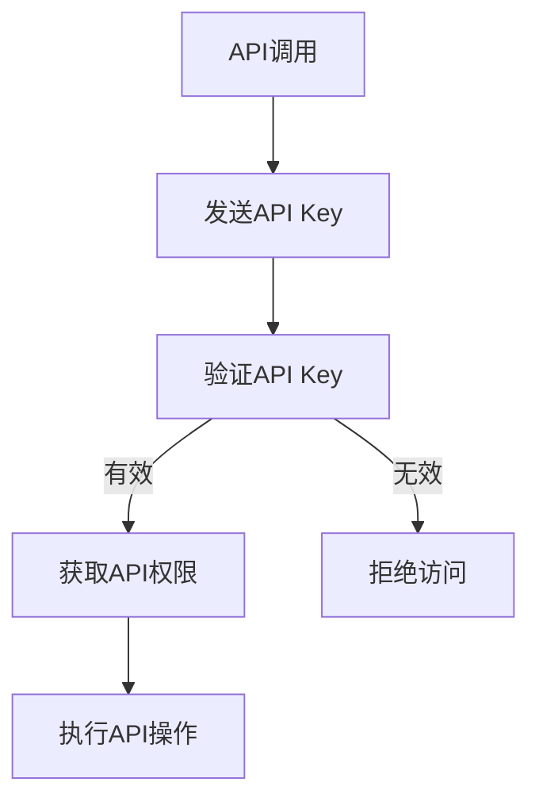

                 

API（应用程序编程接口）是现代软件开发中不可或缺的一部分。它们允许不同的软件组件或服务之间进行交互，促进了数据的共享和功能的扩展。然而，随着API的使用日益广泛，安全性问题也日益突出。在此背景下，分级API Key的概念应运而生，它提供了一种灵活且安全的方法来管理和控制API的访问。本文将探讨分级API Key的应用，包括其核心概念、算法原理、数学模型、实际案例以及未来的发展趋势。

## 关键词

- API Key
- 分级访问控制
- 安全性
- 访问控制列表
- API 网关

## 摘要

本文介绍了分级API Key的概念和其在现代API管理中的应用。通过分析其核心算法原理和数学模型，我们展示了如何通过分级API Key实现细粒度的访问控制。同时，通过实际案例和代码实例，我们详细阐述了如何在实际项目中应用分级API Key。最后，本文对分级API Key的未来发展趋势和面临的挑战进行了探讨。

## 1. 背景介绍

### API的发展

API的概念最早出现在20世纪70年代，当时被用来在计算机之间交换数据。随着互联网的兴起和Web服务的普及，API的应用场景不断扩大。现在，API已经成为了企业级应用和服务之间进行交互的桥梁，它们使得开发者能够更加高效地构建和部署复杂的软件系统。

### API安全性的挑战

尽管API在软件开发中发挥了重要作用，但它们也带来了安全性的挑战。未经授权的访问、数据泄露、API滥用等问题时有发生。特别是在移动应用和云计算环境中，API的安全性问题更加突出。为了应对这些挑战，开发者需要采取一系列安全措施，其中之一就是分级API Key。

### 分级API Key的概念

分级API Key是一种基于访问控制列表（Access Control List, ACL）的机制，它通过为不同的API访问者分配不同级别的API Key，来实现细粒度的权限控制。这种机制不仅能够提高安全性，还能够根据不同的使用场景和需求，灵活地调整API的访问权限。

## 2. 核心概念与联系

### 2.1 API Key

API Key是一个唯一的标识符，用于标识API调用者。每个API调用者都需要拥有一个有效的API Key才能访问受保护的API。

### 2.2 分级访问控制

分级访问控制是一种基于角色或权限的访问控制机制，它允许系统管理员根据用户或角色的不同，定义不同的访问权限。

### 2.3 Mermaid 流程图

以下是一个简化的Mermaid流程图，展示了分级API Key的工作流程：



### 2.4 算法原理

分级API Key的核心算法是基于哈希表的访问控制列表（ACL）管理。哈希表提供了一种快速查找API Key和对应权限的方法。以下是一个简化的算法描述：

```python
# 假设我们有一个基于哈希表的访问控制列表
access_control_list = {
    "user1": ["read", "write"],
    "user2": ["read"],
    "user3": []
}

# 验证API Key
def validate_api_key(api_key):
    # 如果API Key在访问控制列表中，则返回对应权限
    if api_key in access_control_list:
        return access_control_list[api_key]
    # 否则拒绝访问
    else:
        return []

# 执行API操作
def execute_api_operation(api_key, operation):
    permissions = validate_api_key(api_key)
    if operation in permissions:
        # 执行操作
        ...
    else:
        # 拒绝操作
        ...
```

## 3. 核心算法原理 & 具体操作步骤

### 3.1 算法原理概述

分级API Key的核心原理是基于访问控制列表（ACL）的权限管理。每个API调用者都有一个唯一的API Key，该API Key关联到一个权限集合。系统通过哈希表快速查找API Key，并根据权限集合判断是否允许执行特定操作。

### 3.2 算法步骤详解

1. **发送API Key**：API调用者在进行API调用时，需要发送自己的API Key。
2. **验证API Key**：系统接收到API Key后，通过哈希表查找对应的权限集合。
3. **获取API权限**：如果API Key有效，系统返回对应的权限集合；否则拒绝访问。
4. **执行API操作**：系统根据权限集合判断是否允许执行请求的操作。

### 3.3 算法优缺点

**优点**：

- **高效性**：基于哈希表的访问控制列表（ACL）提供了一种快速查找API Key和对应权限的方法。
- **灵活性**：分级API Key允许系统管理员根据不同场景和需求，灵活地调整API的访问权限。

**缺点**：

- **复杂性**：对于大量的API Key和权限组合，管理起来可能会变得复杂。
- **安全性**：如果API Key被泄露，可能会导致未经授权的访问。

### 3.4 算法应用领域

- **企业级应用**：企业内部的不同部门和团队可以使用分级API Key来保护内部API。
- **开放API**：开放API可以通过分级API Key来控制不同用户的访问权限。
- **移动应用**：移动应用可以使用分级API Key来保护敏感数据和处理用户身份验证。

## 4. 数学模型和公式 & 详细讲解 & 举例说明

### 4.1 数学模型构建

在分级API Key的背景下，我们可以构建一个简单的数学模型来描述API权限的分配和验证过程。假设我们有以下变量：

- \( P \)：权限集合
- \( A \)：API调用者的API Key
- \( V \)：访问控制列表

数学模型可以表示为：

\[ \text{Permission}(A) = \text{get_permissions}(V, A) \]

其中，\( \text{get_permissions}(V, A) \)是一个函数，用于从访问控制列表中检索与API Key \( A \)关联的权限集合。

### 4.2 公式推导过程

为了推导这个公式，我们需要了解访问控制列表的结构和API Key的验证过程。假设访问控制列表是一个哈希表，其中键是API Key，值是权限集合。我们可以将访问控制列表表示为：

\[ V = \{ A_1: P_1, A_2: P_2, \ldots \} \]

其中，\( A_i \)是API Key，\( P_i \)是与 \( A_i \)关联的权限集合。

验证API Key的过程可以分为以下几个步骤：

1. 接收API调用者的API Key \( A \)。
2. 在访问控制列表 \( V \)中查找与 \( A \)匹配的权限集合。
3. 如果找到匹配项，返回相应的权限集合；否则返回空集。

基于上述步骤，我们可以推导出以下公式：

\[ \text{Permission}(A) = \left\{
\begin{array}{ll}
P_j & \text{如果 } A = A_j \text{ 且 } P_j \neq \emptyset \\
\emptyset & \text{否则}
\end{array}
\right. \]

其中，\( P_j \)是与 \( A \)匹配的权限集合。

### 4.3 案例分析与讲解

假设我们有一个简单的访问控制列表 \( V \)：

\[ V = \{ user1: \{ "read", "write" \}, user2: \{ "read" \}, user3: \emptyset \} \]

现在，我们分别验证三个API调用者的API Key：

1. **user1**：由于 \( user1 \)的API Key在访问控制列表中，并且关联了一个非空的权限集合，所以 \( \text{Permission}(user1) = \{ "read", "write" \} \)。
2. **user2**：同样地，\( user2 \)的API Key在访问控制列表中，但只关联了一个“read”权限，因此 \( \text{Permission}(user2) = \{ "read" \} \)。
3. **user3**：由于 \( user3 \)的API Key在访问控制列表中，但关联了一个空集，所以 \( \text{Permission}(user3) = \emptyset \)。

通过这个简单的案例，我们可以看到如何使用数学模型和公式来验证API Key，并根据权限集合决定是否允许执行特定的API操作。

## 5. 项目实践：代码实例和详细解释说明

### 5.1 开发环境搭建

在开始实现分级API Key之前，我们需要搭建一个简单的开发环境。这里，我们将使用Python作为编程语言，并结合Flask框架来创建一个API服务。以下是搭建开发环境的基本步骤：

1. 安装Python：确保你的系统中已经安装了Python 3.x版本。
2. 安装Flask：通过以下命令安装Flask：
   ```bash
   pip install flask
   ```
3. 创建一个名为 `api_project` 的目录，并在此目录下创建一个名为 `app.py` 的文件，用于编写API服务代码。

### 5.2 源代码详细实现

以下是 `app.py` 的源代码实现，包括API Key的生成、验证和权限控制：

```python
from flask import Flask, request, jsonify
from functools import wraps

app = Flask(__name__)

# 假设这是我们的访问控制列表
access_control_list = {
    "user1": ["read", "write"],
    "user2": ["read"],
    "user3": []
}

# 装饰器：验证API Key
def require_api_key(api_key_name='api_key'):
    def decorator(f):
        @wraps(f)
        def decorated_function(*args, **kwargs):
            api_key = request.headers.get(api_key_name)
            permissions = validate_api_key(api_key)
            if not permissions:
                return jsonify({'error': 'Unauthorized'}), 401
            return f(*args, **kwargs)
        return decorated_function
    return decorator

# 验证API Key
def validate_api_key(api_key):
    return access_control_list.get(api_key, [])

# API端点：获取用户信息
@app.route('/user', methods=['GET'])
@require_api_key()
def get_user_info():
    user_info = {
        "user1": {"name": "Alice", "status": "active"},
        "user2": {"name": "Bob", "status": "inactive"},
        "user3": {"name": "Charlie", "status": "unknown"},
    }
    user_id = request.args.get('id')
    if user_id in user_info:
        return jsonify(user_info[user_id])
    else:
        return jsonify({'error': 'User not found'}), 404

if __name__ == '__main__':
    app.run(debug=True)
```

### 5.3 代码解读与分析

在上面的代码中，我们定义了一个简单的Flask应用程序，并实现了以下关键部分：

- **访问控制列表**：`access_control_list` 是一个字典，存储了每个API调用者的API Key和对应的权限集合。
- **验证API Key的装饰器**：`require_api_key` 是一个装饰器，用于在需要验证API Key的API端点前检查API Key的有效性。
- **验证API Key**：`validate_api_key` 函数用于验证传入的API Key，如果API Key存在于访问控制列表中，则返回对应的权限集合；否则返回空集。
- **API端点**：`get_user_info` 是一个简单的API端点，用于获取特定用户的信息。它使用 `require_api_key` 装饰器来验证API Key。

### 5.4 运行结果展示

要运行上述代码，请执行以下命令：

```bash
python app.py
```

程序将在本地服务器上启动，通常默认端口是5000。你可以使用以下命令在浏览器中访问API：

```bash
http://localhost:5000/user?id=user1
```

这将返回用户 "Alice" 的信息。尝试使用不同的API Key（例如 "user2" 或 "user3"）来测试访问控制。

## 6. 实际应用场景

### 6.1 企业内部API

在企业内部，分级API Key可以用来保护敏感数据和服务。例如，不同的部门可能需要访问不同的数据集或服务，通过分级API Key，可以确保只有具有相应权限的部门能够访问这些资源。

### 6.2 开放API

对于开放API，分级API Key可以用来控制不同用户的访问权限。例如，一个社交媒体平台可以允许普通用户查看公共信息，但只有付费用户才能访问高级功能。

### 6.3 移动应用

在移动应用中，分级API Key可以用来保护用户数据和身份验证。例如，一个移动银行应用可以使用分级API Key来确保只有经过身份验证的用户才能访问账户信息。

## 7. 未来应用展望

### 7.1 智能化权限管理

随着人工智能技术的发展，未来的分级API Key可能会集成更多的智能化元素，例如机器学习模型，用于自动调整和优化权限设置。

### 7.2 多因素认证

未来的分级API Key可能会结合多因素认证（MFA）机制，提供更高级别的安全性。

### 7.3 跨平台集成

随着微服务和云计算的普及，分级API Key将在跨平台和跨服务的管理中发挥更大的作用。

## 8. 工具和资源推荐

### 8.1 学习资源推荐

- 《API设计：创建伟大的API的艺术》
- 《RESTful Web API设计：处理接口、版本化和认证》

### 8.2 开发工具推荐

- Postman：用于API调试和测试。
- Swagger：用于生成API文档。

### 8.3 相关论文推荐

- "Access Control in a Resource-Oriented Architecture"
- "The Design of the UNIX Time-Sharing System"

## 9. 总结：未来发展趋势与挑战

### 9.1 研究成果总结

分级API Key作为一种灵活且安全的访问控制机制，已经在多个应用场景中得到了验证。未来的研究可能会集中在如何进一步优化和智能化权限管理机制。

### 9.2 未来发展趋势

未来的发展趋势包括更高级别的安全性和智能化管理，以及更广泛的跨平台和跨服务集成。

### 9.3 面临的挑战

面临的挑战包括如何处理大量API Key和权限组合的复杂性，以及如何确保API Key的安全存储和传输。

### 9.4 研究展望

未来的研究可以关注如何利用人工智能和区块链技术来提升分级API Key的安全性和灵活性。

## 附录：常见问题与解答

### Q：分级API Key如何处理并发访问？

A：分级API Key通常使用线程安全的哈希表或并发数据结构来处理并发访问。这样可以确保在多个请求同时访问时，权限验证过程不会出现冲突或错误。

### Q：如果API Key被泄露，如何处理？

A：如果API Key被泄露，应立即将其从访问控制列表中移除，并生成一个新的API Key分配给受影响的用户。此外，可以考虑采取额外的安全措施，如多因素认证（MFA）来增强安全性。

### Q：分级API Key如何支持API版本控制？

A：分级API Key可以通过为每个API版本分配一个唯一的标识符来支持API版本控制。访问控制列表可以根据API版本动态调整权限设置，确保旧版本的API访问者不会意外访问新版本的API。

