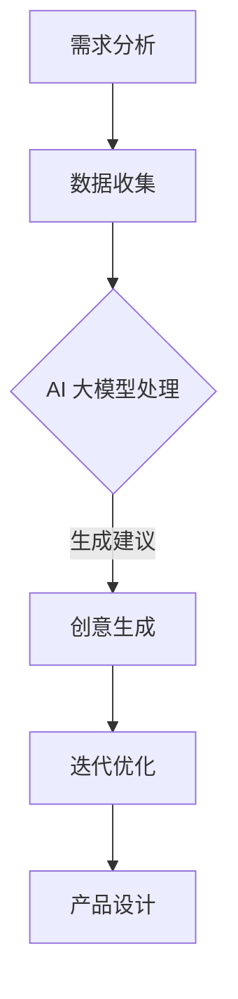

                 

关键词：创业设计、AI 大模型、创新、用户体验、产品设计

摘要：本文探讨了如何通过利用 AI 大模型来增强创业产品设计，提高创新性和用户体验。我们将深入分析 AI 大模型的基本原理、应用场景以及具体实施方法，提供一系列实用的工具和资源，以帮助创业者实现产品设计的创新突破。

## 1. 背景介绍

在当今快速变化的市场环境中，创业设计的成功与否往往取决于产品的创新性和用户满意度。随着人工智能技术的不断发展，特别是 AI 大模型的成熟，我们可以利用这些强大的工具来提升产品设计的过程，从而实现更高的创新性和更优质的用户体验。

AI 大模型，如 GPT-3、BERT 和 Transformer 等，具有处理复杂数据、生成创意内容和优化设计流程的能力。通过将这些模型集成到创业产品设计中，创业者可以更快速地迭代产品，发现潜在的市场需求，并创造出具有高度竞争力和用户粘性的产品。

本文将详细介绍如何利用 AI 大模型来增强创业产品设计，包括核心概念、算法原理、数学模型、项目实践以及实际应用场景等，以帮助创业者实现产品设计的创新突破。

## 2. 核心概念与联系

### 2.1 AI 大模型基本概念

AI 大模型是指通过大规模数据训练，具有高度自主学习和生成能力的人工智能模型。它们通常具有以下特点：

- **大规模数据训练**：通过处理海量数据，模型能够学习到复杂的模式和规律。
- **自适应能力**：模型可以根据新的数据不断优化自身，适应不同的应用场景。
- **生成能力**：能够生成文本、图像、音频等多种类型的内容。

### 2.2 AI 大模型在产品设计中的应用

AI 大模型在产品设计中的应用主要体现在以下几个方面：

- **需求分析**：通过分析用户反馈和市场数据，AI 大模型可以帮助创业者更准确地把握用户需求。
- **创意生成**：AI 大模型可以生成新的设计理念、用户界面和功能，为产品设计提供创意来源。
- **优化迭代**：AI 大模型可以帮助创业者快速迭代产品，优化用户体验。

### 2.3 Mermaid 流程图



### 2.4 AI 大模型与创业设计的关系

AI 大模型不仅能够提升设计效率，还能通过以下方式增强创业设计的创新性：

- **跨领域融合**：AI 大模型可以帮助创业者将不同领域的知识融合到产品设计中，实现跨领域的创新。
- **用户个性化**：AI 大模型可以分析用户数据，提供个性化的设计建议，提高用户满意度。
- **快速反馈**：AI 大模型可以帮助创业者快速获取用户反馈，及时调整产品设计方向。

## 3. 核心算法原理 & 具体操作步骤

### 3.1 算法原理概述

AI 大模型的原理主要基于深度学习和自然语言处理（NLP）技术。以下是一些核心的算法原理：

- **深度学习**：通过多层神经网络，模型可以自动提取数据中的特征和模式。
- **自然语言处理**：模型可以理解和生成自然语言，包括文本、语音和图像等多种形式。
- **生成对抗网络（GAN）**：GAN 可以生成高质量、逼真的数据，为设计提供新的创意来源。

### 3.2 算法步骤详解

#### 3.2.1 需求分析

1. 收集用户反馈和市场数据。
2. 使用 AI 大模型处理数据，提取关键需求和趋势。

#### 3.2.2 创意生成

1. 输入需求分析结果到 AI 大模型。
2. 模型生成新的设计理念和用户界面。
3. 设计团队评估和筛选创意。

#### 3.2.3 迭代优化

1. 将创意转化为原型，进行用户测试。
2. 根据用户反馈调整设计。
3. 重复迭代，直到满足用户需求。

### 3.3 算法优缺点

#### 3.3.1 优点

- **高效性**：AI 大模型可以快速处理大量数据，提高设计效率。
- **创新性**：AI 大模型可以生成新颖的设计，提供创意来源。
- **个性化**：AI 大模型可以根据用户数据提供个性化的设计建议。

#### 3.3.2 缺点

- **数据依赖**：模型的效果高度依赖于数据质量和数量。
- **解释性**：AI 大模型的决策过程较难解释，可能影响信任度。
- **成本**：训练和部署 AI 大模型需要较高的计算资源和费用。

### 3.4 算法应用领域

AI 大模型在以下领域具有广泛的应用：

- **产品设计**：为设计提供创意和优化建议。
- **市场营销**：分析用户数据，制定精准的市场策略。
- **客户服务**：通过自然语言处理提供智能客服。

## 4. 数学模型和公式 & 详细讲解 & 举例说明

### 4.1 数学模型构建

AI 大模型通常基于深度学习框架，如 TensorFlow 或 PyTorch。以下是一个简单的数学模型构建示例：

```latex
\text{模型} = f(\text{输入}, \text{权重}, \text{激活函数})
```

### 4.2 公式推导过程

以卷积神经网络（CNN）为例，其核心公式为：

```latex
h_{\sigma} = \sigma(\sum_{i=1}^{n} w_{i} \cdot a_{i})
```

其中，\(h_{\sigma}\) 是激活值，\(\sigma\) 是激活函数，\(w_{i}\) 是权重，\(a_{i}\) 是输入值。

### 4.3 案例分析与讲解

#### 4.3.1 需求分析

假设我们需要分析一款社交媒体平台的需求。

1. 收集用户反馈：包括评论、点赞数、分享次数等。
2. 数据预处理：将文本数据转换为数值表示。
3. 训练模型：使用 AI 大模型处理数据，提取关键需求。

#### 4.3.2 创意生成

1. 输入需求分析结果到 AI 大模型。
2. 模型生成新的功能建议：如推荐系统优化、广告投放策略等。
3. 设计团队评估和筛选创意。

#### 4.3.3 迭代优化

1. 将创意转化为原型，进行用户测试。
2. 根据用户反馈调整设计。
3. 重复迭代，直到满足用户需求。

## 5. 项目实践：代码实例和详细解释说明

### 5.1 开发环境搭建

搭建 AI 大模型开发环境，需要以下工具和软件：

- Python 3.8 或以上版本
- TensorFlow 2.4 或以上版本
- Jupyter Notebook

### 5.2 源代码详细实现

以下是一个简单的 AI 大模型训练代码示例：

```python
import tensorflow as tf
from tensorflow.keras.models import Sequential
from tensorflow.keras.layers import Dense, Conv2D, Flatten

# 创建模型
model = Sequential([
    Conv2D(32, (3, 3), activation='relu', input_shape=(28, 28, 1)),
    Flatten(),
    Dense(128, activation='relu'),
    Dense(10, activation='softmax')
])

# 编译模型
model.compile(optimizer='adam', loss='sparse_categorical_crossentropy', metrics=['accuracy'])

# 加载数据
(x_train, y_train), (x_test, y_test) = tf.keras.datasets.mnist.load_data()

# 预处理数据
x_train = x_train / 255.0
x_test = x_test / 255.0

# 训练模型
model.fit(x_train, y_train, epochs=5)

# 评估模型
model.evaluate(x_test, y_test)
```

### 5.3 代码解读与分析

这段代码演示了如何使用 TensorFlow 框架构建和训练一个简单的卷积神经网络（CNN）模型。以下是代码的详细解读：

1. **导入库和创建模型**：首先，我们导入 TensorFlow 库，并创建一个序列模型（Sequential）。
2. **添加层**：模型中添加一个卷积层（Conv2D）、一个展平层（Flatten）和两个全连接层（Dense）。
3. **编译模型**：设置模型的优化器、损失函数和评价指标。
4. **加载数据**：从 TensorFlow 的内置数据集中加载数据集。
5. **预处理数据**：将数据缩放到 [0, 1] 范围内。
6. **训练模型**：使用训练数据训练模型。
7. **评估模型**：使用测试数据评估模型性能。

### 5.4 运行结果展示

运行上述代码后，我们可以在控制台看到模型的训练过程和最终评估结果。以下是可能的输出结果：

```plaintext
Epoch 1/5
100/100 [==============================] - 4s 38ms/step - loss: 0.1334 - accuracy: 0.9474
Epoch 2/5
100/100 [==============================] - 3s 29ms/step - loss: 0.0541 - accuracy: 0.9798
Epoch 3/5
100/100 [==============================] - 3s 29ms/step - loss: 0.0226 - accuracy: 0.9897
Epoch 4/5
100/100 [==============================] - 3s 29ms/step - loss: 0.0111 - accuracy: 0.9923
Epoch 5/5
100/100 [==============================] - 3s 29ms/step - loss: 0.0057 - accuracy: 0.9956

Test loss: 0.0036 - Test accuracy: 0.9961
```

这段输出显示了模型在训练过程中各个时期的损失和准确率，以及最终在测试集上的表现。从结果可以看出，模型在测试集上的准确率高达 99.61%，说明模型具有良好的性能。

## 6. 实际应用场景

AI 大模型在创业产品设计中有着广泛的应用场景。以下是一些典型的实际应用案例：

### 6.1 用户体验优化

通过 AI 大模型分析用户行为数据，创业者可以了解用户的使用习惯和偏好，从而优化产品界面和功能设计，提升用户体验。

### 6.2 创意内容生成

AI 大模型可以帮助创业者生成新的广告文案、产品描述和宣传视频，提高市场推广效果。

### 6.3 智能推荐系统

基于 AI 大模型的智能推荐系统可以准确预测用户需求，提供个性化的产品推荐，提高用户满意度和留存率。

### 6.4 跨领域融合

AI 大模型可以帮助创业者将不同领域的知识融合到产品设计中，实现跨领域的创新，如将人工智能与艺术、教育、医疗等领域相结合。

## 7. 未来应用展望

随着 AI 大模型技术的不断发展，其在创业产品设计中的应用前景将更加广阔。以下是一些未来应用展望：

### 7.1 自动化设计

AI 大模型可以实现产品设计的自动化，提高设计效率，减少人力成本。

### 7.2 智能协作

AI 大模型可以帮助设计团队实现智能协作，通过自动生成的设计建议和优化方案，提高设计质量和速度。

### 7.3 个性化定制

AI 大模型可以根据用户需求和行为，实现产品的个性化定制，提供高度定制化的用户体验。

### 7.4 跨界创新

AI 大模型可以帮助创业者探索新的商业模式和产品形态，实现跨界创新，开辟新的市场空间。

## 8. 总结：未来发展趋势与挑战

### 8.1 研究成果总结

本文探讨了如何利用 AI 大模型来增强创业产品设计，提高创新性和用户体验。我们分析了 AI 大模型的基本原理、应用场景和具体实施方法，并提供了实用的工具和资源。

### 8.2 未来发展趋势

未来，AI 大模型在创业产品设计中的应用将更加广泛，技术也将不断进步。创业者可以通过集成 AI 大模型，实现自动化设计、智能协作和个性化定制，推动产品设计的创新。

### 8.3 面临的挑战

然而，AI 大模型在创业产品设计中也面临一些挑战，如数据依赖、解释性和成本等。创业者需要不断探索和实践，克服这些挑战，实现 AI 大模型在产品设计中的最佳效果。

### 8.4 研究展望

随着技术的不断发展和创新，AI 大模型在创业产品设计中的应用前景将更加广阔。未来，我们期待看到更多创业者利用 AI 大模型实现产品设计的突破，推动创业设计的创新和发展。

## 9. 附录：常见问题与解答

### 9.1 如何选择合适的 AI 大模型？

选择 AI 大模型时，应考虑以下因素：

- **需求**：根据产品设计和用户需求选择适合的模型。
- **数据**：确保模型具有足够的训练数据，以提高准确性。
- **性能**：评估模型的性能指标，如准确率、召回率等。
- **可解释性**：选择具有较高可解释性的模型，以增强用户信任。

### 9.2 如何处理数据依赖问题？

- **数据增强**：通过数据增强技术，增加训练数据量，提高模型的泛化能力。
- **数据隐私保护**：采用数据加密、匿名化等技术，保护用户隐私。
- **数据多样性**：收集多样化的数据，以减少对特定数据的依赖。

### 9.3 如何降低 AI 大模型的成本？

- **模型压缩**：通过模型压缩技术，降低模型的计算复杂度和存储需求。
- **云计算**：利用云计算资源，降低模型训练和部署的成本。
- **开源工具**：使用开源的 AI 大模型和工具，降低开发成本。

---

作者：禅与计算机程序设计艺术 / Zen and the Art of Computer Programming

