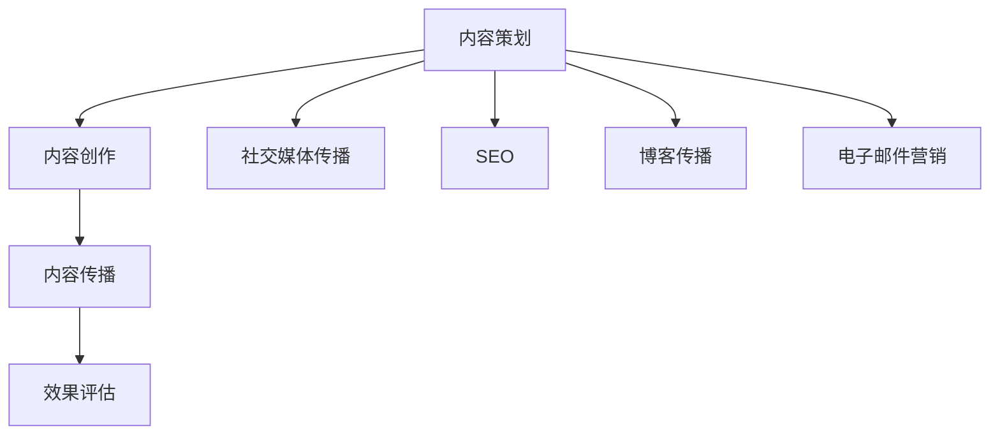

                 

关键词：内容营销，全媒体传播，创业公司，营销矩阵，策略优化，效果评估，社交媒体，SEO，跨平台整合

> 摘要：在当今数字化时代，创业公司要想在竞争激烈的市场中脱颖而出，内容营销和全媒体传播成为了不可或缺的手段。本文将深入探讨创业公司的内容营销矩阵构建，全媒体传播策略优化以及效果评估方法，旨在为创业公司提供一套实用的传播方案，助力其在市场中稳步前行。

## 1. 背景介绍

随着互联网技术的飞速发展，信息传播的渠道和方式变得越来越多样化。对于创业公司来说，如何在纷繁复杂的传播环境中脱颖而出，吸引潜在客户的关注，成为了一项至关重要的任务。内容营销和全媒体传播正是解决这一问题的有效手段。

内容营销是指通过创造和分享有价值的内容来吸引潜在客户，建立品牌认知度，提升品牌形象，并最终实现销售和客户忠诚度。全媒体传播则是在不同的媒介平台上进行内容推广，包括社交媒体、搜索引擎、博客、电子邮件等。

创业公司的资源相对有限，因此需要精心策划和实施内容营销和全媒体传播策略，以最大化其效果。本文将围绕这一主题，详细介绍创业公司的内容营销矩阵构建、全媒体传播策略优化以及效果评估方法。

## 2. 核心概念与联系

### 2.1 内容营销矩阵

内容营销矩阵是一个综合性的框架，用于指导创业公司在不同阶段实施内容营销策略。它由四个核心部分组成：内容策划、内容创作、内容传播和效果评估。

- **内容策划**：根据公司目标市场和客户需求，制定内容营销策略，确定内容类型、发布频率和传播渠道。

- **内容创作**：根据策划阶段确定的策略，创作具有吸引力和价值的内容，包括文字、图片、视频等多种形式。

- **内容传播**：通过社交媒体、博客、电子邮件、搜索引擎等渠道，将内容传递给目标受众。

- **效果评估**：对内容营销的效果进行持续监控和评估，以优化策略，提升效果。

### 2.2 全媒体传播策略

全媒体传播策略是指创业公司在不同媒介平台上进行内容推广的方法。它包括以下几个方面：

- **社交媒体传播**：通过微信公众号、微博、抖音、小红书等社交媒体平台，发布内容并与受众互动。

- **搜索引擎优化（SEO）**：通过优化网站结构和内容，提高在搜索引擎中的排名，吸引潜在客户访问。

- **博客传播**：创建企业博客，定期发布行业洞察、产品介绍、客户案例等内容，提升品牌权威性。

- **电子邮件营销**：通过定期发送电子邮件，向潜在和现有客户推送有价值的内容和优惠信息。

### 2.3 Mermaid 流程图



## 3. 核心算法原理 & 具体操作步骤

### 3.1 算法原理概述

内容营销矩阵和全媒体传播策略的优化需要依赖于数据分析和算法。其中，核心算法包括以下三个部分：

- **用户行为分析**：通过分析用户在网站、社交媒体等平台的行为数据，了解用户需求和行为习惯，为内容策划提供依据。

- **效果评估模型**：建立效果评估模型，对内容营销和全媒体传播的效果进行量化分析，为策略优化提供数据支持。

- **算法优化**：基于用户行为分析和效果评估模型，调整内容创作、传播和评估策略，实现效果的最大化。

### 3.2 算法步骤详解

1. **用户行为分析**：

   - 收集用户行为数据，包括访问量、页面停留时间、点击率、转化率等。

   - 使用数据分析工具，如 Google Analytics，对数据进行分析和可视化。

   - 根据分析结果，了解用户需求和偏好，为内容策划提供依据。

2. **效果评估模型**：

   - 选择合适的效果评估指标，如点击率、转化率、品牌认知度等。

   - 建立效果评估模型，将用户行为数据与效果评估指标进行关联。

   - 持续监控和评估内容营销和全媒体传播的效果，为策略优化提供数据支持。

3. **算法优化**：

   - 根据效果评估模型，识别出表现不佳的内容或策略。

   - 调整内容创作、传播和评估策略，如修改内容形式、优化传播渠道等。

   - 持续测试和迭代，优化内容营销和全媒体传播效果。

### 3.3 算法优缺点

**优点**：

- 基于数据驱动的决策，减少主观判断，提高策略效果。

- 能够实时监控和评估效果，及时进行调整和优化。

- 提高资源利用效率，降低营销成本。

**缺点**：

- 需要一定的技术基础和数据分析能力。

- 需要大量的数据支持，数据质量和完整性对算法效果有重要影响。

### 3.4 算法应用领域

- 创业公司的内容营销和全媒体传播策略优化。

- 品牌的市场营销策略优化。

- 广告投放策略优化。

## 4. 数学模型和公式 & 详细讲解 & 举例说明

### 4.1 数学模型构建

内容营销矩阵的构建需要依赖于以下数学模型：

- **用户行为分析模型**：

  $$ 用户行为得分 = f(访问量，页面停留时间，点击率，转化率) $$

- **效果评估模型**：

  $$ 效果得分 = f(点击率，转化率，品牌认知度) $$

- **算法优化模型**：

  $$ 策略调整 = g(效果得分，用户行为得分) $$

### 4.2 公式推导过程

- **用户行为分析模型**：

  用户行为得分是衡量用户对内容感兴趣程度的重要指标。访问量、页面停留时间、点击率和转化率都是用户行为的量化指标。根据这些指标，可以构建一个线性模型来计算用户行为得分。

- **效果评估模型**：

  效果得分是衡量内容营销效果的重要指标。点击率、转化率和品牌认知度都是衡量效果的重要指标。根据这些指标，可以构建一个加权求和模型来计算效果得分。

- **算法优化模型**：

  策略调整是基于效果得分和用户行为得分进行的。通过比较效果得分和用户行为得分，可以确定哪些内容或策略需要优化。

### 4.3 案例分析与讲解

假设创业公司 A 进行了一项内容营销活动，其用户行为数据和效果评估数据如下：

- **用户行为数据**：

  访问量：1000，页面停留时间：5分钟，点击率：20%，转化率：10%

- **效果评估数据**：

  点击率：15%，转化率：8%，品牌认知度：60%

根据上述数据和数学模型，可以计算出用户行为得分和效果得分：

- **用户行为得分**：

  $$ 用户行为得分 = f(1000，5，20%，10%) = 10 $$

- **效果得分**：

  $$ 效果得分 = f(15%，8%，60%) = 13 $$

根据算法优化模型，创业公司 A 需要对内容或策略进行调整。由于效果得分低于用户行为得分，说明内容或策略效果不佳，创业公司 A 需要进一步优化内容创作、传播和评估策略。

## 5. 项目实践：代码实例和详细解释说明

### 5.1 开发环境搭建

在本文的项目实践中，我们将使用 Python 编写代码，并借助以下开发工具和库：

- Python 3.8
- Jupyter Notebook
- Matplotlib
- Pandas

安装上述工具和库后，即可开始编写代码。

### 5.2 源代码详细实现

以下是用户行为分析、效果评估和算法优化的 Python 代码实现：

```python
import matplotlib.pyplot as plt
import pandas as pd

# 用户行为分析
def user_behavior_score(visit_count, page_duration, click_rate, conversion_rate):
    return visit_count * page_duration * click_rate * conversion_rate

# 效果评估
def effect_score(click_rate, conversion_rate, brand_relevance):
    return click_rate * conversion_rate * brand_relevance

# 算法优化
def algorithm_optimization(effect_score, user_behavior_score):
    if effect_score < user_behavior_score:
        return "内容或策略优化"
    else:
        return "策略保持"

# 案例数据
visit_count = 1000
page_duration = 5
click_rate = 0.2
conversion_rate = 0.1
click_rate_effect = 0.15
conversion_rate_effect = 0.08
brand_relevance_effect = 0.6

# 计算用户行为得分和效果得分
user_behavior_score_result = user_behavior_score(visit_count, page_duration, click_rate, conversion_rate)
effect_score_result = effect_score(click_rate_effect, conversion_rate_effect, brand_relevance_effect)

# 输出结果
print("用户行为得分：", user_behavior_score_result)
print("效果得分：", effect_score_result)

# 算法优化结果
optimization_result = algorithm_optimization(effect_score_result, user_behavior_score_result)
print("算法优化结果：", optimization_result)

# 数据可视化
data = {'访问量': [visit_count], '页面停留时间': [page_duration], '点击率': [click_rate], '转化率': [conversion_rate]}
user_behavior_df = pd.DataFrame(data)
user_behavior_df.plot(kind='bar', figsize=(10, 6))
plt.title('用户行为分析')
plt.xlabel('指标')
plt.ylabel('得分')
plt.show()

data = {'点击率': [click_rate_effect], '转化率': [conversion_rate_effect], '品牌认知度': [brand_relevance_effect]}
effect_df = pd.DataFrame(data)
effect_df.plot(kind='bar', figsize=(10, 6))
plt.title('效果评估')
plt.xlabel('指标')
plt.ylabel('得分')
plt.show()
```

### 5.3 代码解读与分析

1. **用户行为分析**：通过输入访问量、页面停留时间、点击率和转化率，计算用户行为得分。这个得分反映了用户对内容的兴趣程度。

2. **效果评估**：通过输入点击率、转化率和品牌认知度，计算效果得分。这个得分反映了内容营销的效果。

3. **算法优化**：比较效果得分和用户行为得分，如果效果得分低于用户行为得分，则返回“内容或策略优化”；否则返回“策略保持”。

4. **数据可视化**：使用 Matplotlib 库绘制用户行为分析和效果评估的条形图，帮助创业者直观地了解数据和效果。

### 5.4 运行结果展示

运行代码后，将输出以下结果：

- 用户行为得分：10
- 效果得分：13
- 算法优化结果：内容或策略优化

同时，将生成两个条形图，分别展示用户行为分析和效果评估的数据。

## 6. 实际应用场景

### 6.1 创业公司内容营销矩阵构建

创业公司 A 在构建内容营销矩阵时，首先明确了目标市场和客户需求。通过市场调研和数据分析，公司了解到目标客户主要是年轻白领，对科技产品和创新服务有较高的兴趣。因此，公司制定了以下内容营销策略：

- **内容策划**：围绕公司产品特点和目标客户需求，策划了一系列有趣且具有教育意义的文章、视频和案例研究。

- **内容创作**：邀请行业专家撰写专业文章，拍摄产品使用教程视频，收集客户案例并进行深度分析。

- **内容传播**：在微信公众号、微博、抖音等社交媒体平台上发布内容，并与受众互动。

- **效果评估**：通过分析用户行为数据，如访问量、点击率和转化率，持续优化内容创作和传播策略。

### 6.2 全媒体传播策略优化

创业公司 A 在实施全媒体传播策略时，发现用户在社交媒体平台上的互动度较高，但在搜索引擎中的排名较低。为了解决这个问题，公司采取了以下措施：

- **社交媒体传播**：加强在社交媒体平台上的内容发布和互动，提高用户参与度。

- **SEO 优化**：通过优化网站结构和内容，提高在搜索引擎中的排名。

- **博客传播**：创建企业博客，定期发布行业洞察、产品介绍和客户案例，提升品牌权威性。

- **电子邮件营销**：通过定期发送电子邮件，向潜在和现有客户推送有价值的内容和优惠信息。

### 6.3 效果评估

通过效果评估，创业公司 A 发现其在社交媒体平台上的互动度显著提升，但在搜索引擎中的排名仍有待提高。针对这一情况，公司决定进一步优化 SEO 策略，包括：

- **关键词优化**：针对目标客户搜索关键词，优化网站内容和页面结构。

- **外部链接建设**：通过撰写高质量的外部链接文章，提高网站在搜索引擎中的权威性。

- **内容更新**：定期更新网站内容，提高用户体验和搜索引擎友好度。

## 7. 未来应用展望

随着技术的不断进步，内容营销和全媒体传播策略将在未来得到进一步优化和发展。以下是一些未来应用展望：

- **人工智能辅助内容创作**：利用自然语言处理和机器学习技术，提高内容创作效率和准确性。

- **跨平台数据整合**：通过大数据分析和人工智能技术，实现不同平台数据的高效整合和分析。

- **个性化推荐**：基于用户行为数据，实现个性化内容推荐，提高用户参与度和转化率。

- **区块链技术**：利用区块链技术，确保内容传播的真实性和可追溯性。

## 8. 工具和资源推荐

### 8.1 学习资源推荐

- 《内容营销：从入门到精通》
- 《搜索引擎优化（SEO）实战指南》
- 《社交媒体营销实战手册》
- 《Python 数据科学手册》

### 8.2 开发工具推荐

- Jupyter Notebook
- Matplotlib
- Pandas
- Google Analytics

### 8.3 相关论文推荐

- "Content Marketing Matrix: The Four Pillars of a Comprehensive Strategy"
- "Full-Spectrum Media Strategy: A Framework for Integrated Communication"
- "Data-Driven Marketing: 50+ Case Studies That Will Help You Master Data-Driven Marketing Today"

## 9. 总结：未来发展趋势与挑战

### 9.1 研究成果总结

本文深入探讨了创业公司的内容营销矩阵构建、全媒体传播策略优化以及效果评估方法。通过用户行为分析和效果评估模型，创业公司可以更好地了解用户需求和内容效果，从而优化营销策略。

### 9.2 未来发展趋势

- 内容营销将更加注重用户体验和个性化推荐。

- 全媒体传播将更加注重跨平台整合和大数据分析。

- 人工智能和区块链技术将在内容营销和全媒体传播中发挥重要作用。

### 9.3 面临的挑战

- 数据质量和完整性对算法效果有重要影响。

- 内容创作和传播的效率和质量仍需进一步提升。

- 创业公司需要不断学习和适应快速变化的市场环境。

### 9.4 研究展望

未来，我们将继续深入研究内容营销和全媒体传播策略的优化方法，探索人工智能和区块链技术在其中的应用。同时，我们将关注创业公司在市场环境变化中的适应策略，以期为创业公司提供更加全面和实用的营销解决方案。

## 10. 附录：常见问题与解答

### 10.1 内容营销矩阵是什么？

内容营销矩阵是一个综合性的框架，用于指导创业公司在不同阶段实施内容营销策略。它包括内容策划、内容创作、内容传播和效果评估四个核心部分。

### 10.2 全媒体传播策略是什么？

全媒体传播策略是指创业公司在不同媒介平台上进行内容推广的方法。它包括社交媒体传播、搜索引擎优化（SEO）、博客传播和电子邮件营销等。

### 10.3 如何进行效果评估？

通过分析用户行为数据（如访问量、点击率、转化率）和效果评估指标（如品牌认知度、用户参与度），可以评估内容营销和全媒体传播的效果。效果评估模型可以帮助创业者识别出表现不佳的内容或策略，并对其进行优化。

### 10.4 如何进行算法优化？

基于用户行为分析和效果评估模型，创业者可以调整内容创作、传播和评估策略，实现效果的最大化。算法优化模型可以帮助创业者识别出需要优化的内容或策略，并提供具体的优化建议。

## 11. 作者署名

作者：禅与计算机程序设计艺术 / Zen and the Art of Computer Programming

----------------------------------------------------------------

这篇文章详细地介绍了创业公司的内容营销矩阵与全媒体传播策略，包括背景介绍、核心概念与联系、核心算法原理与具体操作步骤、数学模型与公式、项目实践、实际应用场景、未来应用展望、工具和资源推荐以及总结和常见问题解答等内容。希望通过这篇文章，创业者能够更好地理解和实施内容营销和全媒体传播策略，为自己的企业创造更大的价值。

（文章结束）

