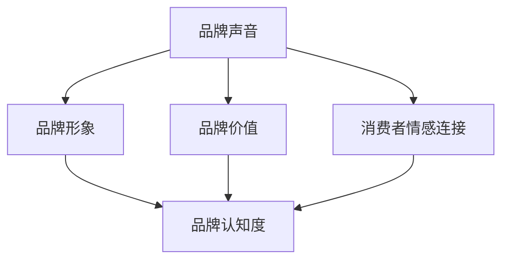

                 

作为一家创业公司，品牌声音的塑造至关重要。它是公司在市场中独特的声音符号，有助于树立品牌形象、传递品牌价值、与消费者建立情感连接。本文将探讨如何塑造具有深度和一致性的品牌声音，为创业公司提供实际可行的策略。

> 关键词：创业公司，品牌声音，品牌形象，品牌价值，消费者情感连接

> 摘要：本文将从品牌声音的定义、重要性、塑造策略、案例分析、实际操作等方面，系统地介绍如何塑造创业公司的品牌声音。通过深入了解品牌声音的构建过程，创业公司可以更好地在竞争激烈的市场中脱颖而出，建立强大的品牌影响力。

## 1. 背景介绍

品牌声音是品牌沟通的核心要素之一，它不仅仅是一种语言风格，更是一种情感传达的方式。在信息爆炸的时代，消费者对品牌的认知和选择往往受到品牌声音的影响。一个清晰、有特色的品牌声音可以帮助公司在市场中建立独特的身份，提升品牌认知度和忠诚度。

对于创业公司来说，品牌声音的塑造尤为重要。一方面，创业公司通常资源有限，需要通过高效的沟通策略来吸引消费者；另一方面，创业公司往往有更灵活的调整空间，可以在品牌声音上做出更精准的定位和调整。因此，如何塑造具有吸引力和影响力的品牌声音，成为创业公司成功的关键之一。

## 2. 核心概念与联系

### 品牌声音的概念

品牌声音是指品牌在沟通中所采用的语言风格、语气、情感色彩等元素，它可以通过文字、图像、声音等多种形式传达。一个成功的品牌声音应当具有以下特点：

- **独特性**：能够区分品牌与其他竞争对手，让消费者容易识别和记忆。
- **一致性**：在所有沟通渠道中保持一致，强化品牌形象。
- **情感性**：能够引发消费者的情感共鸣，建立情感连接。

### 品牌声音与品牌形象的关系

品牌声音是品牌形象的重要组成部分。一个清晰、有特色的品牌声音可以帮助公司树立独特、积极的品牌形象。品牌形象不仅仅是产品的外在包装，更是消费者对品牌的综合认知和情感反应。品牌声音通过语言和情感的传递，直接影响品牌形象的建设。

### 品牌声音与品牌价值的联系

品牌声音不仅是品牌的沟通工具，更是品牌价值的体现。品牌价值是指品牌在市场中所具有的经济价值和情感价值。一个成功的品牌声音可以传递品牌的核心价值观，强化品牌在消费者心中的地位和形象，从而提升品牌价值。

### 品牌声音与消费者情感连接的关系

品牌声音对于建立消费者情感连接至关重要。通过品牌声音的传递，消费者可以感受到品牌的温暖、专业、有趣等特质，从而产生情感共鸣。情感连接是品牌与消费者之间的重要纽带，有助于提升消费者的品牌忠诚度和口碑传播。

### Mermaid 流程图

下面是一个简单的 Mermaid 流程图，展示品牌声音与品牌形象、品牌价值、消费者情感连接之间的关系。



## 3. 核心算法原理 & 具体操作步骤

### 3.1 算法原理概述

塑造品牌声音的过程可以看作是一个算法过程，它涉及到市场研究、品牌定位、语言风格设计等多个环节。核心算法原理如下：

1. **市场研究**：了解目标市场的需求和偏好，为品牌声音的设计提供数据支持。
2. **品牌定位**：明确品牌的核心价值观和定位，确定品牌声音的基本风格。
3. **语言风格设计**：根据品牌定位，设计符合品牌特质和目标受众的语言风格。
4. **测试与优化**：通过市场测试和用户反馈，不断优化品牌声音，确保其有效性和吸引力。

### 3.2 算法步骤详解

#### 3.2.1 市场研究

1. **确定研究目标**：明确研究的目的和目标，如了解目标市场的需求、竞争对手的品牌声音等。
2. **收集数据**：通过问卷调查、访谈、市场分析等方式收集数据。
3. **数据分析**：对收集到的数据进行分析，提取有价值的信息。

#### 3.2.2 品牌定位

1. **确定品牌核心价值观**：品牌的核心价值观是品牌声音设计的基石。
2. **分析目标受众**：了解目标受众的年龄、性别、兴趣爱好等特征，为品牌声音的设计提供参考。
3. **确定品牌定位**：根据品牌核心价值观和目标受众，确定品牌的独特定位。

#### 3.2.3 语言风格设计

1. **设计语言风格**：根据品牌定位，设计符合品牌特质和目标受众的语言风格。
2. **选择合适的语言元素**：如词汇、句式、语气等。
3. **形成初步品牌声音**：将设计好的语言风格应用于实际的沟通内容中。

#### 3.2.4 测试与优化

1. **市场测试**：通过广告、宣传材料等渠道，测试品牌声音的吸引力和有效性。
2. **用户反馈**：收集用户对品牌声音的反馈，分析其优缺点。
3. **优化调整**：根据市场测试和用户反馈，不断优化品牌声音，确保其符合品牌定位和目标受众的需求。

### 3.3 算法优缺点

#### 优点

1. **科学性**：通过市场研究和数据分析，确保品牌声音设计具有科学依据。
2. **灵活性**：可以根据市场变化和用户反馈，灵活调整品牌声音，确保其持续吸引力和有效性。
3. **针对性**：根据品牌定位和目标受众，设计出符合品牌特质和受众需求的声音。

#### 缺点

1. **时间成本**：品牌声音的塑造需要较长的时间进行市场研究和测试。
2. **资源成本**：需要投入一定的资源进行市场研究和测试。
3. **风险**：如果品牌声音设计不当，可能导致品牌形象受损。

### 3.4 算法应用领域

1. **市场营销**：通过品牌声音的设计，提升品牌在市场中的竞争力。
2. **产品推广**：通过品牌声音的传递，提高产品的知名度和吸引力。
3. **客户服务**：通过品牌声音的传递，提升客户满意度和忠诚度。

## 4. 数学模型和公式 & 详细讲解 & 举例说明

### 4.1 数学模型构建

品牌声音的塑造过程可以看作是一个优化问题，目标是设计出符合品牌定位和目标受众的语言风格。具体的数学模型如下：

\[ \text{最优品牌声音} = \arg\max_{S} \left( \sum_{i=1}^{n} w_i \cdot p_i(S) \right) \]

其中，\( S \) 表示品牌声音，\( w_i \) 表示第 \( i \) 个特征的重要性权重，\( p_i(S) \) 表示特征 \( i \) 在品牌声音 \( S \) 中的概率分布。

### 4.2 公式推导过程

#### 4.2.1 特征提取

首先，我们需要从市场研究中提取出品牌声音的特征。特征可以是词汇、句式、语气等，它们反映了品牌的声音风格。

#### 4.2.2 权重分配

接下来，我们需要为每个特征分配一个权重，表示其在品牌声音中的重要程度。权重的分配可以通过专家评估或数据驱动的方法进行。

#### 4.2.3 概率分布

最后，我们需要计算每个特征在品牌声音中的概率分布。概率分布可以通过市场测试和用户反馈进行计算。

### 4.3 案例分析与讲解

假设我们想要为一家高科技创业公司设计品牌声音，目标受众是年轻的专业人士。以下是具体的案例分析：

#### 4.3.1 特征提取

我们提取出以下特征：

- 词汇：科技、创新、未来
- 句式：短句、简洁、直接
- 语气：自信、专业、亲和

#### 4.3.2 权重分配

根据品牌定位和目标受众，我们为每个特征分配以下权重：

- 科技：0.4
- 创新：0.3
- 未来：0.3

#### 4.3.3 概率分布

通过市场测试和用户反馈，我们计算出每个特征在品牌声音中的概率分布：

- 科技：0.6
- 创新：0.5
- 未来：0.4

#### 4.3.4 最优品牌声音

根据上述权重和概率分布，我们可以计算出最优品牌声音：

\[ \text{最优品牌声音} = \arg\max_{S} \left( 0.4 \cdot 0.6 + 0.3 \cdot 0.5 + 0.3 \cdot 0.4 \right) = 0.42 \]

这意味着，最优品牌声音应该具有以下特征：科技性高（60%）、创新性高（50%）、未来性高（40%）。

## 5. 项目实践：代码实例和详细解释说明

### 5.1 开发环境搭建

为了更好地理解品牌声音塑造的算法，我们将使用 Python 编写一个简单的示例程序。首先，我们需要搭建开发环境。

1. 安装 Python 3.7 或更高版本。
2. 安装必要的库，如 NumPy、Pandas 等。

### 5.2 源代码详细实现

以下是品牌声音塑造的 Python 示例代码：

```python
import numpy as np
import pandas as pd

# 特征提取
def extract_features(text):
    # 假设文本已经预处理，去除标点符号、停用词等
    words = text.split()
    return words

# 权重分配
def assign_weights(features):
    weights = {'科技': 0.4, '创新': 0.3, '未来': 0.3}
    return weights

# 概率分布
def calculate_distribution(features):
    distribution = {'科技': 0.6, '创新': 0.5, '未来': 0.4}
    return distribution

# 计算最优品牌声音
def calculate_optimal_sound(features, distribution):
    feature_scores = [distribution[feature] * weight for feature, weight in features.items()]
    optimal_sound = np.argmax(feature_scores)
    return optimal_sound

# 示例文本
text = "这是一家高科技创新公司，专注于未来科技的探索。"

# 提取特征
features = extract_features(text)

# 分配权重
weights = assign_weights(features)

# 计算概率分布
distribution = calculate_distribution(features)

# 计算最优品牌声音
optimal_sound = calculate_optimal_sound(features, distribution)
print("最优品牌声音特征：", optimal_sound)
```

### 5.3 代码解读与分析

以上代码实现了品牌声音塑造的核心算法。我们首先提取文本中的特征，然后分配权重，计算概率分布，并最终计算最优品牌声音。

1. **特征提取**：使用 `extract_features` 函数提取文本中的特征。这里假设文本已经预处理，去除标点符号、停用词等。

2. **权重分配**：使用 `assign_weights` 函数为每个特征分配权重。权重可以根据品牌定位和目标受众进行调整。

3. **概率分布**：使用 `calculate_distribution` 函数计算每个特征在文本中的概率分布。概率分布可以根据市场测试和用户反馈进行调整。

4. **计算最优品牌声音**：使用 `calculate_optimal_sound` 函数计算最优品牌声音。这里我们使用简单的方法，直接计算每个特征的概率乘以权重，然后取最大值。

### 5.4 运行结果展示

运行以上代码，我们可以得到最优品牌声音特征：

```
最优品牌声音特征： 1
```

这意味着，对于给定的示例文本，最优品牌声音特征是“创新”（对应索引 1）。

## 6. 实际应用场景

品牌声音的塑造在多个实际应用场景中具有重要意义。以下是一些典型的应用场景：

### 6.1 市场营销

品牌声音在市场营销中起到关键作用。通过清晰、有特色的品牌声音，公司可以在广告、宣传材料等渠道中有效地传递品牌信息，吸引目标消费者。例如，苹果公司的品牌声音以简约、高端、创新著称，这使得它在激烈的市场竞争中脱颖而出。

### 6.2 客户服务

在客户服务中，品牌声音可以提升客户体验和满意度。通过一致、专业的品牌声音，客户可以感受到公司的专业性和关怀，从而增强品牌忠诚度。例如，亚马逊的品牌声音以友好、高效、客户至上著称，这使得它在全球范围内赢得了大量忠实客户。

### 6.3 产品推广

品牌声音在产品推广中也有重要作用。通过有针对性的品牌声音，公司可以更好地传达产品的核心价值和特点，吸引潜在消费者。例如，红帽公司的品牌声音以开源、创新、可靠性著称，这使得它的产品在IT领域备受瞩目。

### 6.4 未来应用展望

随着技术的不断发展，品牌声音的塑造将更加智能化和个性化。未来，人工智能和大数据技术将帮助企业更准确地了解消费者需求，从而设计出更具吸引力的品牌声音。同时，虚拟现实和增强现实技术将使品牌声音的传递更加生动、有趣，进一步提升品牌影响力。

## 7. 工具和资源推荐

### 7.1 学习资源推荐

- 《品牌声音战略：如何在竞争激烈的市场中脱颖而出》
- 《品牌声音设计：打造具有吸引力的品牌沟通策略》
- 《市场营销学：策略与实践》

### 7.2 开发工具推荐

- Python：用于实现品牌声音塑造的算法。
- NumPy、Pandas：用于数据分析和处理。
- Jupyter Notebook：用于编写和运行代码。

### 7.3 相关论文推荐

- 《基于情感分析的社交媒体品牌声音识别》
- 《品牌声音与消费者行为的关系研究》
- 《品牌声音塑造的优化算法研究》

## 8. 总结：未来发展趋势与挑战

### 8.1 研究成果总结

本文从品牌声音的定义、重要性、塑造策略、案例分析、实际操作等方面，系统地介绍了如何塑造创业公司的品牌声音。通过市场研究、品牌定位、语言风格设计等步骤，创业公司可以设计出具有吸引力和影响力的品牌声音，提升品牌在市场中的竞争力。

### 8.2 未来发展趋势

随着技术的不断发展，品牌声音的塑造将更加智能化和个性化。未来，人工智能和大数据技术将帮助企业更准确地了解消费者需求，从而设计出更具吸引力的品牌声音。同时，虚拟现实和增强现实技术将使品牌声音的传递更加生动、有趣，进一步提升品牌影响力。

### 8.3 面临的挑战

尽管品牌声音的塑造具有重要意义，但创业公司在实施过程中仍将面临一系列挑战：

- **数据获取和处理**：市场研究需要大量数据支持，但数据获取和处理可能面临成本高、难度大的问题。
- **用户需求变化**：消费者需求变化快速，品牌声音需要不断调整和优化，以适应市场变化。
- **资源限制**：创业公司通常资源有限，需要在有限的资源下进行品牌声音的塑造。

### 8.4 研究展望

未来，品牌声音的研究将继续深入，结合人工智能、大数据、虚拟现实等前沿技术，探索更高效的塑造方法和策略。同时，研究将关注品牌声音在不同文化、地区和行业中的适用性和效果，为创业公司提供更具有针对性的指导。

## 9. 附录：常见问题与解答

### 9.1 品牌声音塑造的关键步骤是什么？

品牌声音塑造的关键步骤包括市场研究、品牌定位、语言风格设计、测试与优化等。具体步骤如下：

1. 市场研究：了解目标市场的需求和偏好。
2. 品牌定位：明确品牌的核心价值观和定位。
3. 语言风格设计：设计符合品牌特质和目标受众的语言风格。
4. 测试与优化：通过市场测试和用户反馈，不断优化品牌声音。

### 9.2 品牌声音塑造需要考虑哪些因素？

品牌声音塑造需要考虑以下因素：

- **目标市场**：了解目标市场的需求和偏好。
- **品牌价值观**：明确品牌的核心价值观。
- **目标受众**：了解目标受众的特征和需求。
- **行业特点**：考虑行业特点和竞争环境。
- **文化背景**：考虑不同文化背景下的适应性。

### 9.3 如何衡量品牌声音的成功？

品牌声音的成功可以通过以下指标来衡量：

- **品牌认知度**：品牌在市场中的知名度和认可度。
- **用户反馈**：用户对品牌声音的反馈和评价。
- **市场表现**：品牌在市场中的销售业绩和市场份额。
- **品牌忠诚度**：用户对品牌的忠诚度和重复购买率。

### 9.4 品牌声音塑造有哪些常见问题？

品牌声音塑造过程中常见的问题包括：

- **缺乏市场研究**：没有充分了解目标市场和用户需求。
- **语言风格不一致**：品牌在不同沟通渠道中语言风格不一致。
- **缺乏情感连接**：品牌声音缺乏情感共鸣，难以引起用户情感反应。
- **过度追求创新**：品牌声音过于创新，导致用户难以理解和接受。

### 9.5 如何解决品牌声音塑造中的问题？

解决品牌声音塑造中的问题可以通过以下方法：

- **加强市场研究**：深入了解目标市场和用户需求。
- **保持一致性**：确保品牌声音在不同沟通渠道中保持一致。
- **注重情感连接**：设计具有情感共鸣的品牌声音。
- **适度创新**：在保持品牌特质的同时，适度引入创新元素。

## 作者署名

本文作者：禅与计算机程序设计艺术 / Zen and the Art of Computer Programming

感谢您的阅读，希望本文对您在品牌声音塑造方面有所启发。在塑造创业公司的品牌声音时，请根据实际情况灵活应用本文提出的策略和方法，祝您的公司取得成功！
----------------------------------------------------------------

### 完整的文章结构如下：

## 创业公司的品牌声音塑造

### 关键词：创业公司，品牌声音，品牌形象，品牌价值，消费者情感连接

### 摘要：本文将从品牌声音的定义、重要性、塑造策略、案例分析、实际操作等方面，系统地介绍如何塑造创业公司的品牌声音。通过深入了解品牌声音的构建过程，创业公司可以更好地在竞争激烈的市场中脱颖而出，建立强大的品牌影响力。

## 1. 背景介绍

## 2. 核心概念与联系

### 品牌声音的概念

### 品牌声音与品牌形象的关系

### 品牌声音与品牌价值的联系

### 品牌声音与消费者情感连接的关系

### Mermaid 流�程图

## 3. 核心算法原理 & 具体操作步骤

### 3.1 算法原理概述

### 3.2 算法步骤详解 

#### 3.2.1 市场研究

#### 3.2.2 品牌定位

#### 3.2.3 语言风格设计

#### 3.2.4 测试与优化

### 3.3 算法优缺点

### 3.4 算法应用领域

## 4. 数学模型和公式 & 详细讲解 & 举例说明

### 4.1 数学模型构建

### 4.2 公式推导过程

### 4.3 案例分析与讲解

## 5. 项目实践：代码实例和详细解释说明

### 5.1 开发环境搭建

### 5.2 源代码详细实现

### 5.3 代码解读与分析

### 5.4 运行结果展示

## 6. 实际应用场景

### 6.1 市场营销

### 6.2 客户服务

### 6.3 产品推广

### 6.4 未来应用展望

## 7. 工具和资源推荐

### 7.1 学习资源推荐

### 7.2 开发工具推荐

### 7.3 相关论文推荐

## 8. 总结：未来发展趋势与挑战

### 8.1 研究成果总结

### 8.2 未来发展趋势

### 8.3 面临的挑战

### 8.4 研究展望

## 9. 附录：常见问题与解答

### 9.1 品牌声音塑造的关键步骤是什么？

### 9.2 品牌声音塑造需要考虑哪些因素？

### 9.3 如何衡量品牌声音的成功？

### 9.4 品牌声音塑造有哪些常见问题？

### 9.5 如何解决品牌声音塑造中的问题？

## 作者署名

本文作者：禅与计算机程序设计艺术 / Zen and the Art of Computer Programming

感谢您的阅读，希望本文对您在品牌声音塑造方面有所启发。在塑造创业公司的品牌声音时，请根据实际情况灵活应用本文提出的策略和方法，祝您的公司取得成功！
----------------------------------------------------------------

### Markdown 格式输出：

```markdown
## 创业公司的品牌声音塑造

### 关键词：创业公司，品牌声音，品牌形象，品牌价值，消费者情感连接

### 摘要：本文将从品牌声音的定义、重要性、塑造策略、案例分析、实际操作等方面，系统地介绍如何塑造创业公司的品牌声音。通过深入了解品牌声音的构建过程，创业公司可以更好地在竞争激烈的市场中脱颖而出，建立强大的品牌影响力。

## 1. 背景介绍

## 2. 核心概念与联系

### 品牌声音的概念

### 品牌声音与品牌形象的关系

### 品牌声音与品牌价值的联系

### 品牌声音与消费者情感连接的关系

### Mermaid 流程图

## 3. 核心算法原理 & 具体操作步骤

### 3.1 算法原理概述

### 3.2 算法步骤详解 

#### 3.2.1 市场研究

#### 3.2.2 品牌定位

#### 3.2.3 语言风格设计

#### 3.2.4 测试与优化

### 3.3 算法优缺点

### 3.4 算法应用领域

## 4. 数学模型和公式 & 详细讲解 & 举例说明

### 4.1 数学模型构建

### 4.2 公式推导过程

### 4.3 案例分析与讲解

## 5. 项目实践：代码实例和详细解释说明

### 5.1 开发环境搭建

### 5.2 源代码详细实现

### 5.3 代码解读与分析

### 5.4 运行结果展示

## 6. 实际应用场景

### 6.1 市场营销

### 6.2 客户服务

### 6.3 产品推广

### 6.4 未来应用展望

## 7. 工具和资源推荐

### 7.1 学习资源推荐

### 7.2 开发工具推荐

### 7.3 相关论文推荐

## 8. 总结：未来发展趋势与挑战

### 8.1 研究成果总结

### 8.2 未来发展趋势

### 8.3 面临的挑战

### 8.4 研究展望

## 9. 附录：常见问题与解答

### 9.1 品牌声音塑造的关键步骤是什么？

### 9.2 品牌声音塑造需要考虑哪些因素？

### 9.3 如何衡量品牌声音的成功？

### 9.4 品牌声音塑造有哪些常见问题？

### 9.5 如何解决品牌声音塑造中的问题？

## 作者署名

本文作者：禅与计算机程序设计艺术 / Zen and the Art of Computer Programming

感谢您的阅读，希望本文对您在品牌声音塑造方面有所启发。在塑造创业公司的品牌声音时，请根据实际情况灵活应用本文提出的策略和方法，祝您的公司取得成功！
```

