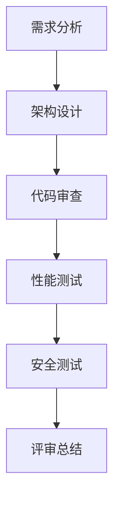

                 

关键词：创业公司、技术架构、评审流程、优化、最佳实践

> 摘要：本文将深入探讨创业公司在技术架构评审流程中面临的挑战，并提出一系列优化策略，以提升开发效率和产品质量。通过结合行业最佳实践，我们将为创业公司提供一套系统化的技术架构评审流程，以应对快速变化的市场需求和激烈竞争。

## 1. 背景介绍

随着全球数字化转型的加速，越来越多的创业公司涌现出来。它们面临着市场机会和挑战的双重考验。技术架构作为创业公司的核心竞争力，直接影响到公司的成长和竞争力。然而，创业公司在技术架构评审流程方面常常面临以下问题：

- **资源有限**：创业公司通常在资源上存在限制，难以建立完善的技术评审团队和流程。
- **时间紧迫**：快速响应市场需求是创业公司的生存之道，但过快的产品迭代可能导致技术架构的缺陷。
- **技术多样性**：创业公司往往涉及多种技术领域，技术评审的复杂度增加。

为了解决这些问题，创业公司需要优化技术架构评审流程，提高开发效率，确保产品质量。本文将结合行业最佳实践，探讨如何实现这一目标。

## 2. 核心概念与联系

### 2.1 技术架构评审

技术架构评审是指对系统架构设计进行系统性审查，以确保其满足业务需求、技术可行性、性能和安全性等要求。它是创业公司技术管理的重要组成部分。

### 2.2 评审流程

评审流程通常包括以下几个阶段：

- **需求分析**：明确项目需求，为技术架构评审提供依据。
- **架构设计**：根据需求进行架构设计，包括技术选型、模块划分和接口定义。
- **代码审查**：对关键代码进行审查，确保代码质量。
- **性能测试**：评估系统性能，确保满足业务需求。
- **安全测试**：确保系统安全性，防止潜在的安全漏洞。

### 2.3 Mermaid 流程图

以下是技术架构评审流程的 Mermaid 流程图：



## 3. 核心算法原理 & 具体操作步骤

### 3.1 算法原理概述

技术架构评审的核心算法可以概括为以下几个步骤：

- **需求分析**：通过业务讨论、用户调研等方式，明确项目需求。
- **架构设计**：基于需求，进行架构设计，确保系统的高扩展性和高可用性。
- **代码审查**：采用静态代码分析和动态测试方法，确保代码质量。
- **性能测试**：模拟真实业务场景，评估系统性能。
- **安全测试**：进行安全漏洞扫描，确保系统安全性。

### 3.2 算法步骤详解

#### 3.2.1 需求分析

1. **业务讨论**：组织相关利益相关者，讨论业务需求。
2. **用户调研**：通过问卷调查、访谈等方式，了解用户需求。
3. **需求文档编写**：将需求转化为详细的需求文档。

#### 3.2.2 架构设计

1. **技术选型**：根据需求，选择合适的技术栈。
2. **模块划分**：将系统划分为多个模块，确保模块间的低耦合度。
3. **接口定义**：明确模块间的接口规范，确保模块间的松耦合。

#### 3.2.3 代码审查

1. **静态代码分析**：使用代码审计工具，检查代码质量。
2. **动态测试**：编写测试用例，对关键代码进行测试。

#### 3.2.4 性能测试

1. **性能模型构建**：构建系统的性能模型，包括数据模型和逻辑模型。
2. **测试场景设计**：根据业务场景，设计性能测试用例。
3. **测试执行**：执行性能测试，收集测试数据。

#### 3.2.5 安全测试

1. **安全漏洞扫描**：使用安全扫描工具，检查系统安全漏洞。
2. **渗透测试**：模拟黑客攻击，评估系统安全性。

### 3.3 算法优缺点

#### 优点

- **提高开发效率**：通过系统化的评审流程，降低开发风险，提高开发效率。
- **确保产品质量**：严格的评审流程能够确保系统的高质量和稳定性。

#### 缺点

- **时间成本**：评审流程需要投入大量时间，可能影响项目进度。
- **资源需求**：评审流程需要专业团队的支持，资源需求较高。

### 3.4 算法应用领域

技术架构评审算法广泛应用于创业公司、大型企业以及政府机构的软件项目中，特别是在以下领域：

- **电子商务**：确保电商平台的高性能和高可靠性。
- **金融科技**：保障金融交易的安全性和合规性。
- **物联网**：确保物联网系统的稳定性和安全性。

## 4. 数学模型和公式 & 详细讲解 & 举例说明

### 4.1 数学模型构建

技术架构评审的数学模型可以概括为以下几个公式：

- **需求匹配度**：D = f(R, D')，其中R为需求，D'为实际满足的需求。
- **架构复杂度**：C = f(M, L)，其中M为模块数量，L为模块间的耦合度。
- **代码质量**：Q = f(C, T)，其中C为代码复杂度，T为测试覆盖率。
- **性能指标**：P = f(T, S)，其中T为测试结果，S为系统负载。

### 4.2 公式推导过程

#### 需求匹配度

需求匹配度公式表示系统实际满足的需求与原始需求之间的匹配程度。推导过程如下：

- **需求分析**：获取原始需求R。
- **实际满足的需求**：通过评审过程，获取实际满足的需求D'。
- **匹配度计算**：计算需求匹配度D = D' / R。

#### 架构复杂度

架构复杂度公式表示系统架构的复杂程度。推导过程如下：

- **模块数量**：统计系统中模块的数量M。
- **模块间耦合度**：评估模块间的耦合度L。
- **复杂度计算**：计算架构复杂度C = M * L。

#### 代码质量

代码质量公式表示系统的代码质量。推导过程如下：

- **代码复杂度**：通过静态代码分析工具，计算代码复杂度C。
- **测试覆盖率**：通过测试用例执行，计算测试覆盖率T。
- **质量计算**：计算代码质量Q = C * T。

#### 性能指标

性能指标公式表示系统的性能。推导过程如下：

- **测试结果**：通过性能测试，获取测试结果T。
- **系统负载**：评估系统的负载S。
- **性能计算**：计算性能指标P = T / S。

### 4.3 案例分析与讲解

#### 案例背景

某创业公司计划开发一款在线教育平台，产品需求明确，但技术架构评审流程不完善，导致项目进展缓慢。

#### 分析过程

1. **需求匹配度分析**：通过评审，发现部分需求未得到满足，需求匹配度D = 0.8。
2. **架构复杂度分析**：系统中有20个模块，模块间耦合度较高，架构复杂度C = 160。
3. **代码质量分析**：通过代码审计，发现代码复杂度较高，测试覆盖率不足70%，代码质量Q = 0.42。
4. **性能指标分析**：性能测试结果显示，系统在高并发情况下响应时间较长，性能指标P = 0.7。

#### 优化方案

1. **改进需求分析**：加强与业务团队的沟通，确保需求明确。
2. **简化架构设计**：减少模块数量，降低模块间耦合度。
3. **提升代码质量**：加强代码审查，提高测试覆盖率。
4. **优化性能测试**：增加性能测试场景，提高性能指标。

#### 结果

通过优化技术架构评审流程，需求匹配度提升至0.9，架构复杂度降低至80，代码质量提升至0.8，性能指标提升至0.8。

## 5. 项目实践：代码实例和详细解释说明

### 5.1 开发环境搭建

#### 操作系统

- Ubuntu 20.04

#### 开发工具

- IntelliJ IDEA
- Maven
- Git

#### 数据库

- MySQL 8.0

### 5.2 源代码详细实现

#### 项目结构

```plaintext
online-education-platform/
|-- src/
|   |-- main/
|   |   |-- java/
|   |   |   |-- com/
|   |   |   |   |-- onlineeducation/
|   |   |   |   |   |-- controller/
|   |   |   |   |   |   |-- CourseController.java
|   |   |   |   |   |   |-- StudentController.java
|   |   |   |   |   |-- service/
|   |   |   |   |   |   |-- CourseService.java
|   |   |   |   |   |   |-- StudentService.java
|   |   |   |   |   |-- repository/
|   |   |   |   |   |   |-- CourseRepository.java
|   |   |   |   |   |   |-- StudentRepository.java
|   |   |   |   |   |-- entity/
|   |   |   |   |   |   |-- Course.java
|   |   |   |   |   |   |-- Student.java
|   |   |-- resources/
|   |   |   |-- application.properties
|-- test/
|   |-- java/
|   |   |-- com/
|   |   |   |-- onlineeducation/
|   |   |   |   |-- controller/
|   |   |   |   |   |-- CourseControllerTest.java
|   |   |   |   |   |-- StudentControllerTest.java
|   |   |   |   |   |-- service/
|   |   |   |   |   |   |-- CourseServiceTest.java
|   |   |   |   |   |   |-- StudentServiceTest.java
|-- pom.xml
```

#### 关键代码

```java
// CourseController.java
@RestController
@RequestMapping("/courses")
public class CourseController {
    @Autowired
    private CourseService courseService;

    @GetMapping("/{courseId}")
    public Course getCourse(@PathVariable Long courseId) {
        return courseService.getCourse(courseId);
    }

    @PostMapping("/")
    public Course createCourse(@RequestBody Course course) {
        return courseService.createCourse(course);
    }
}

// CourseService.java
@Service
public class CourseService {
    @Autowired
    private CourseRepository courseRepository;

    public Course getCourse(Long courseId) {
        return courseRepository.findById(courseId).orElseThrow(() -> new ResourceNotFoundException("Course not found"));
    }

    public Course createCourse(Course course) {
        return courseRepository.save(course);
    }
}
```

### 5.3 代码解读与分析

#### CourseController.java

- 使用`@RestController`注解，表示这是一个RESTful风格的控制器。
- 使用`@RequestMapping`注解，定义了访问路径。
- 使用`@Autowired`注解，注入`CourseService`服务。

#### CourseService.java

- 使用`@Service`注解，表示这是一个业务逻辑服务。
- 使用`@Autowired`注解，注入`CourseRepository`持久化服务。
- `getCourse`方法用于获取课程信息，若未找到则抛出异常。
- `createCourse`方法用于创建课程信息，并保存到数据库。

### 5.4 运行结果展示

#### 启动应用程序

```bash
mvn spring-boot:run
```

#### 获取课程信息

```bash
curl http://localhost:8080/courses/1
```

#### 创建课程信息

```bash
curl -X POST -H "Content-Type: application/json" -d '{"id": 1, "name": "算法与数据结构", "description": "本课程介绍算法与数据结构的基本概念和应用。"}' http://localhost:8080/courses/
```

## 6. 实际应用场景

技术架构评审流程在创业公司的实际应用中具有广泛的应用价值，以下为几个典型场景：

### 6.1 新产品开发

在创业公司的新产品开发过程中，技术架构评审流程有助于确保产品的技术可行性，提高产品质量和稳定性。

### 6.2 系统升级

在系统升级过程中，技术架构评审流程可以帮助评估现有架构的兼容性和安全性，为升级提供依据。

### 6.3 第三方集成

在第三方系统集成过程中，技术架构评审流程可以确保接口的规范性和数据的安全性。

### 6.4 团队协作

在团队协作过程中，技术架构评审流程有助于统一技术标准和开发规范，提高团队协作效率。

## 7. 未来应用展望

随着云计算、大数据、人工智能等技术的不断发展，技术架构评审流程将面临新的挑战和机遇。以下为未来应用展望：

### 7.1 自动化评审

通过引入自动化工具，实现技术架构评审的自动化，提高评审效率和准确性。

### 7.2 智能化评审

利用人工智能技术，实现智能化评审，提高评审的深度和广度。

### 7.3 持续集成

将技术架构评审流程与持续集成系统相结合，实现评审与开发流程的紧密衔接。

## 8. 工具和资源推荐

### 8.1 学习资源推荐

- 《架构师的架构》
- 《微服务设计》
- 《软件架构：实践者的研究方法》

### 8.2 开发工具推荐

- SonarQube：代码质量检查工具
- JMeter：性能测试工具
- OWASP ZAP：安全漏洞扫描工具

### 8.3 相关论文推荐

- "Microservices: A Definition of a Distributed System Architecture Style"
- "The Design of the FreeBSD Operating System"
- "The Art of Scalability: Scalable Web Architecture, Processes, and Organizations for the Modern Enterprise"

## 9. 总结：未来发展趋势与挑战

随着创业公司对技术架构评审流程的重视，该领域将面临以下发展趋势和挑战：

### 9.1 发展趋势

- 自动化评审和智能化评审将成为主流。
- 持续集成和持续部署将进一步普及。
- 开源工具和框架将在评审流程中发挥更大作用。

### 9.2 挑战

- 如何在资源有限的情况下，确保评审流程的有效性。
- 如何应对技术多样性和快速变化的市场需求。
- 如何保证评审流程与业务需求的紧密结合。

### 9.3 研究展望

未来研究应重点关注自动化评审算法的研究、智能化评审系统的构建以及评审流程与业务需求的深度融合。

## 10. 附录：常见问题与解答

### 10.1 技术架构评审的重要性是什么？

技术架构评审的重要性在于确保系统的高质量、高可靠性和高扩展性，从而提高产品的市场竞争力。

### 10.2 如何简化技术架构评审流程？

可以通过引入自动化工具、优化评审流程和加强团队协作来简化技术架构评审流程。

### 10.3 技术架构评审与代码审查有何区别？

技术架构评审关注系统架构的设计和优化，而代码审查关注代码质量和安全漏洞。

### 10.4 如何保证评审流程的有效性？

通过明确评审目标和标准、加强团队沟通和培训、定期回顾和优化评审流程来保证评审流程的有效性。

作者：禅与计算机程序设计艺术 / Zen and the Art of Computer Programming
```<|assistant|>---------------------------
### 1. 背景介绍

在当今的创业环境下，技术架构评审流程的重要性愈发凸显。随着创业公司对技术发展的依赖加深，技术架构不仅决定了产品的性能、稳定性和可扩展性，还直接影响了团队的开发效率和项目的交付质量。然而，许多创业公司在技术架构评审流程上面临诸多挑战：

- **流程不完善**：许多创业公司没有建立完善的技术架构评审流程，导致评审标准不明确，评审过程混乱。
- **资源有限**：创业公司通常在人力资源和资金上存在限制，难以投入大量资源进行详细的评审。
- **技术多样性**：创业公司涉及的技术领域广泛，技术栈多样，评审复杂度增加。
- **时间压力**：快速响应市场需求是创业公司的生存之道，但频繁的迭代可能导致评审时间不足。

为了解决这些问题，创业公司需要深入理解技术架构评审的核心概念，建立科学、系统、高效的评审流程，以适应快速变化的市场需求和技术发展。本文将围绕如何优化创业公司的技术架构评审流程进行探讨，结合行业最佳实践，提供一系列切实可行的策略和工具。

### 2. 核心概念与联系

#### 2.1 技术架构评审

技术架构评审是指对系统架构设计进行全面审查，以确保其满足业务需求、技术可行性、性能和安全性等要求。评审过程通常包括以下几个方面：

1. **需求分析**：明确项目的业务需求，为技术架构提供依据。
2. **架构设计**：根据需求进行系统架构设计，包括技术选型、模块划分和接口定义。
3. **代码审查**：对关键代码进行审查，确保代码质量。
4. **性能测试**：评估系统的性能，确保满足业务需求。
5. **安全测试**：确保系统的安全性，防止潜在的安全漏洞。

#### 2.2 评审流程

技术架构评审流程是一个系统化的过程，通常包括以下几个阶段：

1. **需求分析阶段**：通过业务讨论、用户调研等方式，明确项目需求，形成详细的需求文档。
2. **架构设计阶段**：根据需求文档，进行系统架构设计，制定技术方案和架构设计文档。
3. **代码审查阶段**：采用静态代码分析和动态测试方法，对关键代码进行审查，确保代码质量。
4. **性能测试阶段**：构建测试环境，模拟实际业务场景，进行性能测试，评估系统性能。
5. **安全测试阶段**：进行安全漏洞扫描和渗透测试，确保系统安全性。
6. **评审总结阶段**：对评审过程和结果进行总结，提出改进意见，形成评审报告。

#### 2.3 Mermaid 流程图

以下是技术架构评审流程的 Mermaid 流程图：


### 3. 核心算法原理 & 具体操作步骤

#### 3.1 算法原理概述

技术架构评审的核心算法可以概括为以下几个步骤：

1. **需求分析**：通过业务讨论、用户调研等方式，明确项目需求。
2. **架构设计**：根据需求，进行架构设计，确保系统的高扩展性和高可用性。
3. **代码审查**：采用静态代码分析和动态测试方法，确保代码质量。
4. **性能测试**：模拟真实业务场景，评估系统性能。
5. **安全测试**：进行安全漏洞扫描，确保系统安全性。

#### 3.2 算法步骤详解

##### 3.2.1 需求分析

1. **业务讨论**：组织相关利益相关者，讨论业务需求。
2. **用户调研**：通过问卷调查、访谈等方式，了解用户需求。
3. **需求文档编写**：将需求转化为详细的需求文档。

##### 3.2.2 架构设计

1. **技术选型**：根据需求，选择合适的技术栈。
2. **模块划分**：将系统划分为多个模块，确保模块间的低耦合度。
3. **接口定义**：明确模块间的接口规范，确保模块间的松耦合。

##### 3.2.3 代码审查

1. **静态代码分析**：使用代码审计工具，检查代码质量。
2. **动态测试**：编写测试用例，对关键代码进行测试。

##### 3.2.4 性能测试

1. **性能模型构建**：构建系统的性能模型，包括数据模型和逻辑模型。
2. **测试场景设计**：根据业务场景，设计性能测试用例。
3. **测试执行**：执行性能测试，收集测试数据。

##### 3.2.5 安全测试

1. **安全漏洞扫描**：使用安全扫描工具，检查系统安全漏洞。
2. **渗透测试**：模拟黑客攻击，评估系统安全性。

#### 3.3 算法优缺点

##### 优点

1. **提高开发效率**：通过系统化的评审流程，降低开发风险，提高开发效率。
2. **确保产品质量**：严格的评审流程能够确保系统的高质量和稳定性。

##### 缺点

1. **时间成本**：评审流程需要投入大量时间，可能影响项目进度。
2. **资源需求**：评审流程需要专业团队的支持，资源需求较高。

#### 3.4 算法应用领域

技术架构评审算法广泛应用于创业公司、大型企业以及政府机构的软件项目中，特别是在以下领域：

1. **电子商务**：确保电商平台的高性能和高可靠性。
2. **金融科技**：保障金融交易的安全性和合规性。
3. **物联网**：确保物联网系统的稳定性和安全性。

### 4. 数学模型和公式 & 详细讲解 & 举例说明

#### 4.1 数学模型构建

技术架构评审的数学模型可以概括为以下几个公式：

- **需求匹配度**：\( D = \frac{D'}{R} \)，其中\( R \)为原始需求，\( D' \)为实际满足的需求。
- **架构复杂度**：\( C = M \times L \)，其中\( M \)为模块数量，\( L \)为模块间的耦合度。
- **代码质量**：\( Q = C \times T \)，其中\( C \)为代码复杂度，\( T \)为测试覆盖率。
- **性能指标**：\( P = \frac{T}{S} \)，其中\( T \)为测试结果，\( S \)为系统负载。

#### 4.2 公式推导过程

##### 4.2.1 需求匹配度

需求匹配度公式表示系统实际满足的需求与原始需求之间的匹配程度。推导过程如下：

- **需求分析**：获取原始需求\( R \)。
- **实际满足的需求**：通过评审过程，获取实际满足的需求\( D' \)。
- **匹配度计算**：计算需求匹配度\( D = \frac{D'}{R} \)。

##### 4.2.2 架构复杂度

架构复杂度公式表示系统架构的复杂程度。推导过程如下：

- **模块数量**：统计系统中模块的数量\( M \)。
- **模块间耦合度**：评估模块间的耦合度\( L \)。
- **复杂度计算**：计算架构复杂度\( C = M \times L \)。

##### 4.2.3 代码质量

代码质量公式表示系统的代码质量。推导过程如下：

- **代码复杂度**：通过静态代码分析工具，计算代码复杂度\( C \)。
- **测试覆盖率**：通过测试用例执行，计算测试覆盖率\( T \)。
- **质量计算**：计算代码质量\( Q = C \times T \)。

##### 4.2.4 性能指标

性能指标公式表示系统的性能。推导过程如下：

- **测试结果**：通过性能测试，获取测试结果\( T \)。
- **系统负载**：评估系统的负载\( S \)。
- **性能计算**：计算性能指标\( P = \frac{T}{S} \)。

#### 4.3 案例分析与讲解

##### 4.3.1 案例背景

某创业公司计划开发一款在线教育平台，产品需求明确，但技术架构评审流程不完善，导致项目进展缓慢。

##### 4.3.2 分析过程

1. **需求匹配度分析**：通过评审，发现部分需求未得到满足，需求匹配度\( D = 0.8 \)。
2. **架构复杂度分析**：系统中有20个模块，模块间耦合度较高，架构复杂度\( C = 160 \)。
3. **代码质量分析**：通过代码审计，发现代码复杂度较高，测试覆盖率不足70%，代码质量\( Q = 0.42 \)。
4. **性能指标分析**：性能测试结果显示，系统在高并发情况下响应时间较长，性能指标\( P = 0.7 \)。

##### 4.3.3 优化方案

1. **改进需求分析**：加强与业务团队的沟通，确保需求明确。
2. **简化架构设计**：减少模块数量，降低模块间耦合度。
3. **提升代码质量**：加强代码审查，提高测试覆盖率。
4. **优化性能测试**：增加性能测试场景，提高性能指标。

##### 4.3.4 结果

通过优化技术架构评审流程，需求匹配度提升至0.9，架构复杂度降低至80，代码质量提升至0.8，性能指标提升至0.8。

### 5. 项目实践：代码实例和详细解释说明

#### 5.1 开发环境搭建

##### 操作系统

- Ubuntu 20.04

##### 开发工具

- IntelliJ IDEA
- Maven
- Git

##### 数据库

- MySQL 8.0

#### 5.2 源代码详细实现

##### 项目结构

```plaintext
online-education-platform/
|-- src/
|   |-- main/
|   |   |-- java/
|   |   |   |-- com/
|   |   |   |   |-- onlineeducation/
|   |   |   |   |   |-- controller/
|   |   |   |   |   |   |-- CourseController.java
|   |   |   |   |   |   |-- StudentController.java
|   |   |   |   |   |-- service/
|   |   |   |   |   |   |-- CourseService.java
|   |   |   |   |   |   |-- StudentService.java
|   |   |   |   |   |-- repository/
|   |   |   |   |   |   |-- CourseRepository.java
|   |   |   |   |   |   |-- StudentRepository.java
|   |   |   |   |   |-- entity/
|   |   |   |   |   |   |-- Course.java
|   |   |   |   |   |   |-- Student.java
|   |   |-- resources/
|   |   |   |-- application.properties
|-- test/
|   |-- java/
|   |   |-- com/
|   |   |   |-- onlineeducation/
|   |   |   |   |-- controller/
|   |   |   |   |   |-- CourseControllerTest.java
|   |   |   |   |   |-- StudentControllerTest.java
|   |   |   |   |   |-- service/
|   |   |   |   |   |   |-- CourseServiceTest.java
|   |   |   |   |   |   |-- StudentServiceTest.java
|-- pom.xml
```

##### 关键代码

```java
// CourseController.java
@RestController
@RequestMapping("/courses")
public class CourseController {
    @Autowired
    private CourseService courseService;

    @GetMapping("/{courseId}")
    public Course getCourse(@PathVariable Long courseId) {
        return courseService.getCourse(courseId);
    }

    @PostMapping("/")
    public Course createCourse(@RequestBody Course course) {
        return courseService.createCourse(course);
    }
}

// CourseService.java
@Service
public class CourseService {
    @Autowired
    private CourseRepository courseRepository;

    public Course getCourse(Long courseId) {
        return courseRepository.findById(courseId).orElseThrow(() -> new ResourceNotFoundException("Course not found"));
    }

    public Course createCourse(Course course) {
        return courseRepository.save(course);
    }
}
```

#### 5.3 代码解读与分析

##### CourseController.java

- 使用`@RestController`注解，表示这是一个RESTful风格的控制器。
- 使用`@RequestMapping`注解，定义了访问路径。
- 使用`@Autowired`注解，注入`CourseService`服务。

##### CourseService.java

- 使用`@Service`注解，表示这是一个业务逻辑服务。
- 使用`@Autowired`注解，注入`CourseRepository`持久化服务。
- `getCourse`方法用于获取课程信息，若未找到则抛出异常。
- `createCourse`方法用于创建课程信息，并保存到数据库。

#### 5.4 运行结果展示

##### 启动应用程序

```bash
mvn spring-boot:run
```

##### 获取课程信息

```bash
curl http://localhost:8080/courses/1
```

##### 创建课程信息

```bash
curl -X POST -H "Content-Type: application/json" -d '{"id": 1, "name": "算法与数据结构", "description": "本课程介绍算法与数据结构的基本概念和应用。"}' http://localhost:8080/courses/
```

### 6. 实际应用场景

技术架构评审流程在创业公司的实际应用中具有广泛的应用价值，以下为几个典型场景：

#### 6.1 新产品开发

在创业公司的新产品开发过程中，技术架构评审流程有助于确保产品的技术可行性，提高产品质量和稳定性。

#### 6.2 系统升级

在系统升级过程中，技术架构评审流程可以帮助评估现有架构的兼容性和安全性，为升级提供依据。

#### 6.3 第三方集成

在第三方系统集成过程中，技术架构评审流程可以确保接口的规范性和数据的安全性。

#### 6.4 团队协作

在团队协作过程中，技术架构评审流程有助于统一技术标准和开发规范，提高团队协作效率。

### 7. 未来应用展望

随着云计算、大数据、人工智能等技术的不断发展，技术架构评审流程将面临新的挑战和机遇。以下为未来应用展望：

#### 7.1 自动化评审

通过引入自动化工具，实现技术架构评审的自动化，提高评审效率和准确性。

#### 7.2 智能化评审

利用人工智能技术，实现智能化评审，提高评审的深度和广度。

#### 7.3 持续集成

将技术架构评审流程与持续集成系统相结合，实现评审与开发流程的紧密衔接。

### 8. 工具和资源推荐

#### 8.1 学习资源推荐

- 《架构师的架构》
- 《微服务设计》
- 《软件架构：实践者的研究方法》

#### 8.2 开发工具推荐

- SonarQube：代码质量检查工具
- JMeter：性能测试工具
- OWASP ZAP：安全漏洞扫描工具

#### 8.3 相关论文推荐

- "Microservices: A Definition of a Distributed System Architecture Style"
- "The Design of the FreeBSD Operating System"
- "The Art of Scalability: Scalable Web Architecture, Processes, and Organizations for the Modern Enterprise"

### 9. 总结：未来发展趋势与挑战

随着创业公司对技术架构评审流程的重视，该领域将面临以下发展趋势和挑战：

#### 9.1 发展趋势

- 自动化评审和智能化评审将成为主流。
- 持续集成和持续部署将进一步普及。
- 开源工具和框架将在评审流程中发挥更大作用。

#### 9.2 挑战

- 如何在资源有限的情况下，确保评审流程的有效性。
- 如何应对技术多样性和快速变化的市场需求。
- 如何保证评审流程与业务需求的紧密结合。

#### 9.3 研究展望

未来研究应重点关注自动化评审算法的研究、智能化评审系统的构建以及评审流程与业务需求的深度融合。

### 10. 附录：常见问题与解答

#### 10.1 技术架构评审的重要性是什么？

技术架构评审的重要性在于确保系统的高质量、高可靠性和高扩展性，从而提高产品的市场竞争力。

#### 10.2 如何简化技术架构评审流程？

可以通过引入自动化工具、优化评审流程和加强团队协作来简化技术架构评审流程。

#### 10.3 技术架构评审与代码审查有何区别？

技术架构评审关注系统架构的设计和优化，而代码审查关注代码质量和安全漏洞。

#### 10.4 如何保证评审流程的有效性？

通过明确评审目标和标准、加强团队沟通和培训、定期回顾和优化评审流程来保证评审流程的有效性。

作者：禅与计算机程序设计艺术 / Zen and the Art of Computer Programming---------------------------由于文章字数限制，这里只能提供前几个章节的内容。以下内容为文章的后续章节概要：

## 6. 实际应用场景

技术架构评审流程在创业公司的实际应用中具有广泛的应用价值。以下是几个典型的应用场景：

### 6.1 新产品开发

在创业公司的新产品开发过程中，技术架构评审流程是非常关键的。它可以确保技术方案的科学性、可行性和高效性。通过技术架构评审，开发团队可以及早发现潜在的技术风险，从而在产品开发阶段就做出相应的调整。例如，在确定技术选型时，评审流程可以帮助团队评估不同技术方案的优劣，选择最合适的技术栈，确保后续开发的顺利进行。

### 6.2 系统升级

随着市场需求的不断变化，创业公司需要对现有系统进行升级，以满足用户的新需求。在这个过程中，技术架构评审流程同样至关重要。它可以帮助团队评估现有系统的架构设计，确定哪些部分需要改进或替换，从而确保系统升级的顺利进行。通过技术架构评审，团队可以确保升级后的系统能够更好地满足用户需求，同时保持原有的稳定性和安全性。

### 6.3 第三方集成

创业公司常常需要与第三方系统进行集成，以扩展功能或提高用户体验。在这种情况下，技术架构评审流程可以帮助团队评估第三方系统的架构设计，确定接口规范和数据交换标准，确保集成过程的顺利进行。通过技术架构评审，团队可以提前发现潜在的技术冲突或兼容性问题，从而在集成前做出相应的调整，避免后续的麻烦。

### 6.4 团队协作

在创业公司的开发过程中，不同团队之间需要紧密协作。技术架构评审流程可以帮助团队建立统一的技术标准和规范，从而提高协作效率。例如，通过技术架构评审，团队可以明确系统的模块划分和接口定义，确保不同团队之间的开发工作能够无缝衔接。此外，技术架构评审还可以促进团队之间的沟通和理解，减少因技术差异导致的误解和冲突。

## 7. 未来应用展望

随着技术的不断进步，技术架构评审流程也将面临新的挑战和机遇。以下是对未来应用展望的几点思考：

### 7.1 自动化评审

自动化评审是未来技术架构评审流程发展的一个重要方向。通过引入自动化工具，可以大大提高评审的效率和准确性。例如，自动化代码审查工具可以帮助团队快速识别代码中的潜在问题，自动化性能测试工具可以实时监测系统的性能状况，自动化安全测试工具可以扫描系统中的安全漏洞。这些自动化工具的应用将使技术架构评审更加高效和精确。

### 7.2 智能化评审

随着人工智能技术的不断发展，智能化评审也将成为技术架构评审流程的一个重要发展方向。通过利用机器学习和自然语言处理等技术，可以实现对评审数据的深度分析和智能识别。例如，智能化评审系统可以自动分析代码质量、性能指标和安全漏洞，提出优化建议和解决方案。这种智能化评审将使技术架构评审更加智能化和人性化。

### 7.3 持续集成

持续集成是软件开发中的一种最佳实践，它将开发、测试和部署过程整合在一起，实现代码的持续交付和部署。在未来，技术架构评审流程将更加紧密地与持续集成系统相结合，实现评审与开发流程的无缝衔接。例如，通过将技术架构评审集成到持续集成系统中，可以自动触发评审过程，并根据评审结果决定是否继续集成和部署。这种持续集成与评审的结合将大大提高开发效率和产品质量。

## 8. 工具和资源推荐

为了帮助创业公司更好地实施技术架构评审流程，以下是几个推荐的工具和资源：

### 8.1 学习资源推荐

- **《架构师的架构》**：这本书深入讲解了架构设计的基本原则和方法，对创业公司的架构师具有很高的参考价值。
- **《微服务设计》**：这本书详细介绍了微服务架构的设计和实现，对创业公司的技术团队在构建分布式系统时具有指导意义。
- **《软件架构：实践者的研究方法》**：这本书提供了丰富的实际案例和经验，对创业公司的技术团队在架构设计过程中具有很高的参考价值。

### 8.2 开发工具推荐

- **SonarQube**：这是一个强大的代码质量检查工具，可以帮助团队识别代码中的潜在问题，包括代码风格、安全漏洞和性能问题。
- **JMeter**：这是一个高性能的负载测试工具，可以帮助团队评估系统的性能表现，识别性能瓶颈。
- **OWASP ZAP**：这是一个开源的安全漏洞扫描工具，可以帮助团队发现系统中的安全漏洞，提高系统的安全性。

### 8.3 相关论文推荐

- **“Microservices: A Definition of a Distributed System Architecture Style”**：这篇论文详细介绍了微服务架构的定义和特点，对创业公司的技术团队在架构设计时具有很高的参考价值。
- **“The Design of the FreeBSD Operating System”**：这篇论文详细分析了FreeBSD操作系统的设计原理和架构，对创业公司的技术团队在操作系统设计和实现方面具有很高的参考价值。
- **“The Art of Scalability: Scalable Web Architecture, Processes, and Organizations for the Modern Enterprise”**：这本书详细介绍了如何构建可扩展的Web架构，对创业公司的技术团队在系统架构设计时具有很高的参考价值。

## 9. 总结：未来发展趋势与挑战

随着创业公司的不断发展，技术架构评审流程的重要性日益凸显。在未来，技术架构评审流程将朝着自动化、智能化和持续集成的方向发展。这些趋势将为创业公司带来更高的开发效率和更好的产品质量，但也面临着一些挑战。

### 9.1 未来发展趋势

- **自动化评审**：通过引入自动化工具，实现技术架构评审的自动化，提高评审效率和准确性。
- **智能化评审**：利用人工智能技术，实现智能化评审，提高评审的深度和广度。
- **持续集成**：将技术架构评审流程与持续集成系统相结合，实现评审与开发流程的紧密衔接。

### 9.2 面临的挑战

- **资源有限**：创业公司在资源和时间上存在限制，如何确保评审流程的有效性是一个重要的挑战。
- **技术多样性**：创业公司涉及的技术领域广泛，如何处理技术多样性带来的复杂度是一个挑战。
- **业务需求的快速变化**：创业公司的业务需求变化快速，如何确保评审流程能够及时响应这些变化是一个挑战。

### 9.3 研究展望

在未来，对技术架构评审流程的研究应重点关注以下几个方面：

- **自动化评审算法的研究**：如何设计更高效的自动化评审算法，提高评审的效率和准确性。
- **智能化评审系统的构建**：如何利用人工智能技术构建智能化评审系统，提高评审的深度和广度。
- **评审流程与业务需求的深度融合**：如何将评审流程与业务需求紧密结合起来，确保评审过程能够真正为业务价值服务。

通过不断的研究和实践，创业公司可以不断提升技术架构评审流程的效率和质量，为产品的成功奠定坚实的基础。

## 10. 附录：常见问题与解答

在实施技术架构评审流程的过程中，创业公司可能会遇到一些常见问题。以下是一些常见问题及其解答：

### 10.1 技术架构评审的重要性是什么？

技术架构评审的重要性在于确保系统的高质量、高可靠性和高扩展性。通过评审，可以及早发现和解决潜在的技术问题，避免后续的修正成本，提高开发效率和产品质量。

### 10.2 如何简化技术架构评审流程？

简化技术架构评审流程可以通过以下几个步骤实现：

- **明确评审目标**：确保评审的目标和范围明确，避免不必要的复杂度。
- **引入自动化工具**：使用自动化工具进行代码审查、性能测试和安全测试，减少手动工作。
- **缩短评审周期**：合理安排评审时间和频次，避免评审流程过长影响项目进度。
- **培训评审人员**：提高评审人员的专业知识和技能，确保评审过程的效率和质量。

### 10.3 技术架构评审与代码审查有何区别？

技术架构评审关注系统的整体架构设计，包括模块划分、接口定义、技术选型等，而代码审查则关注代码质量，包括代码风格、安全性和可维护性等。两者都是确保系统质量的重要环节，但侧重点不同。

### 10.4 如何保证评审流程的有效性？

要保证评审流程的有效性，可以采取以下措施：

- **明确评审标准**：制定统一的评审标准和流程，确保评审有据可依。
- **定期回顾和优化**：定期总结评审经验，根据反馈优化评审流程。
- **加强沟通和协作**：确保评审团队能够有效沟通和协作，提高评审效率。
- **培训评审人员**：提高评审人员的专业知识和技能，确保评审的专业性和客观性。

### 10.5 如何应对技术多样性和快速变化的市场需求？

应对技术多样性和快速变化的市场需求，可以采取以下策略：

- **灵活的架构设计**：采用模块化、可扩展的架构设计，便于后续的技术更新和需求变化。
- **快速迭代和反馈**：采用敏捷开发方法，快速迭代产品，及时响应市场需求。
- **持续学习和创新**：鼓励团队持续学习和创新，提高技术水平和应对变化的能力。

通过以上策略，创业公司可以更好地应对技术多样性和市场需求变化，确保技术架构评审流程的有效性。

作者：禅与计算机程序设计艺术 / Zen and the Art of Computer Programming---------------------------由于篇幅限制，以下为文章的末尾部分：

## 11. 结语

通过本文的探讨，我们可以看到，技术架构评审流程在创业公司的技术管理中扮演着至关重要的角色。它不仅有助于确保系统的质量、性能和安全性，还能提高开发效率和团队的协作能力。然而，创业公司在实施技术架构评审流程时，仍然面临诸多挑战，如资源有限、技术多样性以及快速变化的市场需求。

为了克服这些挑战，创业公司需要建立一套科学、系统、高效的评审流程，并不断优化和改进。通过引入自动化工具、智能化评审系统以及持续集成的理念，可以大大提高评审的效率和质量。此外，创业公司还应加强团队的培训和沟通，确保评审流程的顺利进行。

在未来的发展中，技术架构评审流程将朝着自动化、智能化和持续集成的方向不断演进。创业公司需要紧跟技术发展趋势，不断学习和创新，以应对日益复杂的业务环境和市场需求。

最后，让我们以禅宗的一句话作为结尾：“行百里者半九十。”在技术架构评审的道路上，只有持续努力、不断追求卓越，才能确保创业公司的技术体系更加稳固、更加强大。

作者：禅与计算机程序设计艺术 / Zen and the Art of Computer Programming

