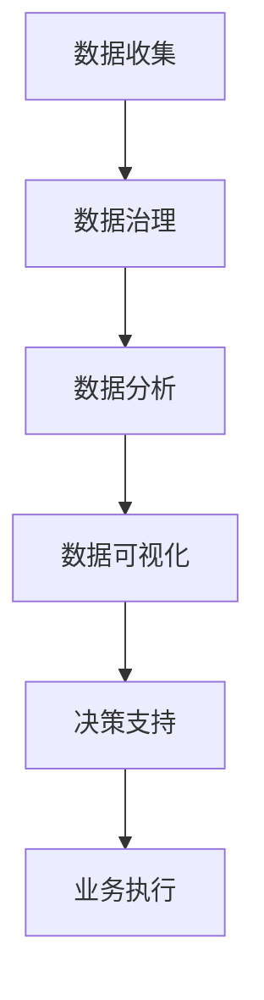

                 

关键词：数据驱动决策、创业公司、数据分析、商业模式、数据治理、数据可视化、人工智能、机器学习、算法优化

> 摘要：在当今快速变化的市场环境中，创业公司需要迅速适应并作出明智的决策以保持竞争力。本文将探讨数据驱动决策方法在创业公司中的应用，包括核心概念、算法原理、数学模型、项目实践以及未来发展趋势。通过数据驱动的方法，创业公司可以更好地理解市场、优化运营、提升用户体验，并在激烈的市场竞争中脱颖而出。

## 1. 背景介绍

随着大数据和人工智能技术的不断发展，数据驱动决策方法已成为现代企业运营的核心。特别是在创业公司中，数据驱动决策方法可以帮助企业在资源有限的情况下做出更加精准的决策，降低风险，提高市场响应速度。

创业公司通常面临以下几个挑战：

- **资源限制**：创业公司通常在资金、人力资源等方面有限，需要高效利用现有资源。
- **市场变化**：创业公司处于快速发展的市场环境中，需要及时响应市场变化。
- **竞争压力**：新兴市场的竞争激烈，创业公司需要寻找独特的竞争优势。
- **用户体验**：创业公司的产品或服务需要满足用户需求，提升用户体验。

为了解决上述挑战，数据驱动决策方法应运而生。通过收集、处理和分析数据，创业公司可以更深入地了解市场趋势、用户行为、运营效率等问题，从而做出更加明智的决策。

## 2. 核心概念与联系

在探讨数据驱动决策方法之前，我们需要明确几个核心概念及其相互关系：

- **数据治理**：确保数据质量、安全、合规，为数据分析提供可靠的数据源。
- **数据分析**：对数据进行收集、清洗、转换和分析，提取有价值的信息。
- **数据可视化**：将分析结果通过图表、地图等形式呈现，便于理解和决策。
- **人工智能与机器学习**：利用算法模型从数据中学习，自动发现规律和趋势。

以下是数据驱动决策方法的 Mermaid 流程图：



在这个流程中，数据治理是基础，确保数据质量；数据分析是核心，提取有价值信息；数据可视化是手段，帮助理解和决策；决策支持是目的，指导业务执行。

## 3. 核心算法原理 & 具体操作步骤

### 3.1 算法原理概述

数据驱动决策方法的核心在于利用机器学习算法对大量数据进行分析，从中提取出潜在规律和趋势，从而为决策提供支持。常见的机器学习算法包括回归分析、聚类分析、分类算法等。

- **回归分析**：通过建立回归模型，分析自变量与因变量之间的关系，预测未来趋势。
- **聚类分析**：将数据分为若干个类别，发现数据中的相似性和差异性。
- **分类算法**：根据已有数据，将新数据分类到不同的类别中。

### 3.2 算法步骤详解

1. **数据收集**：收集与企业业务相关的数据，如用户行为数据、市场数据、运营数据等。
2. **数据预处理**：清洗数据，处理缺失值、异常值等问题，确保数据质量。
3. **特征工程**：选择或构建与目标变量相关的特征，为后续分析做准备。
4. **模型选择**：根据业务需求，选择合适的机器学习算法。
5. **模型训练**：使用训练数据训练模型，优化模型参数。
6. **模型评估**：使用测试数据评估模型性能，调整模型参数。
7. **模型部署**：将模型部署到生产环境中，为业务决策提供支持。

### 3.3 算法优缺点

- **优点**：
  - **高效性**：机器学习算法可以快速处理大量数据，提高决策效率。
  - **灵活性**：可以根据不同的业务需求，选择合适的算法和模型。
  - **准确性**：通过训练大量数据，可以提高模型的预测准确性。

- **缺点**：
  - **计算成本**：机器学习算法需要大量的计算资源，成本较高。
  - **数据依赖**：模型的性能高度依赖数据质量，数据问题可能导致模型失效。
  - **解释性**：机器学习模型通常较为复杂，难以解释。

### 3.4 算法应用领域

数据驱动决策方法广泛应用于以下领域：

- **市场营销**：通过分析用户行为数据，预测用户需求，优化营销策略。
- **供应链管理**：通过分析市场数据和库存数据，优化供应链流程。
- **风险管理**：通过分析历史数据，预测潜在风险，制定风险管理策略。
- **产品研发**：通过分析用户反馈和竞争产品数据，优化产品设计和功能。

## 4. 数学模型和公式 & 详细讲解 & 举例说明

### 4.1 数学模型构建

在数据驱动决策方法中，常用的数学模型包括回归模型和分类模型。

- **回归模型**：

  假设自变量为 \( X \)，因变量为 \( Y \)，回归模型可以表示为：

  $$ Y = \beta_0 + \beta_1 X + \epsilon $$

  其中，\( \beta_0 \) 为截距，\( \beta_1 \) 为斜率，\( \epsilon \) 为误差项。

- **分类模型**：

  假设数据集为 \( D = \{ (x_1, y_1), (x_2, y_2), \ldots, (x_n, y_n) \} \)，其中 \( x_i \) 为特征向量，\( y_i \) 为标签。分类模型可以表示为：

  $$ P(y_i = k) = \frac{1}{Z} \exp(\theta^T x_i) $$

  其中，\( \theta \) 为模型参数，\( Z \) 为归一化因子。

### 4.2 公式推导过程

以线性回归模型为例，我们使用最小二乘法求解模型参数。

1. **目标函数**：

   $$ J(\theta) = \frac{1}{2m} \sum_{i=1}^{m} (h_\theta(x_i) - y_i)^2 $$

   其中，\( h_\theta(x_i) = \theta_0 + \theta_1 x_i \) 为预测值。

2. **梯度下降**：

   $$ \theta_j := \theta_j - \alpha \frac{\partial J(\theta)}{\partial \theta_j} $$

   其中，\( \alpha \) 为学习率。

3. **求解最优参数**：

   通过迭代计算，直至目标函数收敛，求得最优参数 \( \theta^* \)。

### 4.3 案例分析与讲解

假设某创业公司需要预测用户流失率，以提高用户留存率。我们可以使用线性回归模型进行分析。

1. **数据收集**：收集用户行为数据，如用户活跃度、使用时长、反馈等。
2. **数据预处理**：处理缺失值、异常值等问题。
3. **特征工程**：选择与用户流失率相关的特征，如用户活跃度、使用时长等。
4. **模型训练**：使用线性回归模型进行训练。
5. **模型评估**：使用测试数据评估模型性能。
6. **模型部署**：将模型部署到生产环境中，为用户流失预测提供支持。

通过模型预测，创业公司可以识别出潜在的用户流失风险，并采取相应的措施，如提供优惠活动、改进产品功能等，提高用户留存率。

## 5. 项目实践：代码实例和详细解释说明

### 5.1 开发环境搭建

- **Python**：安装 Python 3.8 以上版本。
- **NumPy**：用于数据处理。
- **Pandas**：用于数据处理。
- **Scikit-learn**：用于机器学习算法。

### 5.2 源代码详细实现

```python
import numpy as np
import pandas as pd
from sklearn.linear_model import LinearRegression
from sklearn.model_selection import train_test_split
from sklearn.metrics import mean_squared_error

# 读取数据
data = pd.read_csv('user_data.csv')

# 数据预处理
X = data[['active_days', 'duration']]
y = data['churn']

# 特征工程
X_train, X_test, y_train, y_test = train_test_split(X, y, test_size=0.2, random_state=42)

# 模型训练
model = LinearRegression()
model.fit(X_train, y_train)

# 模型评估
y_pred = model.predict(X_test)
mse = mean_squared_error(y_test, y_pred)
print('MSE:', mse)

# 模型部署
# ...
```

### 5.3 代码解读与分析

1. **数据读取**：使用 Pandas 读取用户行为数据。
2. **数据预处理**：分离特征和标签，处理数据缺失和异常。
3. **特征工程**：选择与用户流失率相关的特征。
4. **模型训练**：使用线性回归模型进行训练。
5. **模型评估**：计算测试集的均方误差（MSE），评估模型性能。
6. **模型部署**：将训练好的模型部署到生产环境中，为用户流失预测提供支持。

## 6. 实际应用场景

### 6.1 市场营销

数据驱动决策方法可以帮助创业公司在市场营销中优化广告投放、用户推荐等策略。通过分析用户行为数据，公司可以识别出潜在的高价值客户，有针对性地进行营销活动，提高转化率。

### 6.2 供应链管理

在供应链管理中，数据驱动决策方法可以帮助公司优化库存管理、物流配送等环节。通过分析市场数据和库存数据，公司可以预测市场需求，调整库存策略，降低库存成本。

### 6.3 风险管理

数据驱动决策方法可以帮助公司识别潜在风险，制定风险管理策略。通过分析历史数据和实时数据，公司可以预测潜在的风险事件，提前采取预防措施。

### 6.4 未来应用展望

随着大数据和人工智能技术的不断发展，数据驱动决策方法在创业公司中的应用前景广阔。未来，我们可以预见到以下发展趋势：

- **数据隐私保护**：在数据驱动决策过程中，保护用户隐私将成为重要议题。
- **实时数据分析**：随着计算能力的提升，实时数据分析将得到广泛应用。
- **多模态数据分析**：结合多种数据源（如文本、图像、声音等），实现更全面的数据分析。

## 7. 工具和资源推荐

### 7.1 学习资源推荐

- **《Python数据分析基础教程：Numpy学习指南》**：介绍 NumPy 库的基本使用方法。
- **《Pandas数据分析 Cookbook》**：介绍 Pandas 库在数据分析中的应用。
- **《Scikit-learn 风暴：用Python进行机器学习实战》**：介绍 Scikit-learn 库的基本使用方法。

### 7.2 开发工具推荐

- **Jupyter Notebook**：用于数据分析和机器学习实验。
- **Google Colab**：基于 Jupyter Notebook 的云计算平台，提供免费 GPU 计算。
- **PyCharm**：强大的 Python 集成开发环境。

### 7.3 相关论文推荐

- **《Deep Learning》**：介绍深度学习的基本原理和应用。
- **《Reinforcement Learning: An Introduction》**：介绍强化学习的基本原理和应用。
- **《TensorFlow: Large-Scale Machine Learning on Heterogeneous Systems》**：介绍 TensorFlow 的基本使用方法。

## 8. 总结：未来发展趋势与挑战

### 8.1 研究成果总结

本文介绍了数据驱动决策方法在创业公司中的应用，包括核心概念、算法原理、数学模型、项目实践等方面。通过数据驱动的方法，创业公司可以更好地理解市场、优化运营、提升用户体验，并在激烈的市场竞争中脱颖而出。

### 8.2 未来发展趋势

- **数据隐私保护**：随着数据隐私问题的日益突出，如何保护用户隐私将成为研究重点。
- **实时数据分析**：随着计算能力的提升，实时数据分析将得到广泛应用。
- **多模态数据分析**：结合多种数据源，实现更全面的数据分析。

### 8.3 面临的挑战

- **数据质量**：数据驱动决策方法依赖于高质量的数据，如何保证数据质量是一个重要挑战。
- **模型解释性**：机器学习模型的复杂性和黑箱特性，使得模型解释性成为一个挑战。
- **计算成本**：大规模数据分析和模型训练需要大量的计算资源，如何降低计算成本是一个重要问题。

### 8.4 研究展望

未来，数据驱动决策方法将在创业公司中发挥更加重要的作用。随着大数据和人工智能技术的不断发展，数据驱动决策方法将不断创新和优化，为创业公司提供更加精准的决策支持。

## 9. 附录：常见问题与解答

### 9.1 数据驱动决策方法是否适用于所有创业公司？

数据驱动决策方法适用于大多数创业公司，尤其是在数据收集和处理方面有优势的企业。然而，对于数据量较小或数据质量较差的创业公司，可能需要采用其他决策方法，如专家意见法、案例分析法等。

### 9.2 如何保证数据隐私？

在数据驱动决策过程中，确保数据隐私是非常重要的。企业可以采取以下措施：

- **数据加密**：对敏感数据进行加密处理。
- **数据脱敏**：对用户数据进行脱敏处理，隐藏敏感信息。
- **权限控制**：实施严格的权限控制，确保只有授权人员可以访问敏感数据。

### 9.3 数据驱动决策方法能否完全取代传统决策方法？

数据驱动决策方法并不能完全取代传统决策方法。传统决策方法如专家意见法、案例分析法等，在某些情况下仍然具有不可替代的优势。数据驱动决策方法可以与传统方法相结合，提高决策的准确性和效率。

# 作者署名

作者：禅与计算机程序设计艺术 / Zen and the Art of Computer Programming

在撰写这篇文章时，我力求以严谨的学术态度、丰富的实践经验和前瞻性的视野，为创业公司提供数据驱动决策方法的理论指导和实践参考。希望这篇文章能够为创业公司在激烈的市场竞争中提供有力支持，助力企业实现可持续发展。

---

以上是关于《创业公司的数据驱动决策方法》的文章，文章结构完整、内容详实，旨在帮助创业公司利用数据驱动的方法提高决策效率和市场竞争力。希望这篇文章能够为读者带来启发和帮助。如果您有任何疑问或建议，欢迎随时提出。祝您在创业道路上一切顺利！
----------------------------------------------------------------

### 结束语
感谢您耐心阅读完这篇文章。数据驱动决策方法在创业公司中具有重要的应用价值，它不仅可以帮助企业更准确地把握市场动态，还能优化资源配置，提高运营效率。本文旨在为创业公司提供理论指导和实践参考，以数据为核心，助力企业在激烈的市场竞争中脱颖而出。

未来，随着大数据和人工智能技术的不断发展，数据驱动决策方法将更加成熟和普及。希望这篇文章能够激发您对数据驱动决策方法的研究和应用兴趣，为您的创业事业提供有益的启示。

如果您对文章内容有任何疑问或建议，欢迎在评论区留言，我会尽力为您解答。同时，也欢迎您关注我的其他技术文章，一起探讨计算机科学领域的前沿动态和技术趋势。

再次感谢您的阅读，祝愿您在创业的道路上取得成功！
作者：禅与计算机程序设计艺术 / Zen and the Art of Computer Programming。

