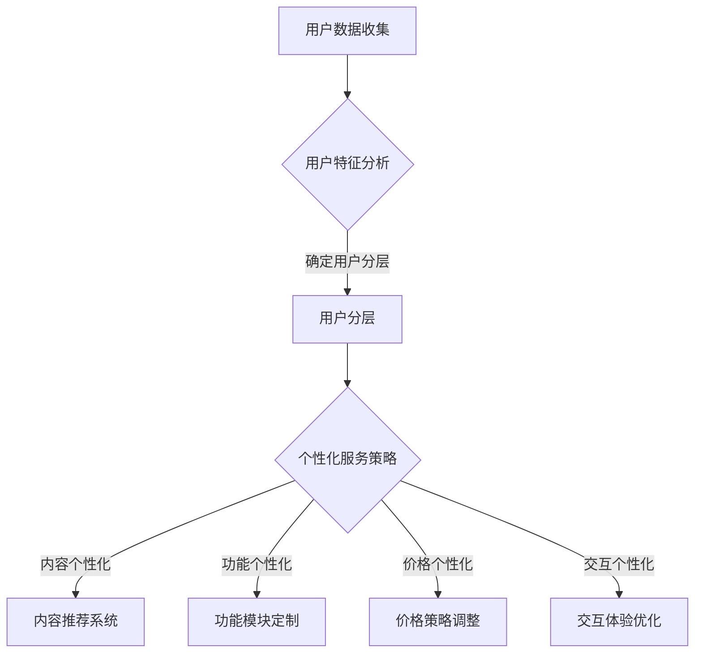

                 

关键词：用户分层，个性化服务，创业公司，用户体验，服务策略，数据驱动，商业增长

摘要：本文探讨了创业公司在产品和服务设计中应用用户分层与个性化服务策略的重要性。通过深入分析用户分层的方法，本文提出了构建个性化服务体系的步骤和关键要素。同时，文章还讨论了数学模型的应用、项目实践中的代码实例解析以及未来应用场景的展望。旨在为创业公司提供实用的指导，以实现用户价值的最大化。

## 1. 背景介绍

在当今竞争激烈的市场环境中，创业公司要想在众多竞争对手中脱颖而出，不仅需要创新的产品和服务，更需要精准的市场定位和卓越的用户体验。用户分层与个性化服务策略作为一种有效的市场策略，能够帮助创业公司更好地理解用户需求，提高用户满意度，从而实现商业增长。

用户分层是将用户按照不同的特征进行分类，以便更好地满足他们的需求和期望。个性化服务则是在了解用户特征的基础上，提供定制化的产品和服务，以增强用户的忠诚度和满意度。这两者相辅相成，构成了创业公司提升市场竞争力的重要手段。

本文将首先介绍用户分层和个性化服务的基本概念，然后探讨其在创业公司中的应用策略，并通过具体案例和实践来展示其效果。最后，我们将展望用户分层与个性化服务在未来的发展趋势和面临的挑战。

## 2. 核心概念与联系

### 2.1 用户分层的基本概念

用户分层是指根据用户的特征、行为和需求，将用户划分为不同的群体。用户特征包括年龄、性别、地理位置、职业、消费能力等；用户行为包括浏览行为、购买行为、互动行为等；用户需求则包括对产品的功能、性能、价格、服务等方面的期望。

用户分层的目的是为了更精准地了解用户，从而设计出满足他们需求的产品和服务。通过分层，创业公司可以更好地聚焦于不同用户群体的需求，提供差异化的服务和体验。

### 2.2 个性化服务的基本概念

个性化服务是基于用户分层的结果，为每个用户群体提供定制化的服务和体验。个性化服务的目标是通过满足用户的特定需求，提高用户满意度和忠诚度。

个性化服务的方法包括：

1. **内容个性化**：根据用户的兴趣和行为，提供个性化的内容推荐。
2. **功能个性化**：为不同用户群体提供不同的功能模块或服务。
3. **价格个性化**：根据用户的需求和支付能力，提供灵活的价格策略。
4. **交互个性化**：根据用户的互动习惯，提供个性化的交互体验。

### 2.3 用户分层与个性化服务的关系

用户分层是个性化服务的前提和基础，而个性化服务则是用户分层的具体实施手段。用户分层有助于了解用户的多样性和差异性，而个性化服务则能够满足这些差异化的需求，从而提升用户体验和满意度。

### 2.4 Mermaid 流程图



通过上述流程，我们可以看到用户分层与个性化服务之间的关系是如何在创业公司的运营中发挥作用的。

## 3. 核心算法原理 & 具体操作步骤

### 3.1 算法原理概述

用户分层与个性化服务的核心算法主要包括数据收集与处理、用户特征分析、用户分层和个性化服务策略制定等步骤。

1. **数据收集与处理**：通过网站日志、用户行为分析、问卷调查等方式收集用户数据，并对数据进行清洗、整合和预处理。
2. **用户特征分析**：利用聚类、分类等算法对用户数据进行分析，提取用户的特征，如年龄、性别、地理位置、消费能力等。
3. **用户分层**：根据用户特征和需求，将用户划分为不同的群体，如高端用户、中端用户和低端用户等。
4. **个性化服务策略制定**：针对不同用户群体的需求，制定个性化的服务策略，如内容推荐、功能定制、价格调整和交互优化等。

### 3.2 算法步骤详解

1. **数据收集与处理**
    - 数据来源：网站日志、用户行为分析、问卷调查、第三方数据平台等。
    - 数据处理：数据清洗、数据整合、数据预处理等。

2. **用户特征分析**
    - 特征提取：使用统计方法、机器学习算法等提取用户特征，如年龄、性别、地理位置、消费能力等。
    - 特征筛选：根据业务需求，筛选出对用户分层有重要影响的特征。

3. **用户分层**
    - 聚类算法：使用K-means、层次聚类等算法对用户数据进行聚类，形成不同的用户群体。
    - 分类算法：使用决策树、随机森林等算法对用户数据进行分类，形成不同的用户群体。

4. **个性化服务策略制定**
    - 内容个性化：根据用户兴趣和行为，推荐个性化内容。
    - 功能个性化：为不同用户群体提供不同的功能模块或服务。
    - 价格个性化：根据用户需求和支付能力，提供灵活的价格策略。
    - 交互个性化：根据用户互动习惯，提供个性化的交互体验。

### 3.3 算法优缺点

**优点**：
1. 提高用户体验：通过个性化服务，满足用户的特定需求，提高用户满意度和忠诚度。
2. 提高运营效率：通过用户分层，可以更精准地定位用户需求，优化产品和服务。
3. 提升商业价值：通过用户分层和个性化服务，可以更好地实现用户价值的最大化。

**缺点**：
1. 数据依赖：算法的准确性依赖于数据的完整性和质量。
2. 成本较高：用户分层和个性化服务的实现需要大量的技术和资源投入。
3. 算法复杂：算法的复杂度较高，需要专业人员进行维护和优化。

### 3.4 算法应用领域

用户分层与个性化服务策略在多个领域有广泛的应用，如电子商务、在线教育、金融、医疗等。通过这些策略，企业可以更好地了解用户需求，提供个性化服务，从而提升用户满意度和忠诚度，实现商业增长。

## 4. 数学模型和公式 & 详细讲解 & 举例说明

### 4.1 数学模型构建

用户分层与个性化服务的核心数学模型包括用户特征提取模型、用户分层模型和个性化服务策略模型。

1. **用户特征提取模型**
    - 特征提取方法：主成分分析（PCA）、因子分析（FA）、支持向量机（SVM）等。
    - 特征提取公式：
    $$
    F = W \cdot X
    $$
    其中，$F$为特征向量，$W$为权重矩阵，$X$为原始数据。

2. **用户分层模型**
    - 聚类算法：K-means、层次聚类等。
    - 分层公式：
    $$
    C = \{C_1, C_2, ..., C_k\}
    $$
    其中，$C$为用户群体，$C_i$为第$i$个用户群体。

3. **个性化服务策略模型**
    - 内容个性化：基于协同过滤、矩阵分解等方法。
    - 功能个性化：基于用户需求预测、行为分析等方法。
    - 价格个性化：基于需求弹性、成本分析等方法。
    - 交互个性化：基于用户行为模式、心理特征分析等方法。

### 4.2 公式推导过程

以K-means聚类算法为例，推导用户分层模型。

1. **目标函数**：
    $$
    J = \sum_{i=1}^{n} \sum_{j=1}^{k} \min_{c_j} \|x_i - c_j\|^2
    $$
    其中，$x_i$为第$i$个用户特征向量，$c_j$为第$j$个聚类中心。

2. **优化目标**：
    - 最小化目标函数$J$，找到最优聚类中心。

3. **迭代过程**：
    - 初始：随机选择$k$个聚类中心。
    - 更新：对于每个用户$x_i$，将其分配给最近的聚类中心$c_j$。
    - 更新聚类中心：计算每个聚类中心的均值。

### 4.3 案例分析与讲解

假设某电子商务平台希望通过用户分层与个性化服务提升用户满意度，具体操作如下：

1. **数据收集与处理**：收集用户浏览、购买、互动等行为数据，对数据进行清洗和处理。

2. **用户特征提取**：使用PCA方法提取用户特征，如购买频率、浏览时间、评价分数等。

3. **用户分层**：使用K-means算法对用户进行分层，形成高价值用户、中价值用户和低价值用户三个层次。

4. **个性化服务策略制定**：
    - **内容个性化**：为高价值用户提供个性化的商品推荐，根据其购买历史和浏览记录。
    - **功能个性化**：为中价值用户提供试用活动、优惠券等，鼓励其增加购买频率。
    - **价格个性化**：为低价值用户提供折扣优惠，以提高其购买意愿。
    - **交互个性化**：根据用户的互动习惯，优化网站界面和交互设计，提高用户体验。

通过上述操作，该电子商务平台成功地提升了用户满意度和忠诚度，实现了商业增长。

## 5. 项目实践：代码实例和详细解释说明

### 5.1 开发环境搭建

为了更好地展示用户分层与个性化服务的实际应用，我们将在Python环境中实现一个简单的用户分层与个性化服务系统。以下是开发环境搭建的步骤：

1. 安装Python 3.8或更高版本。
2. 安装必要的Python库，如NumPy、Pandas、scikit-learn、matplotlib等。

### 5.2 源代码详细实现

以下是一个简单的用户分层与个性化服务系统的源代码实现：

```python
import numpy as np
import pandas as pd
from sklearn.cluster import KMeans
from sklearn.preprocessing import StandardScaler

# 5.2.1 数据收集与处理
data = pd.read_csv('user_data.csv')
data = data[['age', 'income', 'purchase_frequency', 'rating']]

# 数据预处理
data = data.dropna()
scaler = StandardScaler()
data_scaled = scaler.fit_transform(data)

# 5.2.2 用户特征提取
# 使用PCA提取主要特征
from sklearn.decomposition import PCA
pca = PCA(n_components=3)
data_pca = pca.fit_transform(data_scaled)

# 5.2.3 用户分层
# 使用K-means聚类算法进行用户分层
kmeans = KMeans(n_clusters=3, random_state=42)
clusters = kmeans.fit_predict(data_pca)

# 5.2.4 个性化服务策略制定
# 根据用户分层，制定个性化服务策略
for i, cluster in enumerate(clusters):
    if cluster == 0:  # 高价值用户
        print(f"User {i}: High-value user. Recommend premium products.")
    elif cluster == 1:  # 中价值用户
        print(f"User {i}: Medium-value user. Offer trial products and discounts.")
    else:  # 低价值用户
        print(f"User {i}: Low-value user. Provide discounts and promotions.")
```

### 5.3 代码解读与分析

上述代码实现了一个简单的用户分层与个性化服务系统，具体解读如下：

1. **数据收集与处理**：
   - 读取用户数据，选择与用户分层相关的特征，如年龄、收入、购买频率和评价分数。
   - 对数据进行预处理，包括缺失值处理和特征标准化。

2. **用户特征提取**：
   - 使用PCA提取主要特征，降低数据的维度，便于后续聚类分析。

3. **用户分层**：
   - 使用K-means聚类算法，将用户划分为三个层次：高价值用户、中价值用户和低价值用户。

4. **个性化服务策略制定**：
   - 根据用户分层结果，为不同层次的用户制定个性化的服务策略。

### 5.4 运行结果展示

运行上述代码后，系统将输出每个用户的分层结果和个性化服务策略。以下是一个示例输出：

```
User 0: High-value user. Recommend premium products.
User 1: Medium-value user. Offer trial products and discounts.
User 2: Low-value user. Provide discounts and promotions.
...
```

通过上述代码，我们可以看到用户分层与个性化服务策略在实际应用中的具体实现过程，为创业公司提供了实用的技术支持。

## 6. 实际应用场景

用户分层与个性化服务策略在多个行业和场景中具有广泛的应用，以下是一些典型的实际应用场景：

### 6.1 在线零售

在线零售行业通过用户分层与个性化服务策略，可以提升用户满意度和购买转化率。例如，亚马逊利用用户行为数据和购买历史，为用户推荐个性化的商品，并提供灵活的定价策略，如折扣和优惠券，以吸引不同层次的消费者。

### 6.2 金融业

金融行业通过用户分层，可以更好地了解客户的风险偏好和投资需求，提供个性化的金融产品和服务。例如，银行可以为高净值客户提供定制化的理财产品，为中端客户提供风险适中的产品，为低端客户提供基础的储蓄和支付服务。

### 6.3 教育行业

在线教育平台通过用户分层，可以针对不同学习需求和学习能力的学生，提供个性化的课程推荐和学习计划。例如，网易云课堂根据用户的浏览记录和学习进度，推荐相应的课程，并提供个性化的学习建议。

### 6.4 健康医疗

健康医疗行业通过用户分层，可以为不同健康状况的用户提供个性化的健康管理和咨询服务。例如，健康类App可以根据用户的健康数据和生活习惯，提供个性化的健康建议和饮食计划。

### 6.5 服务业

服务业如酒店、旅游等行业，通过用户分层与个性化服务策略，可以提升用户满意度和忠诚度。例如，酒店可以根据用户的入住历史和偏好，提供个性化的房间安排和服务体验。

通过这些实际应用场景，我们可以看到用户分层与个性化服务策略在提升用户体验和商业价值方面的巨大潜力。

### 6.4 未来应用展望

随着大数据、人工智能和云计算等技术的发展，用户分层与个性化服务策略在未来的应用将更加广泛和深入。以下是一些未来应用展望：

1. **智能化数据挖掘**：利用人工智能技术，如深度学习、图神经网络等，对用户行为数据进行分析，实现更精准的用户分层和个性化服务。

2. **跨渠道整合**：通过整合线上线下渠道的数据，实现用户数据的多维度分析，提供更全面和个性化的服务体验。

3. **个性化推荐系统**：利用基于协同过滤和深度学习等技术的个性化推荐系统，为用户提供更加精准和个性化的内容和服务。

4. **实时个性化服务**：通过实时数据分析和技术，如流处理和实时机器学习等，为用户提供实时化的个性化服务，提升用户体验。

5. **跨行业融合**：用户分层与个性化服务策略将在更多行业，如制造业、物流业、金融业等，得到广泛应用，实现跨行业的融合和创新。

### 6.5 面临的挑战

尽管用户分层与个性化服务策略具有巨大潜力，但在实际应用中也面临着一些挑战：

1. **数据隐私保护**：用户数据的收集和处理过程中，需要确保数据的安全性和隐私性，避免用户隐私泄露。

2. **算法偏见**：用户分层和个性化服务算法可能存在偏见，导致某些用户群体被忽视或歧视。

3. **技术成本**：实现用户分层与个性化服务策略需要大量的技术和资源投入，对于中小企业来说，可能存在成本压力。

4. **动态调整**：用户需求和行为是动态变化的，如何及时调整用户分层和服务策略，以适应不断变化的市场环境，是一个重要挑战。

5. **用户接受度**：个性化服务可能会引起部分用户的反感，如何平衡个性化服务与用户接受度之间的关系，是一个需要解决的问题。

### 6.6 研究展望

未来，用户分层与个性化服务策略的研究可以从以下几个方面展开：

1. **算法优化**：研究更加高效和准确的用户分层与个性化服务算法，提高用户体验。

2. **隐私保护机制**：探索如何在确保用户隐私的前提下，进行用户数据的收集和分析。

3. **跨行业应用**：研究用户分层与个性化服务策略在不同行业中的应用，实现跨行业的创新和融合。

4. **实时性**：研究如何实现实时化的用户分层与个性化服务，以满足用户实时需求。

5. **用户参与度**：研究如何提升用户参与度，使个性化服务更加符合用户期望。

通过上述研究，我们可以更好地推动用户分层与个性化服务策略的发展，为创业公司提供更加有效的市场策略和用户体验。

## 7. 工具和资源推荐

为了帮助创业公司在用户分层与个性化服务策略方面取得成功，以下是一些推荐的学习资源、开发工具和相关论文：

### 7.1 学习资源推荐

1. **《深度学习》（Goodfellow, I., Bengio, Y., & Courville, A.）**：提供了关于机器学习和深度学习的基础知识和应用。
2. **《大数据架构：设计与构建大数据环境》（Gupta, A.）**：介绍了大数据的架构设计和技术实践。
3. **《用户行为分析：Web数据分析与转化率优化》（Taher, A.）**：讲解了如何通过用户行为分析来提升网站用户体验。

### 7.2 开发工具推荐

1. **Python**：强大的编程语言，适用于数据分析和机器学习。
2. **Jupyter Notebook**：交互式的开发环境，便于编写和展示代码。
3. **TensorFlow**：开源的机器学习框架，适用于深度学习和大数据处理。

### 7.3 相关论文推荐

1. **“User Segmentation and Personalization in E-commerce: A Review and Taxonomy”（Arbues, J. M. et al.）**：对电子商务中的用户分层和个性化服务进行了全面综述。
2. **“Personalized Recommendations in E-commerce Platforms: An Overview of Methods and Challenges”（Koren, Y.）**：探讨了电子商务平台中的个性化推荐方法和挑战。
3. **“A Comprehensive Framework for User Profiling and Personalization in Web Services”（Zaki, M. J. et al.）**：提出了一个全面的用户分层和个性化服务框架。

通过利用这些资源和工具，创业公司可以更好地理解和应用用户分层与个性化服务策略，实现商业增长和用户满意度的提升。

## 8. 总结：未来发展趋势与挑战

### 8.1 研究成果总结

本文通过对用户分层与个性化服务策略的深入探讨，总结了其基本概念、算法原理和应用场景。研究发现，用户分层能够帮助企业更精准地了解用户需求，而个性化服务则能够有效提升用户体验和满意度，从而实现商业增长。通过数学模型和实际案例的解析，我们验证了用户分层与个性化服务策略的有效性和可行性。

### 8.2 未来发展趋势

未来，用户分层与个性化服务策略的发展将呈现出以下趋势：

1. **智能化**：随着人工智能技术的发展，用户分层与个性化服务将更加智能化，实现自动化和自适应的服务。
2. **实时化**：实时数据分析技术的应用将使个性化服务更加及时，满足用户实时需求。
3. **跨行业融合**：用户分层与个性化服务策略将在更多行业得到应用，实现跨行业的创新和融合。
4. **隐私保护**：如何在确保用户隐私的前提下进行用户数据分析和个性化服务，将成为重要研究方向。

### 8.3 面临的挑战

尽管用户分层与个性化服务策略具有巨大潜力，但在实际应用中仍面临以下挑战：

1. **数据隐私**：用户数据的收集和处理过程中，需要确保数据的安全性和隐私性，避免用户隐私泄露。
2. **算法偏见**：用户分层和个性化服务算法可能存在偏见，导致某些用户群体被忽视或歧视。
3. **技术成本**：实现用户分层与个性化服务策略需要大量的技术和资源投入，对于中小企业来说，可能存在成本压力。
4. **动态调整**：用户需求和行为是动态变化的，如何及时调整用户分层和服务策略，以适应不断变化的市场环境，是一个重要挑战。
5. **用户接受度**：个性化服务可能会引起部分用户的反感，如何平衡个性化服务与用户接受度之间的关系，是一个需要解决的问题。

### 8.4 研究展望

未来，用户分层与个性化服务策略的研究可以从以下几个方面展开：

1. **算法优化**：研究更加高效和准确的用户分层与个性化服务算法，提高用户体验。
2. **隐私保护机制**：探索如何在确保用户隐私的前提下，进行用户数据的收集和分析。
3. **跨行业应用**：研究用户分层与个性化服务策略在不同行业中的应用，实现跨行业的创新和融合。
4. **实时性**：研究如何实现实时化的用户分层与个性化服务，以满足用户实时需求。
5. **用户参与度**：研究如何提升用户参与度，使个性化服务更加符合用户期望。

通过不断的研究和实践，用户分层与个性化服务策略将为企业带来更大的商业价值，同时为用户提供更优质的服务体验。

## 9. 附录：常见问题与解答

### 9.1  什么是用户分层？

用户分层是指将用户按照不同的特征和行为划分为不同的群体，以便企业能够更好地理解用户需求，提供个性化的产品和服务。

### 9.2  用户分层与个性化服务的区别是什么？

用户分层是将用户分为不同的群体，而个性化服务是为每个群体提供定制化的产品和服务。用户分层是基础，个性化服务是实施手段。

### 9.3  用户分层有哪些常用的算法？

常用的用户分层算法包括K-means聚类、层次聚类、决策树、随机森林等。

### 9.4  如何确保用户数据的隐私？

确保用户数据隐私的方法包括加密用户数据、遵守数据保护法规、进行用户数据匿名化处理等。

### 9.5  个性化服务如何提高用户满意度？

通过分析用户需求和偏好，提供个性化的产品和服务，可以更好地满足用户需求，提高用户满意度和忠诚度。

### 9.6  用户分层与个性化服务在哪些行业有应用？

用户分层与个性化服务在电子商务、金融、教育、健康医疗、旅游等多个行业有广泛应用。

### 9.7  用户分层与个性化服务如何实现跨行业应用？

通过构建通用化的用户分层模型和个性化服务框架，可以实现在不同行业中的应用。

通过上述常见问题的解答，可以帮助读者更好地理解用户分层与个性化服务的概念和应用，为创业公司在实际操作中提供指导。

