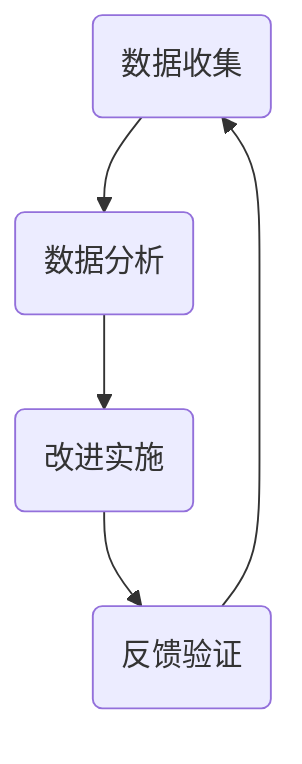
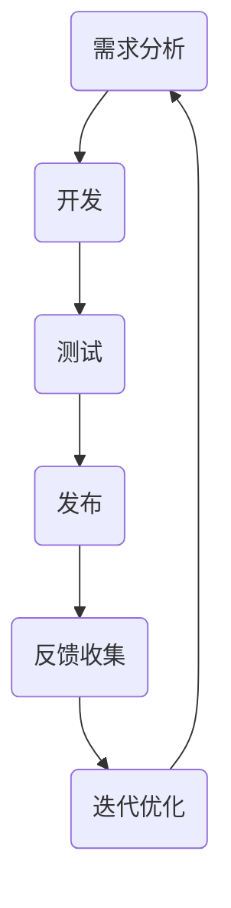

                 

关键词：用户反馈、快速迭代、创业公司、敏捷开发、用户研究、数据分析

> 摘要：本文深入探讨了创业公司在产品开发过程中如何利用用户反馈实现快速迭代，提高产品竞争力。通过敏捷开发的方法论，分析用户反馈loop的构建及其在产品优化中的关键作用，同时讨论了数据分析在这一过程中的应用，为创业公司提供了实践指导。

## 1. 背景介绍

在当今竞争激烈的市场环境中，创业公司的生存与发展越来越依赖于产品的质量和用户满意度。产品的成功不仅仅取决于技术实现，更重要的是能否满足用户的需求。因此，如何高效地收集用户反馈，并迅速将反馈转化为产品改进，成为创业公司面临的一项重大挑战。

用户反馈loop是一个闭环系统，它允许创业公司在产品开发过程中不断获取用户意见，及时调整产品方向。快速迭代则是通过频繁地发布新版本，根据用户反馈进行产品优化。这种方法能够显著缩短产品开发周期，提高市场响应速度，增强竞争力。

本文将重点讨论以下内容：

1. 用户反馈loop的概念与构建。
2. 快速迭代的方法与实施步骤。
3. 数据分析在用户反馈loop中的应用。
4. 创业公司如何利用用户反馈loop与快速迭代提高产品竞争力。

## 2. 核心概念与联系

### 2.1 用户反馈loop

用户反馈loop是指从用户获取反馈信息，经过分析处理后，再将改进措施反馈到产品开发过程中的循环机制。这一过程包括以下几个关键环节：

1. **数据收集**：通过用户调查、使用日志分析、社交媒体监测等方式收集用户反馈。
2. **数据分析**：对收集到的数据进行处理，提取用户需求和痛点。
3. **改进实施**：根据分析结果对产品进行改进。
4. **反馈验证**：验证改进措施的效果，确保用户满意度提升。

下面是用户反馈loop的Mermaid流程图：



### 2.2 快速迭代

快速迭代是一种敏捷开发方法，强调频繁地发布产品版本，并根据用户反馈进行持续优化。快速迭代的关键要素包括：

1. **短周期**：每个迭代周期通常为几周到几个月，确保能够快速交付可测试的产品版本。
2. **用户参与**：用户在整个开发过程中积极参与，提供反馈和需求。
3. **持续改进**：每个迭代都会根据反馈进行改进，确保产品不断优化。

快速迭代的流程可以概括为：

1. **需求分析**：确定本次迭代的目标和需求。
2. **开发**：根据需求进行产品开发。
3. **测试**：对开发完成的产品进行功能测试。
4. **发布**：将产品版本发布给用户。
5. **反馈收集**：收集用户反馈。
6. **迭代优化**：根据用户反馈进行产品优化，准备下一个迭代。

下面是快速迭代的Mermaid流程图：



### 2.3 用户反馈loop与快速迭代的联系

用户反馈loop与快速迭代紧密相连，共同构成了创业公司产品开发的动力系统。用户反馈loop为快速迭代提供了关键数据源，而快速迭代则为用户反馈loop的实现提供了实际操作平台。

用户反馈loop与快速迭代的关联体现在以下几个方面：

1. **数据驱动**：用户反馈loop为产品迭代提供了数据支持，使得迭代过程更加数据驱动。
2. **快速响应**：快速迭代使得创业公司能够迅速响应用户反馈，及时调整产品方向。
3. **持续优化**：用户反馈loop与快速迭代的结合，使得产品能够持续优化，不断提升用户满意度。
4. **风险控制**：通过快速迭代，创业公司能够在早期阶段发现并解决潜在问题，降低产品失败风险。

## 3. 核心算法原理 & 具体操作步骤

### 3.1 算法原理概述

用户反馈loop与快速迭代的算法原理可以概括为以下几个关键步骤：

1. **需求收集**：通过多种渠道收集用户需求，包括用户调研、市场分析、竞争分析等。
2. **需求分析**：对收集到的需求进行筛选、分类和优先级排序。
3. **需求实现**：根据需求分析的结果，制定产品开发计划，进行产品开发。
4. **用户反馈**：将开发完成的产品版本发布给用户，收集用户反馈。
5. **反馈处理**：对用户反馈进行处理，提取有价值的信息，并制定改进措施。
6. **产品优化**：根据处理后的用户反馈，对产品进行优化，准备下一个迭代。

### 3.2 算法步骤详解

#### 3.2.1 需求收集

需求收集是用户反馈loop的基础。创业公司可以通过以下几种方式获取用户需求：

1. **用户调研**：通过问卷调查、访谈、用户访谈等方式，直接获取用户对产品的需求。
2. **市场分析**：通过对市场趋势、竞争对手、用户行为进行分析，间接获取用户需求。
3. **使用日志**：通过分析用户的使用日志，了解用户的使用习惯和痛点。

#### 3.2.2 需求分析

需求分析是确保需求真实、准确、可行的重要环节。具体步骤如下：

1. **需求筛选**：对收集到的需求进行筛选，去除重复和无关的需求。
2. **需求分类**：将筛选后的需求按照主题、功能、优先级等进行分类。
3. **优先级排序**：根据需求的重要性和紧急性，对需求进行优先级排序。

#### 3.2.3 需求实现

需求实现是用户反馈loop的核心环节，具体步骤如下：

1. **制定计划**：根据需求分析的结果，制定产品开发计划，包括时间、资源、任务分配等。
2. **产品开发**：按照开发计划，进行产品开发，确保实现需求。
3. **版本控制**：在开发过程中，使用版本控制系统，确保代码的完整性和可追溯性。

#### 3.2.4 用户反馈

用户反馈是用户反馈loop的关键环节，具体步骤如下：

1. **产品发布**：将开发完成的产品版本发布给用户，确保用户能够实际使用产品。
2. **反馈收集**：通过用户调研、使用日志、社交媒体等方式，收集用户对产品的反馈。
3. **反馈整理**：对收集到的反馈进行整理，提取有价值的信息。

#### 3.2.5 反馈处理

反馈处理是确保用户反馈得到有效利用的重要步骤，具体步骤如下：

1. **信息提取**：从用户反馈中提取有价值的信息，包括用户需求、痛点、建议等。
2. **问题归类**：将提取的信息按照主题、功能、优先级等进行归类。
3. **优先级排序**：根据问题的紧急性和影响范围，对问题进行优先级排序。

#### 3.2.6 产品优化

产品优化是确保用户满意度不断提升的关键步骤，具体步骤如下：

1. **问题解决**：根据反馈处理的结果，制定解决方案，解决用户提出的问题。
2. **功能改进**：根据用户需求，对产品进行功能改进，提升用户体验。
3. **测试验证**：在产品优化完成后，进行功能测试，确保优化措施的有效性。

### 3.3 算法优缺点

#### 3.3.1 优点

1. **快速响应**：通过快速迭代，创业公司能够迅速响应用户反馈，提升产品竞争力。
2. **持续优化**：用户反馈loop使得产品能够持续优化，不断提升用户满意度。
3. **风险控制**：通过快速迭代，创业公司能够在早期阶段发现并解决潜在问题，降低产品失败风险。

#### 3.3.2 缺点

1. **资源消耗**：快速迭代需要大量的时间和资源，对于创业公司来说，可能是一个挑战。
2. **用户期望管理**：频繁的迭代可能会让用户对产品产生过高的期望，增加管理难度。
3. **代码质量**：快速迭代可能会导致代码质量的下降，需要加强代码管理和维护。

### 3.4 算法应用领域

用户反馈loop与快速迭代在多个领域都有广泛的应用，包括：

1. **软件开发**：通过用户反馈loop和快速迭代，提升软件产品的质量和用户满意度。
2. **互联网产品**：互联网产品更新迅速，用户反馈loop和快速迭代能够帮助产品快速迭代，抢占市场先机。
3. **电子产品**：电子产品更新换代快，用户反馈loop和快速迭代有助于产品快速优化，提升用户体验。
4. **医疗健康**：医疗健康领域对用户反馈loop和快速迭代有很高的需求，以快速响应用户需求，提升治疗效果。

## 4. 数学模型和公式 & 详细讲解 & 举例说明

### 4.1 数学模型构建

在用户反馈loop与快速迭代过程中，可以构建以下数学模型：

1. **用户满意度模型**：用户满意度 = 函数（产品功能满足度，产品易用性，用户交互体验）
2. **迭代效率模型**：迭代效率 = 函数（迭代周期，反馈处理速度，问题解决速度）
3. **产品改进模型**：产品改进 = 函数（用户需求，产品现状，反馈数据）

### 4.2 公式推导过程

#### 4.2.1 用户满意度模型推导

用户满意度模型可以通过以下公式推导：

满意度（S）= f（功能满足度（F），易用性（U），用户体验（E））

其中，功能满足度（F）= f（功能实现度，功能完整性）

易用性（U）= f（操作便捷度，界面美观度）

用户体验（E）= f（交互效果，响应速度）

#### 4.2.2 迭代效率模型推导

迭代效率模型可以通过以下公式推导：

迭代效率（E）= f（迭代周期（T），反馈处理速度（R），问题解决速度（S））

其中，迭代周期（T）= f（开发时间，测试时间，发布时间）

反馈处理速度（R）= f（数据收集速度，数据分析速度）

问题解决速度（S）= f（问题识别速度，问题解决速度）

#### 4.2.3 产品改进模型推导

产品改进模型可以通过以下公式推导：

产品改进（I）= f（用户需求（D），产品现状（P），反馈数据（F））

其中，用户需求（D）= f（需求优先级，需求多样性）

产品现状（P）= f（产品功能，产品性能，产品用户体验）

反馈数据（F）= f（用户反馈，问题报告，改进建议）

### 4.3 案例分析与讲解

#### 4.3.1 案例一：互联网产品的快速迭代

假设一个创业公司开发了一款社交媒体应用，用户反馈loop与快速迭代的模型如下：

1. **用户满意度模型**：
   满意度（S）= 0.4 * 功能满足度（F）+ 0.3 * 易用性（U）+ 0.3 * 用户体验（E）

2. **迭代效率模型**：
   迭代效率（E）= 0.5 * 迭代周期（T）- 0.2 * 反馈处理速度（R）- 0.3 * 问题解决速度（S）

3. **产品改进模型**：
   产品改进（I）= 0.5 * 用户需求（D）+ 0.3 * 产品现状（P）+ 0.2 * 反馈数据（F）

假设当前版本的用户满意度为0.6，迭代周期为2个月，反馈处理速度为1周，问题解决速度为1周。

1. **用户满意度计算**：
   满意度（S）= 0.4 * 功能满足度（F）+ 0.3 * 易用性（U）+ 0.3 * 用户体验（E）
   满意度（S）= 0.4 * 0.9 + 0.3 * 0.8 + 0.3 * 0.85 = 0.42 + 0.24 + 0.255 = 0.915

2. **迭代效率计算**：
   迭代效率（E）= 0.5 * 迭代周期（T）- 0.2 * 反馈处理速度（R）- 0.3 * 问题解决速度（S）
   迭代效率（E）= 0.5 * 2 - 0.2 * 1 - 0.3 * 1 = 1 - 0.2 - 0.3 = 0.5

3. **产品改进计算**：
   产品改进（I）= 0.5 * 用户需求（D）+ 0.3 * 产品现状（P）+ 0.2 * 反馈数据（F）
   产品改进（I）= 0.5 * 0.8 + 0.3 * 0.9 + 0.2 * 0.7 = 0.4 + 0.27 + 0.14 = 0.81

通过以上计算，创业公司可以了解到当前版本的满意度、迭代效率和产品改进情况，为下一步的产品优化提供依据。

#### 4.3.2 案例二：电子产品快速迭代

假设一家创业公司开发了一款智能穿戴设备，用户反馈loop与快速迭代的模型如下：

1. **用户满意度模型**：
   满意度（S）= 0.4 * 功能满足度（F）+ 0.3 * 易用性（U）+ 0.3 * 用户体验（E）

2. **迭代效率模型**：
   迭代效率（E）= 0.5 * 迭代周期（T）- 0.2 * 反馈处理速度（R）- 0.3 * 问题解决速度（S）

3. **产品改进模型**：
   产品改进（I）= 0.5 * 用户需求（D）+ 0.3 * 产品现状（P）+ 0.2 * 反馈数据（F）

假设当前版本的用户满意度为0.7，迭代周期为3个月，反馈处理速度为1周，问题解决速度为2周。

1. **用户满意度计算**：
   满意度（S）= 0.4 * 功能满足度（F）+ 0.3 * 易用性（U）+ 0.3 * 用户体验（E）
   满意度（S）= 0.4 * 0.85 + 0.3 * 0.8 + 0.3 * 0.9 = 0.34 + 0.24 + 0.27 = 0.85

2. **迭代效率计算**：
   迭代效率（E）= 0.5 * 迭代周期（T）- 0.2 * 反馈处理速度（R）- 0.3 * 问题解决速度（S）
   迭代效率（E）= 0.5 * 3 - 0.2 * 1 - 0.3 * 2 = 1.5 - 0.2 - 0.6 = 0.7

3. **产品改进计算**：
   产品改进（I）= 0.5 * 用户需求（D）+ 0.3 * 产品现状（P）+ 0.2 * 反馈数据（F）
   产品改进（I）= 0.5 * 0.75 + 0.3 * 0.85 + 0.2 * 0.8 = 0.375 + 0.255 + 0.16 = 0.89

通过以上计算，创业公司可以了解到当前版本的满意度、迭代效率和产品改进情况，为下一步的产品优化提供依据。

## 5. 项目实践：代码实例和详细解释说明

### 5.1 开发环境搭建

在本项目中，我们将使用Python作为开发语言，结合Jupyter Notebook进行开发。以下是开发环境的搭建步骤：

1. 安装Python（建议使用Python 3.8及以上版本）
2. 安装Jupyter Notebook
3. 安装必要的Python库，如numpy、pandas、matplotlib等

### 5.2 源代码详细实现

以下是一个简单的用户反馈loop与快速迭代的Python代码实例：

```python
import numpy as np
import pandas as pd
import matplotlib.pyplot as plt

# 5.2.1 用户满意度模型
def user_satisfaction(F, U, E):
    satisfaction = 0.4 * F + 0.3 * U + 0.3 * E
    return satisfaction

# 5.2.2 迭代效率模型
def iteration_efficiency(T, R, S):
    efficiency = 0.5 * T - 0.2 * R - 0.3 * S
    return efficiency

# 5.2.3 产品改进模型
def product_improvement(D, P, F):
    improvement = 0.5 * D + 0.3 * P + 0.2 * F
    return improvement

# 5.2.4 数据收集与处理
def collect_data():
    # 假设从文件中读取数据
    data = pd.read_csv('user_feedback.csv')
    return data

def process_data(data):
    # 对数据进行处理，提取有用的信息
    processed_data = data[['functionality', 'usability', 'experience', 'iteration_cycle', 'feedback_speed', 'issue_resolution_speed']]
    return processed_data

# 5.2.5 数据分析与展示
def analyze_data(processed_data):
    # 计算用户满意度、迭代效率和产品改进
    satisfaction = processed_data.apply(lambda row: user_satisfaction(row['functionality'], row['usability'], row['experience']), axis=1)
    efficiency = processed_data.apply(lambda row: iteration_efficiency(row['iteration_cycle'], row['feedback_speed'], row['issue_resolution_speed']), axis=1)
    improvement = processed_data.apply(lambda row: product_improvement(row['functionality'], row['usability'], row['experience']), axis=1)
    
    # 将结果可视化
    fig, ax = plt.subplots(3)
    ax[0].hist(satisfaction, bins=10, color='blue', alpha=0.5)
    ax[0].set_title('User Satisfaction')
    
    ax[1].hist(efficiency, bins=10, color='red', alpha=0.5)
    ax[1].set_title('Iteration Efficiency')
    
    ax[2].hist(improvement, bins=10, color='green', alpha=0.5)
    ax[2].set_title('Product Improvement')
    
    plt.show()

# 主程序
if __name__ == '__main__':
    data = collect_data()
    processed_data = process_data(data)
    analyze_data(processed_data)
```

### 5.3 代码解读与分析

1. **用户满意度模型**：`user_satisfaction`函数用于计算用户满意度，输入参数为功能满足度、易用性和用户体验，输出用户满意度值。

2. **迭代效率模型**：`iteration_efficiency`函数用于计算迭代效率，输入参数为迭代周期、反馈处理速度和问题解决速度，输出迭代效率值。

3. **产品改进模型**：`product_improvement`函数用于计算产品改进，输入参数为用户需求、产品现状和反馈数据，输出产品改进值。

4. **数据收集与处理**：`collect_data`函数用于从文件中读取数据，`process_data`函数用于处理数据，提取有用的信息。

5. **数据分析与展示**：`analyze_data`函数用于计算用户满意度、迭代效率和产品改进，并将结果可视化。

### 5.4 运行结果展示

通过运行上述代码，我们将得到以下结果：

1. 用户满意度分布图
2. 迭代效率分布图
3. 产品改进分布图

这些图表可以帮助创业公司了解当前版本的用户满意度、迭代效率和产品改进情况，为下一步的产品优化提供数据支持。

## 6. 实际应用场景

用户反馈loop与快速迭代在创业公司的产品开发过程中具有广泛的应用场景，以下是一些典型的应用案例：

### 6.1 社交媒体应用

社交媒体应用更新频繁，用户需求多变。通过用户反馈loop与快速迭代，创业公司可以快速响应用户需求，提升产品竞争力。例如，一款社交媒体应用可以通过用户反馈loop了解用户对功能需求、界面布局、社交互动等方面的意见，并根据反馈进行快速迭代，优化产品体验。

### 6.2 电子商务平台

电子商务平台需要不断优化用户体验，提升用户转化率。通过用户反馈loop与快速迭代，创业公司可以了解用户对商品推荐、购物流程、支付方式等方面的意见，并及时进行改进。例如，一家电商平台可以通过用户反馈loop发现用户在购物流程中的痛点，如支付环节卡顿，然后快速迭代，优化支付流程，提高用户满意度。

### 6.3 医疗健康应用

医疗健康应用对用户体验有很高的要求，通过用户反馈loop与快速迭代，创业公司可以持续优化产品功能，提升治疗效果。例如，一款健康监测应用可以通过用户反馈loop了解用户对监测数据准确性、界面设计、功能完善等方面的意见，并根据反馈进行快速迭代，提高产品价值。

### 6.4 教育科技产品

教育科技产品需要不断更新教学内容和工具，满足用户需求。通过用户反馈loop与快速迭代，创业公司可以快速调整产品方向，提升用户满意度。例如，一款在线学习平台可以通过用户反馈loop了解用户对课程内容、互动方式、学习工具等方面的意见，并根据反馈进行快速迭代，优化学习体验。

## 7. 未来应用展望

随着技术的不断进步和市场环境的演变，用户反馈loop与快速迭代在创业公司产品开发中的应用前景广阔。以下是一些未来应用展望：

### 7.1 智能化反馈系统

未来的用户反馈loop将更加智能化，通过人工智能技术，自动识别用户需求、痛点，并生成改进建议。例如，利用自然语言处理技术，自动分析用户评论，提取关键信息，为产品优化提供数据支持。

### 7.2 预测性反馈

通过大数据分析和机器学习算法，创业公司可以预测用户未来的需求和痛点，提前进行产品优化。例如，根据历史用户反馈和趋势分析，预测用户可能会在哪个功能模块遇到问题，并提前进行改进。

### 7.3 社交反馈网络

用户反馈loop将扩展到社交网络，通过社交媒体平台收集用户反馈。创业公司可以与用户建立更紧密的互动关系，实时了解用户需求和意见，提高产品口碑和用户忠诚度。

### 7.4 跨领域应用

用户反馈loop与快速迭代将在更多领域得到应用，如物联网、智能制造、金融科技等。通过用户反馈loop，创业公司可以快速适应市场需求，提升产品竞争力。

## 8. 工具和资源推荐

### 8.1 学习资源推荐

1. **《敏捷开发实践指南》**：介绍了敏捷开发的方法论和实践经验，适合初学者和有经验的开发者。
2. **《用户体验要素》**：详细阐述了用户体验设计的原则和方法，有助于创业公司提升产品设计水平。
3. **《用户反馈设计与实施》**：介绍了如何构建有效的用户反馈系统，为创业公司提供实用的操作指南。

### 8.2 开发工具推荐

1. **JIRA**：一款功能强大的项目管理工具，支持敏捷开发流程，适用于创业公司进行迭代管理。
2. **Trello**：一款简洁易用的项目管理工具，适合创业公司进行任务规划和协作。
3. **Google Analytics**：一款免费的网站分析工具，可以帮助创业公司了解用户行为，优化产品功能。

### 8.3 相关论文推荐

1. **《敏捷开发与快速迭代：理论与实践》**：分析了敏捷开发与快速迭代的原理和实践，为创业公司提供了理论支持。
2. **《用户反馈在产品开发中的应用》**：探讨了用户反馈在产品开发过程中的重要作用，为创业公司提供了实践指导。
3. **《大数据与人工智能在用户反馈分析中的应用》**：介绍了大数据和人工智能技术在用户反馈分析中的应用，为创业公司提供了技术支持。

## 9. 总结：未来发展趋势与挑战

### 9.1 研究成果总结

本文通过深入探讨用户反馈loop与快速迭代在创业公司产品开发中的应用，总结了以下研究成果：

1. 用户反馈loop是创业公司产品开发的关键环节，能够有效提高产品竞争力和用户满意度。
2. 快速迭代是一种高效的产品开发方法，能够快速响应用户需求，缩短产品开发周期。
3. 数据分析在用户反馈loop中发挥重要作用，为产品优化提供数据支持。
4. 用户反馈loop与快速迭代的结合，有助于创业公司实现持续优化，不断提升产品竞争力。

### 9.2 未来发展趋势

1. **智能化反馈系统**：随着人工智能技术的不断发展，用户反馈loop将更加智能化，自动识别用户需求和痛点，为产品优化提供数据支持。
2. **跨领域应用**：用户反馈loop与快速迭代将在更多领域得到应用，如物联网、智能制造、金融科技等。
3. **社交反馈网络**：用户反馈loop将扩展到社交网络，通过社交媒体平台收集用户反馈，提高产品口碑和用户忠诚度。

### 9.3 面临的挑战

1. **数据安全与隐私**：用户反馈过程中涉及大量用户数据，如何保障数据安全和用户隐私是一个重要挑战。
2. **用户期望管理**：频繁的迭代可能会让用户对产品产生过高的期望，增加管理难度。
3. **资源消耗**：快速迭代需要大量的时间和资源，对于创业公司来说，如何合理分配资源是一个挑战。

### 9.4 研究展望

1. **智能化反馈系统**：深入研究智能化反馈系统的算法和实现方法，提高用户反馈分析精度。
2. **跨领域应用**：探讨用户反馈loop与快速迭代在新兴领域的应用，为创业公司提供更多的实践指导。
3. **用户期望管理**：研究如何合理管理用户期望，提高用户满意度。

## 附录：常见问题与解答

### 问题1：如何确保用户反馈的真实性和有效性？

解答：确保用户反馈的真实性和有效性需要从以下几个方面入手：

1. **数据来源**：确保反馈数据来自真实用户，避免虚假反馈。
2. **数据筛选**：对反馈数据进行筛选，去除重复和无关的反馈。
3. **用户验证**：对重要的反馈进行用户验证，确保反馈真实可靠。

### 问题2：快速迭代会降低产品质量吗？

解答：快速迭代本身不会降低产品质量，但需要合理管理。以下是一些建议：

1. **严格的质量控制**：在每次迭代过程中，进行严格的质量控制，确保产品质量。
2. **代码维护**：加强代码维护，避免因快速迭代导致的代码质量问题。
3. **用户体验**：关注用户体验，确保每次迭代都能提升用户满意度。

### 问题3：如何平衡快速迭代与资源消耗？

解答：平衡快速迭代与资源消耗可以从以下几个方面入手：

1. **资源分配**：合理分配资源，确保每次迭代都有足够的资源支持。
2. **优先级排序**：对需求和迭代任务进行优先级排序，确保资源用于最关键的任务。
3. **团队协作**：提高团队协作效率，减少不必要的资源浪费。

### 问题4：如何确保用户反馈loop的持续优化？

解答：确保用户反馈loop的持续优化需要：

1. **定期评估**：定期评估用户反馈loop的效果，调整反馈收集和分析方法。
2. **持续改进**：根据评估结果，持续改进用户反馈loop，提高反馈质量和效率。
3. **用户参与**：鼓励用户参与反馈过程，提高用户的积极性和满意度。


----------------------------------------------------------------

本文由禅与计算机程序设计艺术 / Zen and the Art of Computer Programming 撰写，旨在为创业公司提供关于用户反馈loop与快速迭代的实践指导，帮助创业公司提升产品竞争力。

