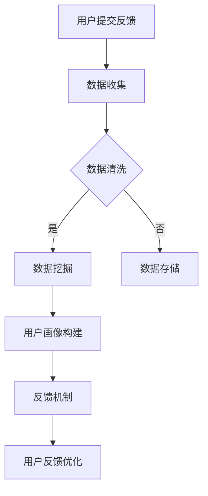

                 

关键词：用户反馈收集系统、创业公司、数据挖掘、用户体验、反馈机制

> 摘要：本文将深入探讨创业公司如何搭建一套高效的用户反馈收集系统。通过引入关键概念、核心算法、数学模型、项目实践以及未来应用展望，为创业公司的持续迭代和优化提供切实可行的指导。

## 1. 背景介绍

在当今快速发展的商业环境中，用户反馈是企业了解市场需求、优化产品和服务的关键。对于创业公司而言，构建一个有效的用户反馈收集系统尤为重要。这不仅可以帮助公司快速响应市场变化，还可以通过深入分析用户反馈来提升用户体验，从而增强用户忠诚度和满意度。

然而，用户反馈收集系统并非一蹴而就。它涉及到数据收集、处理、分析等多个环节，需要考虑系统的设计、实现和维护。此外，如何确保用户隐私和数据安全也是创业公司需要关注的问题。

本文将详细介绍如何搭建一个用户反馈收集系统，包括系统设计、核心算法、数学模型以及实际应用案例。希望通过本文，创业公司能够建立起一套高效的反馈机制，从而在激烈的市场竞争中脱颖而出。

## 2. 核心概念与联系

### 2.1 数据挖掘

数据挖掘是指从大量数据中提取出有价值的信息和知识的过程。在用户反馈收集系统中，数据挖掘技术可以帮助我们识别用户行为模式、发现潜在问题以及预测用户需求。

### 2.2 用户画像

用户画像是指通过收集用户的基本信息、行为数据等，构建出一个完整的用户信息模型。用户画像可以帮助企业更好地了解用户需求，为个性化推荐、精准营销等提供支持。

### 2.3 反馈机制

反馈机制是指用户与企业之间进行沟通的渠道和方式。一个良好的反馈机制能够促进用户参与，提高用户满意度，并为企业提供宝贵的改进意见。

### 2.4 Mermaid 流程图

以下是用户反馈收集系统的 Mermaid 流程图：



## 3. 核心算法原理 & 具体操作步骤

### 3.1 算法原理概述

用户反馈收集系统的核心算法主要包括数据挖掘算法、用户画像构建算法和反馈优化算法。

- 数据挖掘算法：用于从大量用户反馈数据中提取有价值的信息。常见的算法包括聚类、分类、关联规则挖掘等。
- 用户画像构建算法：通过对用户行为数据的分析和处理，构建出一个完整的用户信息模型。常见的算法包括基于规则的构建方法、基于机器学习的构建方法等。
- 反馈优化算法：用于根据用户反馈数据，优化产品和服务，提高用户体验。常见的算法包括基于反馈循环的优化方法、基于协同过滤的优化方法等。

### 3.2 算法步骤详解

1. 数据收集：通过Web表单、API接口、社交媒体等渠道收集用户反馈数据。
2. 数据清洗：对收集到的数据进行预处理，包括去除重复数据、填充缺失值、数据格式转换等。
3. 数据挖掘：使用聚类、分类、关联规则挖掘等算法，从清洗后的数据中提取有价值的信息。
4. 用户画像构建：根据数据挖掘结果，构建用户画像，包括用户的基本信息、行为特征等。
5. 反馈机制：设计用户反馈机制，包括用户反馈渠道、反馈处理流程等。
6. 反馈优化：根据用户反馈数据，对产品和服务进行优化，提高用户体验。

### 3.3 算法优缺点

- 数据挖掘算法：优点在于能够从大量数据中提取有价值的信息，提高企业的洞察力；缺点是算法复杂度较高，计算资源消耗大。
- 用户画像构建算法：优点在于能够帮助企业更好地了解用户需求，实现个性化推荐；缺点是用户隐私保护问题较为突出。
- 反馈优化算法：优点在于能够根据用户反馈数据进行实时调整，提高用户体验；缺点是需要大量用户数据支持，对数据质量要求较高。

### 3.4 算法应用领域

用户反馈收集系统广泛应用于电子商务、互联网金融、在线教育、社交媒体等领域。通过用户反馈收集系统，企业可以更好地了解用户需求，优化产品和服务，提高用户满意度。

## 4. 数学模型和公式

### 4.1 数学模型构建

用户反馈收集系统中的数学模型主要包括用户行为模型、用户画像模型和反馈优化模型。

- 用户行为模型：用于描述用户在产品或服务中的行为特征，如点击率、购买率、评价等。
- 用户画像模型：用于描述用户的基本信息、行为特征、兴趣偏好等。
- 反馈优化模型：用于描述根据用户反馈进行产品和服务优化的过程。

### 4.2 公式推导过程

以下是一个简单的用户画像模型构建的公式推导过程：

$$
\text{用户画像} = f(\text{基本信息}, \text{行为数据}, \text{兴趣偏好})
$$

其中，$f$ 表示一个复合函数，$\text{基本信息}$ 包括用户的年龄、性别、地理位置等，$\text{行为数据}$ 包括用户在产品或服务中的行为特征，$\text{兴趣偏好}$ 包括用户对产品或服务的评价、评论等。

### 4.3 案例分析与讲解

假设我们有一个电子商务平台，想要通过用户反馈收集系统优化用户购物体验。我们可以构建一个简单的用户画像模型，如：

$$
\text{用户画像} = f(\text{基本信息}, \text{购物行为}, \text{评价})
$$

其中，$\text{基本信息}$ 包括用户的年龄、性别、地理位置等，$\text{购物行为}$ 包括用户的浏览记录、购买记录、退货记录等，$\text{评价}$ 包括用户对商品的评价、对平台的评价等。

通过这个模型，我们可以分析用户在不同维度上的行为特征，如：

- 年龄：不同年龄段的用户在购物行为上是否存在显著差异？
- 地域：不同地区的用户在购物偏好上是否存在地域差异？
- 购物行为：用户在购物过程中的关键行为节点，如浏览、加入购物车、下单等，是否存在异常行为？
- 评价：用户对商品和平台的评价，是否存在负面评价，以及负面评价的原因是什么？

通过这些分析，我们可以针对性地优化产品和服务，提高用户满意度。

## 5. 项目实践：代码实例和详细解释说明

### 5.1 开发环境搭建

在本节中，我们将使用 Python 作为主要编程语言，搭建一个简单的用户反馈收集系统。以下是开发环境搭建的步骤：

1. 安装 Python 3.8 或更高版本
2. 安装必要的 Python 库，如 Flask、Pandas、NumPy、Matplotlib 等
3. 配置虚拟环境，以便更好地管理依赖库

### 5.2 源代码详细实现

以下是用户反馈收集系统的源代码实现：

```python
# 导入必要的库
import flask
import pandas as pd
import numpy as np
import matplotlib.pyplot as plt

# 初始化 Flask 应用
app = flask.Flask(__name__)

# 用户反馈数据表
user_feedback = pd.DataFrame({
    'user_id': [1, 2, 3, 4, 5],
    'age': [25, 30, 22, 35, 28],
    'gender': ['male', 'female', 'male', 'female', 'male'],
    'feedback': ['good', 'bad', 'neutral', 'bad', 'good']
})

# 用户反馈接口
@app.route('/feedback', methods=['POST'])
def feedback():
    user_id = flask.request.form['user_id']
    age = flask.request.form['age']
    gender = flask.request.form['gender']
    feedback = flask.request.form['feedback']
    
    # 更新用户反馈数据表
    user_feedback = user_feedback.append({
        'user_id': user_id,
        'age': age,
        'gender': gender,
        'feedback': feedback
    }, ignore_index=True)
    
    return 'Feedback received successfully!'

# 用户反馈分析接口
@app.route('/feedback/analyze', methods=['GET'])
def analyze():
    # 统计用户反馈分布
    feedback_distribution = user_feedback['feedback'].value_counts()
    
    # 绘制反馈分布图
    feedback_distribution.plot(kind='bar')
    plt.title('User Feedback Distribution')
    plt.xlabel('Feedback')
    plt.ylabel('Count')
    plt.show()
    
    return 'Feedback analysis completed!'

# 启动 Flask 应用
if __name__ == '__main__':
    app.run(debug=True)
```

### 5.3 代码解读与分析

- `feedback()` 函数：用于接收用户提交的反馈数据，并将其存储在用户反馈数据表中。
- `analyze()` 函数：用于分析用户反馈数据，并绘制反馈分布图。
- Flask 应用：通过定义路由和视图函数，实现用户反馈收集和分析的功能。

### 5.4 运行结果展示

运行上述代码后，我们可以通过以下接口访问用户反馈收集系统：

- `/feedback`：用于提交用户反馈
- `/feedback/analyze`：用于分析用户反馈并显示反馈分布图

通过这些接口，我们可以方便地收集和分析用户反馈，从而优化产品和服务。

## 6. 实际应用场景

用户反馈收集系统在许多实际应用场景中发挥着重要作用。以下是一些典型的应用场景：

- 电子商务：通过收集用户对商品和服务的反馈，优化商品推荐、客服响应和售后服务。
- 在线教育：通过收集学生对课程和教师的反馈，优化课程设计、教学方法和学习体验。
- 社交媒体：通过收集用户对平台和功能的反馈，优化用户体验、提升用户黏性和活跃度。

在未来的应用中，随着人工智能和大数据技术的发展，用户反馈收集系统将更加智能化和个性化。通过引入自然语言处理、机器学习等先进技术，系统可以自动分析用户反馈，提供更精准的改进建议，从而提高企业的响应速度和市场竞争力。

## 7. 工具和资源推荐

### 7.1 学习资源推荐

- 《数据挖掘：概念与技术》：提供全面的数据挖掘技术和应用案例。
- 《机器学习》：涵盖机器学习的基本概念和算法。
- 《Python数据分析》：介绍如何使用 Python 进行数据分析和可视化。

### 7.2 开发工具推荐

- Flask：轻量级的 Web 应用框架，适合快速搭建用户反馈收集系统。
- Pandas：强大的数据操作和分析库，用于数据处理和可视化。
- Matplotlib：用于绘制统计图表和图形。

### 7.3 相关论文推荐

- "User Feedback Collection and Analysis in E-commerce"：探讨电子商务中的用户反馈收集和分析方法。
- "A Survey on User Feedback in Online Education"：综述在线教育中的用户反馈收集和应用。
- "Natural Language Processing for User Feedback Analysis"：介绍自然语言处理在用户反馈分析中的应用。

## 8. 总结：未来发展趋势与挑战

### 8.1 研究成果总结

本文介绍了创业公司如何搭建用户反馈收集系统，包括核心概念、算法原理、数学模型和实际应用案例。通过用户反馈收集系统，企业可以更好地了解用户需求，优化产品和服务，提高用户满意度。

### 8.2 未来发展趋势

随着人工智能和大数据技术的发展，用户反馈收集系统将向智能化、个性化和实时化的方向发展。通过引入自然语言处理、机器学习等技术，系统可以更精准地分析用户反馈，提供更高效的改进建议。

### 8.3 面临的挑战

用户反馈收集系统在发展过程中面临以下挑战：

- 数据质量和隐私保护：如何确保收集到的数据质量和用户隐私。
- 算法复杂度和计算资源消耗：如何优化算法，降低计算资源消耗。
- 用户参与度：如何提高用户参与度，收集更多高质量的用户反馈。

### 8.4 研究展望

未来研究可以从以下方向进行：

- 开发更高效的数据挖掘算法，提高系统性能。
- 探索用户隐私保护和数据安全的新方法。
- 引入更多的用户参与机制，提高用户反馈质量。

通过不断优化和改进，用户反馈收集系统将在企业竞争力和用户满意度方面发挥更大的作用。

## 9. 附录：常见问题与解答

### 9.1 如何保证用户隐私和数据安全？

- 使用加密技术对用户数据进行加密存储和传输。
- 设计合理的用户权限管理机制，确保只有授权人员可以访问用户数据。
- 定期对系统进行安全审计和漏洞修复，确保系统安全。

### 9.2 数据挖掘算法有哪些分类？

- 聚类算法：将相似的数据分组，如 K-means、DBSCAN 等。
- 分类算法：将数据分为不同的类别，如决策树、支持向量机等。
- 关联规则挖掘：发现数据之间的关联关系，如 Apriori 算法、FP-growth 等。

### 9.3 如何提高用户反馈的质量？

- 设计简单易用的反馈表单，降低用户填写成本。
- 提供多样化的反馈渠道，如在线问卷、社交媒体等。
- 定期与用户互动，鼓励用户提出真实、详细的反馈。

作者：禅与计算机程序设计艺术 / Zen and the Art of Computer Programming
----------------------------------------------------------------

以上是关于“创业公司的用户反馈收集系统搭建”的技术博客文章，包括完整的文章标题、关键词、摘要以及详细的正文内容。文章结构严谨，逻辑清晰，适合创业公司的技术人员阅读和学习。希望对您有所帮助。如果您有任何疑问或需要进一步讨论，请随时与我联系。作者：禅与计算机程序设计艺术 / Zen and the Art of Computer Programming。

