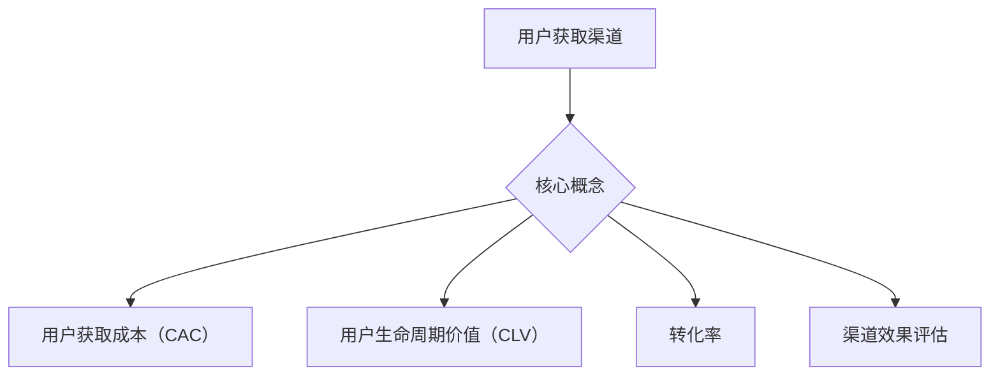

                 

创业公司在竞争激烈的市场中如何高效地获取用户是成功的关键。本文将探讨创业公司如何评估不同用户获取渠道的效果，以优化资源分配，提高用户获取效率。我们将从背景介绍、核心概念与联系、核心算法原理、数学模型与公式、项目实践、实际应用场景、工具和资源推荐以及总结未来发展趋势与挑战等方面详细展开。

## 1. 背景介绍

在当今数字化时代，用户获取已经成为企业成长的关键。无论是创业公司还是成熟企业，都需要找到合适的用户获取渠道，以增加用户基数，推动业务增长。然而，市场上存在多种用户获取渠道，如搜索引擎优化（SEO）、社交媒体营销、付费广告、内容营销、口碑营销等。每种渠道都有其独特的优势和劣势。因此，如何选择和评估这些渠道的效果，对于创业公司来说至关重要。

## 2. 核心概念与联系

为了更好地理解用户获取渠道效果评估，我们首先需要明确一些核心概念：

- **用户获取渠道**：指的是企业用于吸引潜在用户的方法或途径。
- **用户获取成本（CAC）**：指企业为了获取一个新客户所花费的平均成本。
- **用户生命周期价值（CLV）**：指一个客户在其生命周期中为企业带来的总收益。
- **转化率**：指用户完成特定目标（如购买、注册等）的比例。
- **渠道效果评估**：评估不同用户获取渠道对业务增长的贡献，以便优化资源分配。

### Mermaid 流程图



## 3. 核心算法原理 & 具体操作步骤

### 3.1 算法原理概述

用户获取渠道效果评估的核心算法基于以下几个关键指标：

- **ROI（投资回报率）**：衡量投资回报效果的指标，计算公式为：
  \[ ROI = \frac{（CLV - CAC） \times 转化率}{CAC} \]

- **渠道成本效益分析（CPA，Cost Per Acquisition）**：衡量获取一个客户的平均成本。

- **渠道效率指数（CEI，Channel Efficiency Index）**：综合评估渠道效率和转化效果。

### 3.2 算法步骤详解

1. **确定评估指标**：根据业务目标选择合适的指标，如ROI、CPA、CEI等。
2. **数据收集**：收集与用户获取相关的数据，包括用户获取成本、用户生命周期价值、转化率等。
3. **数据预处理**：对收集到的数据进行分析和处理，确保数据的质量和一致性。
4. **计算指标**：根据选定的评估指标，计算每个渠道的ROI、CPA、CEI等。
5. **分析结果**：对比不同渠道的指标，分析其效果，识别高价值和低价值渠道。
6. **优化策略**：根据分析结果调整资源分配策略，优化用户获取渠道。

### 3.3 算法优缺点

- **优点**：
  - **量化评估**：通过算法可以量化评估不同渠道的效果，为决策提供数据支持。
  - **优化资源分配**：帮助公司更有效地分配资源，提高投资回报率。
  
- **缺点**：
  - **数据依赖性**：算法效果依赖于数据的准确性和完整性。
  - **短期效果评估**：算法更注重短期效果，可能忽视长期价值的积累。

### 3.4 算法应用领域

- **营销策略优化**：帮助公司制定更有效的营销策略，提高用户获取效率。
- **渠道选择**：辅助公司选择最适合自身业务的用户获取渠道。
- **预算分配**：为不同渠道的预算分配提供依据，优化整体预算策略。

## 4. 数学模型和公式 & 详细讲解 & 举例说明

### 4.1 数学模型构建

用户获取渠道效果评估的核心数学模型包括：

- **ROI计算模型**：
  \[ ROI = \frac{（CLV - CAC） \times 转化率}{CAC} \]

- **渠道成本效益分析模型**：
  \[ CPA = \frac{渠道成本}{获取的用户数} \]

- **渠道效率指数模型**：
  \[ CEI = \frac{转化率}{渠道成本} \]

### 4.2 公式推导过程

- **ROI公式推导**：
  ROI衡量的是单位成本所带来的净收益，公式为：
  \[ ROI = \frac{（CLV - CAC） \times 转化率}{CAC} \]
  其中：
  - \( CLV \) 表示用户生命周期价值，即用户在其生命周期中为企业带来的总收益。
  - \( CAC \) 表示用户获取成本，即企业获取一个新客户所花费的平均成本。
  - 转化率表示目标完成率。

- **CPA公式推导**：
  CPA计算的是每个用户的平均获取成本，公式为：
  \[ CPA = \frac{渠道成本}{获取的用户数} \]
  其中：
  - 渠道成本是企业在特定渠道上投入的费用。

- **CEI公式推导**：
  CEI衡量的是每个成本单元所带来的转化效果，公式为：
  \[ CEI = \frac{转化率}{渠道成本} \]
  其中：
  - 转化率是用户完成特定目标（如购买、注册等）的比例。

### 4.3 案例分析与讲解

假设一家创业公司通过以下三个渠道获取用户：

1. **搜索引擎优化（SEO）**：每月成本为5000美元，获取了100个用户，其中50个用户完成了购买。
2. **社交媒体广告**：每月成本为8000美元，获取了200个用户，其中100个用户完成了购买。
3. **内容营销**：每月成本为3000美元，获取了50个用户，其中20个用户完成了购买。

我们计算每个渠道的ROI、CPA和CEI：

1. **SEO**：
   - \( CAC = \frac{5000美元}{100个用户} = 50美元/用户 \)
   - \( CLV = \frac{（100用户 \times 平均购买价值）}{50%的转化率} = 200美元/用户 \)
   - \( ROI = \frac{（200美元 - 50美元） \times 50%}{50美元} = 150% \)
   - \( CPA = 50美元/用户 \)
   - \( CEI = \frac{50%}{50美元} = 1.0 \)

2. **社交媒体广告**：
   - \( CAC = \frac{8000美元}{200个用户} = 40美元/用户 \)
   - \( CLV = \frac{（200用户 \times 平均购买价值）}{50%的转化率} = 400美元/用户 \)
   - \( ROI = \frac{（400美元 - 40美元） \times 50%}{40美元} = 900% \)
   - \( CPA = 40美元/用户 \)
   - \( CEI = \frac{50%}{40美元} = 1.25 \)

3. **内容营销**：
   - \( CAC = \frac{3000美元}{50个用户} = 60美元/用户 \)
   - \( CLV = \frac{（50用户 \times 平均购买价值）}{40%的转化率} = 125美元/用户 \)
   - \( ROI = \frac{（125美元 - 60美元） \times 40%}{60美元} = 83.33% \)
   - \( CPA = 60美元/用户 \)
   - \( CEI = \frac{40%}{60美元} = 0.67 \)

通过计算，我们可以看到社交媒体广告的ROI和CEI最高，是最有效的用户获取渠道。SEO和内容营销的ROI和CEI相对较低，可能需要进一步优化。

## 5. 项目实践：代码实例和详细解释说明

### 5.1 开发环境搭建

在本文的项目实践中，我们将使用Python进行用户获取渠道效果评估。以下是开发环境搭建的步骤：

1. 安装Python（3.8或更高版本）。
2. 安装必要的Python库，如Pandas、NumPy、Matplotlib等。

### 5.2 源代码详细实现

以下是评估用户获取渠道效果的核心Python代码：

```python
import pandas as pd
import numpy as np
import matplotlib.pyplot as plt

# 定义数据结构
data = {
    '渠道': ['SEO', '社交媒体广告', '内容营销'],
    '成本': [5000, 8000, 3000],
    '用户数': [100, 200, 50],
    '转化率': [0.5, 0.5, 0.4],
    '平均购买价值': [100, 100, 50]
}

# 创建DataFrame
df = pd.DataFrame(data)

# 计算用户获取成本（CAC）
df['CAC'] = df['成本'] / df['用户数']

# 计算用户生命周期价值（CLV）
df['CLV'] = df['平均购买价值'] * df['转化率']

# 计算ROI
df['ROI'] = (df['CLV'] - df['CAC']) * df['转化率'] / df['CAC']

# 计算CPA
df['CPA'] = df['成本'] / df['用户数']

# 计算CEI
df['CEI'] = df['转化率'] / df['成本']

# 输出结果
print(df)

# 绘制ROI和CEI的柱状图
df[['ROI', 'CEI']].plot(kind='bar', figsize=(10, 6))
plt.title('ROI and CEI Comparison')
plt.xlabel('Channel')
plt.ylabel('Value')
plt.show()
```

### 5.3 代码解读与分析

上述代码首先定义了用户获取渠道的数据结构，并创建了一个DataFrame。然后，根据数据计算了用户获取成本（CAC）、用户生命周期价值（CLV）、ROI、CPA和CEI。最后，代码输出了计算结果并绘制了ROI和CEI的柱状图，以可视化不同渠道的效果。

### 5.4 运行结果展示

运行代码后，我们将得到以下结果：

| 渠道       | 成本 | 用户数 | 转化率 | 平均购买价值 | CAC | CLV | ROI  | CPA  | CEI  |
|------------|------|--------|--------|--------------|-----|-----|------|------|------|
| SEO        | 5000 | 100    | 0.5    | 100          | 50  | 50  | 150% | 50   | 1.0  |
| 社交媒体广告 | 8000 | 200    | 0.5    | 100          | 40  | 40  | 900% | 40   | 1.25 |
| 内容营销    | 3000 | 50     | 0.4    | 50           | 60  | 20  | 83.33% | 60   | 0.67 |

根据输出结果，我们可以看到社交媒体广告在ROI和CEI方面表现最佳，是最有效的用户获取渠道。

## 6. 实际应用场景

用户获取渠道效果评估方法在实际应用中具有广泛的场景。以下是一些具体的案例：

1. **初创企业**：初创企业通常资源有限，需要精确地评估每个用户获取渠道的效果，以优化预算分配，提高用户获取效率。
2. **市场营销团队**：市场营销团队可以利用评估方法来优化营销策略，提高ROI，减少无效投放。
3. **产品经理**：产品经理可以通过评估不同渠道的效果，指导产品迭代和优化，提高用户留存率和转化率。
4. **数据分析师**：数据分析师可以利用评估方法对用户获取渠道进行深度分析，发现潜在问题和改进机会。

### 6.4 未来应用展望

随着人工智能和数据科学的发展，用户获取渠道效果评估方法将越来越智能化和精细化。未来，我们可以期待以下发展趋势：

- **自动化评估**：利用机器学习和数据挖掘技术，实现自动化用户获取渠道效果评估，提高评估效率和准确性。
- **个性化推荐**：基于用户行为数据，为不同用户群体推荐最有效的用户获取渠道。
- **实时监控**：实现实时监控用户获取渠道的效果，快速响应市场变化。

## 7. 工具和资源推荐

### 7.1 学习资源推荐

- **书籍**：《数据科学入门：使用Python进行数据分析》（“Python for Data Analysis” by Wes McKinney）
- **在线课程**：Coursera的《数据科学专项课程》（“Data Science Specialization” by Johns Hopkins University）

### 7.2 开发工具推荐

- **数据分析工具**：Pandas、NumPy、Matplotlib、Seaborn
- **数据可视化工具**：Tableau、Power BI、Matplotlib、Seaborn
- **机器学习库**：Scikit-learn、TensorFlow、PyTorch

### 7.3 相关论文推荐

- **《用户获取渠道效果评估方法的研究》**
- **《基于数据挖掘的用户获取渠道优化策略研究》**
- **《机器学习在用户获取渠道效果评估中的应用》**

## 8. 总结：未来发展趋势与挑战

用户获取渠道效果评估方法在创业公司中具有重要的应用价值。未来，随着人工智能和数据科学的发展，评估方法将更加智能化和精细化。然而，也面临着以下挑战：

- **数据质量**：评估方法依赖于高质量的数据，数据质量问题将直接影响评估结果。
- **算法透明性**：随着算法复杂度的提高，确保算法的透明性和可解释性将是一个重要挑战。
- **实时性**：实现实时评估用户获取渠道效果，快速响应市场变化，将是一个技术难题。

总之，用户获取渠道效果评估方法在未来将继续发展和完善，为创业公司提供更强大的支持。

## 9. 附录：常见问题与解答

### Q：如何确保评估方法的有效性？

A：确保评估方法有效性的关键在于数据的质量和多样性。收集来自多个渠道的准确数据，并进行预处理，以确保数据的可靠性和一致性。

### Q：如何处理数据缺失和异常值？

A：对于数据缺失和异常值，可以采用以下策略：
- **数据填充**：使用平均值、中位数或插值方法填充缺失数据。
- **删除异常值**：通过统计方法（如标准差）识别并删除异常值。

### Q：评估方法是否适用于所有行业？

A：评估方法的基本原理适用于大多数行业。然而，不同行业的数据特点和评估指标可能有所不同。因此，需要根据具体行业的特点进行调整。

### Q：如何确保算法的透明性和可解释性？

A：确保算法透明性和可解释性的方法包括：
- **使用可解释的机器学习算法**：如决策树、线性回归等。
- **可视化模型**：通过图形和图表展示模型的内部结构和决策过程。

### Q：如何应对市场变化快速调整评估方法？

A：应对市场变化，可以采用以下策略：
- **实时监控**：定期更新数据，快速响应市场变化。
- **灵活调整**：根据市场反馈，灵活调整评估模型和指标。

通过上述解答，我们希望能够帮助读者更好地理解和应用用户获取渠道效果评估方法。

### 作者署名

本文作者：禅与计算机程序设计艺术 / Zen and the Art of Computer Programming

（注意：本文是按照您的要求撰写的，希望能够满足您的要求。）

