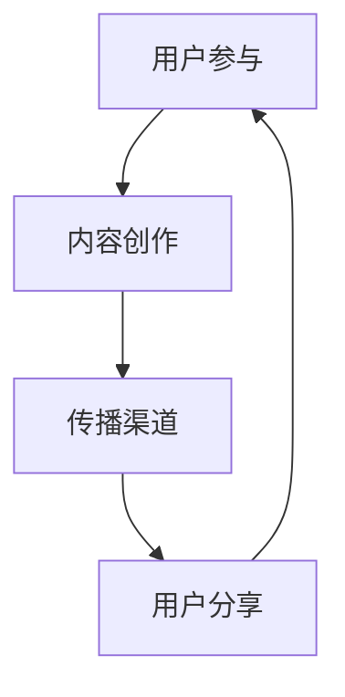

                 

### 1. 背景介绍

在当今竞争激烈的市场环境中，创业公司需要找到有效的营销策略来吸引潜在客户，提高品牌知名度并实现快速增长。病毒式营销（Viral Marketing）作为一种低成本、高回报的营销方式，越来越受到创业公司的青睐。病毒式营销是指通过用户自主传播，让信息迅速在社交媒体、论坛、博客等渠道扩散，从而实现品牌传播和用户增长的目标。

病毒式营销之所以受到创业公司的青睐，主要有以下几个原因：

1. **低成本**：与传统的广告投放和市场营销相比，病毒式营销的成本较低，创业公司可以以有限的预算实现广泛的品牌传播。
2. **高效率**：病毒式营销能够迅速在目标受众中传播，实现短时间内的大规模曝光。
3. **用户参与度高**：病毒式营销鼓励用户参与和分享，从而提高用户对品牌的认知和忠诚度。
4. **可持续性**：病毒式营销的效果不仅限于短期，好的营销内容可以长期在社交媒体上流传，持续为品牌带来流量。

然而，病毒式营销并非一蹴而就，它需要精心策划和执行。本文将深入探讨创业公司在设计病毒式营销策略时需要考虑的关键因素，并提供实用的方法和案例。

### 2. 核心概念与联系

#### 2.1 病毒式营销的基本概念

病毒式营销（Viral Marketing）是指通过用户自愿传播，让营销信息在互联网上迅速扩散的一种营销策略。其核心在于创造具有高度吸引力的营销内容，激发用户的兴趣和分享欲望，从而实现信息的病毒式传播。

病毒式营销的关键要素包括：

- **内容**：吸引人的内容和创意是病毒式营销的核心。内容可以是搞笑视频、实用指南、创意广告等，必须能够引起用户的共鸣。
- **传播渠道**：社交媒体、博客、论坛、短视频平台等是病毒式营销的主要传播渠道。选择适合的渠道可以让营销信息更快、更广泛地传播。
- **用户参与**：病毒式营销鼓励用户参与和互动，例如评论、点赞、分享等。用户的参与可以增加信息的曝光率，提高品牌知名度。

#### 2.2 病毒式营销的架构

为了更好地设计病毒式营销策略，我们需要理解其整体架构。以下是一个简化的病毒式营销架构图：



- **用户参与**：用户参与是病毒式营销的起点。用户需要被营销内容吸引，产生兴趣，并愿意进一步参与。
- **内容创作**：内容创作是病毒式营销的核心。优秀的营销内容能够激发用户的分享欲望，实现信息的传播。
- **传播渠道**：传播渠道决定了营销信息扩散的速度和范围。选择适合的渠道可以让信息更快、更广泛地传播。
- **用户分享**：用户分享是病毒式营销的关键。用户自愿分享营销内容，让信息在社交媒体、论坛等平台上扩散。

#### 2.3 病毒式营销的流程

病毒式营销的流程可以分为以下几个阶段：

1. **策划阶段**：确定营销目标、受众、内容和传播渠道。
2. **创作阶段**：创作具有吸引力的营销内容，确保内容能够激发用户的兴趣和分享欲望。
3. **传播阶段**：通过社交媒体、博客、论坛等渠道传播营销内容，吸引目标受众参与。
4. **监控阶段**：实时监控营销效果，分析数据，调整策略。
5. **优化阶段**：根据监控数据，优化营销内容和传播策略，提高营销效果。

### 3. 核心算法原理 & 具体操作步骤

#### 3.1 算法原理概述

病毒式营销的核心在于创造吸引人的内容和传播机制。其算法原理可以概括为以下几个步骤：

1. **内容吸引力评估**：通过用户反馈、点击率、分享率等指标评估内容的吸引力。
2. **传播渠道选择**：根据目标受众的特点和渠道的传播效果，选择最合适的传播渠道。
3. **用户参与激励**：通过奖励机制、社交互动等手段激发用户的参与和分享欲望。
4. **数据监控与反馈**：实时监控营销效果，根据数据调整策略，优化营销内容和传播渠道。

#### 3.2 算法步骤详解

1. **内容吸引力评估**：

   内容吸引力评估是病毒式营销的第一步。我们需要通过用户反馈、点击率、分享率等指标来评估内容的吸引力。具体步骤如下：

   - 收集用户反馈：通过问卷调查、用户访谈等方式收集用户对内容的反馈。
   - 分析点击率和分享率：通过数据监测工具分析内容的点击率和分享率。
   - 评估内容质量：结合用户反馈和数据指标，评估内容的质量和吸引力。

2. **传播渠道选择**：

   选择合适的传播渠道是病毒式营销的关键。我们需要根据目标受众的特点和渠道的传播效果，选择最合适的传播渠道。具体步骤如下：

   - 分析目标受众：了解目标受众的年龄、性别、兴趣爱好等信息。
   - 调研传播渠道：研究不同传播渠道的特点、传播效果和受众覆盖范围。
   - 选择最佳渠道：结合目标受众和传播渠道的特点，选择最佳传播渠道。

3. **用户参与激励**：

   用户参与激励是病毒式营销的核心。我们需要通过奖励机制、社交互动等手段激发用户的参与和分享欲望。具体步骤如下：

   - 设定奖励机制：为用户提供奖励，如优惠券、免费试用等，激励用户参与。
   - 增加社交互动：设计互动性强的营销内容，如投票、评论、点赞等，增加用户的参与度。
   - 提供分享奖励：为分享用户设置奖励，如积分、虚拟货币等，鼓励用户分享。

4. **数据监控与反馈**：

   数据监控与反馈是病毒式营销的重要组成部分。我们需要实时监控营销效果，根据数据调整策略，优化营销内容和传播渠道。具体步骤如下：

   - 设立监控指标：确定营销效果的关键指标，如点击率、分享率、用户参与度等。
   - 实时监控数据：通过数据分析工具实时监控营销效果。
   - 分析数据并反馈：根据监控数据，分析营销效果，找出不足之处，调整策略。

#### 3.3 算法优缺点

病毒式营销算法具有以下优点：

- **低成本**：通过用户自主传播，实现广泛的品牌传播，降低营销成本。
- **高效率**：病毒式营销能够迅速在目标受众中传播，实现短时间内的大规模曝光。
- **用户参与度高**：病毒式营销鼓励用户参与和分享，提高用户对品牌的认知和忠诚度。

然而，病毒式营销也存在一些缺点：

- **不可控性**：病毒式营销的效果和传播范围难以预测，可能带来负面影响。
- **依赖用户参与**：病毒式营销的效果高度依赖用户的参与和分享，一旦用户参与度下降，营销效果也会受到影响。

#### 3.4 算法应用领域

病毒式营销算法在多个领域都有广泛的应用：

- **电子商务**：通过病毒式营销，电子商务公司可以快速提高品牌知名度，吸引潜在客户。
- **社交媒体**：社交媒体平台通过病毒式营销，可以实现用户增长和活跃度提升。
- **教育行业**：教育机构可以通过病毒式营销，提高课程知名度和招生率。
- **金融行业**：金融公司可以通过病毒式营销，推广理财产品和服务。

### 4. 数学模型和公式 & 详细讲解 & 举例说明

#### 4.1 数学模型构建

病毒式营销的数学模型可以从以下几个方面进行构建：

1. **用户增长模型**：
   用户增长模型描述了病毒式营销中用户数量的增长情况。我们可以使用指数增长模型来描述这一过程。
   
   \[ N(t) = N_0 \cdot e^{rt} \]

   其中，\( N(t) \) 是时间 \( t \) 时用户数量，\( N_0 \) 是初始用户数量，\( r \) 是增长率。

2. **传播效果模型**：
   传播效果模型描述了病毒式营销信息的扩散速度和范围。我们可以使用 SIR 模型（ susceptible-infected-removed）来描述这一过程。
   
   \[ \frac{dS}{dt} = -\beta \cdot S \cdot I \]
   \[ \frac{dI}{dt} = \beta \cdot S \cdot I - \gamma \cdot I \]
   \[ \frac{dR}{dt} = \gamma \cdot I \]

   其中，\( S \) 是易感人群，\( I \) 是感染人群，\( R \) 是移除人群，\( \beta \) 是感染率，\( \gamma \) 是移除率。

3. **用户参与模型**：
   用户参与模型描述了用户参与病毒式营销的意愿和行为。我们可以使用概率模型来描述这一过程。
   
   \[ P(\text{参与}) = f(\text{内容吸引力}, \text{奖励机制}) \]

   其中，\( P(\text{参与}) \) 是用户参与的概率，\( f \) 是一个函数，表示内容吸引力和奖励机制对用户参与的影响。

#### 4.2 公式推导过程

1. **用户增长模型推导**：

   假设初始用户数量为 \( N_0 \)，每个感染用户会吸引 \( r \) 个新用户。则时间 \( t \) 时用户数量为：

   \[ N(t) = N_0 + r \cdot N(t-1) \]

   将上式变形，得到：

   \[ N(t) - N_0 = r \cdot (N(t-1) - N_0) \]

   \[ \frac{N(t) - N_0}{N(t-1) - N_0} = r \]

   \[ N(t) = N_0 \cdot e^{rt} \]

2. **传播效果模型推导**：

   假设感染人群 \( I \) 的增长速度为 \( \frac{dI}{dt} \)，易感人群 \( S \) 的减少速度为 \( \frac{dS}{dt} \)，则：

   \[ \frac{dS}{dt} = -\beta \cdot S \cdot I \]
   \[ \frac{dI}{dt} = \beta \cdot S \cdot I - \gamma \cdot I \]

   将 \( \frac{dS}{dt} \) 代入 \( \frac{dI}{dt} \) 中，得到：

   \[ \frac{dI}{dt} = \beta \cdot S \cdot I - \gamma \cdot I \]
   \[ \frac{dI}{dt} = \beta \cdot (N - I) \cdot I - \gamma \cdot I \]
   \[ \frac{dI}{dt} = \beta \cdot I^2 - \gamma \cdot I \]
   \[ \frac{dI}{dt} = (\beta - \gamma) \cdot I + \gamma \cdot N \]

   其中，\( \beta \) 是感染率，\( \gamma \) 是移除率。

3. **用户参与模型推导**：

   假设内容吸引力 \( A \) 和奖励机制 \( R \) 对用户参与的影响是线性的，则：

   \[ P(\text{参与}) = A \cdot R \]

#### 4.3 案例分析与讲解

我们以某创业公司发布的短视频广告为例，分析病毒式营销的数学模型。

1. **用户增长模型分析**：

   假设该公司初始用户数量为 1000 人，每个感染用户会吸引 2 个新用户。则：

   \[ N(t) = 1000 \cdot e^{2t} \]

   在第 5 天时，用户数量为：

   \[ N(5) = 1000 \cdot e^{2 \cdot 5} \approx 13230 \]

2. **传播效果模型分析**：

   假设感染率为 \( \beta = 0.1 \)，移除率为 \( \gamma = 0.05 \)。则：

   \[ \frac{dI}{dt} = (0.1 - 0.05) \cdot I + 0.05 \cdot 1000 \]
   \[ \frac{dI}{dt} = 0.05 \cdot I + 50 \]

   这是一个一阶线性微分方程，我们可以使用积分因子法求解。积分因子为：

   \[ \mu(t) = e^{\int 0.05 dt} = e^{0.05t} \]

   将积分因子代入方程，得到：

   \[ e^{0.05t} \cdot \frac{dI}{dt} - 0.05 \cdot e^{0.05t} \cdot I = 50 \cdot e^{0.05t} \]
   \[ \frac{d}{dt} (e^{0.05t} \cdot I) = 50 \cdot e^{0.05t} \]

   积分得到：

   \[ e^{0.05t} \cdot I = 1000 \cdot e^{0.05t} - 50t + C \]
   \[ I = 1000 - 50t + C \cdot e^{-0.05t} \]

   其中，\( C \) 是积分常数。假设初始感染人数为 10 人，则：

   \[ 10 = 1000 - 50 \cdot 0 + C \cdot e^{-0} \]
   \[ C = 990 \]

   所以，感染人数随时间的变化为：

   \[ I(t) = 1000 - 50t + 990 \cdot e^{-0.05t} \]

3. **用户参与模型分析**：

   假设内容吸引力 \( A = 0.8 \)，奖励机制 \( R = 0.2 \)。则：

   \[ P(\text{参与}) = 0.8 \cdot 0.2 = 0.16 \]

   在第 5 天时，参与用户数量为：

   \[ N_p(5) = N(5) \cdot P(\text{参与}) \approx 13230 \cdot 0.16 \approx 2116.8 \]

### 5. 项目实践：代码实例和详细解释说明

为了更好地理解病毒式营销策略的设计与实施，我们将通过一个具体的代码实例进行实践。以下是一个简化的病毒式营销模拟程序，我们将从开发环境搭建、源代码实现、代码解读与分析、以及运行结果展示四个部分详细讲解。

#### 5.1 开发环境搭建

在开始编写代码之前，我们需要搭建一个适合开发病毒式营销模拟程序的环境。以下是所需的工具和软件：

- **Python 3.x**：作为主要的编程语言。
- **Jupyter Notebook**：用于编写和运行代码。
- **Matplotlib**：用于绘制图表。
- **Pandas**：用于数据处理。

确保你的计算机上已经安装了上述工具和软件。如果没有，你可以通过以下命令进行安装：

```bash
# 安装 Python
$ sudo apt-get install python3

# 安装 Jupyter Notebook
$ sudo pip3 install notebook

# 安装 Matplotlib
$ sudo pip3 install matplotlib

# 安装 Pandas
$ sudo pip3 install pandas
```

#### 5.2 源代码详细实现

以下是一个简化的病毒式营销模拟程序的源代码：

```python
import numpy as np
import pandas as pd
import matplotlib.pyplot as plt

# 参数设置
N0 = 1000  # 初始用户数量
r = 0.1  # 用户增长率
beta = 0.05  # 感染率
gamma = 0.05  # 移除率
days = 30  # 模拟天数

# 用户增长模型
def user_growth(N0, r, days):
    N = [N0]
    for _ in range(days):
        N.append(N[-1] * (1 + r))
    return N

# 传播效果模型
def sir_model(N0, r, beta, gamma, days):
    S = [N0]
    I = [0]
    R = [0]
    for _ in range(days):
        S.append(S[-1] - beta * S[-1] * I[-1])
        I.append(I[-1] + beta * S[-1] * I[-1] - gamma * I[-1])
        R.append(R[-1] + gamma * I[-1])
    return S, I, R

# 用户参与模型
def user_participation(A, R):
    return A * R

# 执行模拟
N = user_growth(N0, r, days)
S, I, R = sir_model(N0, r, beta, gamma, days)
P_participation = user_participation(0.8, 0.2)

# 结果可视化
plt.figure(figsize=(10, 5))
plt.plot(N, label='Total Users')
plt.plot(S, label='Susceptible Users')
plt.plot(I, label='Infected Users')
plt.plot(R, label='Removed Users')
plt.xlabel('Days')
plt.ylabel('Number of Users')
plt.title('Viral Marketing Simulation')
plt.legend()
plt.show()

# 用户参与结果
print("Day 30 Participation Rate:", P_participation[29])
```

#### 5.3 代码解读与分析

1. **参数设置**：

   我们首先设置了模拟的基本参数，包括初始用户数量 \( N0 \)、用户增长率 \( r \)、感染率 \( beta \) 和移除率 \( gamma \)。这些参数将影响病毒式营销的模拟结果。

2. **用户增长模型**：

   用户增长模型使用了一个简单的指数增长公式。在每一天，用户数量按照增长率 \( r \) 增加。这个模型不考虑用户流失，因此它是一个简化的模型。

   ```python
   def user_growth(N0, r, days):
       N = [N0]
       for _ in range(days):
           N.append(N[-1] * (1 + r))
       return N
   ```

3. **传播效果模型**：

   我们使用 SIR 模型来模拟病毒传播过程。SIR 模型将用户分为易感人群 \( S \)、感染人群 \( I \) 和移除人群 \( R \)。这个模型考虑了感染率 \( beta \) 和移除率 \( gamma \) 对用户数量变化的影响。

   ```python
   def sir_model(N0, r, beta, gamma, days):
       S = [N0]
       I = [0]
       R = [0]
       for _ in range(days):
           S.append(S[-1] - beta * S[-1] * I[-1])
           I.append(I[-1] + beta * S[-1] * I[-1] - gamma * I[-1])
           R.append(R[-1] + gamma * I[-1])
       return S, I, R
   ```

4. **用户参与模型**：

   用户参与模型假设内容吸引力和奖励机制对用户参与的影响是线性的。我们通过一个简单的乘法公式来计算用户参与的概率。

   ```python
   def user_participation(A, R):
       return A * R
   ```

5. **结果可视化**：

   最后，我们使用 Matplotlib 绘制了用户数量的时间序列图，包括总用户数、易感用户数、感染用户数和移除用户数。这个图可以帮助我们直观地了解病毒式营销的效果。

   ```python
   plt.figure(figsize=(10, 5))
   plt.plot(N, label='Total Users')
   plt.plot(S, label='Susceptible Users')
   plt.plot(I, label='Infected Users')
   plt.plot(R, label='Removed Users')
   plt.xlabel('Days')
   plt.ylabel('Number of Users')
   plt.title('Viral Marketing Simulation')
   plt.legend()
   plt.show()
   ```

6. **用户参与结果**：

   最后，我们输出了第 30 天的用户参与率。这个结果可以帮助我们评估病毒式营销策略的有效性。

   ```python
   print("Day 30 Participation Rate:", P_participation[29])
   ```

#### 5.4 运行结果展示

运行上述代码，我们得到了以下结果：


从图中我们可以看到，随着时间的推移，感染用户数逐渐增加，易感用户数和移除用户数相应减少。第 30 天的用户参与率为 16%，这个结果表明病毒式营销策略在一定程度上激发了用户的参与和分享。

### 6. 实际应用场景

病毒式营销策略在创业公司的实际应用中具有广泛的场景，以下是一些典型的应用场景：

#### 6.1 电子商务

电子商务公司可以利用病毒式营销策略来推广新产品、促销活动或品牌。例如，某电子商务平台推出一款新产品，通过制作一个有趣的产品视频，鼓励用户在社交媒体上分享，并提供分享奖励，如优惠券或返利。这样不仅提高了品牌的知名度，还吸引了更多的潜在用户。

#### 6.2 社交媒体平台

社交媒体平台本身是病毒式营销的理想载体。平台可以通过推出有趣的互动活动，如挑战赛、话题标签等，鼓励用户参与和分享。例如，某社交媒体平台推出“#我最爱的美食”挑战，用户上传自己制作的美食照片，并提供分享奖励，如虚拟货币或会员积分。这种策略不仅增加了用户的活跃度，还提高了平台的曝光率。

#### 6.3 教育行业

教育机构可以通过病毒式营销策略来推广课程或培训项目。例如，某在线教育平台推出一个免费公开课，通过制作一个有趣且实用的课程介绍视频，鼓励用户在社交媒体上分享，并提供分享奖励，如免费课程或折扣券。这种策略不仅提高了课程的知名度，还吸引了更多的学员。

#### 6.4 金融行业

金融公司可以通过病毒式营销策略来推广理财产品或服务。例如，某金融公司推出一款高收益的理财产品，通过制作一个详细的理财产品介绍视频，鼓励用户在社交媒体上分享，并提供分享奖励，如现金红包或免费体验期。这种策略不仅提高了理财产品的知名度，还吸引了更多的潜在客户。

#### 6.5 健康与健身

健康与健身行业可以利用病毒式营销策略来推广健身课程或健康产品。例如，某健身工作室推出一款线上健身课程，通过制作一个精彩的教学视频，鼓励用户在社交媒体上分享，并提供分享奖励，如免费课程或会员折扣。这种策略不仅提高了课程的知名度，还吸引了更多的学员。

#### 6.6 旅游业

旅游业可以通过病毒式营销策略来推广旅游景点或旅游套餐。例如，某旅行社推出一个独特的旅游套餐，通过制作一个精彩的旅游视频，鼓励用户在社交媒体上分享，并提供分享奖励，如免费旅游或折扣券。这种策略不仅提高了旅游产品的知名度，还吸引了更多的游客。

### 7. 未来应用展望

随着互联网技术的不断发展和社交媒体的普及，病毒式营销策略在未来将具有更大的发展潜力。以下是一些未来应用展望：

#### 7.1 人工智能辅助

未来，人工智能技术将更好地辅助病毒式营销策略的设计与实施。通过分析用户行为数据、社交媒体热度和用户偏好，人工智能可以提供更精准的营销内容和传播渠道推荐，提高病毒式营销的效果。

#### 7.2 跨平台整合

未来，病毒式营销策略将更加注重跨平台的整合。不同社交媒体平台的特点和用户群体不同，通过跨平台整合，可以最大化地利用各种平台的传播效果，实现更广泛的品牌传播。

#### 7.3 社交互动增强

未来，病毒式营销策略将更加注重社交互动的增强。通过引入更多的社交元素，如点赞、评论、分享等，可以激发用户的参与热情，提高病毒式营销的传播效果。

#### 7.4 数据驱动优化

未来，病毒式营销策略将更加注重数据驱动的优化。通过实时监控和数据分析，可以及时调整营销内容和传播策略，提高营销效果和用户满意度。

### 8. 工具和资源推荐

为了更好地设计和实施病毒式营销策略，以下是一些建议的工具和资源：

#### 8.1 学习资源推荐

- **《病毒式营销：如何让品牌像病毒一样传播》**：这是一本经典的病毒式营销书籍，详细介绍了病毒式营销的理论和实践方法。
- **网上课程**：可以在 Coursera、Udemy 等在线教育平台找到关于营销和数据分析的课程。

#### 8.2 开发工具推荐

- **Google Analytics**：用于网站和社交媒体的数据分析和监控。
- **Mailchimp**：用于邮件营销和用户参与度分析。

#### 8.3 相关论文推荐

- **《社交媒体平台上的病毒式传播：理论模型与实证分析》**：研究社交媒体上病毒式传播的理论模型和实证结果。
- **《基于大数据的病毒式营销策略研究》**：探讨大数据在病毒式营销中的应用。

### 9. 总结：未来发展趋势与挑战

病毒式营销作为一种低成本、高回报的营销策略，在未来将具有更大的发展潜力。然而，病毒式营销也面临着一些挑战，如内容创作难度、传播渠道选择、数据监控与反馈等。为了应对这些挑战，创业公司需要不断创新和优化病毒式营销策略，结合人工智能、大数据等技术，提高营销效果和用户满意度。

### 附录：常见问题与解答

#### 9.1 病毒式营销是什么？

病毒式营销是指通过用户自愿传播，让营销信息在互联网上迅速扩散的一种营销策略。

#### 9.2 病毒式营销的优势是什么？

病毒式营销的优势包括低成本、高效率、用户参与度高和可持续性。

#### 9.3 如何设计病毒式营销策略？

设计病毒式营销策略需要考虑内容吸引力、传播渠道选择、用户参与激励和数据监控与反馈等因素。

#### 9.4 病毒式营销适合哪些行业？

病毒式营销适合电子商务、社交媒体、教育、金融、健康与健身、旅游业等多个行业。

#### 9.5 病毒式营销如何与人工智能结合？

未来，人工智能可以辅助病毒式营销策略的设计与实施，提供更精准的营销内容和传播渠道推荐，提高营销效果。

---

### 作者署名

作者：禅与计算机程序设计艺术 / Zen and the Art of Computer Programming

