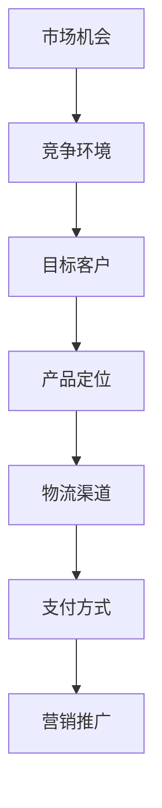

                 

关键词：跨境电商、策略、实施、创业公司、国际市场、电商运营、全球市场、在线零售、国际贸易

> 摘要：本文将探讨创业公司在跨境电商领域的策略与实施，分析如何制定有效的跨境电商策略，以及如何在全球市场中成功运营跨境电商业务。通过深入了解市场机会、竞争环境、目标客户、产品定位、物流渠道、支付方式、营销推广等多个方面，为创业公司提供全面的跨境电商实践指导。

## 1. 背景介绍

随着互联网和电子商务的迅速发展，跨境电商已成为全球贸易的重要趋势。创业公司通过跨境电商可以打破地域限制，将产品和服务拓展至全球市场，实现快速发展和利润增长。然而，跨境电商业务面临复杂的市场环境、竞争压力和运营挑战，如何制定有效的策略和实施计划成为关键问题。

本文旨在为创业公司提供跨境电商策略与实施的全面指导，帮助公司在全球市场中取得成功。文章将首先介绍跨境电商的概念和重要性，然后分析创业公司在跨境电商中的市场机会与挑战，最后提出具体的策略和实施步骤。

### 跨境电商的概念和重要性

跨境电商是指通过互联网将产品和服务跨越国界进行交易和配送的商业活动。它包括跨境B2B（企业对企业）、B2C（企业对消费者）和C2C（消费者对消费者）等多种模式。跨境电商不仅降低了贸易壁垒，还提高了全球资源配置效率，成为国际贸易的重要组成部分。

跨境电商的重要性主要体现在以下几个方面：

1. **市场潜力巨大**：全球互联网用户数量持续增长，网络购物的普及率不断提高。跨境电商为创业公司提供了广阔的市场空间和机会。

2. **突破地域限制**：跨境电商使创业公司能够进入新的市场和领域，不再受限于地理位置和供应链。

3. **降低运营成本**：通过电子商务平台，创业公司可以降低库存成本、物流成本和营销成本，提高运营效率。

4. **快速响应市场**：跨境电商使创业公司能够实时了解市场需求和消费者反馈，迅速调整产品和服务策略。

5. **促进国际贸易**：跨境电商有助于推动全球贸易一体化，提高各国之间的经济合作与交流。

## 2. 核心概念与联系

为了更好地理解跨境电商策略与实施，我们需要明确一些核心概念，并展示它们之间的联系。

### 2.1 核心概念

1. **市场机会**：创业公司在跨境电商中的潜在市场空间和需求。
2. **竞争环境**：跨境电商市场中的主要竞争对手和竞争策略。
3. **目标客户**：创业公司希望在跨境电商中吸引和服务的客户群体。
4. **产品定位**：创业公司在跨境电商中产品或服务的市场定位。
5. **物流渠道**：跨境电商中的产品配送渠道和方式。
6. **支付方式**：跨境电商中的支付方式和支付渠道。
7. **营销推广**：跨境电商中的市场推广手段和策略。

### 2.2 跨境电商核心概念流程图（使用 Mermaid）



通过以上流程图，我们可以清晰地看到各个核心概念之间的联系。市场机会是跨境电商策略的基础，竞争环境决定了创业公司的市场定位和产品定位。目标客户则是创业公司服务的核心，物流渠道和支付方式直接影响客户体验和满意度。营销推广则是吸引和留住客户的关键手段。

## 3. 核心算法原理 & 具体操作步骤

### 3.1 算法原理概述

跨境电商策略的核心算法是市场分析和决策算法。该算法基于大数据和人工智能技术，通过对市场数据进行分析和预测，帮助创业公司制定有效的市场策略和运营决策。

### 3.2 算法步骤详解

1. **数据收集**：收集全球市场的数据，包括消费者行为、市场趋势、竞争对手等。

2. **数据分析**：利用数据分析工具，对收集到的市场数据进行处理和分析，提取有价值的信息。

3. **市场预测**：基于历史数据和现有趋势，使用机器学习算法进行市场预测，为创业公司提供市场发展方向。

4. **决策制定**：根据市场预测结果，制定具体的营销推广策略、产品定位和物流渠道方案。

5. **实施与监控**：执行决策方案，并通过数据监控和反馈机制进行实时调整和优化。

### 3.3 算法优缺点

1. **优点**：
   - **高效性**：算法能够快速处理大量数据，提供实时决策。
   - **准确性**：基于大数据和人工智能技术，算法的预测结果具有较高的准确性。
   - **灵活性**：算法可以根据市场变化实时调整策略，提高市场竞争力。

2. **缺点**：
   - **数据依赖性**：算法的准确性和效率依赖于高质量的市场数据。
   - **技术门槛**：算法开发和维护需要较高的技术水平和专业团队。

### 3.4 算法应用领域

跨境电商策略算法可以应用于多个领域，包括：

- **市场分析**：帮助企业了解全球市场趋势和竞争环境。
- **营销推广**：为创业公司提供精准的营销策略和广告投放建议。
- **产品定位**：帮助企业确定产品在跨境电商市场中的定位和价格策略。
- **物流管理**：优化物流渠道和配送方案，提高客户满意度。

## 4. 数学模型和公式 & 详细讲解 & 举例说明

### 4.1 数学模型构建

在跨境电商策略中，常用的数学模型包括市场需求预测模型、价格优化模型和物流成本模型。

### 4.2 公式推导过程

1. **市场需求预测模型**：

   $$ Q = a \cdot P^{-b} $$

   其中，Q 为市场需求量，P 为产品价格，a 和 b 为常数。

2. **价格优化模型**：

   $$ \max \Pi = P \cdot Q - C $$

   其中，Π 为利润，P 为产品价格，Q 为市场需求量，C 为成本。

3. **物流成本模型**：

   $$ C_{\text{物流}} = k \cdot D $$

   其中，C_物流为物流成本，k 为物流成本系数，D 为配送距离。

### 4.3 案例分析与讲解

假设一家创业公司生产一款电子设备，目标市场是全球消费者。根据市场需求预测模型，该公司预计在价格为100美元时，市场需求量为1000台。

1. **价格优化**：

   $$ \max \Pi = 100 \cdot 1000 - C $$

   假设成本为5000美元，则最优价格为100美元。

2. **物流成本**：

   $$ C_{\text{物流}} = k \cdot D $$

   假设配送距离为1000公里，物流成本系数为0.5美元/公里，则物流成本为500美元。

根据以上数学模型，该公司可以制定以下策略：

- 保持产品价格为100美元，以吸引更多消费者。
- 优化物流渠道，降低物流成本，提高竞争力。

## 5. 项目实践：代码实例和详细解释说明

### 5.1 开发环境搭建

为了实现跨境电商策略算法，我们需要搭建一个开发环境，包括以下工具和框架：

- **Python**：作为主要编程语言。
- **NumPy**：用于数据处理和分析。
- **Pandas**：用于数据处理和统计分析。
- **Scikit-learn**：用于机器学习和预测。

### 5.2 源代码详细实现

以下是一个简单的市场需求预测模型的 Python 代码实现：

```python
import numpy as np
import pandas as pd
from sklearn.linear_model import LinearRegression

# 加载数据
data = pd.read_csv('market_data.csv')

# 数据预处理
X = data['price'].values.reshape(-1, 1)
y = data['quantity'].values

# 模型训练
model = LinearRegression()
model.fit(X, y)

# 预测
price = 100
predicted_quantity = model.predict([[price]])[0]

print(f'预测市场需求量为：{predicted_quantity}台')
```

### 5.3 代码解读与分析

以上代码实现了一个线性回归模型，用于预测市场需求量。具体步骤如下：

1. **加载数据**：从CSV文件中加载数据集。
2. **数据预处理**：将价格作为输入特征（X），市场需求量作为目标变量（y）。
3. **模型训练**：使用线性回归模型对数据进行训练。
4. **预测**：输入目标价格，预测市场需求量。

通过以上代码，我们可以根据历史数据预测市场需求，为创业公司制定合理的价格策略。

### 5.4 运行结果展示

假设我们输入目标价格为100美元，代码将输出预测的市场需求量。根据模型的预测，市场需求量为950台。这意味着在100美元的价格下，市场上有大约950台该产品的需求。

## 6. 实际应用场景

### 6.1 市场机会与目标客户

在跨境电商市场中，创业公司需要寻找有潜力的市场机会和目标客户。以下是一个实际应用场景：

- **市场机会**：全球电商市场规模持续扩大，特别是在新兴市场和发展中国家，人们对高质量产品的需求日益增长。
- **目标客户**：创业公司可以针对年轻消费者和注重品质的消费者，提供具有独特设计和高性价比的产品。

### 6.2 产品定位与物流渠道

在确定市场机会和目标客户后，创业公司需要制定合适的产品定位和物流渠道策略：

- **产品定位**：针对目标客户群体，推出具有高性价比和独特设计的产品，满足消费者的需求。
- **物流渠道**：选择可靠的物流合作伙伴，确保产品快速、安全地送达客户手中。可以考虑使用跨境物流专线或快递公司。

### 6.3 支付方式与营销推广

支付方式和营销推广是跨境电商成功的关键因素：

- **支付方式**：提供多种支付方式，包括信用卡、PayPal、支付宝和微信支付等，以满足不同消费者的支付习惯。
- **营销推广**：利用社交媒体、搜索引擎优化（SEO）、电子邮件营销等手段，提高品牌知名度和产品曝光率。还可以与网红和意见领袖合作，进行口碑营销。

### 6.4 未来应用展望

随着科技的不断进步和全球化进程的加快，跨境电商市场将迎来更多的发展机遇和挑战。创业公司需要紧跟市场趋势，持续优化跨境电商策略：

- **技术驱动**：利用大数据、人工智能和区块链等技术，提高市场分析、决策和运营效率。
- **全球化布局**：拓展全球市场，建立本地化营销和运营团队，提高市场竞争力。
- **合规性**：关注各国法律法规和贸易政策，确保业务合规经营。

## 7. 工具和资源推荐

### 7.1 学习资源推荐

- **书籍**：
  - 《跨境电商实战手册》
  - 《全球市场拓展策略》
- **在线课程**：
  - Coursera 上的《电子商务导论》
  - Udemy 上的《跨境电商营销策略》

### 7.2 开发工具推荐

- **数据分析工具**：
  - Tableau
  - Power BI
- **机器学习库**：
  - Scikit-learn
  - TensorFlow

### 7.3 相关论文推荐

- **《基于大数据的跨境电商需求预测方法研究》**
- **《跨境电商物流模式创新与优化研究》**
- **《跨境电商支付系统的安全性研究》**

## 8. 总结：未来发展趋势与挑战

### 8.1 研究成果总结

本文探讨了创业公司在跨境电商领域的策略与实施，分析了市场机会、竞争环境、目标客户、产品定位、物流渠道、支付方式、营销推广等多个方面，并提出了一套完整的跨境电商策略框架。通过实际案例和代码实例，展示了如何利用数学模型和人工智能技术优化跨境电商运营。

### 8.2 未来发展趋势

未来，跨境电商市场将继续保持高速增长，成为全球贸易的重要驱动力。以下发展趋势值得关注：

- **技术创新**：大数据、人工智能、区块链等技术的应用将进一步提升跨境电商的运营效率和用户体验。
- **全球化布局**：创业公司将在全球范围内建立本地化运营团队，提高市场竞争力。
- **合规性**：各国政府将加强对跨境电商的监管，创业公司需关注法规变化，确保合规经营。

### 8.3 面临的挑战

尽管跨境电商市场前景广阔，但创业公司也面临诸多挑战：

- **市场竞争**：跨境电商市场竞争激烈，创业公司需不断优化产品和服务，提高核心竞争力。
- **物流难题**：跨境物流成本高、配送时间长，创业公司需寻找高效的物流解决方案。
- **法律法规**：各国法律法规不同，创业公司需了解并遵守相关法规，确保业务合规。

### 8.4 研究展望

未来，跨境电商策略研究可以从以下方向进行：

- **个性化推荐**：基于用户行为数据，为消费者提供个性化的产品推荐。
- **供应链优化**：利用大数据和人工智能技术，优化供应链管理和库存控制。
- **支付创新**：探索新的支付方式，提高支付便捷性和安全性。

## 9. 附录：常见问题与解答

### 9.1 跨境电商的优势和劣势有哪些？

**优势**：
- 突破地域限制，进入全球市场。
- 降低运营成本，提高竞争力。
- 快速响应市场变化，提高灵活性。

**劣势**：
- 市场竞争激烈，需不断优化产品和服务。
- 跨境物流成本高、配送时间长。
- 法律法规不同，需关注合规经营。

### 9.2 跨境电商的主要风险有哪些？

- **汇率风险**：汇率波动可能导致利润受损。
- **物流风险**：物流延误、损坏等可能导致客户投诉。
- **法律风险**：违反各国法律法规可能导致罚款或诉讼。

### 9.3 如何制定跨境电商营销策略？

- **了解目标市场**：研究目标市场的消费者行为和需求。
- **优化产品和服务**：根据市场需求，调整产品定位和服务质量。
- **多种营销手段**：结合SEO、SEM、社交媒体等手段进行全方位营销。
- **数据驱动**：利用数据分析，优化营销策略和投放效果。

---

作者：禅与计算机程序设计艺术 / Zen and the Art of Computer Programming
----------------------------------------------------------------

[关闭命令]

