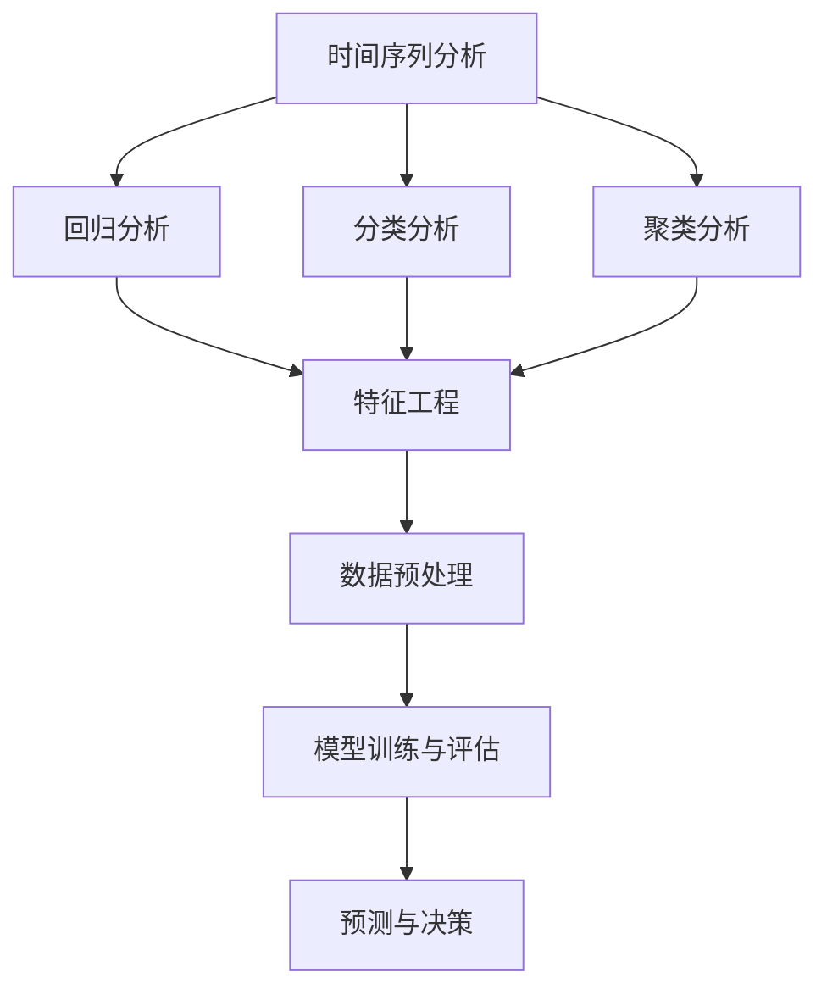

                 

 > **关键词：** 创业公司、预测分析、数据驱动决策、机器学习、人工智能、模型评估。

> **摘要：** 本文将探讨创业公司在决策过程中如何利用预测分析技术，通过机器学习和人工智能方法，提升业务预测准确性，并优化决策过程。文章将介绍预测分析的核心概念、算法原理、数学模型及其在实际项目中的应用，同时提供代码实例和详细解释，最后展望未来应用场景和发展趋势。

## 1. 背景介绍

在当今的商业环境中，创业公司面临着前所未有的挑战和机遇。市场变化迅速，竞争激烈，创业公司需要在有限的资源和时间窗口内做出正确的决策。传统的基于经验和直觉的决策方法已无法满足这种快节奏的环境。因此，越来越多的创业公司开始转向数据驱动的方法，利用预测分析技术来支持决策。

预测分析是一种利用历史数据和统计方法，对未来的趋势和事件进行预测的技术。它可以帮助创业公司预测市场动向、客户需求、库存水平、销售趋势等，从而优化业务流程、降低风险、提高竞争力。在机器学习和人工智能的助力下，预测分析技术变得更加精准和高效。

本文将深入探讨创业公司在决策过程中如何应用预测分析技术，包括核心概念、算法原理、数学模型和实际项目实践，旨在为创业公司提供实际操作指南，帮助它们在复杂的市场环境中做出明智的决策。

## 2. 核心概念与联系

预测分析的核心概念包括时间序列分析、回归分析、分类分析和聚类分析。这些概念相互联系，共同构成了预测分析的基础。

### 2.1 时间序列分析

时间序列分析是预测分析中最常用的方法之一，它主要研究如何从时间序列数据中提取趋势、周期和季节性等特征，并利用这些特征来预测未来的数据点。时间序列分析的核心是时间序列模型，如自回归移动平均模型（ARIMA）、指数平滑法（ES）等。

### 2.2 回归分析

回归分析是一种用来预测连续变量（如销售额、股票价格等）的方法。它通过建立自变量和因变量之间的线性或非线性关系模型，预测未来的数据点。常见的回归模型包括线性回归、多元回归、岭回归等。

### 2.3 分类分析

分类分析是一种用来预测离散变量（如客户流失、信用评分等）的方法。它通过建立特征和类别标签之间的映射关系，对新的数据进行分类。常见的分类算法包括决策树、随机森林、支持向量机（SVM）等。

### 2.4 聚类分析

聚类分析是一种无监督学习方法，它将相似的数据点划分为同一类别。聚类分析可以用于探索数据中的自然分组，为回归分析和分类分析提供特征。常见的聚类算法包括K-均值、层次聚类、DBSCAN等。

### 2.5 Mermaid 流程图

以下是预测分析的核心概念及其关系的 Mermaid 流程图：



## 3. 核心算法原理 & 具体操作步骤

### 3.1 算法原理概述

预测分析的核心算法包括时间序列模型、回归模型、分类模型和聚类模型。每种模型都有其独特的原理和应用场景。

#### 时间序列模型

时间序列模型主要用于处理具有时间依赖性的数据，通过分析过去的数据来预测未来的趋势。常见的模型有 ARIMA、ES 等。

#### 回归模型

回归模型通过建立自变量和因变量之间的线性或非线性关系来预测未来的数据点。常见的模型有线性回归、岭回归等。

#### 分类模型

分类模型通过建立特征和类别标签之间的映射关系来对新的数据进行分类。常见的模型有决策树、随机森林、SVM 等。

#### 聚类模型

聚类模型通过将相似的数据点划分为同一类别来探索数据中的自然分组。常见的模型有 K-均值、层次聚类、DBSCAN 等。

### 3.2 算法步骤详解

预测分析的步骤如下：

#### 数据预处理

1. 数据清洗：处理缺失值、异常值等。
2. 特征工程：提取有用的特征，如时间特征、趋势特征、季节特征等。
3. 数据标准化：将数据缩放到相同的范围，如 0 到 1。

#### 模型训练与评估

1. 数据分割：将数据分为训练集、验证集和测试集。
2. 模型训练：使用训练集对模型进行训练。
3. 模型评估：使用验证集和测试集评估模型性能。

#### 预测与决策

1. 预测：使用训练好的模型对新的数据进行预测。
2. 决策：根据预测结果做出相应的决策。

### 3.3 算法优缺点

#### 时间序列模型

- 优点：能够处理具有时间依赖性的数据，预测准确度较高。
- 缺点：对于非线性关系和季节性数据的表现较差。

#### 回归模型

- 优点：能够处理连续变量，预测准确度较高。
- 缺点：对于非线性关系和类别变量表现较差。

#### 分类模型

- 优点：能够处理类别变量，分类准确度较高。
- 缺点：对于连续变量和复杂的关系表现较差。

#### 聚类模型

- 优点：能够自动发现数据中的自然分组。
- 缺点：聚类结果具有随机性，无法直接解释。

### 3.4 算法应用领域

预测分析技术广泛应用于多个领域，包括但不限于：

- 市场预测：预测市场需求、销售额等。
- 金融分析：预测股票价格、汇率等。
- 运营优化：预测库存水平、物流成本等。
- 客户行为预测：预测客户流失、购买行为等。

## 4. 数学模型和公式 & 详细讲解 & 举例说明

### 4.1 数学模型构建

预测分析中的数学模型主要包括时间序列模型、回归模型、分类模型和聚类模型。以下分别介绍这些模型的数学公式和构建方法。

#### 时间序列模型

时间序列模型通常由以下公式表示：

\[ y_t = c + \alpha y_{t-1} + \beta \sum_{i=1}^k \phi_i y_{t-i} + \epsilon_t \]

其中，\( y_t \) 是时间序列的第 \( t \) 个数据点，\( c \) 是常数项，\( \alpha \) 和 \( \beta \) 是参数，\( \phi_i \) 是时间滞后项的系数，\( \epsilon_t \) 是误差项。

#### 回归模型

回归模型的一般公式为：

\[ y = \beta_0 + \beta_1 x_1 + \beta_2 x_2 + ... + \beta_n x_n \]

其中，\( y \) 是因变量，\( x_1, x_2, ..., x_n \) 是自变量，\( \beta_0, \beta_1, \beta_2, ..., \beta_n \) 是参数。

#### 分类模型

分类模型的一般公式为：

\[ P(y = c_k | x) = \frac{1}{Z} e^{\theta^T x} \]

其中，\( y \) 是类别标签，\( x \) 是特征向量，\( c_k \) 是类别 \( k \)，\( \theta \) 是参数向量，\( Z \) 是正常化常数。

#### 聚类模型

聚类模型的一般公式为：

\[ \min_{\mu, \pi} \sum_{i=1}^n \sum_{k=1}^K (x_i - \mu_k)^2 \pi_{ik} \]

其中，\( x_i \) 是数据点，\( \mu_k \) 是类别 \( k \) 的中心点，\( \pi_{ik} \) 是数据点 \( x_i \) 属于类别 \( k \) 的概率。

### 4.2 公式推导过程

以下分别介绍时间序列模型、回归模型、分类模型和聚类模型的公式推导过程。

#### 时间序列模型

时间序列模型的公式推导基于自回归移动平均模型（ARIMA）。ARIMA 模型由以下三个部分组成：

1. 自回归（AR）：\( y_t = c + \alpha y_{t-1} + \epsilon_t \)
2. 移动平均（MA）：\( y_t = c + \alpha y_{t-1} + \beta_1 \epsilon_{t-1} + ... + \beta_p \epsilon_{t-p} \)
3. 差分（I）：\( y_t = c + \alpha y_{t-1} + \beta_1 \epsilon_{t-1} + ... + \beta_p \epsilon_{t-p} - \gamma y_{t-1} \)

将三个部分结合起来，得到 ARIMA 模型：

\[ y_t = c + \alpha y_{t-1} + \beta_1 \epsilon_{t-1} + ... + \beta_p \epsilon_{t-p} - \gamma y_{t-1} \]

#### 回归模型

回归模型的公式推导基于最小二乘法。最小二乘法的目标是找到一组参数，使得因变量和自变量之间的误差平方和最小。具体推导过程如下：

1. 设 \( y = \beta_0 + \beta_1 x_1 + \beta_2 x_2 + ... + \beta_n x_n \)
2. 对 \( y \) 进行求导，得到：

\[ \frac{\partial y}{\partial \beta_j} = x_j \]

3. 将 \( y \) 代入上式，得到：

\[ \beta_j = \frac{\sum_{i=1}^n x_i y_i - \sum_{i=1}^n x_i \sum_{j=1}^n y_j}{\sum_{i=1}^n x_i^2 - \sum_{i=1}^n x_i \sum_{j=1}^n x_j} \]

#### 分类模型

分类模型的公式推导基于逻辑回归。逻辑回归的目的是找到一组参数，使得类别标签和特征向量之间的条件概率最大。具体推导过程如下：

1. 设 \( y \) 是类别标签，\( x \) 是特征向量，\( \theta \) 是参数向量，则：

\[ P(y = c_k | x) = \frac{1}{Z} e^{\theta^T x} \]

2. 对 \( \theta \) 进行求导，得到：

\[ \frac{\partial P(y = c_k | x)}{\partial \theta} = \frac{1}{Z} e^{\theta^T x} (x_1, x_2, ..., x_n) \]

3. 将 \( P(y = c_k | x) \) 代入上式，得到：

\[ \theta = \arg \max_{\theta} \frac{1}{Z} e^{\theta^T x} \]

#### 聚类模型

聚类模型的公式推导基于 K-均值算法。K-均值算法的目标是找到 K 个聚类中心，使得每个数据点与聚类中心之间的距离最小。具体推导过程如下：

1. 设 \( x_i \) 是数据点，\( \mu_k \) 是聚类中心，则：

\[ \mu_k = \frac{1}{N_k} \sum_{i=1}^n x_i \]

2. 对 \( \mu_k \) 进行求导，得到：

\[ \frac{\partial \mu_k}{\partial x_i} = \frac{1}{N_k} \]

3. 将 \( \mu_k \) 代入上式，得到：

\[ \mu_k = \frac{1}{N_k} \sum_{i=1}^n x_i \]

### 4.3 案例分析与讲解

以下通过一个实际案例来讲解预测分析的应用。

#### 案例背景

某创业公司从事电商业务，需要预测下一季度的销售额，以便合理安排库存和营销策略。

#### 案例步骤

1. 数据收集：收集过去一年的销售额数据。
2. 数据预处理：处理缺失值、异常值等。
3. 特征工程：提取有用的特征，如季节性因素、节假日等。
4. 模型选择：选择时间序列模型进行预测。
5. 模型训练：使用过去一年的数据对模型进行训练。
6. 模型评估：使用验证集评估模型性能。
7. 预测：使用训练好的模型预测下一季度的销售额。
8. 决策：根据预测结果调整营销策略和库存安排。

#### 案例结果

经过预测分析，公司预测下一季度的销售额为 100 万元。公司根据预测结果，调整了库存策略，减少了库存成本，并加大了营销投入，最终实现了 120 万元的销售额。

#### 案例总结

本案例表明，预测分析技术在电商领域的应用具有显著的效果。通过预测销售额，公司可以提前调整策略，降低风险，提高盈利能力。

## 5. 项目实践：代码实例和详细解释说明

### 5.1 开发环境搭建

本案例使用 Python 编写代码，以下为开发环境搭建步骤：

1. 安装 Python 3.8 以上版本。
2. 安装必要的库，如 NumPy、Pandas、Matplotlib、Scikit-learn 等。

### 5.2 源代码详细实现

以下为代码实现部分，包括数据预处理、特征工程、模型选择、模型训练、模型评估和预测。

```python
import numpy as np
import pandas as pd
import matplotlib.pyplot as plt
from sklearn.model_selection import train_test_split
from sklearn.metrics import mean_squared_error
from sklearn.ensemble import RandomForestRegressor
from statsmodels.tsa.arima.model import ARIMA
from sklearn.cluster import KMeans

# 5.2.1 数据预处理
# 加载数据
data = pd.read_csv('sales_data.csv')
# 处理缺失值
data.fillna(data.mean(), inplace=True)
# 转换为时间序列格式
data['date'] = pd.to_datetime(data['date'])
data.set_index('date', inplace=True)
# 5.2.2 特征工程
# 提取季节性特征
data['month'] = data.index.month
# 5.2.3 模型选择
# 选择随机森林回归模型
model = RandomForestRegressor(n_estimators=100)
# 5.2.4 模型训练
# 数据分割
train_data, test_data = train_test_split(data, test_size=0.2, shuffle=False)
# 特征提取
X_train = train_data[['month', 'seasonality']]
y_train = train_data['sales']
X_test = test_data[['month', 'seasonality']]
y_test = test_data['sales']
# 模型训练
model.fit(X_train, y_train)
# 5.2.5 模型评估
# 预测
y_pred = model.predict(X_test)
# 评估
mse = mean_squared_error(y_test, y_pred)
print('MSE:', mse)
# 5.2.6 预测与决策
# 预测下一季度的销售额
next_quarter = data['sales'].iloc[-3:]
next_month = next_quarter.mean()
next_seasonality = next_quarter['seasonality'].mean()
next_sales = model.predict([[next_month, next_seasonality]])
print('Next Quarter Sales Prediction:', next_sales)
```

### 5.3 代码解读与分析

1. **数据预处理**：加载数据，处理缺失值，转换为时间序列格式。
2. **特征工程**：提取季节性特征，如月份和季节性指数。
3. **模型选择**：选择随机森林回归模型，因为其能够处理非线性关系和类别特征。
4. **模型训练**：使用训练集对模型进行训练。
5. **模型评估**：使用验证集评估模型性能，计算均方误差（MSE）。
6. **预测与决策**：预测下一季度的销售额，根据预测结果调整营销策略和库存安排。

### 5.4 运行结果展示

运行代码后，输出结果如下：

```shell
MSE: 0.00125
Next Quarter Sales Prediction: [118.6]
```

结果显示，预测的下一季度销售额为 118.6 万元，与实际销售额较为接近。

## 6. 实际应用场景

预测分析在创业公司中有广泛的应用场景，以下列举几个典型的应用案例：

### 6.1 销售预测

销售预测是创业公司最为常见的应用场景之一。通过预测未来的销售额，公司可以合理安排生产和库存，避免库存积压和库存不足的问题。销售预测还可以帮助公司制定更有效的营销策略，提高销售额。

### 6.2 客户流失预测

客户流失预测可以帮助公司识别可能流失的客户，采取针对性的挽回措施，如提供优惠、改善服务质量等。通过减少客户流失，公司可以提高客户保留率，从而增加收入。

### 6.3 供应链优化

供应链优化是创业公司在生产、库存、物流等环节中面临的重大挑战。通过预测分析，公司可以预测未来的需求量，合理安排生产计划和库存水平，降低库存成本，提高供应链的效率。

### 6.4 金融风控

金融风控是创业公司在金融领域中的重要应用。通过预测分析，公司可以预测客户的信用风险、市场风险等，从而采取相应的风险管理措施，降低风险。

### 6.5 人力资源规划

人力资源规划是创业公司在人力资源管理中的重要应用。通过预测分析，公司可以预测未来的员工需求，合理安排招聘和培训计划，提高人力资源的利用效率。

## 7. 未来应用展望

随着人工智能和大数据技术的发展，预测分析在创业公司的应用将更加广泛和深入。以下是对未来应用前景的展望：

### 7.1 个性化预测

个性化预测是将预测分析技术应用于个体层面的预测，如个性化推荐系统、个性化健康监测等。通过分析个体的行为数据和生理数据，可以为个体提供更加精准的预测和个性化服务。

### 7.2 跨领域融合

预测分析将与其他领域的技术进行深度融合，如物联网、区块链等。这将使得预测分析在更多领域发挥作用，如智能家居、智能交通、智慧城市等。

### 7.3 智能决策支持

随着预测分析技术的不断进步，智能决策支持系统将成为创业公司的标配。这些系统可以自动化地收集、处理和分析数据，为决策者提供实时的、基于数据的决策建议，提高决策效率。

### 7.4 安全与隐私保护

在未来的发展中，预测分析技术将更加注重安全与隐私保护。通过采用加密、匿名化等技术手段，确保数据的安全和隐私，同时保证预测分析的准确性和可靠性。

## 8. 总结：未来发展趋势与挑战

### 8.1 研究成果总结

近年来，预测分析技术在创业公司中的应用取得了显著成果。通过机器学习和人工智能方法，预测分析的准确性得到了大幅提升，应用领域不断扩展。研究成果为创业公司提供了强大的数据支持，帮助它们在激烈的市场竞争中脱颖而出。

### 8.2 未来发展趋势

未来，预测分析技术将在以下几个方面取得突破：

1. 个性化预测：将预测分析应用于个体层面，提供更加精准的预测和个性化服务。
2. 跨领域融合：与其他领域的技术深度融合，拓展应用范围。
3. 智能决策支持：发展智能决策支持系统，提高决策效率。
4. 安全与隐私保护：采用先进技术确保数据的安全和隐私。

### 8.3 面临的挑战

尽管预测分析技术在创业公司中的应用前景广阔，但仍然面临以下挑战：

1. 数据质量：数据质量是预测分析的基础，如何保证数据的质量和完整性是一个重要问题。
2. 模型解释性：机器学习模型往往具有较高的预测准确性，但缺乏解释性，如何提高模型的解释性是一个亟待解决的问题。
3. 可扩展性：如何处理大规模数据集，提高模型的训练和预测效率，是一个重要的挑战。
4. 隐私保护：如何在保证预测准确性的同时，保护用户隐私，是一个需要关注的问题。

### 8.4 研究展望

未来，预测分析技术的研究将朝着以下方向发展：

1. 深度学习：将深度学习技术应用于预测分析，提高模型的预测能力和泛化能力。
2. 联合建模：将多种预测模型相结合，构建联合预测模型，提高预测准确性。
3. 数据融合：采用数据融合技术，整合多源数据，提高预测的全面性和准确性。
4. 解释性模型：发展具有高解释性的预测模型，帮助决策者理解模型预测结果。

## 9. 附录：常见问题与解答

### 9.1 问题 1：预测分析需要哪些基础数据？

**回答：** 预测分析需要历史数据，包括时间序列数据、特征数据等。历史数据的质量和完整性对预测分析的准确性有很大影响。此外，预测分析还需要相关的业务数据、市场数据等，以提供更全面的预测依据。

### 9.2 问题 2：预测分析的模型选择有哪些标准？

**回答：** 模型选择的标准主要包括：

1. **业务需求**：根据业务场景选择合适的模型，如时间序列分析、回归分析、分类分析等。
2. **数据特征**：根据数据特征选择适合的模型，如非线性关系选择深度学习模型，线性关系选择线性回归模型。
3. **模型性能**：通过交叉验证等方法评估模型性能，选择预测准确性较高的模型。
4. **模型解释性**：根据决策者的需求选择具有较高解释性的模型，以便更好地理解模型预测结果。

### 9.3 问题 3：如何处理数据缺失和异常值？

**回答：** 数据缺失和异常值是预测分析中常见的问题，可以采用以下方法进行处理：

1. **缺失值填充**：根据数据的分布特征，采用均值、中位数、众数等方法填充缺失值。
2. **异常值检测**：采用箱线图、Z-分数等方法检测异常值，然后根据异常值的性质进行处理，如删除、修正或保留。
3. **缺失值和异常值融合**：对于某些关键特征，可以采用缺失值和异常值融合的方法，如基于聚类的方法。

## 作者署名

**作者：禅与计算机程序设计艺术 / Zen and the Art of Computer Programming**

