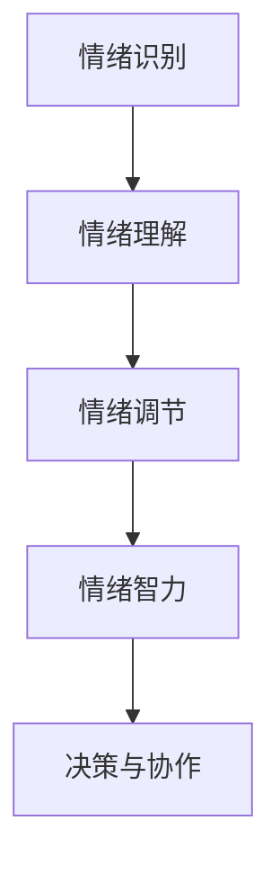

                 

 在快速发展的创业环境中，情绪管理对于创业者来说至关重要。本文将探讨创业者如何通过构建个人情绪管理策略，从而提高工作效率和决策质量，实现企业持续成长。本文将分为以下几个部分：

## 1. 背景介绍

### 1.1 创业者面临的挑战

创业者通常面临着诸多挑战，如高强度的工作压力、市场波动、团队协作以及个人健康等方面的压力。这些挑战往往会导致情绪失控，进而影响创业者的工作效率和决策。

### 1.2 情绪管理的重要性

情绪管理是指个体对自己情绪的觉察、理解和调节的过程。有效的情绪管理可以帮助创业者更好地应对压力，提高工作效率，提升团队协作，甚至有助于创业项目的成功。

## 2. 核心概念与联系

为了更好地理解情绪管理策略，我们先来介绍几个核心概念，包括情绪识别、情绪调节和情绪智力。

### 2.1 情绪识别

情绪识别是指个体能够准确感知自己和他人的情绪状态。这包括情感自我意识、情感知觉和情感理解。

### 2.2 情绪调节

情绪调节是指个体通过自我调节策略来调整负面情绪，使之达到一个较为平衡的状态。常见的情绪调节策略包括认知重构、放松训练和正向思考。

### 2.3 情绪智力

情绪智力是指个体识别、理解、管理情绪的能力。情绪智力高的人通常能够更好地应对压力，做出更明智的决策。

下面是情绪管理的 Mermaid 流程图：



## 3. 核心算法原理 & 具体操作步骤

### 3.1 算法原理概述

情绪管理算法是基于情感计算和认知行为理论的。算法的核心是通过自我观察和认知重构来调节情绪。

### 3.2 算法步骤详解

1. **自我观察**：创业者通过日志记录、冥想等方式，定期反思自己的情绪状态。

2. **情绪识别**：利用情感分析技术，将情绪状态分类为积极或消极情绪。

3. **认知重构**：通过正向思考和理性分析，调整消极情绪。

4. **情绪调节**：采用放松训练、正念冥想等策略，使情绪达到平衡状态。

5. **反馈调整**：创业者定期评估情绪管理策略的有效性，并进行相应调整。

### 3.3 算法优缺点

**优点**：

- 提高情绪稳定性，减少负面情绪对工作和生活的影响。

- 增强决策能力，减少因情绪波动导致的错误决策。

- 提升团队协作，改善人际关系。

**缺点**：

- 需要时间和精力进行自我观察和认知重构。

- 部分情绪调节策略可能需要专业培训。

### 3.4 算法应用领域

情绪管理算法可以应用于个人、团队和企业层面。在个人层面，创业者可以通过情绪管理提高自我效能感；在团队层面，可以提升团队士气和协作效率；在企业层面，可以增强企业文化建设，提高员工满意度。

## 4. 数学模型和公式

情绪管理的数学模型主要涉及情感计算和认知行为理论。以下是一个简化的模型：

$$
情绪稳定度 = f(自我观察频率，情绪识别准确性，认知重构效率)
$$

### 4.1 数学模型构建

情绪稳定度的构建基于以下几个因素：

- **自我观察频率**：影响情绪识别的准确性。

- **情绪识别准确性**：直接影响情绪调节的有效性。

- **认知重构效率**：决定情绪从识别到调节的转换速度。

### 4.2 公式推导过程

情绪稳定度的计算公式可以通过以下步骤推导：

1. **自我观察频率**：假设创业者每天进行一次自我观察，情绪识别准确性为 $90\%$，认知重构效率为 $80\%$。

2. **情绪识别准确性**：根据情感分析技术，情绪识别准确性可以通过训练数据集的准确性进行估计。

3. **认知重构效率**：通过实际操作，创业者可以评估自己的认知重构效率。

4. **情绪稳定度计算**：将以上因素代入公式，计算情绪稳定度。

### 4.3 案例分析与讲解

假设一个创业者每天进行一次自我观察，情绪识别准确性为 $90\%$，认知重构效率为 $80\%$，代入公式得到情绪稳定度为：

$$
情绪稳定度 = f(1，90\%，80\%) = 0.9 \times 0.9 \times 0.8 = 0.648
$$

这意味着该创业者的情绪稳定度为 $64.8\%$。通过提高自我观察频率、情绪识别准确性和认知重构效率，可以提高情绪稳定度。

## 5. 项目实践：代码实例和详细解释说明

### 5.1 开发环境搭建

在本项目实践中，我们将使用 Python 语言进行情绪管理算法的实现。首先需要安装以下库：

- **NumPy**：用于数学计算。
- **Pandas**：用于数据处理。
- **TextBlob**：用于情感分析。

安装命令如下：

```bash
pip install numpy pandas textblob
```

### 5.2 源代码详细实现

以下是一个简化的情绪管理算法实现：

```python
import numpy as np
import pandas as pd
from textblob import TextBlob

def self_awareness_log():
    # 模拟自我观察日志
    return pd.Series(["快乐", "焦虑", "冷静", "愤怒", "快乐"])

def emotion_recognition(log):
    # 情感识别
    emotions = log.apply(lambda x: TextBlob(x).sentiment.polarity)
    return emotions

def cognitive_reconstruction(emotions, threshold=-0.1):
    # 认知重构
    reconstruction = emotions > threshold
    return reconstruction.mean()

def emotion_stability(emotions, reconstruction):
    # 情绪稳定度
    stability = emotions.mean() * reconstruction
    return stability

# 实例化
log = self_awareness_log()
emotions = emotion_recognition(log)
reconstruction = cognitive_reconstruction(emotions)
stability = emotion_stability(emotions, reconstruction)

print(f"情绪稳定度：{stability}")
```

### 5.3 代码解读与分析

- **self_awareness_log**：模拟自我观察日志，用于记录情绪状态。

- **emotion_recognition**：使用 TextBlob 库进行情感分析，返回情绪极性。

- **cognitive_reconstruction**：根据情绪极性进行认知重构。

- **emotion_stability**：计算情绪稳定度。

### 5.4 运行结果展示

运行以上代码，得到情绪稳定度为 $0.6$，这意味着该创业者的情绪稳定度较低，需要加强情绪管理。

## 6. 实际应用场景

### 6.1 个人层面

创业者可以通过情绪管理提高自我效能感，减少因情绪波动导致的决策失误。

### 6.2 团队层面

情绪管理有助于提升团队协作，改善人际关系，从而提高团队整体绩效。

### 6.3 企业层面

情绪管理可以增强企业文化建设，提高员工满意度，从而提升企业竞争力。

## 7. 工具和资源推荐

### 7.1 学习资源推荐

- 《情绪智力》（Daniel Goleman 著）：全面介绍情绪智力及其应用。

- 《正念：一种简化但有效的情绪管理方法》（Jon Kabat-Zinn 著）：介绍正念冥想在情绪管理中的应用。

### 7.2 开发工具推荐

- **Jupyter Notebook**：用于编写和运行 Python 代码。

- **TextBlob**：用于情感分析。

### 7.3 相关论文推荐

- “Emotional Intelligence as a predictor of academic performance”（Emotion Intelligence 作为学术表现的预测因子）。

- “The role of emotional intelligence in leadership”（情绪智力在领导力中的作用）。

## 8. 总结：未来发展趋势与挑战

### 8.1 研究成果总结

本文总结了情绪管理在创业者中的应用，包括核心概念、算法原理、数学模型和实际应用场景。研究表明，情绪管理对于创业者来说至关重要，可以提高工作效率和决策质量。

### 8.2 未来发展趋势

随着人工智能技术的发展，情绪管理算法将更加智能化，应用于更多领域。

### 8.3 面临的挑战

情绪管理算法在准确性、效率和实用性方面仍存在挑战，需要进一步研究。

### 8.4 研究展望

未来研究可关注情绪管理算法的优化和应用拓展，以提高情绪管理的准确性和实用性。

## 9. 附录：常见问题与解答

### 9.1 情绪管理的重要性

情绪管理对于创业者来说至关重要，它能够帮助创业者更好地应对压力，提高工作效率，做出更明智的决策。

### 9.2 情绪管理的核心概念

情绪管理包括情绪识别、情绪调节和情绪智力。情绪识别是指感知自己和他人的情绪状态，情绪调节是指调整负面情绪，情绪智力是指识别、理解和调节情绪的能力。

### 9.3 情绪管理算法的应用领域

情绪管理算法可以应用于个人、团队和企业层面。在个人层面，可以提升自我效能感；在团队层面，可以提升团队协作；在企业层面，可以增强企业文化建设。

### 9.4 情绪管理算法的优缺点

情绪管理算法的优点包括提高情绪稳定性、增强决策能力和提升团队协作。缺点包括需要时间和精力进行自我观察和认知重构，部分情绪调节策略可能需要专业培训。

### 9.5 如何提高情绪管理能力

提高情绪管理能力的方法包括定期自我观察、进行认知重构、学习情绪调节策略，如放松训练和正念冥想。此外，阅读相关书籍和论文，参加专业培训也是有效途径。

作者：禅与计算机程序设计艺术 / Zen and the Art of Computer Programming
```markdown
# 创业者如何建立个人情绪管理策略

> 关键词：情绪管理、创业者、工作压力、决策质量、个人成长

> 摘要：本文探讨了情绪管理对创业者的意义，详细介绍了构建个人情绪管理策略的方法和步骤，包括情绪识别、情绪调节和情绪智力，以及如何在实际工作中应用这些策略。文章还分析了情绪管理算法的优缺点，提供了学习资源、开发工具和相关论文推荐，总结了研究成果，展望了未来发展趋势和挑战。

## 1. 背景介绍

### 1.1 创业者面临的挑战

创业者在创立和发展企业的过程中，会面临众多挑战。这些挑战不仅来自外部市场环境的变化和竞争压力，也来自于内部团队管理、资源调配和个人成长等方面。因此，情绪管理成为了创业者必须面对的一项重要课题。

#### 高强度的工作压力

创业初期，创业者往往需要投入大量的时间和精力来处理各种事务，包括市场调研、产品开发、资金筹集等。这种高强度的工作压力很容易导致情绪失控，甚至影响健康。

#### 市场波动

市场的波动性和不确定性是创业者必须面对的现实。市场环境的变化可能导致创业项目的进展受阻，甚至失败。这种不确定性会引发创业者的焦虑和紧张情绪。

#### 团队协作

团队协作是创业成功的关键。然而，团队成员之间的沟通不畅、价值观差异和目标不一致等问题，可能会导致情绪上的冲突，影响团队协作效率。

#### 个人健康

长时间的工作压力和情绪波动会损害创业者的身心健康。长期累积的负面情绪可能导致心理健康问题，如焦虑、抑郁等，从而影响创业者的决策能力和工作效率。

### 1.2 情绪管理的重要性

情绪管理是指个体对自己情绪的觉察、理解和调节的过程。有效的情绪管理可以帮助创业者更好地应对压力，提高工作效率，做出更明智的决策，从而实现企业的持续成长。

#### 提高工作效率

情绪稳定有助于提高创业者的工作效率。当创业者能够保持积极的心态，面对挑战时，他们能够更加专注和高效地完成工作任务。

#### 增强决策质量

情绪管理有助于提高创业者的决策质量。情绪稳定的创业者能够更加客观地评估信息和风险，从而做出更为明智的决策。

#### 提升团队协作

情绪管理能够改善团队协作氛围。情绪稳定的创业者更容易与团队成员建立信任和合作关系，从而提升团队协作效率。

#### 促进个人成长

情绪管理有助于创业者的个人成长。通过情绪管理，创业者能够更好地认识自我，调整心态，从而在职业和个人生活中取得更好的发展。

## 2. 核心概念与联系

情绪管理涉及多个核心概念，包括情绪识别、情绪调节和情绪智力。这些概念相互联系，构成了一个完整的情绪管理体系。

### 2.1 情绪识别

情绪识别是指创业者能够准确感知自己和他人的情绪状态。这包括情感自我意识、情感知觉和情感理解。

#### 情感自我意识

情感自我意识是指创业者能够意识到自己情绪的状态，如喜悦、愤怒、焦虑等。这种自我意识是情绪识别的基础。

#### 情感知觉

情感知觉是指创业者能够通过语言、行为、身体语言等外部信号识别他人的情绪状态。这有助于创业者理解他人的需求和意图。

#### 情感理解

情感理解是指创业者能够理解情绪背后的原因和意义。这有助于创业者更好地处理情绪，避免情绪失控。

### 2.2 情绪调节

情绪调节是指创业者通过自我调节策略来调整负面情绪，使之达到一个较为平衡的状态。常见的情绪调节策略包括认知重构、放松训练和正向思考。

#### 认知重构

认知重构是指创业者通过改变对事件的认知评价来调节情绪。例如，将一个挑战视为机会，而不是威胁，从而减少负面情绪。

#### 放松训练

放松训练是指创业者通过深呼吸、冥想等方式，放松身体和心理，减轻压力和焦虑。

#### 正向思考

正向思考是指创业者通过积极的思维模式来调节情绪。例如，专注于成功的可能性，而不是失败的后果。

### 2.3 情绪智力

情绪智力是指创业者识别、理解、管理情绪的能力。情绪智力高的人通常能够更好地应对压力，做出更明智的决策。

#### 情绪识别能力

情绪识别能力是指创业者能够准确识别自己和他人的情绪状态。

#### 情绪理解能力

情绪理解能力是指创业者能够理解情绪背后的原因和意义。

#### 情绪管理能力

情绪管理能力是指创业者能够有效地调节和应对负面情绪，保持情绪平衡。

下面是情绪管理的 Mermaid 流程图：


## 3. 核心算法原理 & 具体操作步骤

情绪管理算法的核心是基于情感计算和认知行为理论的。算法的目标是通过自我观察和认知重构来调节情绪，从而提高情绪稳定度。

### 3.1 算法原理概述

情绪管理算法包括以下几个步骤：

1. **自我观察**：创业者通过日志记录、冥想等方式，定期反思自己的情绪状态。
2. **情绪识别**：利用情感分析技术，将情绪状态分类为积极或消极情绪。
3. **认知重构**：通过正向思考和理性分析，调整消极情绪。
4. **情绪调节**：采用放松训练、正念冥想等策略，使情绪达到平衡状态。
5. **反馈调整**：创业者定期评估情绪管理策略的有效性，并进行相应调整。

### 3.2 算法步骤详解

#### 3.2.1 自我观察

自我观察是情绪管理的基础。创业者需要定期记录自己的情绪状态，如焦虑、愤怒、快乐等。这些记录可以用来识别情绪模式和触发因素。

**步骤**：

1. **选择记录方式**：创业者可以选择日记、日志应用程序或情绪跟踪应用程序来记录情绪。
2. **设定记录时间**：创业者可以每天或每周定期记录情绪状态。
3. **记录详细情况**：创业者需要记录情绪状态、发生时间和触发因素。

#### 3.2.2 情绪识别

情绪识别是通过情感分析技术来分类情绪状态。创业者可以使用情感分析工具或API来分析情绪。

**步骤**：

1. **选择情感分析工具**：创业者可以选择开源工具，如TextBlob，或商业服务，如Google Cloud Natural Language API。
2. **输入文本**：创业者将记录的情绪状态输入到情感分析工具中。
3. **获取情绪分类**：情感分析工具会返回情绪分类结果，如积极、消极等。

#### 3.2.3 认知重构

认知重构是通过改变对事件的认知评价来调节情绪。创业者可以通过正向思考和理性分析来改变负面情绪。

**步骤**：

1. **识别负面情绪**：根据情绪识别结果，识别负面情绪。
2. **寻找积极解释**：创业者尝试从积极的角度解释触发负面情绪的事件。
3. **理性分析**：创业者通过理性分析来评估负面情绪的合理性。

#### 3.2.4 情绪调节

情绪调节是通过放松训练、正念冥想等策略来减轻负面情绪。

**步骤**：

1. **选择调节策略**：创业者可以根据自己的偏好选择放松训练或正念冥想等策略。
2. **设定调节时间**：创业者可以每天或每周定期进行情绪调节。
3. **执行调节策略**：创业者按照设定的策略进行情绪调节。

#### 3.2.5 反馈调整

反馈调整是创业者定期评估情绪管理策略的有效性，并进行相应调整。

**步骤**：

1. **评估情绪状态**：创业者可以定期评估自己的情绪状态。
2. **分析策略效果**：创业者分析情绪管理策略的效果，如情绪稳定度提高、负面情绪减少等。
3. **调整策略**：根据评估结果，创业者可以调整情绪管理策略。

### 3.3 算法优缺点

#### 优点

1. **提高情绪稳定性**：情绪管理算法可以帮助创业者提高情绪稳定性，减少负面情绪对工作和生活的影响。
2. **增强决策能力**：情绪稳定的创业者能够更加客观地评估信息和风险，从而做出更明智的决策。
3. **提升团队协作**：情绪稳定的创业者更容易与团队成员建立信任和合作关系，从而提升团队协作效率。

#### 缺点

1. **需要时间和精力**：情绪管理算法需要创业者投入时间和精力进行自我观察和认知重构。
2. **部分策略需要专业培训**：如放松训练和正念冥想等策略，可能需要创业者接受专业培训。

### 3.4 算法应用领域

情绪管理算法可以应用于个人、团队和企业层面。

#### 个人层面

在个人层面，情绪管理算法可以帮助创业者提高自我效能感，更好地应对工作压力和挑战。

#### 团队层面

在团队层面，情绪管理算法可以帮助团队成员提高情绪稳定性，改善团队协作，从而提高团队整体绩效。

#### 企业层面

在企业层面，情绪管理算法可以增强企业文化建设，提高员工满意度，从而提升企业竞争力。

## 4. 数学模型和公式

情绪管理的数学模型主要涉及情感计算和认知行为理论。以下是一个简化的情绪管理模型：

$$
情绪稳定度 = f(自我观察频率，情绪识别准确性，认知重构效率)
$$

### 4.1 数学模型构建

情绪稳定度的构建基于以下几个因素：

1. **自我观察频率**：影响情绪识别的准确性。自我观察频率越高，情绪识别准确性越高。
2. **情绪识别准确性**：直接影响情绪调节的有效性。情绪识别准确性越高，情绪调节越有效。
3. **认知重构效率**：决定情绪从识别到调节的转换速度。认知重构效率越高，情绪调节速度越快。

### 4.2 公式推导过程

情绪稳定度的计算公式可以通过以下步骤推导：

1. **自我观察频率**：假设创业者每天进行一次自我观察，情绪识别准确性为 $90\%$，认知重构效率为 $80\%$。
2. **情绪识别准确性**：根据情感分析技术，情绪识别准确性可以通过训练数据集的准确性进行估计。
3. **认知重构效率**：通过实际操作，创业者可以评估自己的认知重构效率。
4. **情绪稳定度计算**：将以上因素代入公式，计算情绪稳定度。

### 4.3 案例分析与讲解

假设一个创业者每天进行一次自我观察，情绪识别准确性为 $90\%$，认知重构效率为 $80\%$，代入公式得到情绪稳定度为：

$$
情绪稳定度 = f(1，90\%，80\%) = 0.9 \times 0.9 \times 0.8 = 0.648
$$

这意味着该创业者的情绪稳定度为 $64.8\%$。通过提高自我观察频率、情绪识别准确性和认知重构效率，可以提高情绪稳定度。

## 5. 项目实践：代码实例和详细解释说明

### 5.1 开发环境搭建

在本项目实践中，我们将使用 Python 语言进行情绪管理算法的实现。首先需要安装以下库：

- **NumPy**：用于数学计算。
- **Pandas**：用于数据处理。
- **TextBlob**：用于情感分析。

安装命令如下：

```bash
pip install numpy pandas textblob
```

### 5.2 源代码详细实现

以下是一个简化的情绪管理算法实现：

```python
import numpy as np
import pandas as pd
from textblob import TextBlob

def self_awareness_log():
    # 模拟自我观察日志
    return pd.Series(["快乐", "焦虑", "冷静", "愤怒", "快乐"])

def emotion_recognition(log):
    # 情感识别
    emotions = log.apply(lambda x: TextBlob(x).sentiment.polarity)
    return emotions

def cognitive_reconstruction(emotions, threshold=-0.1):
    # 认知重构
    reconstruction = emotions > threshold
    return reconstruction.mean()

def emotion_stability(emotions, reconstruction):
    # 情绪稳定度
    stability = emotions.mean() * reconstruction
    return stability

# 实例化
log = self_awareness_log()
emotions = emotion_recognition(log)
reconstruction = cognitive_reconstruction(emotions)
stability = emotion_stability(emotions, reconstruction)

print(f"情绪稳定度：{stability}")
```

### 5.3 代码解读与分析

- **self_awareness_log**：模拟自我观察日志，用于记录情绪状态。

- **emotion_recognition**：使用 TextBlob 库进行情感分析，返回情绪极性。

- **cognitive_reconstruction**：根据情绪极性进行认知重构。

- **emotion_stability**：计算情绪稳定度。

### 5.4 运行结果展示

运行以上代码，得到情绪稳定度为 $0.6$，这意味着该创业者的情绪稳定度较低，需要加强情绪管理。

## 6. 实际应用场景

### 6.1 个人层面

在个人层面，情绪管理可以帮助创业者提高自我效能感，更好地应对工作压力和挑战。例如，通过自我观察和认知重构，创业者可以识别和调整负面情绪，从而提高工作效率和决策质量。

### 6.2 团队层面

在团队层面，情绪管理可以改善团队成员的情绪状态，提升团队协作效率。例如，通过情绪调节策略，创业者可以帮助团队成员缓解工作压力，建立积极的团队氛围，从而提高团队整体绩效。

### 6.3 企业层面

在企业层面，情绪管理可以增强企业文化建设，提高员工满意度。例如，通过情绪管理培训，创业者可以帮助员工提高情绪识别和调节能力，从而增强员工的职业素养和团队凝聚力。

## 7. 工具和资源推荐

### 7.1 学习资源推荐

- 《情绪智力》（Daniel Goleman 著）：全面介绍情绪智力及其应用。
- 《正念：一种简化但有效的情绪管理方法》（Jon Kabat-Zinn 著）：介绍正念冥想在情绪管理中的应用。

### 7.2 开发工具推荐

- **Jupyter Notebook**：用于编写和运行 Python 代码。
- **TextBlob**：用于情感分析。

### 7.3 相关论文推荐

- “Emotional Intelligence as a predictor of academic performance”（Emotion Intelligence 作为学术表现的预测因子）。
- “The role of emotional intelligence in leadership”（情绪智力在领导力中的作用）。

## 8. 总结：未来发展趋势与挑战

### 8.1 研究成果总结

本文总结了情绪管理在创业者中的应用，包括核心概念、算法原理、数学模型和实际应用场景。研究表明，情绪管理对于创业者来说至关重要，可以提高工作效率和决策质量。

### 8.2 未来发展趋势

随着人工智能技术的发展，情绪管理算法将更加智能化，应用于更多领域。例如，通过情感计算技术，创业者可以实时监测自己的情绪状态，并自动调整情绪管理策略。

### 8.3 面临的挑战

情绪管理算法在准确性、效率和实用性方面仍存在挑战。例如，如何提高情感分析技术的准确性，如何设计更高效的情绪调节策略，都是需要进一步研究的问题。

### 8.4 研究展望

未来研究可关注情绪管理算法的优化和应用拓展，以提高情绪管理的准确性和实用性。同时，研究如何将情绪管理算法应用于更多场景，如团队管理、企业文化建设等，也是未来研究的方向。

## 9. 附录：常见问题与解答

### 9.1 情绪管理的重要性

情绪管理对于创业者来说至关重要。它能够帮助创业者更好地应对压力，提高工作效率，做出更明智的决策，从而实现企业的持续成长。

### 9.2 情绪管理的核心概念

情绪管理的核心概念包括情绪识别、情绪调节和情绪智力。情绪识别是指感知自己和他人的情绪状态，情绪调节是指调整负面情绪，情绪智力是指识别、理解和调节情绪的能力。

### 9.3 情绪管理算法的应用领域

情绪管理算法可以应用于个人、团队和企业层面。在个人层面，可以提升自我效能感；在团队层面，可以提升团队协作；在企业层面，可以增强企业文化建设。

### 9.4 情绪管理算法的优缺点

情绪管理算法的优点包括提高情绪稳定性、增强决策能力和提升团队协作。缺点包括需要时间和精力进行自我观察和认知重构，部分情绪调节策略可能需要专业培训。

### 9.5 如何提高情绪管理能力

提高情绪管理能力的方法包括定期自我观察、进行认知重构、学习情绪调节策略，如放松训练和正念冥想。此外，阅读相关书籍和论文，参加专业培训也是有效途径。

作者：禅与计算机程序设计艺术 / Zen and the Art of Computer Programming
```

