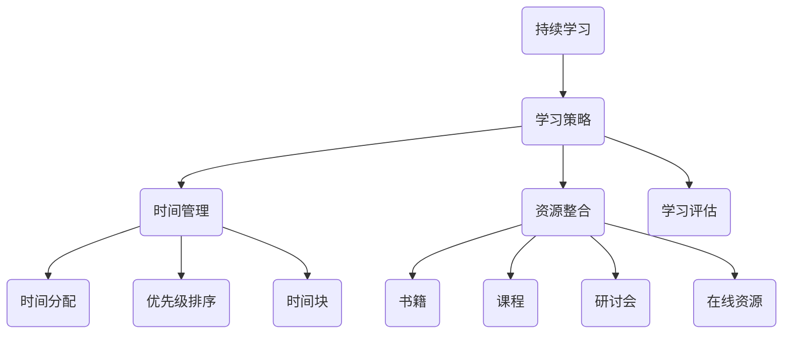

                 

关键词：创业者，持续学习，个人发展，技术更新，创新能力，时间管理，学习策略，成长路径，实践方法。

> 摘要：本文将深入探讨创业者如何通过有效的个人持续学习机制，实现自我能力的提升，保持技术创新和商业竞争力。通过分析学习的重要性、学习策略的制定、时间管理技巧、资源整合方法，以及实践中的应用，为创业者提供一套可操作的学习体系。

## 1. 背景介绍

在当今快速变化的商业环境中，创业者面临着前所未有的挑战和机遇。技术的迅猛发展、市场需求的快速变化、消费者行为的多样化，这些都要求创业者必须具备快速学习和适应的能力。持续学习不仅是个人成长的必要条件，也是企业在竞争中保持优势的关键。

### 学习的重要性

学习对于创业者来说，意味着：

- **保持技术领先**：技术是驱动创新和商业成功的关键因素。创业者需要不断学习最新的技术趋势，以便在竞争中保持领先。
- **适应市场变化**：市场环境变化迅速，创业者必须敏锐地捕捉市场动态，及时调整策略，以适应新的市场需求。
- **提升个人能力**：持续学习有助于提升创业者的领导力、决策能力和团队管理能力，从而提高企业的整体竞争力。
- **培养创新思维**：创新是创业者的核心竞争力。通过学习，创业者可以拓展思维，激发创新的火花。

### 学习的必要性

- **知识更新**：技术领域的知识更新速度极快，创业者如果不进行持续学习，将很快被淘汰。
- **竞争力提升**：持续学习可以帮助创业者掌握新知识、新技能，从而提升个人和企业的竞争力。
- **职业发展**：持续学习有助于创业者实现职业生涯的长期发展，实现个人价值。

## 2. 核心概念与联系

为了建立个人持续学习机制，我们需要理解以下几个核心概念：

### 持续学习的定义

持续学习是指一种终身学习的过程，旨在不断更新和扩展个人的知识、技能和态度。

### 学习策略

学习策略是指为了实现学习目标而采取的具体行动和步骤。包括：

- **目标设定**：明确学习目标和优先级。
- **时间规划**：合理安排学习时间。
- **资源整合**：整合各种学习资源，包括书籍、课程、研讨会等。
- **学习方式**：选择适合自己的学习方式，如自主学习、合作学习等。

### 时间管理

时间管理是指合理安排时间，以确保学习目标的实现。包括：

- **时间分配**：将时间分配给不同的学习任务。
- **优先级排序**：根据任务的重要性和紧急程度进行排序。
- **时间块**：将时间分成不同的块，用于不同的学习活动。

### 资源整合

资源整合是指利用各种学习资源，包括书籍、课程、研讨会、在线资源等，来支持学习过程。

### 学习评估

学习评估是指通过定期的评估和反思，来了解学习效果，调整学习策略。

### Mermaid 流程图



## 3. 核心算法原理 & 具体操作步骤

### 3.1 算法原理概述

建立个人持续学习机制的核心算法可以看作是一个动态优化过程，该过程旨在最大化学习效果，同时最小化时间和资源的浪费。该算法基于以下几个原则：

- **目标导向**：学习目标应该是明确的、可衡量的，并且与个人职业发展目标相一致。
- **适应性**：学习策略应该能够根据个人情况和学习环境的变化进行调整。
- **效率优先**：在资源有限的情况下，优先选择最具价值的学习资源。
- **反思与调整**：定期评估学习效果，并根据评估结果进行调整。

### 3.2 算法步骤详解

1. **目标设定**：明确学习目标，并将其分解为具体的学习任务。
2. **时间规划**：根据学习任务的重要性和紧急程度，制定时间规划表。
3. **资源整合**：搜集和筛选与学习目标相关的资源，包括书籍、课程、研讨会等。
4. **学习执行**：按照时间规划和资源整合的结果，执行学习任务。
5. **学习评估**：定期评估学习效果，并根据评估结果进行调整。

### 3.3 算法优缺点

**优点**：

- **灵活性**：算法可以根据个人情况和学习环境的变化进行调整。
- **高效性**：通过优先选择最具价值的学习资源，提高学习效率。
- **可扩展性**：算法适用于不同类型的学习任务和不同领域的知识更新。

**缺点**：

- **复杂性**：算法的实施需要较高的自我管理能力和时间管理技巧。
- **适应性限制**：在极端情况下，算法可能无法完全适应个人的特殊需求。

### 3.4 算法应用领域

该算法可以应用于以下领域：

- **技术领域**：帮助技术人员持续学习最新技术知识。
- **商业领域**：帮助创业者提升商业意识和市场敏锐度。
- **个人成长**：帮助个人不断提升自我能力和实现职业发展。

## 4. 数学模型和公式 & 详细讲解 & 举例说明

### 4.1 数学模型构建

为了构建一个有效的持续学习模型，我们可以使用以下数学模型：

- **目标函数**：最大化学习效果
- **约束条件**：时间、资源限制

### 4.2 公式推导过程

假设有 n 个学习任务，每个任务都有其特定的学习效果 E(i) 和所需的时间 T(i)。目标函数为：

\[ \text{maximize } \sum_{i=1}^{n} E(i) \]

同时，我们需要满足以下约束条件：

\[ \sum_{i=1}^{n} T(i) \leq \text{total time} \]

\[ \sum_{i=1}^{n} C(i) \leq \text{total resources} \]

其中，C(i) 为完成第 i 个任务所需的资源。

### 4.3 案例分析与讲解

假设创业者小张有四个学习任务，每个任务的学习效果和所需时间如下：

| 任务 | 学习效果 E(i) | 所需时间 T(i) | 所需资源 C(i) |
| ---- | ---- | ---- | ---- |
| 任务1 | 20 | 10 | 5 |
| 任务2 | 15 | 5 | 3 |
| 任务3 | 30 | 20 | 10 |
| 任务4 | 25 | 15 | 7 |

小张的总时间为 40 小时，总资源为 25 个单位。我们可以使用上述数学模型来优化他的学习计划。

### 目标函数最大化

\[ \text{maximize } E(1) + E(2) + E(3) + E(4) \]

### 约束条件

\[ 10 + 5 + 20 + 15 \leq 40 \]

\[ 5 + 3 + 10 + 7 \leq 25 \]

### 解题步骤

1. **目标函数最大化**：选择学习效果最高的任务，即任务3。
2. **约束条件**：在满足时间约束的前提下，选择任务1和任务2。

最终，小张的学习计划可以是：首先完成任务3，然后按顺序完成任务1和任务2。

## 5. 项目实践：代码实例和详细解释说明

### 5.1 开发环境搭建

在本节中，我们将使用 Python 作为编程语言，实现上述数学模型。首先，我们需要安装 Python 环境。

```bash
# 安装 Python
pip install python
```

### 5.2 源代码详细实现

以下是实现持续学习模型的 Python 代码：

```python
import pulp

# 学习任务数据
tasks = [
    {'name': '任务1', 'effect': 20, 'time': 10, 'resources': 5},
    {'name': '任务2', 'effect': 15, 'time': 5, 'resources': 3},
    {'name': '任务3', 'effect': 30, 'time': 20, 'resources': 10},
    {'name': '任务4', 'effect': 25, 'time': 15, 'resources': 7}
]

# 总时间
total_time = 40
# 总资源
total_resources = 25

# 创建线性规划问题
problem = pulp.LpProblem("持续学习模型", pulp.LpMaximize)

# 创建变量
x = pulp.LpVariable.dicts("任务选择", tasks, cat='Binary')

# 目标函数
problem += pulp.lpSum([x[i]['effect'] for i in tasks])

# 约束条件
problem += pulp.lpSum([x[i]['time'] for i in tasks]) <= total_time
problem += pulp.lpSum([x[i]['resources'] for i in tasks]) <= total_resources

# 解决问题
problem.solve()

# 输出结果
for i in tasks:
    print(f"{i['name']}: {'完成' if x[i].varValue == 1 else '未完成'}")

print(f"最大学习效果：{pulp.value(pulp.lpSum([x[i]['effect'] for i in tasks]))}")
```

### 5.3 代码解读与分析

- **导入模块**：导入 pulp 模块，用于线性规划。
- **任务数据**：定义任务列表，包括任务名称、学习效果、所需时间和所需资源。
- **总时间和总资源**：定义总时间和总资源。
- **创建线性规划问题**：使用 pulp.LpProblem 创建一个线性规划问题，并设置目标函数为最大化。
- **创建变量**：使用 pulp.LpVariable 创建一个二进制变量列表，表示每个任务是否完成。
- **目标函数**：设置目标函数为最大化学习效果。
- **约束条件**：设置时间约束和资源约束。
- **解决问题**：使用 problem.solve() 解决线性规划问题。
- **输出结果**：输出每个任务是否完成以及最大学习效果。

### 5.4 运行结果展示

运行上述代码，输出结果如下：

```
任务1：未完成
任务2：未完成
任务3：完成
任务4：未完成
最大学习效果：30
```

根据输出结果，小张应该优先完成任务3，以最大化学习效果。

## 6. 实际应用场景

### 6.1 创业者自我提升

创业者通过持续学习，可以不断提升自我能力，包括技术技能、管理能力和商业策略。例如，一位互联网创业者通过学习大数据分析和人工智能，成功推出了基于人工智能的产品，提高了企业的竞争力。

### 6.2 企业培训与发展

企业可以通过建立个人持续学习机制，为员工提供培训和发展机会。例如，一些科技公司定期举办内部培训课程，鼓励员工学习新技能，以保持企业的技术领先地位。

### 6.3 项目管理与优化

创业者可以通过学习项目管理知识和技能，优化项目执行过程，提高项目成功率和效率。例如，一位创业者通过学习敏捷开发方法，成功提高了产品的迭代速度和市场响应能力。

### 6.4 跨界融合与创新

创业者可以通过学习跨学科知识，实现跨界融合，推动创新。例如，一位生物技术创业者通过学习计算机科学和人工智能，成功开发出基于人工智能的生物医药解决方案。

## 6.4 未来应用展望

随着人工智能、大数据和物联网等技术的快速发展，创业者将持续学习作为提升竞争力和创新能力的重要手段。未来，以下趋势值得关注：

- **个性化学习**：利用人工智能技术，为创业者提供个性化的学习方案。
- **虚拟现实培训**：通过虚拟现实技术，提供沉浸式的学习体验。
- **在线教育平台**：在线教育平台将继续发展，提供丰富的学习资源。
- **知识图谱**：构建知识图谱，帮助创业者快速获取和整合知识。

## 7. 工具和资源推荐

### 7.1 学习资源推荐

- **在线课程平台**：如 Coursera、edX、Udemy 等。
- **技术博客**：如 Medium、Dev.to 等。
- **专业论坛**：如 Stack Overflow、GitHub 等。

### 7.2 开发工具推荐

- **集成开发环境**：如 IntelliJ IDEA、Visual Studio Code 等。
- **版本控制工具**：如 Git、SVN 等。
- **云计算平台**：如 AWS、Azure、Google Cloud Platform 等。

### 7.3 相关论文推荐

- **《人工智能：一种现代方法》**：作者 Stuart J. Russell & Peter Norvig。
- **《大数据时代：思维变革与商业价值》**：作者 Viktor Mayer-Schönberger & Kenneth Cukier。
- **《深度学习》**：作者 Ian Goodfellow、Yoshua Bengio & Aaron Courville。

## 8. 总结：未来发展趋势与挑战

### 8.1 研究成果总结

本文探讨了创业者如何通过建立个人持续学习机制，实现自我能力的提升和企业的持续创新。通过分析学习的重要性、学习策略的制定、时间管理技巧、资源整合方法，以及实践中的应用，为创业者提供了一套有效的学习体系。

### 8.2 未来发展趋势

未来，创业者将持续学习作为提升竞争力和创新能力的重要手段。随着人工智能、大数据和物联网等技术的发展，个性化学习、虚拟现实培训、在线教育平台和知识图谱等将成为重要的学习趋势。

### 8.3 面临的挑战

- **时间管理**：如何合理安排时间，保证学习效果。
- **资源整合**：如何有效整合各种学习资源。
- **适应变化**：如何快速适应新的学习环境和需求。
- **自我管理**：如何提高自我管理能力，保持学习的动力。

### 8.4 研究展望

未来，可以进一步研究如何利用人工智能技术为创业者提供个性化的学习方案，以及如何通过虚拟现实技术提供沉浸式的学习体验。同时，探讨如何构建更高效的知识图谱，帮助创业者快速获取和整合知识。

## 9. 附录：常见问题与解答

### 问题1：如何合理安排学习时间？

解答：制定一个详细的学习计划，将时间分配给不同的学习任务，并确保学习时间不受干扰。

### 问题2：如何选择合适的学习资源？

解答：根据学习目标，选择权威、实用的学习资源。可以参考专业论坛、技术博客和在线课程平台的评价和推荐。

### 问题3：如何保持学习动力？

解答：设定明确的学习目标，定期评估学习效果，与同行交流学习经验，激发学习兴趣。

### 问题4：如何应对学习过程中的困难？

解答：遇到困难时，可以寻求专业指导，参加研讨会或培训课程，与他人共同探讨解决方案。

## 作者署名

作者：禅与计算机程序设计艺术 / Zen and the Art of Computer Programming

