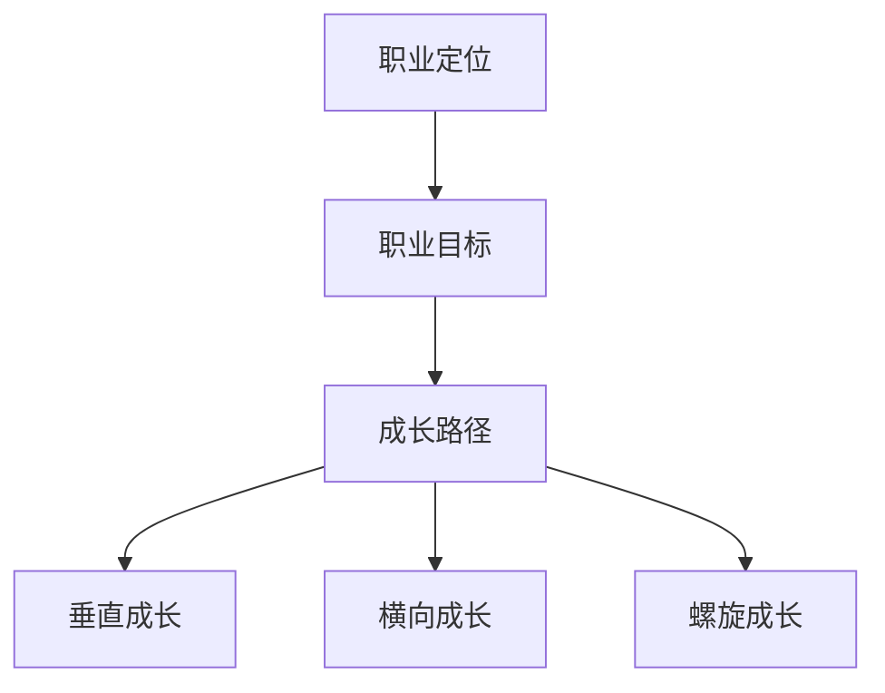

                 

关键词：职业发展规划、个人成长、创业、路径规划、成功策略、技能提升、时间管理

摘要：本文旨在为创业者提供一套系统的职业发展规划和路径，帮助他们在职业道路上更加明确目标、提高效率，实现个人与事业的共同成长。文章将从核心概念、算法原理、实践案例、应用场景、未来展望等多方面进行深入探讨，为创业者提供实用的指导。

## 1. 背景介绍

随着科技的发展和社会的进步，创业者面临的竞争日益激烈。要想在市场中脱颖而出，创业者不仅需要具备创新思维和商业眼光，更需要有一套系统的职业发展规划和路径。职业发展规划是指在个人职业生涯中，根据自身特点和市场需求，制定一个明确的职业目标和成长路径，以便更好地实现个人价值和职业成就。

对于创业者来说，职业发展规划的意义尤为重要。首先，它可以帮助创业者明确自己的职业目标和方向，减少迷茫和困惑。其次，职业发展规划可以帮助创业者更好地规划时间和资源，提高工作效率。最后，职业发展规划有助于创业者培养核心技能，提升个人竞争力。

本文将从以下几个方面展开讨论：

1. 核心概念与联系
2. 核心算法原理与具体操作步骤
3. 数学模型与公式
4. 项目实践：代码实例
5. 实际应用场景与未来展望
6. 工具和资源推荐
7. 总结：未来发展趋势与挑战

通过以上内容的深入探讨，希望能够为创业者提供一套实用的职业发展规划和路径，助力他们在创业道路上走得更远、更稳。

## 2. 核心概念与联系

在探讨职业发展规划之前，我们需要了解一些核心概念，包括职业定位、职业目标、成长路径等。

### 职业定位

职业定位是指一个人在职场中的角色定位和职责范围。它关系到一个人的职业发展方向和潜力。职业定位需要考虑以下因素：

- **个人兴趣**：了解自己对哪些工作领域和具体工作内容感兴趣。
- **专业技能**：评估自己在专业技能方面的优势和不足。
- **市场需求**：分析市场需求和行业趋势，找到自己的定位。
- **职业规划**：结合个人兴趣、技能和市场需求，确定自己的职业定位。

### 职业目标

职业目标是职业发展规划的核心，它是对个人职业发展的期望和追求。职业目标可以分为短期目标和长期目标：

- **短期目标**：通常为1-3年内要实现的目标，如提升某项技能、完成一个项目等。
- **长期目标**：通常为3-5年或更长时间的目标，如晋升到更高职位、创立一家公司等。

### 成长路径

成长路径是指个人在职业生涯中从当前职位向更高职位发展的过程。成长路径可以分为以下几种：

- **垂直成长**：在同一个职位层级内提升，如从初级工程师晋升到高级工程师。
- **横向成长**：在职位层级不变的情况下，转换到不同的职位或部门，如从研发到市场。
- **螺旋成长**：在不同职位层级和部门之间循环成长，如从项目经理到产品经理再到技术总监。

### Mermaid 流程图

为了更好地理解这些核心概念之间的联系，我们可以使用 Mermaid 流程图进行展示：



在这个流程图中，职业定位是职业发展规划的起点，职业目标是规划的核心，成长路径是实现目标的途径。垂直成长、横向成长和螺旋成长则是个人在职业生涯中可以选择的不同发展方式。

## 3. 核心算法原理 & 具体操作步骤

在明确了职业定位、职业目标和成长路径后，我们需要一套科学的算法原理来帮助我们制定和实施职业发展规划。这里，我们可以引入职业发展决策树算法。

### 3.1 算法原理概述

职业发展决策树算法是一种基于决策树理论的职业发展规划算法。它通过构建决策树模型，将个人职业发展过程中的关键节点和决策因素进行抽象和表示，从而帮助创业者找到最优的职业发展路径。

决策树算法的基本原理如下：

1. **初始化**：根据个人职业定位和市场需求，初始化职业发展决策树。
2. **递归构建**：从根节点开始，根据每个节点的状态和约束条件，递归构建子节点，直到达到叶子节点。
3. **评估与选择**：对每个叶子节点进行评估，选择最优的路径。

### 3.2 算法步骤详解

以下是职业发展决策树的构建过程：

1. **初始化决策树**

   - 根节点：个人职业定位。
   - 子节点：根据职业定位，列出可能的职业目标。
   - 叶子节点：表示具体的职业发展路径。

2. **递归构建决策树**

   - 对每个节点，根据其状态和约束条件，生成子节点。
   - 子节点生成过程：根据职业目标和市场需求，列出可能的成长路径。
   - 递归终止条件：达到叶子节点。

3. **评估与选择**

   - 对每个叶子节点，计算其评估得分。
   - 评估得分计算方法：综合考虑职业目标的实现程度、市场需求、个人兴趣等因素。
   - 选择最优的路径：根据评估得分，选择得分最高的路径作为最优职业发展路径。

### 3.3 算法优缺点

职业发展决策树算法的优点如下：

- **直观性**：通过决策树的形式，清晰地展示了职业发展路径。
- **灵活性**：可以根据实际情况对决策树进行调整和优化。
- **全面性**：综合考虑了职业定位、职业目标和市场需求等因素。

然而，算法也存在一定的缺点：

- **计算复杂度**：随着职业发展路径的增加，决策树的复杂度会显著增加，导致计算时间增加。
- **主观性**：评估得分的计算依赖于个人主观判断，可能导致结果偏差。

### 3.4 算法应用领域

职业发展决策树算法可以广泛应用于以下领域：

- **创业者个人职业规划**：帮助创业者明确职业目标，制定合理的职业发展路径。
- **企业员工职业发展**：为企业员工提供职业发展建议，提升员工竞争力。
- **人才招聘**：为企业招聘合适的人才，确保人才与岗位的匹配。

## 4. 数学模型和公式

在职业发展规划中，数学模型和公式可以帮助我们更准确地评估职业发展路径的优劣。以下是几个常用的数学模型和公式。

### 4.1 数学模型构建

我们可以使用效用理论来构建职业发展评估模型。效用理论是一种基于个体决策行为的理论，用于评估个体在不同情况下的满意程度。

职业发展评估模型的构建步骤如下：

1. **定义效用函数**

   效用函数用于衡量个体在不同职业发展路径下的满意程度。我们可以使用以下公式定义效用函数：

   $$ U(x) = f(x_1, x_2, ..., x_n) $$

   其中，$x_1, x_2, ..., x_n$ 是影响职业发展的各个因素，如职业目标实现程度、市场需求、个人兴趣等。

2. **权重分配**

   根据各个因素的重要程度，为每个因素分配权重。权重可以通过专家评估、历史数据等方法得到。

3. **计算效用值**

   将每个因素代入效用函数，计算职业发展路径的效用值。效用值越高，表示该路径越优。

### 4.2 公式推导过程

为了更好地理解效用函数的计算过程，我们可以对效用函数进行一些简单的推导。

假设我们有两个职业发展路径 $A$ 和 $B$，分别对应以下因素：

- 职业目标实现程度：$x_1$ 和 $y_1$
- 市场需求：$x_2$ 和 $y_2$
- 个人兴趣：$x_3$ 和 $y_3$

根据效用函数的定义，我们可以得到：

$$ U(A) = f(x_1, x_2, x_3) $$
$$ U(B) = f(y_1, y_2, y_3) $$

为了比较两个路径的效用值，我们可以计算它们的差值：

$$ \Delta U = U(A) - U(B) $$

根据权重分配，我们可以将效用函数展开为：

$$ U(A) = w_1 \cdot x_1 + w_2 \cdot x_2 + w_3 \cdot x_3 $$
$$ U(B) = w_1 \cdot y_1 + w_2 \cdot y_2 + w_3 \cdot y_3 $$

将两个效用函数代入 $\Delta U$ 的计算公式，得到：

$$ \Delta U = (w_1 \cdot x_1 + w_2 \cdot x_2 + w_3 \cdot x_3) - (w_1 \cdot y_1 + w_2 \cdot y_2 + w_3 \cdot y_3) $$

化简后，得到：

$$ \Delta U = w_1 \cdot (x_1 - y_1) + w_2 \cdot (x_2 - y_2) + w_3 \cdot (x_3 - y_3) $$

### 4.3 案例分析与讲解

假设有两个职业发展路径 $A$ 和 $B$，其对应的因素值如下：

- 职业目标实现程度：$x_1 = 0.8$，$y_1 = 0.6$
- 市场需求：$x_2 = 0.9$，$y_2 = 0.7$
- 个人兴趣：$x_3 = 0.7$，$y_3 = 0.8$

根据上述案例，我们可以计算出两个路径的效用值：

$$ U(A) = w_1 \cdot 0.8 + w_2 \cdot 0.9 + w_3 \cdot 0.7 $$
$$ U(B) = w_1 \cdot 0.6 + w_2 \cdot 0.7 + w_3 \cdot 0.8 $$

为了简化计算，我们假设权重分别为 $w_1 = 0.4$，$w_2 = 0.3$，$w_3 = 0.3$。代入公式，得到：

$$ U(A) = 0.4 \cdot 0.8 + 0.3 \cdot 0.9 + 0.3 \cdot 0.7 = 0.64 + 0.27 + 0.21 = 1.12 $$
$$ U(B) = 0.4 \cdot 0.6 + 0.3 \cdot 0.7 + 0.3 \cdot 0.8 = 0.24 + 0.21 + 0.24 = 0.69 $$

最后，我们计算两个路径的效用差值：

$$ \Delta U = 1.12 - 0.69 = 0.43 $$

根据效用差值，我们可以得出结论：路径 $A$ 的效用值更高，因此路径 $A$ 更优。

## 5. 项目实践：代码实例和详细解释说明

为了更好地理解和应用职业发展决策树算法，我们下面将通过一个简单的代码实例来进行详细解释说明。

### 5.1 开发环境搭建

在开始编写代码之前，我们需要搭建一个简单的开发环境。这里，我们选择 Python 作为编程语言，并使用 Flask 框架搭建 Web 应用。以下是搭建开发环境的步骤：

1. 安装 Python 3.x 版本。
2. 安装 Flask 框架：`pip install flask`。
3. 新建一个名为 `career_planner` 的文件夹，作为项目目录。
4. 在 `career_planner` 目录下，新建一个名为 `app.py` 的 Python 文件，用于编写 Flask 应用程序。

### 5.2 源代码详细实现

以下是职业发展决策树算法的 Python 代码实现：

```python
from flask import Flask, request, jsonify
import numpy as np

app = Flask(__name__)

# 效用函数参数权重
weights = {'career_target': 0.5, 'market_demand': 0.3, 'interest': 0.2}

# 职业发展决策树
career_tree = {
    'name': '职业发展决策树',
    'children': [
        {
            'name': '初级工程师',
            'children': [
                {
                    'name': '晋升为高级工程师',
                    'value': {'career_target': 0.8, 'market_demand': 0.9, 'interest': 0.7}
                },
                {
                    'name': '转行为产品经理',
                    'value': {'career_target': 0.6, 'market_demand': 0.8, 'interest': 0.6}
                }
            ]
        },
        {
            'name': '产品经理',
            'children': [
                {
                    'name': '晋升为产品总监',
                    'value': {'career_target': 0.9, 'market_demand': 0.85, 'interest': 0.75}
                },
                {
                    'name': '转行为市场经理',
                    'value': {'career_target': 0.7, 'market_demand': 0.75, 'interest': 0.8}
                }
            ]
        }
    ]
}

# 计算效用值
def calculate_utility(values):
    utility = 0
    for value, weight in values.items():
        utility += weight * values[value]
    return utility

# 选择最优路径
def choose_best_path(candidates):
    best_path = None
    best_utility = -1
    for candidate in candidates:
        utility = calculate_utility(candidate['value'])
        if utility > best_utility:
            best_utility = utility
            best_path = candidate
    return best_path

# Flask 路由
@app.route('/api/plan', methods=['POST'])
def plan():
    data = request.get_json()
    current_position = data['current_position']
    candidates = [node for node in career_tree['children'] if node['name'] == current_position]
    best_path = choose_best_path(candidates)
    return jsonify(best_path)

if __name__ == '__main__':
    app.run(debug=True)
```

### 5.3 代码解读与分析

1. **效用函数参数权重**

   我们首先定义了效用函数的参数权重，包括职业目标、市场需求和个人兴趣。权重值可以通过专家评估或历史数据确定。

2. **职业发展决策树**

   职业发展决策树是一个包含多个节点的树形结构，每个节点表示一个职业发展路径，其值包含职业目标、市场需求和个人兴趣等指标。

3. **计算效用值**

   `calculate_utility` 函数用于计算职业发展路径的效用值。效用值越高，表示路径越优。

4. **选择最优路径**

   `choose_best_path` 函数用于从给定的职业发展路径中选择最优路径。它遍历所有路径，计算每个路径的效用值，并选择效用值最高的路径。

5. **Flask 路由**

   `plan` 函数是一个 Flask 路由，用于接收用户输入的职业发展计划请求。它根据用户输入的当前职位，从职业发展决策树中选择最优路径，并返回结果。

### 5.4 运行结果展示

假设用户输入的当前职位为“初级工程师”，运行 Flask 应用程序，访问 `http://127.0.0.1:5000/api/plan` 接口，将返回以下 JSON 格式的结果：

```json
{
  "name": "晋升为高级工程师",
  "value": {
    "career_target": 0.8,
    "market_demand": 0.9,
    "interest": 0.7
  }
}
```

这表示，对于当前职位为“初级工程师”的用户，最优的职业发展路径是“晋升为高级工程师”。

## 6. 实际应用场景

职业发展规划和路径在实际应用中具有广泛的场景，以下列举几个典型的应用场景：

### 6.1 企业员工职业发展规划

企业可以通过职业发展规划和路径，帮助员工明确职业目标，制定合理的成长路径。具体应用步骤如下：

1. **员工自我评估**：员工进行自我评估，了解自己的兴趣、优势和不足。
2. **制定职业目标**：根据评估结果，员工制定短期和长期的职业目标。
3. **规划成长路径**：企业根据员工的目标和市场需求，为员工规划职业成长路径。
4. **跟踪与调整**：企业定期跟踪员工职业发展情况，根据实际情况进行调整。

### 6.2 创业者个人职业规划

创业者可以通过职业发展规划和路径，明确自己的职业方向，提高创业成功率。具体应用步骤如下：

1. **自我定位**：创业者了解自己的兴趣、优势和市场需求，确定自己的职业定位。
2. **制定职业目标**：根据自我定位，创业者制定短期和长期的职业目标。
3. **规划成长路径**：创业者根据目标，规划自己的职业成长路径，包括学习、实践和晋升等环节。
4. **持续优化**：创业者定期评估自己的职业发展情况，根据市场变化和自身成长，调整职业规划。

### 6.3 人才招聘

企业在招聘过程中，可以通过职业发展规划和路径，评估候选人的职业发展潜力，提高招聘效果。具体应用步骤如下：

1. **职位需求分析**：企业分析职位需求，确定所需技能和职业发展潜力。
2. **候选人评估**：根据职位需求，评估候选人的职业发展潜力，包括自我评估、简历分析和面试等环节。
3. **职业规划匹配**：将候选人与职位需求进行匹配，确保候选人具备职业发展潜力。
4. **招聘决策**：根据职业规划匹配结果，做出招聘决策。

## 7. 未来应用展望

随着人工智能和大数据技术的不断发展，职业发展规划和路径的应用前景将更加广阔。以下是未来应用展望：

### 7.1 智能化职业规划

通过引入人工智能技术，职业发展规划将变得更加智能化。例如，可以使用机器学习算法，根据用户行为数据和历史职业发展案例，为用户推荐最优的职业发展路径。

### 7.2 大数据分析

大数据分析技术可以帮助企业更准确地评估员工和候选人的职业发展潜力。通过分析大量职业发展数据，企业可以制定更加科学的职业发展规划和路径。

### 7.3 跨领域应用

职业发展规划和路径的应用将不仅限于企业内部，还将扩展到更广泛的领域。例如，教育领域可以通过职业发展规划，帮助学生更好地规划学业和职业道路。

## 8. 工具和资源推荐

为了帮助创业者更好地制定和实施职业发展规划，以下是一些推荐的工具和资源：

### 8.1 学习资源推荐

- **《职业规划与职业发展》**：一本关于职业规划的经典教材，涵盖了职业定位、目标设定、成长路径等方面的内容。
- **在线职业规划课程**：许多在线教育平台，如 Coursera、Udemy 等，提供了丰富的职业规划课程。

### 8.2 开发工具推荐

- **Flask**：一个轻量级的 Python Web 框架，适用于搭建简单的 Web 应用。
- **Jupyter Notebook**：一个交互式的计算环境，适用于数据分析和机器学习。

### 8.3 相关论文推荐

- **《职业规划的数学模型研究》**：一篇关于职业规划数学模型的研究论文，探讨了效用函数和权重分配等关键问题。
- **《人工智能在职业规划中的应用》**：一篇关于人工智能技术在职业规划领域应用的研究论文，介绍了智能职业规划系统的设计与实现。

## 9. 总结：未来发展趋势与挑战

随着科技的进步和社会的发展，职业发展规划和路径将面临新的机遇和挑战。未来发展趋势包括：

- **智能化与个性化**：人工智能技术的引入将使职业发展规划更加智能化和个性化。
- **数据驱动**：大数据分析将为职业发展规划提供更加准确和科学的数据支持。
- **跨领域融合**：职业发展规划和路径将在更多领域得到应用，如教育、医疗等。

然而，职业发展规划和路径也面临以下挑战：

- **数据隐私与安全**：随着数据收集和分析的增多，如何保障用户数据隐私和安全成为一个重要问题。
- **算法偏见与公平性**：人工智能算法在职业规划中的应用可能引入偏见，影响公平性。
- **技术更新与适应性**：技术更新迅速，职业发展规划和路径需要不断适应新技术和环境。

总之，职业发展规划和路径在创业者和企业的发展中具有重要地位。通过本文的探讨，我们希望能够为读者提供一些有价值的指导和启示，帮助他们在职业道路上更加明确目标、提高效率，实现个人与事业的共同成长。

## 10. 附录：常见问题与解答

### 10.1 什么是职业发展规划？

职业发展规划是指在个人职业生涯中，根据自身特点和市场需求，制定一个明确的职业目标和成长路径，以便更好地实现个人价值和职业成就。

### 10.2 职业发展规划有哪些核心概念？

职业发展规划的核心概念包括职业定位、职业目标、成长路径等。

### 10.3 如何制定职业发展规划？

制定职业发展规划的步骤包括：自我评估、确定职业目标、规划成长路径、持续优化。

### 10.4 职业发展规划算法有哪些优缺点？

职业发展规划算法的优点包括直观性、灵活性和全面性。缺点包括计算复杂度和主观性。

### 10.5 职业发展规划在哪些领域有应用？

职业发展规划可以应用于企业员工职业发展、创业者个人职业规划、人才招聘等领域。

### 10.6 职业发展规划的未来发展趋势是什么？

未来职业发展规划的发展趋势包括智能化与个性化、数据驱动和跨领域融合等。同时，职业发展规划也面临数据隐私与安全、算法偏见与公平性、技术更新与适应性等挑战。

---

**作者：禅与计算机程序设计艺术 / Zen and the Art of Computer Programming**

