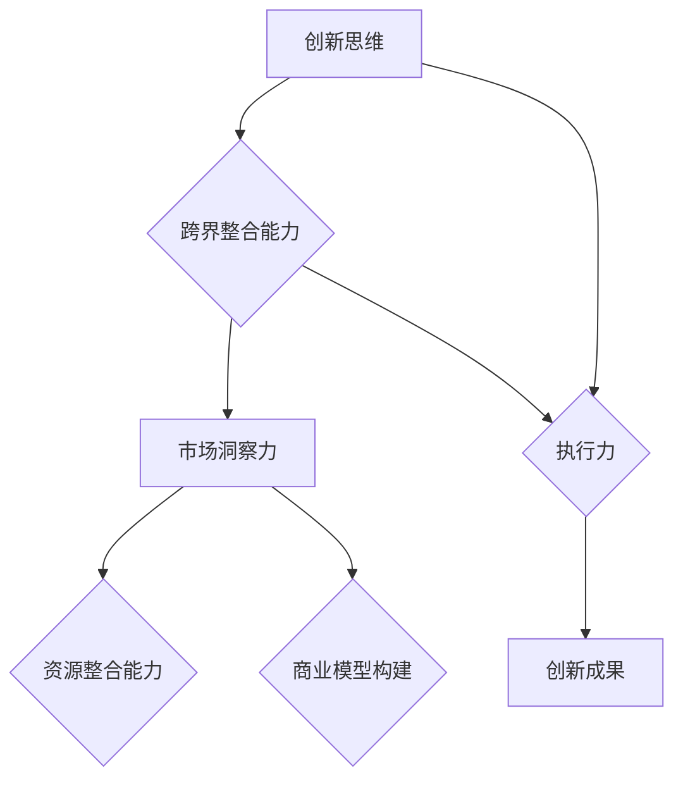

                 

关键词：创业思维、跨界整合、创新、能力培养、技术趋势

> 摘要：在当今快速变化的技术环境中，创业者不仅需要具备创新思维，还必须具备跨界整合能力。本文将深入探讨如何培养这些关键能力，以帮助创业者应对未来的挑战，实现创业的成功。

## 1. 背景介绍

随着互联网、大数据、人工智能等技术的飞速发展，市场环境变化日益迅速，竞争也更加激烈。在这样的背景下，传统的单一思维模式已经无法满足创业者的需求。创新思维和跨界整合能力成为了成功创业的必备条件。创新思维是指创业者能够从不同角度思考问题，提出新的解决方案；而跨界整合能力则是指创业者能够将不同领域的知识和资源进行有效整合，创造出全新的商业模式或产品。

## 2. 核心概念与联系

### 2.1 创新思维

创新思维是一种超越常规、突破框架的思维方式。它包括发散思维、逆向思维、联想思维等多种形式。创新思维的核心是打破思维的定式，寻找新的解决方案。例如，当传统酒店业面对互联网的冲击时，Airbnb通过创新的共享经济模式，重新定义了住宿市场。

### 2.2 跨界整合能力

跨界整合能力是指将不同领域的技术、理念、资源进行整合，创造出新的价值。这种能力需要创业者具备广泛的知识面和敏锐的市场洞察力。例如，谷歌通过收购Android，将移动操作系统与互联网服务相结合，成功打造了全球领先的搜索引擎和移动平台。

### 2.3 创新思维与跨界整合能力的关系

创新思维和跨界整合能力相辅相成。创新思维为跨界整合提供了新的方向和可能性，而跨界整合则为创新思维提供了实践的平台。没有创新思维，跨界整合就可能陷入低效和重复；而没有跨界整合能力，创新思维就可能成为空中楼阁。

### 2.4 Mermaid 流程图



## 3. 核心算法原理 & 具体操作步骤

### 3.1 算法原理概述

创新思维和跨界整合能力的培养可以通过以下核心算法实现：

1. **发散思维算法**：通过多角度、多维度思考，寻找创新的解决方案。
2. **逆向思维算法**：从问题的反面或对立面寻找创新的解决方案。
3. **联想思维算法**：通过不同领域知识的相互关联，激发创新的灵感。
4. **资源整合算法**：通过跨领域资源的整合，构建新的商业模型或产品。

### 3.2 算法步骤详解

1. **发散思维算法**：

   - **步骤1**：确定问题背景和目标。
   - **步骤2**：列出所有可能的解决方案。
   - **步骤3**：对每个解决方案进行评估和筛选。
   - **步骤4**：选择最优解决方案。

2. **逆向思维算法**：

   - **步骤1**：确定问题的现状和问题点。
   - **步骤2**：思考问题的反面或对立面。
   - **步骤3**：构建新的解决方案。

3. **联想思维算法**：

   - **步骤1**：选择一个核心问题。
   - **步骤2**：思考与该问题相关的其他领域。
   - **步骤3**：构建跨领域的联想网络。
   - **步骤4**：从中提取创新点。

4. **资源整合算法**：

   - **步骤1**：识别所需资源。
   - **步骤2**：分析资源的价值和作用。
   - **步骤3**：设计资源整合方案。
   - **步骤4**：实施资源整合。

### 3.3 算法优缺点

- **发散思维算法**：优点是能够激发创造性思维，缺点是可能产生过多的方案，筛选成本高。
- **逆向思维算法**：优点是能够提供新颖的解决方案，缺点是可能难以与现有体系融合。
- **联想思维算法**：优点是能够激发跨领域的创新，缺点是联想结果可能不切实际。
- **资源整合算法**：优点是能够实现资源最大化利用，缺点是可能面临资源获取困难。

### 3.4 算法应用领域

- **发散思维算法**：适用于产品创新、市场营销等领域。
- **逆向思维算法**：适用于问题诊断、危机处理等领域。
- **联想思维算法**：适用于技术创新、商业模式创新等领域。
- **资源整合算法**：适用于企业并购、资源配置等领域。

## 4. 数学模型和公式 & 详细讲解 & 举例说明

### 4.1 数学模型构建

创新思维和跨界整合能力的培养可以借助以下数学模型：

- **发散思维模型**：\(D = f(A_1, A_2, ..., A_n)\)
- **逆向思维模型**：\(R = f(P_1, P_2, ..., P_n)\)
- **联想思维模型**：\(L = f(Q_1, Q_2, ..., Q_n)\)
- **资源整合模型**：\(I = f(R_1, R_2, ..., R_n)\)

其中，\(D\)、\(R\)、\(L\)、\(I\) 分别表示发散思维、逆向思维、联想思维、资源整合的结果，\(A_1, A_2, ..., A_n\)、\(P_1, P_2, ..., P_n\)、\(Q_1, Q_2, ..., Q_n\)、\(R_1, R_2, ..., R_n\) 分别表示输入的各种因素。

### 4.2 公式推导过程

- **发散思维模型**：\(D = f(A_1, A_2, ..., A_n)\) 表示发散思维的结果取决于多种因素的组合效应。
- **逆向思维模型**：\(R = f(P_1, P_2, ..., P_n)\) 表示逆向思维的结果是通过分析问题点的对立面来实现的。
- **联想思维模型**：\(L = f(Q_1, Q_2, ..., Q_n)\) 表示联想思维的结果是通过跨领域知识的相互关联来实现的。
- **资源整合模型**：\(I = f(R_1, R_2, ..., R_n)\) 表示资源整合的结果是通过分析资源的价值和作用来实现的。

### 4.3 案例分析与讲解

假设一个创业者想要开发一款智能家居产品。他可以通过以下步骤来培养创新思维和跨界整合能力：

1. **发散思维**：分析现有的智能家居产品，找出存在的问题和潜在的改进方向。
2. **逆向思维**：从用户角度出发，思考如何提高产品的易用性和可靠性。
3. **联想思维**：将智能家居产品与物联网、人工智能等技术进行联想，探索新的商业模式。
4. **资源整合**：整合物联网、人工智能等领域的资源，构建智能家居产品的技术架构。

通过以上步骤，创业者可以提出创新的智能家居产品方案，并在市场上获得成功。

## 5. 项目实践：代码实例和详细解释说明

### 5.1 开发环境搭建

为了实现智能家居产品，创业者需要搭建以下开发环境：

- 操作系统：Linux
- 开发工具：Python 3.8
- 数据库：MySQL 8.0
- 传感器模块：ESP8266
- 物联网平台：阿里云 IoT

### 5.2 源代码详细实现

以下是一个简单的智能家居控制系统的源代码实例：

```python
import time
import MySQLdb
import socket

# MySQL数据库连接
def db_connect():
    conn = MySQLdb.connect(
        host="localhost",
        user="root",
        password="123456",
        database="smart_home"
    )
    return conn

# 控制家居设备
def control_device(device_id, status):
    conn = db_connect()
    cursor = conn.cursor()
    sql = "UPDATE devices SET status=%s WHERE id=%s"
    cursor.execute(sql, (status, device_id))
    conn.commit()
    cursor.close()
    conn.close()

# 监听传感器数据
def sensor_listener():
    s = socket.socket(socket.AF_INET, socket.SOCK_DGRAM)
    s.bind(('0.0.0.0', 9999))
    while True:
        data, addr = s.recvfrom(1024)
        device_id = data.decode().split(',')[0]
        status = data.decode().split(',')[1]
        control_device(device_id, status)
        time.sleep(1)

if __name__ == "__main__":
    sensor_listener()
```

### 5.3 代码解读与分析

- **数据库连接**：使用MySQLdb模块连接数据库，并执行相关操作。
- **控制家居设备**：根据传感器数据更新设备状态。
- **监听传感器数据**：使用socket模块监听传感器发送的数据，并调用控制设备函数。

### 5.4 运行结果展示

在传感器模块发送数据后，智能家居控制系统会更新设备状态，并在数据库中记录相关数据。例如，当传感器检测到温度高于设定值时，系统会自动开启空调，并将操作记录在数据库中。

## 6. 实际应用场景

智能家居产品是创新思维和跨界整合能力的典型应用。通过整合物联网、人工智能等技术，创业者可以创造出满足用户需求的新产品。以下是一些实际应用场景：

- **智能照明**：根据用户习惯和环境光变化自动调节灯光亮度。
- **智能安防**：实时监测家庭安全，发现异常情况及时报警。
- **智能健康监测**：实时监测用户健康数据，提供健康建议。

## 7. 工具和资源推荐

### 7.1 学习资源推荐

- 《人工智能：一种现代的方法》
- 《创新者的窘境》
- 《跨界思维》

### 7.2 开发工具推荐

- Python
- MySQL
- ESP8266
- 阿里云 IoT

### 7.3 相关论文推荐

- 《智能家居系统架构设计与实现》
- 《基于物联网的智能家居控制系统研究》
- 《人工智能在智能家居领域的应用研究》

## 8. 总结：未来发展趋势与挑战

随着技术的不断发展，创新思维和跨界整合能力在创业领域的地位日益凸显。未来，创业者需要更加关注技术创新和跨领域整合，以应对日益激烈的竞争。然而，这也带来了新的挑战，如技术风险、市场不确定性等。创业者需要不断提升自身能力，以应对未来的挑战。

### 8.1 研究成果总结

本文通过分析创新思维和跨界整合能力的重要性，提出了相应的培养方法和实际应用场景。研究表明，创新思维和跨界整合能力是创业者成功的关键因素。

### 8.2 未来发展趋势

未来，创新思维和跨界整合能力将继续在创业领域发挥重要作用。随着技术的进步，创业者需要具备更广泛的知识面和更强的跨界整合能力，以实现持续创新。

### 8.3 面临的挑战

创业者面临的挑战包括技术风险、市场不确定性、资源获取困难等。为了应对这些挑战，创业者需要不断提升自身能力，建立强大的团队，积极拥抱新技术。

### 8.4 研究展望

未来，研究应关注创新思维和跨界整合能力的培养机制，以及其在不同领域的应用。同时，应探索如何利用人工智能等技术进一步提升创业者的创新能力。

## 9. 附录：常见问题与解答

### 9.1 创新思维和跨界整合能力的培养方法？

- **发散思维**：通过多角度、多维度思考，寻找创新的解决方案。
- **逆向思维**：从问题的反面或对立面寻找创新的解决方案。
- **联想思维**：通过跨领域知识的相互关联，激发创新的灵感。
- **资源整合**：通过跨领域资源的整合，构建新的商业模型或产品。

### 9.2 如何提升跨界整合能力？

- **广泛学习**：积累跨领域的知识，提高综合素养。
- **积极参与跨领域合作**：与他人交流合作，学习他人的经验和思维方式。
- **关注行业动态**：了解最新的技术趋势和市场变化，及时调整战略。

### 9.3 创业者应具备哪些素质？

- **创新能力**：能够从不同角度思考问题，提出新的解决方案。
- **学习意愿**：具备持续学习和自我提升的能力。
- **沟通能力**：能够与他人有效沟通，建立良好的人际关系。
- **领导力**：具备带领团队实现共同目标的能力。

作者：禅与计算机程序设计艺术 / Zen and the Art of Computer Programming
```

