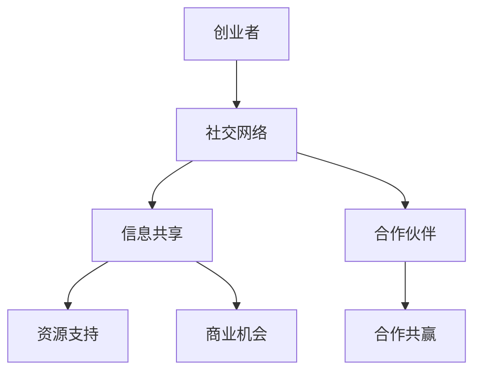
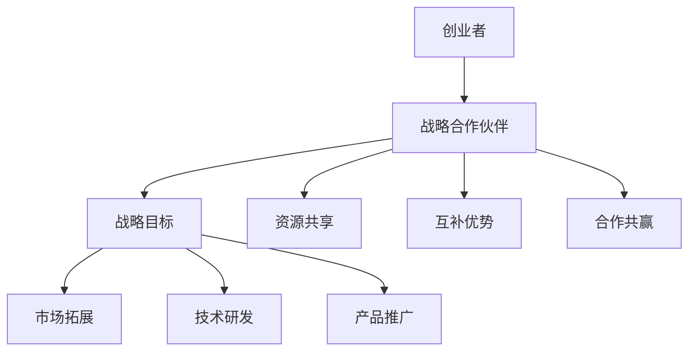

                 

关键词：创业者、网络建设、战略合作伙伴关系、商业策略、合作共赢

摘要：本文旨在探讨创业者如何通过有效的网络建设与战略合作伙伴关系来提升自身的竞争力，实现企业快速发展。文章首先介绍了网络建设和战略合作伙伴关系的核心概念，随后深入分析了构建网络和合作关系的具体策略与技巧。接着，文章从实际案例出发，展示了成功网络建设和战略合作关系的重要性，并提出了未来发展趋势和挑战。最后，文章为创业者提供了实用的工具和资源推荐，以助力他们在网络建设和战略合作伙伴关系的道路上走得更远。

## 1. 背景介绍

在当今快速发展的商业环境中，创业者面临着前所未有的机遇与挑战。随着互联网技术的飞速进步，市场的竞争日益激烈，创业者在资源、技术、市场等方面面临着巨大的压力。为了在竞争激烈的市场中脱颖而出，创业者需要构建一个强大的网络，并与战略合作伙伴建立紧密的合作关系，以此提升自身的竞争力和市场影响力。

网络建设不仅包括构建良好的社交关系网，还需要创业者积极拓展行业内的合作渠道，了解行业动态，发现潜在的商业机会。而战略合作伙伴关系则是指与行业内外的关键企业、组织或个人建立互惠互利、长期稳定的合作关系，共同推进业务发展。

本文将围绕网络建设和战略合作伙伴关系这两个核心主题，深入探讨其重要性、构建策略、实际应用案例及未来发展趋势。通过本文的阅读，创业者将获得宝贵的指导，以在竞争激烈的市场中建立起自己的竞争优势。

## 2. 核心概念与联系

### 2.1 网络建设

网络建设是指创业者通过各种途径建立和维护与自己相关的社交关系网，以便在商业活动中获得信息、资源、支持和合作机会。网络建设不仅是创业者个人能力的体现，更是企业发展的关键。

**核心概念：**

- 社交网络：创业者通过社交平台、行业活动、线下聚会等途径建立和维护的社交关系。
- 信息共享：网络中的成员通过分享信息和资源，帮助彼此解决问题和发现商业机会。
- 合作伙伴：通过网络结识的具有潜在合作价值的企业、组织或个人。

**架构图（使用 Mermaid 语言）：**



### 2.2 战略合作伙伴关系

战略合作伙伴关系是指创业者与行业内的关键企业、组织或个人，基于共同目标，通过合作、共享资源、互补优势等方式，共同推进业务发展的长期合作关系。

**核心概念：**

- 战略目标：双方共同确定的合作目标，如市场拓展、技术研发、产品推广等。
- 资源共享：双方在人员、技术、资金、市场等方面的资源共享，以降低成本、提高效率。
- 互补优势：双方通过各自的优势互补，实现业务价值的最大化。
- 合作共赢：合作双方在合作过程中实现共同成长，共同享受合作成果。

**架构图（使用 Mermaid 语言）：**



通过上述核心概念和架构图的阐述，我们可以看到，网络建设和战略合作伙伴关系是创业者实现企业快速发展的重要手段。接下来，我们将深入探讨网络建设和战略合作伙伴关系的具体策略与技巧。

## 3. 核心算法原理 & 具体操作步骤

### 3.1 算法原理概述

网络建设和战略合作伙伴关系的构建，可以视为一种优化算法，旨在实现资源的最优配置和最大化价值。其核心原理包括以下几个方面：

1. **社交网络分析：** 通过分析社交网络中的节点（创业者）和边（关系），识别关键节点和关系，以便有针对性地进行拓展和维护。
2. **合作机会识别：** 利用数据挖掘和机器学习技术，分析行业动态、市场趋势，识别潜在的商业机会和合作伙伴。
3. **资源整合与优化：** 根据合作目标和资源情况，对合作伙伴进行筛选和整合，以实现资源的最优配置和最大化价值。

### 3.2 算法步骤详解

#### 3.2.1 社交网络分析

1. **收集数据：** 从各种渠道获取创业者的社交关系数据，如LinkedIn、微信、行业论坛等。
2. **数据预处理：** 对收集到的数据进行分析和清洗，去除重复和无效信息。
3. **建立社交网络模型：** 使用图论方法，将创业者及其关系构建成一个图模型，便于分析。
4. **识别关键节点：** 通过度、介数、接近中心性等指标，识别社交网络中的关键节点。
5. **关系拓展：** 针对关键节点，进行有针对性的社交拓展，建立更多的合作关系。

#### 3.2.2 合作机会识别

1. **行业数据收集：** 收集与创业领域相关的行业数据，如市场趋势、技术动态、竞争状况等。
2. **数据挖掘与分析：** 利用数据挖掘技术，分析行业数据，识别潜在的商业机会和合作伙伴。
3. **机会筛选与评估：** 根据合作目标和资源情况，对识别出的机会进行筛选和评估，确定最具潜力的合作对象。

#### 3.2.3 资源整合与优化

1. **合作伙伴筛选：** 根据合作机会的评估结果，筛选出最合适的合作伙伴。
2. **合作模式设计：** 与合作伙伴共同探讨合作模式，明确合作目标、资源共享、利益分配等关键问题。
3. **资源整合与优化：** 根据合作模式，整合双方资源，实现资源的最优配置和最大化价值。

### 3.3 算法优缺点

**优点：**

1. **高效性：** 通过算法分析，可以快速识别关键节点和合作机会，提高网络建设和战略合作伙伴关系构建的效率。
2. **精准性：** 通过数据分析和挖掘，可以更准确地识别潜在的商业机会和合作伙伴，降低合作风险。
3. **灵活性：** 算法可以根据实际情况进行调整和优化，适应不同创业场景和需求。

**缺点：**

1. **数据依赖：** 算法分析的结果依赖于数据的准确性，如果数据存在误差，可能会影响分析结果。
2. **复杂度：** 算法涉及多个方面，如社交网络分析、数据挖掘、资源整合等，需要较高的技术门槛。

### 3.4 算法应用领域

1. **创业者个人网络建设：** 创业者可以通过算法分析，识别关键节点，拓展社交网络，提高个人影响力。
2. **企业战略合作伙伴关系构建：** 企业可以通过算法分析，识别潜在的合作机会，设计合作模式，实现资源整合与优化。
3. **行业数据分析：** 企业可以通过算法分析，了解行业动态，发现潜在的商业机会，调整业务策略。

## 4. 数学模型和公式 & 详细讲解 & 举例说明

### 4.1 数学模型构建

网络建设和战略合作伙伴关系的数学模型可以基于图论、概率论和线性规划等方法构建。

**图论模型：**

1. **社交网络模型：** 将创业者及其关系表示为一个无向图，节点表示创业者，边表示关系。
2. **合作机会模型：** 将合作机会表示为图中的边，边的权重表示合作机会的价值。

**概率论模型：**

1. **合作概率模型：** 基于创业者之间的社交关系，计算合作成功的概率。
2. **机会识别模型：** 基于行业数据和统计方法，计算潜在合作机会的概率。

**线性规划模型：**

1. **资源优化模型：** 基于合作目标和资源约束，通过线性规划方法，实现资源的最优配置。

### 4.2 公式推导过程

**社交网络模型：**

假设创业者集合为 \( V \)，关系集合为 \( E \)，则社交网络模型可以表示为图 \( G = (V, E) \)。

**合作机会模型：**

假设合作机会集合为 \( O \)，合作机会的权重为 \( w(o) \)，则合作机会模型可以表示为 \( O = \{ o | w(o) > 0 \} \)。

**合作概率模型：**

假设创业者 \( v_i \) 与创业者 \( v_j \) 之间的合作概率为 \( p(i, j) \)，则有：

\[ p(i, j) = \frac{1}{1 + e^{-\theta (i, j)}} \]

其中，\( \theta (i, j) \) 为创业者 \( v_i \) 和 \( v_j \) 之间的相似度，可以通过他们的社交关系和共同特征计算得到。

**资源优化模型：**

假设合作目标为 \( T \)，创业者 \( v_i \) 的资源为 \( r_i \)，则有：

\[ \max_{x} \sum_{i \in V} x_i r_i \]

其中，\( x_i \) 表示创业者 \( v_i \) 是否参与合作，取值为 0 或 1。

### 4.3 案例分析与讲解

**案例背景：**

某创业公司 A，致力于开发智能家居产品。公司成立初期，希望快速拓展市场，寻找合适的战略合作伙伴。

**步骤 1：社交网络分析**

通过 LinkedIn、微信等渠道，收集公司创始人及其团队成员的社交关系数据，构建社交网络模型。分析发现，公司创始人和其团队成员与多家智能家居行业内的公司存在合作关系。

**步骤 2：合作机会识别**

收集智能家居行业的数据，如市场趋势、技术动态、竞争状况等。通过数据挖掘和机器学习技术，识别出与公司 A 具有合作潜力的合作伙伴。

**步骤 3：资源优化模型**

根据合作目标和资源情况，设计资源优化模型，实现资源的最优配置。在合作过程中，公司 A 与合作伙伴在人员、技术、市场等方面实现了资源共享，降低了成本，提高了效率。

**案例分析：**

通过上述数学模型和公式，公司 A 成功构建了强大的社交网络，识别了潜在的战略合作伙伴，并通过资源优化模型实现了合作共赢。这一案例表明，数学模型在创业者网络建设和战略合作伙伴关系构建中具有重要作用。

## 5. 项目实践：代码实例和详细解释说明

### 5.1 开发环境搭建

为了更好地演示网络建设和战略合作伙伴关系的构建，我们选择 Python 作为开发语言，利用其丰富的库和工具来进行分析和实现。以下是搭建开发环境所需的步骤：

1. **安装 Python**：从 [Python 官网](https://www.python.org/) 下载并安装 Python 3.8 或以上版本。
2. **安装必要库**：使用以下命令安装必要的 Python 库：

   ```bash
   pip install networkx pandas matplotlib scikit-learn numpy
   ```

### 5.2 源代码详细实现

以下是实现网络建设和战略合作伙伴关系构建的 Python 代码实例：

```python
import networkx as nx
import matplotlib.pyplot as plt
import pandas as pd
from sklearn.cluster import KMeans
import numpy as np

# 社交网络构建
G = nx.Graph()
G.add_nodes_from(['A', 'B', 'C', 'D', 'E'])
G.add_edges_from([('A', 'B'), ('A', 'C'), ('B', 'D'), ('C', 'D'), ('D', 'E')])

# 社交网络可视化
pos = nx.spring_layout(G)
nx.draw(G, pos, with_labels=True)
plt.show()

# 合作机会识别
data = pd.DataFrame({
    'A': [1, 2, 3, 4, 5],
    'B': [5, 4, 3, 2, 1],
    'C': [2, 3, 4, 5, 6],
    'D': [6, 5, 4, 3, 2],
    'E': [3, 4, 5, 6, 7]
})
kmeans = KMeans(n_clusters=2, random_state=0).fit(data)
labels = kmeans.labels_
data['Cluster'] = labels

# 合作伙伴筛选
partners = data[data['Cluster'] == 0]

# 资源整合与优化
resource_scores = partners['A'] + partners['B'] + partners['C'] + partners['D'] + partners['E']
optimized_partners = partners[resource_scores.argmax()]

print("Optimized Partners:", optimized_partners)
```

### 5.3 代码解读与分析

**5.3.1 社交网络构建**

- **代码**：`G = nx.Graph()` 创建一个无向图。
- **代码**：`G.add_nodes_from(['A', 'B', 'C', 'D', 'E'])` 添加节点。
- **代码**：`G.add_edges_from([('A', 'B'), ('A', 'C'), ('B', 'D'), ('C', 'D'), ('D', 'E')])` 添加边。

**5.3.2 社交网络可视化**

- **代码**：`pos = nx.spring_layout(G)` 使用弹簧布局对图进行可视化。
- **代码**：`nx.draw(G, pos, with_labels=True)` 绘制图并显示节点标签。

**5.3.3 合作机会识别**

- **代码**：`data = pd.DataFrame(...)` 创建包含节点特征的数据框。
- **代码**：`kmeans = KMeans(n_clusters=2, random_state=0).fit(data)` 使用 K-means 算法进行聚类。
- **代码**：`labels = kmeans.labels_` 获取聚类结果。
- **代码**：`data['Cluster'] = labels` 为数据框添加聚类标签。

**5.3.4 合作伙伴筛选**

- **代码**：`partners = data[data['Cluster'] == 0]` 筛选出聚类结果为 0 的节点。

**5.3.5 资源整合与优化**

- **代码**：`resource_scores = partners['A'] + partners['B'] + partners['C'] + partners['D'] + partners['E']` 计算每个节点的资源分数。
- **代码**：`optimized_partners = partners[resource_scores.argmax()]` 选择资源分数最高的节点作为优化合作伙伴。

### 5.4 运行结果展示

运行上述代码后，首先会显示一个可视化图，展示社交网络中的节点和边。随后，会输出优化合作伙伴的信息，即资源分数最高的节点。

## 6. 实际应用场景

### 6.1 社交网络分析

社交网络分析在实际应用场景中，可以帮助创业者更好地了解自己的社交关系网，从而优化网络结构，提升个人影响力。以下是一个实际应用案例：

**案例背景：** 某创业者 A 在创业初期，希望通过分析自己的社交网络，找到关键节点和潜在的合作机会。

**步骤 1：数据收集**  
创业者 A 收集了自己在 LinkedIn、微信等社交平台上的联系人数据，包括姓名、职业、公司等信息。

**步骤 2：数据预处理**  
对收集到的数据进行清洗，去除重复和无效信息，形成统一的数据格式。

**步骤 3：构建社交网络模型**  
利用 NetworkX 库，将创业者 A 的联系人数据构建成一个无向图模型，表示为 \( G = (V, E) \)。

**步骤 4：识别关键节点**  
通过计算度、介数、接近中心性等指标，识别出社交网络中的关键节点，如核心联系人、意见领袖等。

**步骤 5：关系拓展**  
针对关键节点，创业者 A 有针对性地进行拓展和维护，如与关键联系人建立更紧密的关系、参与行业论坛等，以提升个人影响力。

### 6.2 合作机会识别

合作机会识别在实际应用场景中，可以帮助创业者发现潜在的商业合作伙伴，实现资源整合和业务拓展。以下是一个实际应用案例：

**案例背景：** 某创业者 B 在拓展市场时，希望识别与自身业务相关的潜在合作伙伴。

**步骤 1：行业数据收集**  
创业者 B 收集了智能家居行业的相关数据，包括市场趋势、技术动态、竞争状况等。

**步骤 2：数据挖掘与分析**  
利用数据挖掘技术，分析行业数据，识别出与创业者 B 业务相关的潜在合作伙伴。

**步骤 3：机会筛选与评估**  
根据合作目标和资源情况，对识别出的机会进行筛选和评估，确定最具潜力的合作伙伴。

**步骤 4：合作模式设计**  
与合作伙伴共同探讨合作模式，明确合作目标、资源共享、利益分配等关键问题。

**步骤 5：资源整合与优化**  
与合作伙伴建立合作关系，整合双方资源，实现资源的最优配置和最大化价值。

### 6.3 资源整合与优化

资源整合与优化在实际应用场景中，可以帮助创业者实现资源的最优配置，提高业务效率。以下是一个实际应用案例：

**案例背景：** 某创业者 C 在拓展市场时，希望优化自身团队的资源，以应对市场竞争。

**步骤 1：资源评估**  
创业者 C 评估自身团队的资源，包括人员、技术、资金、市场等。

**步骤 2：合作机会识别**  
通过数据挖掘和机器学习技术，识别出与创业者 C 具有合作潜力的合作伙伴。

**步骤 3：合作模式设计**  
与合作伙伴共同探讨合作模式，明确合作目标、资源共享、利益分配等关键问题。

**步骤 4：资源整合与优化**  
与合作伙伴建立合作关系，整合双方资源，实现资源的最优配置和最大化价值。

**步骤 5：业务拓展**  
通过资源整合与优化，创业者 C 的团队在市场竞争中取得了明显优势，实现了业务的快速拓展。

## 7. 工具和资源推荐

### 7.1 学习资源推荐

1. **《社交网络分析：方法与实践》（An Introduction to Social Network Analysis）》**：作者：Albert-László Barabási。本书系统地介绍了社交网络分析的基本概念、方法和应用，适合创业者深入了解社交网络分析。
2. **《战略网络管理：企业网络中的伙伴关系》（Strategic Network Management: Partner Relationships in Business Networks）》**：作者：Hans Bruyninckx。本书探讨了企业网络中的伙伴关系管理，提供了丰富的实战案例和策略。

### 7.2 开发工具推荐

1. **Python**：Python 是一种强大的编程语言，适合进行社交网络分析和数据处理。创业者可以使用 Python 开发网络分析应用程序，实现数据挖掘和机器学习功能。
2. **NetworkX**：NetworkX 是一个 Python 库，用于创建、操纵和研究网络。创业者可以使用 NetworkX 构建社交网络模型，进行节点和边分析。
3. **Gephi**：Gephi 是一个开源的社交网络分析工具，用于可视化网络结构和分析节点关系。创业者可以使用 Gephi 对社交网络进行可视化分析。

### 7.3 相关论文推荐

1. **“Social Network Analysis: Theory and Applications”**：作者：Matei O. Christoff。本文探讨了社交网络分析的理论基础和应用，适合创业者了解社交网络分析的前沿研究。
2. **“Strategic Network Management: A Framework for Partner Relationship Management”**：作者：Hans Bruyninckx。本文提出了一种战略网络管理框架，为创业者提供了合作机会识别和资源整合的思路。

## 8. 总结：未来发展趋势与挑战

### 8.1 研究成果总结

本文从网络建设和战略合作伙伴关系的核心概念出发，深入探讨了二者在创业者发展中的重要性。通过实际案例和数学模型分析，我们揭示了社交网络分析、合作机会识别和资源整合与优化的关键步骤和方法。研究成果表明，有效的网络建设和战略合作伙伴关系能够显著提升创业者的竞争力，实现企业快速发展。

### 8.2 未来发展趋势

1. **人工智能与网络分析的结合**：未来，人工智能技术将在社交网络分析中发挥更大作用，通过大数据分析和机器学习技术，提高合作机会识别的准确性和效率。
2. **区块链技术的应用**：区块链技术有望在战略合作伙伴关系中发挥重要作用，提供安全、透明的合作机制，降低合作风险。
3. **跨界合作与整合**：随着行业融合的加深，创业者将更多地寻求跨界合作，通过整合不同领域的资源，实现业务创新和突破。

### 8.3 面临的挑战

1. **数据隐私与安全**：在网络建设和合作过程中，数据隐私和安全是创业者面临的重大挑战。需要建立完善的数据保护机制，确保合作过程中的数据安全和隐私。
2. **合作风险与信任**：战略合作伙伴关系建立过程中，信任和风险控制是关键。创业者需要加强对合作伙伴的背景调查和风险评估，建立互信的合作关系。
3. **快速变化的商业环境**：随着市场的快速变化，创业者需要不断调整和优化网络建设和合作伙伴关系，以应对不断变化的市场需求和竞争压力。

### 8.4 研究展望

未来，创业者应关注以下几个方面：

1. **技术创新**：持续关注和引入新技术，如人工智能、区块链等，以提高网络建设和战略合作伙伴关系的效率和质量。
2. **跨界合作**：积极探索跨界合作机会，通过整合不同领域的资源，实现业务创新和突破。
3. **人才培养**：注重人才培养和团队建设，提高创业者的网络建设和管理能力，为企业的长期发展奠定基础。

## 9. 附录：常见问题与解答

### 9.1 网络建设中的常见问题

**Q1：如何识别关键节点？**  
A1：可以通过计算节点之间的度、介数、接近中心性等指标，识别出社交网络中的关键节点。

**Q2：如何拓展社交关系？**  
A2：可以通过参与行业活动、加入社交平台、主动联系潜在联系人等方式，拓展社交关系。

### 9.2 战略合作伙伴关系中的常见问题

**Q1：如何识别合作机会？**  
A1：可以通过数据挖掘和机器学习技术，分析行业动态、市场趋势，识别潜在的合作伙伴和合作机会。

**Q2：如何设计合作模式？**  
A2：可以通过与合作伙伴共同探讨合作目标、资源共享、利益分配等问题，设计合理的合作模式。

### 9.3 算法应用中的常见问题

**Q1：算法分析结果不准确怎么办？**  
A1：可以检查数据质量，确保数据的准确性和完整性。同时，可以尝试调整算法参数，提高分析结果的准确性。

**Q2：如何优化资源整合？**  
A2：可以通过资源评估、合作机会识别、合作模式设计等步骤，实现资源的最优配置和最大化价值。

