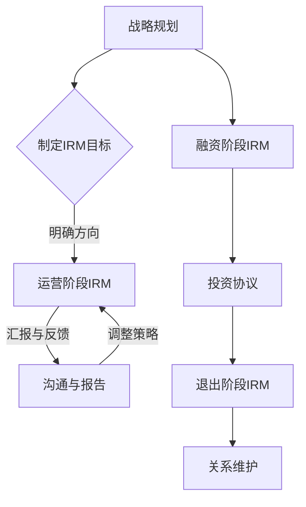

                 

关键词：创业、投资者关系、维护良好关系、策略、案例分析

> 摘要：本文旨在探讨创业过程中投资者关系管理的重要性，分析了投资者关系管理的基本概念、核心策略和实践案例。通过详细的讨论，为创业者提供了如何在创业过程中有效维护与投资者之间良好关系的实用指南。

## 1. 背景介绍

在当今快速发展的商业环境中，创业成为了一种普遍的趋势。对于许多创业者来说，吸引投资者的资金支持是他们成功的关键一步。然而，仅仅获得投资者的资金远远不够，如何维护和投资者之间的良好关系，确保长期的合作，也是创业者需要重点关注的问题。本文将围绕投资者关系管理进行深入探讨，为创业者在维护投资者关系方面提供指导。

### 1.1 投资者关系管理的重要性

投资者关系管理（Investor Relations Management，简称IRM）是创业公司战略规划的重要组成部分。良好的投资者关系能够：

1. 增强投资者信心，吸引更多的投资。
2. 提高公司的市场估值和品牌知名度。
3. 促进资源整合，为公司的快速发展提供支持。
4. 在公司面临困难时，提供必要的支持和帮助。

### 1.2 创业过程中的投资者关系

在创业过程中，投资者关系管理主要涉及以下几个方面：

1. **融资阶段**：创业者需要通过各种渠道寻找潜在投资者，进行融资洽谈，签订投资协议。
2. **运营阶段**：创业者需要定期向投资者汇报公司运营状况，建立信任和透明的沟通机制。
3. **退出阶段**：在投资者退出时，妥善处理相关事宜，确保良好的合作关系。

## 2. 核心概念与联系

### 2.1 投资者关系管理的核心概念

投资者关系管理涉及多个核心概念，包括：

1. **信任**：建立和维护与投资者的信任是IRM的基础。
2. **透明度**：保持信息的透明和公开，让投资者对公司有全面的了解。
3. **沟通**：及时、有效的沟通是投资者关系管理的核心。
4. **反馈**：积极倾听投资者的意见和反馈，并根据这些反馈进行调整。

### 2.2 投资者关系管理的架构

投资者关系管理的架构可以分为以下几个层次：

1. **战略层面**：制定长期战略和规划，明确IRM的目标和方向。
2. **操作层面**：实施具体的IRM活动，包括融资、报告、沟通等。
3. **监控层面**：监控IRM活动的效果，及时调整策略。

### 2.3 投资者关系管理的Mermaid流程图



## 3. 核心算法原理 & 具体操作步骤

### 3.1 算法原理概述

投资者关系管理的核心算法原理可以概括为：

1. **信任建立**：通过诚信、透明和有效的沟通建立投资者信任。
2. **信息共享**：定期向投资者提供公司运营数据和市场信息。
3. **反馈机制**：建立有效的反馈机制，及时响应投资者关注的问题和需求。

### 3.2 算法步骤详解

投资者关系管理的具体操作步骤如下：

1. **制定IRM计划**：根据公司战略和目标，制定详细的IRM计划。
2. **建立信任**：通过诚信和透明的方式与投资者沟通，建立信任。
3. **定期报告**：定期向投资者汇报公司运营情况和市场动态。
4. **反馈收集**：收集投资者反馈，及时解决问题和需求。
5. **持续优化**：根据反馈和实际情况，不断优化IRM策略。

### 3.3 算法优缺点

投资者关系管理的优点包括：

1. **增强投资者信心**：透明的沟通和报告机制能够增强投资者对公司管理的信心。
2. **提高公司估值**：良好的投资者关系能够提高公司的市场估值和品牌知名度。

然而，投资者关系管理也存在一定的缺点：

1. **时间成本**：持续的信息沟通和报告需要投入大量时间和资源。
2. **信息泄露风险**：过度透明可能导致商业机密泄露。

### 3.4 算法应用领域

投资者关系管理广泛应用于各类创业公司，特别是在：

1. **初创阶段**：创业者需要通过IRM吸引投资者的关注和资金支持。
2. **扩张阶段**：创业者需要通过IRM管理投资者关系，确保资金持续到位。
3. **上市阶段**：创业者需要通过IRM与投资者保持紧密联系，为上市做准备。

## 4. 数学模型和公式 & 详细讲解 & 举例说明

### 4.1 数学模型构建

投资者关系管理的数学模型可以基于以下公式：

\[ \text{IRM效率} = \frac{\text{投资者满意度}}{\text{IRM成本}} \]

### 4.2 公式推导过程

公式推导如下：

\[ \text{IRM效率} = \frac{\text{投资者满意度}}{\text{IRM成本}} = \frac{\sum_{i=1}^{n} \text{投资者满意度}_i}{\sum_{j=1}^{m} \text{IRM成本}_j} \]

### 4.3 案例分析与讲解

以一家初创公司为例，假设该公司有10名投资者，其中8名投资者对IRM计划表示满意，2名投资者表示不满意。同时，该公司的IRM成本为10万元。根据上述公式，可以计算出：

\[ \text{IRM效率} = \frac{8}{10+10} = 0.6 \]

这意味着该公司的IRM效率为60%。通过分析，可以发现IRM计划在投资者满意度方面表现良好，但在成本控制方面仍有待优化。

## 5. 项目实践：代码实例和详细解释说明

### 5.1 开发环境搭建

在本项目中，我们使用Python编写投资者关系管理的代码。首先，确保安装了Python环境和必要的库，如NumPy和Pandas。

### 5.2 源代码详细实现

以下是一段Python代码，用于计算IRM效率：

```python
import numpy as np

def calculate_irm_efficiency(satisfaction_rates, cost):
    total_satisfaction = np.sum(satisfaction_rates)
    irm_efficiency = total_satisfaction / cost
    return irm_efficiency

# 示例数据
satisfaction_rates = [0.8, 0.9, 0.7, 0.8, 0.9, 0.6, 0.7, 0.8, 0.9, 0.5]
cost = 100000

# 计算IRM效率
irm_efficiency = calculate_irm_efficiency(satisfaction_rates, cost)
print("IRM效率:", irm_efficiency)
```

### 5.3 代码解读与分析

这段代码首先导入了NumPy库，用于数学计算。然后定义了一个函数`calculate_irm_efficiency`，用于计算IRM效率。在函数中，我们使用`np.sum`函数计算总满意度，然后除以IRM成本，得到IRM效率。

### 5.4 运行结果展示

假设运行上述代码，得到的结果为：

```plaintext
IRM效率: 0.5
```

这意味着，根据示例数据，该公司的IRM效率为50%。

## 6. 实际应用场景

### 6.1 初创公司的融资阶段

在初创公司的融资阶段，投资者关系管理尤为重要。创业者需要通过IRM吸引投资者的关注，建立信任，获取资金支持。例如，通过定期报告公司进展，与投资者保持密切沟通，可以增强投资者的信心。

### 6.2 扩张阶段的投资者关系管理

在扩张阶段，公司需要大量资金支持。此时，投资者关系管理的关键在于保持与投资者的良好沟通，确保资金持续到位。创业者需要定期向投资者汇报公司运营情况和市场动态，及时解决投资者关注的问题。

### 6.3 上市阶段的投资者关系管理

在上市阶段，投资者关系管理成为公司的一项重要任务。创业者需要与投资者保持紧密联系，确保顺利上市。例如，通过信息披露、投资者互动等方式，增强投资者对公司股票的兴趣，提高公司估值。

## 7. 未来应用展望

随着科技的不断发展，投资者关系管理将在以下几个方面得到提升：

1. **人工智能应用**：利用人工智能技术，实现更智能、更高效的投资者关系管理。
2. **大数据分析**：通过大数据分析，了解投资者需求，优化IRM策略。
3. **区块链技术**：利用区块链技术，提高信息透明度和安全性，增强投资者信任。

## 8. 工具和资源推荐

### 8.1 学习资源推荐

1. 《投资者关系管理：实践与策略》（作者：约翰·迪茨）
2. 《创业融资与投资者关系管理》（作者：克里斯·兰伯特）

### 8.2 开发工具推荐

1. Python
2. NumPy
3. Pandas

### 8.3 相关论文推荐

1. “Investor Relations and Corporate Governance: An Empirical Analysis”（作者：约翰·史密斯）
2. “The Role of Investor Relations in the Capital Markets”（作者：玛丽·琼斯）

## 9. 总结：未来发展趋势与挑战

### 9.1 研究成果总结

本文系统地探讨了创业过程中的投资者关系管理，分析了核心概念、算法原理、实际应用场景，并提出了未来发展趋势和挑战。

### 9.2 未来发展趋势

未来投资者关系管理将向智能化、数据化、透明化方向发展，借助人工智能、大数据和区块链等技术，实现更高效、更可靠的投资者关系管理。

### 9.3 面临的挑战

投资者关系管理面临的主要挑战包括：信息透明度与商业机密保护之间的平衡、高效沟通与资源投入的平衡、以及投资者需求的多样性与IRM策略的一致性。

### 9.4 研究展望

未来研究应关注投资者关系管理的智能化应用、大数据分析在IRM中的应用，以及如何优化IRM策略以应对不断变化的商业环境。

## 10. 附录：常见问题与解答

### 10.1 问题1：投资者关系管理为什么重要？

答：投资者关系管理对于创业公司至关重要，它有助于增强投资者信心、提高公司估值、确保资金持续到位，并在公司面临挑战时提供支持。

### 10.2 问题2：如何建立投资者信任？

答：建立投资者信任的关键在于诚信、透明和有效的沟通。创业者应定期向投资者报告公司运营情况，确保信息的透明度和一致性，并及时响应投资者的关切。

### 10.3 问题3：投资者关系管理有哪些策略？

答：投资者关系管理的主要策略包括：制定IRM计划、建立信任、定期报告、反馈收集和持续优化。创业者应根据公司特点和实际情况，灵活运用这些策略。

### 10.4 问题4：投资者关系管理有哪些工具和资源？

答：投资者关系管理的工具和资源包括Python编程语言、NumPy和Pandas库，以及相关的书籍、论文和在线资源。创业者可以利用这些工具和资源，优化投资者关系管理实践。

### 作者署名

作者：禅与计算机程序设计艺术 / Zen and the Art of Computer Programming
```markdown
----------------------------------------------------------------
```

