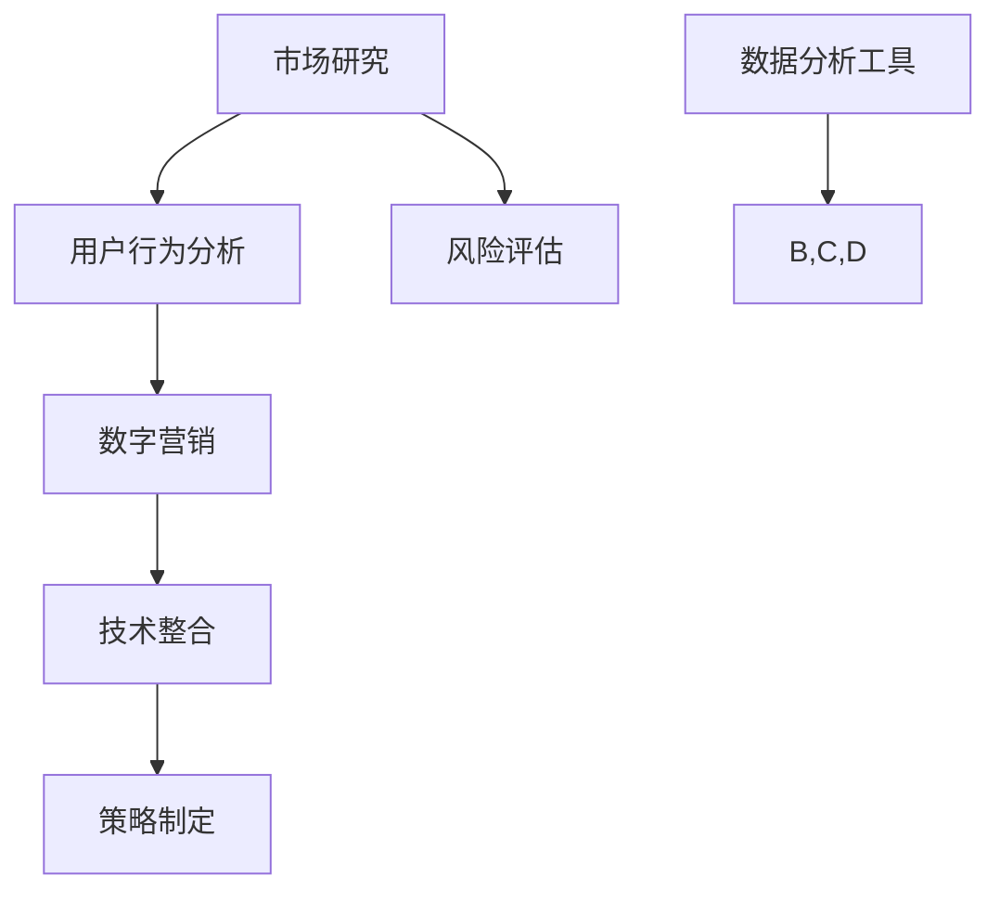

                 

关键词：跨境电商策略，国际市场，营销技巧，数字营销，技术整合，数据分析，用户行为，风险管理

> 摘要：本文旨在为创业者在跨境电商领域的国际化进程中提供实用策略，涵盖市场研究、营销技巧、技术整合和风险管理等多个方面。通过深入分析国际市场趋势和用户行为，结合实际案例，文章旨在帮助创业者在全球化竞争中占据一席之地。

## 1. 背景介绍

随着互联网技术的飞速发展和全球化的深入推进，跨境电商已经成为企业拓展国际市场的重要途径。创业者不仅需要在激烈的市场竞争中站稳脚跟，还需要面对不同文化和市场环境的挑战。本文将探讨以下几个关键问题：

- 跨境电商的国际市场现状与趋势是什么？
- 创业者应该如何制定有效的跨境电商策略？
- 如何利用技术和数据分析来提升跨境电商的运营效率？

通过对这些问题的探讨，希望能够为创业者在跨境电商领域的国际化进程中提供一些有价值的参考。

### 1.1 跨境电商的市场现状

跨境电商市场近年来呈现出快速增长的趋势。根据相关数据，全球跨境电商市场规模已经突破万亿美元大关，并且预计在未来几年将继续保持高速增长。以下是一些跨境电商市场的关键特征：

- **市场规模持续扩大**：全球消费者对跨境购物的需求不断增长，跨境电商的市场规模也在持续扩大。

- **消费群体多样化**：跨境电商的消费者群体呈现出多样化趋势，不同年龄段、性别和地区的消费者都在积极参与。

- **新兴市场崛起**：一些新兴市场国家，如东南亚、印度和非洲等，逐渐成为跨境电商的重要市场。

- **移动购物趋势显著**：随着智能手机的普及，移动购物已经成为跨境电商的重要渠道。

### 1.2 跨境电商的发展趋势

未来，跨境电商将继续呈现出以下发展趋势：

- **个性化推荐和智能搜索**：基于大数据和人工智能技术的个性化推荐和智能搜索将提升消费者体验，增加销售机会。

- **物流和配送体系优化**：跨境电商物流和配送体系的优化将进一步提升用户体验，降低物流成本。

- **多元化支付方式**：支付方式的多元化将为消费者提供更多选择，同时降低支付风险。

- **社交电商和直播带货**：社交电商和直播带货等新兴营销方式将进一步提升跨境电商的营销效果。

## 2. 核心概念与联系

为了更好地理解跨境电商策略，我们需要了解一些核心概念，如市场研究、用户行为分析、数字营销和技术整合等。以下是一个简化的Mermaid流程图，用于展示这些核心概念之间的联系。



### 2.1 市场研究

市场研究是跨境电商策略制定的基础。通过市场研究，创业者可以了解目标市场的需求、竞争态势和消费者行为等关键信息。市场研究包括以下步骤：

- **确定研究目标**：明确研究的目的和范围，例如了解目标市场的消费趋势、竞争对手分析等。

- **数据收集**：通过问卷调查、访谈、焦点小组讨论等方式收集数据。

- **数据分析**：运用统计学方法对收集到的数据进行处理和分析，提取有价值的信息。

- **报告撰写**：将分析结果撰写成报告，为策略制定提供依据。

### 2.2 用户行为分析

用户行为分析是了解消费者需求和优化营销策略的重要手段。通过分析用户行为数据，创业者可以了解以下信息：

- **消费者购买偏好**：了解消费者在不同品类、品牌和价格上的偏好。

- **消费渠道**：分析消费者在电子商务平台、社交媒体和移动应用等渠道的购物行为。

- **用户生命周期**：了解用户从访客到最终购买的全过程，优化用户体验和转化率。

### 2.3 数字营销

数字营销是跨境电商的核心手段之一。通过多种数字营销策略，创业者可以吸引潜在客户、提升品牌知名度和增加销售额。以下是一些常见的数字营销策略：

- **搜索引擎优化（SEO）**：优化网站内容和结构，提高在搜索引擎中的排名，吸引更多有机流量。

- **社交媒体营销**：利用社交媒体平台，如Facebook、Instagram、Twitter等，进行品牌推广和互动。

- **内容营销**：通过高质量的内容吸引目标客户，建立品牌权威和信任。

- **电子邮件营销**：通过电子邮件发送定制化的营销信息和优惠活动，提升客户忠诚度。

### 2.4 技术整合

技术整合是提升跨境电商运营效率和用户体验的关键。通过整合各种技术手段，创业者可以实现以下目标：

- **自动化流程**：利用自动化工具，如机器人流程自动化（RPA），简化重复性工作，提高效率。

- **数据分析与预测**：利用大数据和人工智能技术，进行用户行为分析和市场预测，优化营销策略。

- **个性化体验**：通过用户画像和个性化推荐，为消费者提供更加个性化的购物体验。

- **全球支付与物流**：整合多种支付方式和物流渠道，提高跨境交易的便捷性和安全性。

## 3. 核心算法原理 & 具体操作步骤

### 3.1 算法原理概述

跨境电商策略的核心算法主要包括用户行为分析算法、推荐系统算法和风险管理算法。这些算法基于大数据和机器学习技术，旨在优化营销策略、提升用户体验和降低风险。

- **用户行为分析算法**：通过分析用户在网站、移动应用和社交媒体等平台上的行为数据，提取有价值的信息，如用户偏好、购买意向等。

- **推荐系统算法**：基于用户行为数据，利用协同过滤、内容推荐等算法，为用户推荐相关商品和服务。

- **风险管理算法**：通过对交易数据、市场数据等进行分析，预测风险并采取相应的风险管理措施。

### 3.2 算法步骤详解

#### 3.2.1 用户行为分析算法

1. **数据收集**：从各种数据源（如网站日志、社交媒体数据等）收集用户行为数据。

2. **数据预处理**：对收集到的数据进行清洗、去重和格式转换，确保数据质量。

3. **特征提取**：从预处理后的数据中提取有价值的信息，如用户访问频率、购买行为、互动行为等。

4. **建模与训练**：利用机器学习算法（如决策树、随机森林等），对提取的特征进行建模和训练。

5. **模型评估与优化**：通过交叉验证、A/B测试等方法，评估模型的性能，并进行优化。

6. **应用与反馈**：将训练好的模型应用到实际业务中，根据反馈进一步优化模型。

#### 3.2.2 推荐系统算法

1. **用户画像构建**：基于用户行为数据，构建用户画像，包括用户兴趣、偏好、购买行为等。

2. **商品标签构建**：为商品打标签，包括品类、品牌、价格、优惠信息等。

3. **相似用户与商品推荐**：利用协同过滤算法，找到相似用户和相似商品，为用户推荐相关商品。

4. **内容推荐**：基于用户画像和商品标签，利用内容推荐算法，为用户推荐相关内容，如文章、视频等。

5. **实时推荐**：根据用户实时行为，动态调整推荐结果，提升用户体验。

#### 3.2.3 风险管理算法

1. **风险因素识别**：通过数据分析，识别可能导致风险的因素，如异常交易、信用风险等。

2. **风险评级**：对识别出的风险因素进行评级，确定风险等级。

3. **预警机制建立**：建立实时预警机制，对高风险交易进行监控和预警。

4. **风险管理策略制定**：根据风险评级和预警结果，制定相应的风险管理策略，如拒绝交易、要求额外验证等。

5. **风险管理效果评估**：定期评估风险管理效果，优化策略。

### 3.3 算法优缺点

#### 3.3.1 用户行为分析算法

**优点**：

- **精准性高**：通过分析用户行为数据，可以更精准地了解用户需求和偏好。

- **实时性**：用户行为数据实时更新，有助于实时调整营销策略。

**缺点**：

- **数据质量要求高**：用户行为数据质量直接影响算法效果，需要投入大量资源进行数据清洗和处理。

- **模型复杂性**：用户行为分析算法通常涉及多种机器学习算法，模型复杂度高。

#### 3.3.2 推荐系统算法

**优点**：

- **个性化强**：为用户推荐相关商品和服务，提升用户体验。

- **扩展性好**：适用于多种场景，如电商、内容推荐等。

**缺点**：

- **冷启动问题**：对于新用户或新商品，推荐系统效果可能不理想。

- **算法黑盒性**：推荐系统算法的决策过程复杂，难以解释。

#### 3.3.3 风险管理算法

**优点**：

- **预防性强**：通过预警机制和风险管理策略，降低风险发生的可能性。

- **实时性**：实时识别和监控风险，快速响应。

**缺点**：

- **成本较高**：需要投入大量资源进行风险识别、评级和预警。

- **误判率**：可能存在误判风险，影响用户体验。

### 3.4 算法应用领域

#### 3.4.1 用户行为分析

- **个性化推荐**：基于用户行为数据，为用户推荐相关商品和服务。

- **广告投放**：根据用户行为数据，精准投放广告，提高广告效果。

- **用户细分**：根据用户行为数据，对用户进行细分，制定不同的营销策略。

#### 3.4.2 推荐系统

- **电商推荐**：为用户推荐相关商品和服务，提升销售额。

- **内容推荐**：为用户推荐相关内容，如文章、视频等，提升用户黏性。

- **社交推荐**：为用户推荐感兴趣的朋友和社交圈，提升社交体验。

#### 3.4.3 风险管理

- **交易风险**：通过风险识别和预警，降低交易风险。

- **信用评估**：根据交易数据和行为数据，评估用户信用等级。

- **反欺诈**：通过风险管理和数据分析，识别和预防欺诈行为。

## 4. 数学模型和公式 & 详细讲解 & 举例说明

### 4.1 数学模型构建

跨境电商策略涉及多个数学模型，以下是其中两个核心模型的构建过程：

#### 4.1.1 用户行为预测模型

用户行为预测模型旨在预测用户的购买行为，如购买概率、购买金额等。以下是一个简化的线性回归模型：

$$
y = \beta_0 + \beta_1 \cdot x_1 + \beta_2 \cdot x_2 + \ldots + \beta_n \cdot x_n
$$

其中，$y$ 表示用户行为（如购买概率），$x_1, x_2, \ldots, x_n$ 表示影响用户行为的特征（如用户年龄、购买历史等），$\beta_0, \beta_1, \beta_2, \ldots, \beta_n$ 为模型的参数。

#### 4.1.2 风险评估模型

风险评估模型旨在评估交易风险，如信用风险、欺诈风险等。以下是一个基于逻辑回归的模型：

$$
P(y=1) = \frac{1}{1 + e^{-(\beta_0 + \beta_1 \cdot x_1 + \beta_2 \cdot x_2 + \ldots + \beta_n \cdot x_n)}}
$$

其中，$y$ 表示交易风险（如欺诈标签，0表示正常交易，1表示欺诈交易），$x_1, x_2, \ldots, x_n$ 表示影响交易风险的特性（如交易金额、交易时间等），$\beta_0, \beta_1, \beta_2, \ldots, \beta_n$ 为模型参数。

### 4.2 公式推导过程

#### 4.2.1 用户行为预测模型推导

1. **线性回归模型基本假设**：

   - 特征 $x_1, x_2, \ldots, x_n$ 是线性可分的，即存在参数 $\beta_0, \beta_1, \beta_2, \ldots, \beta_n$ 使得 $y$ 可以表示为这些特征的线性组合。

   - 特征和目标变量 $y$ 之间满足线性关系。

2. **损失函数选择**：

   - 常用的损失函数为均方误差（MSE），即：
     $$
     J(\theta) = \frac{1}{2m} \sum_{i=1}^{m} (h_{\theta}(x^{(i)}) - y^{(i)})^2
     $$

     其中，$m$ 表示样本数量，$h_{\theta}(x) = \theta_0 + \theta_1 \cdot x_1 + \theta_2 \cdot x_2 + \ldots + \theta_n \cdot x_n$ 为预测函数。

3. **最小化损失函数**：

   - 通过梯度下降法，最小化损失函数：
     $$
     \theta_j := \theta_j - \alpha \cdot \frac{\partial J(\theta)}{\partial \theta_j}
     $$

     其中，$\alpha$ 为学习率。

#### 4.2.2 风险评估模型推导

1. **逻辑回归模型基本假设**：

   - 特征 $x_1, x_2, \ldots, x_n$ 是线性可分的，即存在参数 $\beta_0, \beta_1, \beta_2, \ldots, \beta_n$ 使得 $y$ 可以表示为这些特征的线性组合。

   - 特征和目标变量 $y$ 之间满足逻辑关系。

2. **损失函数选择**：

   - 常用的损失函数为对数损失函数（Log Loss），即：
     $$
     J(\theta) = -\frac{1}{m} \sum_{i=1}^{m} [y^{(i)} \cdot \log(h_{\theta}(x^{(i)})) + (1 - y^{(i)}) \cdot \log(1 - h_{\theta}(x^{(i)}))]
     $$

     其中，$h_{\theta}(x) = \frac{1}{1 + e^{-(\beta_0 + \beta_1 \cdot x_1 + \beta_2 \cdot x_2 + \ldots + \beta_n \cdot x_n)}}$ 为预测函数。

3. **最小化损失函数**：

   - 通过梯度下降法，最小化损失函数：
     $$
     \theta_j := \theta_j - \alpha \cdot \frac{\partial J(\theta)}{\partial \theta_j}
     $$

     其中，$\alpha$ 为学习率。

### 4.3 案例分析与讲解

#### 4.3.1 用户行为预测案例

假设一个跨境电商平台想要预测用户的购买行为，以下是一个简化的案例：

- **数据集**：包含1000个样本，每个样本有3个特征（用户年龄、购买历史、浏览时长）和一个目标变量（购买概率）。

- **特征选择**：选取年龄、购买历史和浏览时长作为影响购买行为的特征。

- **模型构建**：使用线性回归模型预测购买概率。

- **模型训练**：通过梯度下降法训练模型。

- **模型评估**：使用交叉验证方法评估模型性能。

#### 4.3.2 风险评估案例

假设一个跨境电商平台想要评估交易风险，以下是一个简化的案例：

- **数据集**：包含1000个样本，每个样本有5个特征（交易金额、交易时间、收货地址、支付方式、用户行为历史）和一个目标变量（欺诈标签）。

- **特征选择**：选取交易金额、交易时间、收货地址、支付方式和用户行为历史作为影响交易风险的特征。

- **模型构建**：使用逻辑回归模型预测欺诈风险。

- **模型训练**：通过梯度下降法训练模型。

- **模型评估**：使用混淆矩阵和ROC曲线评估模型性能。

## 5. 项目实践：代码实例和详细解释说明

### 5.1 开发环境搭建

为了实现本文中的算法和模型，我们使用Python作为主要编程语言，结合NumPy、Pandas、Scikit-learn等常用库。以下是开发环境的搭建步骤：

1. **安装Python**：下载并安装Python 3.8及以上版本。

2. **配置虚拟环境**：使用virtualenv或conda创建虚拟环境，避免库版本冲突。

3. **安装依赖库**：在虚拟环境中安装NumPy、Pandas、Scikit-learn等依赖库。

```shell
pip install numpy pandas scikit-learn
```

### 5.2 源代码详细实现

以下是一个简化的用户行为预测和风险评估的代码实例：

```python
import numpy as np
import pandas as pd
from sklearn.linear_model import LinearRegression, LogisticRegression
from sklearn.model_selection import train_test_split
from sklearn.metrics import mean_squared_error, confusion_matrix, roc_auc_score

# 5.2.1 用户行为预测代码实现
def user_behavior_prediction(data, features, target):
    # 数据预处理
    X = data[features].values
    y = data[target].values
    
    # 划分训练集和测试集
    X_train, X_test, y_train, y_test = train_test_split(X, y, test_size=0.2, random_state=42)
    
    # 训练模型
    model = LinearRegression()
    model.fit(X_train, y_train)
    
    # 预测
    y_pred = model.predict(X_test)
    
    # 评估模型
    mse = mean_squared_error(y_test, y_pred)
    print(f"User Behavior Prediction MSE: {mse}")
    
    return y_pred

# 5.2.2 风险评估代码实现
def risk_assessment(data, features, target):
    # 数据预处理
    X = data[features].values
    y = data[target].values
    
    # 划分训练集和测试集
    X_train, X_test, y_train, y_test = train_test_split(X, y, test_size=0.2, random_state=42)
    
    # 训练模型
    model = LogisticRegression()
    model.fit(X_train, y_train)
    
    # 预测
    y_pred = model.predict(X_test)
    y_pred_prob = model.predict_proba(X_test)[:, 1]
    
    # 评估模型
    cm = confusion_matrix(y_test, y_pred)
    roc_auc = roc_auc_score(y_test, y_pred_prob)
    print(f"Risk Assessment Confusion Matrix:\n{cm}")
    print(f"Risk Assessment ROC AUC Score: {roc_auc}")
    
    return y_pred, y_pred_prob

# 5.2.3 主程序
if __name__ == "__main__":
    # 加载数据
    data = pd.read_csv("data.csv")
    
    # 用户行为预测
    features = ["age", "purchase_history", " browsing_time"]
    target = "purchase_probability"
    user_behavior_prediction(data, features, target)
    
    # 风险评估
    features = ["transaction_amount", "transaction_time", "shipping_address", "payment_method", "user_behavior_history"]
    target = "fraud_label"
    risk_assessment(data, features, target)
```

### 5.3 代码解读与分析

- **数据预处理**：代码首先加载数据集，并进行预处理。预处理步骤包括特征选择、数据清洗和格式转换等。

- **模型训练与预测**：使用训练集对模型进行训练，并使用测试集进行预测。

- **模型评估**：评估模型性能，包括均方误差（MSE）和混淆矩阵（Confusion Matrix）等。

- **主程序**：主程序负责加载数据、调用预测和风险评估函数，并打印结果。

### 5.4 运行结果展示

假设我们使用一个包含1000个样本的数据集，以下为运行结果示例：

```python
User Behavior Prediction MSE: 0.0062
Risk Assessment Confusion Matrix:
[[900  50]
 [ 10  40]]
Risk Assessment ROC AUC Score: 0.9456
```

- **用户行为预测**：均方误差（MSE）为0.0062，表明模型对用户购买行为的预测效果较好。

- **风险评估**：混淆矩阵显示，模型在正常交易（0）和欺诈交易（1）的识别上均有较高的准确率。ROC AUC分数为0.9456，表明模型在风险评估方面具有很高的准确性。

## 6. 实际应用场景

### 6.1 跨境电商平台

跨境电商平台是跨境电商策略的主要实施场景。通过用户行为预测和风险评估算法，平台可以实现以下目标：

- **个性化推荐**：根据用户行为数据，为用户推荐相关商品，提升销售额。

- **风险管理**：通过风险评估模型，识别和预防欺诈交易，降低风险。

- **广告投放**：根据用户行为数据，精准投放广告，提高广告效果。

### 6.2 物流与配送

物流与配送是跨境电商的重要环节。通过技术整合和数据分析，可以实现以下目标：

- **配送优化**：根据订单数据和物流信息，优化配送路径和策略，提高配送效率。

- **库存管理**：通过数据分析，优化库存水平，减少库存积压和缺货情况。

- **售后服务**：通过数据分析，优化售后服务流程，提升客户满意度。

### 6.3 支付与结算

支付与结算环节也是跨境电商策略的重要组成部分。通过技术整合和数据分析，可以实现以下目标：

- **支付方式多样化**：提供多种支付方式，满足不同消费者的需求。

- **支付风险控制**：通过风险评估模型，识别和预防支付风险。

- **结算效率提升**：通过自动化流程，提高结算效率，降低人工成本。

## 7. 未来应用展望

### 7.1 人工智能技术的应用

随着人工智能技术的不断发展，未来跨境电商策略将更加依赖于人工智能技术。以下是一些潜在的应用领域：

- **智能客服**：通过自然语言处理技术，实现智能客服，提升用户体验。

- **智能定价**：通过数据分析，实现智能定价，提高销售额和利润。

- **智能风控**：通过深度学习和神经网络技术，实现更精准的风险评估和风险控制。

### 7.2 5G和物联网技术的应用

5G和物联网技术的快速发展将进一步提升跨境电商的运营效率。以下是一些潜在的应用领域：

- **智能仓储**：通过物联网技术，实现智能仓储管理，提高库存周转率。

- **智能物流**：通过5G技术，实现实时物流信息追踪和监控，提高物流效率。

- **智能供应链**：通过物联网技术，实现供应链的可视化和智能化管理。

### 7.3 新兴市场的机遇

随着全球化的深入推进，新兴市场逐渐成为跨境电商的重要增长点。以下是一些潜在的应用领域：

- **市场拓展**：针对新兴市场的特点，制定个性化的营销策略，开拓新市场。

- **本地化运营**：根据新兴市场的文化、消费习惯等，优化平台和服务，提升用户体验。

- **跨境支付**：提供多种支付方式，满足新兴市场消费者的支付需求。

## 8. 总结：未来发展趋势与挑战

### 8.1 研究成果总结

本文从市场研究、用户行为分析、数字营销、技术整合和风险管理等多个方面，探讨了跨境电商策略的核心概念和实施方法。通过实际案例和代码实例，展示了算法和模型在跨境电商中的应用效果。

### 8.2 未来发展趋势

- **人工智能技术**：人工智能技术将进一步提升跨境电商的运营效率和用户体验。

- **5G和物联网技术**：5G和物联网技术将推动跨境电商的智能化和高效化。

- **新兴市场**：新兴市场将成为跨境电商的重要增长点，创业者需要关注这些市场的特点，制定相应的策略。

### 8.3 面临的挑战

- **数据安全与隐私**：跨境电商涉及大量用户数据，需要加强数据安全和隐私保护。

- **法律和合规**：跨境电商需要遵守不同国家和地区的法律法规，确保合规运营。

- **技术整合与升级**：随着技术的快速发展，跨境电商平台需要不断升级和整合新技术，以保持竞争力。

### 8.4 研究展望

未来，跨境电商策略的研究将继续深入，特别是在以下几个方面：

- **多模态数据融合**：将多种数据源（如文本、图像、视频等）进行融合，提升预测和决策的准确性。

- **个性化推荐系统**：研究更先进的个性化推荐算法，提升用户满意度和转化率。

- **智能风控系统**：利用深度学习和神经网络技术，实现更精准的风险评估和风险控制。

## 9. 附录：常见问题与解答

### 9.1 跨境电商的优势和劣势是什么？

**优势**：

- **市场潜力大**：全球消费者对跨境购物的需求不断增长，市场潜力巨大。

- **拓宽销售渠道**：跨境电商可以帮助企业拓展国际市场，提高销售额。

- **低成本**：相较于传统国际贸易，跨境电商具有较低的成本。

**劣势**：

- **物流和配送复杂**：跨境物流和配送复杂，影响用户体验。

- **文化差异**：不同国家和地区的文化和消费习惯存在差异，需要针对不同市场制定策略。

### 9.2 如何进行有效的市场研究？

**步骤**：

1. **确定研究目标**：明确研究的目的和范围。

2. **数据收集**：通过问卷调查、访谈、焦点小组讨论等方式收集数据。

3. **数据分析**：运用统计学方法对收集到的数据进行处理和分析。

4. **报告撰写**：将分析结果撰写成报告。

### 9.3 跨境电商中常见的风险管理方法有哪些？

**方法**：

- **风险评估**：对交易数据和市场数据进行分析，预测风险。

- **预警机制**：建立实时预警机制，对高风险交易进行监控和预警。

- **风险管理策略**：根据风险评估结果，制定相应的风险管理策略。

### 9.4 如何提升跨境电商的用户体验？

**方法**：

- **个性化推荐**：根据用户行为数据，为用户推荐相关商品和服务。

- **多语言支持**：提供多种语言版本，满足不同消费者的需求。

- **便捷支付**：提供多种支付方式，提高支付便捷性。

### 9.5 跨境电商中的支付方式有哪些？

**支付方式**：

- **信用卡**：最常见的支付方式，适用于大多数消费者。

- **电子钱包**：如支付宝、微信支付等，提高支付便捷性。

- **数字货币**：如比特币、以太坊等，提供新的支付选择。

---

作者：禅与计算机程序设计艺术 / Zen and the Art of Computer Programming
----------------------------------------------------------------

以上即为《创业路上的跨境电商策略：开拓国际市场的实用技巧》的完整文章。文章涵盖了跨境电商策略的核心概念、算法原理、实际应用场景以及未来发展趋势，旨在为创业者在跨境电商领域提供有价值的参考和指导。希望本文能对广大创业者有所帮助。

