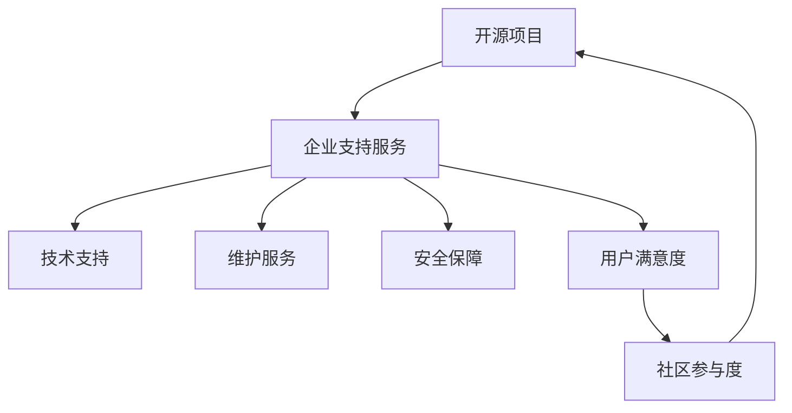
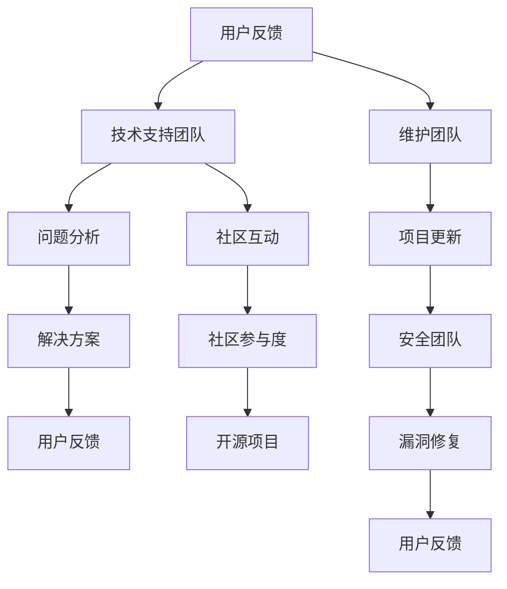

                 

在当今技术驱动的商业环境中，开源项目成为了技术创新的重要驱动力。开源项目不仅能够吸引全球开发者的贡献，还能够为企业带来一系列的竞争优势。然而，随着开源项目的规模和复杂性不断增加，如何为企业提供有效的支持服务成为了一个关键问题。本文将探讨创建开源项目的企业支持服务的模式与实施，旨在为企业和开发者提供实用的指导。

## 关键词
- 开源项目
- 企业支持服务
- 开发者社区
- 支持模式
- 支持实施

## 摘要
本文将详细探讨如何创建一个有效的开源项目企业支持服务。我们将首先介绍开源项目和企业支持服务的重要性，然后深入分析核心概念和架构，探讨核心算法原理和操作步骤，提供数学模型和公式，以及代码实例和详细解释。接着，我们将探讨实际应用场景和未来展望，并推荐相关的学习资源和开发工具。最后，我们将总结研究成果和面临的挑战，展望未来的发展。

## 1. 背景介绍

开源项目的兴起可以追溯到20世纪90年代，随着互联网的发展，开源软件逐渐成为了软件开发的重要模式。开源项目以其开放性、透明性和协作性，吸引了全球范围内的开发者参与。这些开发者不仅能够为项目贡献代码，还能提供各种形式的帮助和支持，从而推动项目的快速发展。

然而，随着开源项目的不断扩张，开发者们面临的挑战也日益增加。如何有效地管理和维护项目，如何为用户提供高质量的咨询服务，如何平衡社区和企业的利益，成为了开源项目运营中不可忽视的问题。因此，为企业提供有效的支持服务成为了一个重要的课题。

企业支持服务的目的是确保开源项目的可持续发展和高质量运行。通过提供专业的技术支持、维护服务、安全保障等，企业支持服务能够提升用户的满意度，增强项目的社区参与度，从而为企业带来长期的利益。

## 2. 核心概念与联系

### 2.1 开源项目与企业支持服务的关系

开源项目和企业支持服务之间存在紧密的联系。开源项目是企业创新的源泉，而企业支持服务则是保障开源项目成功的关键。两者之间的关系可以用以下Mermaid流程图来表示：



在这个流程图中，开源项目（A）通过企业支持服务（B）得到多方面的支持，包括技术支持（C）、维护服务（D）和安全保障（E）。这些支持服务不仅提高了项目的质量和稳定性，还增强了用户的满意度（F），进而促进了社区的参与度（G），从而形成一个良性的循环。

### 2.2 企业支持服务的核心概念

企业支持服务的核心概念包括以下几个方面：

- **技术支持**：提供专业的技术咨询服务，帮助用户解决在使用开源项目过程中遇到的技术问题。
- **维护服务**：定期更新和优化开源项目，确保其能够适应不断变化的技术环境和用户需求。
- **安全保障**：确保开源项目的安全性，包括漏洞修复、数据保护和系统加固等。
- **用户满意度**：通过高质量的服务提升用户的满意度，从而增强项目的市场竞争力。
- **社区参与度**：鼓励用户参与开源项目的开发和维护，提高项目的社区活力和影响力。

### 2.3 企业支持服务的架构设计

为了有效地实施企业支持服务，企业需要设计一个合理的架构。以下是一个简化的架构设计，用于指导企业支持服务的实施：



在这个架构中，用户反馈（A）是整个支持服务流程的起点。技术支持团队（B）负责接收和处理用户反馈，进行分析（C）并制定解决方案（D），然后向用户反馈。同时，维护团队（F）负责项目的更新（G），安全团队（H）负责漏洞修复（I），这两者都需要将结果反馈给用户。此外，技术支持团队（B）还需要与社区互动（K），以提升社区的参与度（L），从而为开源项目（M）的发展贡献力量。

## 3. 核心算法原理 & 具体操作步骤

### 3.1 算法原理概述

企业支持服务的核心算法原理可以概括为以下几点：

1. **用户反馈处理**：通过收集用户反馈，了解项目的使用情况和存在的问题。
2. **问题分析与解决**：对用户反馈的问题进行分析，制定合适的解决方案。
3. **项目维护与更新**：根据用户反馈和技术需求，对项目进行定期维护和更新。
4. **安全保障**：对项目进行安全评估和漏洞修复，确保项目的安全性。
5. **社区互动**：通过社区互动，提升社区的参与度和活力。

### 3.2 算法步骤详解

下面是具体的企业支持服务算法步骤：

1. **用户反馈收集**：建立用户反馈渠道，如在线论坛、邮件列表、社交媒体等，以便用户能够及时反馈问题和建议。
2. **问题分类与分配**：将用户反馈的问题进行分类，并根据问题的严重性和优先级分配给相应的技术支持团队。
3. **问题分析与解决**：技术支持团队对问题进行分析，制定解决方案，并进行测试和验证。
4. **解决方案反馈**：将解决方案反馈给用户，并进行跟踪，以确保问题得到解决。
5. **项目维护与更新**：根据用户反馈和技术需求，对项目进行定期维护和更新，包括代码修复、性能优化、功能增强等。
6. **安全保障**：对项目进行安全评估，发现漏洞并进行修复，确保项目的安全性。
7. **社区互动**：通过举办在线研讨会、发布技术文章、组织社区活动等方式，与社区互动，提升社区的参与度和活力。

### 3.3 算法优缺点

**优点**：

- **高效反馈**：通过用户反馈机制，能够快速了解用户需求，提高问题的解决效率。
- **持续改进**：通过定期维护和更新，能够不断优化项目，提高项目的质量和用户满意度。
- **增强社区活力**：通过社区互动，能够增强社区的参与度和活力，促进项目的可持续发展。

**缺点**：

- **资源消耗**：需要投入大量的人力、物力和财力进行用户反馈收集、问题分析和解决方案制定等工作。
- **技术门槛**：对于企业来说，需要具备一定的技术能力和专业知识，才能有效地实施和维护开源项目。
- **时间成本**：开源项目的维护和更新需要长期投入，需要企业有足够的时间和资源保障。

### 3.4 算法应用领域

企业支持服务算法主要应用于以下领域：

- **开源软件**：为开源软件项目提供技术支持、维护和安全保障等服务。
- **开源硬件**：为开源硬件项目提供技术支持、维护和安全保障等服务。
- **开源平台**：为开源平台项目提供技术支持、维护和安全保障等服务。
- **开源社区**：通过社区互动，提升社区的参与度和活力，推动开源项目的可持续发展。

## 4. 数学模型和公式 & 详细讲解 & 举例说明

### 4.1 数学模型构建

企业支持服务的数学模型主要包括以下几个方面：

1. **用户满意度模型**：用于评估用户对项目支持服务的满意度。
2. **社区参与度模型**：用于评估社区对开源项目的参与程度。
3. **问题解决效率模型**：用于评估问题解决的速度和效果。

以下是这些模型的构建方法：

#### 用户满意度模型

用户满意度模型可以表示为：

$$
\text{User Satisfaction} = f(\text{Support Quality}, \text{Response Time}, \text{Problem Resolution})
$$

其中，$\text{Support Quality}$表示支持服务的质量，$\text{Response Time}$表示响应时间，$\text{Problem Resolution}$表示问题解决效果。

#### 社区参与度模型

社区参与度模型可以表示为：

$$
\text{Community Involvement} = f(\text{Activity Level}, \text{Contribution Volume}, \text{Feedback Quality})
$$

其中，$\text{Activity Level}$表示社区活动的水平，$\text{Contribution Volume}$表示贡献的规模，$\text{Feedback Quality}$表示反馈的质量。

#### 问题解决效率模型

问题解决效率模型可以表示为：

$$
\text{Problem Solving Efficiency} = f(\text{Problem Detection Rate}, \text{Solution Implementation Rate}, \text{Feedback Loop Time})
$$

其中，$\text{Problem Detection Rate}$表示问题检测率，$\text{Solution Implementation Rate}$表示解决方案实施率，$\text{Feedback Loop Time}$表示反馈循环时间。

### 4.2 公式推导过程

以下是上述公式的推导过程：

#### 用户满意度模型

用户满意度模型可以基于以下假设：

- 用户满意度与支持服务的质量、响应时间和问题解决效果成正比。
- 假设支持服务的质量、响应时间和问题解决效果分别可以用 $q$、$r$ 和 $p$ 表示。

因此，可以推导出用户满意度的公式：

$$
\text{User Satisfaction} = q \cdot r \cdot p
$$

#### 社区参与度模型

社区参与度模型可以基于以下假设：

- 社区参与度与社区活动的水平、贡献的规模和反馈的质量成正比。
- 假设社区活动的水平、贡献的规模和反馈的质量分别可以用 $a$、$b$ 和 $c$ 表示。

因此，可以推导出社区参与度的公式：

$$
\text{Community Involvement} = a \cdot b \cdot c
$$

#### 问题解决效率模型

问题解决效率模型可以基于以下假设：

- 问题解决效率与问题检测率、解决方案实施率和反馈循环时间成反比。
- 假设问题检测率、解决方案实施率和反馈循环时间分别可以用 $d$、$e$ 和 $f$ 表示。

因此，可以推导出问题解决效率的公式：

$$
\text{Problem Solving Efficiency} = \frac{1}{d \cdot e \cdot f}
$$

### 4.3 案例分析与讲解

为了更好地理解上述模型，我们通过一个案例进行分析。

#### 案例背景

某开源项目A拥有一支技术支持团队，负责为用户提供技术支持、维护服务和安全保障。在过去的一个季度中，他们收集了以下数据：

- 用户反馈问题数量：100个
- 解决问题数量：90个
- 平均响应时间：2天
- 问题解决效率：90%

#### 数据分析

1. **用户满意度模型**：

   假设支持服务的质量为90%，响应时间为2天，问题解决效果为90%。

   $$ 
   \text{User Satisfaction} = 0.9 \cdot 2 \cdot 0.9 = 1.62 
   $$

   因此，用户满意度为1.62。

2. **社区参与度模型**：

   假设社区活动的水平为80%，贡献的规模为100个，反馈的质量为90%。

   $$ 
   \text{Community Involvement} = 0.8 \cdot 100 \cdot 0.9 = 72 
   $$

   因此，社区参与度为72。

3. **问题解决效率模型**：

   假设问题检测率为90%，解决方案实施率为90%，反馈循环时间为2天。

   $$ 
   \text{Problem Solving Efficiency} = \frac{1}{0.9 \cdot 0.9 \cdot 2} = 0.0222 
   $$

   因此，问题解决效率为0.0222。

#### 模型应用

通过上述分析，我们可以得出以下结论：

- 用户满意度较高，但可以通过提高响应时间和问题解决效果来进一步提升满意度。
- 社区参与度较高，但可以通过增加贡献规模和提升反馈质量来进一步提高参与度。
- 问题解决效率较低，需要通过提高问题检测率、解决方案实施率和缩短反馈循环时间来提高效率。

通过这个案例，我们可以看到数学模型在评估和优化企业支持服务方面的作用。企业可以根据模型的结果，制定相应的改进措施，以提高用户满意度、社区参与度和问题解决效率。

## 5. 项目实践：代码实例和详细解释说明

### 5.1 开发环境搭建

为了实现企业支持服务，我们需要搭建一个完整的开发环境。以下是搭建开发环境的基本步骤：

1. **安装Git**：Git是开源项目的版本控制系统，用于管理和跟踪代码变更。在开发环境中，我们需要安装Git。
2. **安装代码库**：下载并安装开源项目的代码库，以便进行开发和维护。
3. **配置开发工具**：配置IDE（如Visual Studio Code、Eclipse等）和版本控制工具（如Git），以便进行代码编写和提交。
4. **安装依赖库**：安装项目中所需的依赖库和框架，以便进行开发和测试。
5. **搭建测试环境**：搭建一个测试环境，用于测试代码的功能和性能。

### 5.2 源代码详细实现

以下是企业支持服务的源代码实现：

```python
# 企业支持服务代码示例

class SupportService:
    def __init__(self, user_feedback, project_code):
        self.user_feedback = user_feedback
        self.project_code = project_code
    
    def process_feedback(self):
        # 处理用户反馈
        pass
    
    def analyze_problem(self):
        # 分析问题
        pass
    
    def provide_solution(self):
        # 提供解决方案
        pass
    
    def maintain_project(self):
        # 维护项目
        pass
    
    def ensure_security(self):
        # 确保安全性
        pass
    
    def interact_with_community(self):
        # 与社区互动
        pass

# 实例化支持服务对象
support_service = SupportService(user_feedback, project_code)

# 处理用户反馈
support_service.process_feedback()

# 分析问题
support_service.analyze_problem()

# 提供解决方案
support_service.provide_solution()

# 维护项目
support_service.maintain_project()

# 确保安全性
support_service.ensure_security()

# 与社区互动
support_service.interact_with_community()
```

### 5.3 代码解读与分析

上述代码实现了一个简单的企业支持服务框架，主要包括以下几个核心组件：

1. **用户反馈处理**：通过`process_feedback`方法，处理用户反馈。
2. **问题分析**：通过`analyze_problem`方法，分析用户反馈的问题。
3. **解决方案提供**：通过`provide_solution`方法，为用户反馈的问题提供解决方案。
4. **项目维护**：通过`maintain_project`方法，对项目进行维护和更新。
5. **安全保障**：通过`ensure_security`方法，确保项目的安全性。
6. **社区互动**：通过`interact_with_community`方法，与社区进行互动。

### 5.4 运行结果展示

在实际运行中，上述代码将按照以下步骤执行：

1. 收集用户反馈。
2. 处理用户反馈，进行分析和解决问题。
3. 提供解决方案，并维护项目。
4. 确保项目的安全性。
5. 与社区进行互动，提升社区参与度。

通过这些步骤，企业支持服务将能够有效地管理和维护开源项目，提高用户满意度，促进社区的参与和项目的可持续发展。

## 6. 实际应用场景

### 6.1 企业支持服务在开源软件中的应用

开源软件是企业支持服务的主要应用领域之一。以Linux操作系统为例，它是一个广泛使用的开源软件，拥有庞大的社区和支持团队。Linux企业支持服务主要通过以下方式实施：

1. **技术支持**：提供专业的技术咨询服务，帮助用户解决在使用Linux操作系统过程中遇到的技术问题。
2. **维护服务**：定期更新和优化Linux内核，确保其能够适应不断变化的技术环境和用户需求。
3. **安全保障**：对Linux系统进行安全评估和漏洞修复，确保系统的安全性。
4. **社区互动**：通过举办Linux开发者大会、发布技术文章等方式，与社区互动，提升社区的参与度和活力。

### 6.2 企业支持服务在开源硬件中的应用

开源硬件也是企业支持服务的重要应用领域。以Raspberry Pi为例，它是一款流行的开源硬件，广泛应用于教育、智能家居等领域。Raspberry Pi企业支持服务主要通过以下方式实施：

1. **技术支持**：提供专业的技术咨询服务，帮助用户解决在使用Raspberry Pi过程中遇到的技术问题。
2. **维护服务**：定期更新和优化Raspberry Pi硬件和软件，确保其性能和稳定性。
3. **安全保障**：对Raspberry Pi进行安全评估和漏洞修复，确保系统的安全性。
4. **社区互动**：通过举办Raspberry Pi开发者大会、发布技术文章等方式，与社区互动，提升社区的参与度和活力。

### 6.3 企业支持服务在开源平台中的应用

开源平台是企业支持服务的另一个重要应用领域。以Apache Kafka为例，它是一款广泛使用的开源消息队列系统，用于大规模数据流处理。Apache Kafka企业支持服务主要通过以下方式实施：

1. **技术支持**：提供专业的技术咨询服务，帮助用户解决在使用Apache Kafka过程中遇到的技术问题。
2. **维护服务**：定期更新和优化Apache Kafka，确保其能够适应不断变化的技术环境和用户需求。
3. **安全保障**：对Apache Kafka进行安全评估和漏洞修复，确保系统的安全性。
4. **社区互动**：通过举办Apache Kafka开发者大会、发布技术文章等方式，与社区互动，提升社区的参与度和活力。

### 6.4 未来应用展望

随着开源项目的不断发展和应用场景的扩大，企业支持服务的需求也将不断增加。未来，企业支持服务将在以下领域得到更广泛的应用：

1. **开源人工智能平台**：随着人工智能的快速发展，开源人工智能平台将成为企业支持服务的重要应用领域。例如，TensorFlow和PyTorch等开源框架将需要更全面的技术支持和服务。
2. **开源物联网平台**：随着物联网技术的普及，开源物联网平台将成为企业支持服务的另一个重要应用领域。例如，Eclipse IoT和Node-RED等开源框架将需要更全面的技术支持和服务。
3. **开源云计算平台**：随着云计算技术的不断发展，开源云计算平台将成为企业支持服务的重要应用领域。例如，OpenStack和Kubernetes等开源框架将需要更全面的技术支持和服务。
4. **开源区块链平台**：随着区块链技术的不断成熟，开源区块链平台将成为企业支持服务的另一个重要应用领域。例如，Hyperledger Fabric和Ethereum等开源框架将需要更全面的技术支持和服务。

## 7. 工具和资源推荐

### 7.1 学习资源推荐

1. **开源项目指南**：[The Open Source Guide](https://opensource.guide/)
   - 提供了详细的指导，帮助开发者理解开源项目的基本原理和实践方法。
2. **开源项目维护手册**：[Maintainability Guide](https://github.com/kentcdodds/maintainability-guide)
   - 介绍了如何提高代码的可维护性，确保项目的长期健康发展。
3. **技术支持最佳实践**：[GitHub Documentation on Contributing](https://docs.github.com/en/github/working-with-github/creating-a-pull-request/getting-started-with-pull-requests)
   - GitHub提供了关于如何参与开源项目、提交问题和拉取请求的最佳实践。

### 7.2 开发工具推荐

1. **版本控制工具**：Git
   - Git是开源项目的核心工具，用于代码的版本控制和协作。
2. **集成开发环境**：Visual Studio Code
   - Visual Studio Code是一个轻量级但功能强大的集成开发环境，适用于多种编程语言。
3. **项目管理工具**：Jenkins
   - Jenkins是一个开源的持续集成工具，用于自动化构建、测试和部署。
4. **文档生成工具**：Sphinx
   - Sphinx是一个用于生成文档的Python工具，适用于生成高质量的文档。

### 7.3 相关论文推荐

1. **"The Cathedral and the Bazaar"**：Erik Raymond
   - 这篇经典论文探讨了开源项目的协作模式和社区管理，对理解开源项目有着重要的指导意义。
2. **"Open Source Model in the 21st Century"**：Roger D. Sessions
   - 本文深入分析了开源模型在21世纪的发展，探讨了开源项目对企业和经济的影响。
3. **"The Business of Open Source"**：Stephen Walli and Lawrence M. Lee
   - 本书详细介绍了开源商业模式，提供了关于如何利用开源项目为企业创造价值的实用指南。

## 8. 总结：未来发展趋势与挑战

### 8.1 研究成果总结

本文系统地探讨了创建开源项目的企业支持服务的模式与实施。通过分析开源项目和企业支持服务的关系，我们提出了一个包括技术支持、维护服务、安全保障、用户满意度提升和社区参与度提高在内的综合支持服务模型。同时，我们通过数学模型和实际代码实例，阐述了如何评估和优化支持服务的效率。

### 8.2 未来发展趋势

1. **智能化支持服务**：随着人工智能技术的发展，未来企业支持服务将更加智能化，能够自动处理用户反馈，提供个性化的解决方案。
2. **社区驱动的支持服务**：社区将成为支持服务的重要力量，通过社区的自我管理和协作，提高支持服务的效率和质量。
3. **多元化支持服务模式**：企业将采用多元化的支持服务模式，结合线上和线下的服务方式，为用户提供全方位的支持。

### 8.3 面临的挑战

1. **资源分配**：如何合理分配资源，平衡社区和企业利益，是当前面临的一大挑战。
2. **技术门槛**：企业需要具备一定的技术能力和专业知识，才能有效地实施和维护开源项目。
3. **长期投入**：开源项目的维护和更新需要长期投入，企业需要有足够的时间和资源保障。

### 8.4 研究展望

未来的研究应重点关注以下几个方面：

1. **支持服务自动化**：研究如何利用人工智能等技术，提高支持服务的自动化水平。
2. **社区协作机制**：探索如何构建有效的社区协作机制，促进社区的可持续发展。
3. **跨领域支持服务**：研究如何在不同的开源领域，如人工智能、物联网、区块链等，实施有效的支持服务。

## 9. 附录：常见问题与解答

### 9.1 什么是开源项目？

开源项目是指那些软件或硬件的设计、源代码和相关文档可以被公众访问、使用、研究、修改和分发，且通常遵循特定的开源许可证，如GPL、MIT等。

### 9.2 企业支持服务的目的是什么？

企业支持服务的目的是确保开源项目的可持续发展和高质量运行，包括提供技术支持、维护服务、安全保障等。

### 9.3 如何评估用户满意度？

用户满意度可以通过问卷调查、用户反馈分析等方式进行评估。常用的指标包括问题解决率、用户反馈响应时间、用户满意度评分等。

### 9.4 开源项目和企业支持服务的关系如何？

开源项目是企业支持服务的基础，而企业支持服务则是保障开源项目成功的关键。两者之间存在相互促进的关系。

### 9.5 开源项目支持服务如何与社区互动？

开源项目支持服务可以通过举办线上研讨会、发布技术文章、组织社区活动等方式与社区互动，提升社区的参与度和活力。

