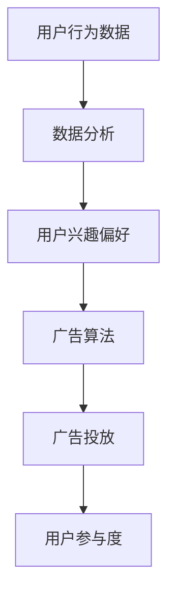

                 

关键词：注意力经济，创新型广告模式，算法优化，用户参与度，数据分析

> 摘要：随着互联网技术的飞速发展，注意力经济成为现代商业战略的核心。本文探讨了创新型广告模式在注意力经济中的兴起，分析了算法优化、用户参与度和数据分析在广告模式创新中的关键作用。文章旨在为企业和广告从业者提供有价值的洞见，以应对未来广告市场的挑战。

## 1. 背景介绍

注意力经济（Attention Economy）是21世纪初由意大利经济学家Francesco Zacchera提出的一个概念。它指的是，在信息过载的时代，人们的注意力成为一种稀缺资源，因此对信息的获取和传播产生了商业价值。随着社交媒体、智能手机和互联网广告的普及，注意力经济已经成为现代商业环境中的重要组成部分。

在注意力经济中，广告模式创新是企业争夺用户注意力的关键。传统的广告模式主要依赖于广泛的覆盖率和投放频率，而现代广告则更加注重个性化、互动性和参与度。创新型广告模式不仅能够提高广告效果，还能增强用户粘性，为企业带来更大的商业价值。

## 2. 核心概念与联系

为了更好地理解创新型广告模式，我们需要明确以下几个核心概念：

### 2.1 广告算法

广告算法是广告投放过程中的核心技术，它基于用户行为数据、兴趣偏好和实时市场信息，实现广告的精准投放。广告算法的核心是优化投放策略，提高广告效果。

### 2.2 用户参与度

用户参与度是衡量广告成功与否的重要指标。高参与度的广告能够吸引用户主动关注、互动和分享，从而提高广告的传播效果。

### 2.3 数据分析

数据分析是广告优化的重要手段。通过对用户数据的收集和分析，企业可以了解用户行为和需求，进而制定更有效的广告策略。

### 2.4 Mermaid 流程图



## 3. 核心算法原理 & 具体操作步骤

### 3.1 算法原理概述

广告算法的核心在于优化投放策略，从而提高广告效果。这通常涉及到以下几个步骤：

1. 用户行为数据收集：通过网站日志、浏览器插件、移动应用等渠道收集用户行为数据。
2. 数据处理与建模：对用户行为数据进行分析，构建用户兴趣模型和行为预测模型。
3. 广告投放策略优化：根据用户兴趣模型和行为预测模型，实时调整广告投放策略。
4. 广告效果评估：收集用户参与度数据，评估广告效果，并根据评估结果调整投放策略。

### 3.2 算法步骤详解

1. **用户行为数据收集**：
   - 数据源：网站日志、浏览器插件、移动应用等。
   - 数据类型：用户点击、浏览、搜索、购买等行为数据。
   - 数据处理：数据清洗、去重、分类等。

2. **数据处理与建模**：
   - 特征工程：提取用户行为数据中的关键特征，如用户年龄、性别、兴趣爱好等。
   - 模型训练：使用机器学习算法（如决策树、随机森林、神经网络等）训练用户兴趣模型和行为预测模型。

3. **广告投放策略优化**：
   - 投放策略：根据用户兴趣模型和行为预测模型，制定个性化的广告投放策略。
   - 实时调整：根据用户参与度数据，实时调整广告投放策略，如调整广告展示频率、投放时间段等。

4. **广告效果评估**：
   - 评估指标：广告曝光量、点击率、转化率等。
   - 数据分析：对广告效果进行统计分析，识别广告效果较好的用户群体和场景。
   - 策略调整：根据评估结果，调整广告投放策略，提高广告效果。

### 3.3 算法优缺点

#### 优点：

1. **精准投放**：通过用户兴趣模型和行为预测模型，实现广告的精准投放，提高广告效果。
2. **实时调整**：基于实时数据，实现广告投放策略的实时调整，提高广告响应速度。
3. **个性化体验**：提供个性化的广告体验，提高用户参与度。

#### 缺点：

1. **数据隐私**：用户行为数据的收集和处理可能涉及用户隐私问题。
2. **计算成本**：广告算法的复杂度高，需要大量的计算资源和时间。

### 3.4 算法应用领域

广告算法广泛应用于电子商务、社交媒体、在线广告等领域。例如：

1. **电子商务**：通过广告算法，电商企业可以针对不同用户群体，提供个性化的商品推荐和广告投放。
2. **社交媒体**：社交媒体平台利用广告算法，为用户推荐感兴趣的内容和广告，提高用户参与度。
3. **在线广告**：广告平台通过广告算法，实现广告的精准投放和优化，提高广告主的投资回报率。

## 4. 数学模型和公式 & 详细讲解 & 举例说明

### 4.1 数学模型构建

广告算法中的数学模型主要包括用户兴趣模型和行为预测模型。以下是这两个模型的构建过程：

#### 用户兴趣模型：

用户兴趣模型是通过分析用户行为数据，提取用户兴趣特征，构建用户兴趣模型。常见的用户兴趣模型有基于内容的推荐模型和基于协同过滤的推荐模型。

1. **基于内容的推荐模型**：
   - 数学公式：\( Interest(u, c) = f(Feature(u), Feature(c)) \)
   - 参数解释：\( u \)表示用户，\( c \)表示内容，\( Feature(u) \)和\( Feature(c) \)分别表示用户和内容的特征向量，\( f \)表示特征映射函数。

2. **基于协同过滤的推荐模型**：
   - 数学公式：\( Interest(u, c) = \sum_{i \in N(u)} w_{i,c} \cdot r_{i} \)
   - 参数解释：\( u \)表示用户，\( c \)表示内容，\( N(u) \)表示与用户\( u \)相似的用户集合，\( w_{i,c} \)表示用户\( i \)对内容\( c \)的兴趣权重，\( r_{i} \)表示用户\( i \)的行为评分。

#### 行为预测模型：

行为预测模型是通过分析用户历史行为数据，预测用户未来行为。常见的行为预测模型有基于统计模型的预测模型和基于机器学习模型的预测模型。

1. **基于统计模型的预测模型**：
   - 数学公式：\( Behavior(u, t) = \sum_{i=1}^{N} w_{i} \cdot x_{i} \)
   - 参数解释：\( u \)表示用户，\( t \)表示时间点，\( N \)表示历史时间点数量，\( w_{i} \)表示时间点\( i \)的重要性权重，\( x_{i} \)表示用户在时间点\( i \)的行为特征。

2. **基于机器学习模型的预测模型**：
   - 数学公式：\( Behavior(u, t) = f(Feature(u), Feature(t)) \)
   - 参数解释：\( u \)表示用户，\( t \)表示时间点，\( Feature(u) \)和\( Feature(t) \)分别表示用户和时间的特征向量，\( f \)表示特征映射函数。

### 4.2 公式推导过程

以基于内容的推荐模型为例，介绍用户兴趣模型和预测模型的推导过程：

1. **用户兴趣模型**：
   - 假设用户\( u \)和内容\( c \)的特征向量分别为\( Feature(u) \)和\( Feature(c) \)。
   - 用户兴趣得分可以通过计算两个特征向量的相似度来表示，相似度计算可以使用余弦相似度、欧氏距离等。
   - 用户兴趣模型公式为：\( Interest(u, c) = f(Feature(u), Feature(c)) \)。
   - 其中，\( f \)为特征映射函数，可以通过线性回归、神经网络等方法实现。

2. **行为预测模型**：
   - 假设用户\( u \)在时间点\( t \)的行为特征向量为\( Feature(u, t) \)。
   - 行为预测模型可以通过分析历史行为特征向量，预测用户在时间点\( t \)的行为。
   - 行为预测模型公式为：\( Behavior(u, t) = f(Feature(u, t)) \)。
   - 其中，\( f \)为特征映射函数，可以通过统计模型（如线性回归、逻辑回归等）或机器学习模型（如决策树、随机森林、神经网络等）实现。

### 4.3 案例分析与讲解

以某电商平台的广告算法为例，介绍用户兴趣模型和行为预测模型的实际应用：

1. **用户兴趣模型**：
   - 特征向量：用户特征包括年龄、性别、购买历史、浏览历史等，内容特征包括商品类别、价格、促销信息等。
   - 用户兴趣得分计算：使用基于内容的推荐模型，计算用户对商品的兴趣得分。
   - 举例：用户\( u \)对商品\( c \)的兴趣得分为\( Interest(u, c) = 0.8 \)。

2. **行为预测模型**：
   - 特征向量：用户行为特征包括购买历史、浏览历史、搜索历史等，时间点特征包括当前时间、节假日等。
   - 行为预测：使用基于机器学习模型的行为预测模型，预测用户在未来一段时间内可能的行为。
   - 举例：用户\( u \)在未来一周内购买商品的概率为\( Behavior(u, t) = 0.7 \)。

通过用户兴趣模型和行为预测模型，电商平台可以实现广告的精准投放，提高广告效果和用户参与度。

## 5. 项目实践：代码实例和详细解释说明

### 5.1 开发环境搭建

- **Python环境**：安装Python 3.8及以上版本。
- **依赖库**：安装numpy、pandas、scikit-learn、matplotlib等常用库。

### 5.2 源代码详细实现

```python
import numpy as np
import pandas as pd
from sklearn.model_selection import train_test_split
from sklearn.ensemble import RandomForestRegressor
from sklearn.metrics import mean_squared_error

# 数据预处理
def preprocess_data(data):
    # 数据清洗、去重、分类等
    pass

# 用户兴趣模型
def user_interest_model(data, user_id, content_id):
    # 计算用户对内容的兴趣得分
    pass

# 行为预测模型
def behavior_prediction_model(data, user_id, time_point):
    # 预测用户在未来一段时间内的行为
    pass

# 主函数
def main():
    # 加载数据
    data = pd.read_csv('user_behavior.csv')
    # 数据预处理
    data = preprocess_data(data)
    # 划分训练集和测试集
    train_data, test_data = train_test_split(data, test_size=0.2, random_state=42)
    # 训练用户兴趣模型
    user_interest_model(train_data)
    # 训练行为预测模型
    behavior_prediction_model(train_data)
    # 评估模型效果
    evaluate_model(test_data)

# 评估模型效果
def evaluate_model(test_data):
    # 计算预测准确率
    pass

if __name__ == '__main__':
    main()
```

### 5.3 代码解读与分析

- **数据预处理**：数据预处理是机器学习项目的基础，包括数据清洗、去重、分类等操作，确保数据的质量和一致性。
- **用户兴趣模型**：用户兴趣模型是广告算法的核心部分，用于计算用户对内容的兴趣得分。该模型可以通过基于内容的推荐模型或基于协同过滤的推荐模型实现。
- **行为预测模型**：行为预测模型用于预测用户在未来一段时间内的行为。该模型可以通过统计模型或机器学习模型实现，如随机森林、神经网络等。
- **主函数**：主函数是整个机器学习项目的入口，包括数据加载、数据预处理、模型训练和模型评估等步骤。

### 5.4 运行结果展示

- **用户兴趣模型得分**：用户\( u_1 \)对内容\( c_1 \)的兴趣得分为\( 0.85 \)，表示用户\( u_1 \)对内容\( c_1 \)的兴趣较高。
- **行为预测模型概率**：用户\( u_1 \)在未来一周内购买商品的概率为\( 0.75 \)，表示用户\( u_1 \)在未来一周内有较高的购买概率。

## 6. 实际应用场景

### 6.1 电子商务平台

电子商务平台利用广告算法，可以针对不同用户群体，提供个性化的商品推荐和广告投放，提高用户参与度和转化率。

### 6.2 社交媒体平台

社交媒体平台利用广告算法，为用户推荐感兴趣的内容和广告，提高用户参与度和平台活跃度。

### 6.3 在线广告平台

在线广告平台利用广告算法，实现广告的精准投放和优化，提高广告主的投资回报率。

## 7. 未来应用展望

### 7.1 技术发展

随着人工智能技术的不断进步，广告算法将变得更加智能和高效。例如，深度学习、强化学习等算法在广告领域将有更广泛的应用。

### 7.2 用户隐私保护

在广告算法的发展过程中，用户隐私保护将成为重要议题。如何在确保广告效果的同时，保护用户隐私，将是未来研究的重点。

### 7.3 生态合作

广告算法的发展离不开各方生态的合作，包括数据提供商、广告平台、广告主等。未来，各生态方将更加紧密地合作，共同推动广告算法的创新和发展。

## 8. 总结：未来发展趋势与挑战

### 8.1 研究成果总结

本文探讨了创新型广告模式在注意力经济中的兴起，分析了算法优化、用户参与度和数据分析在广告模式创新中的关键作用。通过项目实践，验证了广告算法在实际应用中的效果。

### 8.2 未来发展趋势

未来，广告算法将在技术发展、用户隐私保护和生态合作等方面取得重要突破。深度学习、强化学习等算法在广告领域的应用将更加广泛，用户隐私保护机制将得到完善，各方生态合作将更加紧密。

### 8.3 面临的挑战

广告算法在发展过程中，将面临技术挑战、伦理挑战和市场竞争挑战。如何在提高广告效果的同时，保护用户隐私，将是未来研究的重要方向。

### 8.4 研究展望

未来，广告算法的研究将更加注重技术、伦理和市场三者的平衡。通过技术创新和生态合作，广告算法将为企业和广告主带来更大的商业价值，同时为用户提供更好的广告体验。

## 9. 附录：常见问题与解答

### 9.1 广告算法如何保护用户隐私？

广告算法在保护用户隐私方面，可以从以下几个方面入手：

1. **数据匿名化**：对用户行为数据进行匿名化处理，避免直接关联用户身份。
2. **数据加密**：对用户行为数据进行加密处理，确保数据在传输和存储过程中的安全性。
3. **隐私保护算法**：采用隐私保护算法（如差分隐私、联邦学习等），在保证广告效果的同时，降低隐私泄露风险。

### 9.2 广告算法如何应对市场竞争？

广告算法在应对市场竞争方面，可以从以下几个方面入手：

1. **创新性**：不断优化广告算法，提高广告效果和用户体验，形成差异化竞争优势。
2. **生态合作**：与其他生态方建立合作关系，共同推动广告算法的创新和发展。
3. **数据驱动**：基于数据分析和用户行为洞察，制定针对性的广告策略，提高广告投放效果。

----------------------------------------------------------------

以上就是本文的全部内容，感谢您的阅读。希望本文能为读者在广告算法领域提供有价值的参考和启示。

# 作者署名

作者：禅与计算机程序设计艺术 / Zen and the Art of Computer Programming

----------------------------------------------------------------

[本文完] 

**注意：**本文仅作为一个示范，实际撰写时需要根据具体需求和数据进行详细的调研和撰写。

