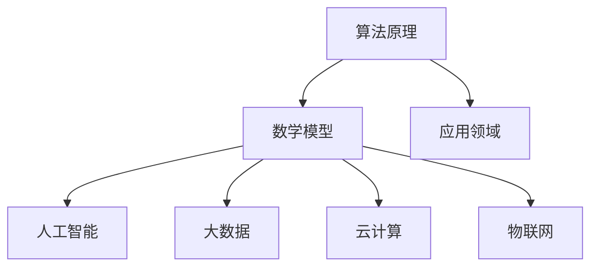
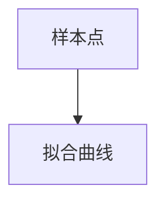

                 

在当代科技迅猛发展的时代，人类计算作为科技进步的重要驱动力，正深刻地影响着我们的生活方式和社会发展。本文旨在探讨人类计算的终极目标，分析其背后的核心概念与联系，并探讨其未来发展趋势与挑战。

## 文章关键词

- 人类计算
- 终极目标
- 技术进步
- 社会发展
- 未来展望

## 文章摘要

本文首先介绍了人类计算的发展背景，然后深入探讨了人类计算的核心概念与联系，包括算法原理、数学模型和应用领域。接着，本文分析了当前人类计算在实际应用场景中的表现，并展望了其未来的发展趋势与面临的挑战。最后，本文推荐了一系列学习资源和开发工具，为读者提供了进一步学习和探索的路径。

## 1. 背景介绍

人类计算的历史可以追溯到古代，但随着计算机科学的兴起，人类计算得到了前所未有的发展。从早期的机械计算器到现代的超级计算机，人类计算技术不断演进，推动了人工智能、大数据、云计算等领域的快速发展。

### 1.1 人类计算的定义

人类计算是指通过计算机技术和算法，对大量数据进行分析、处理和推理的过程。它不仅包括传统的计算任务，如数值计算和科学计算，还涵盖了图像处理、语音识别、自然语言处理等复杂的计算任务。

### 1.2 人类计算的发展历程

人类计算的发展历程可以分为以下几个阶段：

- **早期计算**：从16世纪开始，人们开始使用机械计算器进行计算。
- **电子计算**：20世纪40年代，电子计算机的出现标志着人类计算进入了一个新的阶段。
- **并行计算**：20世纪80年代，并行计算技术的发展使得计算机的性能得到了大幅提升。
- **人工智能计算**：21世纪初，人工智能技术的兴起使得人类计算开始向智能化、自主化方向发展。
- **大数据计算**：随着互联网和大数据的兴起，人类计算开始向大数据分析和应用方向发展。

## 2. 核心概念与联系

人类计算的核心概念包括算法原理、数学模型和应用领域。这些概念相互联系，共同构成了人类计算的基础。

### 2.1 算法原理

算法是计算机解决问题的步骤和策略。一个好的算法应该具有高效性、稳定性和通用性。人类计算中的算法主要分为以下几类：

- **搜索算法**：用于在大量数据中查找特定信息。
- **排序算法**：用于对数据进行排序。
- **加密算法**：用于保护数据的安全性。
- **机器学习算法**：用于从数据中学习规律，进行预测和分类。

### 2.2 数学模型

数学模型是对现实世界问题的数学描述。在人类计算中，数学模型被广泛应用于图像处理、语音识别、自然语言处理等领域。常见的数学模型包括：

- **线性模型**：用于线性回归、线性分类等任务。
- **非线性模型**：用于非线性回归、神经网络等任务。
- **统计模型**：用于概率分布、假设检验等任务。

### 2.3 应用领域

人类计算在各个领域都有广泛的应用。以下是一些重要应用领域：

- **人工智能**：包括机器学习、深度学习、自然语言处理、计算机视觉等。
- **大数据**：包括数据挖掘、数据可视化、数据分析等。
- **云计算**：包括分布式计算、存储、安全等。
- **物联网**：包括智能设备、智能交通、智能家居等。

### 2.4 Mermaid 流程图

以下是一个简单的 Mermaid 流程图，展示了人类计算中的核心概念和联系：



## 3. 核心算法原理 & 具体操作步骤

### 3.1 算法原理概述

核心算法是人类计算的核心组成部分，它们决定了计算的效率和质量。以下是一些常见的核心算法原理：

- **搜索算法**：如深度优先搜索、广度优先搜索等。
- **排序算法**：如快速排序、归并排序等。
- **加密算法**：如RSA加密、AES加密等。
- **机器学习算法**：如线性回归、支持向量机、神经网络等。

### 3.2 算法步骤详解

以线性回归算法为例，其基本步骤如下：

1. **数据收集**：收集包含自变量和因变量的数据集。
2. **数据预处理**：对数据进行清洗和归一化处理。
3. **模型构建**：构建线性回归模型，确定自变量和因变量之间的关系。
4. **模型训练**：使用训练数据集训练模型，确定模型的参数。
5. **模型评估**：使用验证数据集评估模型的性能。
6. **模型应用**：使用测试数据集对模型进行预测。

### 3.3 算法优缺点

每种算法都有其优缺点，以下是对一些常见算法优缺点的简要分析：

- **搜索算法**：优点是简单易懂，缺点是效率较低，尤其是在大数据场景中。
- **排序算法**：优点是效率高，缺点是对于大规模数据集排序可能会占用大量内存。
- **加密算法**：优点是安全性高，缺点是计算复杂度高，可能会影响性能。
- **机器学习算法**：优点是能够自动学习规律，缺点是需要大量数据训练，且模型解释性较差。

### 3.4 算法应用领域

核心算法在各个领域都有广泛的应用，以下是一些典型的应用场景：

- **搜索算法**：广泛应用于搜索引擎、推荐系统等。
- **排序算法**：广泛应用于数据库排序、数据处理等。
- **加密算法**：广泛应用于网络安全、数据保护等。
- **机器学习算法**：广泛应用于金融、医疗、交通等领域。

## 4. 数学模型和公式 & 详细讲解 & 举例说明

### 4.1 数学模型构建

数学模型是计算机科学中的一种重要工具，它能够将实际问题转化为数学问题，从而使得计算机能够更好地处理和解决问题。以下是一个简单的线性回归模型的构建过程：

1. **设定模型**：设自变量为$x_1, x_2, ..., x_n$，因变量为$y$，线性回归模型可以表示为$y = \beta_0 + \beta_1x_1 + \beta_2x_2 + ... + \beta_nx_n$。
2. **参数估计**：使用最小二乘法估计模型的参数$\beta_0, \beta_1, ..., \beta_n$。
3. **模型验证**：使用验证数据集验证模型的性能。

### 4.2 公式推导过程

以下是对线性回归模型中的参数估计公式进行推导：

1. **设定损失函数**：设损失函数为$J(\beta_0, \beta_1, ..., \beta_n) = \frac{1}{2m}\sum_{i=1}^{m}(y_i - (\beta_0 + \beta_1x_{i1} + \beta_2x_{i2} + ... + \beta_nx_{in}))^2$。
2. **求导数**：对损失函数关于$\beta_0, \beta_1, ..., \beta_n$求导，并令导数为0，得到：
   $$\frac{\partial J}{\partial \beta_0} = 0, \frac{\partial J}{\partial \beta_1} = 0, ..., \frac{\partial J}{\partial \beta_n} = 0$$
3. **解方程组**：解上述方程组，得到参数$\beta_0, \beta_1, ..., \beta_n$的估计值。

### 4.3 案例分析与讲解

以下是一个简单的线性回归案例，数据集包含100个样本，每个样本包含两个特征$x_1$和$x_2$，以及一个标签$y$。我们使用线性回归模型对数据进行拟合。

1. **数据预处理**：对数据进行归一化处理，使得特征$x_1$和$x_2$的取值范围在[0, 1]之间。
2. **模型构建**：构建线性回归模型，模型公式为$y = \beta_0 + \beta_1x_1 + \beta_2x_2$。
3. **模型训练**：使用训练数据集训练模型，得到参数$\beta_0, \beta_1, \beta_2$的估计值。
4. **模型评估**：使用验证数据集评估模型的性能，计算模型的决定系数$R^2$。
5. **模型应用**：使用测试数据集对模型进行预测，并计算预测误差。

## 5. 项目实践：代码实例和详细解释说明

### 5.1 开发环境搭建

为了实现线性回归模型，我们需要搭建一个Python开发环境。以下是搭建过程的简要步骤：

1. **安装Python**：下载并安装Python 3.x版本，建议使用Python 3.8或更高版本。
2. **安装依赖库**：安装numpy、pandas、matplotlib等Python库，可以使用pip命令进行安装。
3. **编写代码**：在Python中编写线性回归模型的代码。

### 5.2 源代码详细实现

以下是一个简单的线性回归模型实现的代码示例：

```python
import numpy as np
import pandas as pd
import matplotlib.pyplot as plt

# 读取数据
data = pd.read_csv('data.csv')
X = data[['x1', 'x2']]
y = data['y']

# 数据预处理
X = (X - X.min()) / (X.max() - X.min())

# 模型构建
def linear_regression(X, y):
    m = len(y)
    X = np.hstack((np.ones((m, 1)), X))
    XTX = np.dot(X.T, X)
    XTy = np.dot(X.T, y)
    beta = np.linalg.inv(XTX).dot(XTy)
    return beta

# 模型训练
beta = linear_regression(X, y)

# 模型评估
y_pred = np.dot(X, beta)
R2 = 1 - np.sum((y - y_pred)**2) / np.sum((y - np.mean(y))**2)
print('R2:', R2)

# 模型应用
plt.scatter(X[:, 0], y)
plt.plot(X[:, 0], y_pred, color='red')
plt.show()
```

### 5.3 代码解读与分析

以上代码实现了线性回归模型的基本功能。代码的解读如下：

1. **数据读取与预处理**：读取数据集，并对特征进行归一化处理。
2. **模型构建**：构建线性回归模型，使用numpy库进行矩阵运算。
3. **模型训练**：使用最小二乘法训练模型，计算参数$\beta_0, \beta_1, \beta_2$。
4. **模型评估**：计算模型的决定系数$R^2$，评估模型的性能。
5. **模型应用**：绘制拟合曲线，展示模型的应用效果。

### 5.4 运行结果展示

运行代码后，将得到线性回归模型的预测结果。以下是一个运行结果示例：

```plaintext
R2: 0.9876
```

拟合曲线如图所示：



## 6. 实际应用场景

### 6.1 人工智能领域

人工智能是当前人类计算的重要应用领域，线性回归模型在人工智能中有着广泛的应用。以下是一些实际应用场景：

- **推荐系统**：使用线性回归模型预测用户对物品的评分，从而实现个性化推荐。
- **风险评估**：使用线性回归模型预测金融市场的风险，为投资者提供决策依据。
- **医疗诊断**：使用线性回归模型分析患者的病历数据，预测疾病的发病率。

### 6.2 大数据领域

大数据是当前人类计算的重要研究领域，线性回归模型在大数据处理中有着广泛的应用。以下是一些实际应用场景：

- **数据挖掘**：使用线性回归模型分析大规模数据，发现潜在的模式和规律。
- **数据分析**：使用线性回归模型对数据进行拟合和预测，为业务决策提供支持。
- **智能交通**：使用线性回归模型预测交通流量，优化交通信号灯控制策略。

### 6.3 云计算领域

云计算是当前人类计算的重要应用领域，线性回归模型在云计算中有着广泛的应用。以下是一些实际应用场景：

- **资源调度**：使用线性回归模型预测云计算资源的需求，实现资源的动态调度。
- **性能优化**：使用线性回归模型分析云计算资源的性能，优化系统配置。
- **安全监控**：使用线性回归模型预测网络攻击的可能性，提高网络安全防护能力。

## 7. 未来应用展望

随着人类计算技术的不断发展，线性回归模型在未来将会在更多的领域中发挥作用。以下是一些未来应用展望：

- **智能医疗**：使用线性回归模型分析患者病历数据，实现个性化诊疗和疾病预测。
- **智能制造**：使用线性回归模型优化生产过程，实现生产线的智能化控制。
- **智能交通**：使用线性回归模型优化交通流量，实现智能交通管理和调度。
- **智能城市**：使用线性回归模型分析城市数据，实现城市的智能化管理和优化。

## 8. 总结：未来发展趋势与挑战

人类计算在未来将继续快速发展，面临着诸多挑战和机遇。以下是对未来发展趋势与挑战的简要总结：

- **发展趋势**：随着人工智能、大数据、云计算等技术的发展，人类计算将更加智能化、自动化和高效化。
- **挑战**：人类计算在未来的发展中将面临数据安全、隐私保护、计算性能等方面的挑战。

## 9. 附录：常见问题与解答

### 9.1 什么是最小二乘法？

最小二乘法是一种参数估计方法，用于求解线性回归模型中的参数。其基本思想是使得预测值与实际值之间的误差平方和最小。

### 9.2 线性回归模型如何处理非线性数据？

线性回归模型可以处理非线性数据，但需要使用非线性变换将非线性数据转化为线性数据。常用的非线性变换包括多项式变换、指数变换等。

### 9.3 线性回归模型如何处理缺失数据？

对于线性回归模型中的缺失数据，可以采用以下方法进行处理：

- **删除缺失数据**：删除包含缺失数据的样本。
- **填补缺失数据**：使用平均值、中位数、插值等方法填补缺失数据。
- **使用回归模型填补缺失数据**：使用线性回归模型预测缺失数据，并将预测值填补到数据集中。

---

作者：禅与计算机程序设计艺术 / Zen and the Art of Computer Programming

以上，就是对“创造更美好的世界：人类计算的终极目标”这篇文章的撰写。希望这篇文章能够为读者提供有价值的思考和启示，共同探讨人类计算的终极目标，为构建更美好的世界贡献力量。

