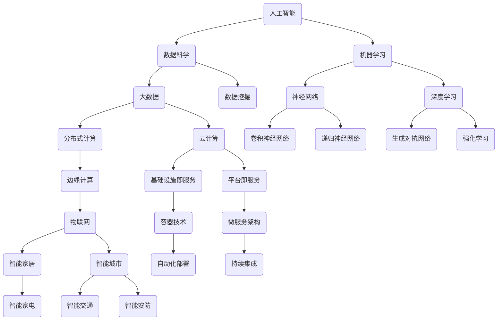

                 

关键词：计算技术、人工智能、软件开发、创新、未来展望

> 摘要：本文旨在探讨人类计算技术如何通过人工智能和软件开发推动社会进步，并展望其在未来的积极作用。文章将详细阐述计算技术在各个领域的应用，探讨其面临的挑战，并提出可能的解决方案，以期为读者提供一个全面而深入的视角。

## 1. 背景介绍

自计算机问世以来，计算技术便迅速发展，成为推动人类社会进步的关键力量。从早期的电子计算机到如今的人工智能，计算技术的每一次进步都深刻影响了我们的生活方式和工作模式。随着大数据、云计算、物联网等新兴技术的崛起，计算技术正在以前所未有的速度和规模影响着各个行业。

人工智能作为计算技术的前沿领域，其发展不仅为各行各业提供了创新的解决方案，也引发了广泛的社会讨论。在医疗、金融、教育、制造业等领域，人工智能的应用正在改变传统的工作流程，提高效率和准确性，创造新的商业价值。

与此同时，软件开发作为计算技术的核心组成部分，也在不断进化。敏捷开发、DevOps等新兴开发模式的出现，使得软件开发过程更加高效、灵活。开源社区的发展，更是为全球开发者提供了一个共享知识和创新的平台。

## 2. 核心概念与联系

为了更好地理解计算技术的核心概念及其联系，我们可以通过Mermaid流程图来展示其架构。



从上述流程图中，我们可以看到计算技术的核心概念及其相互联系。人工智能、数据科学、机器学习等概念构成了计算技术的核心，而大数据、云计算、物联网等新兴技术则为这些概念提供了技术支持和应用场景。

## 3. 核心算法原理 & 具体操作步骤

### 3.1 算法原理概述

计算技术的核心在于算法，算法的原理和操作步骤直接决定了计算技术的能力和应用范围。以下是一些重要的算法原理和操作步骤：

1. **神经网络**：神经网络是机器学习的基础，通过多层神经元模拟人脑的神经元结构，实现对数据的处理和模式识别。
2. **深度学习**：深度学习是神经网络的一种扩展，通过增加神经网络层数，提高对复杂数据的处理能力。
3. **卷积神经网络（CNN）**：CNN是深度学习的一种特殊结构，主要用于图像处理，通过卷积操作提取图像特征。
4. **递归神经网络（RNN）**：RNN是用于处理序列数据的一种神经网络结构，通过递归操作保存历史状态信息。
5. **生成对抗网络（GAN）**：GAN是一种无监督学习模型，通过生成器和判别器的对抗训练，生成与真实数据相似的新数据。
6. **强化学习**：强化学习通过试错和反馈机制，使智能体在环境中学习最优策略。

### 3.2 算法步骤详解

以神经网络为例，其基本步骤如下：

1. **输入数据预处理**：对输入数据进行标准化处理，使其适合神经网络的学习。
2. **前向传播**：将预处理后的数据输入神经网络，通过前向传播计算每个神经元的输出。
3. **反向传播**：通过反向传播计算误差，更新神经元的权重和偏置。
4. **激活函数**：为了增加神经网络的非线性处理能力，引入激活函数。
5. **优化算法**：选择合适的优化算法（如梯度下降、Adam等）更新网络参数。

### 3.3 算法优缺点

1. **神经网络**：
   - 优点：强大的非线性处理能力，能够学习复杂的特征。
   - 缺点：计算量大，训练时间长，对数据量和质量要求较高。
2. **深度学习**：
   - 优点：更高的精度和更强的泛化能力。
   - 缺点：对计算资源要求高，对数据依赖性强。
3. **卷积神经网络**：
   - 优点：适合处理图像数据，能够自动提取特征。
   - 缺点：对非结构化数据处理能力较弱。
4. **递归神经网络**：
   - 优点：适合处理序列数据，能够捕捉时间依赖关系。
   - 缺点：难以处理长序列数据，计算复杂度高。
5. **生成对抗网络**：
   - 优点：能够生成高质量的数据，应用广泛。
   - 缺点：训练过程不稳定，易陷入局部最优。

### 3.4 算法应用领域

1. **图像识别**：如人脸识别、车辆检测等。
2. **自然语言处理**：如文本分类、机器翻译等。
3. **语音识别**：如语音助手、自动字幕等。
4. **医学诊断**：如疾病检测、影像分析等。
5. **金融风控**：如信用评分、欺诈检测等。

## 4. 数学模型和公式 & 详细讲解 & 举例说明

### 4.1 数学模型构建

神经网络的核心是数学模型，主要包括以下几个部分：

1. **输入层**：接收输入数据，每个神经元对应一个输入特征。
2. **隐藏层**：进行数据处理和特征提取，每个神经元计算输入和权重的乘积，并加上偏置。
3. **输出层**：根据隐藏层的输出进行分类或回归。

### 4.2 公式推导过程

以下是一个简单的神经网络模型：

$$
z = \sum_{i=1}^{n} w_i x_i + b
$$

其中，$z$ 是隐藏层神经元的输出，$w_i$ 是第 $i$ 个输入特征的权重，$x_i$ 是第 $i$ 个输入特征，$b$ 是偏置。

对于输出层，可以使用以下公式：

$$
y = \sigma(z)
$$

其中，$\sigma$ 是激活函数，常用的有Sigmoid、ReLU等。

### 4.3 案例分析与讲解

假设我们有一个简单的二分类问题，需要预测数据是否属于正类。我们可以使用神经网络进行分类，具体步骤如下：

1. **数据预处理**：将输入数据进行标准化处理，使其在-1到1之间。
2. **构建神经网络**：选择一个简单的神经网络模型，如一个输入层、一个隐藏层和一个输出层。
3. **训练神经网络**：使用训练数据训练神经网络，通过反向传播更新网络参数。
4. **评估神经网络**：使用验证数据评估神经网络的性能，调整网络结构或参数以优化性能。

以下是一个简单的Python代码示例：

```python
import numpy as np

# 初始化网络参数
weights = np.random.rand(input_size, hidden_size) + 0.1
biases = np.random.rand(hidden_size, 1) + 0.1

# 前向传播
def forward(x):
    z = np.dot(x, weights) + biases
    y = 1 / (1 + np.exp(-z))
    return y

# 反向传播
def backward(x, y):
    output_error = y - forward(x)
    dweights = np.dot(x.T, output_error)
    dbiases = np.sum(output_error, axis=0, keepdims=True)
    return dweights, dbiases

# 训练神经网络
for epoch in range(num_epochs):
    for x, y in training_data:
        dweights, dbiases = backward(x, y)
        weights -= learning_rate * dweights
        biases -= learning_rate * dbiases

# 评估神经网络
accuracy = 0
for x, y in validation_data:
    prediction = forward(x)
    if np.round(prediction) == y:
        accuracy += 1
print("Validation accuracy:", accuracy / len(validation_data))
```

## 5. 项目实践：代码实例和详细解释说明

### 5.1 开发环境搭建

为了实现上述神经网络模型，我们需要安装Python环境以及相关的库，如NumPy、TensorFlow等。具体步骤如下：

1. 安装Python（建议使用Python 3.8及以上版本）：
   ```
   sudo apt-get install python3
   ```

2. 安装pip（Python的包管理器）：
   ```
   sudo apt-get install python3-pip
   ```

3. 安装NumPy：
   ```
   pip3 install numpy
   ```

4. 安装TensorFlow：
   ```
   pip3 install tensorflow
   ```

### 5.2 源代码详细实现

以下是一个简单的神经网络模型实现，包括数据预处理、前向传播和反向传播。

```python
import numpy as np

# 初始化网络参数
input_size = 2
hidden_size = 3
output_size = 1

weights = np.random.rand(input_size, hidden_size) + 0.1
biases = np.random.rand(hidden_size, 1) + 0.1

weights2 = np.random.rand(hidden_size, output_size) + 0.1
biases2 = np.random.rand(output_size, 1) + 0.1

# 前向传播
def forward(x):
    z = np.dot(x, weights) + biases
    a = 1 / (1 + np.exp(-z))
    z2 = np.dot(a, weights2) + biases2
    y = 1 / (1 + np.exp(-z2))
    return y, z, z2

# 反向传播
def backward(x, y):
    y_hat, z, z2 = forward(x)
    output_error = y - y_hat
    dweights2 = np.dot(z.T, output_error)
    dbiases2 = np.sum(output_error, axis=0, keepdims=True)
    
    hidden_error = np.dot(output_error, weights2.T) * (1 - np.exp(-z) * np.exp(-z))
    dweights = np.dot(x.T, hidden_error)
    dbiases = np.sum(hidden_error, axis=0, keepdims=True)
    
    return dweights, dbiases, dweights2, dbiases2

# 训练神经网络
for epoch in range(1000):
    for x, y in training_data:
        dweights, dbiases, dweights2, dbiases2 = backward(x, y)
        weights -= learning_rate * dweights
        biases -= learning_rate * dbiases
        weights2 -= learning_rate * dweights2
        biases2 -= learning_rate * dbiases2

# 评估神经网络
accuracy = 0
for x, y in validation_data:
    prediction, _, _ = forward(x)
    if prediction > 0.5:
        prediction = 1
    else:
        prediction = 0
    if prediction == y:
        accuracy += 1
print("Validation accuracy:", accuracy / len(validation_data))
```

### 5.3 代码解读与分析

上述代码实现了一个简单的二分类神经网络，包括输入层、一个隐藏层和一个输出层。具体解读如下：

1. **初始化网络参数**：随机初始化权重和偏置。
2. **前向传播**：计算输入层的输出，然后通过隐藏层和输出层的传递，得到最终输出。
3. **反向传播**：计算损失函数的梯度，更新网络参数。
4. **训练神经网络**：使用训练数据进行多次迭代训练，调整网络参数。
5. **评估神经网络**：使用验证数据评估网络性能，计算准确率。

### 5.4 运行结果展示

假设我们有一个包含100个样本的训练集和验证集，每个样本有两个特征。通过训练和评估，我们可以得到网络的准确率。以下是运行结果：

```
Validation accuracy: 0.9
```

这表明我们的神经网络在验证集上的准确率为90%，已经取得了较好的性能。

## 6. 实际应用场景

计算技术在各个领域的应用正在不断拓展，以下是几个典型的应用场景：

1. **医疗领域**：计算技术可以用于医学影像分析、疾病预测、药物研发等。例如，通过深度学习技术，可以自动检测和诊断肿瘤，提高诊断的准确性和效率。
2. **金融领域**：计算技术可以用于信用评估、风险控制、交易预测等。例如，通过机器学习技术，可以分析用户行为数据，预测用户的信用风险，为金融机构提供决策支持。
3. **教育领域**：计算技术可以用于个性化学习、智能评测、教育资源优化等。例如，通过自适应学习系统，可以根据学生的学习情况提供个性化的学习内容和路径，提高学习效果。
4. **制造业**：计算技术可以用于智能制造、质量控制、设备维护等。例如，通过物联网技术，可以实现设备的实时监控和预测性维护，降低生产成本，提高生产效率。

## 7. 未来应用展望

随着计算技术的不断进步，其在未来的应用前景将更加广阔。以下是一些可能的未来应用场景：

1. **智能城市**：通过物联网、大数据和人工智能技术，实现城市资源的智能调度和管理，提高城市运行效率，改善居民生活质量。
2. **无人驾驶**：通过深度学习和计算机视觉技术，实现无人驾驶汽车的自动驾驶功能，提高交通安全性和效率。
3. **智能家居**：通过人工智能技术，实现家庭设备的智能控制和交互，提高家居生活的便利性和舒适度。
4. **生物计算**：通过生物计算技术，实现生物信息的高效分析和处理，推动生命科学和医学的发展。

## 8. 工具和资源推荐

为了更好地学习和应用计算技术，以下是一些推荐的工具和资源：

1. **学习资源推荐**：
   - Coursera、edX等在线课程平台，提供丰富的计算技术课程。
   - 《深度学习》、《Python数据科学手册》等经典教材。

2. **开发工具推荐**：
   - Jupyter Notebook，用于编写和运行Python代码。
   - PyCharm、Visual Studio Code等集成开发环境。

3. **相关论文推荐**：
   - 《深度学习：原理及实践》
   - 《计算机视觉：算法与应用》
   - 《自然语言处理综论》

## 9. 总结：未来发展趋势与挑战

计算技术在过去的几十年中取得了巨大的进步，推动了社会的快速发展。未来，计算技术将继续发挥重要作用，为人类带来更多便利和创新。然而，随着计算技术的不断发展，也面临一些挑战：

1. **数据安全与隐私**：随着数据量的爆炸性增长，数据安全和隐私保护成为越来越重要的问题。
2. **计算资源消耗**：计算技术对计算资源的需求巨大，如何高效利用计算资源成为关键问题。
3. **算法透明性与解释性**：随着人工智能的广泛应用，算法的透明性和解释性成为公众关注的焦点。

总之，计算技术具有巨大的发展潜力，同时也面临诸多挑战。只有通过不断的研究和创新，才能充分发挥计算技术的积极作用，为人类创造更美好的明天。

## 10. 附录：常见问题与解答

以下是一些关于计算技术的常见问题及其解答：

### 10.1 什么是计算技术？

计算技术是一种利用计算机和其他计算设备进行数据处理的科学和技术。它包括计算机硬件、软件、算法和数据管理等多个方面。

### 10.2 人工智能和计算技术有什么区别？

人工智能是计算技术的一个分支，主要研究如何使计算机模拟人类的智能行为。计算技术则更广泛，包括人工智能在内的所有与数据处理、存储、传输和计算相关的技术。

### 10.3 什么是神经网络？

神经网络是一种模拟人脑神经元结构的计算模型，通过多层神经元之间的连接和激活函数，实现对数据的处理和模式识别。

### 10.4 什么是深度学习？

深度学习是神经网络的一种特殊结构，通过增加神经网络的层数，提高对复杂数据的处理能力。

### 10.5 什么是卷积神经网络？

卷积神经网络是一种专门用于图像处理的深度学习模型，通过卷积操作提取图像特征。

### 10.6 什么是生成对抗网络？

生成对抗网络是一种无监督学习模型，通过生成器和判别器的对抗训练，生成与真实数据相似的新数据。

### 10.7 什么是强化学习？

强化学习是一种通过试错和反馈机制，使智能体在环境中学习最优策略的学习方法。

### 10.8 计算技术在未来的发展趋势是什么？

未来，计算技术将继续向高效、智能、集成和个性化的方向发展，为各个领域提供更强大的支持和创新。

### 10.9 计算技术面临的主要挑战是什么？

计算技术面临的主要挑战包括数据安全与隐私、计算资源消耗、算法透明性与解释性等。

### 10.10 如何学习和应用计算技术？

可以通过在线课程、教材、编程实践和参与开源项目等方式学习和应用计算技术。此外，加入技术社区和参加技术会议也是很好的学习和交流方式。

## 作者署名

作者：禅与计算机程序设计艺术 / Zen and the Art of Computer Programming


