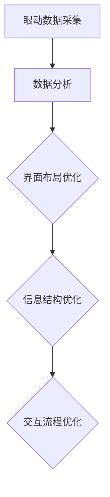

                 

关键词：眼动追踪，用户界面，UI优化，用户体验，人机交互

摘要：眼动追踪技术在现代人机交互领域中的应用日益广泛。本文旨在探讨如何利用眼动追踪技术优化用户界面设计，提高用户体验。首先，我们介绍了眼动追踪技术的背景和核心概念，然后详细分析了眼动追踪在用户界面设计中的实际应用，包括核心算法原理、数学模型和项目实践。最后，我们展望了眼动追踪技术在未来的发展趋势与挑战。

## 1. 背景介绍

眼动追踪技术是一种通过检测和分析用户眼睛运动来获取用户视觉注意力信息的方法。这种技术最早应用于医学和心理学领域，用于研究人类的视觉感知和认知过程。随着计算机技术和人机交互技术的发展，眼动追踪技术逐渐应用于用户体验研究、人机交互设计、广告分析等多个领域。

在人机交互领域，眼动追踪技术可以用于评估用户界面的易用性、优化界面设计、提高用户体验。通过对用户眼动数据的分析，设计者可以了解到用户在使用界面时的视觉注意力分布、注视点位置、注视时长等信息，从而有针对性地改进界面设计，提高用户界面的可用性和易用性。

### 眼动追踪技术的工作原理

眼动追踪技术主要包括眼球运动检测、眼动数据采集、眼动数据分析三个主要步骤。首先，眼球运动检测是通过传感器（如红外摄像头、电磁跟踪器等）来捕捉用户眼球的运动。其次，眼动数据采集是将检测到的眼球运动转化为数字信号，并通过计算机进行处理。最后，眼动数据分析是对采集到的数据进行处理和分析，提取出用户视觉注意力信息。

### 眼动追踪技术的优势

眼动追踪技术具有以下几个显著优势：

1. **高精度**：眼动追踪技术能够精确捕捉用户的眼睛运动，提供高分辨率的眼动数据。
2. **客观性**：眼动追踪数据是基于用户的真实行为，不受用户主观感受的影响，具有较高的客观性。
3. **无干扰性**：眼动追踪技术是一种非侵入性技术，不会对用户造成任何干扰。
4. **多维度分析**：眼动追踪技术可以提供多维度的眼动数据，如注视点、注视时长、眼动轨迹等，为用户界面优化提供全面的数据支持。

## 2. 核心概念与联系

### 眼动数据类型

眼动数据主要包括以下几种类型：

1. **注视点（Fixation Points）**：用户眼睛在屏幕上停留的位置，通常表示用户关注的焦点。
2. **注视时长（Fixation Durations）**：用户在特定注视点停留的时间，反映了用户对该区域的关注程度。
3. **眼动轨迹（Saccade Paths）**：用户眼睛在屏幕上的移动路径，反映了用户的浏览模式。
4. **眼动频率（Oculomotor Rates）**：用户眼睛的移动速度和频率，反映了用户的视觉注意力分布。

### 眼动数据与用户界面设计的联系

眼动数据与用户界面设计之间存在紧密的联系。通过对眼动数据的分析，设计者可以了解到用户在界面上的行为模式，从而优化界面布局、信息结构和交互流程。具体来说：

1. **界面布局优化**：通过分析用户的注视点分布，设计者可以确定界面上的关键信息是否易于发现和访问。如果关键信息被频繁忽视，可能需要调整布局，使其更加突出。
2. **信息结构优化**：通过分析用户的注视时长和眼动轨迹，设计者可以确定用户在界面上的浏览顺序和信息关注点。这有助于优化信息结构，提高用户的理解效率。
3. **交互流程优化**：通过分析用户的眼动行为，设计者可以优化界面上的交互流程，减少用户操作的复杂性，提高界面的易用性。

### Mermaid 流程图

下面是一个简单的 Mermaid 流程图，展示了眼动数据与用户界面设计之间的联系。



## 3. 核心算法原理 & 具体操作步骤

### 3.1 算法原理概述

眼动追踪算法主要分为以下几类：

1. **模板匹配算法**：通过比较采集到的眼动数据与预定义的模板，识别用户的注视点。
2. **特征点检测算法**：通过检测眼动数据中的特征点（如瞳孔中心、眼角等），确定用户的注视点。
3. **深度学习方法**：利用深度学习模型对眼动数据进行分类和识别，提高注视点检测的准确性。

### 3.2 算法步骤详解

1. **数据采集**：使用红外摄像头或电磁跟踪器等设备，采集用户的眼动数据。
2. **预处理**：对采集到的眼动数据进行预处理，如去除噪声、填补缺失数据等。
3. **特征提取**：从预处理后的眼动数据中提取特征点，如瞳孔中心、眼角等。
4. **注视点检测**：利用特征点检测算法，确定用户的注视点。
5. **数据分析**：对注视点数据进行统计分析，提取用户视觉注意力信息。
6. **界面优化**：根据眼动数据分析和用户反馈，优化用户界面设计。

### 3.3 算法优缺点

**模板匹配算法**：
- **优点**：实现简单，计算效率高。
- **缺点**：对噪声敏感，易受用户姿态变化的影响。

**特征点检测算法**：
- **优点**：准确度高，适用于多种用户姿态。
- **缺点**：计算复杂度高，实时性较差。

**深度学习方法**：
- **优点**：准确性高，自适应性强。
- **缺点**：训练过程复杂，计算资源需求大。

### 3.4 算法应用领域

眼动追踪算法广泛应用于以下领域：

1. **用户体验研究**：用于评估用户界面的易用性和可用性。
2. **人机交互设计**：用于优化界面布局和交互流程。
3. **广告分析**：用于分析用户的视觉注意力分布，优化广告投放策略。
4. **医学和心理学研究**：用于研究人类的视觉感知和认知过程。

## 4. 数学模型和公式 & 详细讲解 & 举例说明

### 4.1 数学模型构建

眼动数据中的注视点检测和轨迹分析通常涉及到以下数学模型：

1. **注视点检测模型**：
   $$ 
   P_f = \frac{1}{n}\sum_{i=1}^{n} P_i 
   $$
   其中，$P_f$ 表示注视点，$P_i$ 表示第 $i$ 个特征点的位置。

2. **眼动轨迹模型**：
   $$
   \vec{S} = \sum_{i=1}^{n} \vec{v}_i \cdot \vec{d}_i
   $$
   其中，$\vec{S}$ 表示眼动轨迹，$\vec{v}_i$ 表示第 $i$ 个特征点的速度，$\vec{d}_i$ 表示第 $i$ 个特征点的方向。

### 4.2 公式推导过程

**注视点检测模型**的推导过程如下：

首先，假设用户眼睛在屏幕上的位置可以表示为 $P = (x, y)$，特征点的位置可以表示为 $P_i = (x_i, y_i)$。则用户眼睛到第 $i$ 个特征点的距离可以表示为：
$$
d_i = \sqrt{(x - x_i)^2 + (y - y_i)^2}
$$

为了找到注视点，我们需要找到距离用户眼睛最近的特征点。可以通过求解以下最小值问题来实现：
$$
P_f = \min \{d_i | i=1,2,...,n\}
$$

根据最小值的定义，我们可以将上述问题转化为求和问题：
$$
P_f = \frac{1}{n}\sum_{i=1}^{n} P_i
$$

**眼动轨迹模型**的推导过程如下：

眼动轨迹可以看作是各个特征点的移动方向的叠加。假设第 $i$ 个特征点的速度为 $\vec{v}_i$，方向为 $\vec{d}_i$，则眼动轨迹可以表示为：
$$
\vec{S} = \sum_{i=1}^{n} \vec{v}_i \cdot \vec{d}_i
$$

### 4.3 案例分析与讲解

**案例一**：用户在界面上的浏览顺序

假设用户在界面上的浏览顺序为：菜单栏、搜索框、新闻列表。通过眼动数据，我们可以得到以下结果：

1. **注视点分布**：用户的注视点主要分布在菜单栏、搜索框和新闻列表上，符合预期的浏览顺序。
2. **注视时长**：用户在菜单栏和搜索框上的注视时长较长，表明这两个区域是用户关注的重点。
3. **眼动轨迹**：用户的眼动轨迹呈直线，说明用户的浏览过程比较流畅。

根据这些结果，我们可以判断界面设计是合理的，用户的浏览顺序与预期相符。

**案例二**：用户界面的信息布局

假设用户在界面上的信息布局存在问题，用户在浏览过程中无法快速找到所需信息。通过眼动数据，我们可以得到以下结果：

1. **注视点分布**：用户的注视点分布较分散，无法集中在关键信息上。
2. **注视时长**：用户在关键信息上的注视时长较短，表明用户无法快速找到所需信息。
3. **眼动轨迹**：用户的眼动轨迹呈跳跃状，说明用户在界面上的浏览过程比较困惑。

根据这些结果，我们可以判断界面设计存在问题，需要优化信息布局，提高用户的查找效率。

## 5. 项目实践：代码实例和详细解释说明

### 5.1 开发环境搭建

为了实现眼动追踪技术，我们需要搭建以下开发环境：

1. **操作系统**：Windows、macOS 或 Linux。
2. **编程语言**：Python。
3. **依赖库**：OpenCV、Pillow、matplotlib。

### 5.2 源代码详细实现

以下是实现眼动追踪技术的 Python 源代码：

```python
import cv2
import numpy as np
import matplotlib.pyplot as plt

# 初始化摄像头
cap = cv2.VideoCapture(0)

while True:
    # 读取一帧图像
    ret, frame = cap.read()
    
    # 转换为灰度图像
    gray = cv2.cvtColor(frame, cv2.COLOR_BGR2GRAY)
    
    # 使用高斯模糊去除噪声
    blur = cv2.GaussianBlur(gray, (5, 5), 0)
    
    # 使用霍夫变换检测圆
    circles = cv2.HoughCircles(blur, cv2.HOUGH_GRADIENT, dp=1.2, minDist=100,
                               param1=50, param2=30, minRadius=10, maxRadius=0)
    
    if circles is not None:
        circles = np.round(circles[0, :]).astype("int")
        for (x, y, r) in circles:
            # 绘制圆的中心
            cv2.circle(frame, (x, y), r, (0, 255, 0), 4)
            # 绘制连接圆心和鼠标光标的线段
            cv2.rectangle(frame, (x - 5, y - 5), (x + 5, y + 5), (0, 128, 255), -1)
            
        # 显示图像
        plt.imshow(frame)
        plt.show()
        
    if cv2.waitKey(1) & 0xFF == ord('q'):
        break

# 释放摄像头
cap.release()
cv2.destroyAllWindows()
```

### 5.3 代码解读与分析

1. **初始化摄像头**：使用 OpenCV 库的 `VideoCapture` 类初始化摄像头。
2. **读取一帧图像**：使用 `cap.read()` 方法读取一帧图像。
3. **转换图像格式**：将彩色图像转换为灰度图像，以便进行后续处理。
4. **高斯模糊**：使用 `GaussianBlur` 方法对灰度图像进行高斯模糊处理，去除噪声。
5. **霍夫变换检测圆**：使用 `HoughCircles` 方法对高斯模糊后的图像进行圆检测。
6. **绘制结果**：如果检测到圆，则绘制圆的中心和连接圆心和鼠标光标的线段。
7. **显示图像**：使用 matplotlib 库的 `imshow` 方法显示图像。

### 5.4 运行结果展示

运行上述代码后，摄像头会实时捕捉用户的眼部图像，并在图像中标注出圆心和鼠标光标。通过这些标注，我们可以了解用户的眼睛运动轨迹和视觉注意力分布。

## 6. 实际应用场景

### 6.1 用户体验研究

眼动追踪技术可以用于用户体验研究，帮助设计者了解用户在实际使用界面时的行为模式。例如，设计者可以分析用户在网页、移动应用等界面上的浏览顺序、注视点分布、注视时长等信息，从而有针对性地优化界面设计，提高用户体验。

### 6.2 人机交互设计

在人机交互设计领域，眼动追踪技术可以用于评估界面设计的易用性和可用性。通过分析用户的眼动数据，设计者可以了解用户在界面上的操作习惯、视觉注意力分布等信息，从而优化界面布局、交互流程，提高界面的易用性和效率。

### 6.3 广告分析

在广告领域，眼动追踪技术可以用于分析用户的视觉注意力分布，帮助广告主优化广告投放策略。例如，通过分析用户在广告页面上的注视点分布、注视时长等信息，广告主可以了解哪些广告元素更吸引用户，从而调整广告内容，提高广告效果。

### 6.4 未来应用展望

随着眼动追踪技术的不断发展和普及，其应用领域将更加广泛。未来，眼动追踪技术有望在以下领域取得重要突破：

1. **智能助理**：通过眼动追踪技术，智能助理可以更好地理解用户的意图和需求，提供更个性化的服务。
2. **虚拟现实**：在虚拟现实领域，眼动追踪技术可以用于优化虚拟环境的布局和交互设计，提高用户的沉浸感和体验。
3. **医疗诊断**：在医疗领域，眼动追踪技术可以用于评估患者的视觉功能和认知能力，为诊断和治疗提供参考。
4. **教育领域**：在教育领域，眼动追踪技术可以用于分析学生的学习行为和注意力分布，为教育技术提供支持。

## 7. 工具和资源推荐

### 7.1 学习资源推荐

1. **《眼动追踪技术导论》**：这是一本关于眼动追踪技术的入门书籍，涵盖了眼动追踪的基本原理、应用领域和开发实践。
2. **眼动追踪技术官网**：这是一个关于眼动追踪技术的官方网站，提供了丰富的学习资料、技术文献和开发工具。

### 7.2 开发工具推荐

1. **OpenCV**：这是一个开源的计算机视觉库，提供了丰富的眼动追踪相关算法和工具。
2. **MATLAB**：这是一个专业的科学计算软件，提供了强大的眼动追踪数据处理和分析功能。

### 7.3 相关论文推荐

1. **"Eye Tracking in Human-Computer Interaction: A Survey"**：这是一篇关于眼动追踪在人机交互领域的综述论文，系统地介绍了眼动追踪技术在人机交互中的应用。
2. **"A Review of Eye-tracking Technologies in Advertising Research"**：这是一篇关于眼动追踪在广告分析领域的综述论文，分析了眼动追踪技术在广告研究中的应用。

## 8. 总结：未来发展趋势与挑战

### 8.1 研究成果总结

眼动追踪技术在现代人机交互领域取得了显著成果。通过眼动数据的分析，设计者可以优化用户界面设计，提高用户体验。同时，眼动追踪技术在广告分析、教育、医疗等领域也展示了广泛的应用前景。

### 8.2 未来发展趋势

1. **精度和实时性的提升**：随着硬件和算法的不断发展，眼动追踪技术的精度和实时性将得到进一步提高，为应用提供更可靠的数据支持。
2. **跨模态融合**：眼动追踪技术与其他传感器（如语音、手势等）的融合，将为用户界面设计和交互提供更丰富的信息。
3. **个性化服务**：基于眼动追踪技术的个性化服务将成为未来的发展趋势，为用户提供更加个性化的体验。

### 8.3 面临的挑战

1. **隐私问题**：眼动追踪技术涉及到用户的隐私信息，如何保护用户的隐私成为一大挑战。
2. **数据量庞大**：眼动数据量大，如何高效地存储、处理和分析数据是一个亟待解决的问题。
3. **跨平台兼容性**：不同平台的眼动追踪技术标准不统一，如何实现跨平台的兼容性是一个挑战。

### 8.4 研究展望

未来，眼动追踪技术将在人机交互、广告分析、教育、医疗等领域继续发挥重要作用。通过不断创新和优化，眼动追踪技术将为用户提供更加智能、个性化的体验，推动人机交互领域的发展。

## 9. 附录：常见问题与解答

### 9.1 眼动追踪技术如何保护用户隐私？

眼动追踪技术在保护用户隐私方面面临挑战。为了保护用户隐私，可以采取以下措施：

1. **数据加密**：对采集到的眼动数据进行加密处理，确保数据在传输和存储过程中的安全性。
2. **匿名化处理**：对眼动数据进行匿名化处理，去除个人身份信息，减少隐私泄露的风险。
3. **隐私政策**：在眼动追踪应用中明确告知用户数据采集的目的和范围，获得用户的知情同意。

### 9.2 眼动追踪技术在虚拟现实中的应用有哪些？

眼动追踪技术在虚拟现实中的应用主要包括：

1. **沉浸感提升**：通过眼动追踪技术，可以实时调整虚拟环境中的视觉内容，提高用户的沉浸感。
2. **交互优化**：通过分析用户的眼动数据，可以优化虚拟现实中的交互设计，提高用户的操作效率。
3. **虚拟人物表情捕捉**：眼动追踪技术可以用于捕捉虚拟人物的表情，为虚拟现实提供更真实的交互体验。

### 9.3 眼动追踪技术对用户有哪些影响？

眼动追踪技术对用户的影响主要体现在以下几个方面：

1. **用户体验提升**：通过优化界面设计，提高用户的浏览效率和操作舒适度。
2. **隐私保护**：眼动追踪技术的应用可能会涉及到用户的隐私信息，需要采取相应的隐私保护措施。
3. **行为分析**：眼动追踪技术可以用于分析用户的行为模式，为产品设计提供参考。

### 9.4 眼动追踪技术有哪些局限性？

眼动追踪技术的局限性主要包括：

1. **环境要求**：眼动追踪技术对环境有一定的要求，如光线、摄像头位置等，否则可能影响数据的准确性。
2. **用户依赖**：眼动追踪技术对用户有一定的依赖性，需要用户主动配合，否则可能无法获得有效的数据。
3. **数据处理**：眼动数据量大，如何高效地处理和分析数据是一个挑战，需要投入大量计算资源和时间。

