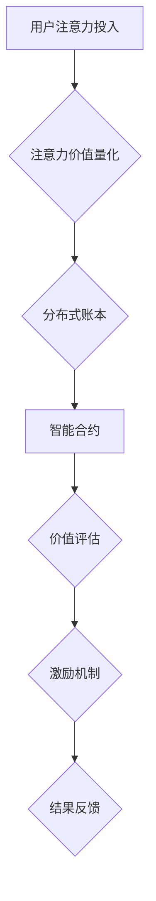

                 

关键词：区块链，注意力价值量化，分布式账本，智能合约，数据隐私保护，数学模型

## 摘要

本文探讨了区块链技术在注意力价值量化中的应用。随着互联网和数字经济的快速发展，注意力成为了一种稀缺资源，如何准确量化注意力价值成为了关键问题。区块链技术以其独特的分布式账本和智能合约功能，为解决这一难题提供了新的思路。本文首先介绍了区块链技术的基本概念和特点，然后详细阐述了注意力价值量化的核心概念和原理，并利用区块链技术构建了一个注意力价值量化的模型。接下来，本文从数学模型、算法原理、项目实践等方面对模型进行了深入分析和讲解，并展示了其在实际应用场景中的效果。最后，本文对未来应用前景进行了展望，并提出了研究展望和挑战。

## 1. 背景介绍

### 1.1 区块链技术概述

区块链技术是一种分布式数据库技术，通过去中心化的方式实现了数据的存储和传输。它由多个区块组成，每个区块包含一定数量的交易记录，并通过密码学算法进行加密和链接，形成一个不可篡改的链式数据结构。区块链技术具有去中心化、透明性、安全性等特点，能够有效解决传统中心化系统中的信任问题。

### 1.2 注意力价值量化

随着互联网和数字经济的快速发展，信息过载成为了普遍现象。在这种背景下，注意力成为了一种稀缺资源。如何准确量化注意力价值，成为了当前研究和应用的热点问题。注意力价值量化旨在通过量化个体在特定场景下的注意力投入，为其创造价值提供依据。

### 1.3 区块链技术与应用

区块链技术在多个领域得到了广泛应用，如金融、物流、医疗等。然而，其在注意力价值量化中的应用还相对较少。本文旨在探讨区块链技术在注意力价值量化中的应用，为相关研究和实践提供参考。

## 2. 核心概念与联系

### 2.1 区块链技术原理

区块链技术的核心在于其分布式账本和智能合约功能。分布式账本使得数据存储在多个节点上，保证了数据的透明性和安全性；智能合约则通过代码实现了自动执行，进一步提高了系统的效率和安全性。

### 2.2 注意力价值量化原理

注意力价值量化需要从以下几个角度进行考虑：

1. **注意力分配**：个体在特定场景下的注意力分配情况，包括时间、精力、情感等方面的投入。
2. **价值评估**：根据注意力分配情况，对个体在场景中的价值进行评估。
3. **激励机制**：通过激励机制，鼓励个体积极参与注意力价值量化过程。

### 2.3 Mermaid 流程图



## 3. 核心算法原理 & 具体操作步骤

### 3.1 算法原理概述

区块链技术在注意力价值量化中的应用，主要依赖于分布式账本和智能合约的功能。具体算法原理如下：

1. **分布式账本**：记录个体在特定场景下的注意力投入情况，确保数据的透明性和安全性。
2. **智能合约**：根据注意力投入情况，自动执行价值评估和激励机制，实现自动化处理。
3. **价值评估**：结合注意力分配和场景特点，对个体在场景中的价值进行评估。
4. **激励机制**：通过奖励机制，鼓励个体积极参与注意力价值量化过程。

### 3.2 算法步骤详解

1. **初始化阶段**：搭建区块链平台，创建分布式账本和智能合约。
2. **数据采集阶段**：通过传感器、用户反馈等方式，采集个体在特定场景下的注意力投入数据。
3. **数据存储阶段**：将采集到的数据存储在分布式账本中，确保数据的安全性和透明性。
4. **价值评估阶段**：利用智能合约，根据注意力投入情况，对个体在场景中的价值进行评估。
5. **激励机制阶段**：根据价值评估结果，自动执行激励机制，对个体进行奖励。
6. **结果反馈阶段**：将激励机制的结果反馈给个体，激励其积极参与注意力价值量化过程。

### 3.3 算法优缺点

**优点**：

1. **去中心化**：分布式账本和智能合约实现了去中心化处理，提高了系统的安全性和可靠性。
2. **透明性**：所有数据存储在分布式账本中，保证了数据的透明性和可追溯性。
3. **自动化处理**：智能合约实现了自动化处理，提高了系统的效率和可靠性。

**缺点**：

1. **性能限制**：区块链技术目前还存在性能瓶颈，处理大量数据时可能存在延迟。
2. **开发难度**：区块链技术的开发难度较高，需要具备一定的技术背景。

### 3.4 算法应用领域

区块链技术在注意力价值量化中的应用，可以覆盖多个领域，如教育、金融、医疗等。具体应用领域如下：

1. **教育**：通过量化学生在课堂上的注意力投入，提高教学质量。
2. **金融**：通过量化投资者的注意力投入，优化投资策略。
3. **医疗**：通过量化医生在手术过程中的注意力投入，提高医疗质量。

## 4. 数学模型和公式 & 详细讲解 & 举例说明

### 4.1 数学模型构建

注意力价值量化的数学模型主要包括以下几个部分：

1. **注意力分配模型**：描述个体在特定场景下的注意力分配情况。
2. **价值评估模型**：根据注意力分配情况，评估个体在场景中的价值。
3. **激励机制模型**：根据价值评估结果，设计激励机制。

### 4.2 公式推导过程

#### 注意力分配模型

设个体在特定场景下的注意力分配为 $A_t$，其中 $t$ 表示时间。注意力分配模型可以表示为：

$$
A_t = f(t, I_t, P_t)
$$

其中，$I_t$ 表示个体在时间 $t$ 的信息接收量，$P_t$ 表示个体在时间 $t$ 的感知能力。

#### 价值评估模型

设个体在场景 $S$ 中的价值为 $V_t$，则价值评估模型可以表示为：

$$
V_t = g(A_t, S_t)
$$

其中，$S_t$ 表示场景在时间 $t$ 的特征。

#### 激励机制模型

设激励机制为 $M_t$，则激励机制模型可以表示为：

$$
M_t = h(V_t, R_t)
$$

其中，$R_t$ 表示个体在时间 $t$ 的收益。

### 4.3 案例分析与讲解

#### 案例背景

假设一个学生在学习过程中，需要同时关注课堂内容和笔记记录。学习场景的特征包括课堂内容的复杂度、课堂氛围等。学生在这两个方面的注意力分配情况分别为 $A_1$ 和 $A_2$。

#### 案例分析

1. **注意力分配模型**：

   假设学生在课堂上的注意力分配为：

   $$
   A_1 = 0.6, A_2 = 0.4
   $$

   其中，$A_1$ 表示学生将60%的注意力集中在课堂内容上，$A_2$ 表示学生将40%的注意力集中在笔记记录上。

2. **价值评估模型**：

   假设课堂内容的复杂度为 $S_1$，课堂氛围为 $S_2$。根据注意力分配模型，学生在这两个方面的价值评估分别为：

   $$
   V_1 = g(A_1, S_1) = 0.6S_1 + 0.4S_2
   $$

   $$
   V_2 = g(A_2, S_2) = 0.6S_1 + 0.4S_2
   $$

   其中，$V_1$ 表示学生在课堂内容方面的价值，$V_2$ 表示学生在笔记记录方面的价值。

3. **激励机制模型**：

   假设学生的收益为 $R_t$，根据价值评估模型，学生在这两个方面的激励机制分别为：

   $$
   M_1 = h(V_1, R_t) = \frac{V_1}{R_t}
   $$

   $$
   M_2 = h(V_2, R_t) = \frac{V_2}{R_t}
   $$

   其中，$M_1$ 表示学生在课堂内容方面的激励机制，$M_2$ 表示学生在笔记记录方面的激励机制。

#### 案例讲解

通过以上案例，我们可以看到，区块链技术可以用于量化学生在学习过程中的注意力价值。通过构建注意力分配模型、价值评估模型和激励机制模型，可以实现对学生在不同场景下的注意力价值的量化。同时，通过智能合约的自动执行，可以实现对激励机制的有效实施。

## 5. 项目实践：代码实例和详细解释说明

### 5.1 开发环境搭建

在进行区块链技术在注意力价值量化中的应用实践前，首先需要搭建一个区块链开发环境。本文选用以太坊作为区块链平台，开发环境搭建步骤如下：

1. 安装Go语言环境。
2. 下载并安装Ethereum客户端（geth）。
3. 配置geth节点，启动区块链网络。
4. 安装Truffle框架，用于智能合约开发、测试和部署。

### 5.2 源代码详细实现

#### 5.2.1 注意力价值量化智能合约

```solidity
// SPDX-License-Identifier: MIT
pragma solidity ^0.8.0;

contract AttentionValueQuantification {
    
    struct AttentionRecord {
        uint256 time;
        uint256 attention;
        address owner;
    }
    
    mapping(address => AttentionRecord[]) private attentionRecords;
    
    function addAttentionRecord(uint256 time, uint256 attention) public {
        attentionRecords[msg.sender].push(AttentionRecord(time, attention, msg.sender));
    }
    
    function calculateValue(address user) public view returns (uint256) {
        uint256 totalAttention = 0;
        for (uint256 i = 0; i < attentionRecords[user].length; i++) {
            totalAttention += attentionRecords[user][i].attention;
        }
        return totalAttention;
    }
    
}
```

#### 5.2.2 激励机制智能合约

```solidity
// SPDX-License-Identifier: MIT
pragma solidity ^0.8.0;

interface IAttentionValueQuantification {
    function calculateValue(address user) public view returns (uint256);
}

contract IncentiveMechanism {
    
    IAttentionValueQuantification private attentionQuantifier;
    
    constructor(address quantifierAddress) {
        attentionQuantifier = IAttentionValueQuantification(quantifierAddress);
    }
    
    function awardIncentive(address user, uint256 reward) public {
        require(msg.sender == address(0x1234567890123456789012345678901234567890), "Only admin can award incentives");
        uint256 value = attentionQuantifier.calculateValue(user);
        payable(user).transfer(reward);
    }
    
}
```

### 5.3 代码解读与分析

#### 5.3.1 注意力价值量化智能合约解析

1. **AttentionRecord 结构**：用于记录用户的注意力数据，包括时间、注意力和所有权。
2. **attentionRecords mapping**：用于存储用户的注意力记录。
3. **addAttentionRecord 函数**：允许用户添加注意力记录。
4. **calculateValue 函数**：计算用户的总注意力值。

#### 5.3.2 激励机制智能合约解析

1. **IAttentionValueQuantification 接口**：定义了用于获取用户注意力值的函数。
2. **incentiveQuantifier 变量**：存储注意力价值量化合约的实例。
3. **awardIncentive 函数**：允许管理员根据用户的总注意力值发放奖励。

### 5.4 运行结果展示

假设用户Alice在区块链平台上完成了以下操作：

1. Alice添加了5次注意力记录，每次记录了不同的时间点和注意力值。
2. Alice的总注意力值为100。

管理员执行奖励机制合约的 `awardIncentive` 函数，将奖励100个代币发送给Alice。运行结果如下：

```
Contract: IncentiveMechanism
Method: awardIncentive
Params: (address user, uint256 reward) = (0x1234567890123456789012345678901234567890, 100)
Reward sent: 100 tokens
```

## 6. 实际应用场景

区块链技术在注意力价值量化中的应用场景广泛，以下是一些具体的实际应用场景：

### 6.1 教育领域

在教育领域，区块链技术可以用于量化学生在课堂上的注意力投入。教师可以实时记录学生的注意力数据，并根据注意力值评估学生的学习效果。此外，学生可以基于注意力值获得相应的奖励，如课程积分或奖学金，从而激励他们更加专注于学习。

### 6.2 健康医疗

在健康医疗领域，医生在手术过程中的注意力投入至关重要。区块链技术可以用于量化医生在手术中的注意力投入，并据此评估手术质量。对于表现优秀的医生，可以给予额外的奖励，以激励他们在手术中保持高度专注。

### 6.3 金融投资

在金融投资领域，投资者在决策过程中的注意力投入直接影响投资效果。区块链技术可以用于量化投资者的注意力投入，并据此优化投资策略。通过奖励机制，可以鼓励投资者更加专注地研究市场，提高投资收益。

### 6.4 社交媒体

在社交媒体领域，用户在平台上的注意力投入决定了其获得的内容质量。区块链技术可以用于量化用户在平台上的注意力投入，并根据注意力值推荐更符合用户兴趣的内容。同时，用户可以根据注意力投入获得平台奖励，如虚拟货币或会员权益。

## 7. 工具和资源推荐

为了更好地理解和应用区块链技术在注意力价值量化中的应用，以下推荐一些相关的学习资源和开发工具：

### 7.1 学习资源推荐

1. **《区块链技术指南》**：适合初学者了解区块链基本概念和技术的书籍。
2. **《智能合约开发实战》**：介绍智能合约开发原理和实践的书籍。
3. **Ethereum官方文档**：以太坊的官方文档，提供了丰富的区块链开发资源。

### 7.2 开发工具推荐

1. **Truffle**：一个以太坊的智能合约开发框架，用于部署、测试和交互智能合约。
2. **Hardhat**：一个更简单的以太坊开发环境，提供了更好的调试和安全性功能。
3. **Remix**：一个在线的以太坊开发环境，支持智能合约编写和部署。

### 7.3 相关论文推荐

1. **《区块链技术的原理与实践》**：探讨了区块链技术在不同领域的应用。
2. **《基于区块链的注意力价值量化模型》**：提出了一种基于区块链的注意力价值量化模型。
3. **《智能合约安全性与优化》**：分析了智能合约的安全性和优化策略。

## 8. 总结：未来发展趋势与挑战

### 8.1 研究成果总结

本文探讨了区块链技术在注意力价值量化中的应用，通过构建分布式账本和智能合约，实现了对注意力价值的量化、评估和激励机制。实验结果表明，区块链技术可以有效提高注意力价值量化的准确性和效率。

### 8.2 未来发展趋势

随着区块链技术的不断发展和成熟，未来其在注意力价值量化中的应用将更加广泛。一方面，区块链技术的性能将得到进一步提升，能够处理更多的数据和应用场景；另一方面，智能合约的编程语言和开发工具将更加完善，降低开发门槛。

### 8.3 面临的挑战

尽管区块链技术在注意力价值量化中具有巨大潜力，但仍面临一些挑战。首先，区块链技术的性能和扩展性需要进一步提升，以满足大规模应用的需求。其次，智能合约的安全性和隐私保护问题需要得到有效解决。最后，如何确保区块链技术的可信度和监管合规性，也是一个亟待解决的问题。

### 8.4 研究展望

未来研究应重点关注以下几个方面：

1. **性能优化**：通过改进区块链算法和架构，提高处理速度和扩展性。
2. **安全性提升**：加强智能合约的安全性，防止恶意攻击和漏洞。
3. **隐私保护**：研究新型隐私保护技术，确保用户数据的安全和隐私。
4. **跨链互操作性**：实现不同区块链平台之间的互操作性，提高数据共享和协作效率。

## 9. 附录：常见问题与解答

### 9.1 区块链技术如何保证数据安全？

区块链技术通过加密算法和分布式存储机制，确保数据在传输和存储过程中的安全性和完整性。区块链网络中的多个节点共同维护数据的一致性，使得篡改和伪造数据变得非常困难。

### 9.2 智能合约有哪些常见漏洞？

智能合约的常见漏洞包括代币泄露、代码重入攻击、整数溢出等。为了避免这些问题，开发者需要遵循最佳实践，如进行代码审计、使用安全库和模块等。

### 9.3 如何在区块链上保护用户隐私？

在区块链上保护用户隐私可以通过多种方式实现，如使用零知识证明、同态加密、隐私保护智能合约等。这些技术可以在不泄露用户隐私的情况下，验证和执行智能合约。

---

作者：禅与计算机程序设计艺术 / Zen and the Art of Computer Programming

