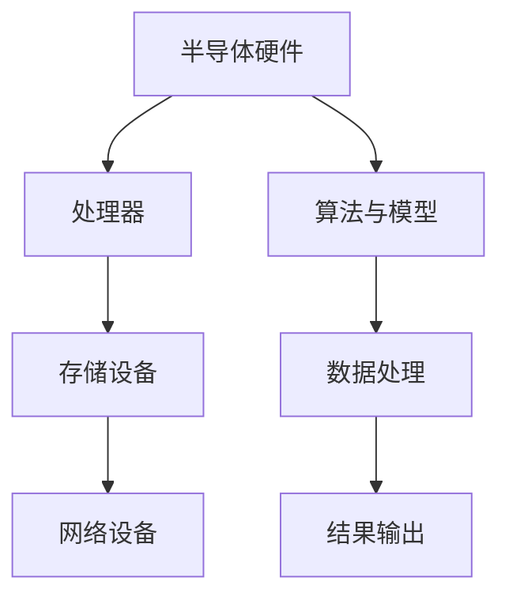

                 

关键词：半导体硬件、人工智能、AI发展、硬件与软件交互、芯片设计、算法优化

> 摘要：本文从半导体硬件技术的角度探讨了人工智能（AI）的发展，分析了硬件与软件之间的相互作用，探讨了半导体硬件技术的发展如何推动AI的进步，以及未来可能面临的挑战。

## 1. 背景介绍

### 1.1 半导体硬件技术的发展历程

半导体硬件技术自20世纪中叶以来，经历了从晶体管到集成电路、再到多核处理器和专用硬件加速器的飞速发展。每一次技术突破都极大地提升了计算机的性能，为AI的发展提供了坚实的硬件基础。

### 1.2 人工智能的发展

人工智能（AI）作为计算机科学的一个分支，其目标是使机器具备类似人类的智能。从最初的规则系统，到基于概率论的贝叶斯网络，再到深度学习的兴起，AI经历了数次变革，逐渐成为现代社会不可或缺的技术。

## 2. 核心概念与联系

### 2.1 半导体硬件与AI的关系

半导体硬件与AI的关系可以比喻为“基石与建筑”。半导体硬件提供了计算的基础设施，而AI则是构建在硬件之上的智能系统。两者的相互作用决定了AI的发展速度和性能。

### 2.2 Mermaid流程图



## 3. 核心算法原理 & 具体操作步骤

### 3.1 算法原理概述

AI的核心算法包括机器学习、深度学习、自然语言处理等。这些算法通过训练模型来模拟人类的学习过程，实现对数据的分析和预测。

### 3.2 算法步骤详解

1. 数据收集：收集大量带有标签的数据集。
2. 数据预处理：清洗和转换数据，使其适合模型训练。
3. 模型训练：使用算法在训练数据集上训练模型。
4. 模型评估：在验证数据集上评估模型的性能。
5. 模型优化：根据评估结果调整模型参数。
6. 部署应用：将优化后的模型部署到实际应用中。

### 3.3 算法优缺点

- 优点：高效、自动化、适应性强。
- 缺点：需要大量数据、计算资源消耗大、解释性差。

### 3.4 算法应用领域

AI算法在各个领域都有广泛的应用，如图像识别、自然语言处理、医疗诊断、金融预测等。

## 4. 数学模型和公式 & 详细讲解 & 举例说明

### 4.1 数学模型构建

AI算法通常基于统计模型、概率模型和优化模型。以下是一个简单的线性回归模型：

$$ y = \beta_0 + \beta_1x + \epsilon $$

### 4.2 公式推导过程

假设我们有一个训练数据集 $D = \{(x_1, y_1), (x_2, y_2), ..., (x_n, y_n)\}$，我们的目标是找到最佳拟合直线 $y = \beta_0 + \beta_1x$。

### 4.3 案例分析与讲解

以图像识别为例，我们使用卷积神经网络（CNN）进行模型训练。以下是CNN的基本结构：

1. 输入层：接收图像数据。
2. 卷积层：通过卷积操作提取特征。
3. 池化层：降低数据维度。
4. 全连接层：进行分类和预测。

## 5. 项目实践：代码实例和详细解释说明

### 5.1 开发环境搭建

在Python中，我们可以使用TensorFlow库来构建和训练神经网络。

```python
import tensorflow as tf
```

### 5.2 源代码详细实现

以下是一个简单的CNN模型实现：

```python
model = tf.keras.Sequential([
    tf.keras.layers.Conv2D(32, (3, 3), activation='relu', input_shape=(28, 28, 1)),
    tf.keras.layers.MaxPooling2D((2, 2)),
    tf.keras.layers.Flatten(),
    tf.keras.layers.Dense(128, activation='relu'),
    tf.keras.layers.Dense(10, activation='softmax')
])
```

### 5.3 代码解读与分析

代码中定义了一个简单的CNN模型，包括卷积层、池化层、全连接层等。通过TensorFlow库，我们可以方便地构建和训练神经网络。

### 5.4 运行结果展示

在训练完成后，我们可以使用测试数据集来评估模型的性能。

```python
test_loss, test_acc = model.evaluate(test_images, test_labels)
print('Test accuracy:', test_acc)
```

## 6. 实际应用场景

### 6.1 图像识别

图像识别是AI领域的一个重要应用。通过使用CNN等深度学习算法，我们可以实现高效的图像分类和识别。

### 6.2 自然语言处理

自然语言处理（NLP）是AI领域的另一个重要应用。通过深度学习算法，我们可以实现文本分类、情感分析、机器翻译等任务。

### 6.3 医疗诊断

医疗诊断是AI领域的又一重要应用。通过使用深度学习算法，我们可以实现疾病预测、影像分析等任务。

## 7. 工具和资源推荐

### 7.1 学习资源推荐

- 《深度学习》（Goodfellow, Bengio, Courville著）
- 《机器学习》（周志华著）

### 7.2 开发工具推荐

- TensorFlow
- PyTorch

### 7.3 相关论文推荐

- "Deep Learning"（Ian Goodfellow等著）
- "A Theoretically Grounded Application of Dropout in Computer Vision"（Yuxin Chen等著）

## 8. 总结：未来发展趋势与挑战

### 8.1 研究成果总结

半导体硬件技术的发展为AI提供了强大的计算能力，使得深度学习等算法得以实现。同时，AI算法的进步也推动了半导体硬件技术的需求，两者相辅相成。

### 8.2 未来发展趋势

未来，半导体硬件技术将继续发展，带来更高的计算速度和更低的能耗。AI算法也将不断创新，实现更多复杂和实用的应用。

### 8.3 面临的挑战

尽管半导体硬件和AI技术都在快速发展，但仍然面临一些挑战，如计算资源的分配、数据隐私保护、算法的可解释性等。

### 8.4 研究展望

未来，半导体硬件和AI技术的结合将带来更多创新和应用。我们期待看到更多跨学科的研究，以解决当前面临的挑战，推动AI和半导体硬件技术共同进步。

## 9. 附录：常见问题与解答

### 9.1 Q：半导体硬件和AI技术的结合如何推动社会发展？

A：半导体硬件和AI技术的结合为社会带来了巨大的变革。从医疗诊断到智能交通，从金融分析到娱乐产业，AI的应用极大地提高了生产效率和生活质量。

### 9.2 Q：半导体硬件技术的发展对环境有何影响？

A：半导体硬件技术的发展带来了能源消耗和电子废弃物等问题。未来，我们需要在技术进步的同时，注重环保，开发出更节能、更可持续的硬件产品。

### 9.3 Q：AI算法的可解释性如何提高？

A：提高AI算法的可解释性是当前研究的热点。通过开发新的算法和工具，我们可以更好地理解模型的决策过程，从而提高算法的可解释性。

## 作者署名

作者：禅与计算机程序设计艺术 / Zen and the Art of Computer Programming
----------------------------------------------------------------

