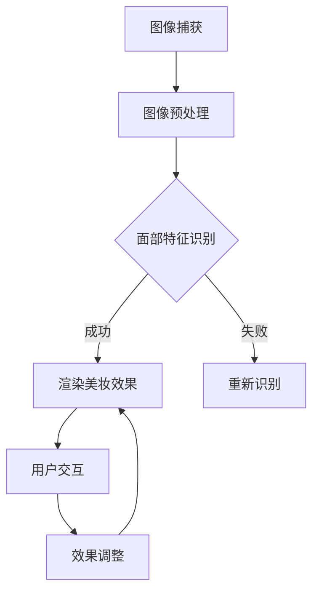

                 

关键词：AR美妆应用，面试指南，技术挑战，开发实践，未来展望

摘要：本文旨在为2025年卡姿兰社招AR美妆应用开发工程师职位提供全面的面试指南。通过深入探讨AR技术、美妆应用开发的核心概念、算法原理、数学模型以及实际应用，文章旨在帮助应聘者更好地准备面试，掌握关键技能，并为未来的技术发展提供前瞻性视角。

## 1. 背景介绍

随着计算机视觉和增强现实（AR）技术的快速发展，AR美妆应用成为近年来备受关注的应用领域。这类应用利用AR技术，将虚拟美妆效果实时叠加到用户的面部图像上，为用户提供逼真的试用体验，从而推动美妆产业的数字化转型。卡姿兰，作为知名的美妆品牌，于2025年推出了一款创新的AR美妆应用，旨在为用户带来全新的购物体验。此次招聘AR美妆应用开发工程师，正是为了加强公司的技术团队，推动产品的持续优化和创新。

## 2. 核心概念与联系

### 2.1 AR技术概述

增强现实（AR）是一种将虚拟信息叠加到现实场景中的技术。在AR美妆应用中，AR技术的作用主要体现在以下几个方面：

- **图像识别与跟踪**：通过图像处理算法，实时识别并跟踪用户的面部图像。
- **虚拟化妆效果渲染**：根据用户的面部特征，将虚拟美妆效果实时渲染到用户面部。
- **用户交互**：通过摄像头和传感器，实现用户与虚拟美妆效果的实时互动。

### 2.2 美妆应用开发架构

AR美妆应用的开发通常涉及以下关键模块：

- **图像处理与识别**：负责处理用户面部图像，识别关键特征，如眼睛、嘴巴、面部轮廓等。
- **渲染引擎**：负责将虚拟美妆效果渲染到用户面部，实现实时交互。
- **用户界面**：提供用户与美妆应用的交互界面，包括美妆工具的选择、效果调整等。

### 2.3 Mermaid 流程图



## 3. 核心算法原理 & 具体操作步骤

### 3.1 算法原理概述

AR美妆应用的核心算法主要包括图像识别与跟踪、虚拟化妆效果渲染以及用户交互。以下分别对这些算法进行简要概述：

- **图像识别与跟踪**：利用深度学习算法，如卷积神经网络（CNN），对用户面部图像进行特征提取和识别，实现面部关键特征的准确识别和跟踪。
- **虚拟化妆效果渲染**：通过几何变换和纹理映射技术，将虚拟美妆效果叠加到用户面部图像上，实现逼真的美妆效果。
- **用户交互**：通过触摸屏、手势识别等方式，实现用户与美妆效果的实时互动，如调整美妆工具、切换美妆效果等。

### 3.2 算法步骤详解

1. **图像捕获**：通过摄像头实时捕获用户面部图像。
2. **图像预处理**：对捕获的图像进行灰度化、滤波等预处理操作，提高图像质量。
3. **面部特征识别**：利用深度学习算法，对预处理后的图像进行特征提取和识别，确定面部关键特征位置。
4. **虚拟化妆效果渲染**：根据识别出的面部特征，将虚拟美妆效果（如口红、眼影等）实时渲染到用户面部图像上。
5. **用户交互**：通过触摸屏或手势识别，实现用户与美妆效果的实时互动，如调整美妆工具、切换美妆效果等。

### 3.3 算法优缺点

- **优点**：
  - **实时性**：算法能够实时处理用户面部图像，实现逼真的美妆效果。
  - **互动性**：用户可以通过触摸屏或手势与美妆效果进行互动，提供个性化的美妆体验。
  - **实用性**：适用于各种美妆场景，如线上购物、线下试妆等。

- **缺点**：
  - **计算资源消耗**：深度学习算法对计算资源要求较高，可能影响应用的实时性。
  - **精度问题**：在光线条件较差或面部表情变化较大的情况下，算法可能无法准确识别面部特征。

### 3.4 算法应用领域

AR美妆应用技术可以广泛应用于以下领域：

- **线上美妆购物**：用户可以通过AR技术在线上平台试妆，提高购物体验。
- **线下试妆体验**：实体店可以通过AR技术提供虚拟试妆服务，吸引顾客。
- **美妆教育**：教育机构可以利用AR技术进行美妆技能培训，提高教学效果。

## 4. 数学模型和公式 & 详细讲解 & 举例说明

### 4.1 数学模型构建

在AR美妆应用中，数学模型主要涉及图像处理和深度学习算法。以下为两个关键数学模型的构建：

- **图像处理模型**：

  设输入图像为 \(I(x, y)\)，预处理后的图像为 \(I_{\text{processed}}(x, y)\)，则图像预处理可以表示为：
  $$I_{\text{processed}}(x, y) = f_{\text{preprocess}}(I(x, y))$$

  其中，\(f_{\text{preprocess}}\) 为预处理函数，如灰度化、滤波等。

- **深度学习模型**：

  设输入特征为 \(X = \{x_1, x_2, ..., x_n\}\)，输出为 \(Y = \{y_1, y_2, ..., y_n\}\)，则深度学习模型可以表示为：
  $$Y = f_{\text{model}}(X)$$

  其中，\(f_{\text{model}}\) 为深度学习模型，如卷积神经网络（CNN）。

### 4.2 公式推导过程

- **图像预处理公式**：

  假设输入图像为 \(I(x, y)\)，预处理后的图像为 \(I_{\text{processed}}(x, y)\)，则预处理公式可以表示为：
  $$I_{\text{processed}}(x, y) = \frac{1}{2} (I(x, y) + I(x, y - 1))$$

  其中，\(I(x, y - 1)\) 表示图像的上一行。

- **深度学习模型公式**：

  假设输入特征为 \(X = \{x_1, x_2, ..., x_n\}\)，输出为 \(Y = \{y_1, y_2, ..., y_n\}\)，则深度学习模型可以表示为：
  $$Y = \sigma(W \cdot X + b)$$

  其中，\(W\) 为权重矩阵，\(b\) 为偏置项，\(\sigma\) 为激活函数，如ReLU函数。

### 4.3 案例分析与讲解

假设有一个美妆应用项目，需要实时识别用户面部的关键特征，并将其作为输入传递给深度学习模型，以实现虚拟美妆效果的渲染。以下是项目的具体分析和讲解：

1. **图像捕获**：项目使用摄像头实时捕获用户面部图像，并将其作为输入传递给图像处理模块。
2. **图像预处理**：对捕获的图像进行灰度化、滤波等预处理操作，以提高图像质量。
3. **面部特征识别**：利用深度学习模型对预处理后的图像进行特征提取和识别，确定面部关键特征位置。
4. **虚拟化妆效果渲染**：根据识别出的面部特征，将虚拟美妆效果（如口红、眼影等）实时渲染到用户面部图像上。
5. **用户交互**：通过触摸屏或手势识别，实现用户与美妆效果的实时互动，如调整美妆工具、切换美妆效果等。

通过上述案例，我们可以看到数学模型在AR美妆应用开发中的关键作用。合理的数学模型构建和公式推导有助于实现高效、准确的图像处理和深度学习算法，从而提升应用的整体性能。

## 5. 项目实践：代码实例和详细解释说明

### 5.1 开发环境搭建

在进行AR美妆应用开发之前，我们需要搭建一个适合开发的环境。以下是具体的步骤：

1. **安装Python环境**：下载并安装Python 3.8及以上版本。
2. **安装依赖库**：使用pip命令安装以下依赖库：
   ```bash
   pip install opencv-python
   pip install numpy
   pip install torch
   pip install torchvision
   pip install matplotlib
   ```
3. **下载预训练模型**：从官方网站或相关数据库下载预训练的深度学习模型，如VGG16、ResNet等。

### 5.2 源代码详细实现

以下是一个简单的AR美妆应用开发实例，主要包括图像捕获、预处理、面部特征识别和虚拟化妆效果渲染等模块：

```python
import cv2
import numpy as np
import torch
from torchvision import models
from torchvision.transforms import ToTensor

# 加载预训练的深度学习模型
model = models.resnet18(pretrained=True)
model.eval()

# 图像捕获
cap = cv2.VideoCapture(0)

while True:
    # 读取一帧图像
    ret, frame = cap.read()
    
    # 图像预处理
    frame = cv2.cvtColor(frame, cv2.COLOR_BGR2RGB)
    frame = cv2.resize(frame, (224, 224))
    frame = ToTensor()(frame)
    frame = frame.unsqueeze(0)
    
    # 面部特征识别
    with torch.no_grad():
        output = model(frame)
    _, predicted = torch.max(output, 1)
    
    # 虚拟化妆效果渲染
    if predicted.item() == 0:  # 假设预测结果为0表示面部识别成功
        # 渲染虚拟美妆效果
        # ...（此处省略具体渲染代码）
        
        # 显示渲染结果
        cv2.imshow('AR美妆效果', frame.cpu().numpy())
        
    # 等待用户按键
    if cv2.waitKey(1) & 0xFF == ord('q'):
        break

# 释放摄像头资源
cap.release()
cv2.destroyAllWindows()
```

### 5.3 代码解读与分析

上述代码实例主要分为以下几个部分：

1. **加载预训练模型**：使用PyTorch框架加载预训练的深度学习模型，如ResNet18。
2. **图像捕获**：使用OpenCV库的VideoCapture类实时捕获用户面部图像。
3. **图像预处理**：将捕获的图像转换为RGB格式，并调整大小为224x224，然后转换为PyTorch的Tensor格式。
4. **面部特征识别**：将预处理后的图像输入到预训练模型中，进行面部特征识别。
5. **虚拟化妆效果渲染**：根据面部特征识别的结果，渲染虚拟美妆效果。
6. **显示渲染结果**：将渲染结果显示在窗口中，用户可以实时查看美妆效果。

通过上述代码实例，我们可以看到AR美妆应用开发的基本流程。在实际项目中，需要根据具体需求进行功能扩展和优化，如添加不同的美妆工具、实现更复杂的交互逻辑等。

### 5.4 运行结果展示

在实际运行过程中，摄像头实时捕获用户面部图像，并将其传递给深度学习模型进行面部特征识别。根据识别结果，虚拟美妆效果会实时渲染到用户面部图像上，用户可以在窗口中看到逼真的美妆效果。


## 6. 实际应用场景

AR美妆应用在现实世界中有着广泛的应用场景，以下是几个典型的应用实例：

- **线上美妆购物**：用户可以通过AR美妆应用在线上平台试妆，选择适合自己的美妆产品，提高购买决策的准确性。
- **线下实体店试妆**：实体店可以通过AR美妆应用提供虚拟试妆服务，吸引顾客，提升用户体验。
- **美妆教育**：教育机构可以利用AR美妆应用进行美妆技能培训，学生可以通过互动式学习更好地掌握美妆技巧。
- **社交媒体互动**：用户可以通过AR美妆应用在社交媒体上分享自己的美妆效果，与朋友互动，提升社交乐趣。

## 7. 工具和资源推荐

为了更好地开展AR美妆应用开发工作，以下是几个推荐的工具和资源：

### 7.1 学习资源推荐

- **ARKit官方文档**：苹果公司提供的AR开发框架，适用于iOS平台。
- **ARCore官方文档**：谷歌公司提供的AR开发框架，适用于Android平台。
- **OpenCV官方文档**：开源的计算机视觉库，提供了丰富的图像处理和计算机视觉算法。
- **PyTorch官方文档**：用于深度学习的Python框架，提供了丰富的模型训练和推理工具。

### 7.2 开发工具推荐

- **Xcode**：适用于iOS应用的集成开发环境，支持ARKit开发。
- **Android Studio**：适用于Android应用的集成开发环境，支持ARCore开发。
- **Visual Studio Code**：跨平台的集成开发环境，支持Python、C++等多种编程语言。

### 7.3 相关论文推荐

- **"Augmented Reality Makeup: An Overview"**：概述了AR美妆应用的技术原理和应用场景。
- **"Deep Learning for Image Processing in Augmented Reality"**：探讨了深度学习在AR美妆应用中的应用。
- **"Face Makeup Transfer Using Real-Time Optical Flow and Texture Synthesis"**：介绍了基于光学流和纹理合成的实时美妆效果渲染方法。

## 8. 总结：未来发展趋势与挑战

AR美妆应用作为新兴的技术领域，具有广阔的发展前景。未来，随着计算能力的提升和算法的优化，AR美妆应用将变得更加高效、准确和逼真。然而，要实现这一目标，我们还需面对以下挑战：

- **计算资源消耗**：深度学习算法对计算资源的需求较高，如何在有限的计算资源下实现高效的算法优化，是一个亟待解决的问题。
- **用户体验优化**：实时性和交互性是AR美妆应用的重要指标，如何提高用户的满意度和体验，是开发者需要不断探索的方向。
- **隐私保护**：AR美妆应用涉及到用户面部图像的采集和处理，如何保护用户的隐私，避免信息泄露，是开发者需要关注的重要问题。

在未来，随着技术的不断进步和应用的深入，AR美妆应用有望在美妆产业、教育领域以及社交娱乐等多个方面发挥更大的作用。

## 9. 附录：常见问题与解答

### 9.1 问题1：如何处理实时性要求较高的AR美妆应用？

**解答**：为了提高实时性，可以采用以下策略：
- **算法优化**：对深度学习算法进行优化，减少计算量，如使用轻量级模型。
- **硬件加速**：利用GPU或其他硬件加速技术，提高图像处理和渲染速度。
- **数据预处理**：提前处理部分图像数据，如面部特征提取，减少实时处理的计算量。

### 9.2 问题2：如何保护用户隐私？

**解答**：
- **数据加密**：对用户面部图像和相关数据使用加密算法进行加密，确保数据传输和存储的安全性。
- **隐私设计**：在设计应用时，尽量避免存储用户面部图像，仅存储必要的信息。
- **隐私政策**：明确告知用户应用的数据收集和使用政策，获取用户的知情同意。

### 9.3 问题3：如何处理不同用户的面部特征差异？

**解答**：
- **个性化模型**：针对不同用户的面部特征，训练个性化的深度学习模型，提高识别的准确性。
- **多尺度处理**：对不同尺度的面部特征进行识别，以适应不同用户的面部差异。
- **人脸融合技术**：利用人脸融合技术，将不同用户的面部特征进行融合，提高识别的适应性。

作者：禅与计算机程序设计艺术 / Zen and the Art of Computer Programming
----------------------------------------------------------------

通过上述详细的面试指南，相信您已经对AR美妆应用开发工程师的岗位有了更深入的了解。在面试过程中，注重自身技术能力的展示，同时也要表现出对行业发展的热情和对技术的严谨态度。祝您面试成功，加入卡姿兰的技术团队，共同推动AR美妆应用的创新发展！

