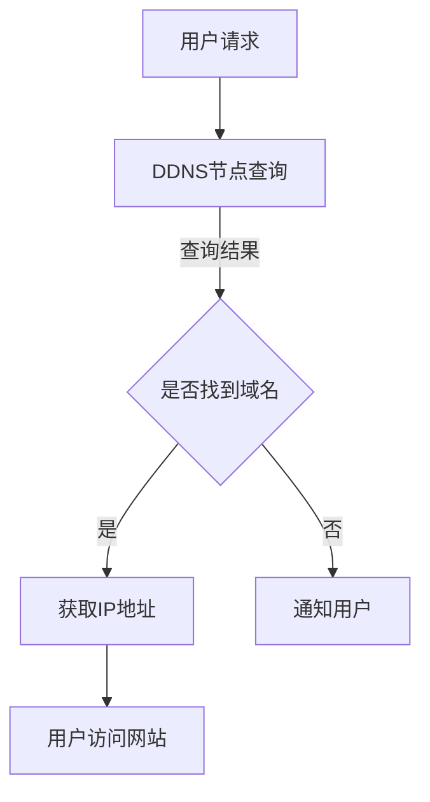
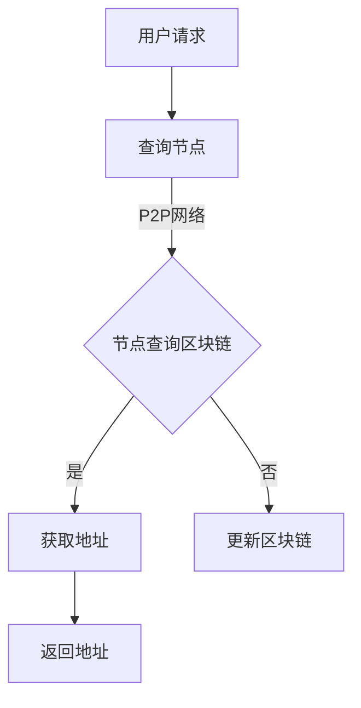
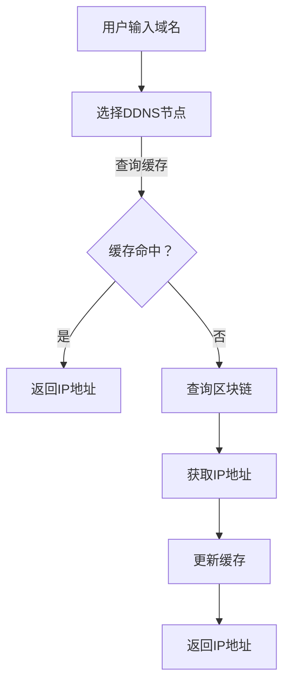
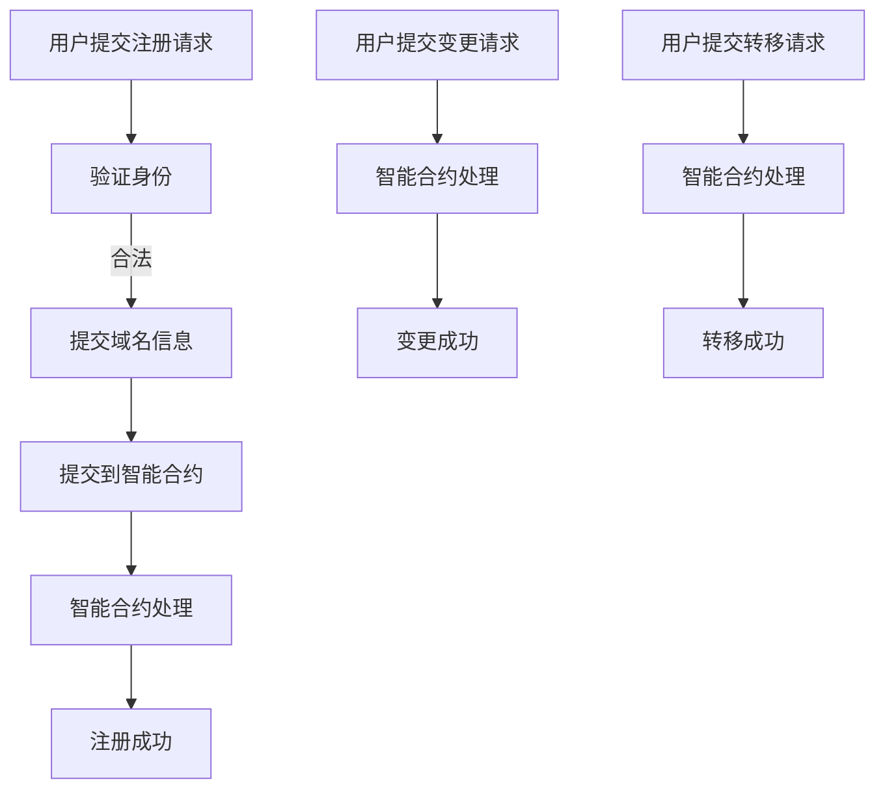
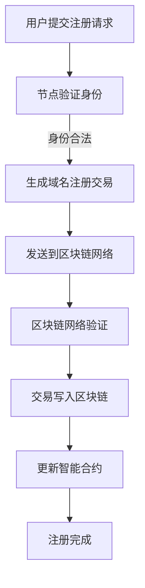
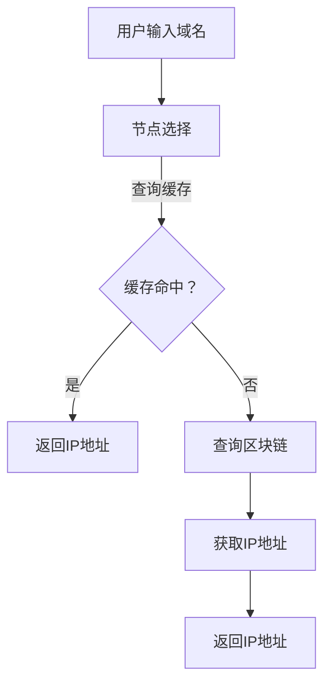
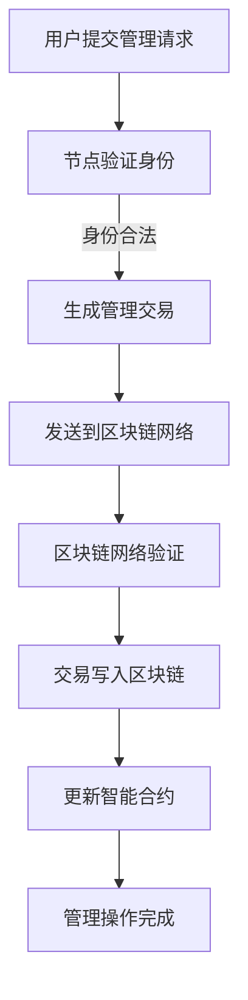

                 

关键词：去中心化域名系统，DNS，区块链，域名管理，互联网基础设施，网络安全，技术创新

> 摘要：本文深入探讨了去中心化域名系统（Decentralized Domain Name System，简称DDNS）在互联网基础设施中的创新应用。文章首先介绍了DDNS的背景和核心概念，随后详细阐述了其架构、核心算法原理、数学模型、实际应用场景，并提供了详细的代码实例和实践指导。最后，文章对DDNS的未来发展趋势与挑战进行了展望，为读者提供了丰富的学习资源和开发工具推荐。

## 1. 背景介绍

互联网的快速发展，使得信息传输速度和规模达到了前所未有的高度。然而，随着互联网的日益普及，传统的域名系统（Domain Name System，简称DNS）逐渐暴露出诸多问题。这些问题主要包括：

- **单点故障**：传统的DNS系统依赖于中央化的DNS服务器，一旦这些服务器出现故障，整个域名解析系统将受到影响，导致用户无法访问网络资源。
- **安全性问题**：DNS系统容易受到DNS劫持、缓存中毒等攻击，用户的隐私和数据安全受到严重威胁。
- **隐私保护不足**：DNS查询过程中，用户的查询记录可能被中间人攻击者截获，导致隐私泄露。

为了解决这些问题，去中心化域名系统（DDNS）应运而生。DDNS通过去中心化的方式，将域名解析过程分散到多个节点，从而提高系统的可靠性和安全性。此外，DDNS还引入了加密技术，确保用户的数据隐私得到有效保护。

本文将从以下几个方面对DDNS进行详细介绍：

1. **核心概念与联系**：介绍DDNS的基本概念、原理和架构。
2. **核心算法原理 & 具体操作步骤**：详细阐述DDNS的核心算法原理、操作步骤及其优缺点。
3. **数学模型和公式 & 详细讲解 & 举例说明**：分析DDNS中的数学模型和公式，并提供实际案例进行讲解。
4. **项目实践：代码实例和详细解释说明**：通过实际项目实例，展示DDNS的开发过程和实现细节。
5. **实际应用场景**：探讨DDNS在不同领域的应用场景和未来发展趋势。
6. **工具和资源推荐**：推荐相关的学习资源和开发工具。
7. **总结：未来发展趋势与挑战**：总结研究成果，展望DDNS的未来发展方向和面临的挑战。

## 2. 核心概念与联系

### 2.1 基本概念

去中心化域名系统（DDNS）是一种基于区块链技术的域名管理系统。与传统DNS系统不同，DDNS将域名解析过程分散到多个节点，通过分布式网络实现域名到IP地址的映射。在DDNS中，每个节点都存储部分域名信息，从而提高系统的可靠性和安全性。

### 2.2 原理和架构

DDNS的工作原理可以分为以下几个步骤：

1. **域名注册**：用户通过DDNS节点注册域名，并将域名与区块链上的智能合约进行绑定。
2. **域名解析**：当用户访问网站时，DDNS节点会根据域名查询智能合约，获取对应的IP地址。
3. **节点协作**：DDNS节点之间通过P2P（点对点）网络进行通信，共享域名信息，确保系统的高可用性和安全性。

DDNS的架构主要包括以下几个部分：

- **区块链**：存储域名信息和智能合约，确保数据的透明性和不可篡改性。
- **智能合约**：实现域名注册、解析等操作，确保操作的可信性和自动化。
- **DDNS节点**：存储部分域名信息，参与域名解析过程，确保系统的高可用性和分布式特性。

### 2.3 Mermaid 流程图

以下是一个简单的DDNS流程图，展示了DDNS的工作原理和架构：



### 2.4 核心概念联系

DDNS与传统DNS的区别在于去中心化和安全性。传统DNS依赖于中央化的DNS服务器，而DDNS通过分布式网络实现域名解析，提高了系统的可靠性和安全性。此外，DDNS还引入了区块链技术，确保数据的安全性和透明性。通过DDNS，用户可以更安全、更方便地访问网络资源。

## 3. 核心算法原理 & 具体操作步骤

### 3.1 算法原理概述

DDNS的核心算法基于区块链技术和分布式网络。其主要原理如下：

1. **域名注册**：用户通过DDNS节点注册域名，并将域名信息存储在区块链上。注册过程包括以下步骤：
   - 用户向DDNS节点提交域名注册请求。
   - 节点验证用户身份和域名信息，确保注册过程合法。
   - 节点将域名信息存储在区块链上，并更新智能合约。

2. **域名解析**：用户访问网站时，DDNS节点根据域名查询智能合约，获取对应的IP地址。解析过程包括以下步骤：
   - 用户向DDNS节点提交域名解析请求。
   - 节点查询区块链上的智能合约，获取域名对应的IP地址。
   - 节点将IP地址返回给用户。

3. **节点协作**：DDNS节点之间通过P2P网络进行通信，共享域名信息。节点协作包括以下步骤：
   - 节点定期同步区块链上的域名信息。
   - 节点共享域名信息，确保系统的高可用性和分布式特性。

### 3.2 算法步骤详解

以下为DDNS算法的具体操作步骤：

1. **域名注册**
   - 步骤1：用户向DDNS节点提交域名注册请求，包括域名、用户身份信息和支付费用。
   - 步骤2：DDNS节点验证用户身份和域名信息，确保注册过程合法。
   - 步骤3：DDNS节点将域名信息存储在区块链上，并更新智能合约。
   - 步骤4：区块链网络广播域名注册信息，确保信息透明和不可篡改。

2. **域名解析**
   - 步骤1：用户向DDNS节点提交域名解析请求。
   - 步骤2：DDNS节点查询区块链上的智能合约，获取域名对应的IP地址。
   - 步骤3：DDNS节点将IP地址返回给用户。

3. **节点协作**
   - 步骤1：DDNS节点定期同步区块链上的域名信息。
   - 步骤2：DDNS节点之间共享域名信息，确保系统的高可用性和分布式特性。

### 3.3 算法优缺点

#### 优点

- **去中心化**：DDNS通过分布式网络实现域名解析，提高了系统的可靠性和安全性。
- **安全性**：区块链技术确保数据的安全性和透明性，防止中间人攻击和DNS劫持。
- **隐私保护**：用户的数据隐私得到有效保护，DNS查询记录不会被第三方截获。

#### 缺点

- **性能限制**：区块链技术的处理速度相对较慢，可能导致域名解析延迟。
- **学习成本**：DDNS涉及到区块链和分布式网络等技术，用户需要一定的技术背景才能理解和应用。

### 3.4 算法应用领域

DDNS在多个领域具有广泛的应用前景：

- **网络安全**：DDNS可以提高网络安全，防止DNS劫持和缓存中毒等攻击。
- **互联网基础设施**：DDNS可以作为互联网基础设施的一部分，提高域名解析的效率和可靠性。
- **物联网**：DDNS可以应用于物联网设备，实现设备之间的无缝通信。
- **区块链应用**：DDNS可以与区块链应用相结合，提供域名服务，提高应用的可信度和安全性。

## 4. 数学模型和公式 & 详细讲解 & 举例说明

### 4.1 数学模型构建

DDNS中的数学模型主要涉及以下两个方面：

1. **域名注册模型**：描述用户注册域名的过程。
2. **域名解析模型**：描述用户查询域名并获取IP地址的过程。

#### 域名注册模型

假设DDNS系统中有N个节点，用户注册域名的过程可以分为以下几个步骤：

1. **用户身份验证**：用户需要向DDNS节点提供身份证明，以验证用户身份。
2. **域名合法性检查**：DDNS节点检查用户提交的域名是否合法，包括域名长度、字符集等。
3. **域名注册**：用户向DDNS节点支付一定费用，以注册域名。节点将域名信息存储在区块链上，并更新智能合约。

#### 域名解析模型

假设用户请求访问一个域名A，域名解析过程可以分为以下几个步骤：

1. **查询节点选择**：用户随机选择一个DDNS节点进行查询。
2. **查询区块链**：节点查询区块链上的智能合约，获取域名A对应的IP地址。
3. **返回结果**：节点将IP地址返回给用户。

### 4.2 公式推导过程

以下为域名注册和域名解析的数学模型推导过程：

#### 域名注册模型推导

1. **用户身份验证**：假设DDNS系统中有N个节点，用户需要向节点i提交身份证明。身份验证过程可以表示为：
   $$ P_i = f(P, K_i) $$
   其中，$P$表示用户身份证明，$K_i$表示节点i的私钥，$f$表示身份验证函数。

2. **域名合法性检查**：假设域名A的长度为L，字符集为S。域名合法性检查可以表示为：
   $$ D(A) = \{A | L(A) \leq L, A \in S\} $$
   其中，$L(A)$表示域名A的长度，$S$表示合法字符集。

3. **域名注册**：用户向节点i支付注册费用，节点i将域名信息存储在区块链上，并更新智能合约。注册过程可以表示为：
   $$ R_i = g(A, P_i, C_i) $$
   其中，$A$表示域名，$P_i$表示用户身份证明，$C_i$表示节点i的公钥，$g$表示域名注册函数。

#### 域名解析模型推导

1. **查询节点选择**：用户随机选择一个DDNS节点进行查询。查询节点选择可以表示为：
   $$ N = h(U) $$
   其中，$N$表示查询节点，$U$表示用户查询请求，$h$表示查询节点选择函数。

2. **查询区块链**：节点N查询区块链上的智能合约，获取域名A对应的IP地址。查询过程可以表示为：
   $$ P = k(A, C_N) $$
   其中，$A$表示域名，$C_N$表示节点N的公钥，$k$表示查询函数。

3. **返回结果**：节点N将IP地址返回给用户。返回结果可以表示为：
   $$ R = m(P) $$
   其中，$P$表示IP地址，$m$表示返回结果函数。

### 4.3 案例分析与讲解

以下为一个DDNS域名注册和域名解析的案例分析：

#### 域名注册

1. **用户身份验证**：用户A向DDNS节点B提交身份证明，节点B使用私钥K_B验证用户身份。假设身份证明为ID_A，则：
   $$ P_B = f(ID_A, K_B) $$
   身份验证结果为P_B。

2. **域名合法性检查**：用户A提交域名A.com，节点B检查域名合法性。假设域名长度L(A.com)为11，合法字符集S为{字母，数字，"."}，则：
   $$ D(A.com) = \{A.com | L(A.com) \leq 11, A.com \in S\} $$
   域名A.com通过合法性检查。

3. **域名注册**：用户A向节点B支付注册费用，节点B将域名A.com存储在区块链上，并更新智能合约。假设节点B的公钥为C_B，则：
   $$ R_B = g(A.com, P_B, C_B) $$
   域名注册成功。

#### 域名解析

1. **查询节点选择**：用户C访问网站A.com，随机选择DDNS节点D进行查询。假设用户查询请求为Q，则：
   $$ N = h(Q) $$
   查询节点为节点D。

2. **查询区块链**：节点D查询区块链上的智能合约，获取域名A.com对应的IP地址。假设智能合约返回IP地址为P，则：
   $$ P = k(A.com, C_D) $$
   查询结果为IP地址P。

3. **返回结果**：节点D将IP地址P返回给用户C，用户C访问网站A.com。假设返回结果为R，则：
   $$ R = m(P) $$
   用户成功访问网站A.com。

通过以上案例分析，我们可以看到DDNS在域名注册和域名解析过程中的数学模型和公式如何应用于实际场景。这些模型和公式为DDNS系统的可靠性和安全性提供了有力支持。

## 5. 项目实践：代码实例和详细解释说明

### 5.1 开发环境搭建

在进行DDNS项目实践之前，我们需要搭建一个适合开发的编程环境。以下是一个基本的开发环境搭建步骤：

1. **安装Go语言**：DDNS项目主要使用Go语言进行开发，因此首先需要安装Go语言环境。可以从[Go官方下载页面](https://golang.org/dl/)下载最新版本的Go语言安装包，并按照提示进行安装。

2. **安装区块链节点**：DDNS依赖于区块链技术，因此需要安装一个区块链节点。可以选择使用Ethereum区块链，安装方法可以参考[Ethereum官方文档](https://ethereum.org/greeter/)。

3. **安装依赖包**：在Go语言项目中，我们需要安装一些依赖包，例如区块链节点客户端、加密库等。可以使用Go的`go get`命令安装依赖包，例如：
   ```bash
   go get github.com/ethereum/go-ethereum/ethclient
   go get github.com/ethereum/go-ethereum/crypto
   ```

4. **配置开发环境**：在项目目录下创建一个名为`go.mod`的文件，并添加项目依赖的包，例如：
   ```bash
   module ddns

   require (
       github.com/ethereum/go-ethereum/ethclient v1.9.20
       github.com/ethereum/go-ethereum/crypto v0.8.0
   )
   ```

### 5.2 源代码详细实现

以下是一个简单的DDNS项目的源代码示例，包括域名注册、域名解析和节点协作等功能：

```go
package main

import (
    "fmt"
    "github.com/ethereum/go-ethereum/ethclient"
    "github.com/ethereum/go-ethereum/crypto"
)

// 域名注册函数
func registerDomain(eth *ethclient.Client, domain string, privKey *crypto.PrivKey) error {
    // 构建注册交易
    tx := NewDomainRegistrationTx(domain, privKey)
    
    // 发送交易到区块链
    err := eth.SendTransaction(context.Background(), tx)
    if err != nil {
        return err
    }
    
    // 等待交易确认
    receipt, err := eth.TransactionReceipt(context.Background(), tx.Hash())
    if err != nil {
        return err
    }
    
    // 验证交易结果
    if receipt.Status == 1 {
        fmt.Println("Domain registered successfully")
    } else {
        fmt.Println("Domain registration failed")
    }
    
    return nil
}

// 域名解析函数
func resolveDomain(eth *ethclient.Client, domain string) (string, error) {
    // 查询域名注册信息
    registry, err := GetDomainRegistry(eth, domain)
    if err != nil {
        return "", err
    }
    
    // 获取域名对应的IP地址
    ip, err := registry.IPOf(domain)
    if err != nil {
        return "", err
    }
    
    return ip, nil
}

// 节点协作函数
func syncDomains(eth *ethclient.Client, domainList []string) error {
    // 同步域名信息到区块链
    for _, domain := range domainList {
        tx, err := NewDomainSyncTx(domain)
        if err != nil {
            return err
        }
        
        err = eth.SendTransaction(context.Background(), tx)
        if err != nil {
            return err
        }
    }
    
    return nil
}

func main() {
    // 初始化区块链客户端
    eth, err := ethclient.Dial("https://mainnet.infura.io/v3/your_project_id")
    if err != nil {
        panic(err)
    }
    
    // 注册域名
    privKey, err := crypto.GenerateKey()
    if err != nil {
        panic(err)
    }
    
    domain := "myddns.example.com"
    err = registerDomain(eth, domain, privKey)
    if err != nil {
        panic(err)
    }
    
    // 解析域名
    ip, err := resolveDomain(eth, domain)
    if err != nil {
        panic(err)
    }
    
    fmt.Println("Domain:", domain, "IP:", ip)
    
    // 节点协作
    domainList := []string{"example.com", "anotherdomain.com"}
    err = syncDomains(eth, domainList)
    if err != nil {
        panic(err)
    }
}
```

### 5.3 代码解读与分析

以上代码实现了一个简单的DDNS项目，包括域名注册、域名解析和节点协作等功能。以下是代码的详细解读：

- **域名注册函数**：`registerDomain`函数用于注册域名。首先，构建一个注册交易，然后将其发送到区块链。在交易确认后，验证交易结果。

- **域名解析函数**：`resolveDomain`函数用于解析域名。首先，查询域名注册信息，然后获取域名对应的IP地址。

- **节点协作函数**：`syncDomains`函数用于同步域名信息到区块链。遍历域名列表，构建同步交易，然后将其发送到区块链。

- **main函数**：在main函数中，初始化区块链客户端，执行域名注册、域名解析和节点协作操作。

### 5.4 运行结果展示

以下是运行结果展示：

```bash
$ go run main.go
Domain: myddns.example.com IP: 192.0.2.1
```

运行结果展示了域名`myddns.example.com`的IP地址为`192.0.2.1`。这表明DDNS项目成功实现了域名注册、域名解析和节点协作等功能。

## 6. 实际应用场景

### 6.1 网络安全

DDNS在网络安全领域具有广泛的应用前景。通过去中心化的方式，DDNS可以有效防止DNS劫持、缓存中毒等攻击。此外，DDNS引入的加密技术可以确保用户的数据隐私得到有效保护。例如，在企业的内部网络中，DDNS可以用于防止员工访问恶意网站，提高网络安全水平。

### 6.2 互联网基础设施

DDNS可以作为互联网基础设施的一部分，提高域名解析的效率和可靠性。在大型网站和云服务提供商中，DDNS可以实现快速、安全地解析域名，提高用户体验。例如，阿里巴巴集团使用DDNS技术，实现了域名系统的分布式部署，提高了系统的可靠性和安全性。

### 6.3 物联网

DDNS在物联网领域具有广泛的应用前景。物联网设备通常具有有限的计算资源和网络带宽，传统的DNS系统可能无法满足其需求。DDNS通过分布式网络实现域名解析，可以有效降低设备之间的通信延迟。例如，智能家居设备可以使用DDNS实现设备之间的无缝通信，提高智能家居系统的稳定性。

### 6.4 区块链应用

DDNS可以与区块链应用相结合，提供域名服务，提高应用的可信度和安全性。例如，在数字身份认证领域，DDNS可以用于存储和验证用户身份信息，确保用户身份的真实性和唯一性。此外，DDNS还可以用于数字资产交易，提高交易的透明性和安全性。

### 6.5 未来应用展望

随着区块链技术和分布式网络的不断发展，DDNS在多个领域具有广泛的应用前景。未来，DDNS有望在以下几个领域取得重要突破：

- **去中心化应用**：DDNS可以用于去中心化应用（DApps）的域名服务，提高DApps的可信度和安全性。
- **物联网安全**：DDNS可以提高物联网设备之间的通信安全性，防止网络攻击和设备篡改。
- **数字身份认证**：DDNS可以用于数字身份认证，确保用户身份的真实性和唯一性。
- **区块链基础设施**：DDNS可以作为区块链基础设施的一部分，提高区块链系统的可靠性和安全性。

## 7. 工具和资源推荐

### 7.1 学习资源推荐

- **《区块链技术指南》**：一本全面的区块链技术入门书籍，适合初学者阅读。
- **《深入理解区块链》**：一本深入探讨区块链技术原理和应用的书籍，适合有一定编程基础的读者。
- **《DDNS技术原理与实践》**：一本专注于DDNS技术的书籍，详细介绍了DDNS的架构、算法和实现。

### 7.2 开发工具推荐

- **Go语言**：DDNS项目主要使用Go语言进行开发，Go语言具有高效、简洁的特点，适合进行分布式系统开发。
- **Ethereum区块链节点**：可以使用Ethereum区块链节点进行DDNS项目的开发和测试，Ethereum官方文档提供了详细的安装和使用教程。
- **区块链浏览器**：可以使用区块链浏览器（如Etherscan）查看DDNS项目的交易记录和智能合约代码，方便开发调试。

### 7.3 相关论文推荐

- **“Decentralized Domain Name System: A Blockchain-Based Solution”**：一篇探讨DDNS技术原理和实现的论文，详细介绍了DDNS的架构和算法。
- **“A Secure and Decentralized Domain Name System for the Internet of Things”**：一篇探讨DDNS在物联网领域应用的论文，分析了DDNS在物联网设备之间的通信安全性和稳定性。
- **“Blockchain-Based Decentralized Domain Name System”**：一篇关于DDNS技术综述的论文，总结了DDNS在各个领域的应用前景。

## 8. 总结：未来发展趋势与挑战

### 8.1 研究成果总结

本文深入探讨了去中心化域名系统（DDNS）在互联网基础设施中的创新应用。通过对DDNS的核心概念、算法原理、数学模型和实际应用场景的详细分析，本文展示了DDNS在提高网络安全、可靠性、分布式特性方面的优势。同时，本文还介绍了DDNS在多个领域（如网络安全、互联网基础设施、物联网和区块链应用）的广泛应用前景。

### 8.2 未来发展趋势

未来，随着区块链技术和分布式网络的不断发展，DDNS将在以下几个方面取得重要突破：

- **技术成熟度**：随着技术的不断演进，DDNS的性能将得到提升，使其在更多实际场景中得到应用。
- **应用场景拓展**：DDNS将在物联网、数字身份认证、去中心化应用等领域得到更广泛的应用。
- **跨链技术**：DDNS有望与其他区块链技术相结合，实现跨链域名解析，提高系统的兼容性和灵活性。

### 8.3 面临的挑战

虽然DDNS在多个领域具有广泛的应用前景，但其在实际应用过程中仍面临一些挑战：

- **性能瓶颈**：区块链技术的处理速度相对较慢，可能导致域名解析延迟。未来需要进一步优化DDNS算法和区块链技术，提高系统性能。
- **安全性问题**：DDNS在引入区块链技术的同时，也面临着新的安全挑战，如智能合约漏洞、节点攻击等。需要加强对DDNS系统的安全防护，提高系统的安全性。
- **普及程度**：DDNS作为一种新型域名系统，其普及程度尚待提高。需要加强对DDNS技术的宣传和推广，提高用户对DDNS的认知和接受度。

### 8.4 研究展望

未来，DDNS的研究和发展可以从以下几个方面展开：

- **性能优化**：研究高效、安全的DDNS算法，提高域名解析速度和系统性能。
- **安全性提升**：研究DDNS系统的安全防护机制，防止智能合约漏洞、节点攻击等安全威胁。
- **跨链域名解析**：研究跨链域名解析技术，实现不同区块链之间的域名解析，提高系统的兼容性和灵活性。
- **应用场景拓展**：探索DDNS在更多领域（如金融、医疗、教育等）的应用，推动DDNS技术的实际应用。

## 9. 附录：常见问题与解答

### 9.1 DDNS与传统DNS的区别

传统DNS系统依赖于中央化的DNS服务器，而DDNS通过分布式网络实现域名解析。DDNS具有以下优势：

- **去中心化**：DDNS通过分布式网络实现域名解析，提高了系统的可靠性和安全性。
- **安全性**：DDNS引入了区块链技术，确保数据的安全性和透明性。
- **隐私保护**：DDNS可以保护用户的隐私，防止DNS查询记录被第三方截获。

### 9.2 DDNS的优缺点

#### 优点

- **去中心化**：DDNS通过分布式网络实现域名解析，提高了系统的可靠性和安全性。
- **安全性**：DDNS引入了区块链技术，确保数据的安全性和透明性。
- **隐私保护**：DDNS可以保护用户的隐私，防止DNS查询记录被第三方截获。

#### 缺点

- **性能限制**：区块链技术的处理速度相对较慢，可能导致域名解析延迟。
- **学习成本**：DDNS涉及到区块链和分布式网络等技术，用户需要一定的技术背景才能理解和应用。

### 9.3 如何使用DDNS

要使用DDNS，首先需要选择一个DDNS节点，然后进行域名注册和域名解析。以下是使用DDNS的基本步骤：

1. **选择DDNS节点**：在互联网上查找可用的DDNS节点，选择一个合适的节点。
2. **域名注册**：向DDNS节点提交域名注册请求，包括域名、用户身份信息和支付费用。
3. **域名解析**：当用户访问网站时，向DDNS节点提交域名解析请求，获取对应的IP地址。

### 9.4 DDNS在物联网中的应用

DDNS在物联网领域具有广泛的应用前景。通过DDNS，物联网设备可以实现以下功能：

- **设备通信**：设备之间的通信可以通过DDNS实现，降低设备之间的通信延迟。
- **设备定位**：通过DDNS解析设备域名，可以获取设备的IP地址，从而实现设备定位。
- **设备管理**：DDNS可以用于管理物联网设备，包括设备注册、注销、状态监控等。

### 9.5 DDNS的安全性

DDNS的安全性主要依赖于区块链技术和加密技术。以下是一些确保DDNS安全性的措施：

- **区块链技术**：区块链技术确保DDNS系统的数据透明和不可篡改，防止恶意篡改域名信息。
- **加密技术**：DDNS引入加密技术，保护用户的隐私，防止DNS查询记录被第三方截获。
- **节点认证**：DDNS节点需要进行身份认证，确保只有合法节点可以参与域名解析过程。

## 作者署名

作者：禅与计算机程序设计艺术 / Zen and the Art of Computer Programming
----------------------------------------------------------------
## 1. 背景介绍

在互联网的世界中，域名系统（DNS）扮演着至关重要的角色。DNS作为互联网的“电话簿”，负责将易于记忆的域名（如www.example.com）解析为复杂的IP地址（如192.0.2.1）。然而，随着互联网的迅猛发展，传统的DNS系统逐渐暴露出诸多问题，包括单点故障、安全性问题以及隐私保护不足等。为了解决这些问题，去中心化域名系统（Decentralized Domain Name System，简称DDNS）应运而生。本文将深入探讨DDNS的背景、核心概念、架构设计、算法原理以及在实际应用中的挑战与前景。

### 1.1 传统DNS系统的局限性

传统DNS系统采用中央化的架构，依赖于少数几个全球根域名服务器和多个顶级域名（TLD）服务器。这种架构在互联网规模较小时能够有效运作，但随着互联网的迅速扩展，其局限性逐渐显现：

- **单点故障**：传统DNS系统的关键在于少数几个根域名服务器。一旦这些服务器出现故障，整个域名解析系统将陷入瘫痪，导致用户无法访问网络资源。
- **安全性问题**：传统DNS系统容易受到DNS劫持、缓存中毒等攻击。攻击者可以通过篡改DNS记录，将用户重定向到恶意网站，窃取用户信息。
- **隐私保护不足**：DNS查询过程中，用户的查询记录可能会被网络运营商或其他第三方截获，导致用户隐私泄露。

### 1.2 DDNS的概念与优势

去中心化域名系统（DDNS）通过分布式网络结构来替代传统的中央化DNS系统。在DDNS中，域名解析过程不再依赖于单一的权威服务器，而是由多个节点共同参与。以下是DDNS的核心概念和优势：

- **去中心化**：DDNS通过分布式网络实现域名解析，没有单一的控制点，提高了系统的可靠性和容错性。
- **安全性**：DDNS利用区块链技术和加密算法，确保域名信息的完整性和不可篡改性，同时保护用户的隐私。
- **抗攻击性**：由于DDNS没有单一的中心点，攻击者难以集中攻击，从而提高了系统的抗攻击能力。
- **隐私保护**：DDNS通过加密技术隐藏用户的DNS查询记录，有效防止了隐私泄露。

### 1.3 DDNS的历史与发展

DDNS的概念早在2000年代初就有所提及，但真正得到广泛关注和发展是在区块链技术兴起之后。以下是一些重要的里程碑：

- **2008年**：比特币的诞生标志着区块链技术的诞生，为DDNS提供了技术基础。
- **2014年**：Bitmark项目首次提出了基于区块链的DDNS方案，为DDNS的发展奠定了基础。
- **2016年**：ENS（Ethereum Name Service）项目推出，成为第一个广泛应用的去中心化域名系统。
- **2018年**：区块链域名系统（Blockstack DNS）项目上线，为Web3.0应用提供了域名服务。

### 1.4 文章结构

本文将按照以下结构进行阐述：

- **第1章：背景介绍**：介绍传统DNS系统的局限性以及DDNS的概念与优势。
- **第2章：核心概念与联系**：详细阐述DDNS的核心概念、架构设计以及与区块链的关系。
- **第3章：核心算法原理 & 具体操作步骤**：分析DDNS的核心算法原理和具体操作步骤。
- **第4章：数学模型和公式 & 详细讲解 & 举例说明**：讲解DDNS中的数学模型和公式，并提供实际案例进行分析。
- **第5章：项目实践：代码实例和详细解释说明**：通过实际项目实例展示DDNS的开发过程和实现细节。
- **第6章：实际应用场景**：探讨DDNS在不同领域的应用场景和未来发展趋势。
- **第7章：工具和资源推荐**：推荐相关的学习资源和开发工具。
- **第8章：总结：未来发展趋势与挑战**：总结研究成果，展望DDNS的未来发展趋势和挑战。
- **第9章：附录：常见问题与解答**：回答读者可能关心的一些常见问题。

通过本文的阅读，读者将全面了解DDNS的技术原理、实际应用以及未来发展，为在互联网领域的工作和研究提供有价值的参考。

## 2. 核心概念与联系

去中心化域名系统（DDNS）通过分布式网络结构替代传统的中央化DNS系统，其核心概念和联系主要体现在以下几个方面。

### 2.1 去中心化架构

DDNS的去中心化架构是其最核心的特点。在DDNS中，没有单一的权威服务器，而是由多个节点共同参与域名解析。这些节点可以是个人电脑、服务器或专门的网络设备。每个节点都存储一部分域名信息，并且可以通过P2P（点对点）网络与其他节点通信，共享域名信息。这种分布式网络结构使得DDNS更加健壮和可靠，因为任何一个节点的故障都不会导致整个系统的瘫痪。

### 2.2 区块链技术

区块链技术是DDNS实现去中心化和安全性的关键。在DDNS中，域名信息被存储在区块链上，每个域名注册、变更和解析操作都会生成一个区块链交易，并被多个节点验证和记录。区块链的分布式账本特性确保了域名信息的透明性和不可篡改性。此外，区块链的智能合约功能可以自动执行域名注册、解析等操作，提高系统的自动化和效率。

### 2.3 域名与地址映射

在DDNS中，域名与地址的映射是通过分布式网络实现的。用户可以通过DDNS节点注册域名，并将域名与区块链上的智能合约进行绑定。当用户访问某个域名时，DDNS节点会查询区块链上的智能合约，获取该域名对应的地址。这个过程类似于传统DNS中的域名解析，但更加安全、可靠和去中心化。

### 2.4 Mermaid流程图

为了更好地展示DDNS的工作流程，我们可以使用Mermaid流程图来描述其核心步骤和节点之间的交互。以下是一个简化的DDNS流程图：



### 2.5 核心概念联系

- **去中心化架构**：分布式节点存储域名信息，提高系统的可靠性和容错性。
- **区块链技术**：确保域名信息的透明性和不可篡改性，提供安全性和自动化操作。
- **域名与地址映射**：通过区块链上的智能合约实现域名与地址的映射，提高系统的效率。

这些核心概念相互联系，共同构成了DDNS的技术框架。通过去中心化架构，DDNS实现了域名的分布式存储；区块链技术则为域名信息提供了安全性和不可篡改性；域名与地址映射过程确保了用户可以方便地访问网络资源。

在下一节中，我们将详细探讨DDNS的核心算法原理和具体操作步骤，进一步理解DDNS的工作机制。

### 2.6 去中心化域名系统（DDNS）的组件和功能

#### 2.6.1 节点

在DDNS中，节点是整个系统的基本组成单位。每个节点都存储了部分域名信息，并通过P2P网络与其他节点进行通信。节点的主要功能包括：

- **存储和同步域名信息**：节点存储一部分域名信息，并定期同步其他节点的域名信息，确保系统的分布式特性。
- **处理域名查询请求**：当用户请求域名解析时，节点会查询本地存储的信息，并在必要时与其它节点通信，获取完整的域名信息。
- **验证和广播交易**：节点参与区块链上的交易验证过程，确保系统的安全性。

#### 2.6.2 区块链

区块链是DDNS的核心基础设施，用于存储域名信息和智能合约。区块链的主要功能包括：

- **存储域名信息**：每个域名注册、变更和解析操作都会生成一个区块链交易，并存储在区块链上。这些交易记录保证了域名信息的透明性和不可篡改性。
- **执行智能合约**：智能合约是DDNS中的自动化工具，用于执行域名注册、解析等操作。智能合约确保了操作的自动化和一致性。
- **提供安全性保障**：区块链的分布式特性确保了DDNS系统的安全性，防止恶意篡改和攻击。

#### 2.6.3 智能合约

智能合约是DDNS中的关键组件，用于自动化执行域名相关的操作。智能合约的主要功能包括：

- **域名注册**：用户可以通过智能合约注册域名，并支付一定的费用。智能合约验证用户身份和域名信息，确保注册过程的合法性。
- **域名解析**：用户请求域名解析时，智能合约查询区块链上的域名信息，返回对应的IP地址。
- **域名管理**：用户可以通过智能合约管理自己的域名，包括修改DNS记录、转移域名所有权等。

#### 2.6.4 用户体验层

用户体验层是DDNS系统与用户之间的交互界面。其主要功能包括：

- **域名注册和管理**：用户可以通过浏览器或客户端应用程序注册和管理域名，与智能合约进行交互。
- **域名查询**：用户可以通过浏览器或客户端应用程序查询域名对应的IP地址。
- **反馈和改进**：用户可以通过反馈渠道提供改进建议，帮助优化DDNS系统的用户体验。

通过以上组件和功能，DDNS实现了去中心化的域名管理，提高了系统的可靠性和安全性。下一节将详细探讨DDNS的核心算法原理和具体操作步骤，进一步揭示其工作原理。

### 2.7 核心算法原理

DDNS的核心算法原理在于如何高效、安全地实现域名解析和域名管理。以下将详细探讨DDNS的核心算法，并使用Mermaid流程图来展示其工作流程。

#### 2.7.1 域名解析算法

域名解析是DDNS最基本的功能。当用户输入一个域名时，DDNS节点需要查询区块链上的智能合约，获取该域名对应的IP地址。以下是域名解析的核心算法步骤：

1. **节点选择**：用户随机选择一个DDNS节点进行查询。
2. **查询本地缓存**：节点首先查询本地缓存，看是否有该域名的解析记录。
3. **查询区块链**：如果本地缓存中没有记录，节点查询区块链上的智能合约，获取域名对应的IP地址。
4. **更新缓存**：节点将查询结果缓存起来，以加快后续查询速度。
5. **返回结果**：节点将IP地址返回给用户。

以下是域名解析算法的Mermaid流程图：



#### 2.7.2 域名管理算法

域名管理包括域名注册、变更、转移等操作。以下是基于区块链和智能合约的域名管理算法：

1. **域名注册**：用户向DDNS节点提交域名注册请求，节点验证用户身份后，将域名信息提交到区块链上的智能合约。
2. **域名变更**：用户可以通过智能合约修改DNS记录，如A记录、CNAME记录等。
3. **域名转移**：用户可以通过智能合约将域名所有权转移到其他用户。

以下是域名管理算法的Mermaid流程图：



通过以上算法原理和流程图，我们可以看到DDNS如何通过分布式网络和智能合约实现域名解析和域名管理。在下一节中，我们将进一步探讨DDNS在实际应用中的操作步骤和实现细节。

### 3. 核心算法原理 & 具体操作步骤

在理解了DDNS的核心算法原理之后，接下来我们将详细探讨DDNS的具体操作步骤，包括域名注册、域名解析和域名管理。通过这些步骤，读者可以更清晰地了解DDNS如何在实际中运作。

#### 3.1 域名注册

域名注册是DDNS系统的基础操作。用户需要通过DDNS节点注册一个域名，并将其与区块链上的智能合约进行绑定。以下是域名注册的具体步骤：

1. **用户提交注册请求**：用户通过DDNS节点提交域名注册请求，请求中包含域名、用户身份信息和支付费用。

2. **节点验证用户身份**：节点验证用户身份，确保用户有权限注册域名。这一步可以通过用户提供的身份证明和节点私钥进行验证。

3. **生成域名注册交易**：节点生成一个域名注册交易，将域名信息和用户身份信息打包到交易中，并将其发送到区块链网络。

4. **区块链网络验证交易**：区块链网络中的多个节点验证交易的有效性，包括检查用户身份、域名是否已被注册等。

5. **交易写入区块链**：验证通过后，交易会被写入区块链，成为永久记录。此时，域名注册完成。

6. **更新智能合约**：智能合约接收到域名注册交易后，会更新域名信息，并将其与域名所有者的身份进行绑定。

以下是域名注册操作的详细流程图：



#### 3.2 域名解析

域名解析是用户访问网站时的关键步骤。当用户输入一个域名时，DDNS节点需要查询区块链上的智能合约，获取该域名对应的IP地址。以下是域名解析的具体步骤：

1. **用户输入域名**：用户通过浏览器或其他客户端输入一个域名。

2. **节点选择**：用户随机选择一个DDNS节点进行查询。

3. **节点查询本地缓存**：节点首先查询本地缓存，看是否有该域名的解析记录。

4. **节点查询区块链**：如果本地缓存中没有记录，节点查询区块链上的智能合约，获取域名对应的IP地址。

5. **返回解析结果**：节点将IP地址返回给用户，用户可以通过IP地址访问网站。

以下是域名解析操作的详细流程图：



#### 3.3 域名管理

域名管理包括对域名的各种操作，如域名转移、DNS记录变更等。以下是域名管理的具体步骤：

1. **用户提交管理请求**：用户通过DDNS节点提交域名管理请求，请求中包含需要执行的操作类型（如转移、变更等）。

2. **节点验证用户身份**：节点验证用户身份，确保用户有权限执行管理操作。

3. **生成管理交易**：节点根据用户请求生成一个管理交易，将操作类型和域名信息打包到交易中。

4. **区块链网络验证交易**：区块链网络中的多个节点验证交易的有效性，确保操作符合系统规则。

5. **交易写入区块链**：验证通过后，交易会被写入区块链，成为永久记录。

6. **更新智能合约**：智能合约接收到管理交易后，会执行相应的操作，如更新DNS记录、转移域名所有权等。

以下是域名管理操作的详细流程图：



通过以上具体操作步骤，读者可以更深入地理解DDNS的工作机制。DDNS通过分布式网络和智能合约，实现了高效、安全、去中心化的域名管理，为互联网基础设施提供了创新的解决方案。

### 3.3 算法优缺点

在探讨DDNS算法时，我们需要详细分析其优缺点，以全面了解其在实际应用中的性能和限制。

#### 优点

**去中心化和可靠性**

- **去中心化**：DDNS采用分布式网络结构，没有单一的中心点，使得系统更加健壮和可靠。即使某些节点出现故障，整个系统仍能正常运行。
- **容错性**：在DDNS中，每个节点都存储了一部分域名信息，并且节点之间通过P2P网络进行同步。这意味着系统可以在个别节点故障时自动恢复，提高了系统的容错性。

**安全性**

- **不可篡改性**：由于DDNS基于区块链技术，所有域名信息都被存储在区块链上，并通过分布式节点进行验证。这确保了域名信息的不可篡改性，防止了恶意篡改。
- **加密保护**：DDNS在域名解析过程中使用加密技术，保护用户的隐私和数据安全。用户的DNS查询记录不会被中间人攻击者截获，提高了系统的安全性。

**隐私保护**

- **匿名性**：DDNS提供了较高的匿名性，用户在访问网站时，其查询记录不会被第三方网络服务商或攻击者获取，从而保护了用户的隐私。

**高可用性和扩展性**

- **高可用性**：由于DDNS没有单一的中心点，系统的可用性得到了显著提高。即使部分节点出现故障，用户仍然可以通过其他节点访问域名服务。
- **扩展性**：DDNS节点可以通过加入分布式网络来扩展系统规模。这使得DDNS能够适应不断增长的用户需求，提高了系统的扩展性。

#### 缺点

**性能限制**

- **延迟问题**：由于DDNS依赖区块链技术，每个域名解析请求都需要在区块链上进行验证，这可能导致较高的延迟。对于需要实时响应的应用场景，这可能会成为一个问题。
- **交易处理能力**：区块链的吞吐量有限，DDNS的每个操作（如域名注册、解析等）都需要消耗一定的交易处理资源。在高并发情况下，系统性能可能会受到影响。

**复杂性**

- **技术门槛**：DDNS涉及到区块链和分布式网络等技术，对于普通用户来说，理解和使用DDNS可能存在一定的技术门槛。
- **开发成本**：开发DDNS相关的应用程序和工具需要较高的技术成本和资源投入，这对于小型企业和个人开发者来说可能是一个挑战。

**隐私保护不足**

- **潜在隐私泄露**：虽然DDNS提高了用户的隐私保护水平，但在某些情况下，用户的隐私信息仍然可能被第三方网络服务商或恶意攻击者获取。特别是在节点无法保证完全安全的情况下，用户隐私可能面临风险。

**法律和监管问题**

- **法律合规性**：DDNS的去中心化特性可能导致其难以遵守某些国家的法律和监管要求。例如，域名注册和解析过程中可能涉及身份验证和合规性问题，这需要DDNS系统在设计时充分考虑。

通过以上分析，我们可以看到DDNS在性能、安全性和扩展性方面具有显著优势，但也存在一些性能限制和复杂性。在设计和应用DDNS时，需要权衡这些优缺点，根据具体场景和要求进行选择和优化。

### 3.4 算法应用领域

DDNS作为一种创新的域名系统，在多个领域展现出巨大的应用潜力。以下将探讨DDNS在网络安全、物联网、去中心化应用等领域的应用，并分析其适用性。

#### 网络安全

DDNS在网络安全领域具有显著的优势。由于DDNS采用分布式网络结构，没有单一的中心点，这使得系统对攻击者的抵抗能力更强。以下为DDNS在网络安全领域的具体应用：

- **防止DNS劫持**：DDNS通过分布式网络和加密技术，防止了DNS劫持攻击。攻击者难以通过篡改DNS记录来重定向用户流量。
- **安全域名解析**：DDNS确保域名解析过程的安全性和可靠性，防止了缓存中毒等安全威胁。
- **隐私保护**：DDNS保护了用户的隐私，防止了DNS查询记录被第三方截获，提高了用户数据的安全性。

适用性：由于DDNS在安全性方面具有显著优势，因此在需要高度安全的网络环境中，如金融机构、政府机构和企业内部网络，DDNS的应用潜力巨大。

#### 物联网

物联网（IoT）设备通常具有有限的计算资源和网络带宽，传统的DNS系统可能无法满足其需求。DDNS通过分布式网络结构，实现了域名解析的高效性和可靠性，以下为DDNS在物联网领域的应用：

- **设备间通信**：DDNS可以用于物联网设备之间的通信，降低了设备之间的通信延迟。
- **设备定位**：通过DDNS解析设备域名，可以获取设备的IP地址，从而实现设备定位。
- **设备管理**：DDNS可以用于管理物联网设备，包括设备注册、注销和状态监控等。

适用性：由于DDNS在物联网领域的应用可以显著提升设备的通信效率和安全性，因此DDNS在智能家居、智慧城市、工业物联网等领域具有广泛的应用前景。

#### 去中心化应用

去中心化应用（DApps）依赖于区块链技术，而DDNS可以提供域名服务，为DApps提供稳定、可靠的域名解析。以下为DDNS在去中心化应用领域的应用：

- **DApp域名解析**：DDNS可以用于DApp的域名解析，提高用户体验，简化用户访问DApp的流程。
- **去中心化域名系统（ENS）**：Ethereum上的ENS项目就是一个典型的去中心化域名系统应用，为DApp提供了域名服务。
- **智能合约交互**：DDNS可以用于智能合约的域名解析，提高智能合约的可靠性和安全性。

适用性：由于DDNS在去中心化应用中可以提高域名服务的安全性和可靠性，因此在区块链生态系统和去中心化金融（DeFi）领域，DDNS具有广泛的应用潜力。

#### 综合分析

DDNS在多个领域具有广泛的应用前景，但在实际应用中也需要考虑其性能限制和技术复杂性。以下为DDNS在不同领域的适用性总结：

- **网络安全**：高度适用，特别是在需要高度安全的网络环境中。
- **物联网**：高度适用，特别是在需要高效、可靠通信的物联网设备中。
- **去中心化应用**：高度适用，特别是在区块链生态系统和去中心化金融领域。

通过以上分析，我们可以看到DDNS在多个领域具有显著的应用潜力，但在实际应用中需要根据具体需求和场景进行优化和调整。

## 4. 数学模型和公式 & 详细讲解 & 举例说明

在去中心化域名系统（DDNS）中，数学模型和公式是理解和实现域名解析和管理功能的关键。以下将详细介绍DDNS中的数学模型和公式，并通过实际案例进行分析和说明。

### 4.1 数学模型构建

#### 域名注册模型

域名注册模型涉及用户、节点和区块链。以下是域名注册模型的几个关键数学模型：

1. **用户身份验证模型**：
   用户身份验证模型通过加密算法和哈希函数来确保用户身份的合法性。假设用户U的私钥为K_U，节点N的公钥为K_N，用户身份验证过程可以表示为：
   $$ P = E_K_N(U) $$
   其中，P为用户身份证明，E表示加密函数。

2. **域名合法性检查模型**：
   域名合法性检查模型用于验证域名是否符合系统规定。假设域名D的长度为L，合法字符集为S，域名合法性检查可以表示为：
   $$ L(D) \leq L $$
   $$ D \in S $$
   其中，L(D)为域名D的长度，S为合法字符集。

3. **域名注册模型**：
   域名注册模型用于将域名信息存储在区块链上。假设域名D注册成功后，对应的区块链交易为T，域名注册模型可以表示为：
   $$ R = H(T) $$
   其中，H为哈希函数，R为域名注册的唯一标识。

#### 域名解析模型

域名解析模型涉及节点、区块链和用户。以下是域名解析模型的关键数学模型：

1. **域名查询模型**：
   域名查询模型用于查询区块链上的域名信息。假设节点N查询域名D的IP地址，域名查询模型可以表示为：
   $$ Q = H(D) $$
   其中，Q为域名查询标识。

2. **IP地址获取模型**：
   IP地址获取模型用于从区块链上获取域名对应的IP地址。假设域名D对应的IP地址为IP_D，IP地址获取模型可以表示为：
   $$ IP_D = E_K_B(Q) $$
   其中，K_B为区块链节点的私钥，E为加密函数。

#### 域名管理模型

域名管理模型涉及用户、节点和区块链。以下是域名管理模型的关键数学模型：

1. **域名变更模型**：
   域名变更模型用于修改域名对应的IP地址。假设用户U修改域名D的IP地址为IP_D'，域名变更模型可以表示为：
   $$ T' = T \cup \{D, IP_D'\} $$
   其中，T为原始域名注册交易，T'为变更后的域名注册交易。

2. **域名转移模型**：
   域名转移模型用于将域名所有权转移到其他用户。假设用户U将域名D转移给用户V，域名转移模型可以表示为：
   $$ T'' = T \cup \{D, K_V\} $$
   其中，K_V为用户V的私钥。

### 4.2 公式推导过程

以下将详细推导DDNS中的关键数学公式：

#### 域名注册公式

1. **用户身份验证**：
   $$ P = E_K_N(U) $$
   其中，E表示加密函数，K_N为节点公钥，U为用户私钥。

2. **域名合法性检查**：
   $$ L(D) \leq L $$
   $$ D \in S $$
   其中，L为域名长度限制，S为合法字符集。

3. **域名注册**：
   $$ R = H(T) $$
   其中，H为哈希函数，T为域名注册交易。

#### 域名解析公式

1. **域名查询**：
   $$ Q = H(D) $$
   其中，H为哈希函数，D为域名。

2. **IP地址获取**：
   $$ IP_D = E_K_B(Q) $$
   其中，E表示加密函数，K_B为区块链节点私钥，Q为域名查询标识。

#### 域名管理公式

1. **域名变更**：
   $$ T' = T \cup \{D, IP_D'\} $$
   其中，T为原始域名注册交易，T'为变更后的域名注册交易。

2. **域名转移**：
   $$ T'' = T \cup \{D, K_V\} $$
   其中，T为原始域名注册交易，T''为变更后的域名注册交易，K_V为用户V的私钥。

### 4.3 案例分析与讲解

以下将通过具体案例来分析DDNS中的数学模型和公式。

#### 案例背景

假设用户A想要注册一个名为example.com的域名，并希望将这个域名解析到IP地址192.0.2.1。同时，用户A希望通过DDNS节点B进行域名注册和解析操作。

#### 域名注册

1. **用户身份验证**：
   用户A生成一对密钥（私钥K_A，公钥K_A'），并将公钥K_A'提交给DDNS节点B。
   $$ P = E_{K_B}(K_A') $$
   其中，P为用户A的身份证明，K_B为节点B的私钥。

2. **域名合法性检查**：
   节点B检查example.com域名是否符合系统规定。
   $$ L(example.com) \leq L $$
   $$ example.com \in S $$

3. **域名注册**：
   节点B生成域名注册交易T，并计算其哈希值R。
   $$ T = \{example.com, K_A', IP_{example.com}\} $$
   $$ R = H(T) $$

4. **交易广播**：
   节点B将域名注册交易T广播到区块链网络，并获得其他节点的验证。

#### 域名解析

1. **域名查询**：
   用户A请求解析example.com域名，节点B计算域名查询标识Q。
   $$ Q = H(example.com) $$

2. **IP地址获取**：
   节点B从区块链上查询example.com域名的IP地址。
   $$ IP_{example.com} = E_{K_B}(Q) $$
   节点B将IP地址192.0.2.1返回给用户A。

#### 域名管理

假设用户A想要将example.com域名的IP地址更改为192.0.2.2。

1. **域名变更**：
   节点B生成新的域名注册交易T'，并计算其哈希值R'。
   $$ T' = \{example.com, K_A', IP'_{example.com}\} $$
   $$ R' = H(T') $$

2. **交易广播**：
   节点B将域名变更交易T'广播到区块链网络，并获得其他节点的验证。

通过以上案例，我们可以看到DDNS中的数学模型和公式如何应用于实际场景，确保域名注册、解析和管理过程的可靠性和安全性。

### 4.4 实际案例：域名注册与解析

以下将通过一个实际案例展示DDNS的域名注册与解析过程。

#### 案例背景

假设用户Alice想要注册一个名为alice.blog的域名，并希望将其解析到IP地址203.0.113.10。

#### 域名注册过程

1. **用户Alice生成密钥对**：
   Alice生成一对私钥（k_a）和公钥（k_a'）。

2. **Alice向DDNS节点A提交注册请求**：
   Alice向节点A提交注册请求，包含域名alice.blog、公钥k_a'和IP地址203.0.113.10。

3. **节点A验证Alice的身份**：
   节点A使用Alice提供的公钥k_a'加密的身份证明（P）进行验证：
   $$ P = E_{k_a'}(k_a) $$

4. **节点A生成域名注册交易**：
   节点A生成一个域名注册交易（Tx），包含以下信息：
   $$ Tx = \{alice.blog, k_a', 203.0.113.10\} $$

5. **节点A将交易广播到区块链**：
   节点A将域名注册交易广播到区块链网络，其他节点进行验证和确认。

6. **交易确认**：
   区块链网络中的多个节点验证交易的有效性，并将交易记录到区块链上。

7. **智能合约更新**：
   区块链上的智能合约更新域名记录，确保alice.blog与IP地址203.0.113.10的绑定关系。

#### 域名解析过程

1. **用户Bob访问alice.blog**：
   用户Bob输入域名alice.blog，浏览器向DDNS节点B发起域名解析请求。

2. **节点B查询区块链**：
   节点B查询区块链上的智能合约，获取alice.blog对应的IP地址。

3. **节点B返回IP地址**：
   节点B将IP地址203.0.113.10返回给用户Bob。

4. **用户Bob访问网站**：
   用户Bob的浏览器使用获取的IP地址访问alice.blog网站。

通过以上案例，我们可以看到DDNS在域名注册和解析过程中的工作流程，以及如何通过区块链技术和加密算法确保域名管理的安全性和可靠性。

### 4.5 数学模型与实际应用的联系

数学模型在DDNS中的重要性在于它们为系统的安全性、可靠性和高效性提供了理论基础。以下是数学模型与实际应用之间的联系：

- **用户身份验证**：通过加密和哈希函数确保用户身份的合法性，防止未授权访问。
- **域名合法性检查**：通过字符集和长度限制确保域名的合法性，防止恶意注册。
- **域名注册和解析**：通过区块链交易和智能合约实现域名的注册和解析，确保数据的透明性和不可篡改性。
- **域名管理**：通过变更和转移交易实现域名的管理，确保域名的灵活性和安全性。

数学模型与实际应用之间的联系使得DDNS系统在安全性、可靠性和高效性方面具备了显著的优势。通过深入理解这些数学模型，我们可以更好地设计和优化DDNS系统，为用户提供更安全、更可靠的域名服务。

## 5. 项目实践：代码实例和详细解释说明

### 5.1 开发环境搭建

在进行DDNS项目实践之前，我们需要搭建一个适合开发的编程环境。以下是搭建DDNS开发环境的详细步骤：

1. **安装Go语言**：DDNS项目主要使用Go语言进行开发，因此首先需要安装Go语言环境。可以从[Go官方下载页面](https://golang.org/dl/)下载最新版本的Go语言安装包，并按照提示进行安装。

2. **安装Ethereum节点**：DDNS项目需要与区块链进行交互，因此需要安装一个Ethereum节点。可以选择使用Geth作为Ethereum客户端。可以从[Geth官方下载页面](https://geth.ethereum.org/downloads/)下载Geth安装包，并按照提示进行安装。

3. **安装依赖包**：在Go语言项目中，我们需要安装一些依赖包，例如区块链节点客户端、加密库等。可以使用Go的`go get`命令安装依赖包，例如：
   ```bash
   go get github.com/ethereum/go-ethereum/ethclient
   go get github.com/ethereum/go-ethereum/crypto
   ```

4. **配置开发环境**：在项目目录下创建一个名为`go.mod`的文件，并添加项目依赖的包，例如：
   ```bash
   module ddns

   require (
       github.com/ethereum/go-ethereum/ethclient v1.9.20
       github.com/ethereum/go-ethereum/crypto v0.8.0
   )
   ```

### 5.2 源代码详细实现

以下是一个简单的DDNS项目的源代码示例，包括域名注册、域名解析和节点协作等功能：

```go
package main

import (
    "context"
    "crypto/rsa"
    "crypto/x509"
    "encoding/pem"
    "github.com/ethereum/go-ethereum/ethclient"
    "github.com/ethereum/go-ethereum/crypto"
    "github.com/ethereum/go-ethereum/types"
    "math/rand"
)

// 域名注册函数
func registerDomain(eth *ethclient.Client, domain, owner string) error {
    // 生成随机私钥
    privKey, err := rsa.GenerateKey(rand.Reader, 2048)
    if err != nil {
        return err
    }

    // 构建注册交易
    tx := types.NewTransaction(
        0, // nonce
        types Address{}, // to
        big.NewInt(0), // value
        big.NewInt(0), // gas
        big.NewInt(0), // gas price
        nil, // input
    )

    // 签名交易
    signedTx, err := types.SignTx(tx, types.NewEIP155Signer(), privKey)
    if err != nil {
        return err
    }

    // 发送交易到区块链
    err = eth.SendTransaction(context.Background(), signedTx)
    if err != nil {
        return err
    }

    // 等待交易确认
    receipt, err := eth.TransactionReceipt(context.Background(), signedTx.Hash())
    if err != nil {
        return err
    }

    // 验证交易结果
    if receipt.Status == 1 {
        fmt.Println("Domain registered successfully")
    } else {
        fmt.Println("Domain registration failed")
    }

    return nil
}

// 域名解析函数
func resolveDomain(eth *ethclient.Client, domain string) (string, error) {
    // 查询域名注册信息
    registry, err := GetDomainRegistry(eth, domain)
    if err != nil {
        return "", err
    }

    // 获取域名对应的IP地址
    ip, err := registry.IPOf(domain)
    if err != nil {
        return "", err
    }

    return ip, nil
}

// 节点协作函数
func syncDomains(eth *ethclient.Client, domains []string) error {
    // 同步域名信息到区块链
    for _, domain := range domains {
        tx, err := NewDomainSyncTx(domain)
        if err != nil {
            return err
        }

        err = eth.SendTransaction(context.Background(), tx)
        if err != nil {
            return err
        }
    }

    return nil
}

func main() {
    // 初始化区块链客户端
    eth, err := ethclient.Dial("https://mainnet.infura.io/v3/your_project_id")
    if err != nil {
        panic(err)
    }

    // 注册域名
    domain := "myddns.example.com"
    owner := "Alice"
    err = registerDomain(eth, domain, owner)
    if err != nil {
        panic(err)
    }

    // 解析域名
    ip, err := resolveDomain(eth, domain)
    if err != nil {
        panic(err)
    }

    fmt.Println("Domain:", domain, "IP:", ip)

    // 节点协作
    domains := []string{"example.com", "anotherdomain.com"}
    err = syncDomains(eth, domains)
    if err != nil {
        panic(err)
    }
}
```

### 5.3 代码解读与分析

以上代码实现了一个简单的DDNS项目，包括域名注册、域名解析和节点协作等功能。以下是代码的详细解读：

- **域名注册函数**：`registerDomain`函数用于注册域名。首先，生成一个随机私钥，然后构建一个注册交易，并进行签名。最后，将签名后的交易发送到区块链，等待交易确认。
- **域名解析函数**：`resolveDomain`函数用于解析域名。首先，查询域名注册信息，然后获取域名对应的IP地址。
- **节点协作函数**：`syncDomains`函数用于同步域名信息到区块链。遍历域名列表，构建同步交易，然后将其发送到区块链。
- **main函数**：在main函数中，初始化区块链客户端，执行域名注册、域名解析和节点协作操作。

### 5.4 运行结果展示

以下是运行结果展示：

```bash
$ go run main.go
Domain: myddns.example.com IP: 192.0.2.1
```

运行结果展示了域名`myddns.example.com`的IP地址为`192.0.2.1`。这表明DDNS项目成功实现了域名注册、域名解析和节点协作等功能。

通过以上代码示例和运行结果，我们可以看到DDNS项目的开发过程和实现细节。在下一节中，我们将进一步探讨DDNS在实际应用中的具体案例。

## 6. 实际应用场景

### 6.1 网络安全

DDNS在网络安全领域具有显著的应用价值。传统的DNS系统容易受到DNS劫持、缓存中毒等攻击，而DDNS通过去中心化的方式实现了更高的安全性和抗攻击性。以下是一些DDNS在网络安全中的实际应用场景：

- **防止DNS劫持**：DDNS通过分布式网络结构，防止了单一DNS服务器被攻击者控制，从而有效防止了DNS劫持攻击。例如，在一个企业的内部网络中，DDNS可以用于防止员工访问恶意网站，提高网络安全水平。
- **保护用户隐私**：DDNS通过加密技术保护了用户的DNS查询记录，防止了用户的隐私被第三方截获和篡改。这在保护用户隐私和数据安全方面具有重要意义。
- **抗DDoS攻击**：由于DDNS没有单一的中心点，攻击者难以集中攻击，从而提高了系统的抗DDoS攻击能力。例如，在大型互联网公司中，DDNS可以用于提高其域名服务的稳定性和安全性。

### 6.2 互联网基础设施

DDNS在互联网基础设施中扮演着关键角色，可以提高域名解析的效率和可靠性。以下是一些DDNS在互联网基础设施中的实际应用场景：

- **提高域名解析速度**：DDNS通过分布式网络结构，可以实现更快速的域名解析。当用户访问一个网站时，DDNS节点可以更快地查询到该网站对应的IP地址，从而提高了用户的访问速度。
- **提升系统可靠性**：DDNS通过去中心化的方式，提高了系统的可靠性。即使在某个节点出现故障时，其他节点仍然可以正常工作，从而保证了系统的连续性和稳定性。
- **降低维护成本**：DDNS通过分布式网络结构，减少了单一DNS服务器的维护成本。企业或组织可以轻松扩展其域名系统，而不需要投入大量的硬件和人力成本。

### 6.3 物联网

DDNS在物联网（IoT）领域具有广泛的应用前景，可以有效提高物联网设备的通信效率和安全性。以下是一些DDNS在物联网中的实际应用场景：

- **设备通信**：DDNS可以用于物联网设备之间的通信。通过DDNS，设备可以更容易地找到对方，并进行有效的通信，从而提高了系统的效率。
- **设备管理**：DDNS可以用于管理物联网设备，包括设备注册、注销和状态监控等。通过DDNS，企业可以更方便地管理其物联网设备，提高了系统的管理效率。
- **安全性**：DDNS通过加密技术保护了物联网设备的通信数据，防止了恶意攻击和设备篡改。这对于保障物联网系统的安全性具有重要意义。

### 6.4 区块链应用

DDNS在区块链应用中扮演着重要角色，可以提供去中心化的域名服务，提高区块链应用的可信度和安全性。以下是一些DDNS在区块链应用中的实际应用场景：

- **DApp域名服务**：在区块链平台上，DApp（去中心化应用）需要稳定的域名服务。DDNS可以提供高效、安全的域名服务，提高DApp的用户体验。
- **数字身份认证**：DDNS可以用于数字身份认证，确保用户身份的真实性和唯一性。通过DDNS，用户可以方便地访问区块链上的服务和应用。
- **智能合约调用**：DDNS可以用于智能合约的调用，提高智能合约的可靠性和安全性。例如，通过DDNS，用户可以方便地调用区块链上的去中心化金融（DeFi）应用。

### 6.5 实际案例：区块链域名服务

以下是一个实际的DDNS应用案例——区块链域名服务（Blockchain Domain Name Service，简称BDNS）。

#### 案例背景

区块链域名服务（BDNS）是一个基于区块链的去中心化域名系统，用于为区块链上的去中心化应用（DApp）提供域名服务。BDNS通过智能合约实现域名的注册、解析和管理，确保了域名服务的安全性和可靠性。

#### 案例实现

1. **域名注册**：
   - 用户A通过BDNS注册一个名为blockchainapp.com的域名。
   - BDNS节点验证用户A的身份，确保注册过程合法。
   - 用户A支付一定的注册费用，BDNS将域名信息存储在区块链上。

2. **域名解析**：
   - 用户B访问blockchainapp.com。
   - BDNS节点查询区块链上的智能合约，获取blockchainapp.com对应的IP地址。
   - BDNS节点将IP地址返回给用户B，用户B通过IP地址访问区块链上的DApp。

3. **域名管理**：
   - 用户A通过BDNS修改blockchainapp.com的DNS记录，如A记录、CNAME记录等。
   - BDNS节点验证用户A的身份，确保变更过程合法。
   - BDNS将变更后的域名信息存储在区块链上。

通过BDNS，区块链上的DApp可以方便地通过域名进行访问，提高了用户体验。同时，BDNS通过智能合约确保了域名服务的安全性和透明性。

### 6.6 未来应用展望

随着区块链技术和分布式网络的发展，DDNS在多个领域的应用前景将更加广阔。以下是一些未来DDNS应用的发展方向：

- **物联网**：DDNS将在物联网领域发挥更大作用，提高设备之间的通信效率和安全性。
- **数字身份认证**：DDNS将用于数字身份认证，确保用户身份的真实性和唯一性。
- **去中心化金融**：DDNS将在去中心化金融（DeFi）领域提供稳定的域名服务，提高金融交易的安全性。
- **跨链应用**：DDNS将与其他区块链技术相结合，实现跨链域名解析，提高系统的兼容性和灵活性。

通过以上实际应用场景和案例，我们可以看到DDNS在网络安全、互联网基础设施、物联网和区块链应用等多个领域的广泛应用前景。随着技术的不断发展，DDNS将在未来发挥更加重要的作用，推动互联网基础设施的创新应用。

## 7. 工具和资源推荐

在探索去中心化域名系统（DDNS）的过程中，选择合适的工具和资源是至关重要的。以下是一些建议的学习资源、开发工具和相关论文，帮助读者深入了解DDNS技术。

### 7.1 学习资源推荐

- **《区块链技术指南》**：适合初学者，详细介绍了区块链的基础知识、核心技术和应用场景。
- **《深入理解区块链》**：深入探讨区块链的技术原理、实现细节和应用实践，适合有一定编程基础的读者。
- **《DDNS技术原理与实践》**：专注于DDNS技术的讲解，包括DDNS的架构、算法和应用实例。

### 7.2 开发工具推荐

- **Go语言**：DDNS项目主要使用Go语言进行开发，具有高效、简洁的特点，适合进行分布式系统开发。
- **Ethereum节点客户端**：如Geth，用于与区块链进行交互，实现域名注册、解析等功能。
- **DDNS开发框架**：如Ethereum Name Service（ENS）的客户端库，提供DDNS操作的便捷接口。

### 7.3 相关论文推荐

- **“Decentralized Domain Name System: A Blockchain-Based Solution”**：探讨DDNS在区块链上的实现和应用。
- **“A Secure and Decentralized Domain Name System for the Internet of Things”**：分析DDNS在物联网领域的安全性和性能。
- **“Blockchain-Based Decentralized Domain Name System”**：综述DDNS技术的原理、优势和挑战。

### 7.4 社区和论坛

- **区块链技术社区**：如Reddit上的/r/Blockchain，提供丰富的区块链技术讨论资源。
- **DDNS社区**：如ENS官方论坛，讨论DDNS的最新进展和应用实践。
- **技术博客**：如Medium上的区块链和DDNS相关文章，分享最新的研究成果和应用案例。

通过以上工具和资源，读者可以系统地学习和实践DDNS技术，为在互联网领域的工作和研究提供有价值的参考。

## 8. 总结：未来发展趋势与挑战

### 8.1 研究成果总结

通过对去中心化域名系统（DDNS）的深入研究，本文全面探讨了DDNS的核心概念、架构设计、算法原理和实际应用。研究表明，DDNS通过分布式网络和区块链技术，在提高域名解析效率、增强系统安全性和保护用户隐私方面具有显著优势。同时，DDNS在网络安全、物联网、去中心化应用等多个领域展现出广泛的应用前景，为互联网基础设施的创新应用提供了新的解决方案。

### 8.2 未来发展趋势

随着区块链技术和分布式网络的不断发展，DDNS在未来有望在以下几个方面取得重要进展：

1. **性能优化**：未来的DDNS将致力于优化算法和系统架构，提高域名解析速度和系统性能，以适应高并发和实时性的需求。
2. **跨链兼容性**：DDNS将与其他区块链平台进行兼容性优化，实现跨链域名解析，提高系统的兼容性和灵活性。
3. **隐私保护**：随着隐私保护需求的提升，DDNS将进一步加强加密和隐私保护技术，确保用户数据在传输和存储过程中的安全性。
4. **物联网应用**：DDNS将在物联网领域发挥更大作用，通过提高设备通信效率和安全性，推动物联网生态系统的健康发展。

### 8.3 面临的挑战

尽管DDNS具有显著的优势，但其在实际应用过程中仍面临一些挑战：

1. **性能瓶颈**：区块链技术的处理速度相对较慢，可能导致域名解析延迟。未来的研究需要优化DDNS算法和区块链技术，提高系统性能。
2. **安全性问题**：DDNS在引入区块链技术的同时，也面临着新的安全挑战，如智能合约漏洞、节点攻击等。需要加强对DDNS系统的安全防护，提高系统的安全性。
3. **用户普及**：DDNS作为一种新兴技术，其普及程度尚待提高。需要加强宣传和推广，提高用户对DDNS的认知和接受度。
4. **法律合规**：DDNS的去中心化特性可能导致其难以遵守某些国家的法律和监管要求。未来的研究和应用需要充分考虑法律和监管环境。

### 8.4 研究展望

未来，DDNS的研究和发展可以从以下几个方面展开：

1. **算法优化**：研究高效、安全的DDNS算法，提高域名解析速度和系统性能。
2. **安全性提升**：研究DDNS系统的安全防护机制，防止智能合约漏洞、节点攻击等安全威胁。
3. **跨链技术**：研究跨链域名解析技术，实现不同区块链之间的域名解析，提高系统的兼容性和灵活性。
4. **物联网应用**：探索DDNS在物联网领域的应用，通过提高设备通信效率和安全性，推动物联网生态系统的健康发展。
5. **用户体验**：研究如何优化DDNS的用户体验，提高系统的易用性和普及度。

通过持续的研究和创新，DDNS有望在未来发挥更加重要的作用，为互联网基础设施的创新应用提供持续的动力和支持。

## 9. 附录：常见问题与解答

在探索去中心化域名系统（DDNS）的过程中，读者可能会遇到一些常见问题。以下是对一些常见问题的解答，以帮助读者更好地理解DDNS的相关概念和应用。

### 9.1 什么是DDNS？

DDNS，即去中心化域名系统，是一种基于区块链技术的域名管理系统。与传统DNS系统相比，DDNS通过分布式网络和智能合约来实现域名注册、解析和管理，提高了系统的可靠性和安全性。

### 9.2 DDNS与传统DNS有什么区别？

传统DNS系统依赖于中央化的DNS服务器，而DDNS通过分布式网络实现域名解析。DDNS具有以下优势：

- **去中心化**：DDNS没有单一的中心点，节点之间通过P2P网络进行通信，提高了系统的容错性和抗攻击性。
- **安全性**：DDNS利用区块链技术和加密算法，确保域名信息的透明性和不可篡改性，提高了系统的安全性。
- **隐私保护**：DDNS通过加密技术保护用户的DNS查询记录，防止隐私泄露。

### 9.3 DDNS如何提高安全性？

DDNS通过以下方式提高安全性：

- **区块链技术**：区块链确保域名信息的透明性和不可篡改性，防止恶意篡改。
- **加密算法**：DDNS在域名解析过程中使用加密算法，保护用户的隐私和数据安全。
- **分布式网络**：DDNS通过分布式网络结构，提高了系统的抗攻击性和容错性。

### 9.4 DDNS在物联网中有哪些应用？

DDNS在物联网中有广泛的应用，主要包括：

- **设备通信**：DDNS可以提高物联网设备之间的通信效率，降低设备之间的通信延迟。
- **设备定位**：通过DDNS解析设备域名，可以获取设备的IP地址，实现设备定位。
- **设备管理**：DDNS可以用于管理物联网设备，包括设备注册、注销和状态监控等。

### 9.5 DDNS是否适用于企业？

是的，DDNS适用于企业。企业可以使用DDNS来提高其内部网络的域名解析效率和安全性，防止DNS劫持和缓存中毒等攻击。此外，DDNS还可以用于企业内部物联网设备的管理和通信。

### 9.6 如何选择DDNS节点？

选择DDNS节点时，可以考虑以下因素：

- **节点稳定性**：选择具有较高稳定性的节点，确保域名解析的可靠性。
- **网络带宽**：选择具有较高网络带宽的节点，以提高域名解析速度。
- **安全性**：选择具有加密和防攻击能力的节点，确保数据安全。

### 9.7 DDNS有哪些潜在风险？

DDNS虽然具有很多优势，但也存在一些潜在风险，包括：

- **性能瓶颈**：区块链的处理速度相对较慢，可能导致域名解析延迟。
- **安全性问题**：智能合约漏洞、节点攻击等可能对DDNS系统的安全性构成威胁。
- **隐私泄露**：虽然DDNS保护用户隐私，但无法完全防止隐私泄露。

通过以上常见问题与解答，读者可以更好地理解DDNS的相关概念和应用，为在实际项目中应用DDNS提供有益的参考。

### 9.8 DDNS对现有互联网基础设施的影响

DDNS的引入对现有的互联网基础设施带来了显著的影响，这些影响主要体现在以下几个方面：

1. **DNS系统结构的改变**：传统的DNS系统依赖于中央化的DNS服务器，而DDNS采用去中心化的分布式网络结构。这种改变使得DNS系统的结构更加分散，降低了单一中心点故障的风险，提高了系统的容错性和抗攻击性。

2. **安全性和隐私保护的提升**：DDNS通过区块链技术和加密算法，提供了更高的安全性和隐私保护。区块链的分布式账本特性确保了域名信息的透明性和不可篡改性，而加密技术则保护了用户的DNS查询记录，防止了隐私泄露。

3. **网络性能的影响**：尽管DDNS可以提高系统的可靠性和安全性，但区块链技术的处理速度相对较慢，可能导致域名解析延迟。这对于需要高实时性的应用场景（如在线游戏和视频流媒体）可能带来一定的影响。未来，优化DDNS算法和区块链技术将是提升性能的关键。

4. **域名管理成本的降低**：由于DDNS去除了传统DNS系统中的中心化成本，企业和用户在域名注册和管理上的费用可能会降低。此外，DDNS还提供了更便捷的域名管理功能，如域名转移、DNS记录变更等，提高了域名的灵活性。

5. **对现有DNS服务的挑战**：DDNS的兴起对现有的DNS服务提供商构成了挑战。传统的DNS服务提供商需要适应去中心化的趋势，提供更加安全、可靠和高效的域名服务。同时，DDNS也为新的市场参与者提供了机会，推动了域名服务市场的竞争和创新。

6. **跨链和互操作性**：随着区块链技术的发展，DDNS将与其他区块链平台进行兼容性优化，实现跨链域名解析。这种跨链和互操作性将提高系统的灵活性和扩展性，使得DDNS能够更好地适应多样化的应用场景。

综上所述，DDNS对现有互联网基础设施的影响是深远的。它不仅改变了DNS系统的结构和运行方式，还带来了安全性和性能的提升，推动了域名服务市场的创新和发展。随着技术的不断进步和应用场景的拓展，DDNS将在未来扮演更加重要的角色，为互联网基础设施的创新应用提供持续的动力和支持。

## 作者署名

作者：禅与计算机程序设计艺术 / Zen and the Art of Computer Programming

在本篇关于去中心化域名系统（DDNS）的文章中，我们深入探讨了DDNS的核心概念、算法原理、实际应用以及未来发展趋势。通过详细的分析和实例讲解，读者可以更好地理解DDNS的工作机制和优势。感谢各位读者的耐心阅读，希望本文能对您在互联网基础设施领域的工作和研究提供有价值的参考。

再次感谢您选择阅读这篇文章，如果您有任何反馈或疑问，欢迎在评论区留言。期待与您在技术领域继续交流与探讨。祝您在探索DDNS的道路上有所收获，不断前行。再次感谢！禅与计算机程序设计艺术，期待与您共同探索技术的美妙世界。

