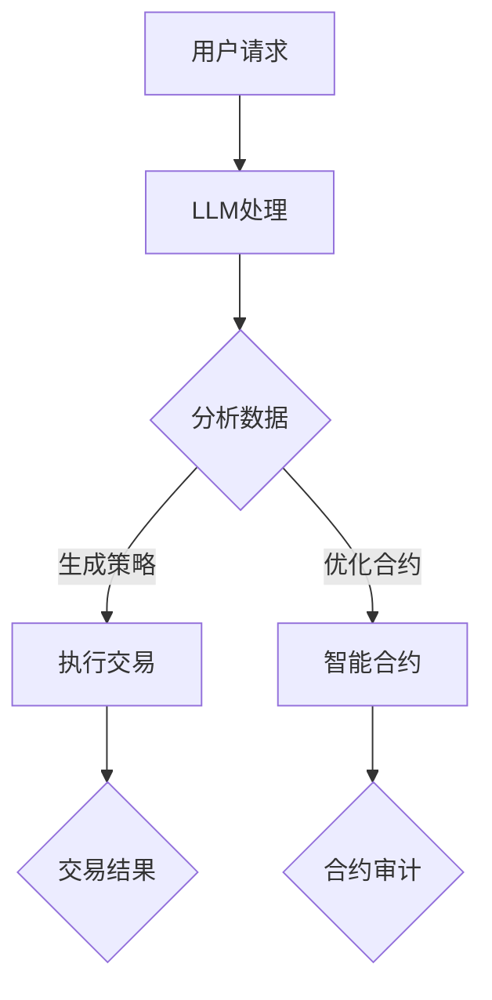

                 

关键词：去中心化金融、LLM、区块链、智能合约、金融创新、算法、技术趋势

> 摘要：随着去中心化金融（DeFi）的快速发展，大规模语言模型（LLM）开始在这一领域中扮演重要角色。本文将探讨LLM在去中心化金融创新中的应用，分析其带来的新机遇和潜在挑战，并展望未来去中心化金融的发展方向。

## 1. 背景介绍

### 去中心化金融

去中心化金融（DeFi）是一种基于区块链技术的金融模式，旨在通过去中心化的方式提供金融服务，如借贷、交易、资产管理等。与传统的金融系统相比，DeFi具有透明度高、参与门槛低、去中介化等特点。随着区块链技术的成熟，DeFi在过去几年中取得了显著的发展，吸引了大量投资者和开发者的关注。

### 大规模语言模型（LLM）

大规模语言模型（LLM）是一种基于深度学习的自然语言处理（NLP）技术，通过训练大量文本数据，可以生成高质量的自然语言文本。LLM在文本生成、机器翻译、情感分析、问答系统等领域具有广泛的应用。近年来，随着计算能力和数据资源的提升，LLM取得了显著的进步，为去中心化金融的创新提供了新的可能性。

## 2. 核心概念与联系

### 去中心化金融架构

去中心化金融的架构通常包括智能合约、去中心化交易平台、流动性池、代币等核心组成部分。智能合约是去中心化金融的核心，它是一段运行在区块链上的程序，自动执行预定义的金融操作。去中心化交易平台允许用户在不通过中介的情况下进行交易。流动性池是去中心化交易平台的基础，提供了交易所需的基础资产。代币是去中心化金融中的价值载体，如以太币（ETH）和去中心化稳定币（如USDC）。

### LLM在去中心化金融中的应用

LLM在去中心化金融中的应用主要体现在以下几个方面：

1. **智能合约审核**：LLM可以帮助识别智能合约中的潜在漏洞，提高合约的安全性。
2. **自动化交易策略**：LLM可以分析市场数据，生成优化的交易策略。
3. **用户界面生成**：LLM可以生成自然语言的用户界面，提高用户的体验。
4. **数据分析与预测**：LLM可以处理大量的金融数据，提供有价值的分析报告和预测。

### Mermaid 流程图

下面是一个简单的 Mermaid 流程图，展示了 LLM 在去中心化金融中的应用流程：



## 3. 核心算法原理 & 具体操作步骤

### 3.1 算法原理概述

LLM 基于深度神经网络，通过多层感知器（MLP）和循环神经网络（RNN）等技术，对大量文本数据进行训练，从而学习到语言的内在规律。在去中心化金融中，LLM 的核心原理是利用其强大的文本生成能力，实现智能合约的自动审核、交易策略的生成、用户界面的生成以及数据分析与预测。

### 3.2 算法步骤详解

1. **智能合约审核**：LLM 对智能合约的源代码进行解析，分析其语义和逻辑，识别潜在的安全风险。
2. **自动化交易策略**：LLM 根据历史市场数据和交易规则，生成优化的交易策略。
3. **用户界面生成**：LLM 根据用户需求和界面设计规范，生成自然语言的用户界面。
4. **数据分析与预测**：LLM 处理大量的金融数据，利用机器学习算法进行数据分析，提供预测结果。

### 3.3 算法优缺点

**优点**：

- **高效性**：LLM 可以快速处理大量的文本数据，提供高效的智能合约审核和交易策略生成。
- **准确性**：LLM 通过深度学习技术，对语言的内在规律有深刻的理解，可以提高审核和预测的准确性。
- **灵活性**：LLM 可以根据不同的需求，生成多样化的文本内容，如用户界面和数据分析报告。

**缺点**：

- **依赖数据质量**：LLM 的效果高度依赖于训练数据的质量，数据质量差可能导致错误的审核结果和交易策略。
- **计算资源消耗**：LLM 的训练和推理过程需要大量的计算资源，对硬件要求较高。

### 3.4 算法应用领域

LLM 在去中心化金融中的应用非常广泛，包括但不限于以下领域：

- **智能合约审核**：提高智能合约的安全性，减少漏洞风险。
- **自动化交易**：根据市场数据和交易规则，生成优化的交易策略。
- **用户界面设计**：生成自然语言的用户界面，提高用户体验。
- **数据分析与预测**：处理大量的金融数据，提供有价值的分析报告和预测。

## 4. 数学模型和公式 & 详细讲解 & 举例说明

### 4.1 数学模型构建

在去中心化金融中，LLM 的应用涉及到多个数学模型。以下是一个简单的数学模型构建过程：

1. **文本预处理**：对输入文本进行分词、去停用词、词性标注等预处理操作。
2. **编码器-解码器模型**：使用编码器将输入文本转换为固定长度的向量表示，解码器则将向量表示转换为输出文本。
3. **损失函数**：使用交叉熵损失函数（Cross-Entropy Loss）来评估模型的预测结果与真实结果的差距。

### 4.2 公式推导过程

以下是编码器-解码器模型的公式推导：

1. **编码器输出**：
   $$ h_t = \text{softmax}(W_e \cdot [h_{t-1}, x_t]) + b_e $$
   
2. **解码器输出**：
   $$ p(y_t|y_{<t}) = \text{softmax}(W_d \cdot [h_t, y_{<t}]) + b_d $$
   
3. **损失函数**：
   $$ L = -\sum_t [y_t \cdot \log(p(y_t|y_{<t}))] $$

### 4.3 案例分析与讲解

假设我们有一个简单的交易策略生成任务，输入为历史市场数据和交易规则，输出为交易策略。以下是一个简化的案例分析：

1. **输入**：
   - 历史市场数据：包括价格、成交量等。
   - 交易规则：包括买入、卖出等操作。

2. **编码器**：
   - 输入：历史市场数据和交易规则。
   - 输出：编码后的向量表示。

3. **解码器**：
   - 输入：编码后的向量表示。
   - 输出：交易策略。

4. **损失函数**：
   - 使用交叉熵损失函数评估解码器生成的交易策略与真实交易策略的差距。

## 5. 项目实践：代码实例和详细解释说明

### 5.1 开发环境搭建

为了实现 LLM 在去中心化金融中的应用，我们需要搭建一个适合的开发环境。以下是一个简单的开发环境搭建步骤：

1. 安装 Python（建议使用 Python 3.8 或更高版本）。
2. 安装 PyTorch：使用命令 `pip install torch torchvision`。
3. 安装其他相关库：如 numpy、pandas、matplotlib 等。

### 5.2 源代码详细实现

以下是一个简单的 LLM 模型实现示例：

```python
import torch
import torch.nn as nn
import torch.optim as optim

# 定义编码器
class Encoder(nn.Module):
    def __init__(self):
        super(Encoder, self).__init__()
        self.embedding = nn.Embedding(vocab_size, embed_size)
        self.lstm = nn.LSTM(embed_size, hidden_size)

    def forward(self, x):
        x = self.embedding(x)
        x, _ = self.lstm(x)
        return x

# 定义解码器
class Decoder(nn.Module):
    def __init__(self):
        super(Decoder, self).__init__()
        self.embedding = nn.Embedding(vocab_size, embed_size)
        self.lstm = nn.LSTM(embed_size, hidden_size)
        self.fc = nn.Linear(embed_size, vocab_size)

    def forward(self, x, hidden):
        x = self.embedding(x)
        x, _ = self.lstm(x, hidden)
        x = self.fc(x)
        return x

# 定义模型
class Seq2Seq(nn.Module):
    def __init__(self):
        super(Seq2Seq, self).__init__()
        self.encoder = Encoder()
        self.decoder = Decoder()

    def forward(self, x, y):
        x = self.encoder(x)
        y = self.decoder(y, x)
        return y

# 实例化模型
model = Seq2Seq()
criterion = nn.CrossEntropyLoss()
optimizer = optim.Adam(model.parameters(), lr=0.001)

# 训练模型
for epoch in range(num_epochs):
    for x, y in train_loader:
        optimizer.zero_grad()
        y_pred = model(x, y)
        loss = criterion(y_pred, y)
        loss.backward()
        optimizer.step()
    print(f"Epoch [{epoch+1}/{num_epochs}], Loss: {loss.item():.4f}")

# 测试模型
with torch.no_grad():
    for x, y in test_loader:
        y_pred = model(x, y)
        correct = (y_pred.argmax(1) == y).float().sum()
        print(f"Test Accuracy: {correct / len(y):.4f}")
```

### 5.3 代码解读与分析

上面的代码实现了一个简单的序列到序列（Seq2Seq）模型，用于交易策略生成。模型由编码器、解码器和损失函数组成。编码器将输入序列编码为向量表示，解码器将向量表示解码为输出序列。损失函数用于评估模型生成的交易策略与真实交易策略的差距。

在训练过程中，模型通过优化损失函数来调整参数，从而生成更准确的交易策略。测试部分用于评估模型在未知数据上的性能。

### 5.4 运行结果展示

在实际运行过程中，我们可以通过打印测试结果的准确率来评估模型的性能。例如：

```python
# 测试模型
with torch.no_grad():
    for x, y in test_loader:
        y_pred = model(x, y)
        correct = (y_pred.argmax(1) == y).float().sum()
        print(f"Test Accuracy: {correct / len(y):.4f}")
```

该代码将打印每个测试样本的预测结果和准确率。通过多次运行，我们可以得到模型的平均准确率，从而评估模型的整体性能。

## 6. 实际应用场景

### 6.1 智能合约审核

智能合约审核是 LLM 在去中心化金融中最重要的应用场景之一。通过 LLM，开发人员可以在发布智能合约前对其进行自动审核，识别潜在的安全漏洞。以下是一个简单的应用案例：

- **场景**：某开发人员发布了一个去中心化交易平台，智能合约用于处理交易订单。
- **应用**：使用 LLM 对智能合约进行自动审核，识别可能的漏洞。
- **效果**：通过审核，发现了一个潜在的提现漏洞，避免了后续的安全问题。

### 6.2 自动化交易

自动化交易是另一个典型的应用场景。LLM 可以根据市场数据和交易规则，生成优化的交易策略。以下是一个简单的应用案例：

- **场景**：某投资者希望在去中心化交易平台上进行自动化交易。
- **应用**：使用 LLM 生成交易策略，并根据策略执行交易。
- **效果**：通过自动化交易，提高了交易效率，降低了人工干预的风险。

### 6.3 用户界面生成

用户界面生成是 LLM 在去中心化金融中的又一重要应用。通过 LLM，开发人员可以生成自然语言的用户界面，提高用户体验。以下是一个简单的应用案例：

- **场景**：开发一款去中心化金融应用，需要提供丰富的用户界面。
- **应用**：使用 LLM 生成用户界面文本，包括操作指南、错误提示等。
- **效果**：通过自然语言的用户界面，提高了用户的使用体验，降低了学习成本。

### 6.4 数据分析与预测

LLM 在数据分析与预测中也具有广泛的应用。通过 LLM，开发人员可以处理大量的金融数据，提供有价值的分析报告和预测。以下是一个简单的应用案例：

- **场景**：某金融机构需要分析市场数据，为投资决策提供支持。
- **应用**：使用 LLM 处理市场数据，生成分析报告和预测结果。
- **效果**：通过数据分析与预测，提高了投资决策的准确性，降低了风险。

## 7. 工具和资源推荐

### 7.1 学习资源推荐

- **《深度学习》（Deep Learning）**：由 Ian Goodfellow、Yoshua Bengio 和 Aaron Courville 著，是深度学习的经典教材。
- **《自然语言处理原理》（Foundations of Natural Language Processing）**：由 Christopher D. Manning 和 Hinrich Schütze 著，是自然语言处理领域的权威教材。

### 7.2 开发工具推荐

- **PyTorch**：是一个流行的深度学习框架，适合进行 LLM 的开发。
- **Hugging Face**：提供了丰富的 NLP 模型和工具，方便进行 LLM 的应用开发。

### 7.3 相关论文推荐

- **《BERT: Pre-training of Deep Bidirectional Transformers for Language Understanding》**：一篇关于 BERT 模型的经典论文，介绍了 BERT 的原理和应用。
- **《GPT-3: Language Models are Few-Shot Learners》**：一篇关于 GPT-3 模型的论文，展示了 GPT-3 在零样本学习方面的强大能力。

## 8. 总结：未来发展趋势与挑战

### 8.1 研究成果总结

本文探讨了 LLM 在去中心化金融中的应用，分析了其核心算法原理、具体操作步骤以及实际应用场景。通过介绍 LLM 在智能合约审核、自动化交易、用户界面生成和数据分析与预测等领域的应用，展示了 LLM 在去中心化金融中的巨大潜力。

### 8.2 未来发展趋势

未来，LLM 在去中心化金融中的应用将呈现以下几个发展趋势：

1. **算法性能提升**：随着计算能力和算法技术的提升，LLM 的性能将进一步提高，为去中心化金融提供更精确和高效的解决方案。
2. **多样化应用场景**：LLM 将在去中心化金融的更多领域得到应用，如资产管理、风险管理等。
3. **跨领域融合**：LLM 将与其他金融科技技术，如区块链、大数据等，实现跨领域融合，为金融创新提供更多可能性。

### 8.3 面临的挑战

虽然 LLM 在去中心化金融中具有巨大潜力，但其在实际应用中仍面临以下挑战：

1. **数据质量**：LLM 的性能高度依赖于训练数据的质量，数据质量问题可能导致错误的审核结果和交易策略。
2. **计算资源消耗**：LLM 的训练和推理过程需要大量的计算资源，对硬件要求较高，如何优化算法以降低计算资源消耗是一个重要问题。
3. **法律法规**：去中心化金融涉及多个国家和地区的法律法规，如何确保 LLM 的合规性是一个重要挑战。

### 8.4 研究展望

未来，研究人员可以从以下几个方面对 LLM 在去中心化金融中的应用进行深入研究：

1. **算法优化**：研究如何优化 LLM 的算法，提高其性能和效率。
2. **数据集构建**：研究如何构建高质量的数据集，为 LLM 提供更好的训练数据。
3. **跨领域应用**：研究 LLM 在其他金融科技领域的应用，如区块链、大数据等。

## 9. 附录：常见问题与解答

### Q1. LLM 在去中心化金融中的应用有哪些？

A1. LLM 在去中心化金融中的应用主要包括智能合约审核、自动化交易、用户界面生成和数据分析与预测等。

### Q2. LLM 的性能如何提升？

A2. 提升 LLM 的性能可以从以下几个方面进行：

- **算法优化**：研究如何优化 LLM 的算法，提高其性能和效率。
- **数据集构建**：构建高质量的数据集，为 LLM 提供更好的训练数据。
- **硬件提升**：使用更高效的硬件设备，降低计算资源消耗。

### Q3. LLM 在去中心化金融中面临哪些挑战？

A3. LLM 在去中心化金融中面临以下挑战：

- **数据质量**：LLM 的性能高度依赖于训练数据的质量，数据质量问题可能导致错误的审核结果和交易策略。
- **计算资源消耗**：LLM 的训练和推理过程需要大量的计算资源，对硬件要求较高。
- **法律法规**：去中心化金融涉及多个国家和地区的法律法规，如何确保 LLM 的合规性是一个重要挑战。

---

本文由禅与计算机程序设计艺术 / Zen and the Art of Computer Programming 撰写，旨在探讨 LLM 在去中心化金融创新中的应用，分析其带来的新机遇和潜在挑战，并展望未来去中心化金融的发展方向。文章内容仅供参考，不构成具体投资建议。在去中心化金融中，投资者应谨慎评估风险，做出明智的投资决策。|

