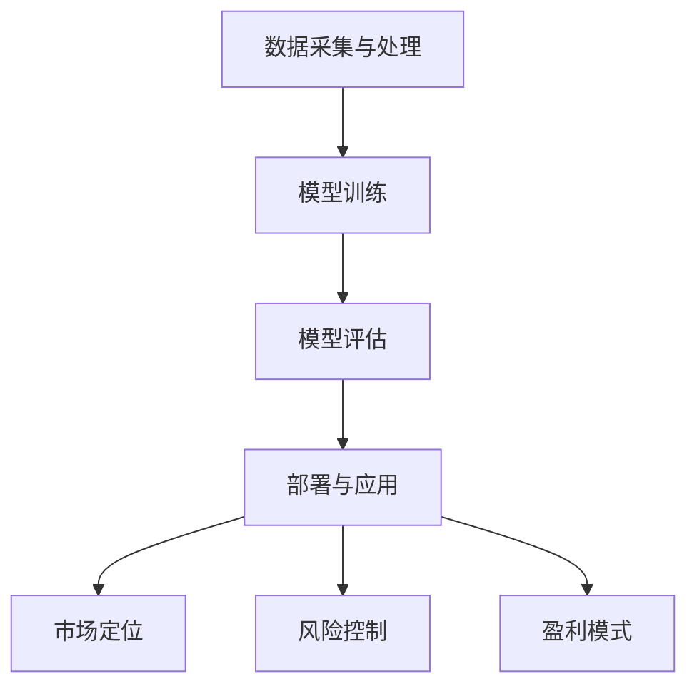

                 

关键词：大模型创业、商业化策略、市场定位、技术优势、风险控制、盈利模式

> 摘要：本文旨在探讨大模型创业者在商业化过程中所面临的一系列挑战和策略选择。通过对当前市场环境的分析，结合实际案例，本文提出了一系列有效的商业化策略，以帮助大模型创业企业实现可持续发展。

## 1. 背景介绍

随着人工智能技术的飞速发展，大模型（如GPT、BERT等）在自然语言处理、计算机视觉、语音识别等领域取得了显著的成果。这些大模型不仅提升了算法的准确率，还显著降低了开发门槛，使得越来越多的创业者投身于大模型相关领域的创业浪潮中。然而，成功的商业化并非易事，创业者在面临技术优势的同时，还需要应对市场定位、风险控制、盈利模式等多方面的挑战。

## 2. 核心概念与联系

### 2.1 大模型技术概述

大模型是指通过深度学习算法训练的大型神经网络模型，具有处理复杂任务的能力。大模型技术主要包括以下几个方面：

- **数据采集与处理**：需要大量的高质量数据进行训练，包括数据清洗、归一化、特征提取等步骤。
- **模型训练**：通过梯度下降等优化算法，不断调整模型参数，使得模型在训练集上的误差逐渐减小。
- **模型评估**：使用验证集和测试集对模型进行评估，确保模型具有良好的泛化能力。
- **部署与应用**：将训练好的模型部署到生产环境中，提供API接口或服务，供用户调用。

### 2.2 商业化策略关联图



## 3. 核心算法原理 & 具体操作步骤

### 3.1 算法原理概述

大模型商业化策略的核心在于如何将技术优势转化为商业价值。这包括以下几个步骤：

- **市场调研**：了解目标市场的需求、竞争对手情况、行业趋势等。
- **技术选型**：根据市场需求，选择合适的大模型技术方案。
- **产品开发**：结合技术方案，开发具有竞争力的产品。
- **市场推广**：通过各种渠道进行产品宣传，提高市场知名度。
- **客户关系管理**：提供优质的售后服务，维护客户关系。

### 3.2 算法步骤详解

1. **市场调研**：通过问卷调查、访谈、市场分析报告等方式，了解市场需求和用户痛点。
2. **技术选型**：根据市场需求，选择适合的大模型技术，如GPT、BERT、ViT等。
3. **产品开发**：结合技术方案，开发具有竞争力的产品，如文本生成、图像识别、语音合成等。
4. **市场推广**：通过社交媒体、线上线下活动、广告投放等方式，提高产品知名度。
5. **客户关系管理**：提供优质的售后服务，包括技术支持、培训、咨询等。

### 3.3 算法优缺点

- **优点**：技术含量高，能够解决复杂问题，提高业务效率。
- **缺点**：开发周期长，成本高，对数据处理和存储能力要求较高。

### 3.4 算法应用领域

大模型商业化策略在多个领域具有广泛应用，如：

- **金融行业**：风险控制、智能投顾、信用评估等。
- **医疗行业**：疾病诊断、医疗影像分析、健康管理等。
- **教育行业**：智能教学、在线教育、教育评估等。
- **智能客服**：自然语言处理、图像识别、语音识别等。

## 4. 数学模型和公式 & 详细讲解 & 举例说明

### 4.1 数学模型构建

大模型商业化策略的数学模型主要包括以下几个方面：

- **收益模型**：R = P × Q × A，其中R为总收益，P为产品价格，Q为产品销量，A为市场占有率。
- **成本模型**：C = F + V，其中C为总成本，F为固定成本，V为可变成本。
- **利润模型**：π = R - C，其中π为利润。

### 4.2 公式推导过程

1. **收益模型推导**：

   R = P × Q × A
   
   其中，P为产品价格，Q为产品销量，A为市场占有率。

   假设产品价格为常数P，市场占有率为常数A，则总收益R与销量Q成正比。

   即：R ∝ Q

2. **成本模型推导**：

   C = F + V
   
   其中，C为总成本，F为固定成本，V为可变成本。

   假设固定成本为常数F，可变成本与产品销量Q成正比，即：V ∝ Q。

   则总成本C与销量Q的关系为：C ∝ Q

3. **利润模型推导**：

   π = R - C
   
   其中，R为总收益，C为总成本。

   根据收益模型和成本模型，可得：

   π = P × Q × A - (F + V)

   即：π = P × Q × A - F - V

### 4.3 案例分析与讲解

以某金融企业为例，假设该企业推出一款基于大模型的智能投顾产品。

1. **收益模型**：

   假设产品价格为每月100元，市场占有率为10%，则每月总收益为：

   R = 100 × 10,000 × 0.1 = 100,000元

2. **成本模型**：

   假设固定成本为每月10,000元，可变成本为每月5元/用户，则每月总成本为：

   C = 10,000 + 5 × 10,000 = 60,000元

3. **利润模型**：

   π = 100,000 - 60,000 = 40,000元

   即，每月利润为40,000元。

## 5. 项目实践：代码实例和详细解释说明

### 5.1 开发环境搭建

在开发大模型商业化项目时，首先需要搭建一个合适的开发环境。以下是一个简单的环境搭建示例：

```markdown
# 开发环境搭建

## 1. 安装 Python

- 版本：Python 3.8及以上版本
- 安装方式：使用包管理器（如pip）进行安装

```bash
pip install python==3.8.10
```

## 2. 安装深度学习框架

- 版本：TensorFlow 2.x
- 安装方式：使用包管理器（如pip）进行安装

```bash
pip install tensorflow==2.6.0
```

## 3. 安装其他依赖库

- 版本：numpy、pandas、matplotlib等
- 安装方式：使用包管理器（如pip）进行安装

```bash
pip install numpy==1.21.2
pip install pandas==1.3.3
pip install matplotlib==3.4.3
```
```

### 5.2 源代码详细实现

以下是一个简单的基于TensorFlow的大模型训练代码示例：

```python
import tensorflow as tf
import numpy as np
import pandas as pd

# 加载数据
data = pd.read_csv('data.csv')
X = data[['feature1', 'feature2']]
y = data['target']

# 预处理数据
X = (X - X.mean()) / X.std()
y = (y - y.mean()) / y.std()

# 划分训练集和测试集
X_train, X_test, y_train, y_test = train_test_split(X, y, test_size=0.2, random_state=42)

# 构建模型
model = tf.keras.Sequential([
    tf.keras.layers.Dense(64, activation='relu', input_shape=(X_train.shape[1],)),
    tf.keras.layers.Dense(64, activation='relu'),
    tf.keras.layers.Dense(1, activation='sigmoid')
])

# 编译模型
model.compile(optimizer='adam', loss='binary_crossentropy', metrics=['accuracy'])

# 训练模型
model.fit(X_train, y_train, epochs=10, batch_size=32, validation_split=0.2)

# 评估模型
loss, accuracy = model.evaluate(X_test, y_test)
print(f"Test accuracy: {accuracy:.2f}")

# 预测
predictions = model.predict(X_test)
```

### 5.3 代码解读与分析

以上代码示例实现了以下功能：

1. **数据加载与预处理**：从CSV文件中加载数据，并进行归一化处理。
2. **划分训练集和测试集**：将数据集划分为训练集和测试集，用于训练和评估模型。
3. **构建模型**：使用TensorFlow构建一个简单的全连接神经网络，包括两个隐藏层。
4. **编译模型**：设置优化器、损失函数和评估指标。
5. **训练模型**：使用训练集进行模型训练，并设置训练轮次、批量大小和验证比例。
6. **评估模型**：使用测试集对模型进行评估，并输出准确率。
7. **预测**：使用训练好的模型对测试集进行预测。

## 6. 实际应用场景

大模型商业化策略在实际应用场景中具有广泛的应用，以下是一些典型的应用案例：

1. **金融行业**：风险控制、智能投顾、信用评估等。
2. **医疗行业**：疾病诊断、医疗影像分析、健康管理等。
3. **教育行业**：智能教学、在线教育、教育评估等。
4. **智能客服**：自然语言处理、图像识别、语音识别等。

## 7. 未来应用展望

随着人工智能技术的不断发展，大模型商业化策略在未来将有更广泛的应用场景，如：

1. **智能交通**：交通流量预测、智能调度等。
2. **智能制造**：生产优化、质量控制等。
3. **智慧城市**：环境监测、城市安全等。

## 8. 工具和资源推荐

为了更好地实现大模型商业化，以下是一些建议的学习资源、开发工具和相关论文：

### 8.1 学习资源推荐

1. **在线课程**：
   - 《深度学习》 - 吴恩达（英）
   - 《自然语言处理》 - 斯坦福大学
   - 《计算机视觉》 - 约书亚·B. 本吉奥

2. **书籍**：
   - 《Python深度学习》 - 法尔科内
   - 《深度学习入门》 - 晓峰

### 8.2 开发工具推荐

1. **框架与库**：
   - TensorFlow
   - PyTorch
   - Keras

2. **数据预处理工具**：
   - Pandas
   - NumPy

3. **版本控制工具**：
   - Git

### 8.3 相关论文推荐

1. **深度学习**：
   - “A guide to convolution arithmetic for deep learning” - Golin et al. (2015)
   - “Very Deep Convolutional Networks for Large-Scale Image Recognition” - Krizhevsky et al. (2012)

2. **自然语言处理**：
   - “Attention Is All You Need” - Vaswani et al. (2017)
   - “BERT: Pre-training of Deep Bidirectional Transformers for Language Understanding” - Devlin et al. (2019)

3. **计算机视觉**：
   - “You Only Look Once: Unified, Real-Time Object Detection” - Redmon et al. (2016)
   - “DenseNet: A Residual DenseNet for Image Classification” - Huang et al. (2017)

## 9. 总结：未来发展趋势与挑战

大模型商业化策略在未来将面临以下发展趋势和挑战：

### 9.1 发展趋势

1. **技术创新**：随着人工智能技术的不断进步，大模型的性能和应用范围将得到进一步提升。
2. **行业应用**：大模型将在更多领域得到应用，如智能制造、智慧城市等。
3. **产业生态**：大模型产业链将逐渐完善，包括硬件、软件、数据等环节。

### 9.2 面临的挑战

1. **数据质量**：高质量的数据是大模型训练的基础，数据质量直接影响模型性能。
2. **计算资源**：大模型训练需要大量的计算资源，如何高效利用资源是关键。
3. **隐私安全**：在数据收集和处理过程中，如何保障用户隐私和安全是重要问题。

### 9.3 研究展望

未来，大模型商业化策略的研究将集中在以下几个方面：

1. **算法优化**：提高大模型训练效率，降低计算成本。
2. **应用拓展**：探索大模型在更多领域的应用，如医疗、金融等。
3. **数据安全**：研究数据加密、隐私保护等技术，保障用户隐私。

## 附录：常见问题与解答

### Q1. 大模型商业化策略的难点是什么？

A1. 大模型商业化策略的难点主要包括以下几个方面：

1. **数据获取**：高质量的数据是大模型训练的基础，但获取数据可能面临法律、道德等问题。
2. **计算资源**：大模型训练需要大量的计算资源，如何高效利用资源是关键。
3. **算法优化**：大模型训练时间较长，如何优化算法以提高效率是难点。

### Q2. 如何评估大模型商业化的成功率？

A2. 评估大模型商业化的成功率可以从以下几个方面进行：

1. **市场份额**：大模型产品在市场上的占有率。
2. **用户满意度**：用户对产品的满意度。
3. **盈利能力**：产品的盈利能力。
4. **研发投入回报**：研发投入与盈利的对比。

### Q3. 大模型商业化有哪些风险？

A3. 大模型商业化可能面临以下风险：

1. **技术风险**：算法性能不稳定，无法满足用户需求。
2. **市场风险**：市场需求不足，产品无法销售。
3. **法律风险**：数据隐私、知识产权等问题。
4. **运营风险**：产品质量不稳定，售后服务不到位。

### Q4. 大模型商业化的盈利模式有哪些？

A4. 大模型商业化的盈利模式主要包括以下几个方面：

1. **产品销售**：直接销售产品。
2. **服务收费**：提供定制化服务，如数据清洗、模型优化等。
3. **广告收入**：通过广告获取收入。
4. **数据销售**：将数据产品化，如数据报告、数据API等。

### Q5. 大模型商业化与AI伦理的关系如何？

A5. 大模型商业化与AI伦理密切相关。在商业化的过程中，需要遵循以下原则：

1. **公平性**：确保AI技术在各个群体中的应用公平。
2. **透明性**：确保AI技术的工作原理和决策过程透明。
3. **隐私保护**：保护用户隐私，确保数据安全。
4. **可解释性**：提高AI技术的可解释性，使其符合伦理标准。

## 作者署名

作者：禅与计算机程序设计艺术 / Zen and the Art of Computer Programming

----------------------------------------------------------------
通过上述结构严谨、内容丰富的文章，我们为创业者提供了一条清晰的大模型商业化路径。希望这篇文章能够对广大读者有所启发，助力他们在这片充满机遇的蓝海中乘风破浪。

