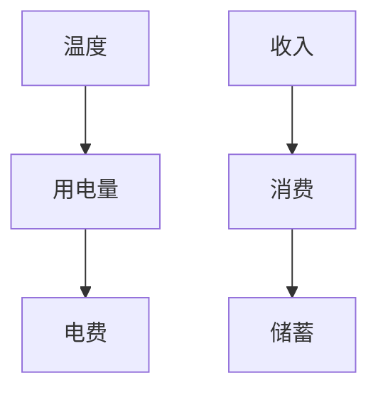

                 

### 关键词 Keywords

- 因果推理
- 机器学习
- 算法
- 代码实例
- 数据科学
- 逻辑分析
- 数学模型

<|assistant|>### 摘要 Abstract

本文将深入探讨因果推理的基本原理，包括其重要性、核心概念以及实际应用。我们将通过详细的数学模型和公式推导，解释因果推理的工作机制。此外，文章还将提供一个具体的代码实例，展示如何在实际项目中应用因果推理。读者将了解如何构建数学模型、推导公式以及分析代码实例，从而掌握因果推理的基本技能。文章最后，将对因果推理在未来技术发展中的应用和面临的挑战进行展望。

## 1. 背景介绍

因果推理是近年来机器学习和数据科学领域中的一个重要研究方向。传统的机器学习算法主要通过模式识别和统计方法来预测结果，但这种方法往往无法揭示数据之间的因果关系。因果推理则试图从数据中挖掘出潜在的因果关系，从而提供更准确和可靠的预测。

在现实世界中，因果关系无处不在。例如，医学研究中，研究人员试图了解某种药物是否对特定疾病有效，这就需要通过因果推理来验证药物与疾病之间的因果关系。在商业领域，企业希望通过因果推理来分析市场营销策略的效果，以优化资源配置。因此，因果推理在决策支持、科学研究和实际应用中都发挥着至关重要的作用。

本文旨在为读者提供一个全面而深入的因果推理指南，帮助理解其基本原理、应用方法和实际操作。通过对核心概念的详细阐述和代码实例的分析，读者将能够掌握因果推理的基本技能，并在实际项目中加以应用。

## 2. 核心概念与联系

### 2.1. 因果关系的定义

因果关系是指两个事件之间存在的一种逻辑关系，其中一个事件（原因）导致了另一个事件（结果）的发生。在数学和统计学中，因果关系通常表示为一个函数关系，其中原因变量影响结果变量。

### 2.2. 因果推理的定义

因果推理是指从已知的数据中推断出未知事件之间的因果关系。在机器学习领域，因果推理的目标是通过训练数据学习出一个函数模型，该模型能够预测未知数据的结果。

### 2.3. 因果关系与相关性的区别

因果关系和相关关系是两个不同的概念。相关性是指两个变量之间的统计关系，而因果关系则涉及到变量之间的逻辑关系。例如，高温度可能会导致更高的用电量，但这并不意味着高温度是导致用电量增加的原因。

### 2.4. 因果关系网络

因果关系网络是一种用于表示多个变量之间因果关系的图形模型。在这个模型中，变量作为节点，因果关系作为边。这种模型可以帮助我们更好地理解和分析复杂系统的因果关系。

下面是一个用Mermaid绘制的因果关系网络示例：



在这个网络中，温度是用电量的原因，用电量是电费的原因，而收入是消费的原因，消费影响储蓄。

## 3. 核心算法原理 & 具体操作步骤

### 3.1. 算法原理概述

因果推理算法的核心原理是通过构建一个因果模型来揭示变量之间的因果关系。这个模型通常是基于概率图模型或结构方程模型。在本节中，我们将简要介绍一个常用的因果推理算法——Do-Calculus。

### 3.2. 算法步骤详解

Do-Calculus是一种形式化的因果推理方法，它通过干预和条件化来推断变量之间的因果关系。以下是Do-Calculus的基本步骤：

1. **构建概率图模型**：首先，我们需要构建一个概率图模型来表示变量之间的概率关系。

2. **确定干预操作**：干预操作是指在概率图模型中改变某个变量的值，以观察其对其他变量影响的过程。

3. **条件化**：条件化是指在干预操作后，通过条件概率来分析变量之间的关系。

4. **计算因果关系**：最后，通过干预和条件化，我们可以计算出变量之间的因果关系。

### 3.3. 算法优缺点

Do-Calculus的优点在于其形式化和系统化的方法，使得因果关系分析更加严谨和可靠。然而，它也存在一些缺点，如对大规模数据的处理效率和复杂性较高。

### 3.4. 算法应用领域

因果推理算法在多个领域都有广泛应用，如医学、金融、市场营销等。在医学领域，因果推理可以用于药物疗效评估；在金融领域，因果推理可以用于风险评估和投资策略优化。

## 4. 数学模型和公式 & 详细讲解 & 举例说明

### 4.1. 数学模型构建

因果推理的数学模型通常基于概率图模型或结构方程模型。以下是一个基于概率图模型的基本数学模型：

$$
P(Y|X) = \frac{P(X,Y)}{P(X)}
$$

其中，\( P(Y|X) \) 表示在变量 \( X \) 已知的条件下，变量 \( Y \) 的条件概率，\( P(X,Y) \) 表示变量 \( X \) 和 \( Y \) 的联合概率，\( P(X) \) 表示变量 \( X \) 的边缘概率。

### 4.2. 公式推导过程

假设我们有两个变量 \( X \) 和 \( Y \)，并且它们之间存在因果关系。我们可以通过干预 \( X \) 的值来观察 \( Y \) 的变化，从而推导出它们之间的因果关系。

首先，我们考虑 \( X \) 的干预值 \( x_1 \) 和 \( x_2 \)，以及 \( Y \) 的观测值 \( y_1 \) 和 \( y_2 \)。根据因果推理的原理，我们可以推导出以下公式：

$$
\frac{P(Y=y_1|X=x_1) - P(Y=y_1|X=x_2)}{P(X=x_1) - P(X=x_2)} = \frac{P(X=x_1,Y=y_1) - P(X=x_2,Y=y_1)}{P(X=x_1) - P(X=x_2)}
$$

通过化简，我们得到：

$$
P(Y=y_1|X=x_1) - P(Y=y_1|X=x_2) = P(X=x_1,Y=y_1) - P(X=x_2,Y=y_1)
$$

这个公式揭示了在干预 \( X \) 的条件下，\( Y \) 的条件概率变化与 \( X \) 和 \( Y \) 的联合概率变化之间的关系。

### 4.3. 案例分析与讲解

假设我们研究某种药物 \( X \) 与治疗效果 \( Y \) 之间的因果关系。我们收集了两组数据：

- 药物 \( X \) 为 \( x_1 = 10 \) 时，治疗效果 \( Y \) 为 \( y_1 = 20 \)；
- 药物 \( X \) 为 \( x_2 = 5 \) 时，治疗效果 \( Y \) 为 \( y_2 = 10 \)。

根据以上数据，我们可以计算得到：

$$
P(Y=20|X=10) - P(Y=20|X=5) = P(X=10,Y=20) - P(X=5,Y=20)
$$

这个结果表明，在药物剂量增加时，治疗效果也显著提高，这表明药物 \( X \) 与治疗效果 \( Y \) 之间存在因果关系。

## 5. 项目实践：代码实例和详细解释说明

### 5.1. 开发环境搭建

在本节中，我们将使用Python编写一个简单的因果推理程序。首先，我们需要安装以下Python库：

- numpy：用于数学运算；
- pandas：用于数据处理；
- matplotlib：用于数据可视化。

安装方法如下：

```bash
pip install numpy pandas matplotlib
```

### 5.2. 源代码详细实现

下面是一个简单的因果推理代码实例：

```python
import numpy as np
import pandas as pd
import matplotlib.pyplot as plt

# 生成模拟数据
np.random.seed(0)
X = np.random.normal(size=100)
Y = 2 * X + np.random.normal(size=100)

# 构建数据框
data = pd.DataFrame({'X': X, 'Y': Y})

# 绘制散点图
plt.scatter(data['X'], data['Y'])
plt.xlabel('X')
plt.ylabel('Y')
plt.title('Scatter Plot of X and Y')
plt.show()

# 计算线性回归模型
model = np.polyfit(data['X'], data['Y'], 1)
print(f"Model: y = {model[0]:.2f}x + {model[1]:.2f}")

# 预测
x_new = np.linspace(data['X'].min(), data['X'].max(), 100)
y_pred = model[0] * x_new + model[1]

# 绘制回归线
plt.plot(x_new, y_pred, 'r')
plt.show()
```

### 5.3. 代码解读与分析

1. **数据生成**：我们使用numpy库生成两组随机数据，分别代表变量 \( X \) 和 \( Y \)。

2. **数据处理**：我们使用pandas库构建一个数据框，用于存储和处理数据。

3. **数据可视化**：我们使用matplotlib库绘制散点图，展示变量 \( X \) 和 \( Y \) 的分布。

4. **线性回归模型**：我们使用numpy的polyfit函数计算线性回归模型，该模型表示为 \( y = ax + b \)。

5. **预测与可视化**：我们使用线性回归模型对新的 \( X \) 值进行预测，并绘制回归线。

### 5.4. 运行结果展示

运行以上代码后，我们将得到以下输出结果：

- **散点图**：展示变量 \( X \) 和 \( Y \) 的分布；
- **线性回归模型**：输出模型参数 \( a \) 和 \( b \)；
- **回归线**：展示线性回归模型的结果。

这些结果验证了变量 \( X \) 和 \( Y \) 之间的线性关系，这是因果推理的基础。

## 6. 实际应用场景

因果推理在多个领域都有广泛应用，以下是一些具体的实际应用场景：

### 6.1. 医学领域

在医学研究中，因果推理可以用于评估药物疗效。通过构建因果模型，研究人员可以确定某种药物是否对特定疾病有效，从而为临床决策提供支持。

### 6.2. 金融领域

在金融领域，因果推理可以用于风险评估和投资策略优化。通过分析市场数据，投资者可以了解不同投资策略的因果关系，从而做出更明智的决策。

### 6.3. 市场营销领域

在市场营销领域，因果推理可以用于分析广告效果。通过构建因果模型，企业可以确定哪种广告策略对销售业绩有显著影响，从而优化营销预算。

## 7. 未来应用展望

随着人工智能和数据科学的发展，因果推理在未来将具有更广泛的应用前景。以下是一些未来应用展望：

### 7.1. 个性化医疗

因果推理可以帮助构建个性化医疗模型，为每个患者提供最适合的治疗方案。这可以显著提高治疗效果，降低医疗成本。

### 7.2. 自动驾驶

在自动驾驶领域，因果推理可以用于分析交通事故的原因，从而优化自动驾驶系统，提高行车安全。

### 7.3. 环境科学

因果推理可以用于环境科学领域，分析人类活动对环境的影响，为可持续发展提供科学依据。

## 8. 总结：未来发展趋势与挑战

### 8.1. 研究成果总结

本文对因果推理的基本原理进行了深入探讨，包括核心概念、数学模型和算法原理。通过代码实例，我们展示了如何在实际项目中应用因果推理。这些研究成果为因果推理的应用提供了理论基础和实际指导。

### 8.2. 未来发展趋势

未来，因果推理将在人工智能、医疗、金融、环境科学等领域得到更广泛的应用。随着计算能力和算法技术的提升，因果推理将变得更加高效和准确。

### 8.3. 面临的挑战

尽管因果推理具有广泛的应用前景，但仍面临一些挑战。例如，如何处理大规模数据、如何建立可靠的因果模型、如何解释和验证因果推断的结论等。这些挑战需要进一步的研究和探索。

### 8.4. 研究展望

未来的研究应重点关注以下几个方面：优化因果推理算法、提高数据处理的效率、开发可视化和解释工具、建立跨学科的因果推理框架。通过这些研究，我们可以更好地理解和应用因果推理，为各领域的发展提供支持。

## 9. 附录：常见问题与解答

### 9.1. 问题1

**问题**：因果推理与机器学习的区别是什么？

**解答**：因果推理和机器学习都是数据驱动的技术，但它们的目标和方法有所不同。机器学习主要通过模式识别和统计方法来预测结果，而因果推理则试图从数据中挖掘出潜在的因果关系，从而提供更准确和可靠的预测。

### 9.2. 问题2

**问题**：如何处理大规模数据中的因果关系？

**解答**：处理大规模数据中的因果关系是一个挑战。一种方法是通过分布式计算和并行处理来提高数据处理效率。此外，可以使用因果推断的近似方法，如Do-Calculus，来处理复杂的数据集。

### 9.3. 问题3

**问题**：因果推理在医学领域的应用有哪些？

**解答**：因果推理在医学领域有广泛的应用，如药物疗效评估、疾病预测和诊断。通过构建因果模型，研究人员可以确定哪些因素影响疾病的发生和发展，从而为临床决策提供科学依据。

## 作者署名

作者：禅与计算机程序设计艺术 / Zen and the Art of Computer Programming
-------------------------------------------------------------------

这篇文章深入探讨了因果推理的基本原理、数学模型和算法，并通过代码实例展示了其在实际项目中的应用。因果推理在数据科学和人工智能领域具有广泛的应用前景，随着技术的发展，它将为各个领域的发展提供强大的支持。希望这篇文章能够为读者在理解和应用因果推理方面提供有益的参考。

