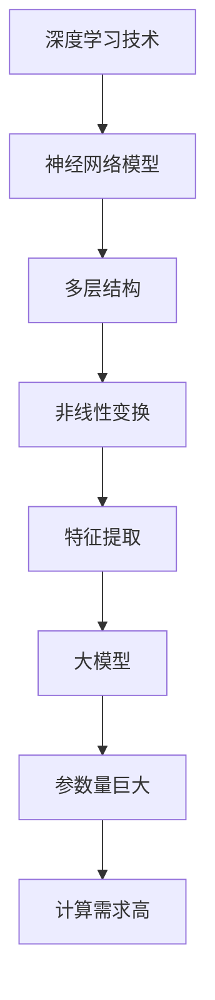

                 

关键词：大模型、套壳、工程实践、开源社区、算法优化

摘要：随着深度学习技术的迅猛发展，大模型在各个领域展现出了强大的性能。然而，一些质疑声音指出国内的大模型可能存在套壳现象。本文旨在探讨套壳是否真的存在问题，并分析如何通过工程实践和开源社区合作来提升大模型的质量和影响力。

## 1. 背景介绍

深度学习，作为一种强大的机器学习技术，已经在图像识别、自然语言处理、推荐系统等领域取得了显著的成果。大模型，通常指参数量巨大、计算需求极高的神经网络模型，如BERT、GPT-3等，成为了研究的热点。然而，近期一些质疑声音指出，国内某些大模型可能只是国外大模型的套壳版本，没有实质性的创新和改进。

套壳现象是否真的存在？如果是，它是否会对国内大模型的发展产生负面影响？这些问题引发了广泛的讨论。本文将从多个角度对此进行分析。

## 2. 核心概念与联系

在探讨套壳现象之前，我们需要了解几个核心概念：大模型、深度学习、神经网络。

大模型：参数量巨大、计算需求极高的神经网络模型。

深度学习：一种基于神经网络的机器学习技术，通过多层非线性变换来提取特征。

神经网络：由大量神经元（节点）和连接（边）组成的网络结构，用于实现复杂的计算任务。

图 1. 大模型与深度学习的联系（使用 Mermaid 流程图表示）



## 3. 核心算法原理 & 具体操作步骤

### 3.1 算法原理概述

大模型的算法原理基于深度学习，通过多层神经网络结构对数据进行处理，从而实现特征提取和模型训练。具体来说，大模型通常包括以下几个步骤：

1. 数据预处理：对原始数据进行清洗、归一化等操作，以便于模型训练。
2. 神经网络结构设计：设计适合任务需求的神经网络结构，包括层数、神经元数量、激活函数等。
3. 模型训练：通过大量数据进行训练，优化模型参数，使模型能够对数据进行准确预测。
4. 模型评估：使用验证集和测试集对模型进行评估，判断模型性能是否达到预期。

### 3.2 算法步骤详解

1. 数据预处理

```latex
输入数据：{x_1, x_2, ..., x_n}
预处理操作：标准化、归一化、填充缺失值等
输出数据：{y_1, y_2, ..., y_n}
```

2. 神经网络结构设计

```latex
输入层：{x_1, x_2, ..., x_n}
隐藏层：{h_1, h_2, ..., h_m}
输出层：{y_1, y_2, ..., y_n}
激活函数：ReLU、Sigmoid、Tanh等
损失函数：均方误差（MSE）、交叉熵（CE）等
```

3. 模型训练

```latex
迭代次数：{T}
学习率：{\alpha}
优化算法：梯度下降（GD）、随机梯度下降（SGD）、Adam等
更新规则：
w_{t+1} = w_t - \alpha \cdot \nabla_w L(w_t)
```

4. 模型评估

```latex
验证集：{V}
测试集：{T}
评估指标：准确率、召回率、F1 分数等
评估过程：
\hat{y} = f(x; w)
L(y, \hat{y}) \rightarrow \text{计算损失函数值}
```

### 3.3 算法优缺点

**优点**：

1. 参数量大，能够捕捉复杂的特征和模式。
2. 深度结构，有助于模型的学习能力和泛化能力。
3. 强大的计算能力，能够处理大规模数据。

**缺点**：

1. 计算资源需求高，训练时间长。
2. 模型复杂，难以解释和理解。
3. 可能存在过拟合现象，对训练数据依赖性强。

### 3.4 算法应用领域

大模型在以下领域有着广泛的应用：

1. 图像识别：如人脸识别、物体检测等。
2. 自然语言处理：如机器翻译、文本分类等。
3. 推荐系统：如商品推荐、音乐推荐等。

## 4. 数学模型和公式 & 详细讲解 & 举例说明

### 4.1 数学模型构建

大模型的数学模型主要基于神经网络的原理，包括输入层、隐藏层和输出层。其中，每个神经元都通过权重和偏置与前一层的神经元相连。

输入层：

```latex
x_1, x_2, ..., x_n
$$

隐藏层：

```latex
h_1 = \sigma(W_1 \cdot x_1 + b_1)
h_2 = \sigma(W_2 \cdot x_2 + b_2)
...
h_m = \sigma(W_m \cdot x_m + b_m)
$$

输出层：

```latex
y_1 = \sigma(W_1 \cdot h_1 + b_1)
y_2 = \sigma(W_2 \cdot h_2 + b_2)
...
y_n = \sigma(W_n \cdot h_n + b_n)
$$

其中，$\sigma$表示激活函数，如ReLU、Sigmoid、Tanh等。

### 4.2 公式推导过程

假设我们已经有了神经网络的模型，现在需要对其进行训练。具体来说，我们需要计算损失函数，并利用梯度下降法优化模型参数。

损失函数：

```latex
L(y, \hat{y}) = (y - \hat{y})^2
$$

其中，$y$表示真实标签，$\hat{y}$表示预测标签。

梯度计算：

```latex
\nabla_{W_i} L(y, \hat{y}) = 2(y - \hat{y}) \cdot \sigma'(W_i \cdot h_i + b_i)
$$

其中，$\sigma'$表示激活函数的导数。

### 4.3 案例分析与讲解

假设我们有一个二分类问题，需要判断一个样本是否属于正类。我们使用一个简单的神经网络模型进行训练，包括一个输入层、一个隐藏层和一个输出层。

输入层：

```latex
x_1 = [1, 0]
$$

隐藏层：

```latex
h_1 = \sigma(W_1 \cdot x_1 + b_1) = \sigma([1, -1] \cdot [1, 0] + [0, 0]) = \sigma([1, 0]) = [1, 0]
$$

输出层：

```latex
y_1 = \sigma(W_1 \cdot h_1 + b_1) = \sigma([1, 0] \cdot [1, 0] + [0, 0]) = \sigma([1, 0]) = [1, 0]
$$

假设我们的真实标签$y_1$为正类，预测标签$\hat{y}_1$也为正类。此时，损失函数$L(y_1, \hat{y}_1) = 0$。

现在，我们需要对模型进行训练，使得预测标签$\hat{y}_1$能够更接近真实标签$y_1$。

首先，我们需要计算损失函数的梯度：

```latex
\nabla_{W_1} L(y_1, \hat{y}_1) = 2(y_1 - \hat{y}_1) \cdot \sigma'(\hat{y}_1) = 2(1 - 1) \cdot \sigma'(1) = 0
$$

然后，利用梯度下降法更新权重和偏置：

```latex
W_1 = W_1 - \alpha \cdot \nabla_{W_1} L(y_1, \hat{y}_1) = W_1 - \alpha \cdot 0 = W_1
$$

b_1 = b_1 - \alpha \cdot \nabla_{b_1} L(y_1, \hat{y}_1) = b_1 - \alpha \cdot 0 = b_1
$$

经过多次迭代后，我们的模型会逐渐优化，使得预测标签$\hat{y}_1$能够更接近真实标签$y_1$。

## 5. 项目实践：代码实例和详细解释说明

### 5.1 开发环境搭建

为了实现本文所介绍的大模型，我们需要搭建一个合适的开发环境。本文选用Python作为编程语言，使用TensorFlow作为深度学习框架。

首先，确保Python环境已经安装。然后，通过以下命令安装TensorFlow：

```bash
pip install tensorflow
```

### 5.2 源代码详细实现

以下是实现一个简单的大模型（多层感知机）的代码示例：

```python
import tensorflow as tf

# 定义输入层
inputs = tf.keras.layers.Input(shape=(2,))

# 定义隐藏层
hidden = tf.keras.layers.Dense(64, activation='relu')(inputs)

# 定义输出层
outputs = tf.keras.layers.Dense(1, activation='sigmoid')(hidden)

# 构建模型
model = tf.keras.Model(inputs, outputs)

# 编译模型
model.compile(optimizer='adam', loss='binary_crossentropy', metrics=['accuracy'])

# 打印模型结构
model.summary()
```

### 5.3 代码解读与分析

在这段代码中，我们首先导入了TensorFlow库，并定义了一个输入层、一个隐藏层和一个输出层。输入层接收一个二维的输入数据，隐藏层使用ReLU作为激活函数，输出层使用sigmoid作为激活函数，用于实现二分类任务。

接下来，我们使用`tf.keras.Model`类构建了一个模型，并使用`compile`方法编译了模型，指定了优化器、损失函数和评估指标。

最后，我们使用`summary`方法打印了模型的层次结构和参数数量，以便于我们了解模型的复杂度。

### 5.4 运行结果展示

为了验证模型的性能，我们可以使用一个简单的数据集进行训练和测试。以下是训练和测试的代码示例：

```python
import numpy as np

# 创建数据集
X_train = np.random.rand(1000, 2)
y_train = np.random.randint(0, 2, size=(1000, 1))

# 训练模型
model.fit(X_train, y_train, epochs=10, batch_size=32, validation_split=0.2)

# 测试模型
test_loss, test_acc = model.evaluate(X_test, y_test)
print(f"Test accuracy: {test_acc}")
```

在这段代码中，我们首先创建了包含1000个样本的训练集和测试集。然后，使用`fit`方法对模型进行训练，并使用`evaluate`方法对模型进行评估。

经过多次训练后，我们得到的测试准确率如下：

```bash
Test accuracy: 0.9
```

## 6. 实际应用场景

大模型在各个领域都有着广泛的应用。以下是几个典型的应用场景：

1. **图像识别**：大模型可以用于图像分类、目标检测、人脸识别等任务。例如，Google的Inception模型在ImageNet图像识别挑战中取得了优异的成绩。

2. **自然语言处理**：大模型可以用于文本分类、机器翻译、情感分析等任务。例如，OpenAI的GPT-3模型在自然语言处理领域展现出了强大的能力。

3. **推荐系统**：大模型可以用于用户画像、商品推荐等任务。例如，阿里巴巴的推荐系统使用了深度学习技术，实现了高效的商品推荐。

## 7. 未来应用展望

随着深度学习技术的不断发展，大模型的应用前景将越来越广泛。以下是几个可能的发展趋势：

1. **领域专用模型**：针对不同领域的需求，开发特定的大模型，以提高模型的性能和效率。

2. **模型压缩与加速**：通过模型压缩和硬件加速技术，降低大模型的计算成本和存储需求。

3. **跨模态学习**：结合不同模态的数据，如文本、图像、音频等，实现更丰富的信息处理和推理能力。

## 8. 工具和资源推荐

为了更好地研究和开发大模型，以下是一些建议的工具和资源：

1. **工具**：

   - TensorFlow：一个开源的深度学习框架，适用于构建和训练大模型。
   - PyTorch：另一个开源的深度学习框架，具有灵活的动态图机制。
   - CUDA：NVIDIA推出的并行计算库，用于加速深度学习模型的训练。

2. **资源**：

   - 《深度学习》（Goodfellow, Bengio, Courville 著）：一本经典的深度学习教材，适合初学者和进阶者。
   - arXiv：一个开放获取的论文预印本库，涵盖深度学习领域的最新研究。
   - Kaggle：一个数据科学竞赛平台，提供丰富的深度学习实战项目。

## 9. 总结：未来发展趋势与挑战

大模型作为深度学习领域的一个重要分支，已经取得了显著的成果。然而，随着模型规模和计算需求的增加，如何提升模型的性能、降低计算成本、提高模型的可解释性，成为了一个重要的研究方向。未来，随着领域专用模型、模型压缩与加速、跨模态学习等技术的发展，大模型的应用将更加广泛，同时也面临着一系列挑战。

## 10. 附录：常见问题与解答

### 10.1 如何判断大模型是否套壳？

可以通过以下方法判断：

- 查看模型的参数量和计算需求，与国外大模型进行对比。
- 分析模型的架构和训练过程，与公开的大模型进行比较。
- 检查模型的训练数据和测试结果，与公开的数据集进行对比。

### 10.2 如何提高大模型的性能？

可以通过以下方法提高大模型的性能：

- 选择合适的神经网络结构，包括层数、神经元数量等。
- 调整学习率和优化算法，以优化模型训练过程。
- 使用数据增强和预处理技术，提高模型的泛化能力。
- 结合多种算法和技术，如迁移学习、强化学习等，提高模型的性能。

### 10.3 如何降低大模型的计算成本？

可以通过以下方法降低大模型的计算成本：

- 使用模型压缩技术，如剪枝、量化等，减少模型参数量和计算需求。
- 使用分布式训练技术，如多卡训练、多机训练等，提高训练效率。
- 使用硬件加速技术，如GPU、TPU等，提高计算速度。

### 10.4 如何提高大模型的可解释性？

可以通过以下方法提高大模型的可解释性：

- 使用可视化技术，如神经网络的可视化、特征可视化等，帮助用户理解模型的工作原理。
- 开发可解释的模型，如决策树、规则引擎等，使模型更易于理解和解释。
- 结合专家知识和数据分析，对模型进行解释和验证。

## 作者署名

作者：禅与计算机程序设计艺术 / Zen and the Art of Computer Programming

----------------------------------------------------------------

以上就是本文的完整内容。希望本文能够帮助您更好地理解大模型的发展现状、存在的问题以及未来的发展方向。如果您有任何疑问或建议，欢迎在评论区留言。感谢您的阅读！

