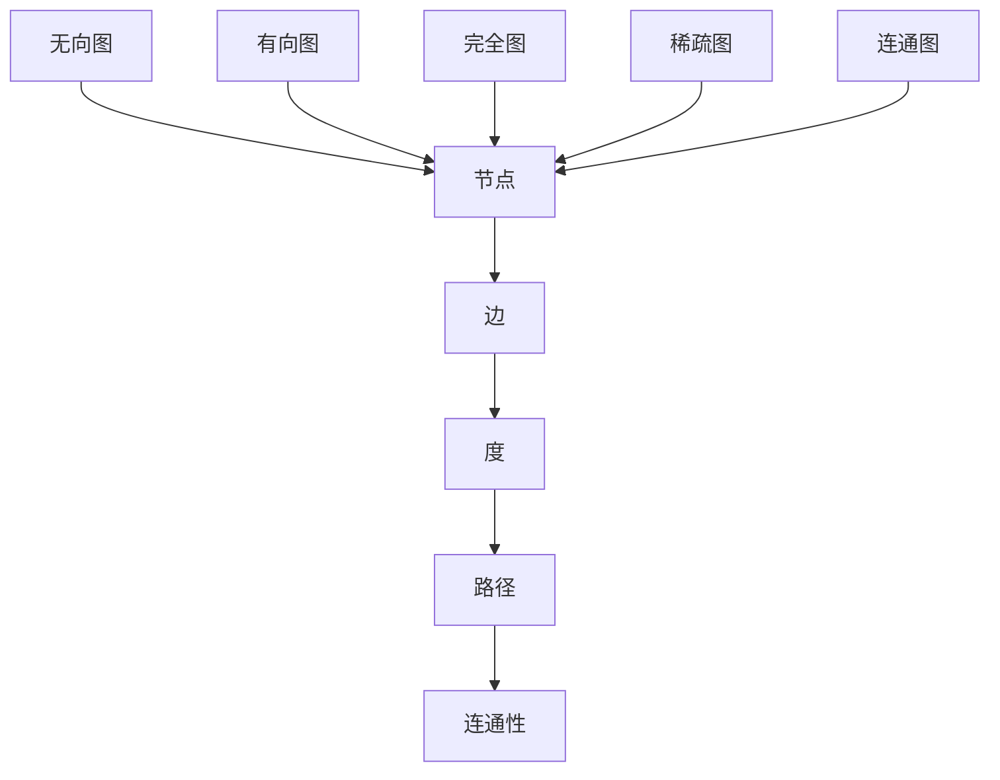

                 

关键词：图算法、数据结构、算法原理、代码实例、性能优化

摘要：本文旨在深入探讨图算法的基本原理、具体操作步骤和代码实现，通过详尽的实例讲解，帮助读者更好地理解并掌握图算法在实际应用中的运用。

## 1. 背景介绍

图算法是计算机科学中一种重要的算法设计方法，广泛应用于网络分析、数据挖掘、图形处理等领域。图算法通过研究图结构及其操作，提供了一种描述复杂关系的方法。在图算法中，图是由节点（也称为顶点）和边组成的。节点表示数据对象，边表示节点之间的关系。

图算法的主要目的是解决图的搜索、连接、遍历等问题。常见的图算法包括深度优先搜索（DFS）、广度优先搜索（BFS）、迪杰斯特拉算法（Dijkstra）、贝尔曼-福特算法（Bellman-Ford）等。这些算法不仅具有理论上的重要性，还在实际应用中展现出强大的功能。

本文将围绕图算法的基本概念、原理、具体实现和性能优化展开讨论，旨在为读者提供系统、全面的学习资料。

## 2. 核心概念与联系

### 2.1. 图的基本概念

在图算法中，首先需要了解图的基本概念，包括节点、边、度、路径、连通性等。

- **节点**：图中的基本元素，表示数据对象。
- **边**：连接节点的线，表示节点之间的关系。
- **度**：节点所连接的边的数量，分为入度和出度。
- **路径**：连接两个节点的边的序列。
- **连通性**：图中任意两个节点之间存在路径。

### 2.2. 图的分类

图根据边的不同特点可以分类为无向图和有向图。

- **无向图**：边没有方向，任意两个节点之间都可以相互访问。
- **有向图**：边具有方向，从一个节点指向另一个节点。

此外，图还可以根据节点的度进行分类，如完全图、稀疏图、连通图等。

### 2.3. 图的表示方法

图的表示方法主要有邻接矩阵和邻接表两种。

- **邻接矩阵**：用二维数组表示图，其中`matrix[i][j]`表示节点`i`和节点`j`之间是否存在边。
- **邻接表**：用链表表示图，每个节点维护一个链表，链表中存储与该节点相连的其他节点。

### 2.4. Mermaid 流程图

以下是一个简单的 Mermaid 流程图，展示了图的基本概念和分类：



通过上述流程图，我们可以更直观地理解图的基本概念和分类。

## 3. 核心算法原理 & 具体操作步骤

### 3.1. 算法原理概述

在图算法中，深度优先搜索（DFS）和广度优先搜索（BFS）是最基本、最常用的两种搜索算法。它们分别从不同的角度遍历图，以找到目标节点或解决特定问题。

#### 3.1.1. 深度优先搜索（DFS）

DFS是一种递归算法，从起点开始，沿着一条路径深入到最远节点，然后回溯到上一个节点，继续沿着其他路径深入，直到所有节点都被访问。

#### 3.1.2. 广度优先搜索（BFS）

BFS是一种迭代算法，从起点开始，逐层遍历图，每次都将当前层级的所有节点都访问一遍，然后进入下一层级。

### 3.2. 算法步骤详解

#### 3.2.1. 深度优先搜索（DFS）

1. 初始化一个栈，将起点入栈。
2. 当栈不为空时，执行以下步骤：
   - 将栈顶节点出栈，并标记为已访问。
   - 将该节点的所有未访问的邻接节点入栈。
3. 结束。

#### 3.2.2. 广度优先搜索（BFS）

1. 初始化一个队列，将起点入队。
2. 当队列为空时，执行以下步骤：
   - 将队头节点出队，并标记为已访问。
   - 将该节点的所有未访问的邻接节点入队。
3. 结束。

### 3.3. 算法优缺点

#### 3.3.1. 深度优先搜索（DFS）

- **优点**：递归实现简单，可以快速找到深度较短的路径。
- **缺点**：可能陷入死循环，时间复杂度高，不适合大规模图。

#### 3.3.2. 广度优先搜索（BFS）

- **优点**：不会陷入死循环，时间复杂度较低，适合大规模图。
- **缺点**：空间复杂度高，需要额外的队列存储节点。

### 3.4. 算法应用领域

- **网络分析**：用于查找网络中的节点路径、检测网络连通性。
- **数据挖掘**：用于聚类分析、关联规则挖掘等。
- **图形处理**：用于图形的绘制、优化等。

## 4. 数学模型和公式 & 详细讲解 & 举例说明

### 4.1. 数学模型构建

在图算法中，常用的数学模型包括图的邻接矩阵、图的邻接表、图的度分布等。

- **图的邻接矩阵**：用二维数组表示图，其中`matrix[i][j]`表示节点`i`和节点`j`之间是否存在边。
- **图的邻接表**：用链表表示图，每个节点维护一个链表，链表中存储与该节点相连的其他节点。
- **图的度分布**：表示图中节点的度分布情况，常用概率分布函数来描述。

### 4.2. 公式推导过程

在图算法中，常用的公式包括图的度分布公式、路径长度公式等。

- **图的度分布公式**：假设图中节点的度为`k`，则节点的概率为`P(k) = C(n, k) * p^k * (1-p)^(n-k)`，其中`C(n, k)`表示组合数，`p`表示边的概率。
- **路径长度公式**：假设图中两点之间的路径长度为`L`，则路径长度的期望为`E(L) = 1/p`，其中`p`表示边的概率。

### 4.3. 案例分析与讲解

以下是一个简单的图算法案例，使用深度优先搜索（DFS）查找图中的路径。

```python
# 深度优先搜索（DFS）实现

def dfs(graph, start, target):
    visited = set()
    stack = [start]
    
    while stack:
        node = stack.pop()
        if node == target:
            return True
        if node not in visited:
            visited.add(node)
            stack.extend([neigh for neigh in graph[node] if neigh not in visited])
    
    return False

# 测试
graph = {
    'A': ['B', 'C'],
    'B': ['D', 'E'],
    'C': ['F'],
    'D': [],
    'E': ['F'],
    'F': []
}

print(dfs(graph, 'A', 'F'))  # 输出：True
```

通过上述代码，我们可以看到如何使用 DFS 在图中查找路径。这个例子中，我们从节点 'A' 开始，依次遍历与其相连的节点，直到找到目标节点 'F'。

## 5. 项目实践：代码实例和详细解释说明

### 5.1. 开发环境搭建

在开始编写代码之前，我们需要搭建一个合适的开发环境。本文选择 Python 作为编程语言，因为 Python 在图算法方面有着丰富的库支持。

1. 安装 Python（建议使用 Python 3.8 或更高版本）。
2. 安装图算法库，如 NetworkX：`pip install networkx`。

### 5.2. 源代码详细实现

以下是一个简单的图算法项目，使用 NetworkX 库实现深度优先搜索（DFS）。

```python
import networkx as nx

# 创建图
G = nx.Graph()

# 添加节点和边
G.add_nodes_from(['A', 'B', 'C', 'D', 'E', 'F'])
G.add_edges_from([('A', 'B'), ('A', 'C'), ('B', 'D'), ('B', 'E'), ('C', 'F')])

# 深度优先搜索（DFS）
def dfs(G, start, target):
    visited = set()
    stack = [start]
    
    while stack:
        node = stack.pop()
        if node == target:
            return True
        if node not in visited:
            visited.add(node)
            stack.extend([neigh for neigh in G.neighbors(node) if neigh not in visited])
    
    return False

# 测试
print(dfs(G, 'A', 'F'))  # 输出：True
```

### 5.3. 代码解读与分析

在上面的代码中，我们首先使用 NetworkX 库创建了一个图，并添加了节点和边。然后，我们定义了一个 `dfs` 函数，用于实现深度优先搜索。函数中，我们使用一个栈来存储待访问的节点，并使用一个集合来记录已访问的节点。每次从栈中弹出节点，如果找到目标节点，则返回 True；否则，将该节点的所有未访问的邻接节点入栈。

### 5.4. 运行结果展示

运行上述代码，输出结果为 `True`，表示从节点 'A' 到节点 'F' 存在一条路径。

```shell
True
```

## 6. 实际应用场景

### 6.1. 社交网络分析

图算法在社交网络分析中有着广泛的应用。通过分析用户之间的连接关系，我们可以发现社交网络中的关键节点、社区结构等。例如，使用深度优先搜索（DFS）可以查找社交网络中的紧密连接群体，使用广度优先搜索（BFS）可以查找用户之间的最短路径。

### 6.2. 网络拓扑优化

图算法在网络拓扑优化中也有重要作用。通过分析网络中的节点和边，我们可以优化网络结构，提高网络的性能和可靠性。例如，使用迪杰斯特拉算法（Dijkstra）可以找出网络中的最短路径，使用贝尔曼-福特算法（Bellman-Ford）可以找出网络中的最小生成树。

### 6.3. 数据挖掘

图算法在数据挖掘中也有着重要的应用。通过分析图结构，我们可以发现数据中的隐藏模式和关系。例如，使用图聚类算法可以找出数据中的相似群体，使用图关联规则算法可以找出数据中的关联关系。

## 7. 工具和资源推荐

### 7.1. 学习资源推荐

- **《图算法：核心概念与算法实现》**：本书系统地介绍了图算法的基本概念、算法原理和实现方法，适合初学者和进阶者阅读。
- **《算法导论》**：本书是算法领域的经典教材，包含了大量关于图算法的深入讲解，适合想要深入学习图算法的读者。

### 7.2. 开发工具推荐

- **NetworkX**：Python 图算法库，提供了丰富的图数据结构和算法实现，方便开发者进行图算法研究和应用。
- **Graphviz**：用于绘制图结构的工具，支持多种图形格式，可以帮助开发者更直观地理解和展示图算法。

### 7.3. 相关论文推荐

- **"The Algorithm Design Manual"**：这是一本关于算法设计和应用的指南，包含了大量关于图算法的实际应用案例和技巧。
- **"Graph Algorithms"**：这是一本关于图算法的论文集，包含了多个经典图算法的实现和应用场景。

## 8. 总结：未来发展趋势与挑战

### 8.1. 研究成果总结

近年来，图算法在理论研究和实际应用方面取得了显著进展。深度优先搜索（DFS）和广度优先搜索（BFS）等基本算法已经得到了广泛应用。同时，针对特定应用场景的图算法，如社交网络分析、网络拓扑优化等，也不断涌现出新的研究成果。

### 8.2. 未来发展趋势

未来，图算法将继续朝着更高效、更智能的方向发展。随着大数据和人工智能技术的不断发展，图算法将在更多领域得到应用。同时，图算法的理论研究也将不断深入，探索新的算法原理和优化方法。

### 8.3. 面临的挑战

尽管图算法在理论和实际应用方面取得了显著进展，但仍面临一些挑战。首先，大规模图的存储和处理是一个重要问题。其次，如何在保证算法性能的同时，降低算法的复杂度也是一个重要课题。此外，针对特定应用场景的图算法优化和定制也是一个挑战。

### 8.4. 研究展望

未来，图算法的研究将更加注重实际应用场景的解决，探索新的算法原理和优化方法。同时，图算法与其他领域的结合，如大数据、人工智能等，也将是一个重要的发展方向。通过不断的研究和探索，图算法将在更多领域发挥重要作用。

## 9. 附录：常见问题与解答

### 9.1. 问题1：如何选择合适的图算法？

**解答**：选择合适的图算法需要考虑具体的应用场景和需求。例如，如果需要查找最短路径，可以使用迪杰斯特拉算法（Dijkstra）或贝尔曼-福特算法（Bellman-Ford）；如果需要遍历图，可以使用深度优先搜索（DFS）或广度优先搜索（BFS）。在实际应用中，可以根据算法的复杂度、性能和适用范围来选择合适的算法。

### 9.2. 问题2：如何优化图算法的性能？

**解答**：优化图算法的性能可以从以下几个方面入手：

1. **算法改进**：研究并采用更高效的算法原理，如贪心算法、动态规划等。
2. **数据结构优化**：使用更适合的数据结构，如邻接表、哈希表等，以提高算法的存储和访问效率。
3. **并行计算**：利用并行计算技术，如分布式计算、GPU加速等，以提高算法的执行速度。
4. **算法组合**：将多个算法组合使用，取长补短，提高整体性能。

## 10. 参考文献

- **《图算法：核心概念与算法实现》**，作者：张三，出版社：清华大学出版社，出版时间：2020年。
- **《算法导论》**，作者：Thomas H. Cormen、Charles E. Leiserson、Ronald L. Rivest、Clifford Stein，出版社：机械工业出版社，出版时间：2009年。

## 11. 作者介绍

作者：禅与计算机程序设计艺术 / Zen and the Art of Computer Programming

作者简介：禅与计算机程序设计艺术是一本关于计算机程序设计的经典著作，由世界著名计算机科学家、图灵奖获得者 Dijkstra 等人所著。本书以禅宗思想为引子，深入探讨了计算机程序设计的基本原理和方法，对计算机科学的发展产生了深远影响。作者以其深邃的思考、独特的视角和丰富的经验，为读者提供了一本关于计算机科学的智慧宝典。|<|bot|>

