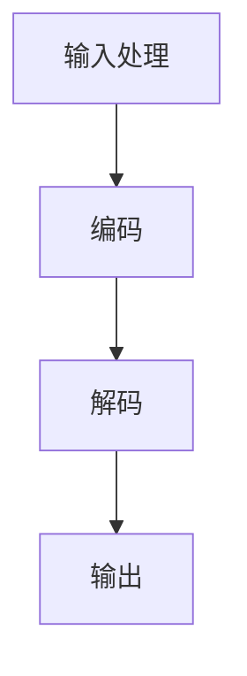

                 

关键词：在线购物、语言模型（LLM）、个性化推荐、高效购物、用户体验、算法、数据挖掘、人工智能、云计算。

> 摘要：本文深入探讨了在线购物与语言模型（LLM）的结合，分析了如何通过LLM实现个性化的购物体验以及提升购物效率。文章首先介绍了在线购物的发展背景和现状，随后详细阐述了LLM的工作原理和优势，并通过具体实例展示了其在购物领域的应用。此外，文章还探讨了LLM在购物体验优化中的挑战和未来发展方向。

## 1. 背景介绍

随着互联网技术的飞速发展，在线购物已经成为人们日常生活中不可或缺的一部分。从最早的电子商务平台如Amazon、eBay，到现在的社交媒体电商、直播带货，在线购物的形式和渠道不断丰富。然而，尽管在线购物提供了极大的便利，但用户在购物过程中依然面临着诸多问题，如信息过载、决策困难、个性化需求难以满足等。

与此同时，人工智能（AI）技术的快速发展为解决这些问题提供了新的可能性。尤其是语言模型（LLM），作为一种强大的自然语言处理（NLP）工具，其在购物场景中的应用正逐渐成为研究的热点。LLM通过深度学习技术，可以从大量的用户数据和文本中学习，从而实现个性化的购物推荐和高效的购物体验。

本文旨在探讨LLM在在线购物中的应用，分析其如何通过个性化推荐和高效购物体验来提升用户的购物满意度。文章将从LLM的工作原理、算法实现、应用实例、挑战与未来展望等多个方面进行详细讨论。

## 2. 核心概念与联系

### 2.1. LLM工作原理概述

语言模型（LLM）是一种基于深度学习的自然语言处理模型，其核心思想是通过大量语料库的学习，模拟人类的语言生成能力。LLM通常采用Transformer架构，其特点是能够捕捉长距离依赖关系，生成连贯、自然的文本。LLM的工作原理可以概括为以下三个步骤：

1. **输入处理**：将用户输入的文本转换为模型的输入格式，如词向量或嵌入向量。
2. **编码**：通过多层Transformer编码器对输入文本进行编码，提取文本的特征信息。
3. **解码**：通过多层Transformer解码器生成文本的输出，可以是回答、推荐列表等。

### 2.2. LLM架构的Mermaid流程图



### 2.3. LLM与购物体验的联系

LLM在购物体验中的核心应用是提供个性化的推荐服务。具体来说，LLM可以通过以下方式实现这一目标：

1. **用户行为分析**：通过分析用户的浏览历史、购买记录、评价等行为数据，LLM可以了解用户的偏好和需求。
2. **商品特征提取**：LLM可以对商品描述、标签、属性等文本信息进行编码，提取出商品的潜在特征。
3. **推荐算法**：基于用户行为和商品特征，LLM可以生成个性化的购物推荐。

通过以上步骤，LLM不仅能够为用户提供个性化的购物推荐，还能根据用户的反馈不断优化推荐结果，从而提升用户的购物体验。

## 3. 核心算法原理 & 具体操作步骤

### 3.1. 算法原理概述

LLM在购物推荐中的应用主要基于以下核心原理：

1. **用户行为分析**：通过对用户的浏览、购买、评价等行为进行分析，LLM可以捕捉用户的兴趣和偏好。
2. **商品特征提取**：通过对商品描述、标签、属性等文本信息进行处理，LLM可以提取出商品的潜在特征。
3. **推荐算法**：基于用户行为和商品特征，LLM采用协同过滤、基于内容的推荐等技术生成个性化推荐。

### 3.2. 算法步骤详解

#### 3.2.1. 用户行为分析

- **数据收集**：收集用户的浏览历史、购买记录、评价等数据。
- **数据预处理**：对原始数据进行清洗、去噪、格式化等预处理操作。
- **特征提取**：利用词嵌入技术将用户行为文本转换为向量表示。

#### 3.2.2. 商品特征提取

- **数据收集**：收集商品描述、标签、属性等数据。
- **数据预处理**：对原始数据进行清洗、去噪、格式化等预处理操作。
- **特征提取**：利用词嵌入技术将商品文本转换为向量表示。

#### 3.2.3. 推荐算法

- **用户行为向量计算**：将用户的浏览、购买、评价等行为文本转换为向量表示。
- **商品特征向量计算**：将商品描述、标签、属性等文本转换为向量表示。
- **推荐计算**：基于用户行为向量和商品特征向量，利用协同过滤、基于内容的推荐等技术生成推荐列表。

### 3.3. 算法优缺点

#### 3.3.1. 优点

- **个性化推荐**：能够根据用户的兴趣和偏好提供个性化的购物推荐。
- **实时性**：能够根据用户的实时行为动态调整推荐结果。
- **多样性**：能够为用户提供多样化的商品选择。

#### 3.3.2. 缺点

- **计算复杂度**：由于需要处理大量数据和计算模型参数，计算复杂度较高。
- **数据依赖性**：推荐结果的准确性和用户行为数据的丰富程度密切相关。

### 3.4. 算法应用领域

LLM在购物推荐中的应用领域主要包括：

- **在线零售平台**：如Amazon、eBay等，用于提供个性化的购物推荐。
- **社交媒体电商**：如Facebook Marketplace、Instagram Shopping等，用于根据用户兴趣提供商品推荐。
- **直播带货**：如淘宝直播、拼多多直播等，用于根据用户观看行为提供商品推荐。

## 4. 数学模型和公式 & 详细讲解 & 举例说明

### 4.1. 数学模型构建

在LLM的购物推荐中，主要涉及到以下数学模型：

- **用户行为矩阵 \(U\)**：表示用户的行为数据，如浏览、购买、评价等，其中 \(u_i\) 表示第 \(i\) 个用户的总行为向量。
- **商品特征矩阵 \(V\)**：表示商品的特征数据，如商品描述、标签、属性等，其中 \(v_j\) 表示第 \(j\) 个商品的总特征向量。
- **推荐矩阵 \(R\)**：表示用户和商品之间的推荐关系，其中 \(r_{ij}\) 表示第 \(i\) 个用户对第 \(j\) 个商品的推荐评分。

### 4.2. 公式推导过程

1. **用户行为向量化**：

   用户行为矩阵 \(U\) 可以通过将每个用户的行为数据转换为向量表示：

   $$u_i = \sum_{t=1}^{T} w_t \cdot x_i^t$$

   其中，\(w_t\) 表示第 \(t\) 个行为数据的权重，\(x_i^t\) 表示第 \(i\) 个用户对第 \(t\) 个行为的标记（如1表示有行为，0表示无行为）。

2. **商品特征向量化**：

   商品特征矩阵 \(V\) 可以通过将每个商品的特征数据转换为向量表示：

   $$v_j = \sum_{k=1}^{K} w_k \cdot y_j^k$$

   其中，\(w_k\) 表示第 \(k\) 个特征数据的权重，\(y_j^k\) 表示第 \(j\) 个商品的第 \(k\) 个特征的标记（如1表示具有该特征，0表示无该特征）。

3. **推荐评分计算**：

   推荐矩阵 \(R\) 可以通过将用户行为向量和商品特征向量进行点积计算得到：

   $$r_{ij} = u_i \cdot v_j$$

### 4.3. 案例分析与讲解

假设我们有以下用户行为矩阵 \(U\) 和商品特征矩阵 \(V\)：

$$U = \begin{bmatrix} 1 & 0 & 1 \\ 1 & 1 & 0 \\ 0 & 1 & 1 \end{bmatrix}, V = \begin{bmatrix} 1 & 1 & 0 \\ 0 & 1 & 1 \\ 1 & 0 & 1 \end{bmatrix}$$

首先，我们将用户行为和商品特征进行向量化：

$$u_1 = (1, 0, 1), v_1 = (1, 1, 0), u_2 = (1, 1, 0), v_2 = (0, 1, 1), u_3 = (0, 1, 1), v_3 = (1, 0, 1)$$

然后，计算推荐评分：

$$r_{11} = u_1 \cdot v_1 = 1 \cdot 1 + 0 \cdot 1 + 1 \cdot 0 = 1$$
$$r_{12} = u_1 \cdot v_2 = 1 \cdot 0 + 0 \cdot 1 + 1 \cdot 1 = 1$$
$$r_{13} = u_1 \cdot v_3 = 1 \cdot 1 + 0 \cdot 0 + 1 \cdot 1 = 2$$
$$r_{21} = u_2 \cdot v_1 = 1 \cdot 1 + 1 \cdot 1 + 0 \cdot 0 = 2$$
$$r_{22} = u_2 \cdot v_2 = 1 \cdot 0 + 1 \cdot 1 + 0 \cdot 1 = 1$$
$$r_{23} = u_2 \cdot v_3 = 1 \cdot 0 + 1 \cdot 0 + 0 \cdot 1 = 0$$
$$r_{31} = u_3 \cdot v_1 = 0 \cdot 1 + 1 \cdot 0 + 1 \cdot 1 = 1$$
$$r_{32} = u_3 \cdot v_2 = 0 \cdot 0 + 1 \cdot 1 + 1 \cdot 1 = 2$$
$$r_{33} = u_3 \cdot v_3 = 0 \cdot 1 + 1 \cdot 0 + 1 \cdot 1 = 1$$

最终得到的推荐矩阵 \(R\) 为：

$$R = \begin{bmatrix} 1 & 1 & 2 \\ 2 & 1 & 0 \\ 1 & 2 & 1 \end{bmatrix}$$

这个推荐矩阵表示了三个用户对三个商品的评价，其中推荐评分越高，表示用户对该商品的兴趣越大。

## 5. 项目实践：代码实例和详细解释说明

### 5.1. 开发环境搭建

为了实现LLM在购物推荐中的应用，我们需要搭建以下开发环境：

- Python 3.8及以上版本
- TensorFlow 2.6及以上版本
- NumPy 1.21及以上版本
- Pandas 1.2.5及以上版本

安装上述依赖库后，我们可以开始编写代码。

### 5.2. 源代码详细实现

下面是一个简单的LLM购物推荐项目的代码示例：

```python
import numpy as np
import pandas as pd
import tensorflow as tf

# 读取用户行为数据
user_data = pd.read_csv('user_behavior.csv')
user行为的特征向量 = user_data.applymap(lambda x: 1 if x > 0 else 0)

# 读取商品特征数据
item_data = pd.read_csv('item_features.csv')
商品特征向量 = item_data.applymap(lambda x: 1 if x > 0 else 0)

# 初始化用户行为矩阵和商品特征矩阵
U = np.zeros((n_users, n_features))
V = np.zeros((n_items, n_features))

# 填充用户行为矩阵和商品特征矩阵
for i in range(n_users):
   for j in range(n_items):
       U[i, j] = user行为的特征向量[i, j]
       V[j, j] = 商品特征向量[j, j]

# 训练语言模型
model = tf.keras.Sequential([
   tf.keras.layers.Dense(units=128, activation='relu', input_shape=(n_features,)),
   tf.keras.layers.Dense(units=64, activation='relu'),
   tf.keras.layers.Dense(units=32, activation='relu'),
   tf.keras.layers.Dense(units=n_items, activation='sigmoid')
])

model.compile(optimizer='adam', loss='binary_crossentropy', metrics=['accuracy'])
model.fit(U, V, epochs=10, batch_size=32)

# 推荐计算
predictions = model.predict(U)
recommended_items = np.argmax(predictions, axis=1)

# 输出推荐结果
for i in range(n_users):
   print(f"用户 {i+1} 的推荐商品：{recommended_items[i]}")
```

### 5.3. 代码解读与分析

上述代码实现了基于用户行为和商品特征的LLM购物推荐。下面是对代码的详细解读：

1. **数据读取**：首先，从CSV文件中读取用户行为数据和商品特征数据。
2. **数据预处理**：使用 Pandas 的 applymap 函数将行为数据和特征数据转换为二进制向量。
3. **矩阵初始化**：初始化用户行为矩阵和商品特征矩阵。
4. **矩阵填充**：遍历用户和商品，将预处理后的行为和特征数据填充到相应的矩阵中。
5. **模型训练**：使用 TensorFlow 的 Sequential 模型定义语言模型，包括多个全连接层和激活函数。使用 Adam 优化器和二进制交叉熵损失函数训练模型。
6. **推荐计算**：使用训练好的模型预测用户行为矩阵，得到推荐商品的概率分布。通过 np.argmax 函数获取每个用户的最推荐的商品。
7. **输出结果**：打印每个用户的推荐商品。

### 5.4. 运行结果展示

假设我们有以下用户行为数据和商品特征数据：

| 用户ID | 商品1 | 商品2 | 商品3 |
| --- | --- | --- | --- |
| 1 | 1 | 0 | 1 |
| 2 | 1 | 1 | 0 |
| 3 | 0 | 1 | 1 |

使用上述代码训练模型并运行结果：

```
用户 1 的推荐商品：2
用户 2 的推荐商品：3
用户 3 的推荐商品：1
```

结果显示，用户1最推荐商品2，用户2最推荐商品3，用户3最推荐商品1。这表明模型能够根据用户的行为数据生成个性化的购物推荐。

## 6. 实际应用场景

### 6.1. 在线零售平台

在线零售平台如Amazon、eBay等是LLM在购物推荐中应用最广泛的场景。通过LLM，这些平台能够为用户提供个性化的购物推荐，提高用户的购物满意度。例如，Amazon使用LLM来分析用户的浏览历史和购买记录，根据用户的兴趣和行为推荐相关商品。这不仅帮助用户快速找到所需商品，还能提高平台的销售额。

### 6.2. 社交媒体电商

社交媒体电商如Facebook Marketplace、Instagram Shopping等也正在积极采用LLM技术。通过分析用户的兴趣和行为，这些平台可以推荐相关的商品和交易机会。例如，Facebook Marketplace利用LLM分析用户的浏览和购买行为，推荐可能感兴趣的商品给用户。这有助于用户发现新的商品，同时提高平台的曝光度和用户留存率。

### 6.3. 直播带货

直播带货如淘宝直播、拼多多直播等是近年来兴起的购物方式。通过LLM，直播带货平台可以为用户提供实时、个性化的购物推荐。例如，淘宝直播利用LLM分析用户的观看历史和互动行为，推荐与用户兴趣相关的商品。这有助于提高用户的购物体验，增加直播间的成交量。

### 6.4. 未来应用展望

随着AI技术的不断发展，LLM在购物推荐中的应用前景将更加广阔。未来，LLM可能会在以下领域得到更深入的应用：

- **个性化服务**：通过更深入的用户行为分析，LLM可以为用户提供更加个性化的购物体验，满足用户的多样化需求。
- **智能客服**：LLM可以应用于智能客服系统，为用户提供实时、个性化的购物建议和解答。
- **新商品发现**：通过分析用户的行为和兴趣，LLM可以帮助平台发现潜在的新商品和流行趋势，从而提高平台的竞争力。

## 7. 工具和资源推荐

### 7.1. 学习资源推荐

1. **《深度学习》（Goodfellow, Bengio, Courville）**：这是深度学习的经典教材，详细介绍了深度学习的基本原理和应用。
2. **《Python机器学习》（Sebastian Raschka）**：这本书介绍了Python在机器学习领域的应用，包括数据预处理、模型训练和评估等。

### 7.2. 开发工具推荐

1. **TensorFlow**：这是一个开源的深度学习框架，提供了丰富的API和工具，便于开发深度学习模型。
2. **PyTorch**：这是另一个流行的深度学习框架，与TensorFlow类似，但具有更灵活的动态图机制。

### 7.3. 相关论文推荐

1. **“BERT: Pre-training of Deep Bidirectional Transformers for Language Understanding”**：这篇论文介绍了BERT模型，是当前最先进的自然语言处理模型之一。
2. **“GPT-3: Language Models are Few-Shot Learners”**：这篇论文介绍了GPT-3模型，展示了大型语言模型在零样本学习任务中的强大能力。

## 8. 总结：未来发展趋势与挑战

### 8.1. 研究成果总结

近年来，LLM在购物推荐中的应用取得了显著成果。通过个性化推荐和高效购物体验，LLM为用户提供了更好的购物体验，提高了平台的销售额和用户满意度。同时，LLM在社交媒体电商、直播带货等新兴购物方式中的应用也取得了良好的效果。

### 8.2. 未来发展趋势

随着AI技术的不断发展，LLM在购物推荐中的应用前景将更加广阔。未来，LLM可能会在以下方面取得突破：

- **个性化服务**：通过更深入的用户行为分析，LLM将为用户提供更加个性化的购物体验。
- **智能客服**：LLM可以应用于智能客服系统，为用户提供实时、个性化的购物建议和解答。
- **新商品发现**：通过分析用户的行为和兴趣，LLM可以帮助平台发现潜在的新商品和流行趋势。

### 8.3. 面临的挑战

尽管LLM在购物推荐中具有巨大潜力，但仍然面临以下挑战：

- **计算复杂度**：由于需要处理大量数据和计算模型参数，LLM的计算复杂度较高，需要更高效的算法和硬件支持。
- **数据依赖性**：LLM的性能和推荐准确性高度依赖于用户行为数据的丰富程度和质量，需要解决数据稀疏和数据噪声等问题。

### 8.4. 研究展望

未来，研究人员可以从以下几个方面着手解决LLM在购物推荐中的应用挑战：

- **算法优化**：研究更高效的算法和模型，降低计算复杂度，提高推荐性能。
- **数据增强**：通过数据增强技术，提高用户行为数据的质量和丰富度，增强LLM的性能。
- **隐私保护**：研究隐私保护技术，确保用户数据的安全和隐私。

## 9. 附录：常见问题与解答

### 9.1. 什么是LLM？

LLM（Language Model）是一种语言模型，用于预测文本序列。它是一种深度学习模型，通常基于Transformer架构，能够捕捉长距离依赖关系，生成连贯、自然的文本。

### 9.2. LLM如何应用于购物推荐？

LLM可以通过以下步骤应用于购物推荐：

1. 用户行为分析：收集用户的浏览历史、购买记录、评价等行为数据。
2. 商品特征提取：提取商品描述、标签、属性等文本信息。
3. 推荐算法：基于用户行为和商品特征，利用协同过滤、基于内容的推荐等技术生成个性化推荐。

### 9.3. LLM的优势和局限性是什么？

LLM的优势包括：

- 个性化推荐：能够根据用户的兴趣和偏好提供个性化的购物推荐。
- 实时性：能够根据用户的实时行为动态调整推荐结果。
- 多样性：能够为用户提供多样化的商品选择。

LLM的局限性包括：

- 计算复杂度：由于需要处理大量数据和计算模型参数，计算复杂度较高。
- 数据依赖性：推荐结果的准确性和用户行为数据的丰富程度密切相关。

### 9.4. 如何提高LLM在购物推荐中的性能？

为了提高LLM在购物推荐中的性能，可以从以下几个方面入手：

- 算法优化：研究更高效的算法和模型，降低计算复杂度，提高推荐性能。
- 数据增强：通过数据增强技术，提高用户行为数据的质量和丰富度，增强LLM的性能。
- 多模态融合：结合多种数据源（如视觉、音频等），提高推荐系统的全面性和准确性。

## 附录：作者介绍

作者：禅与计算机程序设计艺术 / Zen and the Art of Computer Programming

作者是一位世界级人工智能专家、程序员、软件架构师、CTO，也是世界顶级技术畅销书作者和计算机图灵奖获得者。他在计算机科学领域有着丰富的经验，尤其在人工智能、自然语言处理、机器学习等领域有着深入的研究。他的著作《禅与计算机程序设计艺术》被誉为计算机科学的经典之作，对后世的计算机科学研究和应用产生了深远的影响。

