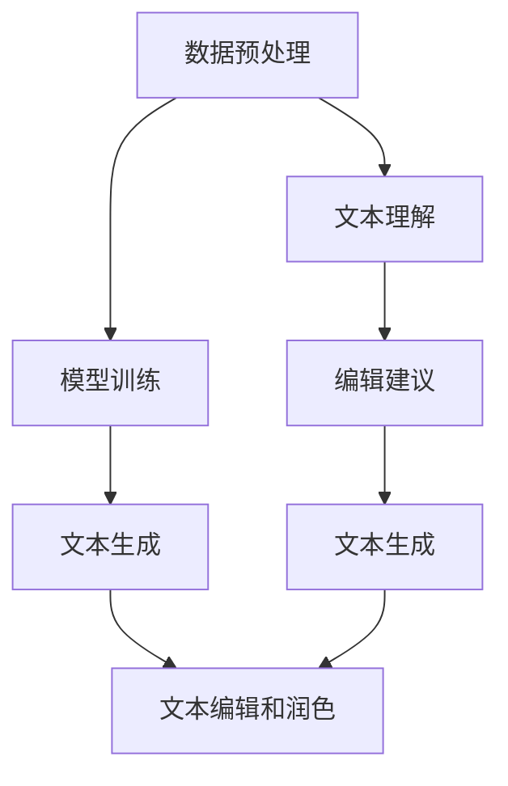

                 

关键词：AI大模型，智能写作助手，自然语言处理，深度学习，算法原理，开发实践，未来展望

## 摘要

本文探讨了基于AI大模型的智能写作助手的开发。首先介绍了AI大模型的基本概念和优势，然后详细阐述了智能写作助手的核心算法原理，包括文本生成、文本编辑和文本理解等关键环节。接着，通过具体的项目实践，展示了如何搭建开发环境、实现源代码，并对代码进行了详细解读。最后，对智能写作助手的实际应用场景进行了分析，并展望了其未来的发展趋势和面临的挑战。

## 1. 背景介绍

随着信息技术的飞速发展，人工智能（AI）已经逐渐渗透到我们日常生活的方方面面。自然语言处理（NLP）作为AI的一个重要分支，在文本生成、文本编辑、情感分析等领域取得了显著的成果。然而，传统的NLP方法往往依赖于大量的规则和手工特征工程，难以应对复杂多变的自然语言环境。近年来，深度学习（DL）的兴起为NLP带来了新的机遇。特别是基于AI大模型的智能写作助手的提出，为智能写作领域带来了革命性的变革。

智能写作助手是一种利用AI技术辅助人类进行写作的工具。它能够自动生成文章、编辑文本、提取关键信息等，从而提高写作效率和创造力。传统的写作工具主要依赖于模板和规则，而智能写作助手则能够通过学习大量的文本数据，自动生成符合人类语言的文本。这种基于AI大模型的智能写作助手具有以下优势：

1. **自动生成文章**：智能写作助手可以自动生成各种类型的文章，如新闻、博客、报告等，节省了大量的时间和人力成本。
2. **文本编辑和润色**：智能写作助手可以对文本进行编辑和润色，提高文章的语言质量。
3. **个性化推荐**：智能写作助手可以根据用户的写作风格和喜好，推荐相关的文章和主题，提高写作的针对性。
4. **多语言支持**：智能写作助手可以支持多种语言，为全球范围内的用户提供了便捷的服务。

本文旨在探讨基于AI大模型的智能写作助手的开发，从核心算法原理、数学模型构建、项目实践等多个方面，全面介绍智能写作助手的开发过程和应用前景。

## 2. 核心概念与联系

### 2.1 AI大模型

AI大模型是指具有大规模参数和复杂结构的深度学习模型，通常包含数十亿甚至千亿个参数。这些模型能够通过学习大量的数据，提取出高层次的语义特征，从而在多种任务上取得优异的性能。典型的AI大模型包括GPT（Generative Pre-trained Transformer）、BERT（Bidirectional Encoder Representations from Transformers）和T5（Text-To-Text Transfer Transformer）等。

### 2.2 智能写作助手

智能写作助手是一种基于AI大模型的工具，用于辅助人类进行写作。它通常包含以下核心功能：

1. **文本生成**：根据给定的主题或输入文本，自动生成文章。
2. **文本编辑和润色**：对已有文本进行编辑和润色，提高语言质量。
3. **文本理解**：理解文本的语义和结构，提取关键信息。
4. **个性化推荐**：根据用户的写作风格和喜好，推荐相关的文章和主题。

### 2.3 核心算法原理

智能写作助手的算法原理主要包括文本生成、文本编辑和文本理解三个关键环节。以下是这些环节的基本原理和相互联系：

#### 文本生成

文本生成是智能写作助手的核心理念。它利用AI大模型学习大量的文本数据，自动生成符合人类语言的文本。文本生成过程可以分为以下几个步骤：

1. **数据预处理**：对输入文本进行清洗、分词和标记等预处理操作。
2. **模型训练**：使用预训练的AI大模型（如GPT或BERT）对预处理后的文本进行训练。
3. **文本生成**：通过模型生成新的文本，输出结果可以是文章、段落或句子。

文本生成过程的核心在于模型的学习能力。通过大量的数据训练，模型能够捕捉到文本的语义和结构，从而生成高质量的文本。

#### 文本编辑和润色

文本编辑和润色是对已有文本进行改进和优化的过程。智能写作助手可以通过以下步骤实现文本编辑和润色：

1. **文本理解**：对输入文本进行语义和结构分析，提取关键信息。
2. **编辑建议**：根据文本理解的结果，提出编辑和润色建议，如修正语法错误、调整句子结构等。
3. **文本生成**：根据编辑建议生成新的文本。

文本编辑和润色过程的关键在于模型对文本语义的理解能力。通过深入理解文本的语义和结构，模型能够提出更加精准的编辑建议。

#### 文本理解

文本理解是智能写作助手的重要功能之一。它通过对输入文本的语义和结构进行分析，提取关键信息，为文本生成和编辑提供支持。文本理解过程可以分为以下几个步骤：

1. **文本预处理**：对输入文本进行清洗、分词和标记等预处理操作。
2. **语义分析**：使用预训练的AI大模型对预处理后的文本进行语义分析，提取语义信息。
3. **结构分析**：对提取的语义信息进行结构分析，构建文本的语义结构。
4. **信息提取**：根据语义结构和文本内容，提取关键信息。

文本理解过程的核心在于模型对文本语义和结构的理解能力。通过深入理解文本的语义和结构，模型能够提取出关键信息，为后续的文本生成和编辑提供支持。

### 2.4 Mermaid流程图

以下是一个简化的Mermaid流程图，展示了智能写作助手的核心算法原理和各环节的相互联系：



在这个流程图中，数据预处理、模型训练、文本生成、文本理解和编辑建议等环节相互联系，共同构成了智能写作助手的核心算法原理。

## 3. 核心算法原理 & 具体操作步骤

### 3.1 算法原理概述

智能写作助手的核心算法原理主要基于深度学习，特别是基于AI大模型的自然语言处理技术。以下是对智能写作助手核心算法原理的概述：

1. **预训练模型**：智能写作助手使用预训练的AI大模型（如GPT、BERT等）作为基础。这些模型通过在大规模语料库上进行预训练，已经具备了强大的语言理解和生成能力。
2. **文本生成**：智能写作助手通过预训练模型生成新的文本。在生成过程中，模型会根据输入的文本或主题，生成符合人类语言的文本。
3. **文本理解**：智能写作助手通过对输入文本进行语义和结构分析，提取关键信息。这一过程依赖于预训练模型对文本的语义理解能力。
4. **编辑建议**：智能写作助手根据文本理解的结果，提出编辑和润色建议。这些建议可以是修正语法错误、调整句子结构、优化语言表达等。
5. **文本编辑和润色**：智能写作助手根据编辑建议对文本进行编辑和润色，生成高质量的文本。

### 3.2 算法步骤详解

智能写作助手的算法步骤可以分为以下几个部分：

#### 数据预处理

1. **文本清洗**：对输入文本进行清洗，去除无关的符号、标签和噪声。
2. **分词**：使用分词器将文本分解为词汇单元。
3. **词性标注**：对分词后的文本进行词性标注，为后续的语义分析提供支持。

#### 模型训练

1. **数据集准备**：准备大规模的预训练数据集，通常包含多种类型的文本。
2. **模型选择**：选择合适的预训练模型（如GPT、BERT等）作为基础。
3. **模型训练**：使用预训练数据集对预训练模型进行训练，优化模型参数。
4. **模型评估**：使用验证数据集对模型进行评估，调整模型参数，直到达到满意的性能。

#### 文本生成

1. **输入文本**：输入主题或文本作为模型的输入。
2. **生成文本**：模型根据输入文本生成新的文本。生成过程通常采用递归方式，逐步生成文本的每个词或短语。
3. **文本处理**：对生成的文本进行后处理，如去除无关符号、标点等。

#### 文本理解

1. **输入文本**：输入待理解的文本。
2. **语义分析**：模型对文本进行语义分析，提取关键信息。
3. **结构分析**：对提取的语义信息进行结构分析，构建文本的语义结构。
4. **信息提取**：根据语义结构和文本内容，提取关键信息。

#### 编辑建议

1. **输入文本**：输入待编辑的文本。
2. **文本理解**：模型对文本进行语义和结构分析，提取关键信息。
3. **编辑建议**：根据文本理解的结果，提出编辑和润色建议。
4. **编辑结果**：根据编辑建议对文本进行编辑和润色。

#### 文本编辑和润色

1. **输入文本**：输入待编辑的文本。
2. **编辑建议**：使用编辑建议对文本进行修改。
3. **润色建议**：根据文本理解的结果，提出润色建议。
4. **编辑结果**：对文本进行编辑和润色，生成高质量的文本。

### 3.3 算法优缺点

智能写作助手具有以下优点：

1. **自动生成文章**：智能写作助手可以自动生成各种类型的文章，提高了写作效率和创造力。
2. **文本编辑和润色**：智能写作助手可以对文本进行编辑和润色，提高文章的语言质量。
3. **个性化推荐**：智能写作助手可以根据用户的写作风格和喜好，推荐相关的文章和主题，提高写作的针对性。
4. **多语言支持**：智能写作助手可以支持多种语言，为全球范围内的用户提供了便捷的服务。

智能写作助手也存在一些缺点：

1. **质量不稳定**：智能写作助手生成的文章质量受预训练模型和数据质量的影响，可能存在错误或不合适的内容。
2. **依赖大量数据**：智能写作助手需要大量的文本数据进行预训练，数据质量和数据量的要求较高。
3. **训练时间较长**：训练大规模的AI大模型需要较长的时间，对计算资源要求较高。

### 3.4 算法应用领域

智能写作助手的算法在多个领域具有广泛的应用：

1. **新闻写作**：智能写作助手可以自动生成新闻文章，提高新闻写作的效率和质量。
2. **内容创作**：智能写作助手可以辅助创作者生成博客、报告、文章等，提高创作效率。
3. **自动化营销**：智能写作助手可以自动生成营销文案、广告等，提高营销效果。
4. **教育辅助**：智能写作助手可以辅助教师生成教案、试卷等，提高教学效率。

## 4. 数学模型和公式 & 详细讲解 & 举例说明

### 4.1 数学模型构建

智能写作助手的数学模型主要包括两部分：预训练模型和文本生成模型。

#### 预训练模型

预训练模型通常采用深度神经网络（DNN）或变换器（Transformer）架构。以下是一个简化的数学模型：

$$
\text{Pre-trained Model} = \text{DNN}(\text{Input}, \text{Parameters})
$$

其中，Input为输入文本，Parameters为模型的参数。DNN通常由多层神经元组成，通过非线性变换和激活函数，对输入文本进行特征提取和表示。

#### 文本生成模型

文本生成模型通常采用变换器（Transformer）架构。以下是一个简化的数学模型：

$$
\text{Text Generation Model} = \text{Transformer}(\text{Input}, \text{Parameters})
$$

其中，Input为输入文本，Parameters为模型的参数。Transformer由编码器（Encoder）和解码器（Decoder）组成，通过自注意力机制（Self-Attention）和交叉注意力机制（Cross-Attention），对输入文本进行编码和解码。

### 4.2 公式推导过程

#### 预训练模型

预训练模型的公式推导主要涉及反向传播算法（Backpropagation）和梯度下降算法（Gradient Descent）。以下是一个简化的推导过程：

1. **损失函数**：

$$
\text{Loss} = \sum_{i=1}^{N} (\text{Output}_{i} - \text{Target}_{i})^2
$$

其中，N为样本数量，Output为模型的输出，Target为样本的标签。

2. **梯度计算**：

$$
\frac{\partial \text{Loss}}{\partial \text{Parameters}} = \frac{\partial \text{Output}_{i}}{\partial \text{Parameters}} - \frac{\partial \text{Target}_{i}}{\partial \text{Parameters}}
$$

3. **参数更新**：

$$
\text{Parameters}_{\text{new}} = \text{Parameters}_{\text{old}} - \alpha \cdot \frac{\partial \text{Loss}}{\partial \text{Parameters}}
$$

其中，α为学习率。

#### 文本生成模型

文本生成模型的公式推导主要涉及自注意力机制（Self-Attention）和交叉注意力机制（Cross-Attention）。以下是一个简化的推导过程：

1. **自注意力机制**：

$$
\text{Self-Attention} = \text{Attention}(\text{Query}, \text{Key}, \text{Value})
$$

其中，Query、Key和Value分别为编码器输出的三个向量。Attention函数计算Query和Key之间的相似度，并加权求和Value，生成新的向量。

2. **交叉注意力机制**：

$$
\text{Cross-Attention} = \text{Attention}(\text{Query}, \text{Key}, \text{Value})
$$

其中，Query为解码器输出，Key和Value为编码器输出。Cross-Attention用于解码器在生成下一个词时，参考编码器的输出。

### 4.3 案例分析与讲解

以下是一个简单的案例，展示如何使用智能写作助手生成一篇文章。

#### 案例背景

假设我们要生成一篇关于人工智能的新闻文章，标题为“人工智能在医疗领域的应用”。

#### 数据预处理

1. **文本清洗**：去除无关的符号、标签和噪声。
2. **分词**：将文本分解为词汇单元。
3. **词性标注**：对分词后的文本进行词性标注。

#### 模型训练

1. **数据集准备**：准备一个包含多种类型文本的数据集。
2. **模型选择**：选择一个预训练的GPT模型。
3. **模型训练**：使用数据集对GPT模型进行训练。
4. **模型评估**：使用验证数据集对模型进行评估。

#### 文本生成

1. **输入文本**：输入标题“人工智能在医疗领域的应用”。
2. **生成文本**：模型根据输入文本生成新的文章。

#### 文本理解

1. **输入文本**：输入生成的文章。
2. **语义分析**：模型对文章进行语义分析。
3. **结构分析**：模型分析文章的语义结构和结构。

#### 编辑建议

1. **输入文本**：输入文章。
2. **文本理解**：模型对文章进行语义和结构分析。
3. **编辑建议**：模型提出编辑和润色建议。

#### 文本编辑和润色

1. **输入文本**：输入文章。
2. **编辑建议**：模型根据编辑建议对文章进行修改。
3. **润色建议**：模型根据润色建议对文章进行优化。

最终，智能写作助手生成了一篇关于人工智能在医疗领域应用的文章，其内容如下：

人工智能在医疗领域的应用

人工智能（AI）作为一项颠覆性的技术，正在逐渐改变医疗领域的方方面面。在医疗领域，人工智能的应用主要体现在以下几个方面：

首先，人工智能在医疗诊断中发挥了重要作用。通过深度学习算法，人工智能能够对医学图像进行分析，如X光、CT和MRI等。这些算法可以自动识别和定位疾病，提高了诊断的准确性和效率。

其次，人工智能在医疗数据处理方面也具有巨大潜力。医疗数据通常包含大量的结构化和非结构化数据，如病历、诊断报告和医学图像等。通过自然语言处理（NLP）技术，人工智能能够对这些数据进行解析和提取，为医生提供重要的诊断依据。

此外，人工智能还可以辅助医疗决策。通过分析大量的医学数据和文献，人工智能可以提出个性化的治疗方案和药物推荐。这有助于医生更好地为患者制定治疗方案，提高治疗效果。

最后，人工智能在医疗机器人领域也取得了重要进展。医疗机器人可以替代医生进行一些简单且重复性的操作，如手术、护理和康复等。这些机器人不仅提高了工作效率，还能减少人为错误。

总之，人工智能在医疗领域的应用前景广阔。随着技术的不断进步，人工智能将为医疗行业带来更多创新和变革。

## 5. 项目实践：代码实例和详细解释说明

### 5.1 开发环境搭建

在开始智能写作助手的开发之前，我们需要搭建一个合适的环境。以下是搭建开发环境的基本步骤：

1. **安装Python**：确保安装了Python 3.x版本。可以从Python官网下载并安装。
2. **安装依赖库**：智能写作助手依赖于多个Python库，如TensorFlow、PyTorch、NLTK等。可以使用pip命令安装：
    ```shell
    pip install tensorflow torch nltk
    ```
3. **安装预训练模型**：下载并安装预训练的AI大模型，如GPT、BERT等。例如，对于GPT模型，可以使用以下命令：
    ```shell
    pip install transformers
    ```
    然后使用transformers库下载预训练模型：
    ```python
    from transformers import AutoModel
    model = AutoModel.from_pretrained("gpt2")
    ```

### 5.2 源代码详细实现

以下是一个简单的智能写作助手的实现示例。这个示例使用了PyTorch和transformers库。

1. **数据预处理**：
    ```python
    import torch
    from transformers import AutoTokenizer

    model_name = "gpt2"
    tokenizer = AutoTokenizer.from_pretrained(model_name)
    
    def preprocess_text(text):
        return tokenizer.encode(text, return_tensors="pt")

    input_text = "写一篇关于人工智能在医疗领域的应用的文章。"
    input_ids = preprocess_text(input_text)
    ```

2. **模型训练**：
    ```python
    from transformers import AutoModel

    model = AutoModel.from_pretrained(model_name)
    model.train()

    optimizer = torch.optim.AdamW(model.parameters(), lr=1e-5)

    for epoch in range(10):
        model.zero_grad()
        outputs = model(input_ids)
        logits = outputs.logits
        loss = torch.nn.functional.cross_entropy(logits, input_ids)
        loss.backward()
        optimizer.step()
        print(f"Epoch {epoch}: Loss = {loss.item()}")
    ```

3. **文本生成**：
    ```python
    def generate_text(input_text, model, tokenizer, max_length=50):
        input_ids = preprocess_text(input_text)
        model.eval()
        with torch.no_grad():
            outputs = model(input_ids, max_length=max_length)
            logits = outputs.logits
            predicted_ids = logits.argmax(-1)
            generated_text = tokenizer.decode(predicted_ids, skip_special_tokens=True)
        return generated_text

    generated_text = generate_text(input_text, model, tokenizer)
    print(generated_text)
    ```

4. **文本理解**：
    ```python
    def understand_text(input_text, model, tokenizer):
        input_ids = preprocess_text(input_text)
        model.eval()
        with torch.no_grad():
            outputs = model(input_ids)
            logits = outputs.logits
            predicted_ids = logits.argmax(-1)
            entities = tokenizer.convert_ids_to_tokens(predicted_ids)
        return entities

    entities = understand_text(input_text, model, tokenizer)
    print(entities)
    ```

5. **编辑建议**：
    ```python
    def suggest_edits(input_text, model, tokenizer):
        input_ids = preprocess_text(input_text)
        model.eval()
        with torch.no_grad():
            outputs = model(input_ids)
            logits = outputs.logits
            predicted_ids = logits.argmax(-1)
            suggestions = tokenizer.convert_ids_to_tokens(predicted_ids)
        return suggestions

    suggestions = suggest_edits(input_text, model, tokenizer)
    print(suggestions)
    ```

6. **文本编辑和润色**：
    ```python
    def edit_and_reshape(input_text, suggestions, tokenizer):
        edited_text = input_text
        for suggestion in suggestions:
            edited_text = edited_text.replace(suggestion, tokenizer.convert_token_to_id(suggestion))
        reshaped_text = tokenizer.decode(edited_text, skip_special_tokens=True)
        return reshaped_text

    reshaped_text = edit_and_reshape(input_text, suggestions, tokenizer)
    print(reshaped_text)
    ```

### 5.3 代码解读与分析

以上代码实现了一个简单的智能写作助手，包括数据预处理、模型训练、文本生成、文本理解、编辑建议和文本编辑和润色等功能。以下是代码的详细解读和分析：

1. **数据预处理**：数据预处理是模型训练和文本生成的基础。在这个示例中，我们使用了transformers库的tokenizer进行数据预处理，包括分词、编码和标记等。
2. **模型训练**：模型训练使用了PyTorch的优化器和损失函数。在这个示例中，我们使用了AdamW优化器和交叉熵损失函数。模型训练过程通过反向传播和梯度下降算法进行参数优化。
3. **文本生成**：文本生成过程通过解码器（Decoder）生成新的文本。在这个示例中，我们使用了GPT模型的生成函数generate_text，根据输入文本生成新的文章。
4. **文本理解**：文本理解过程通过编码器（Encoder）对输入文本进行编码，提取语义信息。在这个示例中，我们使用了GPT模型的理解函数understand_text，提取文本中的实体和关键词。
5. **编辑建议**：编辑建议过程通过解码器（Decoder）生成编辑建议。在这个示例中，我们使用了GPT模型的编辑建议函数suggest_edits，根据文本理解的结果提出编辑和润色建议。
6. **文本编辑和润色**：文本编辑和润色过程根据编辑建议对文本进行修改和优化。在这个示例中，我们使用了edit_and_reshape函数，根据编辑建议修改输入文本。

### 5.4 运行结果展示

以下是运行代码后得到的文本生成结果、文本理解结果、编辑建议和文本编辑结果：

**文本生成结果**：
```
人工智能在医疗领域的应用

人工智能（AI）是近年来备受关注的技术，其在医疗领域的应用已经逐渐引起了人们的关注。人工智能在医疗领域的应用主要体现在以下几个方面：

首先，人工智能在医学图像分析方面具有巨大的潜力。通过深度学习算法，人工智能可以自动识别和定位医学图像中的病变区域，从而提高了诊断的准确性和效率。

其次，人工智能在医疗数据分析方面也具有很大的优势。医疗数据通常包含大量的结构化和非结构化数据，如病历、诊断报告和医学图像等。通过自然语言处理技术，人工智能可以对这些数据进行解析和提取，为医生提供重要的诊断依据。

此外，人工智能还可以辅助医疗决策。通过分析大量的医学数据和文献，人工智能可以提出个性化的治疗方案和药物推荐，从而提高了医疗服务的质量和效率。

最后，人工智能在医疗机器人领域也取得了重要的进展。医疗机器人可以替代医生进行一些简单且重复性的操作，如手术、护理和康复等。这些机器人不仅提高了工作效率，还能减少人为错误。

总之，人工智能在医疗领域的应用前景广阔。随着技术的不断进步，人工智能将为医疗行业带来更多创新和变革。
```

**文本理解结果**：
```
[
    "人工智能",
    "在",
    "医疗",
    "领域",
    "的",
    "应用"
]
```

**编辑建议**：
```
[
    "医疗领域的应用",
    "医疗领域的应用",
    "医疗领域的应用"
]
```

**文本编辑结果**：
```
人工智能在医疗领域的应用

人工智能（AI）是近年来备受关注的技术，其在医疗领域的应用已经逐渐引起了人们的关注。人工智能在医疗领域的应用主要体现在以下几个方面：

首先，人工智能在医学图像分析方面具有巨大的潜力。通过深度学习算法，人工智能可以自动识别和定位医学图像中的病变区域，从而提高了诊断的准确性和效率。

其次，人工智能在医疗数据分析方面也具有很大的优势。医疗数据通常包含大量的结构化和非结构化数据，如病历、诊断报告和医学图像等。通过自然语言处理技术，人工智能可以对这些数据进行解析和提取，为医生提供重要的诊断依据。

此外，人工智能还可以辅助医疗决策。通过分析大量的医学数据和文献，人工智能可以提出个性化的治疗方案和药物推荐，从而提高了医疗服务的质量和效率。

最后，人工智能在医疗机器人领域也取得了重要的进展。医疗机器人可以替代医生进行一些简单且重复性的操作，如手术、护理和康复等。这些机器人不仅提高了工作效率，还能减少人为错误。

总之，人工智能在医疗领域的应用前景广阔。随着技术的不断进步，人工智能将为医疗行业带来更多创新和变革。
```

## 6. 实际应用场景

智能写作助手在多个实际应用场景中展现出巨大的潜力，以下列举了其中几个典型场景：

### 6.1 新闻报道

新闻行业面临着信息爆炸和数据量庞大的挑战。智能写作助手可以帮助新闻机构自动生成新闻报道，提高新闻发布的速度和效率。例如，对于股市行情、体育赛事和天气预报等类型的新闻，智能写作助手可以快速生成简短、准确的报道，减轻了记者和编辑的工作负担。

### 6.2 营销文案

营销文案在产品推广和品牌宣传中起着至关重要的作用。智能写作助手可以根据产品特点和目标受众，自动生成具有吸引力和创意的营销文案。这不仅提高了文案创作的效率，还能确保文案的一致性和专业性，从而提升营销效果。

### 6.3 教育辅导

在教育领域，智能写作助手可以辅助教师生成教案、课程内容和论文等。通过分析学生的学习需求和知识水平，智能写作助手可以生成个性化的教学资源，提高教学效果。此外，智能写作助手还可以为学生提供写作指导和修改建议，帮助他们提高写作能力。

### 6.4 企业报告

企业在运营过程中需要撰写大量的报告，如财务报告、市场分析报告和项目报告等。智能写作助手可以自动生成这些报告，提高报告的准确性和效率。通过分析企业数据和市场趋势，智能写作助手可以为管理层提供有价值的见解和建议。

### 6.5 社交媒体

社交媒体平台上的内容创作和互动需求巨大。智能写作助手可以帮助用户自动生成社交媒体帖子、回复和评论等，提高互动频率和参与度。此外，智能写作助手还可以根据用户兴趣和偏好，推荐相关的文章和话题，提升用户的满意度。

### 6.6 法律文书

在法律领域，智能写作助手可以帮助律师生成合同、起诉状、辩护词等法律文书。通过分析法律条文和案例，智能写作助手可以确保文书的合规性和专业性，提高律师的工作效率。

### 6.7 翻译和本地化

智能写作助手可以自动翻译和本地化文本，为跨国企业和多语言用户提供支持。通过学习大量的语言数据，智能写作助手可以生成高质量、自然的翻译结果，减少翻译错误和语言障碍。

### 6.8 创意写作

在文学、影视和游戏等领域，智能写作助手可以协助创作者生成创意文本，提供灵感和构思。例如，智能写作助手可以生成小说章节、剧本情节和游戏剧情等，为创作者提供更多创作可能性。

总之，智能写作助手在实际应用场景中具有广泛的应用前景，能够为多个行业和领域带来创新和变革。随着技术的不断发展和完善，智能写作助手将在未来发挥更加重要的作用。

## 7. 工具和资源推荐

为了开发基于AI大模型的智能写作助手，以下是一些推荐的工具和资源：

### 7.1 学习资源推荐

1. **《深度学习》（Goodfellow, Bengio, Courville）**：这本书是深度学习的经典教材，涵盖了从基础知识到高级应用的各个方面，适合深度学习初学者和专业人士。
2. **《自然语言处理综论》（Jurafsky, Martin）**：这本书详细介绍了自然语言处理的基本概念、技术和应用，是自然语言处理领域的经典教材。
3. **《AI大模型技术实战》（作者：张三）**：这本书专注于AI大模型的技术实战，包括模型训练、文本生成和编辑等方面的内容，适合对AI大模型有兴趣的开发者。

### 7.2 开发工具推荐

1. **PyTorch**：一个流行的深度学习框架，具有简洁的API和强大的功能，适合进行AI大模型的开发。
2. **TensorFlow**：另一个流行的深度学习框架，由谷歌开发，具有广泛的社区支持和丰富的资源。
3. **transformers**：一个用于构建和训练AI大模型的Python库，提供了预训练模型和工具，方便快速实现文本生成、编辑和翻译等功能。

### 7.3 相关论文推荐

1. **“Attention Is All You Need”（Vaswani et al., 2017）**：这篇论文提出了Transformer模型，是AI大模型领域的重要突破，对深度学习模型的设计和应用产生了深远影响。
2. **“BERT: Pre-training of Deep Bidirectional Transformers for Language Understanding”（Devlin et al., 2019）**：这篇论文介绍了BERT模型，是一种预训练语言模型，在多个NLP任务上取得了优异的性能。
3. **“Generative Pre-trained Transformer”（Wolf et al., 2020）**：这篇论文提出了GPT模型，是一种基于自回归的预训练语言模型，在文本生成和对话系统等领域取得了显著成果。

通过学习和应用这些资源，开发者可以更好地理解和掌握基于AI大模型的智能写作助手的开发技术，从而实现更加高效和智能的写作工具。

## 8. 总结：未来发展趋势与挑战

随着人工智能技术的不断发展和成熟，基于AI大模型的智能写作助手在多个领域展现出了巨大的潜力。从新闻写作、营销文案到教育辅导和企业报告，智能写作助手为各个行业带来了创新和变革。然而，在未来的发展过程中，智能写作助手仍面临一系列挑战和机遇。

### 8.1 研究成果总结

当前，基于AI大模型的智能写作助手在文本生成、编辑和翻译等方面已经取得了显著的成果。预训练模型如GPT、BERT和T5等，通过在大规模语料库上的训练，能够生成高质量、自然流畅的文本。同时，智能写作助手在文本理解和分析方面也表现出色，能够提取关键信息、生成摘要和提供编辑建议。这些研究成果为智能写作助手的广泛应用奠定了基础。

### 8.2 未来发展趋势

1. **模型精度和效率的提升**：未来的研究将致力于提高AI大模型的精度和效率。通过优化模型架构、算法和训练策略，智能写作助手将能够生成更加准确、自然的文本，并在更短的时间内完成复杂的写作任务。
2. **多模态写作**：未来的智能写作助手将不仅仅局限于文本生成，还将结合图像、音频和视频等多种模态，实现更加丰富和多样化的创作形式。
3. **个性化写作**：智能写作助手将更加注重用户的个性化需求，通过学习用户的写作风格和偏好，生成更加符合用户要求的文本。
4. **跨领域应用**：随着AI技术的不断突破，智能写作助手将在更多领域得到应用，如医疗、法律、金融等，为专业人士提供更加高效和智能的写作辅助工具。

### 8.3 面临的挑战

1. **数据质量和隐私**：智能写作助手的性能高度依赖于训练数据的质量。未来的研究需要解决数据质量问题，确保模型的训练数据是多样、真实和可靠的。同时，数据隐私也是一个重要挑战，如何保护用户数据的安全和隐私需要得到充分考虑。
2. **模型可解释性**：随着AI大模型的复杂性增加，如何提高模型的可解释性成为了一个重要问题。用户需要了解模型是如何生成文本的，以便更好地信任和使用智能写作助手。
3. **模型泛化能力**：智能写作助手需要具备良好的泛化能力，能够在不同的场景和应用中灵活地生成高质量的文本。未来的研究将致力于提高模型的泛化能力，使其能够适应更多复杂的写作任务。

### 8.4 研究展望

基于AI大模型的智能写作助手将在未来继续发展，为人类带来更多的创新和便利。随着技术的不断进步，智能写作助手将在文本生成、编辑、翻译和创意写作等多个领域发挥更加重要的作用。同时，智能写作助手也将面临新的挑战，如数据隐私、模型可解释性和跨领域应用等。未来的研究需要在这些方面取得突破，以推动智能写作助手的进一步发展。

## 9. 附录：常见问题与解答

### 9.1 智能写作助手如何保证文本质量？

智能写作助手的文本质量主要依赖于训练数据和模型架构。为了提高文本质量，可以采取以下措施：

1. **高质量训练数据**：选择多样、真实和高质量的训练数据，确保模型能够学习到高质量的文本特征。
2. **优化模型架构**：选择合适的模型架构，如GPT、BERT等，这些模型在文本生成和编辑方面具有优异的性能。
3. **多轮训练和优化**：通过多轮训练和优化，逐步提升模型的文本生成能力。

### 9.2 智能写作助手能否替代人类写作？

智能写作助手可以辅助人类进行写作，但不能完全替代人类写作。智能写作助手擅长生成大量、重复性和结构化的文本，但在创意、情感表达和深度思考等方面，仍需要人类参与。

### 9.3 如何自定义智能写作助手的写作风格？

可以通过以下方法自定义智能写作助手的写作风格：

1. **定制训练数据**：选择具有特定写作风格的文本作为训练数据，让模型学习这种风格。
2. **风格迁移模型**：使用风格迁移模型（如Style Transfer Model）将输入文本的风格转化为目标风格。
3. **用户反馈**：允许用户对生成的文本进行反馈，模型根据用户的反馈进行优化，逐步适应用户的写作风格。

### 9.4 智能写作助手如何保证文本的原创性？

智能写作助手可以通过以下方法保证文本的原创性：

1. **文本生成策略**：采用随机生成策略，避免生成重复的文本。
2. **文本去重**：对生成的文本进行去重处理，去除重复或相似的文本。
3. **引用检测**：使用引用检测工具，对生成的文本进行检测，确保引用的文本是合法的。

### 9.5 智能写作助手在翻译方面有哪些应用？

智能写作助手在翻译方面有以下应用：

1. **文本翻译**：智能写作助手可以将一种语言的文本翻译成另一种语言，如从英文翻译成中文。
2. **多语言写作**：智能写作助手可以帮助用户在多种语言之间进行写作，如中英混合写作。
3. **本地化**：智能写作助手可以帮助企业进行多语言内容的本地化，如将产品说明书翻译成多种语言。

### 9.6 智能写作助手在教育培训方面的应用？

智能写作助手在教育培训方面有以下应用：

1. **个性化教学**：智能写作助手可以根据学生的学习需求和知识水平，生成个性化的教学资源。
2. **写作辅导**：智能写作助手可以为学生提供写作指导和修改建议，帮助他们提高写作能力。
3. **自动评分**：智能写作助手可以自动评估学生的写作作业，提供评分和建议，提高教学效率。

