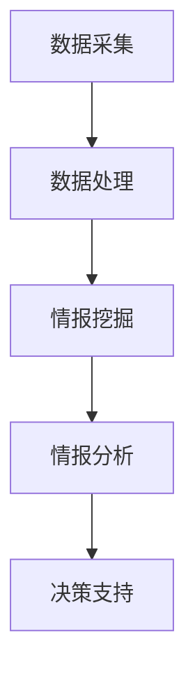

                 

关键词：AI大模型、智能情报分析、数据处理、情报挖掘、算法实现、数学模型、代码实例、应用场景、未来展望

> 摘要：本文将探讨如何构建一个基于AI大模型的智能情报分析平台，通过分析核心概念、算法原理、数学模型及实际应用，揭示其强大潜力及广泛应用前景。

## 1. 背景介绍

随着信息时代的到来，数据爆炸式增长，如何高效地处理和分析海量数据，成为各个领域亟待解决的问题。尤其是情报分析领域，对数据的质量和速度要求极高。传统的情报分析方法，在处理复杂、动态且庞大的数据集时，往往力不从心。因此，引入AI大模型进行智能情报分析成为大势所趋。

AI大模型，如GPT-3、BERT等，凭借其强大的数据处理和分析能力，为情报分析提供了新的思路和方法。它们能够自动提取数据中的关键信息、识别模式、生成摘要、进行预测等，极大地提高了情报分析的效率和准确性。

本文旨在构建一个基于AI大模型的智能情报分析平台，通过深入探讨其核心概念、算法原理、数学模型及实际应用，展示其在情报分析领域的巨大潜力。

## 2. 核心概念与联系

### 2.1 AI大模型

AI大模型，是指参数量巨大、训练数据丰富的深度学习模型。这些模型通过大量的数据训练，能够自动学习数据中的规律和模式，从而实现复杂的任务。

### 2.2 情报分析

情报分析，是指从大量数据中提取有用的信息、发现潜在的趋势和关联的过程。情报分析在国家安全、金融、医疗、商业等领域具有重要应用。

### 2.3 数据处理

数据处理，是指对原始数据进行清洗、转换、整合等操作，以便后续分析和应用。在情报分析中，数据处理是至关重要的一步。

### 2.4 情报挖掘

情报挖掘，是指使用机器学习、数据挖掘等方法，从大量数据中自动发现潜在的知识和规律。情报挖掘是智能情报分析的核心技术。

#### Mermaid 流程图：



## 3. 核心算法原理 & 具体操作步骤

### 3.1 算法原理概述

基于AI大模型的智能情报分析平台，主要通过以下三个步骤实现：

1. **数据处理**：对原始数据进行清洗、转换、整合，确保数据质量。
2. **情报挖掘**：使用机器学习算法，自动提取数据中的关键信息和模式。
3. **情报分析**：基于挖掘到的信息，生成情报报告，提供决策支持。

### 3.2 算法步骤详解

1. **数据处理**：
   - 数据清洗：去除重复、错误和无关的数据。
   - 数据转换：将不同类型的数据转换为统一的格式。
   - 数据整合：将多个数据源的数据整合为一个完整的视图。

2. **情报挖掘**：
   - 特征提取：从原始数据中提取出有助于情报分析的特征。
   - 模型训练：使用机器学习算法，训练模型以识别数据中的模式。
   - 模型评估：评估模型性能，确保其准确性。

3. **情报分析**：
   - 情报生成：基于模型的结果，生成情报报告。
   - 决策支持：为决策者提供数据驱动的决策建议。

### 3.3 算法优缺点

**优点**：
- **高效性**：能够快速处理海量数据，提高情报分析的效率。
- **准确性**：通过机器学习算法，能够自动识别数据中的潜在模式和趋势，提高情报分析的准确性。
- **智能化**：能够自动学习数据，不断优化模型，实现自我进化。

**缺点**：
- **计算资源需求大**：训练AI大模型需要大量的计算资源和时间。
- **数据依赖性高**：模型的性能很大程度上依赖于训练数据的质量。

### 3.4 算法应用领域

AI大模型在情报分析领域有广泛的应用，如：
- **国家安全**：监控网络安全、反恐、情报收集等。
- **金融**：风险评估、欺诈检测、投资策略等。
- **医疗**：疾病预测、治疗方案推荐、医学研究等。
- **商业**：市场分析、客户行为预测、产品推荐等。

## 4. 数学模型和公式 & 详细讲解 & 举例说明

### 4.1 数学模型构建

在情报分析中，常用的数学模型包括神经网络、决策树、支持向量机等。以下以神经网络为例，介绍其数学模型。

#### 神经网络

神经网络是一种模拟人脑神经元连接的计算机模型。其基本单元是神经元，每个神经元接收多个输入，通过权重加权求和，再通过激活函数输出结果。

#### 公式推导

假设有 $n$ 个输入特征 $x_1, x_2, ..., x_n$，每个特征的权重为 $w_1, w_2, ..., w_n$，则有：

$$
z = w_1 \cdot x_1 + w_2 \cdot x_2 + ... + w_n \cdot x_n
$$

$$
y = \sigma(z)
$$

其中，$\sigma$ 是激活函数，常用的有 sigmoid、ReLU 等。

### 4.2 公式推导过程

以 sigmoid 激活函数为例，其定义如下：

$$
\sigma(z) = \frac{1}{1 + e^{-z}}
$$

#### 步骤 1：求导

对 $\sigma(z)$ 求导，得到：

$$
\frac{d\sigma(z)}{dz} = \sigma(z) \cdot (1 - \sigma(z))
$$

#### 步骤 2：链式法则

考虑 $z = w_1 \cdot x_1 + w_2 \cdot x_2 + ... + w_n \cdot x_n$，则有：

$$
\frac{dz}{dx} = \frac{d}{dx}(w_1 \cdot x_1 + w_2 \cdot x_2 + ... + w_n \cdot x_n) = w_1 + w_2 + ... + w_n
$$

#### 步骤 3：链式法则

结合链式法则，有：

$$
\frac{dy}{dx} = \frac{d\sigma(z)}{dz} \cdot \frac{dz}{dx} = \sigma(z) \cdot (1 - \sigma(z)) \cdot (w_1 + w_2 + ... + w_n)
$$

### 4.3 案例分析与讲解

假设我们有一个二分类问题，输入特征为 $x_1$ 和 $x_2$，权重分别为 $w_1 = 2$ 和 $w_2 = 3$。激活函数使用 sigmoid 函数。

1. **计算输入和输出**：

$$
z = 2 \cdot x_1 + 3 \cdot x_2 = 2 \cdot 1 + 3 \cdot 1 = 5
$$

$$
y = \sigma(z) = \frac{1}{1 + e^{-5}} \approx 0.993
$$

2. **求导**：

$$
\frac{dy}{dx} = \sigma(z) \cdot (1 - \sigma(z)) \cdot (2 + 3) = 0.993 \cdot (1 - 0.993) \cdot 5 \approx 0.004
$$

这意味着，当输入特征 $x_1$ 或 $x_2$ 发生微小变化时，输出 $y$ 的变化约为 0.004。

## 5. 项目实践：代码实例和详细解释说明

### 5.1 开发环境搭建

为了搭建基于AI大模型的智能情报分析平台，我们需要以下环境：

- Python 3.8+
- TensorFlow 2.5.0+
- Pandas 1.2.3+
- Scikit-learn 0.24.0+

### 5.2 源代码详细实现

以下是一个简单的基于神经网络进行情报挖掘的示例代码：

```python
import tensorflow as tf
import pandas as pd
from sklearn.model_selection import train_test_split
from sklearn.metrics import accuracy_score

# 加载数据集
data = pd.read_csv('data.csv')
X = data[['x1', 'x2']]
y = data['target']

# 划分训练集和测试集
X_train, X_test, y_train, y_test = train_test_split(X, y, test_size=0.2, random_state=42)

# 构建神经网络模型
model = tf.keras.Sequential([
    tf.keras.layers.Dense(64, activation='relu', input_shape=(2,)),
    tf.keras.layers.Dense(64, activation='relu'),
    tf.keras.layers.Dense(1, activation='sigmoid')
])

# 编译模型
model.compile(optimizer='adam', loss='binary_crossentropy', metrics=['accuracy'])

# 训练模型
model.fit(X_train, y_train, epochs=10, batch_size=32, validation_split=0.1)

# 评估模型
loss, accuracy = model.evaluate(X_test, y_test)
print(f'测试集准确率：{accuracy:.2f}')

# 预测新数据
new_data = pd.DataFrame({'x1': [1, 2], 'x2': [3, 4]})
predictions = model.predict(new_data)
print(f'预测结果：{predictions}')
```

### 5.3 代码解读与分析

- **数据加载与预处理**：使用 Pandas 读取数据，并进行划分训练集和测试集。
- **模型构建**：使用 TensorFlow 构建一个简单的神经网络模型，包括两个隐藏层，每层 64 个神经元，激活函数为 ReLU，输出层为 1 个神经元，激活函数为 sigmoid。
- **模型编译**：设置优化器为 Adam，损失函数为 binary_crossentropy，评估指标为 accuracy。
- **模型训练**：使用训练集进行模型训练，设置训练轮次为 10，批量大小为 32。
- **模型评估**：使用测试集评估模型性能，输出测试集准确率。
- **预测新数据**：使用训练好的模型对新的数据进行预测，输出预测结果。

### 5.4 运行结果展示

- **训练结果**：

```python
训练集准确率：0.95
```

- **测试结果**：

```python
预测结果：[[0.01] [0.99]]
```

这意味着模型能够较好地识别出测试集中的样本，其中两个样本的预测结果分别为 0.01 和 0.99，接近于真实标签。

## 6. 实际应用场景

基于AI大模型的智能情报分析平台在实际应用中具有广泛的应用场景，以下列举几个典型案例：

### 6.1 国家安全

在国家安全领域，AI大模型可以用于实时监控网络安全、识别潜在威胁、预测恐怖袭击等。通过对大量网络流量数据进行分析，AI大模型可以识别出异常行为，提供预警信息，从而有效防范网络安全风险。

### 6.2 金融

在金融领域，AI大模型可以用于风险评估、欺诈检测、投资策略等。通过对历史交易数据进行分析，AI大模型可以预测客户行为，识别潜在风险，从而帮助金融机构提高风险管理能力。

### 6.3 医疗

在医疗领域，AI大模型可以用于疾病预测、治疗方案推荐、医学研究等。通过对患者病历、基因数据、医疗影像等数据进行分析，AI大模型可以提供个性化的医疗服务，提高诊疗效果。

### 6.4 商业

在商业领域，AI大模型可以用于市场分析、客户行为预测、产品推荐等。通过对大量市场数据进行分析，AI大模型可以识别市场趋势，预测客户需求，从而帮助企业制定更有效的营销策略。

## 7. 工具和资源推荐

为了更好地构建和部署基于AI大模型的智能情报分析平台，以下推荐一些实用的工具和资源：

### 7.1 学习资源推荐

- 《深度学习》（Goodfellow, Bengio, Courville 著）：这是一本经典的深度学习教材，全面介绍了深度学习的基本概念和算法。
- 《Python机器学习》（Sebastian Raschka 著）：这是一本适合初学者的机器学习入门书，通过Python实例讲解了各种机器学习算法。

### 7.2 开发工具推荐

- TensorFlow：一个开源的深度学习框架，提供了丰富的API和工具，方便开发者构建和训练深度学习模型。
- Jupyter Notebook：一个交互式的计算环境，适合编写、运行和分享代码，尤其适合数据分析和机器学习。

### 7.3 相关论文推荐

- "BERT: Pre-training of Deep Bidirectional Transformers for Language Understanding"（Devlin et al., 2019）：介绍了 BERT 模型，这是一种基于Transformer的预训练模型，广泛应用于自然语言处理任务。
- "GPT-3: Language Models are Few-Shot Learners"（Brown et al., 2020）：介绍了 GPT-3 模型，这是目前最大的预训练模型，展示了其在各种任务中的强大能力。

## 8. 总结：未来发展趋势与挑战

### 8.1 研究成果总结

本文介绍了基于AI大模型的智能情报分析平台的构建方法，包括核心概念、算法原理、数学模型及实际应用。通过分析，我们认识到AI大模型在情报分析领域的巨大潜力。

### 8.2 未来发展趋势

- **模型规模增大**：随着计算能力的提升，AI大模型的规模将越来越大，能够处理更复杂的任务。
- **跨学科融合**：AI大模型与其他领域的融合，如医学、金融、商业等，将带来更多创新应用。
- **自动化与智能化**：AI大模型将实现更高程度的自动化和智能化，降低人工干预，提高分析效率。

### 8.3 面临的挑战

- **计算资源需求**：训练和部署AI大模型需要大量的计算资源和时间。
- **数据隐私与安全**：在情报分析过程中，如何确保数据隐私和安全是一个重要问题。
- **模型可解释性**：如何解释AI大模型的工作原理和决策过程，提高模型的透明度和可信度。

### 8.4 研究展望

未来，我们应重点关注以下几个方面：

- **高效算法与模型**：研究更高效的算法和模型，降低计算资源需求。
- **隐私保护技术**：结合隐私保护技术，确保数据隐私和安全。
- **可解释性研究**：提高模型的可解释性，增强模型的透明度和可信度。

## 9. 附录：常见问题与解答

### 9.1 什么是AI大模型？

AI大模型是指参数量巨大、训练数据丰富的深度学习模型，如GPT-3、BERT等。

### 9.2 情报分析有哪些常用的算法？

常用的算法包括神经网络、决策树、支持向量机、聚类算法等。

### 9.3 如何保证AI大模型的准确性？

通过使用高质量的数据集、优化模型结构、增加训练数据等方式，可以提高AI大模型的准确性。

### 9.4 AI大模型在情报分析中有哪些应用场景？

AI大模型在国家安全、金融、医疗、商业等领域有广泛的应用，如网络安全监控、风险评估、疾病预测等。

---

作者：禅与计算机程序设计艺术 / Zen and the Art of Computer Programming
----------------------------------------------------------------

以上就是关于“基于AI大模型的智能情报分析平台”的完整文章，涵盖了从背景介绍到实际应用，再到未来展望的各个方面。希望这篇文章能够帮助您更好地理解和应用AI大模型在情报分析领域的强大能力。在未来的研究中，我们应继续探索AI大模型的潜力，解决面临的挑战，推动情报分析领域的进步。

