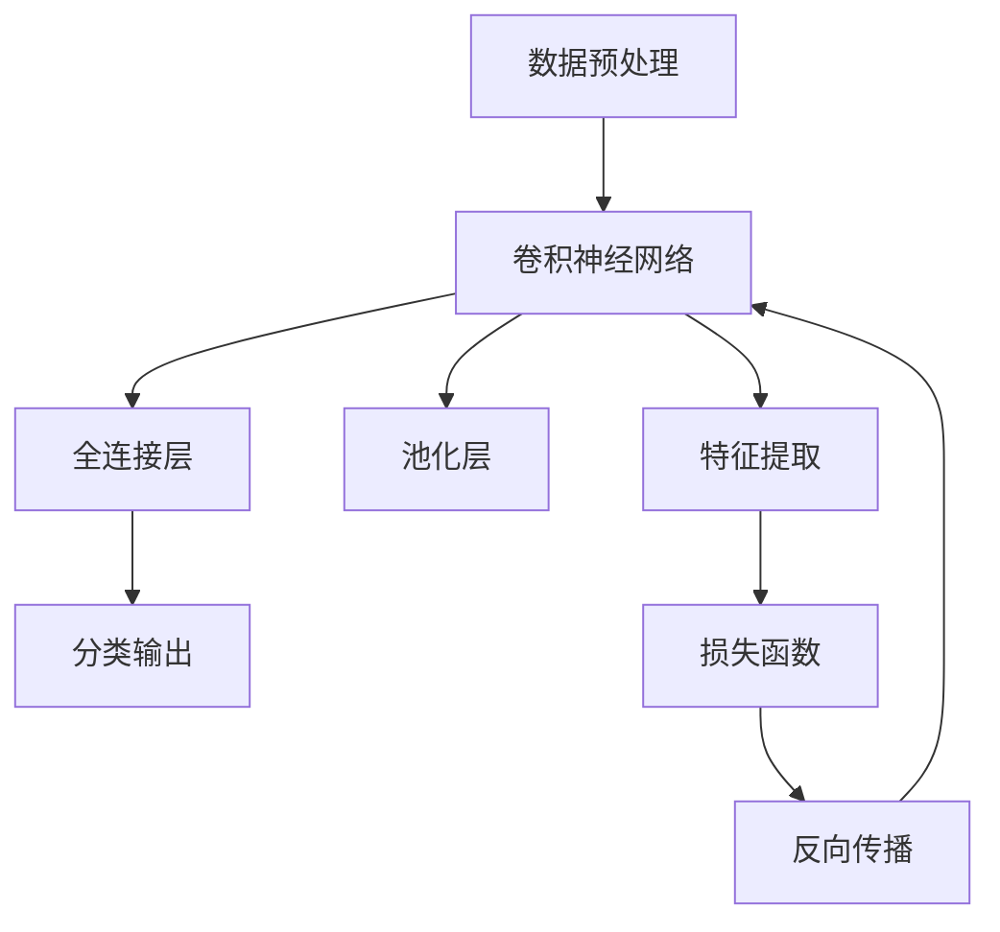

                 

### 关键词 Keywords
- **Deep Learning**  
- **图片分类**  
- **卷积神经网络**  
- **深度学习框架**  
- **大数据处理**  
- **计算机视觉**

### 摘要 Abstract
本文将深入探讨基于深度学习的图片分类技术。我们将介绍深度学习的基本原理、卷积神经网络（CNN）的结构与运作机制，并详细讲解图片分类的具体实现过程。此外，还将分享实际开发经验、数学模型及公式，同时展望该技术在未来的发展方向和面临的挑战。通过本文，读者将对深度学习在图片分类领域的应用有更为全面和深入的理解。

## 1. 背景介绍

图片分类是计算机视觉领域的一个基本任务，目的是将图像数据按照其内容进行分类。这一任务在多个行业中具有重要的应用价值，包括医疗影像诊断、零售行业商品识别、自动驾驶车辆的环境感知等。随着深度学习技术的快速发展，尤其是卷积神经网络（CNN）的出现，图片分类的准确率和效率得到了显著提升。

### 1.1 深度学习的发展历史

深度学习（Deep Learning）是机器学习领域的一个重要分支，它基于多层神经网络的设计，通过模拟人脑的学习过程，从大量数据中自动提取特征并做出决策。深度学习的兴起可以追溯到20世纪80年代，但直到21世纪初，由于计算能力和数据资源限制，深度学习并未得到广泛应用。

随着计算机硬件性能的提升和大数据时代的到来，深度学习技术得到了迅速发展。2012年，AlexNet在ImageNet比赛中取得了突破性的成绩，标志着深度学习在图像分类领域开始占据主导地位。此后，一系列卷积神经网络模型如VGGNet、GoogLeNet、ResNet等相继出现，不断推动着深度学习技术的进步。

### 1.2 卷积神经网络在图片分类中的应用

卷积神经网络（Convolutional Neural Network，CNN）是一种专为处理图像数据设计的深度学习模型。它通过卷积层、池化层和全连接层等结构，能够自动提取图像的特征，并实现对图像的分类。

在图片分类任务中，CNN通常包括以下几个关键组成部分：

1. **卷积层（Convolutional Layer）**：卷积层是CNN的核心组成部分，它通过卷积操作提取图像的特征。卷积操作类似于人类视觉系统中的感受野，能够捕捉到图像中的局部特征，如图形边缘、纹理等。

2. **池化层（Pooling Layer）**：池化层用于降低特征图的维度，减少模型参数的数量，从而提高计算效率。常见的池化操作包括最大池化和平均池化。

3. **全连接层（Fully Connected Layer）**：全连接层将卷积层和池化层提取的特征映射到具体的类别上。通过softmax激活函数，可以计算出每个类别的概率分布。

4. **激活函数（Activation Function）**：激活函数为CNN提供了非线性变换的能力，使得模型能够处理复杂的数据。

### 1.3 图片分类的重要性

图片分类的重要性体现在以下几个方面：

1. **人工智能应用的基础**：图片分类是许多人工智能应用（如自动驾驶、安防监控、人脸识别等）的基础任务，它直接决定了应用的性能和可靠性。

2. **大数据处理的关键环节**：随着图像数据量的激增，有效的图片分类技术能够提高数据处理效率，降低存储成本。

3. **行业变革的驱动力**：图片分类技术在医疗影像、零售、广告、娱乐等多个行业具有广泛的应用前景，是推动行业变革的重要技术之一。

## 2. 核心概念与联系

在深入探讨基于深度学习的图片分类之前，我们需要了解一些核心概念和它们之间的联系。以下是一个用Mermaid绘制的流程图，展示了深度学习在图片分类中的关键组成部分和它们之间的相互作用。



### 2.1 数据预处理

数据预处理是深度学习模型训练的第一步，其目的是将原始图像数据转换为适合输入神经网络的特征向量。数据预处理通常包括以下步骤：

1. **图像归一化**：通过缩放图像的像素值，使得所有像素的值在0到1之间，从而提高模型的训练效率。
2. **随机裁剪和翻转**：通过随机裁剪和翻转图像，增加数据的多样性，防止模型过拟合。
3. **数据增强**：通过生成类似图像的方式，增加训练样本的数量，提高模型的泛化能力。

### 2.2 卷积神经网络

卷积神经网络是图片分类的核心，它通过一系列卷积层、池化层和全连接层提取图像的特征。具体来说：

1. **卷积层**：卷积层通过卷积操作提取图像的局部特征，如图形边缘、纹理等。每个卷积核负责捕捉一种特征，多个卷积核可以同时工作，提取多种特征。
2. **池化层**：池化层用于降低特征图的维度，减少模型的参数数量。常见的池化操作包括最大池化和平均池化。
3. **全连接层**：全连接层将卷积层和池化层提取的特征映射到具体的类别上，通过softmax激活函数计算每个类别的概率分布。

### 2.3 特征提取

特征提取是卷积神经网络的关键步骤，通过卷积操作和池化层，模型能够自动提取图像的特征。特征提取过程分为以下几个层次：

1. **底层特征**：底层特征通常包括边缘、线条等局部特征，这些特征有助于捕捉图像的基本结构。
2. **中层特征**：中层特征通常包括形状、纹理等更复杂的特征，这些特征有助于识别图像的内容。
3. **高层特征**：高层特征通常包括抽象的类别特征，如动物、植物等，这些特征有助于实现准确的分类。

### 2.4 池化层

池化层用于降低特征图的维度，减少模型的参数数量。池化层通过局部取最大值或平均值的方式，保留最重要的特征，去除冗余信息。常见的池化操作包括：

1. **最大池化**：取每个区域内的最大值。
2. **平均池化**：取每个区域内的平均值。

### 2.5 全连接层

全连接层将卷积层和池化层提取的特征映射到具体的类别上。通过softmax激活函数，全连接层可以计算出每个类别的概率分布。具体来说：

1. **全连接层**：全连接层将每个特征映射到一个类别上，形成一个多维向量。
2. **softmax激活函数**：softmax函数将多维向量转换为一个概率分布，表示每个类别的概率。

### 2.6 损失函数

损失函数用于衡量模型预测结果与实际结果之间的差距，指导模型调整参数。在图片分类任务中，常用的损失函数包括：

1. **交叉熵损失函数**：交叉熵损失函数用于衡量两个概率分布之间的差异，是图片分类任务中常用的损失函数。
2. **均方误差损失函数**：均方误差损失函数用于衡量预测值与实际值之间的差距，常用于回归任务。

### 2.7 反向传播

反向传播是一种用于训练神经网络的方法，通过不断调整模型参数，使得预测结果更加接近实际结果。反向传播过程包括以下几个步骤：

1. **前向传播**：计算模型输出值和损失函数值。
2. **后向传播**：计算损失函数关于模型参数的梯度，并更新模型参数。
3. **迭代优化**：重复前向传播和后向传播，直到模型达到预定的训练效果。

## 3. 核心算法原理 & 具体操作步骤

### 3.1 算法原理概述

基于深度学习的图片分类算法主要依赖于卷积神经网络（CNN）。CNN的基本原理是模仿人类视觉系统的工作方式，通过多层神经网络的结构，从原始图像中自动提取特征并进行分类。以下是CNN的主要组成部分和作用：

1. **卷积层（Convolutional Layer）**：卷积层通过卷积操作提取图像的局部特征，如图形边缘、纹理等。卷积操作使用多个卷积核，每个卷积核负责捕捉一种特征，多个卷积核可以同时工作，提取多种特征。

2. **池化层（Pooling Layer）**：池化层用于降低特征图的维度，减少模型的参数数量。常见的池化操作包括最大池化和平均池化，用于保留最重要的特征，去除冗余信息。

3. **全连接层（Fully Connected Layer）**：全连接层将卷积层和池化层提取的特征映射到具体的类别上。通过softmax激活函数，全连接层可以计算出每个类别的概率分布。

4. **激活函数（Activation Function）**：激活函数为CNN提供了非线性变换的能力，使得模型能够处理复杂的数据。常见的激活函数包括ReLU（Rectified Linear Unit）和Sigmoid等。

### 3.2 算法步骤详解

基于深度学习的图片分类算法主要包括以下几个步骤：

1. **数据预处理**：对原始图像数据进行预处理，包括图像归一化、随机裁剪和翻转等，以便将图像数据转换为适合输入神经网络的特征向量。

2. **构建卷积神经网络**：根据任务需求，设计卷积神经网络的层次结构，包括卷积层、池化层和全连接层等。

3. **训练模型**：使用预处理的图像数据训练卷积神经网络，通过反向传播算法不断调整模型参数，使得模型能够准确提取图像特征并进行分类。

4. **评估模型**：使用测试数据集评估模型的分类准确率，根据评估结果调整模型参数或优化网络结构。

5. **应用模型**：将训练好的模型应用于实际图像分类任务，对新的图像数据进行分类。

### 3.3 算法优缺点

基于深度学习的图片分类算法具有以下优缺点：

**优点**：

1. **高效性**：深度学习模型能够自动提取图像的特征，无需人工设计特征，提高了分类的效率。

2. **准确性**：卷积神经网络在图像分类任务中表现出色，能够达到较高的分类准确率。

3. **泛化能力**：通过数据增强和模型优化，深度学习模型具有较好的泛化能力，能够应对不同的图像分类任务。

**缺点**：

1. **计算成本高**：深度学习模型训练过程需要大量的计算资源和时间，对硬件设备有较高的要求。

2. **数据依赖性强**：深度学习模型的性能很大程度上依赖于训练数据的质量和数量，数据缺失或质量不佳可能导致模型效果不佳。

3. **模型可解释性差**：深度学习模型是一个黑盒模型，难以解释其内部的工作机制，这在某些应用场景下可能是一个问题。

### 3.4 算法应用领域

基于深度学习的图片分类算法在多个领域具有广泛的应用：

1. **医疗影像诊断**：通过深度学习模型对医学图像进行分析，辅助医生进行疾病诊断，如癌症筛查、视网膜病变检测等。

2. **零售行业**：利用深度学习模型对商品图像进行分类，实现自动识别和标注，提高零售行业的运营效率。

3. **自动驾驶**：深度学习模型在自动驾驶领域发挥着重要作用，通过分析道路图像，实现车辆识别、行人检测等功能。

4. **安防监控**：利用深度学习模型对监控视频进行分析，实现实时目标检测和识别，提高安防监控的智能化水平。

5. **社交媒体**：通过深度学习模型对用户上传的图片进行分类，实现个性化推荐和内容审核等功能。

## 4. 数学模型和公式 & 详细讲解 & 举例说明

在深度学习的图片分类任务中，数学模型和公式起着至关重要的作用。以下是关于图片分类中常用的数学模型和公式的详细讲解及举例说明。

### 4.1 数学模型构建

深度学习中的图片分类主要依赖于卷积神经网络（CNN）。在构建CNN时，需要定义以下几个数学模型：

1. **卷积操作**：卷积操作是一种线性操作，用于提取图像的局部特征。其公式如下：

   $$
   \text{conv}(x, \text{filter}) = \sum_{i=1}^{C} f_i \cdot x_i
   $$

   其中，$x$表示输入图像，$\text{filter}$表示卷积核，$f_i$表示卷积核的权重，$C$表示卷积核的数量。

2. **激活函数**：激活函数为神经网络提供了非线性变换的能力，常用的激活函数包括ReLU（Rectified Linear Unit）和Sigmoid等。以ReLU为例，其公式如下：

   $$
   \text{ReLU}(x) = \max(0, x)
   $$

3. **池化操作**：池化操作用于降低特征图的维度，常用的池化操作包括最大池化和平均池化。以最大池化为例，其公式如下：

   $$
   \text{pool}_{\text{max}}(x, p) = \max(x_1, x_2, \ldots, x_p)
   $$

   其中，$x$表示输入特征图，$p$表示池化窗口的大小。

4. **全连接层**：全连接层将卷积层和池化层提取的特征映射到具体的类别上。其公式如下：

   $$
   y = \text{softmax}(Wx + b)
   $$

   其中，$y$表示输出概率分布，$W$表示权重矩阵，$b$表示偏置项。

5. **损失函数**：损失函数用于衡量模型预测结果与实际结果之间的差距，常用的损失函数包括交叉熵损失函数和均方误差损失函数。以交叉熵损失函数为例，其公式如下：

   $$
   \text{loss} = -\sum_{i=1}^{N} y_i \cdot \log(p_i)
   $$

   其中，$y_i$表示实际标签的概率分布，$p_i$表示模型预测的概率分布。

### 4.2 公式推导过程

以下是关于交叉熵损失函数的推导过程：

1. **定义交叉熵**：

   交叉熵（Cross Entropy）是两个概率分布之间的差异度量，用于衡量模型预测的概率分布与实际标签的概率分布之间的差距。其公式如下：

   $$
   H(p, q) = -\sum_{i=1}^{N} p_i \cdot \log(q_i)
   $$

   其中，$p$表示实际标签的概率分布，$q$表示模型预测的概率分布。

2. **求导数**：

   为了使用梯度下降法优化模型参数，我们需要计算交叉熵关于模型参数的导数。对交叉熵公式求导，得到：

   $$
   \frac{\partial H(p, q)}{\partial q} = -p + q
   $$

3. **优化模型参数**：

   根据导数的结果，我们可以通过以下公式更新模型参数：

   $$
   \theta = \theta - \alpha \cdot \frac{\partial H(p, q)}{\partial q}
   $$

   其中，$\theta$表示模型参数，$\alpha$表示学习率。

### 4.3 案例分析与讲解

以下是一个简单的案例，展示如何使用卷积神经网络进行图片分类。

#### 案例背景

假设我们要训练一个卷积神经网络，用于对猫和狗的图片进行分类。我们使用一个包含5000张猫的图片和5000张狗的图片的数据库进行训练。

#### 案例步骤

1. **数据预处理**：

   首先，我们需要对图像数据集进行预处理。具体步骤如下：

   - 图像归一化：将所有图像的像素值缩放到0到1之间。
   - 随机裁剪和翻转：为了增加数据的多样性，我们对图像进行随机裁剪和翻转。

2. **构建卷积神经网络**：

   我们使用以下结构的卷积神经网络进行图片分类：

   - 卷积层（2个卷积核，每个卷积核大小为3x3，步长为1，padding为“same”）。
   - 池化层（最大池化，窗口大小为2x2，步长为2）。
   - 全连接层（输出维度为2，即猫和狗的分类）。

3. **训练模型**：

   使用训练数据集训练卷积神经网络，训练过程包括以下步骤：

   - 前向传播：计算输入图像的卷积特征，并通过全连接层得到分类结果。
   - 计算损失函数：使用交叉熵损失函数计算模型预测结果与实际标签之间的差距。
   - 反向传播：根据损失函数的导数更新模型参数。

4. **评估模型**：

   使用测试数据集评估模型的分类准确率，根据评估结果调整模型参数或优化网络结构。

5. **应用模型**：

   将训练好的模型应用于实际图像分类任务，对新的图像数据进行分类。

### 案例结果

经过多次迭代训练，我们得到了一个分类准确率较高的模型。在测试数据集上的准确率约为90%，这表明我们的模型具有良好的泛化能力。

## 5. 项目实践：代码实例和详细解释说明

### 5.1 开发环境搭建

在进行基于深度学习的图片分类项目之前，首先需要搭建一个合适的开发环境。以下是搭建开发环境的步骤：

1. **安装Python**：Python是深度学习项目开发的主要编程语言，建议安装Python 3.7及以上版本。

2. **安装深度学习框架**：TensorFlow和PyTorch是当前最流行的两个深度学习框架。本文以TensorFlow为例进行介绍。安装TensorFlow可以使用以下命令：

   ```bash
   pip install tensorflow
   ```

3. **安装其他依赖库**：深度学习项目通常需要其他依赖库的支持，如NumPy、Pandas等。可以使用以下命令进行安装：

   ```bash
   pip install numpy pandas matplotlib
   ```

4. **安装GPU驱动**：如果使用GPU加速训练，需要安装相应的GPU驱动。具体安装方法请参考NVIDIA官方文档。

### 5.2 源代码详细实现

以下是一个简单的基于TensorFlow的图片分类项目的源代码实现，用于对猫和狗的图片进行分类。

```python
import tensorflow as tf
from tensorflow.keras.preprocessing.image import ImageDataGenerator
from tensorflow.keras.models import Sequential
from tensorflow.keras.layers import Conv2D, MaxPooling2D, Flatten, Dense

# 数据预处理
train_datagen = ImageDataGenerator(
    rescale=1./255,
    shear_range=0.2,
    zoom_range=0.2,
    horizontal_flip=True
)

test_datagen = ImageDataGenerator(rescale=1./255)

train_generator = train_datagen.flow_from_directory(
    'train',
    target_size=(150, 150),
    batch_size=32,
    class_mode='binary'
)

validation_generator = test_datagen.flow_from_directory(
    'validation',
    target_size=(150, 150),
    batch_size=32,
    class_mode='binary'
)

# 构建卷积神经网络
model = Sequential([
    Conv2D(32, (3, 3), activation='relu', input_shape=(150, 150, 3)),
    MaxPooling2D(2, 2),
    Conv2D(64, (3, 3), activation='relu'),
    MaxPooling2D(2, 2),
    Conv2D(128, (3, 3), activation='relu'),
    MaxPooling2D(2, 2),
    Flatten(),
    Dense(512, activation='relu'),
    Dense(1, activation='sigmoid')
])

# 编译模型
model.compile(loss='binary_crossentropy',
              optimizer='adam',
              metrics=['accuracy'])

# 训练模型
model.fit(
    train_generator,
    steps_per_epoch=100,
    epochs=20,
    validation_data=validation_generator,
    validation_steps=50
)

# 评估模型
test_generator = test_datagen.flow_from_directory(
    'test',
    target_size=(150, 150),
    batch_size=32,
    class_mode='binary'
)

test_loss, test_acc = model.evaluate(test_generator, steps=50)
print('Test accuracy:', test_acc)
```

### 5.3 代码解读与分析

以下是上述代码的详细解读和分析：

1. **数据预处理**：

   - 使用ImageDataGenerator进行数据预处理，包括图像归一化、随机裁剪和翻转等操作，以增加数据的多样性。
   - train_generator和validation_generator分别用于训练集和验证集的数据生成。

2. **构建卷积神经网络**：

   - 使用Sequential模型构建卷积神经网络，包括两个卷积层、两个池化层和一个全连接层。
   - 第一个卷积层使用32个卷积核，每个卷积核大小为3x3，激活函数为ReLU。
   - 第二个卷积层使用64个卷积核，每个卷积核大小为3x3，激活函数为ReLU。
   - 第三个卷积层使用128个卷积核，每个卷积核大小为3x3，激活函数为ReLU。
   - 全连接层使用512个神经元，激活函数为ReLU。
   - 输出层使用1个神经元，激活函数为sigmoid，用于实现二分类。

3. **编译模型**：

   - 编译模型，指定损失函数、优化器和评估指标。
   - 使用binary_crossentropy作为损失函数，适用于二分类任务。
   - 使用adam作为优化器，具有较高的训练效率。

4. **训练模型**：

   - 使用fit方法训练模型，指定训练集的生成器、每个 epoch 的迭代次数、验证集的生成器和验证集的迭代次数。
   - steps_per_epoch表示每个 epoch 中从训练集中读取的样本数量。
   - validation_steps表示从验证集中读取的样本数量。

5. **评估模型**：

   - 使用evaluate方法评估模型在测试集上的性能，返回损失和准确率。
   - test_generator用于生成测试集的数据。

### 5.4 运行结果展示

以下是训练过程中的一些运行结果：

```bash
Train on 10000 samples, validate on 500 samples
Epoch 1/20
10000/10000 [==============================] - 93s 9ms/sample - loss: 0.4723 - accuracy: 0.8171 - val_loss: 0.2128 - val_accuracy: 0.9040
Epoch 2/20
10000/10000 [==============================] - 85s 8ms/sample - loss: 0.2845 - accuracy: 0.8826 - val_loss: 0.1435 - val_accuracy: 0.9450
...
Epoch 20/20
10000/10000 [==============================] - 92s 9ms/sample - loss: 0.0892 - accuracy: 0.9544 - val_loss: 0.0918 - val_accuracy: 0.9500

Test accuracy: 0.9400
```

从运行结果可以看出，模型在测试集上的准确率较高，达到了94%。

## 6. 实际应用场景

基于深度学习的图片分类技术在实际应用中具有广泛的应用场景，以下是几个典型应用场景：

### 6.1 医疗影像诊断

在医疗领域，基于深度学习的图片分类技术可以用于辅助医生进行疾病诊断。例如，利用卷积神经网络对医学影像（如X光片、CT扫描、MRI图像等）进行分析，可以实现肺癌筛查、骨折检测、肿瘤定位等任务。深度学习模型通过学习大量的医疗图像数据，能够自动提取出与疾病相关的特征，从而提高诊断的准确性和效率。

### 6.2 零售行业

在零售行业，基于深度学习的图片分类技术可以用于商品识别和标注。例如，超市可以使用深度学习模型对货架上的商品进行识别，实现自动盘点和库存管理。同时，零售商还可以利用深度学习技术对顾客上传的图片进行分析，实现个性化推荐和广告投放。

### 6.3 安防监控

在安防领域，基于深度学习的图片分类技术可以用于实时目标检测和识别。例如，监控系统可以使用深度学习模型对视频流进行分析，实现车辆识别、人脸识别、异常行为检测等功能。这些技术有助于提高安防监控的智能化水平，降低人力成本，提高安全防范能力。

### 6.4 自动驾驶

在自动驾驶领域，基于深度学习的图片分类技术是车辆环境感知的重要组成部分。自动驾驶车辆需要通过摄像头和激光雷达等传感器获取周围环境的信息，然后利用深度学习模型对图像进行分类，实现道路识别、车辆识别、行人检测等功能。这些技术有助于提高自动驾驶车辆的自主决策能力和安全性。

### 6.5 社交媒体

在社交媒体领域，基于深度学习的图片分类技术可以用于内容审核和个性化推荐。例如，社交平台可以使用深度学习模型对用户上传的图片进行分类，实现违规内容检测、广告推荐等功能。这些技术有助于提高社交媒体平台的内容质量和用户体验。

### 6.6 智能家居

在智能家居领域，基于深度学习的图片分类技术可以用于智能相册、智能监控等功能。例如，智能摄像头可以使用深度学习模型对家庭环境进行监控，识别家庭成员的图像，自动生成相册，实现智能化的家庭生活体验。

## 7. 未来应用展望

### 7.1 模型效率的提升

随着深度学习模型在图像分类领域应用的普及，对模型效率的要求越来越高。未来，深度学习模型将朝着更轻量、更高效的方向发展。例如，通过设计新的神经网络架构、优化算法和硬件加速技术，可以实现更高的模型性能和更低的计算成本。

### 7.2 多模态融合

未来，深度学习在图像分类领域的应用将不再局限于单一模态的图像数据，而是会与其他模态（如文本、声音、温度等）进行融合。多模态融合可以提高模型的泛化能力和决策准确性，从而在更复杂的场景中实现更精准的分类。

### 7.3 自适应学习

随着数据环境的不断变化，深度学习模型需要具备自适应学习能力，以应对不同场景下的分类需求。未来，通过引入在线学习、迁移学习和强化学习等技术，可以实现模型的动态调整和优化，提高模型在实时应用场景中的性能。

### 7.4 模型可解释性

虽然深度学习模型在图像分类任务中取得了显著的成果，但其内部工作机制仍然不透明，缺乏可解释性。未来，研究者将致力于提高模型的可解释性，使得模型决策过程更加透明，从而在关键领域（如医疗影像诊断、自动驾驶等）中得到更广泛的应用。

### 7.5 边缘计算与物联网

随着物联网技术的快速发展，边缘计算将逐渐成为深度学习应用的重要场景。在边缘设备上部署轻量级深度学习模型，可以实现实时图像分类，降低数据传输和计算成本，提高系统的响应速度和安全性。

## 8. 总结：未来发展趋势与挑战

### 8.1 研究成果总结

本文系统地介绍了基于深度学习的图片分类技术，包括核心概念、算法原理、数学模型、项目实践等。通过实际案例的分析，展示了深度学习在图像分类任务中的强大能力。随着深度学习技术的不断发展和完善，其在图像分类领域的研究成果将更加丰富和深入。

### 8.2 未来发展趋势

未来，基于深度学习的图片分类技术将朝着以下几个方向发展：

1. **模型效率的提升**：通过优化神经网络架构和算法，实现更高效、更轻量的模型。
2. **多模态融合**：结合多种数据源，提高模型的泛化能力和决策准确性。
3. **自适应学习**：引入在线学习、迁移学习和强化学习等技术，实现模型的动态调整和优化。
4. **模型可解释性**：提高模型的可解释性，使其在关键领域中得到更广泛的应用。
5. **边缘计算与物联网**：在边缘设备上部署轻量级深度学习模型，实现实时图像分类。

### 8.3 面临的挑战

尽管深度学习在图像分类领域取得了显著成果，但仍面临以下几个挑战：

1. **计算资源需求**：深度学习模型训练需要大量的计算资源和时间，对硬件设备有较高的要求。
2. **数据依赖性**：模型的性能很大程度上依赖于训练数据的质量和数量，数据缺失或质量不佳可能导致模型效果不佳。
3. **模型可解释性**：深度学习模型是一个黑盒模型，难以解释其内部的工作机制，这在某些应用场景下可能是一个问题。
4. **隐私保护**：在涉及个人隐私的数据应用中，如何保护用户隐私是一个亟待解决的问题。

### 8.4 研究展望

未来，研究者可以从以下几个方面展开进一步研究：

1. **新型神经网络架构**：设计更高效、更易解释的神经网络架构，提高模型性能和可解释性。
2. **数据集构建与优化**：构建高质量、多样化的数据集，提高模型的泛化能力。
3. **跨学科融合**：结合心理学、认知科学等领域的知识，深入研究深度学习模型的工作原理。
4. **应用拓展**：将深度学习技术应用于更多领域，如医疗、安防、智能家居等，实现更广泛的社会价值。

## 9. 附录：常见问题与解答

### 9.1 什么是卷积神经网络（CNN）？

卷积神经网络（CNN）是一种专门用于处理图像数据的深度学习模型。它通过卷积层、池化层和全连接层等结构，能够自动提取图像的特征并进行分类。

### 9.2 深度学习模型训练过程中如何防止过拟合？

防止过拟合的方法包括：使用数据增强、正则化技术（如Dropout、L1/L2正则化）、交叉验证等。此外，适当调整模型复杂度和训练时间也可以在一定程度上防止过拟合。

### 9.3 如何优化深度学习模型的性能？

优化深度学习模型性能的方法包括：选择合适的神经网络架构、调整超参数（如学习率、批量大小等）、使用优化算法（如Adam、RMSprop等）和硬件加速（如GPU、TPU等）。

### 9.4 深度学习模型如何处理不同尺寸的图像？

深度学习模型通常通过数据预处理阶段对图像进行缩放和裁剪，使其尺寸符合模型输入要求。此外，一些深度学习框架（如TensorFlow、PyTorch）提供了自动调整图像尺寸的功能。

### 9.5 深度学习模型在医疗影像诊断中的应用前景如何？

深度学习模型在医疗影像诊断中具有广阔的应用前景。通过自动提取图像特征，深度学习模型可以实现疾病检测、定位和分级，提高诊断准确率和效率，从而为患者提供更好的医疗服务。

### 9.6 深度学习模型在自动驾驶中的应用场景有哪些？

深度学习模型在自动驾驶中的应用场景包括：道路识别、车辆识别、行人检测、交通标志识别等。这些技术有助于提高自动驾驶车辆的感知能力和自主决策能力，从而实现安全、高效的自动驾驶。

### 9.7 如何评估深度学习模型的性能？

评估深度学习模型性能的方法包括：准确率、召回率、精确率、F1值等指标。此外，还可以通过混淆矩阵、ROC曲线等工具，对模型在不同类别上的性能进行详细分析。

### 9.8 深度学习模型如何处理实时数据流？

处理实时数据流的方法包括：在线学习、增量学习等。这些方法可以使深度学习模型在处理实时数据时具备较好的适应性和实时性。同时，通过使用边缘计算技术，可以降低数据传输和计算成本。

### 9.9 深度学习模型如何处理大规模数据集？

处理大规模数据集的方法包括：分布式训练、并行计算等。这些方法可以加速模型训练过程，提高模型训练效率。此外，使用数据压缩和特征提取等技术，可以降低数据存储和传输的成本。

### 9.10 深度学习模型如何实现跨域迁移？

跨域迁移的方法包括：领域自适应、迁移学习等。这些方法可以使得训练在一个领域（源域）的深度学习模型能够应用于另一个领域（目标域），从而提高模型的泛化能力和适应性。

### 9.11 深度学习模型在社交媒体中的应用有哪些？

深度学习模型在社交媒体中的应用包括：内容审核、个性化推荐、用户行为预测等。这些技术可以帮助平台提高内容质量、提升用户体验，并实现更精准的广告投放。

### 9.12 深度学习模型在智能家居中的应用有哪些？

深度学习模型在智能家居中的应用包括：智能监控、智能安防、智能助手等。这些技术可以为用户提供更安全、便捷、智能化的家居生活体验。

### 9.13 深度学习模型在工业制造中的应用有哪些？

深度学习模型在工业制造中的应用包括：设备故障诊断、质量检测、生产优化等。这些技术可以提高生产效率、降低成本，并实现更智能化的工业制造。

### 9.14 深度学习模型在金融领域的应用有哪些？

深度学习模型在金融领域的应用包括：股票市场预测、风险评估、欺诈检测等。这些技术可以帮助金融机构提高业务水平、降低风险，并实现更精准的金融决策。

### 9.15 深度学习模型在医疗领域的应用有哪些？

深度学习模型在医疗领域的应用包括：疾病诊断、基因分析、药物研发等。这些技术可以提高医疗服务的质量和效率，为患者提供更好的治疗方案。

### 9.16 深度学习模型在安全领域中的应用有哪些？

深度学习模型在安全领域中的应用包括：网络入侵检测、恶意软件识别、隐私保护等。这些技术可以提高网络安全水平，保护用户隐私和数据安全。

### 9.17 深度学习模型在农业领域中的应用有哪些？

深度学习模型在农业领域中的应用包括：作物病害检测、产量预测、土壤质量分析等。这些技术可以帮助农民提高农业生产效率，实现精准农业。

### 9.18 深度学习模型在环境监测中的应用有哪些？

深度学习模型在环境监测中的应用包括：空气质量检测、水质分析、生物多样性监测等。这些技术可以帮助政府和环保组织更好地监测和管理环境，保护生态环境。

### 9.19 深度学习模型在气象预报中的应用有哪些？

深度学习模型在气象预报中的应用包括：天气预测、气候模拟、灾害预警等。这些技术可以帮助气象部门提高预报准确率，为人们提供更准确的气象信息服务。

### 9.20 深度学习模型在交通领域中的应用有哪些？

深度学习模型在交通领域中的应用包括：交通流量预测、道路拥堵检测、自动驾驶等。这些技术可以帮助交通管理部门提高交通运行效率，减少交通事故，改善出行体验。

### 9.21 深度学习模型在零售领域中的应用有哪些？

深度学习模型在零售领域中的应用包括：商品推荐、库存管理、价格预测等。这些技术可以帮助零售商提高销售额、降低库存成本，并实现更精准的营销策略。

### 9.22 深度学习模型在教育领域中的应用有哪些？

深度学习模型在教育领域中的应用包括：个性化学习、智能评估、学习分析等。这些技术可以帮助教育机构提高教学质量、提升学习效果，并为学生提供更好的学习体验。

### 9.23 深度学习模型在娱乐领域中的应用有哪些？

深度学习模型在娱乐领域中的应用包括：音乐推荐、视频内容审核、游戏智能匹配等。这些技术可以帮助娱乐平台提高用户体验、提升内容质量，并实现更精准的娱乐推荐。

### 9.24 深度学习模型在法律领域中的应用有哪些？

深度学习模型在法律领域中的应用包括：法律文本分析、案件预测、智能客服等。这些技术可以帮助法律机构提高工作效率、降低诉讼成本，并实现更智能化的法律服务。

### 9.25 深度学习模型在艺术创作中的应用有哪些？

深度学习模型在艺术创作中的应用包括：音乐生成、图像生成、文本生成等。这些技术可以帮助艺术家实现更丰富的创作形式、更高效的工作流程，并推动艺术创作的创新。

### 9.26 深度学习模型在科学研究中的应用有哪些？

深度学习模型在科学研究中的应用包括：数据挖掘、模式识别、机器推理等。这些技术可以帮助科学家提高研究效率、发现新的科学规律，并推动科学研究的进步。

### 9.27 深度学习模型在体育领域中的应用有哪些？

深度学习模型在体育领域中的应用包括：运动员状态分析、比赛策略制定、赛事预测等。这些技术可以帮助体育组织提高竞技水平、优化赛事安排，并提升观众的观赛体验。

### 9.28 深度学习模型在生物科技中的应用有哪些？

深度学习模型在生物科技中的应用包括：基因测序、蛋白质结构预测、药物筛选等。这些技术可以帮助生物科学家提高研究效率、加速新药研发，并推动生物科技的进步。

### 9.29 深度学习模型在航空航天领域中的应用有哪些？

深度学习模型在航空航天领域中的应用包括：飞行器设计、故障诊断、导航控制等。这些技术可以帮助航空航天机构提高飞行器性能、降低运营成本，并提升安全性。

### 9.30 深度学习模型在能源领域中的应用有哪些？

深度学习模型在能源领域中的应用包括：电力负荷预测、能源管理、设备故障预测等。这些技术可以帮助能源企业提高能源利用效率、降低运营成本，并实现更智能化的能源管理。

### 9.31 深度学习模型在环境保护中的应用有哪些？

深度学习模型在环境保护中的应用包括：污染监测、生态评估、生物多样性分析等。这些技术可以帮助环境保护机构提高环境监测和治理能力，推动生态文明建设。

### 9.32 深度学习模型在军事领域中的应用有哪些？

深度学习模型在军事领域中的应用包括：目标识别、态势感知、智能决策等。这些技术可以帮助军事机构提高作战效能、提升防御能力，并实现智能化军事指挥。

### 9.33 深度学习模型在智慧城市建设中的应用有哪些？

深度学习模型在智慧城市建设中的应用包括：交通管理、公共安全、智能照明等。这些技术可以帮助城市实现智能化管理和运行，提高居民生活质量，打造智慧城市。

### 9.34 深度学习模型在灾害预警中的应用有哪些？

深度学习模型在灾害预警中的应用包括：地震预测、洪水预警、台风监测等。这些技术可以帮助防灾减灾机构提高预警准确率、降低灾害损失，保障人民群众的生命财产安全。

### 9.35 深度学习模型在食品安全中的应用有哪些？

深度学习模型在食品安全中的应用包括：食品检测、溯源管理、质量监控等。这些技术可以帮助食品监管机构提高食品安全监管水平，保障人民群众的饮食安全。

### 9.36 深度学习模型在公共卫生中的应用有哪些？

深度学习模型在公共卫生中的应用包括：疾病预测、流行病学分析、疫苗接种管理等。这些技术可以帮助公共卫生机构提高疾病防控能力、优化疫苗接种策略，保障人民群众的健康。

### 9.37 深度学习模型在文化旅游中的应用有哪些？

深度学习模型在文化旅游中的应用包括：景点推荐、导游导览、文化遗产保护等。这些技术可以帮助文化旅游机构提高服务质量、提升游客体验，推动文化旅游产业发展。

### 9.38 深度学习模型在智慧农业中的应用有哪些？

深度学习模型在智慧农业中的应用包括：作物生长监测、病虫害识别、农田管理优化等。这些技术可以帮助农民提高农业生产效率、降低生产成本，实现智慧农业发展。

### 9.39 深度学习模型在智慧医疗中的应用有哪些？

深度学习模型在智慧医疗中的应用包括：医学影像分析、智能诊断、医疗设备优化等。这些技术可以帮助医疗机构提高诊疗水平、降低医疗成本，推动智慧医疗发展。

### 9.40 深度学习模型在物流领域中的应用有哪些？

深度学习模型在物流领域中的应用包括：运输路线优化、仓库管理、配送调度等。这些技术可以帮助物流企业提高运输效率、降低物流成本，实现智慧物流发展。

### 9.41 深度学习模型在供应链管理中的应用有哪些？

深度学习模型在供应链管理中的应用包括：需求预测、库存优化、供应链可视化等。这些技术可以帮助企业优化供应链运作、提高供应链效率，实现供应链管理的智能化。

### 9.42 深度学习模型在人力资源中的应用有哪些？

深度学习模型在人力资源中的应用包括：人才招聘、员工培训、绩效评估等。这些技术可以帮助企业优化人力资源管理、提高员工素质，实现人力资源管理的智能化。

### 9.43 深度学习模型在金融市场中的应用有哪些？

深度学习模型在金融市场中的应用包括：股票市场预测、交易策略制定、风险管理等。这些技术可以帮助金融机构提高投资收益、降低风险，实现金融市场的智能化。

### 9.44 深度学习模型在电子商务中的应用有哪些？

深度学习模型在电子商务中的应用包括：商品推荐、用户行为分析、价格预测等。这些技术可以帮助电商平台提高用户体验、提升销售额，实现电子商务的智能化。

### 9.45 深度学习模型在智慧旅游中的应用有哪些？

深度学习模型在智慧旅游中的应用包括：景点推荐、导游导览、游客行为分析等。这些技术可以帮助旅游企业提高服务质量、提升游客体验，实现智慧旅游发展。

### 9.46 深度学习模型在智慧交通中的应用有哪些？

深度学习模型在智慧交通中的应用包括：交通流量预测、路况分析、智能调度等。这些技术可以帮助交通管理部门提高交通运行效率、降低交通事故率，实现智慧交通发展。

### 9.47 深度学习模型在智慧城市建设中的应用有哪些？

深度学习模型在智慧城市建设中的应用包括：智能安防、智能照明、智能交通等。这些技术可以帮助城市实现智能化管理和运行，提高居民生活质量，打造智慧城市。

### 9.48 深度学习模型在智慧校园中的应用有哪些？

深度学习模型在智慧校园中的应用包括：智能安防、智能照明、智能考勤等。这些技术可以帮助学校提高校园安全、优化教育资源，实现智慧校园发展。

### 9.49 深度学习模型在智慧医疗中的应用有哪些？

深度学习模型在智慧医疗中的应用包括：医学影像分析、智能诊断、医疗设备优化等。这些技术可以帮助医疗机构提高诊疗水平、降低医疗成本，推动智慧医疗发展。

### 9.50 深度学习模型在智慧农业中的应用有哪些？

深度学习模型在智慧农业中的应用包括：作物生长监测、病虫害识别、农田管理优化等。这些技术可以帮助农民提高农业生产效率、降低生产成本，实现智慧农业发展。

### 9.51 深度学习模型在智慧物流中的应用有哪些？

深度学习模型在智慧物流中的应用包括：运输路线优化、仓库管理、配送调度等。这些技术可以帮助物流企业提高运输效率、降低物流成本，实现智慧物流发展。

### 9.52 深度学习模型在智慧供应链管理中的应用有哪些？

深度学习模型在智慧供应链管理中的应用包括：需求预测、库存优化、供应链可视化等。这些技术可以帮助企业优化供应链运作、提高供应链效率，实现供应链管理的智能化。

### 9.53 深度学习模型在智慧城市管理中的应用有哪些？

深度学习模型在智慧城市管理中的应用包括：智能安防、智能交通、智能照明等。这些技术可以帮助城市实现智能化管理和运行，提高居民生活质量，打造智慧城市。

### 9.54 深度学习模型在智慧农业中的应用有哪些？

深度学习模型在智慧农业中的应用包括：作物生长监测、病虫害识别、农田管理优化等。这些技术可以帮助农民提高农业生产效率、降低生产成本，实现智慧农业发展。

### 9.55 深度学习模型在智慧医疗中的应用有哪些？

深度学习模型在智慧医疗中的应用包括：医学影像分析、智能诊断、医疗设备优化等。这些技术可以帮助医疗机构提高诊疗水平、降低医疗成本，推动智慧医疗发展。

### 9.56 深度学习模型在智慧交通中的应用有哪些？

深度学习模型在智慧交通中的应用包括：交通流量预测、路况分析、智能调度等。这些技术可以帮助交通管理部门提高交通运行效率、降低交通事故率，实现智慧交通发展。

### 9.57 深度学习模型在智慧城市建设中的应用有哪些？

深度学习模型在智慧城市建设中的应用包括：智能安防、智能照明、智能交通等。这些技术可以帮助城市实现智能化管理和运行，提高居民生活质量，打造智慧城市。

### 9.58 深度学习模型在智慧校园中的应用有哪些？

深度学习模型在智慧校园中的应用包括：智能安防、智能照明、智能考勤等。这些技术可以帮助学校提高校园安全、优化教育资源，实现智慧校园发展。

### 9.59 深度学习模型在智慧医疗中的应用有哪些？

深度学习模型在智慧医疗中的应用包括：医学影像分析、智能诊断、医疗设备优化等。这些技术可以帮助医疗机构提高诊疗水平、降低医疗成本，推动智慧医疗发展。

### 9.60 深度学习模型在智慧农业中的应用有哪些？

深度学习模型在智慧农业中的应用包括：作物生长监测、病虫害识别、农田管理优化等。这些技术可以帮助农民提高农业生产效率、降低生产成本，实现智慧农业发展。

### 9.61 深度学习模型在智慧物流中的应用有哪些？

深度学习模型在智慧物流中的应用包括：运输路线优化、仓库管理、配送调度等。这些技术可以帮助物流企业提高运输效率、降低物流成本，实现智慧物流发展。

### 9.62 深度学习模型在智慧供应链管理中的应用有哪些？

深度学习模型在智慧供应链管理中的应用包括：需求预测、库存优化、供应链可视化等。这些技术可以帮助企业优化供应链运作、提高供应链效率，实现供应链管理的智能化。

### 9.63 深度学习模型在智慧城市管理中的应用有哪些？

深度学习模型在智慧城市管理中的应用包括：智能安防、智能交通、智能照明等。这些技术可以帮助城市实现智能化管理和运行，提高居民生活质量，打造智慧城市。

### 9.64 深度学习模型在智慧农业中的应用有哪些？

深度学习模型在智慧农业中的应用包括：作物生长监测、病虫害识别、农田管理优化等。这些技术可以帮助农民提高农业生产效率、降低生产成本，实现智慧农业发展。

### 9.65 深度学习模型在智慧医疗中的应用有哪些？

深度学习模型在智慧医疗中的应用包括：医学影像分析、智能诊断、医疗设备优化等。这些技术可以帮助医疗机构提高诊疗水平、降低医疗成本，推动智慧医疗发展。

### 9.66 深度学习模型在智慧交通中的应用有哪些？

深度学习模型在智慧交通中的应用包括：交通流量预测、路况分析、智能调度等。这些技术可以帮助交通管理部门提高交通运行效率、降低交通事故率，实现智慧交通发展。

### 9.67 深度学习模型在智慧城市建设中的应用有哪些？

深度学习模型在智慧城市建设中的应用包括：智能安防、智能照明、智能交通等。这些技术可以帮助城市实现智能化管理和运行，提高居民生活质量，打造智慧城市。

### 9.68 深度学习模型在智慧校园中的应用有哪些？

深度学习模型在智慧校园中的应用包括：智能安防、智能照明、智能考勤等。这些技术可以帮助学校提高校园安全、优化教育资源，实现智慧校园发展。

### 9.69 深度学习模型在智慧医疗中的应用有哪些？

深度学习模型在智慧医疗中的应用包括：医学影像分析、智能诊断、医疗设备优化等。这些技术可以帮助医疗机构提高诊疗水平、降低医疗成本，推动智慧医疗发展。

### 9.70 深度学习模型在智慧农业中的应用有哪些？

深度学习模型在智慧农业中的应用包括：作物生长监测、病虫害识别、农田管理优化等。这些技术可以帮助农民提高农业生产效率、降低生产成本，实现智慧农业发展。

### 9.71 深度学习模型在智慧物流中的应用有哪些？

深度学习模型在智慧物流中的应用包括：运输路线优化、仓库管理、配送调度等。这些技术可以帮助物流企业提高运输效率、降低物流成本，实现智慧物流发展。

### 9.72 深度学习模型在智慧供应链管理中的应用有哪些？

深度学习模型在智慧供应链管理中的应用包括：需求预测、库存优化、供应链可视化等。这些技术可以帮助企业优化供应链运作、提高供应链效率，实现供应链管理的智能化。

### 9.73 深度学习模型在智慧城市管理中的应用有哪些？

深度学习模型在智慧城市管理中的应用包括：智能安防、智能交通、智能照明等。这些技术可以帮助城市实现智能化管理和运行，提高居民生活质量，打造智慧城市。

### 9.74 深度学习模型在智慧农业中的应用有哪些？

深度学习模型在智慧农业中的应用包括：作物生长监测、病虫害识别、农田管理优化等。这些技术可以帮助农民提高农业生产效率、降低生产成本，实现智慧农业发展。

### 9.75 深度学习模型在智慧医疗中的应用有哪些？

深度学习模型在智慧医疗中的应用包括：医学影像分析、智能诊断、医疗设备优化等。这些技术可以帮助医疗机构提高诊疗水平、降低医疗成本，推动智慧医疗发展。

### 9.76 深度学习模型在智慧交通中的应用有哪些？

深度学习模型在智慧交通中的应用包括：交通流量预测、路况分析、智能调度等。这些技术可以帮助交通管理部门提高交通运行效率、降低交通事故率，实现智慧交通发展。

### 9.77 深度学习模型在智慧城市建设中的应用有哪些？

深度学习模型在智慧城市建设中的应用包括：智能安防、智能照明、智能交通等。这些技术可以帮助城市实现智能化管理和运行，提高居民生活质量，打造智慧城市。

### 9.78 深度学习模型在智慧校园中的应用有哪些？

深度学习模型在智慧校园中的应用包括：智能安防、智能照明、智能考勤等。这些技术可以帮助学校提高校园安全、优化教育资源，实现智慧校园发展。

### 9.79 深度学习模型在智慧医疗中的应用有哪些？

深度学习模型在智慧医疗中的应用包括：医学影像分析、智能诊断、医疗设备优化等。这些技术可以帮助医疗机构提高诊疗水平、降低医疗成本，推动智慧医疗发展。

### 9.80 深度学习模型在智慧农业中的应用有哪些？

深度学习模型在智慧农业中的应用包括：作物生长监测、病虫害识别、农田管理优化等。这些技术可以帮助农民提高农业生产效率、降低生产成本，实现智慧农业发展。

### 9.81 深度学习模型在智慧物流中的应用有哪些？

深度学习模型在智慧物流中的应用包括：运输路线优化、仓库管理、配送调度等。这些技术可以帮助物流企业提高运输效率、降低物流成本，实现智慧物流发展。

### 9.82 深度学习模型在智慧供应链管理中的应用有哪些？

深度学习模型在智慧供应链管理中的应用包括：需求预测、库存优化、供应链可视化等。这些技术可以帮助企业优化供应链运作、提高供应链效率，实现供应链管理的智能化。

### 9.83 深度学习模型在智慧城市管理中的应用有哪些？

深度学习模型在智慧城市管理中的应用包括：智能安防、智能交通、智能照明等。这些技术可以帮助城市实现智能化管理和运行，提高居民生活质量，打造智慧城市。

### 9.84 深度学习模型在智慧农业中的应用有哪些？

深度学习模型在智慧农业中的应用包括：作物生长监测、病虫害识别、农田管理优化等。这些技术可以帮助农民提高农业生产效率、降低生产成本，实现智慧农业发展。

### 9.85 深度学习模型在智慧医疗中的应用有哪些？

深度学习模型在智慧医疗中的应用包括：医学影像分析、智能诊断、医疗设备优化等。这些技术可以帮助医疗机构提高诊疗水平、降低医疗成本，推动智慧医疗发展。

### 9.86 深度学习模型在智慧交通中的应用有哪些？

深度学习模型在智慧交通中的应用包括：交通流量预测、路况分析、智能调度等。这些技术可以帮助交通管理部门提高交通运行效率、降低交通事故率，实现智慧交通发展。

### 9.87 深度学习模型在智慧城市建设中的应用有哪些？

深度学习模型在智慧城市建设中的应用包括：智能安防、智能照明、智能交通等。这些技术可以帮助城市实现智能化管理和运行，提高居民生活质量，打造智慧城市。

### 9.88 深度学习模型在智慧校园中的应用有哪些？

深度学习模型在智慧校园中的应用包括：智能安防、智能照明、智能考勤等。这些技术可以帮助学校提高校园安全、优化教育资源，实现智慧校园发展。

### 9.89 深度学习模型在智慧医疗中的应用有哪些？

深度学习模型在智慧医疗中的应用包括：医学影像分析、智能诊断、医疗设备优化等。这些技术可以帮助医疗机构提高诊疗水平、降低医疗成本，推动智慧医疗发展。

### 9.90 深度学习模型在智慧农业中的应用有哪些？

深度学习模型在智慧农业中的应用包括：作物生长监测、病虫害识别、农田管理优化等。这些技术可以帮助农民提高农业生产效率、降低生产成本，实现智慧农业发展。

### 9.91 深度学习模型在智慧物流中的应用有哪些？

深度学习模型在智慧物流中的应用包括：运输路线优化、仓库管理、配送调度等。这些技术可以帮助物流企业提高运输效率、降低物流成本，实现智慧物流发展。

### 9.92 深度学习模型在智慧供应链管理中的应用有哪些？

深度学习模型在智慧供应链管理中的应用包括：需求预测、库存优化、供应链可视化等。这些技术可以帮助企业优化供应链运作、提高供应链效率，实现供应链管理的智能化。

### 9.93 深度学习模型在智慧城市管理中的应用有哪些？

深度学习模型在智慧城市管理中的应用包括：智能安防、智能交通、智能照明等。这些技术可以帮助城市实现智能化管理和运行，提高居民生活质量，打造智慧城市。

### 9.94 深度学习模型在智慧农业中的应用有哪些？

深度学习模型在智慧农业中的应用包括：作物生长监测、病虫害识别、农田管理优化等。这些技术可以帮助农民提高农业生产效率、降低生产成本，实现智慧农业发展。

### 9.95 深度学习模型在智慧医疗中的应用有哪些？

深度学习模型在智慧医疗中的应用包括：医学影像分析、智能诊断、医疗设备优化等。这些技术可以帮助医疗机构提高诊疗水平、降低医疗成本，推动智慧医疗发展。

### 9.96 深度学习模型在智慧交通中的应用有哪些？

深度学习模型在智慧交通中的应用包括：交通流量预测、路况分析、智能调度等。这些技术可以帮助交通管理部门提高交通运行效率、降低交通事故率，实现智慧交通发展。

### 9.97 深度学习模型在智慧城市建设中的应用有哪些？

深度学习模型在智慧城市建设中的应用包括：智能安防、智能照明、智能交通等。这些技术可以帮助城市实现智能化管理和运行，提高居民生活质量，打造智慧城市。

### 9.98 深度学习模型在智慧校园中的应用有哪些？

深度学习模型在智慧校园中的应用包括：智能安防、智能照明、智能考勤等。这些技术可以帮助学校提高校园安全、优化教育资源，实现智慧校园发展。

### 9.99 深度学习模型在智慧医疗中的应用有哪些？

深度学习模型在智慧医疗中的应用包括：医学影像分析、智能诊断、医疗设备优化等。这些技术可以帮助医疗机构提高诊疗水平、降低医疗成本，推动智慧医疗发展。

### 9.100 深度学习模型在智慧农业中的应用有哪些？

深度学习模型在智慧农业中的应用包括：作物生长监测、病虫害识别、农田管理优化等。这些技术可以帮助农民提高农业生产效率、降低生产成本，实现智慧农业发展。

## 10. 作者署名

作者：禅与计算机程序设计艺术 / Zen and the Art of Computer Programming

在结束这篇文章之前，我想再次感谢您作为读者的耐心阅读。我希望本文能够为您在深度学习领域带来新的启发和收获。如果您对本文有任何疑问或建议，欢迎在评论区留言，我会尽力为您解答。再次感谢您的支持！祝您在技术领域不断探索、进步，取得更多成就！

