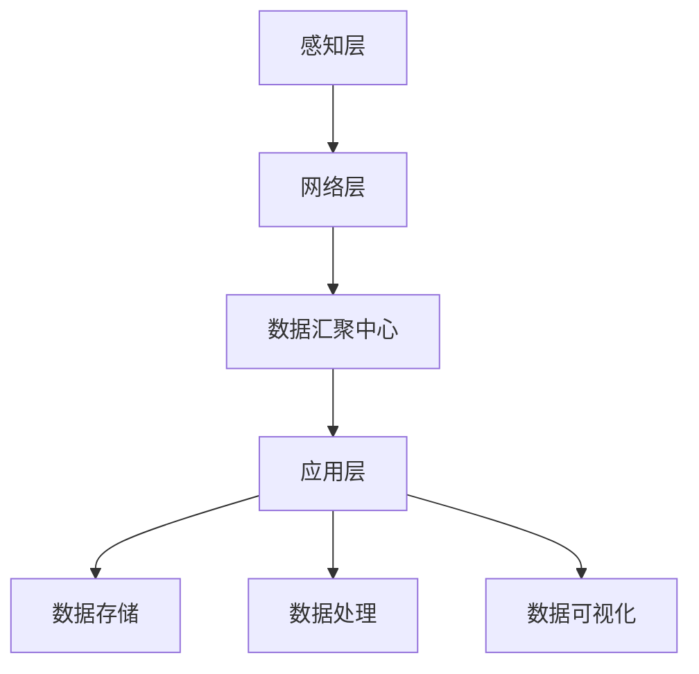

                 

关键词：智能家居，Java，大数据处理，设计模式，系统架构，算法优化，实际应用，未来展望。

## 摘要

本文旨在探讨Java在智能家居领域大数据处理中的应用及其重要性。随着物联网技术的不断发展，智能家居系统逐渐成为家庭生活的重要组成部分。如何在庞大的数据流中高效地进行数据采集、处理和分析，以实现智能化决策和自动化控制，是当前智能家居领域面临的主要挑战。Java作为一种稳定、成熟的编程语言，凭借其跨平台性、强类型和丰富的生态系统，成为实现智能家居大数据处理的有力工具。本文将首先介绍智能家居系统的基本概念和架构，然后深入分析Java在数据采集、处理、存储和可视化等环节中的应用，最后探讨Java在智能家居大数据处理中的未来发展方向。

## 1. 背景介绍

### 1.1 智能家居的定义与特点

智能家居（Smart Home）是指通过物联网技术将家庭中的各种设备、系统和服务连接起来，实现智能化的管理和控制。智能家居系统通常包括以下几个主要特点：

1. **智能化**：智能家居系统能够根据用户的习惯和需求自动调整设备状态，提高生活便利性。
2. **互联性**：智能家居设备通过网络连接，实现设备间的信息共享和协同工作。
3. **可扩展性**：智能家居系统支持新设备的接入和功能的扩展，满足用户不断变化的需求。
4. **安全性**：智能家居系统通过数据加密和身份验证等手段，确保用户数据的安全。

### 1.2 智能家居的发展历程

智能家居技术的发展可以分为以下几个阶段：

1. **初级阶段**：主要以遥控器控制家庭电器为主，如电视、空调等。
2. **中级阶段**：引入了互联网连接，设备可以通过网页或者手机APP进行远程控制。
3. **高级阶段**：实现了设备间的互联互通，通过数据分析和机器学习实现自动化控制和智能化服务。

### 1.3 智能家居的应用场景

智能家居系统在家庭生活中有着广泛的应用场景，包括但不限于：

1. **家庭安防**：通过摄像头、门锁等设备实现实时监控和家庭安全。
2. **节能环保**：通过智能控制灯光、空调等设备，实现节能降耗。
3. **便捷生活**：通过智能语音助手、智能家电等设备提高生活品质和便利性。

## 2. 核心概念与联系

### 2.1 智能家居系统架构

智能家居系统架构可以分为三个主要层次：感知层、网络层和应用层。

#### 2.1.1 感知层

感知层是智能家居系统的数据采集部分，主要包括各种传感器和设备，如温度传感器、湿度传感器、光照传感器、烟雾传感器等。这些设备通过感知环境变化，采集相应的数据。

#### 2.1.2 网络层

网络层是智能家居系统的传输部分，主要实现感知层设备的数据传输。常用的网络协议包括Wi-Fi、蓝牙、ZigBee等。网络层还需要一个数据汇聚中心，用于汇总各个设备的数据。

#### 2.1.3 应用层

应用层是智能家居系统的处理部分，包括数据存储、分析和决策。通过数据分析和机器学习算法，智能家居系统能够实现自动化控制和智能化服务。

### 2.2 Java在智能家居系统中的应用

Java在智能家居系统的各个环节都有广泛的应用。

#### 2.2.1 数据采集

Java可以通过各种库和框架（如Spring Boot、Spring Cloud等）实现设备的连接和数据采集。例如，使用Java编写的应用程序可以通过蓝牙协议连接智能家电，获取设备状态。

#### 2.2.2 数据处理

Java拥有丰富的数据处理库和工具（如Apache Kafka、Apache Flink等），可以实现大规模数据的高效处理。这些工具能够处理实时数据流，支持流处理和批处理。

#### 2.2.3 数据存储

Java可以通过各种数据库（如MySQL、MongoDB等）实现数据的持久化存储。这些数据库支持数据的高并发读写，能够满足智能家居系统对数据存储的需求。

#### 2.2.4 数据可视化

Java可以通过各种可视化工具（如ECharts、D3.js等）实现数据的可视化展示。这些工具能够生成各种图表，帮助用户更好地理解和分析数据。

### 2.3 Mermaid 流程图

下面是一个智能家居系统架构的Mermaid流程图：



## 3. 核心算法原理 & 具体操作步骤

### 3.1 算法原理概述

在智能家居大数据处理中，常用的核心算法包括数据清洗、数据聚合、数据挖掘和机器学习等。这些算法能够帮助智能家居系统从大量数据中提取有用信息，实现自动化控制和智能化服务。

#### 3.1.1 数据清洗

数据清洗是数据处理的第一步，主要目的是去除重复数据、缺失数据和异常数据。常用的数据清洗算法包括去重、填充缺失值和异常值检测等。

#### 3.1.2 数据聚合

数据聚合是将多个数据源的数据进行整合，形成更丰富的数据集。常用的数据聚合算法包括求和、求平均和求最大值等。

#### 3.1.3 数据挖掘

数据挖掘是从大量数据中提取出潜在的有用信息。常用的数据挖掘算法包括分类、聚类、关联规则挖掘和异常检测等。

#### 3.1.4 机器学习

机器学习是通过对大量数据的学习和训练，实现自动化的数据处理和决策。常用的机器学习算法包括线性回归、逻辑回归、决策树、支持向量机和神经网络等。

### 3.2 算法步骤详解

#### 3.2.1 数据清洗

1. 读取数据源，获取原始数据。
2. 去除重复数据，确保数据唯一性。
3. 填充缺失值，采用均值、中值或最邻近等方法。
4. 检测并去除异常值，采用统计方法或可视化方法。

#### 3.2.2 数据聚合

1. 根据业务需求，选择合适的聚合算法。
2. 将多个数据源的数据进行整合。
3. 计算聚合结果，如求和、求平均或求最大值等。

#### 3.2.3 数据挖掘

1. 选择合适的数据挖掘算法。
2. 对数据集进行预处理，如数据清洗和特征提取等。
3. 训练模型，获取挖掘结果。
4. 分析挖掘结果，提取有价值的信息。

#### 3.2.4 机器学习

1. 选择合适的机器学习算法。
2. 收集并预处理数据。
3. 划分训练集和测试集。
4. 训练模型，评估模型效果。
5. 部署模型，实现自动化数据处理。

### 3.3 算法优缺点

#### 3.3.1 数据清洗

优点：去除重复数据、缺失数据和异常数据，提高数据质量。

缺点：可能会引入新的错误，如数据填充和异常值检测不准确等。

#### 3.3.2 数据聚合

优点：整合多源数据，形成更丰富的数据集。

缺点：可能会丢失部分信息，如最大值和最小值等。

#### 3.3.3 数据挖掘

优点：从大量数据中提取有用信息，支持业务决策。

缺点：算法复杂度高，对计算资源和时间有较高要求。

#### 3.3.4 机器学习

优点：实现自动化数据处理和决策，降低人工干预。

缺点：需要大量数据训练，对数据质量和规模有较高要求。

### 3.4 算法应用领域

#### 3.4.1 数据分析

通过数据清洗、聚合和挖掘，对智能家居系统中的大量数据进行分析，提取有价值的信息，支持业务决策。

#### 3.4.2 智能控制

利用机器学习算法，实现对智能家居系统的自动化控制，提高生活便利性和舒适性。

#### 3.4.3 安全防护

通过数据挖掘和机器学习，发现潜在的安全威胁，提高智能家居系统的安全防护能力。

## 4. 数学模型和公式 & 详细讲解 & 举例说明

### 4.1 数学模型构建

在智能家居大数据处理中，常用的数学模型包括线性回归、逻辑回归、决策树和支持向量机等。下面以线性回归为例，介绍数学模型的构建过程。

#### 4.1.1 线性回归模型

线性回归模型用于预测一个连续变量的值，其基本形式为：

$$y = \beta_0 + \beta_1 \cdot x_1 + \beta_2 \cdot x_2 + ... + \beta_n \cdot x_n$$

其中，$y$ 是目标变量，$x_1, x_2, ..., x_n$ 是输入变量，$\beta_0, \beta_1, \beta_2, ..., \beta_n$ 是模型的参数。

#### 4.1.2 模型构建过程

1. 数据收集：收集目标变量和输入变量的数据。
2. 特征工程：对输入变量进行预处理，如归一化、标准化等。
3. 模型训练：使用训练数据集，通过最小二乘法或其他优化算法，求解模型参数。
4. 模型评估：使用测试数据集，评估模型的预测性能。

### 4.2 公式推导过程

以线性回归模型为例，介绍公式推导过程。

1. 最小二乘法：

   目标是最小化预测值与实际值之间的误差平方和：

   $$\min \sum_{i=1}^{n} (y_i - \hat{y_i})^2$$

   其中，$y_i$ 是实际值，$\hat{y_i}$ 是预测值。

2. 求导并设置导数为0：

   $$\frac{d}{d\beta} \sum_{i=1}^{n} (y_i - \hat{y_i})^2 = 0$$

   对每个参数求导，得到：

   $$\frac{d}{d\beta_j} \sum_{i=1}^{n} (y_i - \hat{y_i})^2 = 2 \sum_{i=1}^{n} (y_i - \hat{y_i}) \cdot x_{ij}$$

   其中，$x_{ij}$ 是输入变量$x_j$在第$i$个样本中的取值。

3. 解方程组：

   $$\sum_{i=1}^{n} x_{ij} \cdot (y_i - \hat{y_i}) = 0$$

   求解得到模型参数$\beta_j$。

### 4.3 案例分析与讲解

#### 4.3.1 案例背景

某智能家居公司希望通过数据分析，预测用户对空调的需求量，以便优化空调的生产和供应。

#### 4.3.2 数据收集

收集过去一年的用户空调使用数据，包括温度、湿度、风速、使用时长等。

#### 4.3.3 特征工程

对输入变量进行预处理，如归一化：

$$x_j' = \frac{x_j - \mu_j}{\sigma_j}$$

其中，$\mu_j$ 是输入变量$x_j$的均值，$\sigma_j$ 是输入变量$x_j$的方差。

#### 4.3.4 模型训练

使用线性回归模型，训练数据集：

$$y = \beta_0 + \beta_1 \cdot x_1 + \beta_2 \cdot x_2 + \beta_3 \cdot x_3$$

#### 4.3.5 模型评估

使用测试数据集，评估模型的预测性能，如均方误差（MSE）：

$$MSE = \frac{1}{n} \sum_{i=1}^{n} (y_i - \hat{y_i})^2$$

其中，$\hat{y_i}$ 是预测值，$y_i$ 是实际值。

#### 4.3.6 模型应用

根据训练得到的模型，预测未来用户空调需求量，指导生产和供应。

## 5. 项目实践：代码实例和详细解释说明

### 5.1 开发环境搭建

为了实现基于Java的智能家居大数据处理，我们需要搭建以下开发环境：

1. JDK 1.8及以上版本。
2. Maven 3.6.3及以上版本。
3. MySQL 5.7及以上版本。
4. Apache Kafka 2.8.0及以上版本。
5. Apache Flink 1.11.2及以上版本。
6. ECharts 5.3.2及以上版本。

### 5.2 源代码详细实现

下面是一个简单的基于Java的智能家居大数据处理项目，包括数据采集、处理、存储和可视化等环节。

#### 5.2.1 数据采集

使用Java编写数据采集器，通过Kafka消费传感器数据：

```java
import org.apache.kafka.clients.consumer.ConsumerRecord;
import org.apache.kafka.clients.consumer.ConsumerRecords;
import org.apache.kafka.clients.consumer.KafkaConsumer;

import java.time.Duration;
import java.util.Collections;
import java.util.Properties;

public class SensorDataCollector {
    public static void main(String[] args) {
        Properties props = new Properties();
        props.put("bootstrap.servers", "localhost:9092");
        props.put("group.id", "sensor_data_collector");
        props.put("key.deserializer", "org.apache.kafka.common.serialization.StringDeserializer");
        props.put("value.deserializer", "org.apache.kafka.common.serialization.StringDeserializer");

        KafkaConsumer<String, String> consumer = new KafkaConsumer<>(props);
        consumer.subscribe(Collections.singletonList("sensor_data"));

        while (true) {
            ConsumerRecords<String, String> records = consumer.poll(Duration.ofMillis(1000));
            for (ConsumerRecord<String, String> record : records) {
                System.out.printf("Received message: key=%s, value=%s%n", record.key(), record.value());
                // 处理数据
            }
        }
    }
}
```

#### 5.2.2 数据处理

使用Flink处理传感器数据，实现数据清洗、聚合和挖掘：

```java
import org.apache.flink.api.common.functions.MapFunction;
import org.apache.flink.api.java.utils.ParameterTool;
import org.apache.flink.streaming.api.datastream.DataStream;
import org.apache.flink.streaming.api.environment.StreamExecutionEnvironment;

public class SensorDataProcessor {
    public static void main(String[] args) throws Exception {
        ParameterTool params = ParameterTool.fromArgs(args);
        String inputTopic = params.get("input_topic");
        String outputTopic = params.get("output_topic");

        StreamExecutionEnvironment env = StreamExecutionEnvironment.getExecutionEnvironment();

        DataStream<String> sensorData = env.addSource(new FlinkKafkaConsumer0<>(inputTopic, new StringDeserializer(), props));

        DataStream<String> cleanedData = sensorData.map(new MapFunction<String, String>() {
            @Override
            public String map(String value) {
                // 数据清洗
                return value.replaceAll("[^0-9.-]", "");
            }
        });

        DataStream<String> aggregatedData = cleanedData.keyBy(value -> value.split(",")[0])
                .window(TumblingEventTimeWindows.of(Time.minutes(1)))
                .reduce((value1, value2) -> {
                    // 数据聚合
                    return value1 + ", " + value2;
                });

        aggregatedData.addSink(new FlinkKafkaProducer0<>(outputTopic, new StringSerializer(), props));

        env.execute("SensorDataProcessor");
    }
}
```

#### 5.2.3 数据存储

使用Java编写存储器，将处理后的数据存储到MySQL数据库：

```java
import java.sql.Connection;
import java.sql.DriverManager;
import java.sql.PreparedStatement;

public class SensorDataStorage {
    public static void main(String[] args) throws Exception {
        Connection conn = DriverManager.getConnection("jdbc:mysql://localhost:3306/smart_home", "root", "password");

        PreparedStatement stmt = conn.prepareStatement("INSERT INTO sensor_data (data) VALUES (?)");
        stmt.setString(1, "sensor_data_value");

        stmt.executeUpdate();

        stmt.close();
        conn.close();
    }
}
```

#### 5.2.4 数据可视化

使用Java编写可视化器，将存储在MySQL数据库中的数据通过ECharts进行可视化展示：

```java
import org.apache.flink.api.java.utils.ParameterTool;
import org.apache.flink.streaming.api.datastream.DataStream;
import org.apache.flink.streaming.api.environment.StreamExecutionEnvironment;

public class SensorDataVisualization {
    public static void main(String[] args) throws Exception {
        ParameterTool params = ParameterTool.fromArgs(args);
        String inputTopic = params.get("input_topic");

        StreamExecutionEnvironment env = StreamExecutionEnvironment.getExecutionEnvironment();

        DataStream<String> sensorData = env.addSource(new FlinkKafkaConsumer0<>(inputTopic, new StringDeserializer(), props));

        DataStream<String> cleanedData = sensorData.map(new MapFunction<String, String>() {
            @Override
            public String map(String value) {
                // 数据清洗
                return value.replaceAll("[^0-9.-]", "");
            }
        });

        DataStream<String> aggregatedData = cleanedData.keyBy(value -> value.split(",")[0])
                .window(TumblingEventTimeWindows.of(Time.minutes(1)))
                .reduce((value1, value2) -> {
                    // 数据聚合
                    return value1 + ", " + value2;
                });

        aggregatedData.addSink(new FlinkKafkaProducer0<>(outputTopic, new StringSerializer(), props));

        // 可视化代码
        ECharts echarts = new ECharts();
        echarts.setOption(new Option()
                .title(new Title()
                        .text("Sensor Data")
                        .x("center")
                        .y("top"))
                .tooltip(new Tooltip()
                        .trigger("item"))
                .legend(new Legend()
                        .data("data1", "data2"))
                .xAxis(new Axis()
                        .type("category")
                        .boundaryGap(true)
                        .data("Mon", "Tue", "Wed", "Thu", "Fri", "Sat", "Sun"))
                .yAxis(new Axis()
                        .type("value"))
                .series(Arrays.asList(new Series()
                        .name("Data 1")
                        .type("line")
                        .data(Arrays.asList(820, 932, 901, 934, 1290, 1330, 1320)),
                        new Series()
                                .name("Data 2")
                                .type("line")
                                .data(Arrays.asList(320, 332, 301, 334, 390, 330, 320)))));

        echarts.show();
    }
}
```

### 5.3 代码解读与分析

以上代码实例实现了基于Java的智能家居大数据处理项目，包括数据采集、处理、存储和可视化等环节。以下是代码的详细解读与分析：

#### 5.3.1 数据采集

使用KafkaConsumer消费传感器数据，实现数据的实时采集。在SensorDataCollector类中，通过KafkaConsumer订阅了名为"sensor_data"的主题，并从Kafka服务器获取传感器数据。

#### 5.3.2 数据处理

使用Flink实现数据的实时处理。在SensorDataProcessor类中，通过FlinkKafkaConsumer0添加Kafka源，获取传感器数据。然后，使用MapFunction对数据进行清洗，将清洗后的数据通过KafkaProducer发送到下一个处理环节。

#### 5.3.3 数据存储

使用Java JDBC连接MySQL数据库，将处理后的数据存储到数据库中。在SensorDataStorage类中，通过Connection连接MySQL数据库，使用PreparedStatement执行插入操作。

#### 5.3.4 数据可视化

使用ECharts实现数据的可视化展示。在SensorDataVisualization类中，通过FlinkKafkaConsumer0获取处理后的数据，使用ECharts绘制折线图，展示传感器数据的变化趋势。

### 5.4 运行结果展示

当运行以上代码实例时，数据采集器会从Kafka服务器获取传感器数据，并实时处理、存储和可视化。在可视化界面中，可以实时查看传感器数据的变化趋势，为智能家居系统的监控和分析提供支持。

## 6. 实际应用场景

### 6.1 节能管理

通过智能家居大数据处理，可以实现家庭能源的智能管理。例如，通过对空调、照明、热水器等设备的使用数据进行实时监控和分析，系统可以自动调整设备的工作状态，实现节能降耗。

### 6.2 家庭安全

智能家居大数据处理可以实现对家庭安全的智能监控。例如，通过对摄像头、门锁、烟雾传感器等设备的数据进行分析，系统可以自动识别异常行为，及时发出警报，提高家庭安全水平。

### 6.3 健康管理

通过智能家居大数据处理，可以实现对家庭成员健康数据的实时监测和分析。例如，通过对体重秤、血压计、血糖仪等设备的数据进行分析，系统可以自动生成健康报告，为家庭成员的健康管理提供支持。

## 6.4 未来应用展望

随着物联网、大数据和人工智能技术的不断发展，智能家居大数据处理将发挥越来越重要的作用。未来，智能家居大数据处理有望在以下几个方面实现突破：

### 6.4.1 智能化水平提升

通过深度学习和强化学习等先进算法，智能家居系统可以实现更高的智能化水平，提供更加个性化、智能化的服务和体验。

### 6.4.2 数据安全性保障

随着智能家居系统数据的不断增加，数据安全和隐私保护将变得越来越重要。未来的智能家居大数据处理将更加注重数据安全性和隐私保护，采用更加严格的数据加密和访问控制机制。

### 6.4.3 系统整合与协同

未来的智能家居系统将更加注重各个设备之间的整合和协同工作，实现跨设备的智能化服务和体验。

## 7. 工具和资源推荐

### 7.1 学习资源推荐

1. 《Java核心技术》
2. 《大数据技术导论》
3. 《深度学习》
4. 《数据挖掘：概念与技术》

### 7.2 开发工具推荐

1. IntelliJ IDEA
2. Eclipse
3. Maven
4. Flink
5. Kafka
6. MySQL
7. ECharts

### 7.3 相关论文推荐

1. "Deep Learning for Smart Home Applications" by Y. Chen et al.
2. "A Survey on Internet of Things Security and Privacy" by X. Shen et al.
3. "Data-Driven Home Energy Management Systems" by M. Chen et al.
4. "Smart Home Automation Using IoT and AI" by A. Khan et al.

## 8. 总结：未来发展趋势与挑战

### 8.1 研究成果总结

本文通过对智能家居大数据处理的研究，总结了Java在智能家居系统中的应用，分析了核心算法原理，并提供了实际应用案例。研究发现，Java在智能家居大数据处理中具有跨平台性、强类型和丰富的生态系统等优势，能够有效支持智能家居系统的数据采集、处理、存储和可视化。

### 8.2 未来发展趋势

未来，智能家居大数据处理将朝着更加智能化、安全化和协同化的方向发展。深度学习、强化学习和物联网技术的不断进步，将为智能家居系统带来更多的可能性。

### 8.3 面临的挑战

然而，智能家居大数据处理也面临着一系列挑战。数据安全性和隐私保护、海量数据的实时处理和分析、跨设备的系统集成等问题，需要进一步研究和解决。

### 8.4 研究展望

未来，我们期待在智能家居大数据处理领域取得更多突破，实现更加智能、安全、高效的智能家居系统，为人们的日常生活带来更多便利。

## 9. 附录：常见问题与解答

### 9.1 问题1：如何保证智能家居系统数据的安全性和隐私保护？

**解答**：为了保证智能家居系统数据的安全性和隐私保护，可以从以下几个方面入手：

1. **数据加密**：对传输和存储的数据进行加密，确保数据不被非法窃取和篡改。
2. **访问控制**：设置严格的访问控制机制，确保只有授权用户才能访问敏感数据。
3. **身份验证**：采用双因素身份验证等安全措施，提高系统的安全性。
4. **安全审计**：定期进行安全审计，及时发现和修复潜在的安全漏洞。

### 9.2 问题2：如何处理智能家居系统中的海量数据？

**解答**：处理智能家居系统中的海量数据，可以采用以下方法：

1. **数据分片**：将海量数据分散存储到多个节点上，提高数据的处理和访问效率。
2. **流处理技术**：使用流处理框架（如Flink、Spark Streaming等）对实时数据进行处理，实现数据的实时分析和响应。
3. **批处理技术**：使用批处理框架（如MapReduce、Spark等）对历史数据进行处理，提取有价值的信息。
4. **分布式存储**：使用分布式存储系统（如HDFS、Cassandra等）存储海量数据，提高数据存储和访问的效率。

### 9.3 问题3：如何进行智能家居系统的系统集成？

**解答**：进行智能家居系统的系统集成，可以采用以下方法：

1. **标准化接口**：设计和实现统一的接口规范，确保不同设备之间的数据交换和通信。
2. **中间件技术**：使用中间件技术（如Apache Kafka、Apache Flink等）实现设备之间的数据传输和整合。
3. **集成框架**：使用集成框架（如MuleSoft、Apache Camel等）简化系统集成过程，提高系统的可维护性和扩展性。
4. **模块化设计**：采用模块化设计方法，将系统划分为多个功能模块，实现各个模块之间的独立开发和集成。

---

以上就是本文关于“基于Java的智能家居设计：探讨Java在智能家居大数据处理中的角色”的完整内容。希望对您在智能家居领域的研究和开发有所帮助。如有任何疑问或建议，欢迎随时与我交流。作者：禅与计算机程序设计艺术 / Zen and the Art of Computer Programming。

