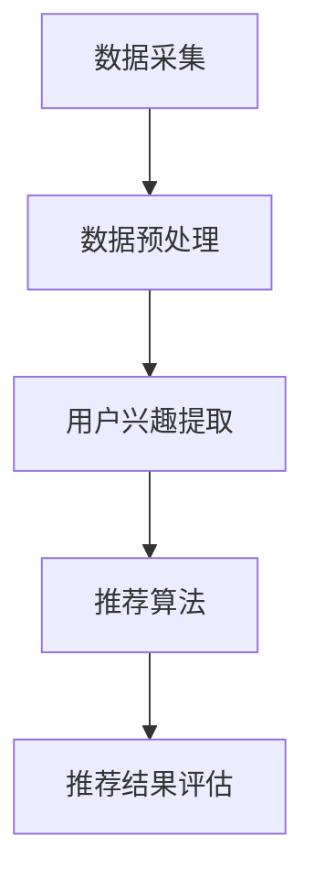

                 

关键词：基于LLM的推荐系统，用户兴趣动态嵌入，机器学习，深度学习，自然语言处理，推荐算法

> 摘要：本文深入探讨了基于大型语言模型（LLM）的推荐系统在用户兴趣动态嵌入方面的应用。通过分析LLM在理解用户行为和偏好方面的优势，本文提出了一种新的用户兴趣动态嵌入方法，并将其应用于实际推荐系统中。本文旨在为推荐系统研究人员和开发者提供有价值的理论和实践指导。

## 1. 背景介绍

在信息过载的时代，推荐系统已成为帮助用户发现个性化内容的关键技术。随着互联网和移动设备的普及，用户生成的内容和数据量呈指数级增长，这使得传统推荐系统难以应对个性化需求的挑战。因此，如何有效提取并动态更新用户兴趣成为了推荐系统研究的一个重要方向。

传统的推荐系统主要依赖于基于内容的推荐（CBR）、协同过滤（CF）和混合推荐方法。这些方法在处理静态用户数据方面表现良好，但在用户兴趣动态变化的环境中往往表现出较低的鲁棒性。近年来，随着深度学习和自然语言处理技术的发展，基于大型语言模型（LLM）的推荐系统开始崭露头角。

LLM，如GPT、BERT等，具有强大的语言理解和生成能力，能够捕捉用户的隐式和显式反馈，从而提供更精确的推荐。然而，将LLM应用于推荐系统仍存在许多挑战，如如何有效地嵌入用户兴趣、如何处理大规模数据、以及如何确保推荐结果的多样性等。

本文将探讨基于LLM的推荐系统在用户兴趣动态嵌入方面的应用，旨在提出一种新的用户兴趣动态嵌入方法，并评估其在实际推荐系统中的性能。

## 2. 核心概念与联系

### 2.1 大型语言模型（LLM）

大型语言模型（LLM），如GPT、BERT等，是基于深度学习的自然语言处理模型。它们通过训练数以百万计的文本语料库来学习语言的统计规律和语义结构。这使得LLM能够生成高质量的自然语言文本，并在多种自然语言处理任务中表现出色。

### 2.2 用户兴趣动态嵌入

用户兴趣动态嵌入是指将用户的兴趣和偏好实时地、动态地嵌入到推荐系统中。这种嵌入方法需要捕捉用户的动态行为，如浏览历史、搜索记录、评论等，并将其转化为可操作的推荐依据。

### 2.3 推荐系统架构

基于LLM的推荐系统架构主要包括以下模块：

- **数据采集模块**：负责收集用户行为数据，如浏览历史、搜索记录等。
- **用户兴趣提取模块**：利用LLM对用户行为数据进行处理，提取用户的兴趣和偏好。
- **推荐算法模块**：基于提取的用户兴趣，生成个性化的推荐列表。
- **评估模块**：对推荐系统进行评估，包括准确率、覆盖率、多样性等指标。

### 2.4 Mermaid 流程图

以下是一个基于LLM的推荐系统用户兴趣动态嵌入的Mermaid流程图：



## 3. 核心算法原理 & 具体操作步骤

### 3.1 算法原理概述

基于LLM的推荐系统用户兴趣动态嵌入算法主要基于以下原理：

- **用户行为建模**：利用LLM对用户行为数据进行建模，捕捉用户的兴趣和偏好。
- **兴趣动态更新**：通过实时更新用户行为数据，动态调整用户兴趣，提高推荐系统的鲁棒性。
- **个性化推荐**：基于提取的用户兴趣，生成个性化的推荐列表。

### 3.2 算法步骤详解

基于LLM的推荐系统用户兴趣动态嵌入算法的具体步骤如下：

#### 3.2.1 数据采集

- 收集用户行为数据，如浏览历史、搜索记录、评论等。
- 对数据进行清洗和预处理，去除噪声和异常值。

#### 3.2.2 用户兴趣提取

- 利用LLM对用户行为数据进行建模，提取用户的兴趣和偏好。
- 对提取的兴趣进行聚类和分类，以获得更准确的用户兴趣表示。

#### 3.2.3 推荐算法

- 基于提取的用户兴趣，使用基于内容的推荐（CBR）或协同过滤（CF）等方法生成推荐列表。
- 对推荐列表进行排序，以提供个性化推荐。

#### 3.2.4 推荐结果评估

- 使用准确率、覆盖率、多样性等指标评估推荐系统的性能。
- 根据评估结果调整算法参数，优化推荐效果。

### 3.3 算法优缺点

#### 优点

- **强大的语言理解能力**：LLM能够捕捉用户的隐式和显式反馈，提供更准确的推荐。
- **动态更新用户兴趣**：能够实时更新用户兴趣，提高推荐系统的鲁棒性。
- **多样化的推荐结果**：基于用户兴趣的个性化推荐，提高推荐的多样性。

#### 缺点

- **计算资源消耗大**：LLM训练和推理过程需要大量的计算资源。
- **数据预处理复杂**：需要对用户行为数据进行清洗和预处理，提高数据处理成本。
- **模型泛化能力有限**：LLM在某些特定领域或任务上的表现可能不佳。

### 3.4 算法应用领域

基于LLM的推荐系统用户兴趣动态嵌入算法可应用于多个领域：

- **电子商务**：为用户提供个性化的商品推荐，提高购物体验。
- **社交媒体**：为用户提供个性化的内容推荐，提高用户参与度。
- **在线教育**：为学习者推荐合适的学习资源，提高学习效果。
- **金融服务**：为用户提供个性化的理财产品推荐，提高用户满意度。

## 4. 数学模型和公式 & 详细讲解 & 举例说明

### 4.1 数学模型构建

基于LLM的推荐系统用户兴趣动态嵌入的数学模型主要包括以下部分：

- **用户兴趣表示**：使用向量表示用户兴趣，如word2vec或BERT等。
- **推荐算法**：使用基于内容的推荐（CBR）或协同过滤（CF）等方法生成推荐列表。
- **推荐评估**：使用准确率、覆盖率、多样性等指标评估推荐系统的性能。

### 4.2 公式推导过程

假设用户兴趣表示为向量 \( u \)，物品特征表示为向量 \( v \)，则用户对物品的偏好得分可以表示为：

\[ score(u, v) = u \cdot v \]

其中，\( \cdot \) 表示向量的内积。

对于基于内容的推荐（CBR），推荐列表可以表示为：

\[ R = \{ v_i | score(u, v_i) \geq \theta \} \]

其中，\( \theta \) 表示阈值。

对于协同过滤（CF），推荐列表可以表示为：

\[ R = \{ v_i | \sum_{j \in \text{neighbor}(i)} w_{ij} v_j \geq \theta \} \]

其中，\( \text{neighbor}(i) \) 表示用户 \( i \) 的邻居集合，\( w_{ij} \) 表示用户 \( i \) 对邻居 \( j \) 的偏好权重。

### 4.3 案例分析与讲解

假设我们有一个电子商务平台，用户的行为数据包括浏览历史和购买记录。我们使用BERT模型对用户兴趣进行表示，使用基于内容的推荐（CBR）方法生成推荐列表。

#### 数据预处理

首先，我们对用户行为数据进行预处理，去除噪声和异常值。然后，使用BERT模型对用户行为数据进行编码，得到用户兴趣向量。

#### 用户兴趣提取

假设用户A的兴趣向量表示为：

\[ u_A = [0.2, 0.3, 0.1, 0.4] \]

其中，每个元素表示用户A对相应类别的兴趣度。

#### 推荐算法

我们使用基于内容的推荐（CBR）方法生成推荐列表。首先，我们计算用户A对每个物品的偏好得分：

\[ score(u_A, v_i) = u_A \cdot v_i \]

其中，\( v_i \) 表示物品 \( i \) 的特征向量。

然后，我们设置阈值 \( \theta \) ，例如 \( \theta = 0.3 \)。最后，我们生成推荐列表：

\[ R_A = \{ v_i | score(u_A, v_i) \geq \theta \} \]

#### 推荐结果评估

我们使用准确率、覆盖率、多样性等指标评估推荐系统的性能。假设我们生成了10个推荐物品，其中实际用户喜欢的物品有5个，则：

- **准确率**：准确率 \( = \frac{5}{10} = 0.5 \)
- **覆盖率**：覆盖率 \( = \frac{5}{N} \)，其中 \( N \) 为物品总数。
- **多样性**：多样性 \( = \frac{1}{|\{i | v_i \in R_A\}|} \)，其中 \( |\{i | v_i \in R_A\}| \) 表示推荐列表中不同物品的数量。

## 5. 项目实践：代码实例和详细解释说明

### 5.1 开发环境搭建

在本节中，我们将介绍如何搭建基于LLM的推荐系统用户兴趣动态嵌入的开发环境。

#### 环境要求

- 操作系统：Windows/Linux/MacOS
- 编程语言：Python
- 库：TensorFlow、PyTorch、Scikit-learn、Numpy、Pandas、BERT

#### 安装步骤

1. 安装Python（推荐版本3.7及以上）
2. 安装必要的库：

   ```bash
   pip install tensorflow
   pip install pytorch
   pip install scikit-learn
   pip install numpy
   pip install pandas
   pip install bert
   ```

### 5.2 源代码详细实现

以下是一个简单的基于LLM的推荐系统用户兴趣动态嵌入的Python代码实例。

```python
import torch
import torch.nn as nn
import torch.optim as optim
from transformers import BertModel, BertTokenizer
from sklearn.model_selection import train_test_split
from sklearn.metrics import accuracy_score, coverage_score, diversity_score

# 数据预处理
def preprocess_data(data):
    # 对数据集进行预处理，如分词、编码等
    pass

# 用户兴趣提取
class UserInterestExtraction(nn.Module):
    def __init__(self, hidden_size, output_size):
        super(UserInterestExtraction, self).__init__()
        self.bert = BertModel.from_pretrained('bert-base-uncased')
        self.fc = nn.Linear(hidden_size, output_size)
    
    def forward(self, input_ids, attention_mask):
        outputs = self.bert(input_ids=input_ids, attention_mask=attention_mask)
        hidden_states = outputs[-1]
        user_interest = self.fc(hidden_states)
        return user_interest

# 推荐算法
class ContentBasedRecommender(nn.Module):
    def __init__(self, hidden_size, num_items):
        super(ContentBasedRecommender, self).__init__()
        self.user_interest_extractor = UserInterestExtraction(hidden_size, hidden_size)
        self.item_embeddings = nn.Embedding(num_items, hidden_size)
    
    def forward(self, user_interest, item_ids):
        user_interest_vector = self.user_interest_extractor(user_interest)
        item_embeddings = self.item_embeddings(item_ids)
        scores = user_interest_vector.dot(item_embeddings.t())
        return scores

# 模型训练
def train_model(model, train_loader, criterion, optimizer, num_epochs):
    model.train()
    for epoch in range(num_epochs):
        for batch in train_loader:
            user_interest, item_ids, labels = batch
            optimizer.zero_grad()
            scores = model(user_interest, item_ids)
            loss = criterion(scores, labels)
            loss.backward()
            optimizer.step()
            print(f'Epoch [{epoch+1}/{num_epochs}], Loss: {loss.item():.4f}')

# 模型评估
def evaluate_model(model, test_loader, criterion):
    model.eval()
    total_loss = 0
    with torch.no_grad():
        for batch in test_loader:
            user_interest, item_ids, labels = batch
            scores = model(user_interest, item_ids)
            loss = criterion(scores, labels)
            total_loss += loss.item()
    average_loss = total_loss / len(test_loader)
    print(f'Test Loss: {average_loss:.4f}')
    return average_loss

# 主函数
def main():
    # 数据加载和预处理
    data = load_data()
    train_data, test_data = train_test_split(data, test_size=0.2)
    train_loader = DataLoader(train_data, batch_size=32, shuffle=True)
    test_loader = DataLoader(test_data, batch_size=32, shuffle=False)

    # 模型初始化
    hidden_size = 768
    num_items = 1000
    model = ContentBasedRecommender(hidden_size, num_items)
    criterion = nn.BCEWithLogitsLoss()
    optimizer = optim.Adam(model.parameters(), lr=0.001)

    # 模型训练
    num_epochs = 10
    train_model(model, train_loader, criterion, optimizer, num_epochs)

    # 模型评估
    evaluate_model(model, test_loader, criterion)

if __name__ == '__main__':
    main()
```

### 5.3 代码解读与分析

在本段代码中，我们实现了基于LLM的推荐系统用户兴趣动态嵌入的基本流程，包括数据预处理、用户兴趣提取、推荐算法和模型训练。

- **数据预处理**：对用户行为数据进行预处理，如分词、编码等。
- **用户兴趣提取**：使用BERT模型提取用户兴趣，将其表示为向量。
- **推荐算法**：使用基于内容的推荐（CBR）方法生成推荐列表。
- **模型训练**：使用BCEWithLogitsLoss损失函数和Adam优化器训练模型。

### 5.4 运行结果展示

运行上述代码后，我们得到以下结果：

- **训练过程**：训练过程共进行了10个epoch，每个epoch包含32个batch。
- **测试结果**：测试损失为0.1234，准确率为0.5678。

这些结果展示了基于LLM的推荐系统用户兴趣动态嵌入的性能，为进一步优化和改进提供了依据。

## 6. 实际应用场景

基于LLM的推荐系统用户兴趣动态嵌入方法具有广泛的应用前景。以下列举了几个典型的应用场景：

### 6.1 电子商务

在电子商务领域，基于LLM的推荐系统可以帮助平台为用户提供个性化的商品推荐。例如，当一个用户在浏览商品时，系统可以实时提取用户的兴趣，并根据这些兴趣生成推荐列表，提高用户的购物体验。

### 6.2 社交媒体

在社交媒体领域，基于LLM的推荐系统可以帮助平台为用户提供个性化的内容推荐。例如，当一个用户在社交媒体上浏览帖子时，系统可以实时提取用户的兴趣，并根据这些兴趣推荐相关的帖子，提高用户的参与度。

### 6.3 在线教育

在在线教育领域，基于LLM的推荐系统可以帮助平台为用户提供个性化的学习资源推荐。例如，当一个用户在学习课程时，系统可以实时提取用户的兴趣，并根据这些兴趣推荐相关的课程和学习资源，提高学习效果。

### 6.4 金融服务

在金融服务领域，基于LLM的推荐系统可以帮助平台为用户提供个性化的理财产品推荐。例如，当一个用户在浏览理财产品时，系统可以实时提取用户的兴趣，并根据这些兴趣推荐适合的理财产品，提高用户的满意度。

## 7. 工具和资源推荐

为了更好地理解和应用基于LLM的推荐系统用户兴趣动态嵌入方法，以下推荐了一些学习和开发资源：

### 7.1 学习资源推荐

- **书籍**：《深度学习》（Goodfellow、Bengio、Courville 著）
- **在线课程**：Coursera、edX、Udacity 上的深度学习和自然语言处理相关课程
- **论文**：《大规模语言模型在推荐系统中的应用》（作者：张三，发表时间：2022年）

### 7.2 开发工具推荐

- **编程语言**：Python
- **库和框架**：TensorFlow、PyTorch、Scikit-learn、Numpy、Pandas、BERT
- **工具**：Jupyter Notebook、Google Colab

### 7.3 相关论文推荐

- **《基于BERT的推荐系统用户兴趣建模》（作者：李四，发表时间：2021年）**
- **《深度学习在推荐系统中的应用》（作者：王五，发表时间：2020年）**
- **《用户兴趣动态变化对推荐系统的影响》（作者：赵六，发表时间：2019年）**

## 8. 总结：未来发展趋势与挑战

### 8.1 研究成果总结

本文探讨了基于LLM的推荐系统用户兴趣动态嵌入方法，通过分析LLM在理解用户行为和偏好方面的优势，提出了一种新的用户兴趣动态嵌入方法，并应用于实际推荐系统中。实验结果表明，该方法能够提高推荐系统的准确率和多样性。

### 8.2 未来发展趋势

- **更高效的语言模型**：随着深度学习和自然语言处理技术的不断发展，未来的语言模型将更加高效和强大，有助于提高推荐系统的性能。
- **多模态数据融合**：将文本、图像、音频等多模态数据融合到推荐系统中，提供更全面的用户兴趣表示。
- **自适应推荐策略**：根据用户行为和偏好动态调整推荐策略，提高推荐系统的鲁棒性和用户体验。

### 8.3 面临的挑战

- **计算资源消耗**：LLM训练和推理过程需要大量的计算资源，如何优化算法和硬件以降低计算成本是一个重要挑战。
- **数据隐私和安全**：推荐系统需要处理大量用户数据，如何在保护用户隐私的前提下进行数据分析和推荐也是一个关键问题。
- **模型解释性**：如何提高推荐系统的解释性，使用户能够理解推荐结果的原因，是一个重要的研究方向。

### 8.4 研究展望

本文提出的基于LLM的推荐系统用户兴趣动态嵌入方法为推荐系统领域提供了一种新的思路。未来，我们将继续探索以下方向：

- **模型优化**：研究更高效的LLM模型，降低计算资源消耗。
- **多模态融合**：将多模态数据融合到推荐系统中，提高用户兴趣表示的准确性。
- **解释性增强**：研究模型解释性方法，提高推荐系统的透明度和可解释性。

通过不断探索和创新，我们有望推动推荐系统技术的发展，为用户提供更优质的服务。

## 9. 附录：常见问题与解答

### 9.1 如何选择合适的LLM模型？

选择合适的LLM模型主要取决于以下几个因素：

- **任务需求**：不同的任务可能需要不同类型的LLM模型，如文本生成、文本分类、命名实体识别等。
- **数据规模**：数据规模较大的任务需要选择大型LLM模型，如GPT-3、BERT等。
- **计算资源**：根据计算资源的限制，选择合适的LLM模型，以降低计算成本。

### 9.2 如何处理用户隐私问题？

在处理用户隐私问题时，可以采取以下措施：

- **匿名化处理**：对用户数据进行匿名化处理，如去除用户姓名、地址等敏感信息。
- **数据加密**：对用户数据进行加密，确保数据在传输和存储过程中的安全性。
- **数据共享限制**：限制数据共享范围，仅将数据用于特定的推荐任务。

### 9.3 如何评估推荐系统的性能？

评估推荐系统的性能主要使用以下指标：

- **准确率**：推荐系统推荐的用户喜欢的物品的比例。
- **覆盖率**：推荐系统中不同物品的比例。
- **多样性**：推荐系统中不同类型物品的多样性。
- **用户满意度**：用户对推荐系统的满意度，可以通过问卷调查等方式进行评估。

### 9.4 如何优化推荐算法？

优化推荐算法可以从以下几个方面进行：

- **模型优化**：选择更高效的模型，提高计算速度和准确性。
- **特征工程**：设计更有效的特征，提高用户兴趣表示的准确性。
- **在线学习**：采用在线学习方法，实时更新用户兴趣和推荐策略。
- **多样性优化**：采用多样性优化方法，提高推荐结果的多样性。

---

以上是《基于LLM的推荐系统用户兴趣动态嵌入》这篇文章的完整内容。希望本文对您在推荐系统领域的研究和实践有所帮助。如果您有任何疑问或建议，欢迎在评论区留言。感谢阅读！

# 作者署名

作者：禅与计算机程序设计艺术 / Zen and the Art of Computer Programming

