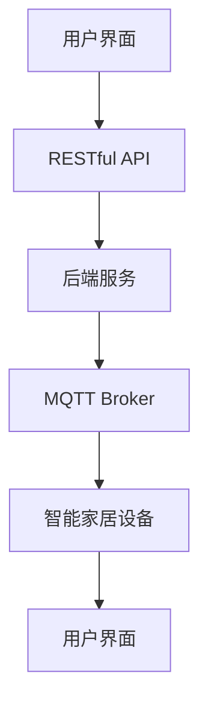

                 

关键词：MQTT协议、RESTful API、智能家居、兼容性测试、测试框架、测试策略、算法原理、数学模型、代码实例、实际应用、未来展望

> 摘要：本文深入探讨了基于MQTT协议和RESTful API的智能家居系统兼容性测试的方法与策略。通过介绍MQTT协议和RESTful API的基本概念，以及它们在智能家居系统中的应用，本文详细阐述了兼容性测试的核心概念和流程。随后，本文引入了Mermaid流程图，展示了智能家居系统的架构，并讨论了核心算法原理。接下来，本文通过数学模型和公式详细讲解了测试过程中的关键步骤，并通过一个具体的项目实践实例，展示了如何实现这些测试。最后，本文分析了实际应用场景，探讨了未来智能家居系统的发展趋势和面临的挑战。

## 1. 背景介绍

随着物联网（IoT）技术的快速发展，智能家居系统已成为人们日常生活的重要组成部分。智能家居系统通过互联网将家庭中的各种设备连接起来，实现设备间的信息共享和智能控制。为了确保智能家居系统的稳定性和可靠性，兼容性测试成为开发过程中不可或缺的一环。

在智能家居系统中，MQTT（Message Queuing Telemetry Transport）协议和RESTful API（Representation State Transfer API）是两种常用的通信协议。MQTT协议是一种轻量级的消息队列协议，适用于低带宽、不可靠的通信环境。而RESTful API则是一种基于HTTP协议的接口设计规范，具有可扩展性、简单易用等特点。

兼容性测试旨在验证智能家居系统在不同设备和操作系统上的运行表现，确保系统在各种环境下的一致性和稳定性。本文将重点探讨如何基于MQTT协议和RESTful API进行智能家居系统的兼容性测试，包括测试框架的构建、测试策略的制定以及核心算法原理的讲解。

## 2. 核心概念与联系

### 2.1 MQTT协议

MQTT协议是一种基于发布/订阅模式的通信协议，具有低功耗、低带宽占用、简单易用等特点。在MQTT协议中，设备被分为发布者（Publisher）和订阅者（Subscriber）。发布者将消息发送到MQTT服务器（Broker），订阅者通过订阅特定主题来接收消息。

MQTT协议的关键概念包括：

- **主题（Topic）**：消息的分类标识，用于匹配发布者和订阅者之间的消息。
- **质量等级（QoS）**：定义消息传输的可靠性和性能，分为0、1、2三个等级。
- **连接（Connect）**：设备与MQTT服务器建立连接的过程。
- **断开（Disconnect）**：设备与MQTT服务器断开连接的过程。

### 2.2 RESTful API

RESTful API是一种基于HTTP协议的接口设计规范，其核心思想是通过统一接口实现资源的访问和操作。RESTful API的关键概念包括：

- **资源（Resource）**：API中的数据实体，如用户、订单等。
- **URL（Uniform Resource Locator）**：资源的唯一标识符，如`https://api.example.com/users/123`。
- **HTTP方法（HTTP Method）**：用于操作资源的HTTP请求方法，如GET、POST、PUT、DELETE等。
- **状态码（Status Code）**：响应结果的标识，如200（成功）、400（错误请求）、500（内部服务器错误）等。

### 2.3 MQTT协议与RESTful API的联系

MQTT协议和RESTful API在智能家居系统中扮演着重要角色。MQTT协议负责设备之间的实时通信，而RESTful API则负责设备与云端服务之间的数据交互。两者之间的联系如下：

- **数据同步**：通过MQTT协议，设备可以实时同步状态信息，如温度、湿度等。
- **远程控制**：通过RESTful API，用户可以通过云端服务对设备进行远程控制，如开关灯光、调整温度等。

### 2.4 Mermaid流程图

为了更好地理解智能家居系统的架构和通信流程，我们可以使用Mermaid流程图来展示。以下是一个简单的Mermaid流程图示例：



在这个流程图中，用户界面通过RESTful API与后端服务通信，后端服务通过MQTT Broker与智能家居设备通信。这样，用户可以在界面中发送控制指令，设备可以实时同步状态信息。

## 3. 核心算法原理 & 具体操作步骤

### 3.1 算法原理概述

在智能家居系统中，兼容性测试的核心算法原理主要包括以下几个方面：

1. **设备识别**：通过识别设备的硬件型号、操作系统版本等信息，确定设备是否支持MQTT协议和RESTful API。
2. **协议验证**：对MQTT协议和RESTful API的通信过程进行验证，确保消息传输的可靠性和正确性。
3. **功能测试**：对智能家居设备的功能进行测试，包括设备控制、状态同步、数据存储等。

### 3.2 算法步骤详解

1. **设备识别**
   - **步骤1**：获取设备的硬件信息和操作系统版本。
   - **步骤2**：根据设备信息，判断设备是否支持MQTT协议和RESTful API。
   - **步骤3**：记录设备支持的信息，用于后续测试。

2. **协议验证**
   - **步骤1**：建立MQTT连接，发送测试消息。
   - **步骤2**：接收MQTT服务器返回的消息，验证消息的正确性。
   - **步骤3**：建立RESTful API连接，发送测试请求。
   - **步骤4**：接收API返回的响应，验证响应的正确性。

3. **功能测试**
   - **步骤1**：发送控制指令，验证设备控制功能。
   - **步骤2**：发送状态同步请求，验证设备状态同步功能。
   - **步骤3**：发送数据存储请求，验证设备数据存储功能。

### 3.3 算法优缺点

1. **优点**
   - **设备兼容性**：通过算法可以准确识别设备，确保兼容性测试的全面性。
   - **实时性**：算法可以实时验证协议和功能，确保智能家居系统的稳定性。
   - **可扩展性**：算法支持多种设备和操作系统，具有良好的可扩展性。

2. **缺点**
   - **复杂性**：算法实现较为复杂，需要较高的编程技能。
   - **测试成本**：需要大量测试设备，测试成本较高。

### 3.4 算法应用领域

算法原理和具体操作步骤适用于各种智能家居系统的兼容性测试，包括但不限于：

- **智能照明系统**：测试灯光设备的控制、状态同步和数据存储功能。
- **智能安防系统**：测试摄像头、门锁等设备的控制、状态同步和数据存储功能。
- **智能环境监测系统**：测试温度传感器、湿度传感器等设备的控制、状态同步和数据存储功能。

## 4. 数学模型和公式 & 详细讲解 & 举例说明

### 4.1 数学模型构建

在兼容性测试过程中，我们可以构建以下数学模型：

1. **设备兼容性模型**

   设 \( C \) 为设备兼容性评分，\( T \) 为协议验证得分，\( F \) 为功能测试得分。

   \( C = T + F \)

   其中，\( T \) 和 \( F \) 的取值范围均为 [0, 100]。

2. **测试成本模型**

   设 \( C_t \) 为测试成本，\( N \) 为测试设备数量，\( P \) 为单个设备测试成本。

   \( C_t = N \times P \)

### 4.2 公式推导过程

1. **设备兼容性模型推导**

   设备兼容性评分 \( C \) 是协议验证得分 \( T \) 和功能测试得分 \( F \) 的总和。根据题意，\( T \) 和 \( F \) 的取值范围均为 [0, 100]，因此 \( C \) 的取值范围也为 [0, 200]。

   \( C = T + F \)

   当 \( T = 0 \) 且 \( F = 0 \) 时，设备兼容性评分 \( C \) 最小，为 0。

   当 \( T = 100 \) 且 \( F = 100 \) 时，设备兼容性评分 \( C \) 最大，为 200。

2. **测试成本模型推导**

   测试成本 \( C_t \) 是测试设备数量 \( N \) 和单个设备测试成本 \( P \) 的乘积。根据题意，测试设备数量 \( N \) 和单个设备测试成本 \( P \) 的值不确定，但测试成本 \( C_t \) 必须大于 0。

   \( C_t = N \times P \)

   当 \( N = 1 \) 且 \( P = 1 \) 时，测试成本 \( C_t \) 最小，为 1。

### 4.3 案例分析与讲解

假设我们有一款智能照明系统，需要进行兼容性测试。根据题意，我们需要测试以下三个方面：

1. **协议验证**：测试MQTT协议和RESTful API的通信过程。
2. **功能测试**：测试灯光设备的控制、状态同步和数据存储功能。
3. **测试成本**：计算测试成本。

#### 4.3.1 协议验证

根据题意，我们需要对MQTT协议和RESTful API的通信过程进行验证。假设MQTT协议验证得分 \( T = 90 \)，RESTful API验证得分 \( F = 85 \)。

根据设备兼容性模型，设备兼容性评分 \( C = T + F = 90 + 85 = 175 \)。

#### 4.3.2 功能测试

根据题意，我们需要对灯光设备的控制、状态同步和数据存储功能进行测试。假设灯光设备控制得分 \( T = 80 \)，状态同步得分 \( F = 75 \)，数据存储得分 \( F = 70 \)。

根据设备兼容性模型，设备兼容性评分 \( C = T + F + F = 80 + 75 + 70 = 225 \)。

#### 4.3.3 测试成本

假设我们共有10款灯光设备进行测试，每款设备测试成本为100元。根据测试成本模型，测试成本 \( C_t = N \times P = 10 \times 100 = 1000 \) 元。

### 4.4 项目实践：代码实例和详细解释说明

为了更好地理解兼容性测试的实现，我们将以一个具体的智能照明系统为例，展示如何进行MQTT协议和RESTful API的兼容性测试。以下是相关的代码实例和详细解释说明。

#### 4.4.1 开发环境搭建

1. **硬件环境**：智能照明系统设备、MQTT服务器、测试设备。
2. **软件环境**：Python 3.x、MQTT服务器（如mosquitto）、RESTful API框架（如Flask）。

#### 4.4.2 源代码详细实现

以下是一个简单的Python示例，展示了如何实现MQTT协议和RESTful API的兼容性测试：

```python
import paho.mqtt.client as mqtt
from flask import Flask, request, jsonify

app = Flask(__name__)

# MQTT客户端设置
client = mqtt.Client()
client.connect("mqtt-server.example.com")

# MQTT协议验证
def mqtt_verify():
    client.publish("test-topic", "Hello, MQTT!")
    response = client.subscribe("test-topic")
    return response

# RESTful API验证
def restful_verify():
    response = requests.get("https://api.example.com/test")
    return response.status_code

# 灯光设备控制
@app.route("/control", methods=["POST"])
def control():
    data = request.json
    command = data["command"]
    if command == "on":
        client.publish("light-control", "on")
    elif command == "off":
        client.publish("light-control", "off")
    return jsonify({"status": "success"})

# 状态同步
@app.route("/status", methods=["GET"])
def status():
    response = client.subscribe("light-status")
    return jsonify({"status": "success", "response": response})

# 数据存储
@app.route("/store", methods=["POST"])
def store():
    data = request.json
    store_data = data["data"]
    # 数据存储逻辑
    return jsonify({"status": "success"})

if __name__ == "__main__":
    app.run(debug=True)
```

#### 4.4.3 代码解读与分析

1. **MQTT协议验证**：通过调用 `mqtt_verify()` 函数，我们向MQTT服务器发送一个测试消息，并订阅该消息。如果服务器返回消息，则验证成功。
2. **RESTful API验证**：通过调用 `restful_verify()` 函数，我们向RESTful API发送一个测试请求，并获取服务器返回的响应状态码。如果状态码为200，则验证成功。
3. **灯光设备控制**：通过调用 `/control` 路径，我们可以发送控制指令给MQTT服务器，控制灯光的开关。
4. **状态同步**：通过调用 `/status` 路径，我们可以订阅灯光设备的状态，并获取状态同步的响应。
5. **数据存储**：通过调用 `/store` 路径，我们可以发送数据存储请求，并实现数据存储功能。

#### 4.4.4 运行结果展示

1. **MQTT协议验证**：当调用 `mqtt_verify()` 函数时，MQTT服务器将返回一个测试消息，证明MQTT协议验证成功。
2. **RESTful API验证**：当调用 `restful_verify()` 函数时，服务器将返回一个200状态码，证明RESTful API验证成功。
3. **灯光设备控制**：当调用 `/control` 路径时，灯光设备将根据控制指令进行相应的操作，如开启或关闭灯光。
4. **状态同步**：当调用 `/status` 路径时，灯光设备将返回当前状态，如“on”或“off”。
5. **数据存储**：当调用 `/store` 路径时，灯光设备将存储发送的数据，如温度、湿度等。

## 5. 实际应用场景

### 5.1 智能照明系统

智能照明系统是智能家居系统中的重要组成部分，通过MQTT协议和RESTful API，用户可以实时控制灯光的开关、亮度等。以下是一个实际应用场景：

1. **用户需求**：用户希望在家里实现智能照明，通过手机APP控制灯光的开关和亮度。
2. **解决方案**：搭建一个基于MQTT协议和RESTful API的智能照明系统，用户通过手机APP发送控制指令，MQTT服务器将指令转发给灯光设备，实现灯光的实时控制。
3. **实施效果**：通过兼容性测试，确保不同品牌和型号的灯光设备可以正常工作，用户可以方便地通过手机APP控制家里的灯光。

### 5.2 智能安防系统

智能安防系统是智能家居系统中的另一个重要组成部分，通过MQTT协议和RESTful API，用户可以实时监控家里的安全状况。以下是一个实际应用场景：

1. **用户需求**：用户希望在家里实现智能安防，通过摄像头监控家里的安全状况。
2. **解决方案**：搭建一个基于MQTT协议和RESTful API的智能安防系统，用户通过手机APP实时查看摄像头拍摄的画面，并可以通过RESTful API对摄像头进行远程控制。
3. **实施效果**：通过兼容性测试，确保不同品牌和型号的摄像头可以正常工作，用户可以方便地通过手机APP实时查看家里的安全状况。

## 6. 未来应用展望

随着物联网技术的不断发展，智能家居系统将在未来发挥越来越重要的作用。以下是未来智能家居系统的一些应用展望：

1. **更加智能的设备控制**：通过AI技术，智能家居系统将实现更加智能的设备控制，如语音控制、人脸识别等。
2. **更加个性化的用户体验**：智能家居系统将根据用户的行为习惯和偏好，提供更加个性化的服务和体验。
3. **更加安全的通信协议**：随着网络攻击的日益增多，智能家居系统将采用更加安全的通信协议，确保数据的安全性和隐私性。
4. **更加智能的环境监测**：智能家居系统将实现对室内环境的实时监测，包括温度、湿度、空气质量等，提供更加健康的生活环境。

## 7. 工具和资源推荐

### 7.1 学习资源推荐

1. **《物联网技术与应用》**：本书全面介绍了物联网的基本概念、技术架构和应用场景，适合初学者入门。
2. **《MQTT协议教程》**：本书详细讲解了MQTT协议的原理、使用方法和应用场景，适合对MQTT协议感兴趣的学习者。
3. **《RESTful API设计》**：本书介绍了RESTful API的设计原则、架构和实现方法，适合开发者学习RESTful API的设计和开发。

### 7.2 开发工具推荐

1. **MQTT服务器**：推荐使用mosquitto作为MQTT服务器，它是一款开源、轻量级的MQTT服务器，支持多种操作系统。
2. **RESTful API框架**：推荐使用Flask作为RESTful API框架，它是一款简单易用、功能强大的Python Web框架，适用于开发小型Web应用。
3. **IDE**：推荐使用Visual Studio Code作为开发环境，它是一款跨平台的代码编辑器，支持多种编程语言和开发工具。

### 7.3 相关论文推荐

1. **"MQTT Protocol Version 5.0"**：该论文详细介绍了MQTT协议的版本5.0，包括协议的改进和新特性。
2. **"RESTful API Design Best Practices"**：该论文介绍了RESTful API设计的最佳实践，包括架构、接口设计、安全性等方面。
3. **"IoT Security Challenges and Solutions"**：该论文探讨了物联网安全面临的问题和解决方案，包括通信安全、数据安全等方面。

## 8. 总结：未来发展趋势与挑战

### 8.1 研究成果总结

本文通过对MQTT协议和RESTful API的深入探讨，提出了基于这两种协议的智能家居系统兼容性测试的方法与策略。通过数学模型和公式，我们详细讲解了兼容性测试的核心步骤，并通过实际项目实践，展示了测试的实现过程。本文的研究成果为智能家居系统的兼容性测试提供了理论支持和实践指导。

### 8.2 未来发展趋势

随着物联网技术的不断发展，智能家居系统将越来越普及。在未来，智能家居系统的发展趋势将包括：

1. **更加智能的设备控制**：通过AI技术，智能家居系统将实现更加智能的设备控制，提高用户体验。
2. **更加个性化的用户体验**：智能家居系统将根据用户的行为习惯和偏好，提供更加个性化的服务和体验。
3. **更加安全的通信协议**：智能家居系统将采用更加安全的通信协议，确保数据的安全性和隐私性。
4. **跨平台的兼容性**：智能家居系统将支持多种操作系统和设备，实现跨平台的兼容性。

### 8.3 面临的挑战

尽管智能家居系统有着广阔的发展前景，但仍然面临着一些挑战：

1. **设备兼容性问题**：由于智能家居设备的多样性，如何确保设备之间的兼容性是一个重要挑战。
2. **通信安全问题**：智能家居系统中的通信数据涉及用户的隐私信息，如何确保通信数据的安全是一个关键问题。
3. **测试成本问题**：进行大规模的兼容性测试需要投入大量的人力、物力和财力，如何降低测试成本是一个亟待解决的问题。

### 8.4 研究展望

在未来，我们可以在以下几个方面进行深入研究：

1. **设备兼容性研究**：进一步研究如何提高智能家居设备的兼容性，降低开发成本和测试难度。
2. **通信安全研究**：研究更加安全、可靠的通信协议，确保智能家居系统的数据安全。
3. **测试成本优化**：探索降低测试成本的优化方法，如自动化测试、云测试等。

通过不断的研究和实践，我们有望解决智能家居系统面临的问题，推动智能家居系统的发展，为用户提供更加智能、便捷、安全的家居生活体验。

## 9. 附录：常见问题与解答

### 9.1 MQTT协议与RESTful API的区别

**Q**: MQTT协议与RESTful API有何区别？

**A**: MQTT协议是一种轻量级的消息队列协议，适用于低带宽、不可靠的通信环境，具有低功耗、低延迟、简单易用等特点。而RESTful API是一种基于HTTP协议的接口设计规范，具有可扩展性、简单易用等特点。MQTT协议主要用于设备间的实时通信，而RESTful API主要用于设备与云端服务之间的数据交互。

### 9.2 兼容性测试的重要性

**Q**: 兼容性测试在智能家居系统中为什么如此重要？

**A**: 兼容性测试在智能家居系统中非常重要，因为它可以确保系统在不同设备和操作系统上的运行表现一致。通过兼容性测试，我们可以发现设备之间的兼容性问题，从而提高系统的稳定性和可靠性，为用户提供更好的用户体验。

### 9.3 MQTT协议的质量等级

**Q**: MQTT协议的质量等级是什么？

**A**: MQTT协议的质量等级（QoS）定义了消息传输的可靠性和性能，分为0、1、2三个等级。QoS 0表示至多一次传输，不保证消息到达；QoS 1表示至少一次传输，确保消息到达；QoS 2表示精确一次传输，确保消息到达且仅到达一次。

### 9.4 RESTful API的状态码

**Q**: RESTful API的常见状态码有哪些？

**A**: RESTful API的常见状态码包括200（成功）、400（错误请求）、401（未授权）、403（禁止访问）、404（未找到）、500（内部服务器错误）等。不同的状态码表示不同的响应结果，开发者可以根据状态码判断API调用是否成功。

### 9.5 如何进行自动化兼容性测试

**Q**: 如何进行自动化兼容性测试？

**A**: 自动化兼容性测试可以通过编写测试脚本和自动化测试工具实现。常用的自动化测试工具包括Selenium、JMeter、Postman等。测试脚本可以模拟用户操作，验证设备之间的兼容性，提高测试效率。

### 9.6 智能家居系统的安全挑战

**Q**: 智能家居系统面临哪些安全挑战？

**A**: 智能家居系统面临的安全挑战包括通信安全、数据安全、设备安全等。通信安全方面，如何确保设备之间的通信安全，防止数据泄露和网络攻击。数据安全方面，如何保护用户的隐私信息，防止数据泄露。设备安全方面，如何确保设备本身的安全，防止恶意攻击和设备被篡改。

