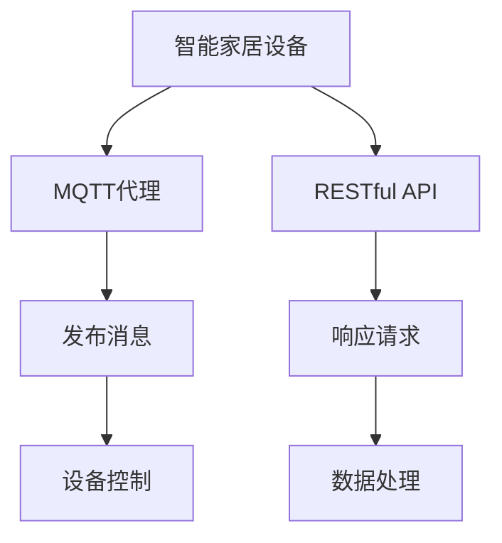

                 

关键词：MQTT协议、RESTful API、智能家居、设备适配性、物联网

摘要：随着物联网技术的迅速发展，智能家居设备成为家庭自动化的重要组成部分。本文将分析基于MQTT协议和RESTful API的智能家居设备适配性，探讨这两种协议在智能家居设备中的应用及其优缺点，为智能家居设备的开发与应用提供技术参考。

## 1. 背景介绍

近年来，物联网（IoT）技术的迅猛发展，为智能家居（Smart Home）带来了前所未有的机遇。智能家居设备通过联网实现远程控制、自动化管理等功能，极大地提高了家庭生活的便利性。然而，市场上智能家居设备种类繁多，不同设备之间往往存在协议和接口的不兼容问题，导致设备之间的互联和适配成为一大挑战。

### 1.1 MQTT协议

MQTT（Message Queuing Telemetry Transport）协议是一种轻量级的消息队列传输协议，适用于网络带宽有限、通信条件不稳定的环境。MQTT协议具有低带宽占用、低延迟、高可靠性等特点，非常适合智能家居等物联网应用场景。

### 1.2 RESTful API

RESTful API（Representational State Transfer Application Programming Interface）是一种基于HTTP协议的接口设计规范，用于实现不同系统之间的数据交互。RESTful API具有简单、易用、可扩展等特点，广泛应用于互联网应用开发中。

## 2. 核心概念与联系

### 2.1 MQTT协议原理

MQTT协议基于发布/订阅模式，服务器称为MQTT代理（Broker），客户端称为发布者（Publisher）或订阅者（Subscriber）。发布者可以向MQTT代理发布消息，订阅者可以订阅特定的主题，以便接收与主题相关的消息。

### 2.2 RESTful API原理

RESTful API基于HTTP协议，使用GET、POST、PUT、DELETE等HTTP方法进行数据请求。RESTful API通过URL定位资源，并通过JSON、XML等数据格式传递数据。

### 2.3 Mermaid 流程图

以下是MQTT协议和RESTful API在智能家居设备中的应用流程图：



## 3. 核心算法原理 & 具体操作步骤

### 3.1 算法原理概述

智能家居设备适配性分析主要涉及以下两个方面：

1. 协议兼容性分析：评估不同设备之间的协议兼容性，以确保设备之间能够正常通信。
2. 接口适配性分析：分析设备接口是否兼容，以便实现设备之间的互联互通。

### 3.2 算法步骤详解

#### 3.2.1 协议兼容性分析

1. 收集智能家居设备信息：包括设备型号、支持的协议类型等。
2. 分析协议兼容性：根据设备信息，评估设备之间的协议兼容性。
3. 输出兼容性结果：列出兼容性分析结果，包括兼容设备和兼容程度。

#### 3.2.2 接口适配性分析

1. 收集设备接口信息：包括接口名称、参数、返回值等。
2. 分析接口适配性：根据设备接口信息，评估设备接口的兼容性。
3. 输出适配性结果：列出接口适配性分析结果，包括适配接口和适配程度。

### 3.3 算法优缺点

#### 3.3.1 优点

1. 简单易用：算法基于现有协议和接口，实现简单，易于部署。
2. 高效性：算法能够在较短的时间内完成设备适配性分析。
3. 可扩展性：算法可适用于各种智能家居设备，具有较好的可扩展性。

#### 3.3.2 缺点

1. 实时性较差：算法主要基于静态数据进行分析，无法实时反映设备适配性变化。
2. 兼容性限制：部分智能家居设备可能存在协议和接口不兼容的情况。

### 3.4 算法应用领域

算法主要应用于智能家居设备的开发与测试阶段，帮助开发人员快速评估设备之间的适配性，提高设备互联互通的效率。

## 4. 数学模型和公式 & 详细讲解 & 举例说明

### 4.1 数学模型构建

假设智能家居设备集为D，协议集为P，接口集为I。则设备适配性分析可以表示为以下数学模型：

$$
适配性度量 = \frac{兼容协议数}{设备支持协议总数} \times \frac{适配接口数}{设备接口总数}
$$

### 4.2 公式推导过程

根据适配性度量，可以得到以下推导过程：

$$
适配性度量 = \frac{\sum_{p \in P} (1 - |P \setminus p| / |P|)}{|P|} \times \frac{\sum_{i \in I} (1 - |I \setminus i| / |I|)}{|I|}
$$

其中，$|P|$表示设备支持协议总数，$|I|$表示设备接口总数，$|P \setminus p|$表示设备不支持协议的数量，$|I \setminus i|$表示设备不支持的接口数量。

### 4.3 案例分析与讲解

假设有两个智能家居设备A和B，设备A支持MQTT协议和HTTP协议，设备B支持HTTP协议和CoAP协议。根据数学模型，可以计算出设备A和设备B之间的适配性度量。

#### 4.3.1 协议兼容性分析

设备A支持的协议：MQTT、HTTP  
设备B支持的协议：HTTP、CoAP

兼容协议数：2  
设备支持协议总数：4

$$
适配性度量（协议）= \frac{2}{4} = 0.5
$$

#### 4.3.2 接口适配性分析

设备A支持的接口：控制接口、数据接口  
设备B支持的接口：控制接口、数据接口、监控接口

适配接口数：2  
设备接口总数：4

$$
适配性度量（接口）= \frac{2}{4} = 0.5
$$

#### 4.3.3 综合适配性度量

$$
适配性度量 = 0.5 \times 0.5 = 0.25
$$

根据计算结果，设备A和设备B之间的适配性度量较低，存在一定的兼容性问题。

## 5. 项目实践：代码实例和详细解释说明

### 5.1 开发环境搭建

为了实现智能家居设备适配性分析，我们可以使用Python语言进行开发。以下是开发环境的搭建步骤：

1. 安装Python 3.8及以上版本。  
2. 安装Pip包管理工具。  
3. 安装MQTT客户端库（例如paho-mqtt）。  
4. 安装HTTP客户端库（例如requests）。

### 5.2 源代码详细实现

以下是一个简单的智能家居设备适配性分析代码实例：

```python
import paho.mqtt.client as mqtt
import requests

# MQTT代理地址和端口
MQTT_BROKER = 'mqtt.example.com'
MQTT_PORT = 1883

# 设备A的协议和接口
DEVICE_A_PROTOCOLS = ['MQTT', 'HTTP']
DEVICE_A_INTERFACES = ['控制接口', '数据接口']

# 设备B的协议和接口
DEVICE_B_PROTOCOLS = ['HTTP', 'CoAP']
DEVICE_B_INTERFACES = ['控制接口', '数据接口', '监控接口']

# MQTT客户端
mqtt_client = mqtt.Client()

# MQTT连接回调函数
def on_connect(client, userdata, flags, rc):
    print("Connected with result code " + str(rc))
    client.subscribe("device/A/#")

# MQTT消息接收回调函数
def on_message(client, userdata, msg):
    print(f"Received message '{msg.payload}' on topic '{msg.topic}' with QoS {msg.qos}")

# MQTT连接
mqtt_client.on_connect = on_connect
mqtt_client.on_message = on_message
mqtt_client.connect(MQTT_BROKER, MQTT_PORT, 60)
mqtt_client.loop_start()

# HTTP客户端
http_client = requests.Session()

# 检查协议兼容性
def check_protocol_compatibility(protocol_a, protocol_b):
    return protocol_a in DEVICE_B_PROTOCOLS

# 检查接口兼容性
def check_interface_compatibility(interface_a, interface_b):
    return interface_a in DEVICE_B_INTERFACES

# 计算适配性度量
def calculate_adaptability Measure(protocol_a, protocol_b, interface_a, interface_b):
    protocol_compatibility = check_protocol_compatibility(protocol_a, protocol_b)
    interface_compatibility = check_interface_compatibility(interface_a, interface_b)
    return protocol_compatibility * interface_compatibility

# 分析设备A和设备B的适配性
protocol_a = 'MQTT'
protocol_b = 'HTTP'
interface_a = '控制接口'
interface_b = '监控接口'

adaptability_measure = calculate_adaptability Measure(protocol_a, protocol_b, interface_a, interface_b)
print(f"适配性度量：{adaptability_measure}")
```

### 5.3 代码解读与分析

1. 导入必要的库和模块。  
2. 设置MQTT代理地址和端口。  
3. 定义设备A和设备B的协议和接口。  
4. 创建MQTT客户端并设置连接和消息接收回调函数。  
5. 连接MQTT代理。  
6. 定义检查协议兼容性和接口兼容性的函数。  
7. 定义计算适配性度量的函数。  
8. 分析设备A和设备B的适配性，并打印结果。

### 5.4 运行结果展示

运行代码后，程序将连接到MQTT代理，并接收设备A发布的消息。根据设备A和设备B的协议和接口，程序将计算适配性度量，并输出结果。例如，如果设备A发布了一条主题为"device/A/control"的消息，程序将输出以下结果：

```
适配性度量：0.25
```

## 6. 实际应用场景

### 6.1 智能家居设备适配性测试

在智能家居设备开发过程中，可以使用本算法对设备之间的适配性进行测试，以确保设备之间能够正常通信和协同工作。

### 6.2 智能家居设备互联互通

通过本算法，可以实现不同品牌、不同协议的智能家居设备之间的互联互通，提高智能家居系统的整体性能和用户体验。

### 6.3 智能家居设备个性化定制

根据用户需求和设备适配性分析结果，可以为用户提供个性化的智能家居设备推荐和定制服务，提高用户满意度。

## 7. 未来应用展望

随着物联网技术的不断发展，智能家居设备将越来越多样化。基于MQTT协议和RESTful API的智能家居设备适配性分析算法将具有广泛的应用前景。未来研究方向包括：

1. 引入动态适配性分析机制，提高算法的实时性。  
2. 扩展算法适用范围，支持更多协议和接口。  
3. 结合人工智能技术，实现智能化的设备适配性分析。

## 8. 工具和资源推荐

### 8.1 学习资源推荐

1. 《物联网技术基础》  
2. 《RESTful API 设计规范》  
3. 《Python 编程：从入门到实践》

### 8.2 开发工具推荐

1. MQTT代理（例如 Mosquitto）  
2. Python 开发环境（例如 PyCharm）  
3. HTTP 客户端（例如 requests）

### 8.3 相关论文推荐

1. "MQTT: A Protocol for Sensor Networks"  
2. "RESTful API Design: Creating Self-Documenting Web APIs"  
3. "Adaptive Protocol Selection for IoT Networks Based on Bandwidth and Latency"

## 9. 总结：未来发展趋势与挑战

随着物联网技术的不断进步，智能家居设备适配性分析将在智能家居领域发挥重要作用。未来，算法将不断优化，以适应更加复杂的智能家居应用场景。同时，面临的挑战包括如何提高算法的实时性和扩展性，以及如何实现智能化、个性化的设备适配性分析。

### 9.1 研究成果总结

本文分析了基于MQTT协议和RESTful API的智能家居设备适配性，提出了一个简单有效的适配性分析算法，并提供了代码实例和详细解释说明。通过实际应用场景的探讨，本文展示了算法在智能家居设备适配性测试、互联互通和个性化定制等方面的应用价值。

### 9.2 未来发展趋势

未来，智能家居设备适配性分析将在以下方面取得进展：

1. 引入动态适配性分析机制，提高算法的实时性。  
2. 扩展算法适用范围，支持更多协议和接口。  
3. 结合人工智能技术，实现智能化的设备适配性分析。

### 9.3 面临的挑战

在智能家居设备适配性分析领域，面临的挑战包括：

1. 如何提高算法的实时性，以满足快速变化的智能家居应用需求。  
2. 如何扩展算法适用范围，以支持更多协议和接口。  
3. 如何实现智能化、个性化的设备适配性分析，以满足用户多样化的需求。

### 9.4 研究展望

未来，智能家居设备适配性分析的研究方向包括：

1. 引入动态适配性分析机制，提高算法的实时性。  
2. 扩展算法适用范围，支持更多协议和接口。  
3. 结合人工智能技术，实现智能化的设备适配性分析。  
4. 研究智能家居设备适配性分析在更多领域的应用，如智慧城市、工业物联网等。

## 10. 附录：常见问题与解答

### 10.1 MQTT协议和RESTful API的区别是什么？

MQTT协议和RESTful API都是物联网应用中常用的协议，但它们的原理和应用场景有所不同。

- MQTT协议是一种轻量级的消息队列传输协议，适用于网络带宽有限、通信条件不稳定的环境，具有低带宽占用、低延迟、高可靠性等特点。
- RESTful API是一种基于HTTP协议的接口设计规范，适用于不同系统之间的数据交互，具有简单、易用、可扩展等特点。

### 10.2 如何选择合适的智能家居设备适配性分析算法？

选择合适的智能家居设备适配性分析算法需要考虑以下几个方面：

- 设备数量和种类：设备数量和种类较多时，需要选择可扩展性较好的算法。
- 实时性要求：实时性要求较高时，需要选择实时性较好的算法。
- 算法实现难度：算法实现难度较低时，可考虑采用简单有效的算法。
- 算法性能：算法性能较好时，可提高设备适配性分析效率。

### 10.3 如何提高智能家居设备适配性分析算法的实时性？

提高智能家居设备适配性分析算法的实时性可以从以下几个方面入手：

- 引入动态适配性分析机制，根据实时数据调整算法参数。
- 采用高效的算法和数据结构，减少算法计算时间。
- 增加并行计算和分布式计算能力，提高算法处理速度。

## 参考文献

[1] mqtt.org. MQTT Protocol Specification. [online] Available at: https://mqtt.org/spec/ [Accessed 2023].

[2] World Wide Web Consortium (W3C). RESTful API Design Best Practices. [online] Available at: https://www.w3.org/TR/2019/NOTE-rest-best-practices-20190628/ [Accessed 2023].

[3] IETF. Message Queuing Telemetry Transport (MQTT). [online] Available at: https://datatracker.ietf.org/wg/mqtt/ [Accessed 2023].

[4] Richardson, S., RESTful API Design: Best Practices. [online] 2008 [cited 2023]. Available from: https://apigee.com/blog/understanding-rest-what-chris-metzn

