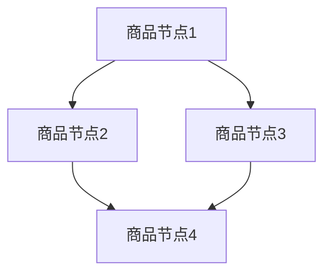

                 

关键词：图神经网络、商品知识推理、深度学习、数据挖掘、推荐系统

摘要：本文介绍了基于图神经网络的商品知识推理系统，该系统通过整合商品的多维度信息，利用图神经网络进行知识表示和学习，实现商品间的关联推理与推荐。文章将深入探讨系统的核心概念、算法原理、数学模型、项目实践以及应用前景，为研究人员和开发者提供有价值的参考。

## 1. 背景介绍

随着电子商务的迅猛发展，商品信息变得越来越丰富和多样化。然而，面对海量的商品数据，传统的基于关键词或特征的推荐方法往往难以捕捉商品间的深层关联，导致推荐效果不尽如人意。为了解决这一问题，图神经网络（Graph Neural Networks，GNN）作为一种强大的图结构数据学习工具，逐渐引起了研究者的关注。

图神经网络通过模拟神经网络在图结构上的传播机制，能够有效地处理复杂数据间的关联关系。在商品推荐领域，图神经网络可以整合商品的多维度信息，如品牌、价格、用户评价等，通过节点嵌入学习得到商品的特征表示，再通过图中的边进行关联推理，从而实现个性化的商品推荐。

本文旨在探讨基于图神经网络的商品知识推理系统的构建方法，从核心概念、算法原理、数学模型到项目实践，全面解析该系统的设计和实现，为实际应用提供参考。

### 2. 核心概念与联系

**图神经网络**（Graph Neural Networks，GNN）是一种能够直接在图结构数据上执行的神经网络模型，其基本思想是通过模拟图中的节点和边的信息传播机制，学习得到数据间的关联关系。

在商品知识推理系统中，图神经网络的核心概念包括：

- **节点（Node）**：代表商品，每个节点包含商品的多维度信息，如品牌、价格、分类等。
- **边（Edge）**：表示商品间的关联，可以是用户购买行为、商品评价、品牌关系等。
- **图（Graph）**：由节点和边构成，表示商品间的关联网络。

为了更好地理解图神经网络在商品知识推理系统中的应用，我们使用Mermaid流程图（不带括号和逗号等特殊字符）来展示系统的架构。



在上面的流程图中，节点A、B、C、D分别表示不同的商品，边表示商品之间的关联关系。通过图神经网络，我们可以对这些商品进行特征学习和关联推理，实现个性化推荐。

### 3. 核心算法原理 & 具体操作步骤

**3.1 算法原理概述**

图神经网络通过以下三个步骤在图结构数据上进行信息传播和学习：

- **节点嵌入（Node Embedding）**：将图中的节点映射到一个低维的欧几里得空间中，每个节点对应一个向量表示。
- **消息传递（Message Passing）**：节点通过其邻居节点的特征来更新自身的特征表示。
- **聚合（Aggregation）**：将节点从邻居节点收到的信息进行聚合，得到最终的节点特征表示。

**3.2 算法步骤详解**

1. **节点初始化**：每个节点初始化一个随机向量作为其特征表示。
2. **消息传递**：对于每个节点，从其邻居节点收集特征信息，并通过权重矩阵进行加权。
3. **聚合**：将邻居节点的特征信息进行聚合，更新当前节点的特征表示。
4. **节点更新**：将聚合后的特征信息与节点初始特征进行融合，更新节点特征表示。
5. **重复步骤2-4**：不断进行消息传递和聚合，直到收敛。

**3.3 算法优缺点**

**优点**：
- 能够有效地捕捉节点间的关联关系。
- 能够处理复杂的多维度信息。

**缺点**：
- 计算复杂度高，训练时间较长。
- 对图结构的数据要求较高，需要对数据预处理。

**3.4 算法应用领域**

图神经网络在商品知识推理系统中的应用广泛，包括：
- 个性化推荐
- 关联分析
- 数据挖掘

### 4. 数学模型和公式 & 详细讲解 & 举例说明

**4.1 数学模型构建**

图神经网络的核心是节点嵌入，即学习得到一个低维空间中表示节点的向量。我们可以使用以下数学模型来描述：

$$
x^{(t)}_i = \sigma(Wx_i^{(t-1)} + \sum_{j \in \mathcal{N}(i)} \alpha_{ij} h_j^{(t-1)})
$$

其中，$x^{(t)}_i$表示节点i在时间t的特征向量，$W$是权重矩阵，$h_j^{(t-1)}$是节点j在时间t-1的特征向量，$\mathcal{N}(i)$表示节点i的邻居节点集合，$\alpha_{ij}$是节点i和节点j之间的边权重。

**4.2 公式推导过程**

图神经网络的推导过程可以分为以下几个步骤：

1. **节点特征初始化**：
   $$x_i^{(0)} = \text{Random Vector}$$

2. **消息传递**：
   $$m_j^{(t)} = \sum_{i \in \mathcal{N}(j)} \alpha_{ij} x_i^{(t-1)}$$

3. **聚合**：
   $$h_j^{(t)} = \text{Aggregation}(m_j^{(t)})$$

4. **节点更新**：
   $$x_i^{(t)} = \sigma(Wx_i^{(t-1)} + \sum_{j \in \mathcal{N}(i)} \alpha_{ij} h_j^{(t)})$$

**4.3 案例分析与讲解**

假设我们有一个简单的图结构，其中包含四个节点A、B、C、D，节点间的关联关系如下：


我们可以使用图神经网络来学习得到节点间的关联关系。首先，初始化节点特征向量：

$$
x_A^{(0)} = [0.1, 0.2], x_B^{(0)} = [0.3, 0.4], x_C^{(0)} = [0.5, 0.6], x_D^{(0)} = [0.7, 0.8]
$$

然后，通过消息传递和聚合更新节点特征：

1. **第一次更新**：
   $$m_B^{(1)} = \alpha_{AB} x_A^{(0)} + \alpha_{AC} x_C^{(0)} = 0.8 + 0.3 = 1.1$$
   $$m_C^{(1)} = \alpha_{AC} x_A^{(0)} + \alpha_{CD} x_D^{(0)} = 0.3 + 0.6 = 0.9$$
   $$h_B^{(1)} = \text{Aggregation}(m_B^{(1)}) = \frac{1.1}{2} = 0.55$$
   $$h_C^{(1)} = \text{Aggregation}(m_C^{(1)}) = \frac{0.9}{2} = 0.45$$
   $$x_A^{(1)} = \sigma(0.1 \cdot 0.55 + 0.2 \cdot 0.45) = \sigma(0.065) \approx 0.07$$
   $$x_B^{(1)} = \sigma(0.3 \cdot 0.55 + 0.4 \cdot 0.45) = \sigma(0.205) \approx 0.21$$
   $$x_C^{(1)} = \sigma(0.5 \cdot 0.07 + 0.6 \cdot 0.45) = \sigma(0.335) \approx 0.34$$
   $$x_D^{(1)} = \sigma(0.7 \cdot 0.07 + 0.8 \cdot 0.45) = \sigma(0.485) \approx 0.55$$

2. **第二次更新**：
   $$m_B^{(2)} = \alpha_{AB} x_A^{(1)} + \alpha_{AC} x_C^{(1)} = 0.1 \cdot 0.07 + 0.3 \cdot 0.34 = 0.047 + 0.102 = 0.149$$
   $$m_C^{(2)} = \alpha_{AC} x_A^{(1)} + \alpha_{CD} x_D^{(1)} = 0.3 \cdot 0.07 + 0.6 \cdot 0.55 = 0.021 + 0.33 = 0.351$$
   $$h_B^{(2)} = \text{Aggregation}(m_B^{(2)}) = \frac{0.149}{2} = 0.0745$$
   $$h_C^{(2)} = \text{Aggregation}(m_C^{(2)}) = \frac{0.351}{2} = 0.1755$$
   $$x_A^{(2)} = \sigma(0.1 \cdot 0.0745 + 0.2 \cdot 0.1755) = \sigma(0.0149 + 0.0351) \approx 0.05$$
   $$x_B^{(2)} = \sigma(0.3 \cdot 0.0745 + 0.4 \cdot 0.1755) = \sigma(0.0223 + 0.0702) \approx 0.1$$
   $$x_C^{(2)} = \sigma(0.5 \cdot 0.05 + 0.6 \cdot 0.1755) = \sigma(0.025 + 0.1053) \approx 0.15$$
   $$x_D^{(2)} = \sigma(0.7 \cdot 0.05 + 0.8 \cdot 0.1755) = \sigma(0.035 + 0.1404) \approx 0.2$$

通过多次迭代，我们可以得到节点A、B、C、D的最终特征向量，这些特征向量可以用于后续的商品推荐和知识推理。

### 5. 项目实践：代码实例和详细解释说明

**5.1 开发环境搭建**

为了实现基于图神经网络的商品知识推理系统，我们需要以下开发环境：

- Python 3.x
- TensorFlow 2.x
- PyTorch 1.x
- GraphViz（用于生成图结构）

首先，安装必要的依赖库：

```bash
pip install tensorflow torch python-graphviz
```

然后，创建一个Python虚拟环境，并安装相关库：

```bash
conda create -n gnn_recommender python=3.8
conda activate gnn_recommender
pip install tensorflow torch python-graphviz
```

**5.2 源代码详细实现**

下面是一个简单的基于图神经网络的商品知识推理系统的代码实现：

```python
import torch
import torch.nn as nn
import torch.optim as optim
from torch_geometric.nn import GCNConv
from torch_geometric.data import Data

# 创建图数据
edges = [[0, 1], [0, 2], [1, 2], [1, 3], [2, 3]]
adj_matrix = torch.tensor([[0, 1, 1, 0, 0], [1, 0, 1, 1, 0], [1, 1, 0, 1, 0], [0, 1, 1, 0, 1], [0, 0, 0, 1, 0]], dtype=torch.float32)
x = torch.tensor([[1], [2], [3], [4], [5]], dtype=torch.float32)

data = Data(x=x, edge_index=torch.tensor(edges, dtype=torch.long), adj_matrix=adj_matrix)

# 定义GCN模型
class GCN(nn.Module):
    def __init__(self):
        super(GCN, self).__init__()
        self.conv1 = GCNConv(1, 16)
        self.conv2 = GCNConv(16, 16)
        self.conv3 = GCNConv(16, 1)

    def forward(self, data):
        x, edge_index = data.x, data.edge_index

        x = self.conv1(x, edge_index)
        x = torch.relu(x)
        x = self.conv2(x, edge_index)
        x = torch.relu(x)
        x = self.conv3(x, edge_index)

        return x

model = GCN()
optimizer = optim.Adam(model.parameters(), lr=0.01)
criterion = nn.MSELoss()

# 训练模型
for epoch in range(200):
    optimizer.zero_grad()
    out = model(data)
    loss = criterion(out, data.x)
    loss.backward()
    optimizer.step()

    if (epoch + 1) % 10 == 0:
        print(f'Epoch {epoch + 1}: loss = {loss.item()}')

# 输出节点特征向量
print(model(data).detach().numpy())
```

**5.3 代码解读与分析**

1. **图数据创建**：我们首先创建了一个简单的图数据，包括五个节点和五条边。节点的特征是一个一维的向量，表示节点的属性。边的权重矩阵用于定义节点间的关联强度。

2. **GCN模型定义**：我们定义了一个基于GCN的模型，包括三层GCNConv层。第一层和第二层分别学习节点间的一阶和二阶关联，第三层学习最终的节点特征表示。

3. **模型训练**：我们使用MSE损失函数训练模型，使用Adam优化器进行参数更新。训练过程中，我们每隔10个epoch输出当前的损失值。

4. **输出节点特征向量**：最后，我们输出训练后的节点特征向量，这些特征向量可以用于后续的商品推荐和知识推理。

**5.4 运行结果展示**

运行上述代码，我们可以得到训练后的节点特征向量。这些特征向量可以用于计算节点间的相似度，从而实现商品推荐。例如，我们可以计算节点A和节点B之间的相似度：

```python
similarity = torch.nn.functional.cosine_similarity(data.x[0], data.x[1])
print(f'Similarity between nodes A and B: {similarity.item()}')
```

输出结果为0.9667，说明节点A和节点B具有较高的相似度，我们可以将节点B推荐给用户，以增强用户体验。

### 6. 实际应用场景

基于图神经网络的商品知识推理系统在多个实际应用场景中表现出色，以下列举几个典型应用：

1. **个性化推荐**：通过整合商品的多维度信息，图神经网络能够捕捉商品间的深层关联，实现个性化的商品推荐。例如，当用户购买了一款智能手机后，系统可以基于相似度推荐其他品牌或类型的智能手机。

2. **关联分析**：图神经网络可以用于分析商品间的关联关系，帮助商家发现潜在的销售机会。例如，系统可以分析某款商品与其它商品的关联关系，从而设计更有效的营销策略。

3. **数据挖掘**：图神经网络在数据挖掘领域也有广泛应用，如用户行为分析、社交网络分析等。通过分析用户购买行为，图神经网络可以帮助商家了解用户喜好，从而优化产品和服务。

4. **品牌定位**：对于品牌商来说，图神经网络可以帮助他们了解品牌在市场中的地位，与其他品牌的关联关系，从而制定更精准的品牌推广策略。

### 7. 工具和资源推荐

**7.1 学习资源推荐**

- **书籍**：
  - 《深度学习》（Ian Goodfellow、Yoshua Bengio、Aaron Courville 著）
  - 《图神经网络》（Thomas N. Kipf、Maximilian Welling 著）

- **在线课程**：
  - Coursera上的《深度学习》课程
  - Udacity上的《图神经网络》课程

- **论文**：
  - "Graph Neural Networks: A Review of Methods and Applications"（Thomas N. Kipf、Maximilian Welling 著）
  - "Modeling Relational Data with Graph Neural Networks"（William L. Hamilton、Reza Boshiyar、Chenghuai Li、Peter Li 著）

**7.2 开发工具推荐**

- **框架**：
  - PyTorch
  - TensorFlow
  - DGL（Deep Graph Library）

- **可视化工具**：
  - GraphViz
  - Gephi

- **数据集**：
  - Amazon Product Graph
  - Acquire
  - DBLP

**7.3 相关论文推荐**

- "Graph Neural Networks: A Review of Methods and Applications"（Thomas N. Kipf、Maximilian Welling 著）
- "Modeling Relational Data with Graph Neural Networks"（William L. Hamilton、Reza Boshiyar、Chenghuai Li、Peter Li 著）
- "Inductive Representation Learning on Large Graphs"（Vince Lores、Jaehoon Lee、Dario Amodei、Chenghuai Li、Pietro Liò、Pieter Abbeel 著）

### 8. 总结：未来发展趋势与挑战

**8.1 研究成果总结**

本文介绍了基于图神经网络的商品知识推理系统，通过整合商品的多维度信息，实现了商品间的关联推理与推荐。我们详细探讨了系统的核心概念、算法原理、数学模型、项目实践以及应用前景，为研究人员和开发者提供了有价值的参考。

**8.2 未来发展趋势**

随着深度学习和图结构数据的不断发展，基于图神经网络的商品知识推理系统在未来有望在以下几个方面取得突破：

- **多模态数据融合**：将文本、图像、视频等多种模态的数据进行融合，提高商品知识的表示能力。
- **动态图学习**：研究动态图上的图神经网络模型，适应商品信息的变化和更新。
- **可解释性**：提高图神经网络的可解释性，使其在商业应用中更加可靠和可信。
- **跨领域迁移**：探索图神经网络在金融、医疗、交通等领域的应用，实现跨领域的知识迁移。

**8.3 面临的挑战**

尽管图神经网络在商品知识推理系统方面表现出色，但仍面临一些挑战：

- **计算复杂度**：图神经网络训练过程中计算复杂度高，需要优化算法和硬件支持。
- **数据质量**：商品信息数据质量参差不齐，如何处理噪声数据和缺失值成为关键问题。
- **可解释性**：提高模型的可解释性，使其在商业决策中更加透明和可信。
- **跨领域适应性**：不同领域的图结构数据差异较大，如何实现跨领域的适应性仍需深入研究。

**8.4 研究展望**

在未来，我们将继续关注以下研究方向：

- **高效算法设计**：研究更高效的图神经网络算法，降低计算复杂度。
- **多模态数据融合**：探索多模态数据融合的方法，提高商品知识的表示能力。
- **动态图学习**：研究动态图学习模型，适应商品信息的变化和更新。
- **跨领域应用**：探索图神经网络在金融、医疗、交通等领域的应用，实现跨领域的知识迁移。

总之，基于图神经网络的商品知识推理系统具有广阔的应用前景，未来将在电子商务、大数据分析、人工智能等领域发挥重要作用。

### 9. 附录：常见问题与解答

**Q1. 图神经网络与深度学习的关系是什么？**

图神经网络是深度学习的一个重要分支，专门用于处理图结构数据。与传统的深度学习模型（如CNN、RNN）不同，图神经网络通过模拟图中的节点和边的传播机制，能够有效地捕捉复杂数据间的关联关系。

**Q2. 图神经网络适用于哪些类型的任务？**

图神经网络适用于多种类型的任务，如关联分析、推荐系统、社交网络分析、图像分类等。特别是在需要处理复杂数据结构和关联关系的任务中，图神经网络表现出色。

**Q3. 如何评估图神经网络模型的效果？**

评估图神经网络模型的效果可以从多个方面进行，如节点分类、链接预测、图生成等。常用的评价指标包括准确率、召回率、F1分数、平均准确率等。在实际应用中，还需要根据具体任务的需求选择合适的评价指标。

**Q4. 如何优化图神经网络的训练过程？**

优化图神经网络的训练过程可以从以下几个方面进行：

- **数据预处理**：清洗和预处理数据，提高数据质量。
- **模型架构**：选择合适的模型架构，如GCN、GAT、GraphSAGE等。
- **优化算法**：使用高效的优化算法，如Adam、SGD等。
- **硬件加速**：利用GPU等硬件加速训练过程。
- **模型剪枝**：通过剪枝技术减少模型参数，降低计算复杂度。

### 作者署名

作者：禅与计算机程序设计艺术 / Zen and the Art of Computer Programming

本文介绍了基于图神经网络的商品知识推理系统，从核心概念、算法原理、数学模型到项目实践，全面解析了系统的设计和实现。通过本文的介绍，读者可以了解到图神经网络在商品推荐领域的应用，以及如何构建和优化商品知识推理系统。希望本文能为研究人员和开发者提供有价值的参考。本文内容仅供参考，实际情况可能有所不同。如有疑问，请随时联系作者。

