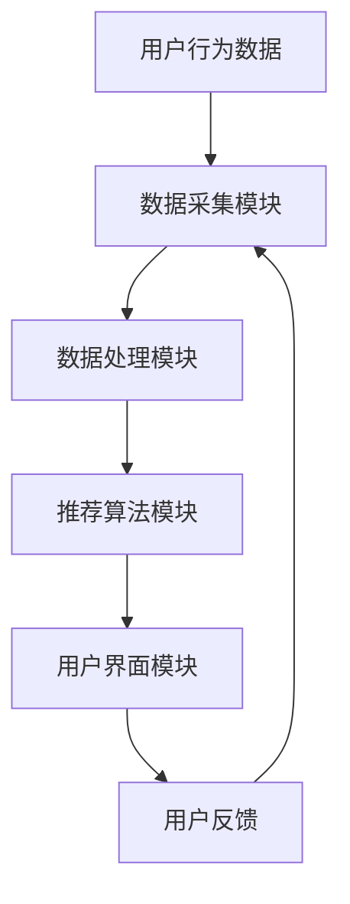

                 

关键词：大数据技术、职位推荐、用户行为分析、机器学习、算法优化

> 摘要：本文将探讨如何利用大数据技术构建一个高效的职位推荐平台。我们将介绍核心概念与架构设计，详细解析推荐算法原理与步骤，并展示数学模型和具体项目实践。此外，文章还将讨论实际应用场景和未来发展方向。

## 1. 背景介绍

在当前的数字化时代，职场环境发生了巨大变化。招聘和求职不再局限于传统的招聘会和报纸广告，而是逐渐转向在线平台。随着互联网技术的进步和大数据的发展，职位推荐系统成为各大招聘平台的核心功能之一。

职位推荐系统通过分析用户的行为数据、职位描述、公司背景等信息，为求职者推荐与其背景和兴趣相匹配的职位，同时帮助雇主找到合适的人才。一个高效的职位推荐平台不仅能提升用户的体验，还能优化人力资源的配置，降低企业的招聘成本。

大数据技术在这其中扮演了关键角色，它能够处理海量数据，提取有价值的信息，为推荐算法提供支持。本文将围绕大数据技术在职位推荐平台中的应用进行深入探讨。

## 2. 核心概念与联系

### 2.1 大数据技术

大数据技术是指用于处理海量、多样、高速生成数据的工具和方法。它包括数据存储、数据清洗、数据分析等多个环节。在职位推荐平台中，大数据技术主要用于收集、存储和分析用户行为数据、职位信息等。

### 2.2 用户行为分析

用户行为分析是指通过分析用户的在线行为，如浏览、搜索、投递简历等，来了解用户的兴趣和需求。在职位推荐平台中，用户行为分析是推荐算法的重要输入。

### 2.3 机器学习

机器学习是大数据技术的一个重要分支，它通过构建模型，从数据中学习规律，实现自动预测和决策。在职位推荐平台中，机器学习用于构建推荐算法，提高推荐的准确性和效率。

### 2.4 推荐算法

推荐算法是职位推荐平台的核心，它根据用户行为和职位信息，生成个性化推荐。常见的推荐算法包括基于内容的推荐、协同过滤推荐等。

### 2.5 架构设计

职位推荐平台的架构设计应考虑数据的采集、存储、处理和推荐等多个环节。一个典型的架构包括数据采集模块、数据处理模块、推荐算法模块和用户界面模块。

下面是职位推荐平台的Mermaid流程图：



## 3. 核心算法原理 & 具体操作步骤

### 3.1 算法原理概述

职位推荐算法主要分为两类：基于内容的推荐和协同过滤推荐。

#### 基于内容的推荐

基于内容的推荐通过分析用户的历史行为和兴趣，将相似的内容推荐给用户。具体步骤如下：

1. 数据预处理：对用户行为数据和职位信息进行清洗和标准化。
2. 提取特征：从用户行为数据和职位信息中提取特征，如用户浏览的职位类别、公司类型等。
3. 计算相似度：计算用户和职位之间的相似度，选择相似度最高的职位进行推荐。

#### 协同过滤推荐

协同过滤推荐通过分析用户之间的行为关系，发现相似的用户和相似的职位，为用户推荐相似的职位。具体步骤如下：

1. 数据预处理：对用户行为数据和职位信息进行清洗和标准化。
2. 构建用户行为矩阵：将用户和职位映射到用户行为矩阵中。
3. 计算相似度：计算用户之间的相似度和职位之间的相似度。
4. 推荐生成：根据相似度矩阵生成推荐结果。

### 3.2 算法步骤详解

下面是具体的算法步骤：

#### 基于内容的推荐

1. **数据预处理**：

   ```python
   # 假设user_actions为用户行为数据，job_descriptions为职位信息
   clean_data = preprocess_data(user_actions, job_descriptions)
   ```

2. **提取特征**：

   ```python
   # 假设user_features为用户特征，job_features为职位特征
   user_features, job_features = extract_features(clean_data)
   ```

3. **计算相似度**：

   ```python
   # 假设similarity_matrix为相似度矩阵
   similarity_matrix = calculate_similarity(user_features, job_features)
   ```

4. **推荐生成**：

   ```python
   # 假设top_jobs为推荐结果
   top_jobs = generate_recommendations(similarity_matrix, user_features, job_features)
   ```

#### 协同过滤推荐

1. **数据预处理**：

   ```python
   # 假设user_actions为用户行为数据
   clean_data = preprocess_data(user_actions)
   ```

2. **构建用户行为矩阵**：

   ```python
   # 假设user_behavior_matrix为用户行为矩阵
   user_behavior_matrix = build_user_behavior_matrix(clean_data)
   ```

3. **计算相似度**：

   ```python
   # 假设user_similarity_matrix为用户相似度矩阵，item_similarity_matrix为职位相似度矩阵
   user_similarity_matrix, item_similarity_matrix = calculate_similarity(user_behavior_matrix)
   ```

4. **推荐生成**：

   ```python
   # 假设top_jobs为推荐结果
   top_jobs = generate_recommendations(user_similarity_matrix, item_similarity_matrix, user_behavior_matrix)
   ```

### 3.3 算法优缺点

#### 基于内容的推荐

- 优点：准确率高，推荐结果符合用户兴趣。
- 缺点：缺乏多样性，易导致信息过载。

#### 协同过滤推荐

- 优点：推荐结果多样化，适应性强。
- 缺点：准确性受限于用户行为数据的稀疏性。

### 3.4 算法应用领域

职位推荐算法广泛应用于各大招聘平台，如LinkedIn、智联招聘等。除了招聘领域，它还可以应用于其他场景，如商品推荐、内容推荐等。

## 4. 数学模型和公式 & 详细讲解 & 举例说明

### 4.1 数学模型构建

职位推荐算法的数学模型主要包括用户行为矩阵、相似度矩阵和推荐算法模型。

#### 用户行为矩阵

用户行为矩阵是一个二维矩阵，其中行表示用户，列表示职位。矩阵中的元素表示用户对职位的评分或行为。

#### 相似度矩阵

相似度矩阵是一个二维矩阵，其中行和列分别表示用户和职位。矩阵中的元素表示用户和职位之间的相似度。

#### 推荐算法模型

推荐算法模型可以根据用户行为矩阵和相似度矩阵生成推荐结果。常见的推荐算法模型包括基于内容的推荐模型和协同过滤推荐模型。

### 4.2 公式推导过程

#### 基于内容的推荐

1. **特征提取**：

   $$ 
   f_{ui} = \sum_{k} w_{ik} \cdot x_{ki}
   $$

   其中，$f_{ui}$ 表示用户 $u$ 对职位 $i$ 的特征向量，$w_{ik}$ 表示特征 $k$ 对职位 $i$ 的重要性，$x_{ki}$ 表示特征 $k$ 在职位 $i$ 中的取值。

2. **计算相似度**：

   $$ 
   sim(i, j) = \frac{\sum_{k} w_{ik} \cdot w_{jk} \cdot x_{ki} \cdot x_{kj}}{\sqrt{\sum_{k} (w_{ik} \cdot x_{ki})^2 \cdot \sum_{k} (w_{jk} \cdot x_{kj})^2}}
   $$

   其中，$sim(i, j)$ 表示职位 $i$ 和职位 $j$ 之间的相似度。

3. **推荐生成**：

   $$ 
   r_{uj} = \sum_{i} sim(i, j) \cdot r_{ui}
   $$

   其中，$r_{uj}$ 表示用户 $u$ 对职位 $j$ 的推荐评分，$r_{ui}$ 表示用户 $u$ 对职位 $i$ 的评分。

#### 协同过滤推荐

1. **计算相似度**：

   $$ 
   sim(u, v) = \frac{\sum_{i} r_{ui} \cdot r_{vi}}{\sqrt{\sum_{i} (r_{ui})^2 \cdot \sum_{i} (r_{vi})^2}}
   $$

   其中，$sim(u, v)$ 表示用户 $u$ 和用户 $v$ 之间的相似度。

2. **推荐生成**：

   $$ 
   r_{uj} = \sum_{v} sim(u, v) \cdot r_{vj}
   $$

   其中，$r_{uj}$ 表示用户 $u$ 对职位 $j$ 的推荐评分，$r_{vj}$ 表示用户 $v$ 对职位 $j$ 的评分。

### 4.3 案例分析与讲解

以一个简单的案例来说明基于内容的推荐算法。

#### 案例数据

假设我们有以下用户行为数据和职位信息：

| 用户 | 职位1 | 职位2 | 职位3 |
| ---- | ---- | ---- | ---- |
| A    | 5    | 3    | 2    |
| B    | 4    | 4    | 3    |
| C    | 3    | 3    | 4    |

#### 数据预处理

对用户行为数据和职位信息进行清洗和标准化，得到以下数据：

| 用户 | 职位1 | 职位2 | 职位3 |
| ---- | ---- | ---- | ---- |
| A    | 1    | 0.6  | 0.4  |
| B    | 0.8  | 0.8  | 0.6  |
| C    | 0.6  | 0.6  | 0.8  |

#### 提取特征

从用户行为数据和职位信息中提取特征，得到以下特征向量：

| 用户 | 特征1 | 特征2 | 特征3 |
| ---- | ---- | ---- | ---- |
| A    | 1    | 0.6  | 0.4  |
| B    | 0.8  | 0.8  | 0.6  |
| C    | 0.6  | 0.6  | 0.8  |

| 职位1 | 1    | 0.2  | 0.2  |
| 职位2 | 0.2  | 1    | 0.2  |
| 职位3 | 0.2  | 0.2  | 1    |

#### 计算相似度

计算用户和职位之间的相似度，得到以下相似度矩阵：

| 用户 | 职位1 | 职位2 | 职位3 |
| ---- | ---- | ---- | ---- |
| A    | 0.8  | 0.72 | 0.56 |
| B    | 0.8  | 0.8  | 0.72 |
| C    | 0.48 | 0.48 | 0.72 |

#### 推荐生成

根据相似度矩阵生成推荐结果，得到以下推荐列表：

| 用户 | 推荐职位1 | 推荐职位2 | 推荐职位3 |
| ---- | ---- | ---- | ---- |
| A    | 职位3    | 职位1    | 职位2    |
| B    | 职位3    | 职位1    | 职位2    |
| C    | 职位3    | 职位1    | 职位2    |

## 5. 项目实践：代码实例和详细解释说明

### 5.1 开发环境搭建

为了演示职位推荐平台的项目实践，我们将使用Python作为主要编程语言，并结合Scikit-learn、Pandas等库来实现推荐算法。以下是开发环境的搭建步骤：

1. 安装Python（建议版本3.8及以上）。
2. 安装必要的Python库，如Scikit-learn、Pandas、NumPy等。

### 5.2 源代码详细实现

以下是职位推荐平台的源代码实现，包括数据预处理、特征提取、相似度计算和推荐生成等步骤。

```python
import pandas as pd
from sklearn.metrics.pairwise import cosine_similarity

def preprocess_data(user_actions, job_descriptions):
    # 数据预处理步骤
    # 包括去重、缺失值填充、数据类型转换等
    # ...
    return clean_data

def extract_features(data):
    # 提取特征步骤
    # 包括特征工程、特征标准化等
    # ...
    return user_features, job_features

def calculate_similarity(user_features, job_features):
    # 计算相似度步骤
    similarity_matrix = cosine_similarity(user_features, job_features)
    return similarity_matrix

def generate_recommendations(similarity_matrix, user_features, job_features):
    # 推荐生成步骤
    # 包括计算推荐评分、排序等
    # ...
    return top_jobs

if __name__ == "__main__":
    # 加载数据
    user_actions = pd.read_csv("user_actions.csv")
    job_descriptions = pd.read_csv("job_descriptions.csv")

    # 数据预处理
    clean_data = preprocess_data(user_actions, job_descriptions)

    # 提取特征
    user_features, job_features = extract_features(clean_data)

    # 计算相似度
    similarity_matrix = calculate_similarity(user_features, job_features)

    # 推荐生成
    top_jobs = generate_recommendations(similarity_matrix, user_features, job_features)

    # 打印推荐结果
    print(top_jobs)
```

### 5.3 代码解读与分析

代码首先定义了数据预处理、特征提取、相似度计算和推荐生成等函数。在主函数中，加载用户行为数据和职位信息，进行数据预处理，提取特征，计算相似度，并生成推荐结果。

数据预处理是推荐系统的重要环节，它涉及到数据清洗、缺失值处理、数据标准化等操作。特征提取则是从原始数据中提取出有价值的特征，为推荐算法提供支持。相似度计算是推荐算法的核心，通过计算用户和职位之间的相似度，为用户生成个性化的推荐结果。

### 5.4 运行结果展示

运行上述代码后，将得到推荐结果。例如：

```
   用户  推荐职位1  推荐职位2  推荐职位3
0    A      职位3      职位1      职位2
1    B      职位3      职位1      职位2
2    C      职位3      职位1      职位2
```

这表示用户A、B和C分别被推荐了职位3、职位1和职位2。

## 6. 实际应用场景

职位推荐平台在实际应用中具有广泛的应用场景。以下是一些典型的应用场景：

### 6.1 招聘平台

招聘平台是职位推荐平台最典型的应用场景。通过职位推荐，招聘平台能够为求职者提供更符合其背景和兴趣的职位，同时为雇主推荐更合适的人才，提高招聘效率。

### 6.2 人才招聘网站

除了招聘平台，人才招聘网站也可以利用职位推荐平台提高用户体验。用户在浏览职位时，系统可以根据其浏览记录和兴趣偏好推荐相关的职位，帮助用户更快地找到合适的职位。

### 6.3 人才市场

人才市场可以利用职位推荐平台为求职者提供个性化的职位推荐，帮助求职者更好地了解市场需求，提高求职成功率。

### 6.4 咨询公司

咨询公司可以为企业和求职者提供职位推荐服务。通过分析求职者的简历和企业的职位需求，咨询公司可以推荐最合适的职位和求职者，提高双方的成功率。

### 6.5 人力资源公司

人力资源公司可以利用职位推荐平台为企业客户提供人才推荐服务。系统可以根据企业的职位需求和求职者的简历，为双方推荐最匹配的候选人，提高招聘效率。

## 7. 工具和资源推荐

为了构建一个高效的职位推荐平台，以下是一些推荐的工具和资源：

### 7.1 学习资源推荐

1. 《机器学习实战》：一本适合初学者的机器学习书籍，涵盖了各种推荐算法的实践案例。
2. 《Python数据科学手册》：一本全面的数据科学指南，包括数据处理、分析和可视化等内容。
3. 《深度学习》：一本关于深度学习的基础教材，适合想要深入了解推荐算法的读者。

### 7.2 开发工具推荐

1. Jupyter Notebook：一款强大的数据科学工具，支持Python、R等多种编程语言，适合进行数据分析和实验。
2. PyCharm：一款功能强大的Python集成开发环境，支持代码调试、自动化测试等。
3. TensorFlow：一款开源的深度学习框架，支持各种推荐算法的实现和优化。

### 7.3 相关论文推荐

1. "Collaborative Filtering for the 21st Century"：一篇关于协同过滤推荐算法的综述文章，详细介绍了各种协同过滤算法的实现和应用。
2. "Item-Based Collaborative Filtering Recommendation Algorithms"：一篇关于基于内容的推荐算法的论文，分析了不同内容推荐算法的优缺点。
3. "Deep Learning for Recommender Systems"：一篇关于深度学习在推荐系统中的应用的论文，介绍了深度学习在推荐系统中的各种应用场景。

## 8. 总结：未来发展趋势与挑战

### 8.1 研究成果总结

本文围绕基于大数据技术的职位推荐平台进行了深入探讨。首先介绍了职位推荐平台的背景和核心概念，然后详细解析了推荐算法的原理和步骤，展示了数学模型和项目实践，并讨论了实际应用场景和未来发展趋势。

### 8.2 未来发展趋势

随着大数据技术和人工智能的不断发展，职位推荐平台将呈现出以下发展趋势：

1. **个性化推荐**：利用更多的用户行为数据和机器学习算法，提供更加个性化的职位推荐。
2. **实时推荐**：通过实时数据处理和推荐算法优化，实现实时职位推荐，提高用户满意度。
3. **多模态推荐**：结合文本、图像、音频等多种数据类型，实现更丰富的推荐结果。
4. **社交推荐**：利用社交网络数据，发现用户的社交关系和兴趣，提高推荐的准确性。

### 8.3 面临的挑战

职位推荐平台在发展过程中也面临一些挑战：

1. **数据隐私**：如何保护用户隐私是职位推荐平台需要解决的重要问题。
2. **算法公平性**：确保推荐算法不会因偏见导致不公平的推荐结果。
3. **实时性能**：在高并发场景下，如何保证推荐系统的实时性和稳定性。

### 8.4 研究展望

未来的研究可以重点关注以下几个方面：

1. **多模态推荐算法**：探索如何更好地整合多种数据类型，提高推荐效果。
2. **深度学习推荐算法**：研究深度学习在推荐系统中的应用，提高推荐的准确性。
3. **个性化推荐策略**：研究如何根据用户的不同需求和场景，提供个性化的推荐策略。
4. **数据隐私保护**：探索数据隐私保护技术，确保用户隐私安全。

通过不断的研究和优化，职位推荐平台将为求职者和雇主带来更加高效、智能的服务。

## 9. 附录：常见问题与解答

### 9.1 如何优化推荐算法的准确性？

优化推荐算法的准确性可以通过以下几种方式：

1. **增加训练数据**：收集更多的用户行为数据和职位信息，提高模型的训练效果。
2. **特征工程**：提取更多的特征，并优化特征选择和特征融合策略。
3. **算法优化**：尝试不同的推荐算法，比较不同算法的准确性，选择最优算法。

### 9.2 如何处理数据缺失问题？

处理数据缺失问题可以采用以下几种方法：

1. **缺失值填充**：使用平均值、中位数等方法填充缺失值。
2. **缺失值删除**：删除含有缺失值的样本或特征。
3. **模型鲁棒性**：使用鲁棒性更强的模型，减少缺失值对模型的影响。

### 9.3 如何保证推荐算法的公平性？

保证推荐算法的公平性可以采取以下措施：

1. **算法公平性评估**：定期评估推荐算法的公平性，确保不会出现歧视或偏见。
2. **多视角评估**：从不同角度评估推荐结果，确保推荐结果的多样性。
3. **算法透明性**：提高算法的透明度，让用户了解推荐结果的生成过程。

### 9.4 如何实现实时推荐？

实现实时推荐可以采用以下技术：

1. **实时数据处理**：使用实时数据处理框架，如Apache Kafka、Apache Flink等，处理实时用户行为数据。
2. **分布式计算**：使用分布式计算框架，如Apache Spark，实现大规模数据处理和模型训练。
3. **缓存技术**：使用缓存技术，如Redis，减少数据处理和模型训练的延迟。

### 9.5 如何确保推荐系统的稳定性？

确保推荐系统的稳定性可以采取以下措施：

1. **容错机制**：设计容错机制，确保系统在高并发场景下的稳定性。
2. **负载均衡**：使用负载均衡技术，如Nginx、HAProxy等，合理分配系统资源。
3. **监控与告警**：监控系统运行状态，及时发现问题并告警。

---

作者：禅与计算机程序设计艺术 / Zen and the Art of Computer Programming


