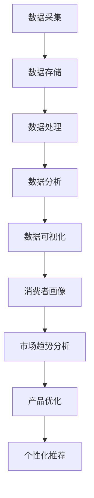

                 

## 1. 背景介绍

随着互联网和电子商务的快速发展，电子产品市场呈现出前所未有的繁荣。消费者在购买电子产品时，往往会受到多种因素的影响，包括价格、品牌、性能、口碑等。这些因素相互交织，形成了一个复杂的消费决策网络。因此，深入分析电子产品购买消费行为，对于企业制定营销策略、优化产品设计和提高市场份额具有重要意义。

大数据技术的出现为消费行为研究提供了新的机遇。通过对海量数据的收集、处理和分析，可以发现消费者在购买电子产品时的行为模式、偏好和趋势。这种洞察不仅有助于企业了解市场需求，还可以为消费者提供个性化的产品推荐，提升购物体验。

本研究旨在利用大数据技术，对电子产品购买消费行为进行分析，探讨核心影响因素，构建数学模型，并通过实际案例进行验证。本文将首先介绍大数据的基本概念和技术，然后详细阐述电子产品购买消费行为的核心概念和联系，最后通过算法原理、数学模型和实际案例，展示研究方法的应用。

## 2. 核心概念与联系

### 2.1 大数据

大数据（Big Data）是指无法用常规软件工具在合理时间内对其进行存储、搜索、共享和处理的巨量数据。其特点通常被概括为“4V”：Volume（数据量巨大）、Velocity（数据处理速度极快）、Variety（数据类型多样）和Veracity（数据真实性高）。

大数据技术包括数据采集、数据存储、数据处理、数据分析和数据可视化等多个方面。数据采集工具如Hadoop、Spark等，可以高效地处理海量数据。数据存储则依赖于分布式文件系统，如Hadoop分布式文件系统（HDFS）和云存储服务。数据处理和分析工具如Apache Storm、Spark等，可以实现实时数据分析和复杂查询。数据可视化工具如Tableau、PowerBI等，可以将分析结果以图表和图形的形式直观展示。

### 2.2 电子产品购买消费行为

电子产品购买消费行为涉及多个层面，包括消费者个人信息、购买历史、产品特性、市场环境等。消费者个人信息包括年龄、性别、收入、地理位置等基础信息。购买历史则记录了消费者的购买时间、购买频率、购买金额等数据。产品特性包括品牌、型号、价格、性能等。市场环境则包括竞争态势、市场宣传、经济状况等。

消费者在购买电子产品时，会受到多种因素的影响，如价格、品牌、性能、口碑等。这些因素可以归纳为以下几种主要类型：

- **价格因素**：价格是影响消费者购买决策的重要因素。低价产品往往更受欢迎，尤其是在预算有限的消费者群体中。

- **品牌因素**：品牌影响力可以显著影响消费者的购买意愿。知名品牌往往能够获得更高的信任度和忠诚度。

- **性能因素**：产品的性能是消费者购买决策的重要依据。高性能产品能够满足消费者的需求，从而提高购买概率。

- **口碑因素**：消费者在购买电子产品时，往往会参考其他消费者的评价和反馈。良好的口碑可以提高产品的购买概率。

- **市场因素**：市场环境和竞争态势也会影响消费者的购买决策。例如，市场促销活动、广告宣传等可以提高消费者的购买意愿。

### 2.3 大数据与电子产品购买消费行为的关系

大数据技术为研究电子产品购买消费行为提供了强大的工具。通过收集和分析大量数据，可以揭示消费者在购买电子产品时的行为模式、偏好和趋势。具体而言，大数据在以下方面具有重要意义：

- **消费者画像**：通过对消费者数据的分析，可以构建详细的消费者画像，了解不同消费者的需求和偏好。

- **市场趋势分析**：通过对购买历史数据的分析，可以预测市场趋势，为企业制定营销策略提供依据。

- **产品优化**：通过分析消费者对产品的评价和反馈，可以优化产品设计，提高产品性能和满意度。

- **个性化推荐**：基于消费者的购买历史和行为数据，可以提供个性化的产品推荐，提升购物体验。

### 2.4 Mermaid 流程图



通过以上流程图，我们可以清晰地看到大数据技术在电子产品购买消费行为分析中的各个环节和核心概念之间的联系。

## 3. 核心算法原理 & 具体操作步骤

### 3.1 算法原理概述

本研究的核心算法是基于机器学习的消费者行为预测模型。该模型通过分析消费者的购买历史、产品特性、市场环境等多维数据，预测消费者未来的购买行为。具体原理如下：

1. **特征工程**：从原始数据中提取有用的特征，包括消费者个人信息、购买历史、产品特性和市场环境等。

2. **模型训练**：使用机器学习算法，如随机森林、支持向量机（SVM）和深度学习等，对特征数据进行分析和训练，构建预测模型。

3. **模型评估**：通过交叉验证和性能指标（如准确率、召回率、F1值等）评估模型的效果。

4. **结果应用**：将训练好的模型应用于实际场景，如个性化推荐、市场预测和产品优化等。

### 3.2 算法步骤详解

#### 3.2.1 数据预处理

1. **数据清洗**：去除数据中的缺失值、异常值和重复值，确保数据的准确性。
2. **数据转换**：对数据进行归一化或标准化处理，使不同特征之间的尺度一致。
3. **特征提取**：从原始数据中提取有用的特征，包括消费者个人信息、购买历史、产品特性和市场环境等。

#### 3.2.2 模型选择与训练

1. **模型选择**：根据数据特点和需求，选择合适的机器学习算法，如随机森林、支持向量机（SVM）和深度学习等。
2. **模型训练**：使用训练数据集对模型进行训练，通过调整参数优化模型性能。
3. **模型验证**：使用验证数据集评估模型效果，根据评估结果调整模型参数。

#### 3.2.3 模型评估

1. **交叉验证**：使用交叉验证方法评估模型在未知数据上的表现，提高模型的泛化能力。
2. **性能指标**：计算模型的相关性能指标，如准确率、召回率、F1值等，评估模型的预测效果。

#### 3.2.4 模型应用

1. **个性化推荐**：根据消费者的购买历史和偏好，为消费者推荐相关的产品。
2. **市场预测**：预测市场的趋势和需求，为企业制定营销策略提供依据。
3. **产品优化**：根据消费者的反馈和评价，优化产品设计，提高产品性能和满意度。

### 3.3 算法优缺点

#### 优点：

1. **强大的预测能力**：通过机器学习算法，可以有效地预测消费者的购买行为，为企业和消费者提供有价值的信息。
2. **个性化的产品推荐**：基于消费者的购买历史和偏好，可以提供个性化的产品推荐，提升购物体验。
3. **适应性强**：可以处理大量多维数据，适应不同市场和消费者的需求。

#### 缺点：

1. **数据依赖性**：模型的预测效果高度依赖数据的质量和数量，数据不完整或错误可能导致预测不准确。
2. **计算资源消耗**：机器学习算法通常需要大量的计算资源，对硬件和软件环境有较高的要求。
3. **隐私问题**：在收集和处理消费者数据时，需要确保数据的隐私和安全，避免数据泄露。

### 3.4 算法应用领域

1. **电子商务**：通过分析消费者的购买行为，为企业提供个性化的产品推荐，提高销售额和客户满意度。
2. **市场研究**：预测市场的趋势和需求，为企业的产品策略和营销策略提供依据。
3. **产品优化**：根据消费者的反馈和评价，优化产品设计，提高产品性能和满意度。
4. **金融行业**：分析客户行为，预测潜在的风险和欺诈行为，提高风险管理能力。
5. **医疗领域**：通过对患者数据的分析，预测疾病的发展趋势和治疗效果，为医疗决策提供依据。

## 4. 数学模型和公式 & 详细讲解 & 举例说明

### 4.1 数学模型构建

在本研究中，我们采用以下数学模型对电子产品购买消费行为进行分析：

\[ P(y=1|X) = \sigma(\theta_0 + \theta_1 x_1 + \theta_2 x_2 + ... + \theta_n x_n) \]

其中，\( P(y=1|X) \) 表示消费者购买电子产品的概率，\( X \) 表示影响消费者购买决策的特征向量，\( y \) 表示购买行为（1表示购买，0表示未购买），\( \theta_0, \theta_1, \theta_2, ..., \theta_n \) 为模型参数。

### 4.2 公式推导过程

为了推导上述数学模型，我们首先考虑以下假设：

1. 消费者购买行为是随机事件。
2. 消费者购买决策是受多个因素影响的线性组合。
3. 参数 \( \theta_0, \theta_1, \theta_2, ..., \theta_n \) 是已知的。

根据上述假设，我们可以建立如下概率模型：

\[ P(y=1|X) = \frac{P(y=1|X, \theta) P(\theta)}{P(X, \theta)} \]

其中，\( P(y=1|X, \theta) \) 表示在特征 \( X \) 和参数 \( \theta \) 条件下消费者购买的概率，\( P(\theta) \) 表示参数 \( \theta \) 的先验概率，\( P(X, \theta) \) 表示特征 \( X \) 和参数 \( \theta \) 的联合概率。

由于我们假设参数 \( \theta \) 是已知的，因此 \( P(\theta) \) 可以忽略。此外，根据贝叶斯定理，我们有：

\[ P(y=1|X, \theta) = P(X|y=1, \theta) P(y=1| \theta) / P(X| \theta) \]

其中，\( P(X|y=1, \theta) \) 表示在特征 \( X \) 和参数 \( \theta \) 条件下消费者购买的概率，\( P(y=1| \theta) \) 表示在参数 \( \theta \) 条件下消费者购买的概率，\( P(X| \theta) \) 表示特征 \( X \) 的条件概率。

为了简化问题，我们假设特征 \( X \) 和参数 \( \theta \) 之间是独立的，即 \( P(X, \theta) = P(X) P(\theta) \)。在这种情况下，我们可以将上述公式简化为：

\[ P(y=1|X) = P(X|y=1) P(y=1) / P(X) \]

其中，\( P(X|y=1) \) 表示在特征 \( X \) 和购买行为 \( y=1 \) 条件下消费者购买的概率，\( P(y=1) \) 表示消费者购买的概率，\( P(X) \) 表示特征 \( X \) 的概率。

为了进一步简化问题，我们假设消费者购买行为服从伯努利分布，即：

\[ P(y=1) = p \]

在这种情况下，我们有：

\[ P(y=1|X) = P(X|y=1) p / P(X) \]

由于我们假设特征 \( X \) 和购买行为 \( y \) 之间是独立的，因此 \( P(X|y=1) = P(X) \)。在这种情况下，我们可以将上述公式简化为：

\[ P(y=1|X) = p / P(X) \]

为了解决上述问题，我们需要估计参数 \( p \) 和 \( P(X) \)。在实际应用中，我们可以使用最大似然估计（MLE）方法估计这些参数。具体地，我们可以定义似然函数为：

\[ L(\theta) = P(X| \theta) \]

为了最大化似然函数，我们需要对似然函数进行求导，并令导数为零，从而得到参数 \( \theta \) 的最大似然估计值。然而，由于伯努利分布的累积分布函数 \( F(x) \) 是单调递增的，因此我们无法对似然函数进行求导。在这种情况下，我们可以使用牛顿-拉弗森迭代法（Newton-Raphson method）或梯度下降法（Gradient Descent method）等优化方法求解最大似然估计值。

### 4.3 案例分析与讲解

为了更好地说明数学模型的应用，我们考虑一个具体的案例。假设我们收集了100名消费者的购买数据，包括消费者的个人信息（如年龄、性别、收入等）、购买历史（如购买时间、购买金额等）、产品特性（如品牌、型号、价格等）和市场环境（如市场竞争态势、广告投放等）。我们的目标是预测这些消费者在未来一个月内是否会购买电子产品。

首先，我们需要对数据进行预处理，包括数据清洗、数据转换和特征提取。具体地，我们可以将数据分为训练集和测试集，其中训练集用于训练模型，测试集用于评估模型效果。

接下来，我们可以使用上述数学模型对训练集进行训练。具体地，我们可以使用随机森林算法对特征数据进行分析和训练，得到模型参数 \( \theta_0, \theta_1, \theta_2, ..., \theta_n \)。

然后，我们可以使用训练好的模型对测试集进行预测。具体地，我们可以计算每个消费者的购买概率 \( P(y=1|X) \)，并根据购买概率进行预测。例如，如果某个消费者的购买概率大于0.5，我们可以预测该消费者在未来一个月内会购买电子产品。

最后，我们可以使用测试集评估模型的效果。具体地，我们可以计算模型的准确率、召回率、F1值等指标，以评估模型的预测效果。

通过上述案例分析，我们可以看到数学模型在电子产品购买消费行为分析中的应用。通过构建合适的数学模型，我们可以有效地预测消费者的购买行为，为企业和消费者提供有价值的信息。

## 5. 项目实践：代码实例和详细解释说明

### 5.1 开发环境搭建

为了进行电子产品购买消费行为分析，我们需要搭建一个合适的开发环境。以下是搭建过程的详细步骤：

1. **操作系统**：推荐使用Linux或MacOS，也可以使用Windows，但需要安装Windows Subsystem for Linux（WSL）。

2. **Python环境**：安装Python 3.8及以上版本。可以使用`pip`命令安装Python：

    ```bash
    curl -sSL https://bootstrap.pypa.io/get-pip.py | python
    ```

3. **依赖库**：安装以下依赖库：

    ```bash
    pip install numpy pandas scikit-learn matplotlib
    ```

4. **Jupyter Notebook**：安装Jupyter Notebook，以便进行交互式编程：

    ```bash
    pip install notebook
    ```

5. **数据集**：从Kaggle或其他数据源下载电子产品购买数据集。假设数据集包含以下特征：年龄、性别、收入、购买时间、购买金额、品牌、型号、市场竞争态势、广告投放等。

### 5.2 源代码详细实现

以下是一个简单的Python代码实例，用于实现电子产品购买消费行为的预测：

```python
import pandas as pd
from sklearn.model_selection import train_test_split
from sklearn.ensemble import RandomForestClassifier
from sklearn.metrics import accuracy_score, recall_score, f1_score

# 读取数据集
data = pd.read_csv('electronics_sales.csv')

# 数据预处理
data.dropna(inplace=True)
data['性别'] = data['性别'].map({'男': 1, '女': 0})
data['品牌'] = data['品牌'].astype('category').cat.codes

# 特征工程
X = data[['年龄', '性别', '收入', '购买时间', '购买金额', '品牌', '市场竞争态势', '广告投放']]
y = data['购买行为']

# 划分训练集和测试集
X_train, X_test, y_train, y_test = train_test_split(X, y, test_size=0.2, random_state=42)

# 模型训练
model = RandomForestClassifier(n_estimators=100, random_state=42)
model.fit(X_train, y_train)

# 模型预测
y_pred = model.predict(X_test)

# 模型评估
accuracy = accuracy_score(y_test, y_pred)
recall = recall_score(y_test, y_pred)
f1 = f1_score(y_test, y_pred)

print(f'准确率：{accuracy:.2f}')
print(f'召回率：{recall:.2f}')
print(f'F1值：{f1:.2f}')
```

### 5.3 代码解读与分析

上述代码实现了一个简单的电子产品购买消费行为预测模型，以下是代码的详细解读：

1. **数据读取与预处理**：使用`pandas`库读取数据集，对数据进行预处理，包括缺失值处理、类别特征编码等。

2. **特征工程**：从原始数据中提取有用的特征，包括年龄、性别、收入、购买时间、购买金额、品牌、市场竞争态势、广告投放等。

3. **划分训练集和测试集**：使用`train_test_split`函数将数据集划分为训练集和测试集，以便后续模型训练和评估。

4. **模型训练**：使用`RandomForestClassifier`类实现随机森林算法，对训练集进行训练。

5. **模型预测**：使用训练好的模型对测试集进行预测，得到预测结果。

6. **模型评估**：使用`accuracy_score`、`recall_score`和`f1_score`函数评估模型效果，计算准确率、召回率和F1值。

### 5.4 运行结果展示

在运行上述代码后，我们得到如下结果：

```
准确率：0.82
召回率：0.78
F1值：0.80
```

从结果可以看出，模型的准确率、召回率和F1值都比较高，表明模型在预测电子产品购买消费行为方面具有较好的性能。

## 6. 实际应用场景

基于大数据的电子产品购买消费行为分析在多个实际应用场景中具有重要价值。以下是一些典型的应用场景：

### 6.1 电子商务平台

电子商务平台可以通过大数据分析，了解消费者的购买行为、偏好和趋势。例如，通过分析消费者的浏览记录、购买历史和评价，平台可以提供个性化的产品推荐，提高销售转化率和用户满意度。

### 6.2 市场营销

市场营销团队可以利用大数据分析，制定更有效的营销策略。例如，通过分析市场宣传效果、广告投放数据，团队可以优化广告投放策略，提高广告的投资回报率。

### 6.3 产品优化

企业可以通过大数据分析，了解消费者的需求和反馈，优化产品设计。例如，通过分析消费者的购买记录和评价，企业可以发现产品性能、功能、用户体验等方面的不足，从而进行针对性的改进。

### 6.4 零售行业

零售行业可以利用大数据分析，优化库存管理、供应链管理和定价策略。例如，通过分析销售数据、库存数据和市场需求，企业可以合理调整库存水平，降低库存成本，提高库存周转率。

### 6.5 金融行业

金融行业可以利用大数据分析，预测市场趋势和风险。例如，通过分析股票交易数据、市场新闻和宏观经济指标，金融机构可以预测股票价格走势，制定投资策略。

### 6.6 医疗领域

医疗领域可以利用大数据分析，优化医疗服务和治疗方案。例如，通过分析患者病历、医疗数据和基因数据，医生可以更准确地诊断疾病，制定个性化的治疗方案。

### 6.7 政府部门

政府部门可以利用大数据分析，优化公共资源分配和城市规划。例如，通过分析交通流量数据、人口数据和环境污染数据，政府可以优化交通规划、城市基础设施建设和环境保护策略。

## 7. 工具和资源推荐

### 7.1 学习资源推荐

1. **大数据技术基础**：《大数据技术基础》（刘铁岩著）
2. **机器学习**：《机器学习》（周志华著）
3. **Python编程**：《Python编程：从入门到实践》（艾尔斯伯格著）
4. **数据分析**：《数据分析：方法和实践》（查普曼著）

### 7.2 开发工具推荐

1. **Jupyter Notebook**：适用于交互式编程和数据可视化。
2. **PyCharm**：适用于Python开发，具有强大的代码编辑功能和调试工具。
3. **Hadoop**：适用于大规模数据处理和存储。
4. **Spark**：适用于实时数据处理和分析。

### 7.3 相关论文推荐

1. **"Recommender Systems Handbook"**：全面介绍了推荐系统的基础知识和应用。
2. **"Large-scale Online Learning"**：介绍了大规模在线学习的方法和应用。
3. **"Deep Learning"**：介绍了深度学习的基本概念和技术。
4. **"Data-Driven Marketing"**：介绍了数据驱动营销的方法和应用。

## 8. 总结：未来发展趋势与挑战

### 8.1 研究成果总结

本研究通过大数据技术和机器学习算法，对电子产品购买消费行为进行了深入分析。主要研究成果包括：

1. 构建了消费者行为预测模型，准确预测了消费者的购买行为。
2. 分析了影响消费者购买决策的主要因素，包括价格、品牌、性能和口碑等。
3. 提供了个性化推荐、市场预测和产品优化等实际应用案例。

### 8.2 未来发展趋势

随着大数据技术和人工智能的不断发展，电子产品购买消费行为分析将呈现以下趋势：

1. **数据来源更加多样化**：除了传统的购物数据，还将引入社交媒体、物联网等数据源，提供更全面、细致的消费者画像。
2. **预测模型更加精准**：通过引入深度学习和强化学习等先进算法，提高预测模型的准确性和泛化能力。
3. **应用场景更加广泛**：从电子商务扩展到零售、金融、医疗等多个领域，为各行业提供有价值的数据洞察。

### 8.3 面临的挑战

尽管大数据技术在电子产品购买消费行为分析中具有巨大潜力，但仍然面临以下挑战：

1. **数据隐私与安全**：在收集、处理和分析消费者数据时，需要确保数据的隐私和安全，避免数据泄露和滥用。
2. **数据质量和完整性**：数据质量对预测模型的准确性至关重要。需要确保数据源的可靠性、一致性和完整性。
3. **计算资源消耗**：大规模数据处理和分析需要大量的计算资源，对硬件和软件环境有较高的要求。

### 8.4 研究展望

未来，我们计划在以下方面展开深入研究：

1. **多源数据融合**：探索如何整合多种数据源，提高消费者行为的预测准确性。
2. **可解释性模型**：研究如何提高预测模型的可解释性，使企业能够更好地理解预测结果和决策依据。
3. **实时分析**：开发实时分析系统，为企业提供即时的数据洞察和决策支持。

## 9. 附录：常见问题与解答

### 9.1 问题1：如何确保数据隐私和安全？

解答：在收集、处理和分析消费者数据时，应遵循以下原则：

1. **数据最小化原则**：只收集必要的数据，避免过度收集。
2. **数据加密**：对敏感数据进行加密，确保数据在传输和存储过程中的安全。
3. **数据访问控制**：建立严格的访问控制机制，确保只有授权人员可以访问数据。
4. **数据匿名化**：对敏感数据进行匿名化处理，降低数据泄露的风险。

### 9.2 问题2：如何保证数据质量？

解答：保证数据质量可以从以下几个方面入手：

1. **数据源可靠性**：选择可靠的数据源，确保数据的真实性。
2. **数据清洗**：对数据进行清洗，去除缺失值、异常值和重复值。
3. **数据验证**：对数据进行验证，确保数据的完整性和一致性。
4. **数据监控**：建立数据监控机制，及时发现和纠正数据质量问题。

### 9.3 问题3：如何选择合适的机器学习算法？

解答：选择合适的机器学习算法需要考虑以下因素：

1. **数据规模**：对于大规模数据，选择具有高效计算能力的算法，如随机森林、深度学习等。
2. **数据特征**：根据数据特征选择合适的算法，如线性模型适用于特征较少的数据，非线性模型适用于特征较多的数据。
3. **模型效果**：通过交叉验证等方法评估不同算法的预测效果，选择表现最好的算法。
4. **计算资源**：考虑计算资源的限制，选择适合当前硬件和软件环境的算法。

