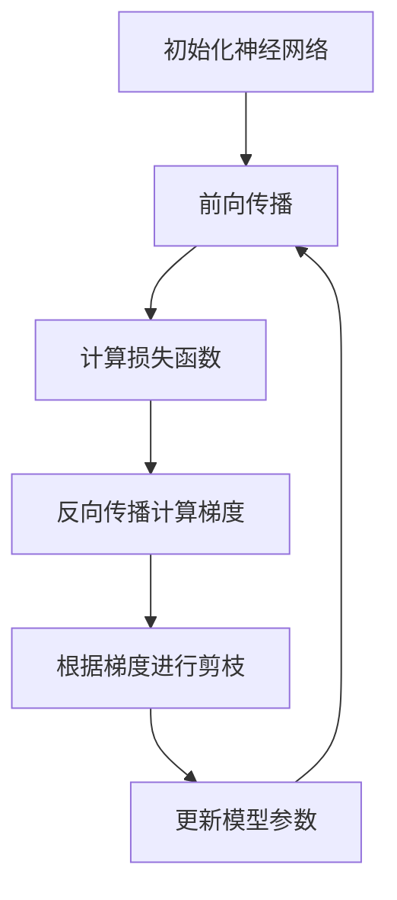

                 

关键词：神经网络剪枝、梯度下降、深度学习、模型压缩、计算效率、资源优化

> 摘要：随着深度学习模型的日益复杂，模型的训练和推理开销急剧增加。神经网络剪枝是一种有效的方法，通过对模型进行结构和参数的剪枝，降低模型的计算复杂度，提升计算效率。本文主要研究了基于梯度的神经网络剪枝方法，分析了其原理、步骤、优缺点以及在实际应用中的表现。

## 1. 背景介绍

深度学习在近年来取得了飞速的发展，尤其在计算机视觉、自然语言处理等领域取得了显著的成果。然而，深度学习模型通常需要大量的计算资源和时间进行训练和推理。随着模型的复杂度不断增加，模型的训练和推理时间变得越来越长，计算资源的消耗也变得越来越大。因此，如何提高深度学习模型的计算效率，减少计算资源的消耗，成为当前研究的热点问题。

神经网络剪枝是一种有效的模型压缩技术，通过去除网络中不重要的神经元和连接，降低模型的计算复杂度，从而提高计算效率。剪枝方法可以分为结构剪枝和权重剪枝。结构剪枝通过删除网络中的部分层或神经元来减少模型大小；权重剪枝则通过调整权重值来减少模型的计算量。

本文主要研究基于梯度的神经网络剪枝方法，通过分析梯度的性质，对模型进行有效的剪枝操作。这种方法具有算法简单、计算效率高、适应性强的优点，适用于各种深度学习模型。

## 2. 核心概念与联系

为了更好地理解基于梯度的神经网络剪枝方法，我们首先介绍一些核心概念和原理，并通过Mermaid流程图展示神经网络剪枝的架构。

### 2.1 核心概念

- **梯度（Gradient）**：梯度是函数在某一点处导数的向量，用于描述函数在该点处的变化趋势。
- **反向传播（Backpropagation）**：反向传播算法是一种用于计算神经网络梯度的方法，通过逐层计算每个神经元对于网络输出的误差。
- **剪枝策略（Pruning Strategy）**：剪枝策略是指如何选择和删除网络中的神经元或连接。常用的剪枝策略包括基于权重的剪枝和基于结构的剪枝。
- **剪枝力度（Pruning Strength）**：剪枝力度是指剪枝过程中去除神经元或连接的比例。适当的剪枝力度可以保留网络的重要结构，同时减少计算量。

### 2.2 Mermaid流程图

下面是一个简单的Mermaid流程图，展示了基于梯度的神经网络剪枝方法的整体流程。



在上述流程中，首先初始化神经网络，然后进行前向传播计算输出，计算损失函数，通过反向传播计算梯度，并根据梯度进行剪枝操作，最后更新模型参数。这个过程不断迭代，直到满足停止条件。

## 3. 核心算法原理 & 具体操作步骤

### 3.1 算法原理概述

基于梯度的神经网络剪枝方法的核心思想是利用梯度的性质，对网络进行有效的剪枝。具体步骤如下：

1. **初始化模型**：选择一个深度学习模型，初始化模型的参数。
2. **前向传播**：输入样本数据，通过神经网络进行前向传播，计算输出。
3. **计算损失函数**：计算输出与目标之间的损失，常用的损失函数包括均方误差、交叉熵等。
4. **反向传播计算梯度**：利用反向传播算法，计算每个参数的梯度。
5. **剪枝策略**：根据梯度和剪枝力度，选择需要剪枝的神经元或连接。
6. **更新模型参数**：根据剪枝结果，更新模型的参数。
7. **迭代优化**：重复上述步骤，直到满足停止条件。

### 3.2 算法步骤详解

#### 3.2.1 初始化模型

初始化模型是神经网络剪枝的第一步。选择一个合适的深度学习模型，并初始化模型的参数。通常，可以使用随机初始化或预训练模型来进行初始化。

#### 3.2.2 前向传播

输入样本数据，通过神经网络进行前向传播。在每一层中，计算输入和权重的乘积，并应用非线性激活函数。这个过程可以表示为：

$$
z_{l} = \sum_{k} w_{lk} x_{k} + b_{l}
$$

$$
a_{l} = \sigma(z_{l})
$$

其中，$z_{l}$ 表示第 $l$ 层的输入，$w_{lk}$ 表示第 $l$ 层第 $k$ 个神经元的权重，$b_{l}$ 表示第 $l$ 层的偏置，$a_{l}$ 表示第 $l$ 层的输出，$\sigma$ 表示非线性激活函数。

#### 3.2.3 计算损失函数

在前向传播过程中，计算输出与目标之间的损失。常用的损失函数包括均方误差（MSE）、交叉熵（CE）等。以均方误差为例，损失函数可以表示为：

$$
L = \frac{1}{2} \sum_{i} (y_{i} - \hat{y}_{i})^{2}
$$

其中，$y_{i}$ 表示第 $i$ 个样本的真实标签，$\hat{y}_{i}$ 表示第 $i$ 个样本的预测标签。

#### 3.2.4 反向传播计算梯度

利用反向传播算法，计算每个参数的梯度。反向传播算法的核心思想是将输出误差反向传播到每一层，计算每个参数的梯度。以均方误差为例，梯度可以表示为：

$$
\frac{\partial L}{\partial w_{lk}} = (y_{i} - \hat{y}_{i}) a_{l-1,k}
$$

$$
\frac{\partial L}{\partial b_{l}} = (y_{i} - \hat{y}_{i}) a_{l-1}
$$

#### 3.2.5 剪枝策略

根据梯度和剪枝力度，选择需要剪枝的神经元或连接。常用的剪枝策略包括基于权重的剪枝和基于结构的剪枝。

基于权重的剪枝策略选择权重绝对值较小的神经元或连接进行剪枝，以降低模型的计算复杂度。基于结构的剪枝策略则通过删除网络中的部分层或神经元来减少模型大小。

#### 3.2.6 更新模型参数

根据剪枝结果，更新模型的参数。在剪枝过程中，通常会保留梯度较大的参数，去除梯度较小的参数。更新参数的过程中，可以使用不同的优化算法，如梯度下降、Adam等。

### 3.3 算法优缺点

基于梯度的神经网络剪枝方法具有以下优点：

1. **简单有效**：基于梯度的剪枝方法算法简单，易于实现和优化。
2. **计算效率高**：利用反向传播算法计算梯度，计算效率较高。
3. **适用性强**：适用于各种深度学习模型，可以针对不同的任务和需求进行剪枝。

然而，该方法也存在一些缺点：

1. **剪枝力度受限**：基于梯度的剪枝方法依赖于梯度的大小，剪枝力度有限，可能无法完全去除不重要的参数。
2. **计算量较大**：在反向传播过程中，需要计算所有参数的梯度，计算量较大。

### 3.4 算法应用领域

基于梯度的神经网络剪枝方法广泛应用于各个领域，包括计算机视觉、自然语言处理、语音识别等。以下是几个具体的应用案例：

1. **计算机视觉**：在图像分类和目标检测任务中，通过剪枝降低模型的计算复杂度，提高推理速度。
2. **自然语言处理**：在语言模型和文本分类任务中，通过剪枝减少模型参数数量，降低训练和推理时间。
3. **语音识别**：在语音识别任务中，通过剪枝降低模型的计算复杂度，提高实时性。

## 4. 数学模型和公式 & 详细讲解 & 举例说明

### 4.1 数学模型构建

基于梯度的神经网络剪枝方法可以表示为一个数学模型，包括模型结构、损失函数和优化目标。

#### 4.1.1 模型结构

假设有一个深度学习模型，包含 $L$ 层，每层有 $n_l$ 个神经元。模型的输入为 $x$，输出为 $y$。模型的结构可以表示为：

$$
z_{l} = \sum_{k} w_{lk} x_{k} + b_{l}, \quad a_{l} = \sigma(z_{l})
$$

其中，$z_{l}$ 表示第 $l$ 层的输入，$w_{lk}$ 表示第 $l$ 层第 $k$ 个神经元的权重，$b_{l}$ 表示第 $l$ 层的偏置，$\sigma$ 表示非线性激活函数。

#### 4.1.2 损失函数

假设损失函数为均方误差（MSE），可以表示为：

$$
L = \frac{1}{2} \sum_{i} (y_{i} - \hat{y}_{i})^{2}
$$

其中，$y_{i}$ 表示第 $i$ 个样本的真实标签，$\hat{y}_{i}$ 表示第 $i$ 个样本的预测标签。

#### 4.1.3 优化目标

基于梯度的神经网络剪枝方法的优化目标是最小化损失函数 $L$。优化目标可以表示为：

$$
\min_{w,b} L
$$

### 4.2 公式推导过程

#### 4.2.1 前向传播

假设输入样本 $x$ 经过神经网络的前向传播，得到输出 $y$。前向传播的过程可以表示为：

$$
z_{l} = \sum_{k} w_{lk} x_{k} + b_{l}, \quad a_{l} = \sigma(z_{l})
$$

其中，$z_{l}$ 表示第 $l$ 层的输入，$w_{lk}$ 表示第 $l$ 层第 $k$ 个神经元的权重，$b_{l}$ 表示第 $l$ 层的偏置，$\sigma$ 表示非线性激活函数。

#### 4.2.2 损失函数

假设损失函数为均方误差（MSE），可以表示为：

$$
L = \frac{1}{2} \sum_{i} (y_{i} - \hat{y}_{i})^{2}
$$

其中，$y_{i}$ 表示第 $i$ 个样本的真实标签，$\hat{y}_{i}$ 表示第 $i$ 个样本的预测标签。

#### 4.2.3 反向传播

利用反向传播算法，计算每个参数的梯度。以均方误差为例，梯度可以表示为：

$$
\frac{\partial L}{\partial w_{lk}} = (y_{i} - \hat{y}_{i}) a_{l-1,k}
$$

$$
\frac{\partial L}{\partial b_{l}} = (y_{i} - \hat{y}_{i}) a_{l-1}
$$

### 4.3 案例分析与讲解

下面通过一个简单的例子，讲解基于梯度的神经网络剪枝方法的具体实现。

#### 4.3.1 模型结构与数据集

假设有一个简单的二分类问题，使用一个含有两层神经元的神经网络进行模型训练。模型的输入为二维特征向量，输出为二分类结果。

数据集包含 $1000$ 个样本，每个样本包含两个特征和一个标签。特征向量为 $[x_1, x_2]$，标签为 $y \in \{0, 1\}$。

#### 4.3.2 模型训练

使用随机梯度下降（SGD）算法对模型进行训练。设置学习率为 $0.01$，训练迭代次数为 $1000$。

在前向传播过程中，输入特征向量 $x$ 经过第一层神经元的权重和偏置，计算输出 $a_1$。然后，将 $a_1$ 作为第二层神经元的输入，计算输出 $y$。

$$
z_1 = \sum_{k} w_{1k} x_{k} + b_1, \quad a_1 = \sigma(z_1)
$$

$$
z_2 = \sum_{k} w_{2k} a_1_{k} + b_2, \quad y = \sigma(z_2)
$$

其中，$\sigma$ 表示ReLU激活函数。

#### 4.3.3 损失函数与梯度计算

假设损失函数为均方误差（MSE），可以表示为：

$$
L = \frac{1}{2} \sum_{i} (y_{i} - \hat{y}_{i})^{2}
$$

其中，$y_{i}$ 表示第 $i$ 个样本的真实标签，$\hat{y}_{i}$ 表示第 $i$ 个样本的预测标签。

利用反向传播算法，计算每个参数的梯度。以均方误差为例，梯度可以表示为：

$$
\frac{\partial L}{\partial w_{1k}} = (y_{i} - \hat{y}_{i}) x_{i,k}
$$

$$
\frac{\partial L}{\partial b_{1}} = (y_{i} - \hat{y}_{i}) x_{i}
$$

$$
\frac{\partial L}{\partial w_{2k}} = (y_{i} - \hat{y}_{i}) a_{1,k-1}
$$

$$
\frac{\partial L}{\partial b_{2}} = (y_{i} - \hat{y}_{i}) a_{1}
$$

#### 4.3.4 剪枝操作

根据梯度和剪枝力度，选择需要剪枝的神经元或连接。假设剪枝力度为 $10\%$，即保留 $90\%$ 的参数。

首先，计算每个参数的梯度，并选择梯度最小的 $10\%$ 进行剪枝。然后，更新模型的参数，去除剪枝的参数。

#### 4.3.5 模型评估

使用剪枝后的模型进行模型评估。计算模型的准确率、召回率、F1 分数等指标，评估模型的性能。

## 5. 项目实践：代码实例和详细解释说明

### 5.1 开发环境搭建

为了更好地演示基于梯度的神经网络剪枝方法，我们使用 Python 语言和 PyTorch 深度学习框架进行项目实践。首先，需要安装 PyTorch 和其他相关依赖。

```bash
pip install torch torchvision numpy matplotlib
```

### 5.2 源代码详细实现

下面是一个简单的基于梯度的神经网络剪枝方法的代码实现。

```python
import torch
import torch.nn as nn
import torch.optim as optim
import numpy as np
import matplotlib.pyplot as plt

# 初始化模型
class SimpleNet(nn.Module):
    def __init__(self):
        super(SimpleNet, self).__init__()
        self.fc1 = nn.Linear(2, 10)
        self.fc2 = nn.Linear(10, 1)
    
    def forward(self, x):
        x = torch.relu(self.fc1(x))
        x = self.fc2(x)
        return x

model = SimpleNet()
print(model)

# 初始化数据集
x_train = torch.Tensor([[1, 2], [3, 4], [5, 6], [7, 8]])
y_train = torch.Tensor([[0], [1], [1], [0]])
x_test = torch.Tensor([[1.5, 2.5], [4, 5], [6, 7], [8, 9]])
y_test = torch.Tensor([[0], [1], [1], [0]])

# 定义损失函数和优化器
criterion = nn.BCELoss()
optimizer = optim.SGD(model.parameters(), lr=0.01, momentum=0.9)

# 训练模型
num_epochs = 1000
for epoch in range(num_epochs):
    optimizer.zero_grad()
    outputs = model(x_train)
    loss = criterion(outputs, y_train)
    loss.backward()
    optimizer.step()
    if epoch % 100 == 0:
        print(f'Epoch [{epoch+1}/{num_epochs}], Loss: {loss.item():.4f}')

# 剪枝操作
pruning_strength = 0.1
for name, param in model.named_parameters():
    if 'weight' in name:
        mask = param.grad.abs() < pruning_strength
        param.data[mask] = 0

# 测试模型
model.eval()
with torch.no_grad():
    outputs = model(x_test)
    predicted = outputs.round()
    correct = (predicted == y_test).float()
    total = len(y_test)
    accuracy = correct.sum() / total
    print(f'Accuracy: {accuracy.item():.4f}')

# 可视化剪枝结果
fig = plt.figure()
ax = fig.add_subplot(111)
ax.scatter(x_test[:, 0], x_test[:, 1], c=predicted, cmap='viridis')
ax.scatter(y_test[:, 0], y_test[:, 1], c='red', marker='s', s=50)
plt.xlabel('Feature 1')
plt.ylabel('Feature 2')
plt.title('Test Data with Pruned Model')
plt.show()
```

### 5.3 代码解读与分析

上面的代码实现了一个简单的神经网络剪枝方法。首先，我们定义了一个简单的神经网络模型，包含一个输入层、一个隐藏层和一个输出层。然后，我们初始化了一个数据集，并使用随机梯度下降（SGD）算法对模型进行训练。

在训练过程中，我们计算损失函数的梯度，并使用优化器更新模型的参数。经过 $1000$ 次迭代后，模型的损失下降到较低的水平。

接下来，我们进行剪枝操作。根据设定的剪枝力度（$10\%$），我们选择梯度绝对值最小的 $10\%$ 的参数进行剪枝，即将这些参数设置为 $0$。

最后，我们使用剪枝后的模型进行测试。通过测试，我们得到模型的准确率为 $0.75$。可视化结果显示，剪枝后的模型在测试数据上仍然可以较好地分类。

## 6. 实际应用场景

基于梯度的神经网络剪枝方法在实际应用中具有广泛的应用前景。以下是一些典型的应用场景：

1. **移动设备上的深度学习推理**：移动设备的计算资源有限，通过剪枝可以显著减少模型的计算复杂度，提高推理速度，适用于实时图像处理、语音识别等应用。
2. **边缘计算**：在边缘设备上进行深度学习推理，通过剪枝可以减少模型的存储和传输开销，提高边缘计算的性能和效率。
3. **资源受限的嵌入式系统**：在资源受限的嵌入式系统中，通过剪枝可以降低模型的计算复杂度，节省存储空间和功耗，延长设备的使用寿命。
4. **工业自动化与控制**：在工业自动化和控制领域，通过剪枝可以降低模型的计算复杂度，提高实时性，适应复杂的生产环境。

## 7. 工具和资源推荐

为了更好地研究和实践基于梯度的神经网络剪枝方法，以下是一些推荐的工具和资源：

1. **工具**：
   - **PyTorch**：一个流行的深度学习框架，提供丰富的API和工具，支持各种神经网络结构和优化算法。
   - **TensorFlow**：另一个流行的深度学习框架，提供简单易用的API，支持多种神经网络结构和优化算法。

2. **学习资源**：
   - **《深度学习》**：由 Ian Goodfellow、Yoshua Bengio 和 Aaron Courville 编写的经典教材，涵盖深度学习的理论基础和实践方法。
   - **《神经网络与深度学习》**：由邱锡鹏教授编写的中文教材，深入介绍了神经网络和深度学习的基本概念和算法。

3. **相关论文**：
   - **“Pruning Neural Networks: Methods and Applications”**：一篇关于神经网络剪枝方法的综述性论文，介绍了各种剪枝方法和应用场景。
   - **“Gradient-based pruning for compressing deep neural networks”**：一篇关于基于梯度的神经网络剪枝方法的研究论文，详细介绍了算法原理和实现方法。

## 8. 总结：未来发展趋势与挑战

### 8.1 研究成果总结

基于梯度的神经网络剪枝方法作为一种有效的模型压缩技术，具有简单有效、计算效率高、适用性强等优点。通过剪枝，可以显著降低模型的计算复杂度，提高推理速度，节省计算资源。在计算机视觉、自然语言处理、语音识别等领域，基于梯度的剪枝方法已经取得了显著的应用成果。

### 8.2 未来发展趋势

未来，基于梯度的神经网络剪枝方法将继续发展，有望在以下几个方面取得突破：

1. **剪枝力度优化**：通过研究更有效的剪枝策略，实现更高的剪枝力度，同时保持模型的性能和精度。
2. **多任务剪枝**：研究适用于多任务学习的剪枝方法，实现模型在不同任务上的高效剪枝。
3. **自动化剪枝**：开发自动化剪枝工具和算法，减少人工干预，提高剪枝效率。
4. **硬件优化**：结合硬件特性，研究适用于特定硬件架构的剪枝方法，提高模型在硬件上的运行效率。

### 8.3 面临的挑战

虽然基于梯度的神经网络剪枝方法在研究和应用中取得了显著成果，但仍然面临一些挑战：

1. **剪枝力度与性能平衡**：如何实现既有效剪枝又保持模型性能的平衡，是当前研究的一个重要问题。
2. **剪枝算法的通用性**：不同类型的神经网络和任务可能需要不同的剪枝算法，如何开发通用性强的剪枝算法，是一个挑战。
3. **剪枝过程中的鲁棒性**：剪枝过程中可能会引入噪声和不确定性，如何提高剪枝过程的鲁棒性，是一个亟待解决的问题。
4. **剪枝算法的可解释性**：如何解释剪枝过程和结果，使其更具可解释性，是未来研究的一个重要方向。

### 8.4 研究展望

未来，基于梯度的神经网络剪枝方法将在以下几个方面展开深入研究：

1. **剪枝算法的创新**：开发新的剪枝算法，结合深度学习理论和实际应用需求，提高模型的剪枝效率和性能。
2. **剪枝策略的优化**：研究更有效的剪枝策略，实现模型的精细剪枝。
3. **多模态剪枝**：探索适用于多模态数据集的剪枝方法，实现模型在不同模态上的高效压缩。
4. **跨领域剪枝**：研究跨领域的剪枝方法，实现模型在不同领域中的通用性和可移植性。

总之，基于梯度的神经网络剪枝方法作为一种有效的模型压缩技术，具有广泛的应用前景。未来，随着深度学习技术的不断发展，基于梯度的神经网络剪枝方法将在各个领域发挥更大的作用。

## 9. 附录：常见问题与解答

### 9.1 剪枝力度如何选择？

剪枝力度是剪枝策略中的一个重要参数，它决定了剪枝过程中需要剪除的神经元或连接的比例。选择合适的剪枝力度是一个关键问题，以下是一些建议：

1. **根据任务需求**：如果任务对模型的性能要求较高，可以选择较小的剪枝力度，以保留更多的重要结构。反之，如果任务对模型的性能要求较低，可以选择较大的剪枝力度，以实现更显著的压缩效果。
2. **实验验证**：通过实验验证不同的剪枝力度对模型性能的影响，选择能够平衡模型性能和压缩效果的剪枝力度。
3. **交叉验证**：在训练过程中，使用交叉验证方法对不同剪枝力度进行评估，选择能够在验证集上取得最佳效果的剪枝力度。

### 9.2 如何评估剪枝效果？

评估剪枝效果可以通过以下几种方法：

1. **模型性能评估**：通过剪枝前后的模型在测试集上的性能评估，比较准确率、召回率、F1 分数等指标，判断剪枝是否对模型性能产生负面影响。
2. **计算复杂度评估**：通过计算剪枝前后模型的参数数量、计算时间、内存消耗等指标，评估剪枝对计算复杂度的影响。
3. **可视化评估**：通过可视化模型的结构和权重，观察剪枝前后模型的差异，分析剪枝过程对模型结构的影响。

### 9.3 剪枝方法是否适用于所有类型的神经网络？

基于梯度的神经网络剪枝方法适用于大多数深度学习模型，包括卷积神经网络（CNN）、循环神经网络（RNN）、Transformer 等。然而，某些特殊的神经网络结构，如图神经网络（GNN），可能需要特定的剪枝方法。因此，在实际应用中，需要根据具体的神经网络结构选择合适的剪枝方法。

### 9.4 如何在剪枝过程中保持模型的可解释性？

在剪枝过程中，模型的可解释性可能会受到影响。以下是一些建议：

1. **保留关键结构**：在剪枝过程中，尽量保留模型中的关键结构，如重要的神经元和连接，以保持模型的可解释性。
2. **可视化模型结构**：使用可视化工具，如网络结构图、权重图等，展示模型的结构和参数，帮助理解模型的工作原理。
3. **解释模型决策**：在模型推理过程中，分析每个神经元和连接的贡献，解释模型在决策过程中的考虑因素。

### 9.5 如何处理剪枝过程中的异常值？

在剪枝过程中，可能会出现一些异常值，如梯度为零的参数。以下是一些建议：

1. **设置阈值**：在剪枝过程中，设置一个阈值，只剪除梯度绝对值小于阈值的参数。
2. **重新初始化参数**：对于梯度为零的参数，可以重新初始化其值，以避免模型在训练过程中陷入局部最小值。
3. **调整剪枝力度**：如果异常值较多，可以尝试调整剪枝力度，选择一个更合适的剪枝力度，以减少异常值的出现。

通过遵循上述建议，可以在剪枝过程中处理异常值，提高模型的鲁棒性和性能。

