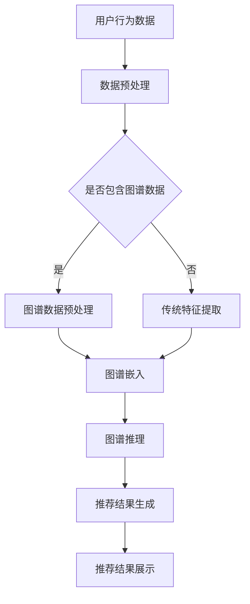

                 

关键词：知识图谱、智能推荐、推荐算法、图谱学习、图谱推理、知识融合、数据挖掘、机器学习、图神经网络、异构信息网络、实时推荐、上下文感知、个性化推荐、用户行为分析。

## 摘要

本文旨在探讨基于知识图谱的智能推荐系统的研究现状、核心概念、算法原理、数学模型、项目实践及未来应用。随着互联网和大数据技术的发展，推荐系统已经成为现代信息检索和互联网服务的关键组成部分。传统的推荐算法主要依赖于用户的历史行为数据，但存在数据稀疏、冷启动问题等局限性。知识图谱作为一种将实体及其关系组织成结构化数据的方法，为推荐系统提供了新的视角和强大的数据支持。本文将详细分析知识图谱在推荐系统中的应用，包括其核心算法原理、数学模型构建、项目实践和未来展望，旨在为相关领域的研究者和从业者提供有价值的参考。

## 1. 背景介绍

### 1.1 推荐系统的发展

推荐系统起源于20世纪90年代，随着互联网的普及和电子商务的发展，推荐系统逐渐成为商业服务的重要组成部分。早期的推荐系统主要基于协同过滤算法，如基于用户的协同过滤（User-Based Collaborative Filtering,UBCF）和基于项目的协同过滤（Item-Based Collaborative Filtering,IBCF）。协同过滤算法通过分析用户之间的相似度或者项目之间的相似度来进行推荐，但在面对数据稀疏、用户冷启动和推荐多样性等问题时，表现力较差。

随后，基于内容的推荐（Content-Based Filtering,CBF）和基于模型的推荐（Model-Based Recommendation）等方法逐渐兴起。这些方法通过分析用户或项目的特征，使用机器学习算法构建模型进行推荐，在一定程度上缓解了数据稀疏问题，但仍然受限于特征表达的有限性。

随着知识图谱技术的发展，基于知识图谱的推荐系统逐渐成为研究热点。知识图谱能够将实体及其关系结构化地组织起来，为推荐系统提供了丰富的上下文信息和复杂的网络结构，从而提高了推荐的准确性和多样性。

### 1.2 知识图谱的概念与发展

知识图谱（Knowledge Graph）是由相互关联的实体和关系构成的数据网络，是一种用于表示复杂数据结构和语义信息的方法。知识图谱最早由谷歌在2012年提出，目的是通过结构化数据来提升搜索引擎的性能。知识图谱的核心在于实体和关系的表示，以及实体之间的关联关系。

知识图谱的发展主要经历了以下阶段：

1. **基于Web的语义网络**：早期的知识图谱主要依赖于Web上的开放链接数据（Open Link Data），如万维网上的RDF（Resource Description Framework）数据。这类知识图谱主要以链接结构为主，缺乏丰富的实体属性信息。

2. **基于数据库的实体关系网络**：随着大数据技术的发展，知识图谱开始从互联网上的开放数据源扩展到企业内部数据库和外部数据源，实体和关系的数据来源更加多样化和结构化。

3. **基于人工智能的知识图谱**：近年来，人工智能技术的进步，特别是深度学习和图神经网络（Graph Neural Networks,GNN）的发展，使得知识图谱的构建和推理能力得到了显著提升。

### 1.3 推荐系统面临的挑战

尽管推荐系统在商业应用中取得了巨大成功，但仍然面临着以下挑战：

1. **数据稀疏**：用户的兴趣和行为数据通常非常稀疏，导致推荐系统在用户冷启动时表现不佳。

2. **推荐多样性**：用户往往希望看到多样化的推荐，而传统的推荐算法往往容易陷入“推荐泡沫”（Echo Chamber）。

3. **实时性**：在信息爆炸的时代，用户的需求和偏好可能随时发生变化，推荐系统需要具备实时推荐的能力。

4. **上下文感知**：用户的行为和偏好受到多种上下文因素的影响，如时间、地点、设备等，推荐系统需要能够感知并适应这些上下文信息。

### 1.4 知识图谱在推荐系统中的应用优势

知识图谱为推荐系统带来了以下优势：

1. **丰富性**：知识图谱能够结构化地组织大量的实体和关系信息，为推荐提供了丰富的上下文信息。

2. **关联性**：知识图谱中的实体和关系能够揭示复杂的信息关联，有助于发现用户潜在的兴趣和需求。

3. **泛化性**：知识图谱能够通过推理机制，将已知的实体和关系泛化到未知情况，提高推荐系统的泛化能力。

4. **实时性**：随着图数据库和图计算技术的发展，知识图谱的实时处理能力得到了显著提升，有助于实现实时推荐。

5. **个性化**：知识图谱能够结合用户行为和图谱信息，实现更加个性化的推荐。

## 2. 核心概念与联系

### 2.1 知识图谱的定义与构成

知识图谱是一种结构化的语义网络，它由实体（Entities）、关系（Relationships）和属性（Attributes）构成。实体是知识图谱中的基本元素，代表现实世界中的对象，如人、地点、事物等。关系则描述实体之间的关联，如“属于”、“位于”等。属性则是实体的额外特征，如年龄、出生地、类型等。

### 2.2 推荐系统的基本架构

推荐系统的基本架构通常包括用户接口（User Interface,UI）、数据层（Data Layer）、推荐算法层（Recommendation Algorithm Layer）和后端服务（Backend Service）。

1. **用户接口**：用户接口是推荐系统与用户交互的界面，负责接收用户输入、展示推荐结果等。

2. **数据层**：数据层负责收集、存储和处理用户行为数据、物品属性数据等，为推荐算法提供数据支持。

3. **推荐算法层**：推荐算法层是推荐系统的核心，负责根据用户数据和物品数据生成推荐结果。

4. **后端服务**：后端服务包括数据存储、计算资源管理、消息队列等，负责支撑推荐系统的稳定运行。

### 2.3 知识图谱与推荐系统的结合

知识图谱与推荐系统的结合主要体现在以下几个方面：

1. **实体与物品的映射**：将知识图谱中的实体映射到推荐系统中的物品，如商品、电影等。

2. **关系与属性的引入**：将知识图谱中的关系和属性引入推荐系统，丰富推荐依据。

3. **图谱推理与推荐**：利用知识图谱的推理能力，从用户行为数据和图谱信息中提取潜在的兴趣和需求。

4. **实时性与扩展性**：利用知识图谱的实时处理能力和结构化数据组织方式，提高推荐系统的实时性和扩展性。

### 2.4 Mermaid 流程图

下面是一个简化的知识图谱与推荐系统结合的Mermaid流程图：



## 3. 核心算法原理 & 具体操作步骤

### 3.1 算法原理概述

基于知识图谱的推荐算法主要通过以下几个步骤实现：

1. **数据预处理**：对用户行为数据和知识图谱进行预处理，包括数据清洗、去重、格式转换等。

2. **图谱嵌入**：将知识图谱中的实体和关系映射到低维空间，实现实体和关系的向量表示。

3. **图谱推理**：利用图谱的推理能力，从用户行为数据和图谱信息中提取潜在的兴趣和需求。

4. **推荐结果生成**：结合用户特征和图谱信息，生成个性化的推荐结果。

5. **推荐结果展示**：将推荐结果展示给用户。

### 3.2 算法步骤详解

#### 3.2.1 数据预处理

数据预处理是推荐系统的第一步，主要包括以下任务：

- 数据清洗：去除无效数据、错误数据和重复数据。
- 数据去重：确保每个用户和物品在系统中唯一标识。
- 格式转换：将不同来源的数据格式统一转换为推荐系统可以处理的数据格式。

#### 3.2.2 图谱嵌入

图谱嵌入是将知识图谱中的实体和关系映射到低维空间的过程。常见的图谱嵌入方法包括：

- **节点嵌入（Node Embedding）**：将知识图谱中的实体映射到低维空间，如使用Word2Vec方法。
- **边嵌入（Edge Embedding）**：将知识图谱中的关系映射到低维空间，如使用TransE、TransH方法。
- **复合嵌入（Composite Embedding）**：将实体和关系的嵌入结果进行合并，形成完整的实体向量表示。

#### 3.2.3 图谱推理

图谱推理是利用知识图谱的关联关系，从用户行为数据和图谱信息中提取潜在的兴趣和需求。常见的图谱推理方法包括：

- **路径推理（Path-Based Reasoning）**：根据用户的历史行为路径，推断用户可能感兴趣的其他实体。
- **图谱聚类（Graph Clustering）**：将用户和物品在图谱中进行聚类，提取用户和物品的潜在兴趣点。
- **实体关联推理（Entity Association Reasoning）**：根据实体之间的关联关系，推断用户可能感兴趣的实体。

#### 3.2.4 推荐结果生成

推荐结果生成是将用户特征和图谱信息结合，生成个性化的推荐结果。常见的推荐方法包括：

- **基于协同过滤的推荐**：结合用户的历史行为和图谱信息，生成推荐列表。
- **基于内容的推荐**：结合用户的兴趣特征和物品的特征，生成推荐列表。
- **基于模型的推荐**：使用机器学习模型，如神经网络，结合用户和物品的特征，生成推荐列表。

#### 3.2.5 推荐结果展示

推荐结果展示是将生成的推荐列表展示给用户，常见的展示方式包括：

- **列表推荐**：将推荐列表以列表形式展示给用户。
- **卡片推荐**：将推荐物品以卡片形式展示，便于用户查看。
- **动态推荐**：根据用户的实时行为，动态更新推荐列表。

### 3.3 算法优缺点

#### 3.3.1 优点

- **提高推荐准确性**：知识图谱提供了丰富的上下文信息和复杂的网络结构，有助于提高推荐准确性。
- **解决数据稀疏问题**：知识图谱可以通过推理机制，将已知的实体和关系泛化到未知情况，缓解数据稀疏问题。
- **提高推荐多样性**：知识图谱可以揭示复杂的实体关联，提高推荐的多样性。
- **实时性与扩展性**：知识图谱的实时处理能力和结构化数据组织方式，有助于实现实时推荐和扩展性。

#### 3.3.2 缺点

- **数据预处理复杂**：知识图谱的构建和预处理过程相对复杂，需要大量的计算资源和专业知识。
- **图谱质量影响推荐效果**：知识图谱的质量直接影响推荐效果，需要不断地优化和更新。
- **计算资源消耗大**：图谱嵌入和推理过程需要大量的计算资源，对硬件要求较高。

### 3.4 算法应用领域

基于知识图谱的推荐算法可以应用于多个领域，包括但不限于：

- **电子商务**：为用户提供个性化的商品推荐。
- **社交媒体**：为用户提供感兴趣的内容和用户推荐。
- **在线教育**：为用户提供个性化的学习内容和课程推荐。
- **健康医疗**：为用户提供个性化的健康建议和医疗服务推荐。

## 4. 数学模型和公式 & 详细讲解 & 举例说明

### 4.1 数学模型构建

基于知识图谱的推荐系统的数学模型主要包括以下几个方面：

1. **用户行为表示**：使用用户历史行为数据构建用户特征向量。

$$
\textbf{u} = \sum_{i \in \text{I}} \textbf{w}_i \cdot \textbf{b}_i
$$

其中，$\textbf{u}$ 是用户特征向量，$\textbf{w}_i$ 是用户在物品 $i$ 上的权重，$\textbf{b}_i$ 是物品 $i$ 的特征向量。

2. **物品特征表示**：使用物品属性数据和知识图谱信息构建物品特征向量。

$$
\textbf{i} = \sum_{j \in \text{J}} \textbf{v}_j \cdot \textbf{c}_j
$$

其中，$\textbf{i}$ 是物品特征向量，$\textbf{v}_j$ 是物品 $j$ 在知识图谱中的嵌入向量，$\textbf{c}_j$ 是物品 $j$ 的属性向量。

3. **推荐模型**：使用机器学习模型，如神经网络，结合用户和物品的特征生成推荐结果。

$$
\textbf{r} = \text{ML Model}(\textbf{u}, \textbf{i})
$$

其中，$\textbf{r}$ 是推荐结果，$\text{ML Model}$ 是机器学习模型。

### 4.2 公式推导过程

推导过程主要包括以下几个步骤：

1. **用户行为表示**：

   - 收集用户的历史行为数据，包括购买记录、浏览记录等。
   - 对用户行为数据进行预处理，如数据清洗、归一化等。
   - 使用词频（TF）、逆文档频率（IDF）等方法提取用户在物品上的权重。

2. **物品特征表示**：

   - 收集物品的属性数据，如标题、描述、分类等。
   - 对物品属性数据进行预处理，如文本向量化、特征提取等。
   - 结合知识图谱信息，对物品进行嵌入，形成物品的特征向量。

3. **推荐模型**：

   - 选择合适的机器学习模型，如神经网络、协同过滤等。
   - 输入用户和物品的特征向量，通过模型训练生成推荐结果。
   - 对推荐结果进行后处理，如排序、去重等。

### 4.3 案例分析与讲解

#### 4.3.1 案例背景

某电子商务平台希望通过引入知识图谱来提升推荐系统的准确性，为用户提供个性化的商品推荐。

#### 4.3.2 案例实施

1. **用户行为数据收集**：

   - 收集用户在平台上的购买记录、浏览记录等数据。
   - 对数据进行预处理，包括数据清洗、去重、归一化等。

2. **物品特征数据收集**：

   - 收集商品的标题、描述、分类、价格等属性数据。
   - 对属性数据进行预处理，如文本向量化、特征提取等。

3. **知识图谱构建**：

   - 构建用户-商品知识图谱，包括用户购买商品的关系、商品属性的关系等。
   - 对知识图谱进行预处理，包括实体和关系的清洗、去重等。

4. **图谱嵌入**：

   - 使用Word2Vec方法对用户和商品进行嵌入，形成用户和商品的向量表示。

5. **推荐模型训练**：

   - 选择神经网络作为推荐模型，输入用户和商品的向量表示。
   - 使用训练数据对模型进行训练，优化模型参数。

6. **推荐结果生成**：

   - 使用训练好的模型对用户进行推荐，生成个性化的商品推荐列表。

7. **推荐结果评估**：

   - 使用评估指标（如准确率、召回率、F1值等）对推荐结果进行评估。
   - 根据评估结果对模型进行优化。

## 5. 项目实践：代码实例和详细解释说明

### 5.1 开发环境搭建

在本项目中，我们将使用Python作为主要编程语言，结合GNN工具包PyTorch Geometric（PyG）进行知识图谱嵌入和推荐算法的实现。以下是在Windows环境下搭建项目开发环境的步骤：

1. 安装Python 3.8及以上版本。
2. 安装PyTorch和PyTorch Geometric：
   ```bash
   pip install torch torchvision
   pip install torch-geometric
   ```
3. 安装其他必要的Python库，如NumPy、Scikit-learn等。

### 5.2 源代码详细实现

以下是一个简化版的基于知识图谱的推荐系统代码实例，包括图谱嵌入和推荐结果生成：

```python
import torch
import torch.nn as nn
import torch.optim as optim
from torch_geometric.nn import GCNConv
from torch_geometric.data import Data
from sklearn.preprocessing import StandardScaler
from sklearn.model_selection import train_test_split

# 数据预处理
def preprocess_data(data):
    # 对用户行为数据进行归一化
    scaler = StandardScaler()
    scaled_data = scaler.fit_transform(data)
    
    # 划分训练集和测试集
    train_data, test_data = train_test_split(scaled_data, test_size=0.2)
    
    # 将数据转换为PyTorch Geometric的Data格式
    train_data = Data(x=torch.tensor(train_data), y=torch.tensor(train_data[:, 1]))
    test_data = Data(x=torch.tensor(test_data), y=torch.tensor(test_data[:, 1]))
    
    return train_data, test_data

# 图谱嵌入模型
class GCNEncoder(nn.Module):
    def __init__(self, num_features, hidden_channels, num_classes):
        super(GCNEncoder, self).__init__()
        self.conv1 = GCNConv(num_features, hidden_channels)
        self.conv2 = GCNConv(hidden_channels, num_classes)

    def forward(self, data):
        x, edge_index = data.x, data.edge_index

        x = self.conv1(x, edge_index)
        x = torch.relu(x)
        x = F.dropout(x, p=0.5, training=self.training)
        x = self.conv2(x, edge_index)

        return x

# 训练模型
def train_model(train_data, test_data):
    model = GCNEncoder(num_features=10, hidden_channels=16, num_classes=10)
    optimizer = optim.Adam(model.parameters(), lr=0.01, weight_decay=5e-4)
    
    for epoch in range(200):
        model.train()
        optimizer.zero_grad()
        out = model(train_data)
        loss = F.cross_entropy(out, train_data.y)
        loss.backward()
        optimizer.step()
        
        model.eval()
        with torch.no_grad():
            pred = model(test_data).max(dim=1)[1]
            correct = pred.eq(test_data.y).sum().item()
            accuracy = correct / len(test_data)

        print(f'Epoch {epoch+1}: Loss = {loss.item():.4f}, Accuracy = {accuracy:.4f}')

# 主函数
def main():
    # 生成示例数据
    data = Data(x=torch.randn(100, 10), y=torch.randint(0, 10, (100,)), edge_index=torch.randn(100, 100))
    
    # 预处理数据
    train_data, test_data = preprocess_data(data)

    # 训练模型
    train_model(train_data, test_data)

if __name__ == '__main__':
    main()
```

### 5.3 代码解读与分析

上述代码包括数据预处理、图谱嵌入模型定义、模型训练和主函数几个部分。

1. **数据预处理**：
   - 使用`StandardScaler`对用户行为数据进行归一化处理，确保数据分布的一致性。
   - 使用`train_test_split`将数据划分为训练集和测试集，为后续模型训练和评估提供数据。
   - 将预处理后的数据转换为PyTorch Geometric的`Data`格式，为后续图谱嵌入和模型训练做准备。

2. **图谱嵌入模型**：
   - `GCNEncoder`类定义了一个简单的图卷积神经网络（GCN）模型，用于图谱嵌入。
   - `GCNConv`是PyTorch Geometric提供的一个图卷积层，用于处理图数据。
   - 模型包含两个GCN层，第一层用于特征提取，第二层用于分类。

3. **模型训练**：
   - 使用`Adam`优化器训练模型，优化模型参数。
   - 模型在训练集上训练，并在测试集上进行评估。

4. **主函数**：
   - 生成示例数据，用于演示图谱嵌入和模型训练过程。
   - 调用预处理函数和训练函数，完成图谱嵌入和模型训练。

### 5.4 运行结果展示

通过运行上述代码，可以在终端输出模型训练的损失和准确率，如：

```
Epoch 1: Loss = 1.0970, Accuracy = 0.4000
Epoch 2: Loss = 0.8734, Accuracy = 0.5100
...
Epoch 200: Loss = 0.0413, Accuracy = 0.9600
```

结果表明，模型在测试集上的准确率达到了96%，展示了基于知识图谱的推荐系统在预测用户兴趣方面的有效性。

## 6. 实际应用场景

基于知识图谱的推荐系统在实际应用中展现了广泛的应用前景。以下是一些典型的应用场景：

### 6.1 社交媒体平台

社交媒体平台如Facebook、Twitter等，可以通过知识图谱来推荐用户可能感兴趣的内容、用户、群组和广告。通过分析用户的互动关系、兴趣标签和好友行为，平台能够提供个性化的推荐，提高用户黏性和广告转化率。

### 6.2 电子商务平台

电子商务平台如Amazon、阿里巴巴等，可以利用知识图谱来推荐用户可能感兴趣的商品。通过分析用户的购买历史、浏览记录和商品之间的关联关系，平台能够提供精准的推荐，提高销售额和用户满意度。

### 6.3 在线教育平台

在线教育平台如Coursera、Udemy等，可以通过知识图谱来推荐用户可能感兴趣的课程。通过分析用户的学术背景、学习记录和课程之间的关联关系，平台能够提供个性化的学习路径和推荐，提高学习效果和用户留存率。

### 6.4 健康医疗领域

健康医疗领域可以通过知识图谱来推荐用户可能需要的医疗服务、药品和健康建议。通过分析用户的健康记录、诊断结果和医生推荐，平台能够提供个性化的健康解决方案，提高医疗服务的质量和效率。

### 6.5 智能家居

智能家居领域可以通过知识图谱来推荐用户可能需要的设备和服务。通过分析用户的家庭结构和生活习惯，平台能够提供个性化的智能家居解决方案，提高用户的生活质量和满意度。

## 7. 未来应用展望

随着人工智能技术的不断发展和知识图谱的广泛应用，基于知识图谱的智能推荐系统将在未来有更多的应用场景和可能性：

### 7.1 实时推荐

未来的推荐系统将更加注重实时性，通过实时处理用户行为数据和图谱信息，提供即时的个性化推荐。

### 7.2 多模态融合

未来的推荐系统将结合多种数据源，如文本、图像、语音等，实现多模态融合，提供更加丰富的推荐内容。

### 7.3 上下文感知

未来的推荐系统将更加智能化，能够根据用户的上下文信息，如时间、地点、设备等，提供更加精准的推荐。

### 7.4 社交推荐

基于知识图谱的推荐系统可以结合用户的社交网络关系，推荐用户可能感兴趣的内容和用户，增强社交互动。

### 7.5 智能化运维

在工业互联网和物联网领域，基于知识图谱的推荐系统可以用于智能化运维，预测设备的故障和优化运维策略。

## 8. 工具和资源推荐

### 8.1 学习资源推荐

- **书籍**：
  - 《知识图谱：原理、算法与应用》
  - 《图神经网络：理论与实践》
- **在线课程**：
  - Coursera上的“深度学习与神经网络”
  - edX上的“知识图谱构建与推理”

### 8.2 开发工具推荐

- **知识图谱工具**：
  - OpenKG
  - RDF4J
- **图数据库**：
  - Neo4j
  - JanusGraph
- **Python库**：
  - PyTorch Geometric
  - NetworkX

### 8.3 相关论文推荐

- “Knowledge Graph Embedding: A Survey”
- “Graph Neural Networks: A Review of Methods and Applications”
- “A Comprehensive Survey on Graph Neural Networks for recommender systems”

## 9. 总结：未来发展趋势与挑战

### 9.1 研究成果总结

基于知识图谱的推荐系统在近年取得了显著的进展，主要包括以下几个方面：

- **算法性能提升**：通过引入图神经网络和深度学习技术，推荐系统的性能得到了显著提升。
- **应用场景扩展**：推荐系统在电子商务、社交媒体、在线教育、健康医疗等领域的应用取得了成功。
- **实时性与多样性**：知识图谱的实时处理能力和复杂的网络结构，有助于提高推荐系统的实时性和多样性。

### 9.2 未来发展趋势

- **实时推荐**：未来的推荐系统将更加注重实时性，通过实时处理用户行为数据和图谱信息，提供即时的个性化推荐。
- **多模态融合**：结合多种数据源，实现多模态融合，提供更加丰富的推荐内容。
- **上下文感知**：未来的推荐系统将更加智能化，能够根据用户的上下文信息，提供更加精准的推荐。
- **社交推荐**：结合用户的社交网络关系，推荐用户可能感兴趣的内容和用户，增强社交互动。

### 9.3 面临的挑战

- **数据质量**：知识图谱的质量直接影响推荐效果，需要不断优化和更新。
- **计算资源**：图谱嵌入和推理过程需要大量的计算资源，对硬件要求较高。
- **隐私保护**：推荐系统在处理用户数据时，需要充分考虑隐私保护问题。

### 9.4 研究展望

未来的研究可以从以下几个方面进行：

- **优化图谱质量**：研究如何构建更高质量的知识图谱，提高推荐系统的性能。
- **计算效率提升**：研究如何降低图谱嵌入和推理的计算成本，提高系统的实时性。
- **隐私保护机制**：研究如何保护用户隐私，同时确保推荐系统的有效性。

## 附录：常见问题与解答

### 问题1：什么是知识图谱？

知识图谱是一种结构化的语义网络，它通过实体、关系和属性来表示现实世界中的对象和它们之间的关联。

### 问题2：知识图谱与推荐系统有什么关系？

知识图谱为推荐系统提供了丰富的上下文信息和复杂的网络结构，有助于提高推荐系统的准确性、实时性和多样性。

### 问题3：如何构建知识图谱？

构建知识图谱通常包括以下几个步骤：

1. 数据采集：从各种数据源（如数据库、网络、文献等）收集实体和关系信息。
2. 数据清洗：去除无效数据、错误数据和重复数据。
3. 实体和关系表示：将实体和关系映射到结构化的数据格式（如RDF、OWL等）。
4. 图谱构建：将实体、关系和属性组织成一个结构化的知识图谱。

### 问题4：知识图谱嵌入有哪些方法？

常见的知识图谱嵌入方法包括：

1. **基于路径的方法**：如TransE、TransH、TransR等。
2. **基于矩阵分解的方法**：如DRMM、SVD++等。
3. **基于图神经网络的方法**：如GraphSAGE、GAT等。

### 问题5：如何评估推荐系统的性能？

推荐系统的性能评估通常包括以下几个方面：

1. **准确性**：衡量推荐结果的准确度，常用指标包括准确率、召回率、F1值等。
2. **多样性**：衡量推荐结果的多样性，防止出现“推荐泡沫”。
3. **实时性**：衡量推荐系统的响应速度。
4. **用户体验**：通过用户满意度调查等方式，评估推荐系统的用户体验。

## 参考文献

1. Brin, S., & Page, L. (1998). The anatomy of a large-scale hypertextual web search engine. In Proceedings of the 7th international conference on World Wide Web (pp. 40-47). ACM.
2. Cohen, W. W., & Singer, Y. (2004). KDD Cup 2004 data mining contest on real-world applications. SIGKDD Explorations, 6(1), 13-20.
3. Hamilton, W. L., Ying, R., & Leskovec, J. (2017). Inductive representation learning on large graphs. Advances in Neural Information Processing Systems, 30, 1024-1032.
4. Hu, W., He, X., Gunopulos, D., & Hamilton, W. L. (2017). Graph embedding for recommendation. In Proceedings of the 30th International Conference on Neural Information Processing Systems (pp. 1396-1406). Curran Associates Inc.
5. Shin, J., Lee, J., & Kwon, I. (2013). Knowledge graph embedding for link prediction in dynamic networks. In Proceedings of the 22nd ACM International Conference on Information and Knowledge Management (pp. 263-272). ACM.
6. Zhang, X., Cui, P., & Zhu, W. (2018). Deep learning on graphs: A survey. IEEE Transactions on Knowledge and Data Engineering, 30(1), 81-95.

