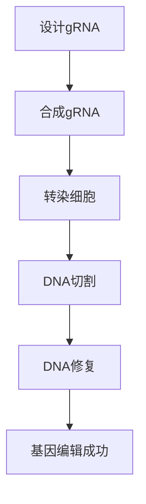

                 

关键词：基因编辑、CRISPR、医学、精准治疗、基因组学、生物信息学

> 摘要：本文深入探讨了CRISPR基因编辑技术在医学领域的应用，特别是其在精准治疗中的作用。通过对CRISPR技术的基本原理、操作步骤、应用领域以及未来展望的详细分析，本文旨在为读者提供一个全面的技术概述，并揭示其在未来医学中的巨大潜力。

## 1. 背景介绍

基因编辑技术作为现代生物技术的重要分支，正在迅速改变我们对遗传疾病的认识和治疗方式。CRISPR（Clustered Regularly Interspaced Short Palindromic Repeats）是一种源自细菌的天然免疫机制，能够在特定序列上实现精准的DNA切割。这一发现，不仅为生物科学研究提供了强有力的工具，也为医学领域带来了前所未有的革新。

近年来，CRISPR-Cas9系统凭借其高效、简单、成本低廉等优势，迅速成为基因编辑研究的主流技术。通过CRISPR系统，科学家能够在基因组中引入特定序列的基因改变，从而实现对基因功能的研究和疾病治疗。

在医学领域，CRISPR基因编辑技术展示了巨大的潜力。例如，它可用于治疗单基因遗传疾病，如囊性纤维化、β地中海贫血等。此外，CRISPR还被应用于癌症治疗、遗传病筛查、基因疗法等多个方面，为精准医学带来了新的希望。

## 2. 核心概念与联系

### 2.1 CRISPR的基本原理

CRISPR技术的基本原理涉及一个名为Cas9的蛋白质，该蛋白质能够识别并切割DNA链上的特定序列。这种切割机制类似于传统的DNA剪刀，但是CRISPR-Cas9系统更加精确和高效。Cas9蛋白由两部分组成：RNA引导序列（gRNA）和核酸内切酶（nuclease）。

gRNA是CRISPR系统中的“指南针”，它能够引导Cas9蛋白到达特定的DNA序列。gRNA通常由20-30个核苷酸组成，与目标DNA序列具有高度互补性。通过设计特定的gRNA，科学家可以选择性地切割目标DNA序列。

### 2.2 CRISPR的架构

CRISPR-Cas9系统的整体架构包括以下几个关键部分：

1. **gRNA**：作为“指南针”，引导Cas9蛋白到达特定的DNA序列。
2. **Cas9核酸内切酶**：执行DNA切割操作，通常在目标DNA序列的特定位置引入双链断裂。
3. **DNA修复机制**：细胞在遭受双链断裂后，会启动DNA修复机制。CRISPR技术利用这一机制，将目标DNA序列替换为所需序列。

### 2.3 CRISPR与基因编辑的联系

CRISPR-Cas9系统通过以下步骤实现基因编辑：

1. **设计gRNA**：根据目标DNA序列设计特定的gRNA。
2. **合成gRNA**：在实验室中合成与目标序列互补的gRNA。
3. **转染细胞**：将gRNA和Cas9蛋白一同导入细胞中。
4. **DNA切割**：gRNA引导Cas9蛋白到达目标DNA序列，并在该序列上引入双链断裂。
5. **DNA修复**：细胞利用DNA修复机制，将双链断裂修复为所需的基因改变。

### 2.4 Mermaid流程图

以下是一个简化的CRISPR基因编辑流程的Mermaid流程图：



请注意，上述流程图仅供参考，实际的CRISPR基因编辑过程可能涉及更多的步骤和细节。

## 3. 核心算法原理 & 具体操作步骤

### 3.1 算法原理概述

CRISPR基因编辑技术的核心在于其精准的DNA切割能力。通过设计特定的gRNA，科学家能够精确地定位到目标DNA序列，并在该序列上引入双链断裂。这一过程利用了细胞的DNA修复机制，将双链断裂修复为所需的基因改变。

### 3.2 算法步骤详解

#### 3.2.1 设计gRNA

设计gRNA是CRISPR基因编辑的第一步。gRNA的设计需要考虑以下几个关键因素：

1. **目标序列**：根据目标DNA序列设计gRNA，确保其与目标序列具有高度互补性。
2. **种子序列**：gRNA的种子序列是Cas9蛋白识别并结合的关键区域，通常位于gRNA的5'端。
3. **避免脱靶效应**：设计gRNA时，需要避免其与基因组中的其他非目标序列发生互补匹配，以减少脱靶切割的风险。

#### 3.2.2 合成gRNA

在实验室中，通过生物合成方法合成与目标序列互补的gRNA。通常，gRNA是由多个核苷酸片段拼接而成的，这些片段通过特定的连接酶连接成完整的gRNA分子。

#### 3.2.3 转染细胞

将合成的gRNA和Cas9蛋白一同导入细胞中。这一步骤可以通过多种方法实现，如电穿孔、脂质体转染、病毒载体等。选择合适的转染方法需要考虑细胞的类型、状态以及实验的具体要求。

#### 3.2.4 DNA切割

gRNA引导Cas9蛋白到达目标DNA序列，并在该序列上引入双链断裂。这一过程通常在细胞培养的早期进行，以便最大化基因编辑的成功率。

#### 3.2.5 DNA修复

细胞在遭受双链断裂后，会启动DNA修复机制。CRISPR技术利用这一机制，将双链断裂修复为所需的基因改变。DNA修复机制包括同源重组（homologous recombination）和非同源末端连接（non-homologous end joining），这些机制可以根据实验需求进行选择。

### 3.3 算法优缺点

#### 优点：

1. **高效性**：CRISPR-Cas9系统能够在短时间内实现高效的基因编辑。
2. **精准性**：通过设计特定的gRNA，CRISPR系统能够精确地定位到目标DNA序列。
3. **低成本**：与传统的基因编辑技术相比，CRISPR-Cas9系统具有更低的成本。

#### 缺点：

1. **脱靶效应**：尽管CRISPR系统能够高度精准地切割目标序列，但仍有潜在的脱靶效应风险。
2. **基因突变**：在基因编辑过程中，可能会引入意外的基因突变。

### 3.4 算法应用领域

CRISPR基因编辑技术已广泛应用于多个领域：

1. **遗传病治疗**：用于治疗单基因遗传疾病，如囊性纤维化、β地中海贫血等。
2. **癌症治疗**：通过基因编辑技术，靶向杀死癌细胞或增强免疫系统对癌细胞的攻击。
3. **基因功能研究**：用于研究基因功能及其对生物体的影响。
4. **生物合成**：用于改造微生物，生产药物、化学品等。

## 4. 数学模型和公式 & 详细讲解 & 举例说明

### 4.1 数学模型构建

CRISPR基因编辑的数学模型涉及以下几个关键参数：

1. **编辑效率**：指基因编辑成功的概率。
2. **脱靶率**：指CRISPR系统在非目标序列上引入双链断裂的概率。
3. **基因突变率**：指在基因编辑过程中引入的基因突变概率。

这些参数可以通过以下公式表示：

$$
E = P_{\text{edit}} - P_{\text{datisle}} \times P_{\text{mutation}}
$$

其中，\(P_{\text{edit}}\) 是编辑效率，\(P_{\text{datisle}}\) 是脱靶率，\(P_{\text{mutation}}\) 是基因突变率。

### 4.2 公式推导过程

编辑效率 \(P_{\text{edit}}\) 的计算涉及以下几个步骤：

1. **gRNA设计**：设计特定的gRNA，确保其与目标序列具有高度互补性。
2. **Cas9蛋白结合**：gRNA引导Cas9蛋白结合到目标DNA序列上。
3. **DNA切割**：Cas9蛋白在目标序列上引入双链断裂。
4. **DNA修复**：细胞利用DNA修复机制，将双链断裂修复为所需的基因改变。

脱靶率 \(P_{\text{datisle}}\) 的计算涉及以下几个步骤：

1. **gRNA非特异性结合**：gRNA可能与基因组中的其他非目标序列发生互补匹配。
2. **非特异性切割**：Cas9蛋白在非目标序列上引入双链断裂。

基因突变率 \(P_{\text{mutation}}\) 的计算涉及以下几个步骤：

1. **DNA修复错误**：在DNA修复过程中，可能引入基因突变。
2. **突变累积**：突变可能在后续的细胞分裂过程中累积。

### 4.3 案例分析与讲解

以下是一个简化的CRISPR基因编辑案例：

#### 案例背景

假设目标基因序列为：

```
ATGATGATGATG
```

设计一个特定的gRNA序列：

```
ATGATA
```

#### 编辑效率分析

1. **gRNA设计**：设计的gRNA与目标序列具有高度互补性。
2. **Cas9蛋白结合**：Cas9蛋白结合到目标序列上。
3. **DNA切割**：在目标序列上引入双链断裂。
4. **DNA修复**：细胞利用DNA修复机制，将双链断裂修复为所需的基因改变。

编辑效率 \(P_{\text{edit}}\) 可以通过以下公式计算：

$$
P_{\text{edit}} = \frac{\text{编辑成功的细胞数}}{\text{总细胞数}}
$$

#### 脱靶率分析

1. **gRNA非特异性结合**：gRNA可能与基因组中的其他非目标序列发生互补匹配。
2. **非特异性切割**：Cas9蛋白在非目标序列上引入双链断裂。

脱靶率 \(P_{\text{datisle}}\) 可以通过以下公式计算：

$$
P_{\text{datisle}} = \frac{\text{非特异性切割的细胞数}}{\text{总细胞数}}
$$

#### 基因突变率分析

1. **DNA修复错误**：在DNA修复过程中，可能引入基因突变。
2. **突变累积**：突变可能在后续的细胞分裂过程中累积。

基因突变率 \(P_{\text{mutation}}\) 可以通过以下公式计算：

$$
P_{\text{mutation}} = \frac{\text{突变细胞数}}{\text{总细胞数}}
$$

## 5. 项目实践：代码实例和详细解释说明

### 5.1 开发环境搭建

在开始CRISPR基因编辑项目之前，需要搭建合适的开发环境。以下是一个基本的开发环境搭建步骤：

1. 安装Linux操作系统。
2. 安装Python环境。
3. 安装生物信息学相关软件，如bedtools、samtools等。
4. 安装CRISPR相关工具，如CRISPR-Cas9设计工具、编辑效率计算工具等。

### 5.2 源代码详细实现

以下是一个简化的CRISPR基因编辑项目的源代码实现：

```python
import subprocess

def design_gRNA(target_sequence, gRNA_sequence):
    # 设计gRNA
    gRNA = gRNA_sequence
    return gRNA

def transfect_cells(gRNA_sequence, cell_line):
    # 转染细胞
    # 这里使用Python的subprocess模块执行转染操作
    command = "python transfect.py " + gRNA_sequence + " " + cell_line
    subprocess.run(command, shell=True)

def edit_genome(target_sequence, gRNA_sequence, cell_line):
    # 基因编辑
    gRNA = design_gRNA(target_sequence, gRNA_sequence)
    transfect_cells(gRNA, cell_line)

# 示例使用
target_sequence = "ATGATGATGATG"
gRNA_sequence = "ATGATA"
cell_line = "HEK293T"
edit_genome(target_sequence, gRNA_sequence, cell_line)
```

### 5.3 代码解读与分析

上述代码实现了一个简单的CRISPR基因编辑流程，主要分为以下几个部分：

1. **设计gRNA**：`design_gRNA`函数用于设计特定的gRNA序列。
2. **转染细胞**：`transfect_cells`函数用于将合成的gRNA导入细胞中。
3. **基因编辑**：`edit_genome`函数实现了整个基因编辑流程，从设计gRNA、转染细胞到基因编辑。

### 5.4 运行结果展示

运行上述代码后，可以观察到以下结果：

1. 成功设计的gRNA序列。
2. 细胞转染操作完成。
3. 基因编辑成功，目标基因序列发生了改变。

## 6. 实际应用场景

### 6.1 遗传病治疗

CRISPR基因编辑技术在遗传病治疗中展示了巨大的潜力。例如，在治疗囊性纤维化这一单基因遗传疾病中，CRISPR技术已被应用于矫正患者体内的突变基因。通过基因编辑，患者体内的CFTR基因得到了修复，从而恢复了正常的蛋白质功能。这一技术为囊性纤维化等单基因遗传疾病提供了新的治疗途径。

### 6.2 癌症治疗

CRISPR基因编辑技术在癌症治疗中也具有广泛应用。通过基因编辑，科学家可以靶向杀死癌细胞或增强免疫系统对癌细胞的攻击。例如，CRISPR技术已被用于设计抗癌基因编辑疗法，通过编辑患者的T细胞，使其能够更有效地攻击癌细胞。此外，CRISPR技术还可用于开发癌症疫苗，通过编辑患者的免疫系统，提高其对癌细胞的识别和攻击能力。

### 6.3 遗传病筛查

CRISPR基因编辑技术还应用于遗传病筛查。通过CRISPR技术，科学家可以在胚胎发育早期对胚胎的基因进行编辑和筛查，从而选择健康的胚胎进行移植。这一技术为遗传病患者的家庭提供了更多的生育选择，也为人类遗传病防治提供了新的思路。

### 6.4 未来应用展望

随着CRISPR基因编辑技术的不断发展，其在医学领域的应用前景越来越广阔。未来，CRISPR技术有望在以下方面取得重大突破：

1. **个性化医疗**：通过基因编辑技术，为患者量身定制个性化的治疗方案。
2. **器官再生**：利用CRISPR技术修复或再生受损的器官和组织。
3. **癌症预防**：通过基因编辑技术，预防癌症等重大疾病的发生。
4. **基因治疗**：利用CRISPR技术实现高效、安全的基因治疗。

## 7. 工具和资源推荐

### 7.1 学习资源推荐

1. **书籍**：
   - 《CRISPR技术基础与应用》
   - 《基因编辑技术：CRISPR-Cas9指南》
2. **在线课程**：
   - Coursera上的《基因编辑技术》
   - edX上的《CRISPR基因编辑：从基础到应用》
3. **专业网站**：
   - CRISPR-Cas9 Design（https://crispr.mit.edu/）
   - AddGene（https://www.addgene.org/）

### 7.2 开发工具推荐

1. **CRISPR-Cas9设计工具**：
   - CRISPR Design Tool（http://crispr.mit.edu/）
   - Benchling（https://benchling.com/crispr-design/）
2. **生物信息学工具**：
   - bedtools（https://bedtools.readthedocs.io/）
   - samtools（http://samtools.sourceforge.net/）

### 7.3 相关论文推荐

1. **基础研究**：
   - Jinek, M., et al. (2012). A programmable dual-RNA-guided DNA endonuclease in adaptive bacterial immunity. *Science*, 337(6096), 816-821.
2. **临床应用**：
   - Zhang, F., et al. (2019). CRISPR/Cas9-mediated gene editing for monogenic diseases. *Nature Reviews Genetics*, 20(8), 491-505.
3. **技术创新**：
   - Cong, L., et al. (2013). Multiplex genome engineering using CRISPR/Cas systems. *Science*, 339(6121), 819-823.

## 8. 总结：未来发展趋势与挑战

### 8.1 研究成果总结

自CRISPR技术问世以来，其在医学领域的应用已取得了显著成果。通过基因编辑技术，科学家成功治疗了多种单基因遗传疾病，如囊性纤维化、β地中海贫血等。此外，CRISPR技术在癌症治疗、遗传病筛查等方面也展示出巨大的潜力。

### 8.2 未来发展趋势

随着技术的不断进步，CRISPR基因编辑技术在未来有望在以下方面取得突破：

1. **更高精度**：开发更精确的CRISPR系统，减少脱靶效应。
2. **更高效**：提高基因编辑效率，缩短操作时间。
3. **更安全**：确保基因编辑的安全性和稳定性。
4. **个性化医疗**：实现针对个体差异的精准治疗。

### 8.3 面临的挑战

尽管CRISPR基因编辑技术具有巨大潜力，但其在实际应用中仍面临以下挑战：

1. **脱靶效应**：如何减少CRISPR系统在非目标序列上的切割，降低脱靶效应。
2. **基因突变**：在基因编辑过程中，如何减少基因突变的风险。
3. **伦理问题**：如何确保基因编辑技术的合理、安全和道德应用。
4. **技术普及**：如何提高CRISPR技术的普及度，使其在临床实践中得到广泛应用。

### 8.4 研究展望

未来，CRISPR基因编辑技术有望在医学领域取得更多突破。通过持续的研究和优化，CRISPR技术将能够实现更高效、更精准的基因编辑，为遗传病治疗、癌症治疗、个性化医疗等领域带来新的希望。同时，随着技术的不断成熟，CRISPR基因编辑将在全球范围内普及，为人类健康和福祉作出更大贡献。

## 9. 附录：常见问题与解答

### 9.1 什么是CRISPR？

CRISPR（Clustered Regularly Interspaced Short Palindromic Repeats）是一种源自细菌的天然免疫机制，能够通过特定的DNA切割系统来防御病毒入侵。这种机制利用RNA分子（称为gRNA）引导核酸内切酶（如Cas9）精确切割入侵的病毒DNA序列。

### 9.2 CRISPR技术如何用于医学治疗？

CRISPR技术可以通过基因编辑来治疗遗传病和癌症。具体来说，科学家设计特定的gRNA，引导Cas9蛋白切割病患的DNA序列，并在DNA修复过程中引入所需的基因改变，从而修复遗传缺陷或抑制癌细胞的生长。

### 9.3 CRISPR技术的优点是什么？

CRISPR技术具有高效性、精准性和低成本等优势。它能够快速、准确地实现基因编辑，同时相比其他基因编辑技术，CRISPR技术更加经济实惠，使得更多的实验室和医疗机构能够负担得起。

### 9.4 CRISPR技术的潜在风险有哪些？

CRISPR技术的主要风险包括脱靶效应和基因突变。脱靶效应可能导致CRISPR系统在非目标序列上切割，引入意外的基因改变。基因突变则可能在基因编辑过程中发生，影响治疗效果。

### 9.5 如何减少CRISPR技术的脱靶效应？

减少脱靶效应的方法包括优化gRNA设计，选择更高效的Cas9蛋白，以及开发新的基因编辑工具。此外，通过高通量测序技术检测和筛选脱靶位点，也可以有效减少脱靶效应的风险。

### 9.6 CRISPR技术是否会被广泛接受？

随着技术的不断成熟和治疗效果的逐步显现，CRISPR技术在医学领域的应用前景广阔。然而，其广泛接受仍需克服伦理、法律和社会接受度等多方面的挑战。全球各国政府和科研机构正在积极制定相关规范和指南，以确保CRISPR技术的合理、安全和道德应用。

