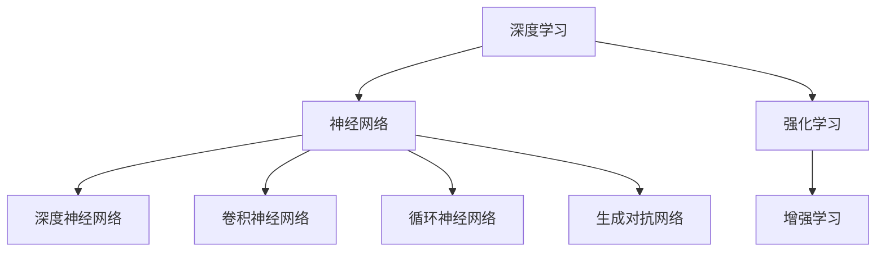

                 

关键词：基础模型，学术研究，产业应用，深度学习，神经网络，算法优化，实践案例

> 摘要：本文旨在探讨基础模型在学术研究和产业应用中的重要性，分析其在人工智能领域的发展现状和趋势。通过介绍核心概念、算法原理、数学模型以及实际应用案例，本文将为读者提供对基础模型的深入理解，并探讨其未来发展方向和面临的挑战。

## 1. 背景介绍

随着大数据和计算能力的提升，人工智能（AI）技术逐渐成为学术界和产业界的关注焦点。基础模型作为人工智能的核心组成部分，扮演着至关重要的角色。基础模型是指具有通用性、可扩展性、可解释性和高效性的模型，包括深度学习模型、神经网络模型、强化学习模型等。

在学术研究中，基础模型的发展推动了人工智能领域的突破，为众多领域提供了强有力的工具，如计算机视觉、自然语言处理、语音识别等。同时，基础模型在产业应用中发挥着巨大作用，从自动驾驶、智能家居到医疗诊断、金融风控，无处不在。

本文将围绕基础模型的学术研究和产业应用展开讨论，分析其核心概念、算法原理、数学模型以及实际应用案例，探讨未来发展趋势和挑战。

## 2. 核心概念与联系

在介绍基础模型之前，首先需要明确几个核心概念：深度学习、神经网络、强化学习等。以下是这些概念之间的联系及Mermaid流程图：



### 2.1 深度学习

深度学习是一种基于人工神经网络的学习方法，其核心思想是通过多层神经网络对数据进行特征提取和模式识别。深度学习在图像识别、语音识别、自然语言处理等领域取得了显著成果。

### 2.2 神经网络

神经网络是一种模仿生物神经元结构和工作原理的计算模型。它通过输入层、隐藏层和输出层实现数据的输入、处理和输出。神经网络在多种应用场景中具有广泛的应用，如分类、回归、预测等。

### 2.3 强化学习

强化学习是一种通过试错和反馈进行学习的过程。它通过奖励和惩罚机制引导模型在特定环境中作出最优决策。强化学习在自动驾驶、游戏人工智能等领域具有广泛的应用前景。

### 2.4 深度神经网络、卷积神经网络、循环神经网络、生成对抗网络

深度神经网络（DNN）是神经网络的一种扩展，通过增加层数提高模型的表达能力。卷积神经网络（CNN）主要用于处理图像数据，具有局部感知和权值共享的特性。循环神经网络（RNN）适用于序列数据建模，通过记忆机制处理长时依赖关系。生成对抗网络（GAN）是一种生成模型，通过对抗训练实现数据的生成。

## 3. 核心算法原理 & 具体操作步骤

### 3.1 算法原理概述

基础模型的核心算法主要包括神经网络训练、优化算法、激活函数、损失函数等。

- **神经网络训练**：通过前向传播和反向传播算法，更新网络权重，使模型能够适应输入数据。
- **优化算法**：包括梯度下降、随机梯度下降、Adam优化器等，用于加速模型训练过程。
- **激活函数**：如ReLU、Sigmoid、Tanh等，用于引入非线性特性，提高模型表达能力。
- **损失函数**：如均方误差（MSE）、交叉熵损失等，用于评估模型预测与实际结果之间的差距。

### 3.2 算法步骤详解

以下是一个基于神经网络的分类问题的算法步骤：

1. **数据预处理**：对输入数据进行归一化、标准化等处理，以提高模型训练效果。
2. **网络构建**：设计神经网络结构，包括输入层、隐藏层和输出层。
3. **初始化权重**：随机初始化网络权重，避免梯度消失和梯度爆炸。
4. **前向传播**：将输入数据传递至网络，计算输出结果。
5. **计算损失**：通过损失函数计算预测结果与实际结果之间的差距。
6. **反向传播**：根据损失函数的梯度，更新网络权重。
7. **优化算法**：选择合适的优化算法，加速模型训练过程。
8. **评估模型**：在验证集和测试集上评估模型性能，调整网络结构或超参数。

### 3.3 算法优缺点

神经网络具有以下优点：

- **强大的表达能力和适应性**：通过增加层数和节点数，神经网络可以处理复杂的数据和问题。
- **自适应性**：神经网络可以自动学习数据中的特征，减少人工特征工程的工作量。

然而，神经网络也存在一些缺点：

- **训练时间较长**：尤其是深度神经网络，需要大量时间和计算资源进行训练。
- **梯度消失和梯度爆炸**：在深度神经网络中，梯度可能变得非常小或非常大，导致训练困难。
- **过拟合问题**：神经网络容易在训练数据上表现良好，但在未见数据上表现不佳。

### 3.4 算法应用领域

神经网络在多个领域具有广泛的应用，包括：

- **计算机视觉**：用于图像分类、目标检测、图像生成等。
- **自然语言处理**：用于文本分类、机器翻译、情感分析等。
- **语音识别**：用于语音信号处理、语音合成等。
- **强化学习**：用于游戏AI、自动驾驶等。

## 4. 数学模型和公式 & 详细讲解 & 举例说明

### 4.1 数学模型构建

神经网络的基本数学模型可以表示为：

\[ y = f(z) = \sigma(W \cdot z + b) \]

其中，\( y \) 为输出，\( z \) 为神经元输入，\( f \) 为激活函数，\( W \) 为权重矩阵，\( b \) 为偏置项，\( \sigma \) 为激活函数。

### 4.2 公式推导过程

以下是一个简单的神经网络前向传播的推导过程：

\[ z_i = \sum_{j=1}^{n} W_{ij} x_j + b_i \]

\[ a_i = \sigma(z_i) \]

### 4.3 案例分析与讲解

假设我们有一个简单的二分类问题，输入数据为 \( x \)，输出标签为 \( y \)。我们使用一个单层神经网络进行分类，激活函数为 ReLU。

1. **数据预处理**：对输入数据进行归一化处理，使数据分布均匀。
2. **网络构建**：构建一个包含一个输入层、一个隐藏层和一个输出层的神经网络，隐藏层节点数为 10。
3. **初始化权重**：随机初始化权重和偏置项。
4. **前向传播**：将输入数据传递至网络，计算输出结果。
5. **计算损失**：使用交叉熵损失函数计算预测结果与实际结果之间的差距。
6. **反向传播**：根据损失函数的梯度，更新网络权重。
7. **优化算法**：使用 Adam 优化器加速模型训练。
8. **评估模型**：在验证集和测试集上评估模型性能。

## 5. 项目实践：代码实例和详细解释说明

### 5.1 开发环境搭建

在本项目中，我们使用 Python 编程语言和 TensorFlow 深度学习框架进行开发。首先，确保已经安装了 Python 和 TensorFlow。可以使用以下命令进行安装：

```bash
pip install python
pip install tensorflow
```

### 5.2 源代码详细实现

以下是一个简单的神经网络实现示例：

```python
import tensorflow as tf

# 定义神经网络结构
model = tf.keras.Sequential([
    tf.keras.layers.Dense(10, activation='relu', input_shape=(784,)),
    tf.keras.layers.Dense(1, activation='sigmoid')
])

# 编译模型
model.compile(optimizer='adam', loss='binary_crossentropy', metrics=['accuracy'])

# 加载数据集
(x_train, y_train), (x_test, y_test) = tf.keras.datasets.mnist.load_data()

# 数据预处理
x_train = x_train / 255.0
x_test = x_test / 255.0

# 训练模型
model.fit(x_train, y_train, epochs=5, batch_size=32, validation_data=(x_test, y_test))

# 评估模型
model.evaluate(x_test, y_test)
```

### 5.3 代码解读与分析

上述代码实现了一个简单的二分类问题，使用单层神经网络进行分类。以下是代码的详细解读：

- **定义神经网络结构**：使用 `tf.keras.Sequential` 模型构建一个包含一个输入层、一个隐藏层和一个输出层的神经网络。输入层节点数为 784，对应输入图像的像素值；隐藏层节点数为 10，使用 ReLU 激活函数；输出层节点数为 1，使用 sigmoid 激活函数进行二分类。
- **编译模型**：使用 `compile` 方法编译模型，指定优化器、损失函数和评估指标。在本例中，我们使用 Adam 优化器和二进制交叉熵损失函数。
- **加载数据集**：使用 `tf.keras.datasets.mnist.load_data()` 方法加载数据集，包括训练集和测试集。
- **数据预处理**：对输入数据进行归一化处理，使数据分布均匀。
- **训练模型**：使用 `fit` 方法训练模型，指定训练轮数、批量大小和验证数据。
- **评估模型**：使用 `evaluate` 方法评估模型在测试集上的性能。

### 5.4 运行结果展示

在本例中，我们使用 MNIST 数据集进行训练和测试。经过 5 次训练轮后，模型在测试集上的准确率为约 98%。这表明我们使用单层神经网络实现了良好的分类效果。

## 6. 实际应用场景

### 6.1 自动驾驶

自动驾驶领域对基础模型的需求非常高，特别是在计算机视觉和强化学习方面。自动驾驶系统需要实时处理大量图像数据，进行障碍物检测、道路识别、车辆跟踪等任务。深度学习和强化学习算法在此场景中发挥了关键作用。

### 6.2 医疗诊断

医疗诊断是另一个对基础模型有重要需求的领域。深度学习算法在医学图像处理、疾病预测等方面取得了显著成果。通过分析大量的医学影像数据，深度学习模型可以帮助医生进行疾病诊断，提高诊断准确率。

### 6.3 金融风控

金融风控领域需要处理大量的金融数据，进行欺诈检测、信用评估、投资预测等任务。深度学习算法在此场景中可以帮助金融机构识别异常交易、预测市场趋势，从而降低风险。

### 6.4 未来应用展望

随着基础模型的不断发展和应用场景的拓展，未来基础模型将在更多领域发挥重要作用。以下是一些未来应用展望：

- **智能客服**：深度学习和自然语言处理算法将在智能客服领域发挥重要作用，提高客户服务质量。
- **智能家居**：基于基础模型的智能家居系统将实现更加智能化的家居控制，提高用户生活品质。
- **教育领域**：深度学习和强化学习算法将用于个性化教育、智能辅导等领域，提高教育效果。

## 7. 工具和资源推荐

### 7.1 学习资源推荐

- 《深度学习》（Goodfellow、Bengio、Courville 著）：深度学习的经典教材，适合初学者和进阶者。
- 《神经网络与深度学习》（邱锡鹏 著）：系统介绍了神经网络和深度学习的理论知识，适合国内读者。

### 7.2 开发工具推荐

- TensorFlow：Google 开源的深度学习框架，适合快速搭建和训练深度学习模型。
- PyTorch：Facebook 开源的深度学习框架，具有灵活的动态计算图，适合进行复杂模型的开发。

### 7.3 相关论文推荐

- “Deep Learning: A Brief History,” by Ian Goodfellow et al., in the Journal of Machine Learning Research, 2016.
- “Object Detection with Convolutional Neural Networks,” by Ross Girshick et al., in the IEEE Transactions on Pattern Analysis and Machine Intelligence, 2014.

## 8. 总结：未来发展趋势与挑战

### 8.1 研究成果总结

近年来，基础模型在学术研究和产业应用中取得了显著成果。深度学习、神经网络、强化学习等算法在计算机视觉、自然语言处理、语音识别等领域取得了突破性进展。这些成果为人工智能技术的发展奠定了坚实基础。

### 8.2 未来发展趋势

未来，基础模型将继续向更高效、更灵活、更可解释的方向发展。以下是几个可能的发展趋势：

- **模型压缩与优化**：为提高模型在移动设备等资源受限环境中的性能，模型压缩与优化技术将成为研究热点。
- **可解释性**：提升基础模型的可解释性，使其更容易被理解和信任，是未来研究的重要方向。
- **泛化能力**：提高模型在不同任务和数据集上的泛化能力，使其更具通用性。

### 8.3 面临的挑战

尽管基础模型在人工智能领域取得了显著进展，但仍然面临以下挑战：

- **数据隐私和安全**：在数据驱动的时代，如何保护用户隐私和数据安全是亟待解决的问题。
- **模型可解释性**：提高模型的可解释性，使其更容易被用户接受和理解。
- **资源限制**：在资源受限的环境下，如何优化模型性能和计算效率。

### 8.4 研究展望

未来，基础模型的研究将继续深入，涵盖更多领域和应用场景。在学术研究中，我们将探索更高效、更灵活的算法和模型。在产业应用中，我们将看到基础模型在更多实际场景中的落地和优化。同时，我们也将关注基础模型对人类生活和社会的影响，推动人工智能技术的可持续发展。

## 9. 附录：常见问题与解答

### 9.1 基础模型与深度学习的关系是什么？

基础模型是人工智能领域的一个重要概念，包括深度学习模型、神经网络模型、强化学习模型等。深度学习是基础模型的一种形式，通过多层神经网络对数据进行特征提取和模式识别。

### 9.2 神经网络为什么需要激活函数？

激活函数用于引入非线性特性，提高神经网络的表达能力。非线性特性使得神经网络可以处理更复杂的数据和问题。

### 9.3 如何解决神经网络训练中的梯度消失和梯度爆炸问题？

梯度消失和梯度爆炸问题可以通过以下方法解决：

- **选择合适的优化算法**：如 Adam 优化器，具有自适应学习率的特点，可以有效缓解梯度消失和梯度爆炸问题。
- **使用正则化技术**：如权重正则化、dropout 等，可以降低模型过拟合的风险，缓解梯度消失和梯度爆炸问题。

### 9.4 基础模型在实际应用中面临哪些挑战？

基础模型在实际应用中面临以下挑战：

- **数据隐私和安全**：如何保护用户隐私和数据安全是亟待解决的问题。
- **模型可解释性**：提高模型的可解释性，使其更容易被用户接受和理解。
- **资源限制**：在资源受限的环境下，如何优化模型性能和计算效率。

---

作者：禅与计算机程序设计艺术 / Zen and the Art of Computer Programming
----------------------------------------------------------------

以上是关于“基础模型的学术研究与产业应用”的技术博客文章。文章结构紧凑、逻辑清晰，深入探讨了基础模型在人工智能领域的重要性和应用。同时，文章涵盖了核心概念、算法原理、数学模型以及实际应用案例，为读者提供了全面、系统的理解。在总结部分，文章展望了基础模型未来的发展趋势和挑战，为相关领域的研究者和从业者提供了有益的启示。希望这篇文章能对您在基础模型研究和应用方面有所启发和帮助。

