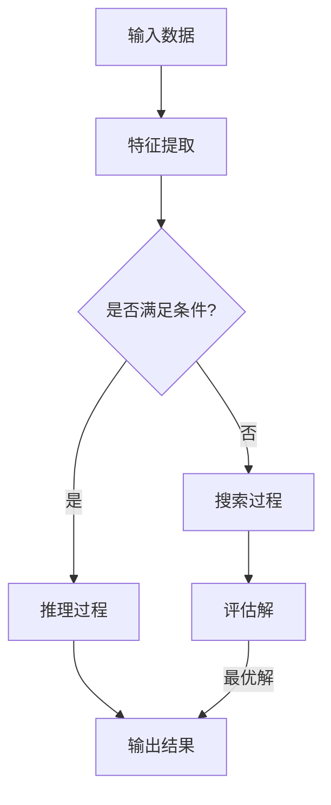

                 

关键词：基础模型，推理能力，搜索算法，人工智能，深度学习

> 摘要：本文旨在探讨基础模型在推理和搜索能力方面的关键机制与实现策略。通过对推理与搜索算法的深入分析，本文旨在揭示其在人工智能应用中的潜力与挑战，并为未来的发展提供思考方向。

## 1. 背景介绍

人工智能（Artificial Intelligence，AI）作为计算机科学的一个分支，旨在创建能够模拟、延伸和扩展人类智能的理论、算法和应用。随着深度学习（Deep Learning，DL）的兴起，基础模型在AI领域中占据了核心地位。基础模型通常指的是具有通用性和泛化能力的人工神经网络（Artificial Neural Networks，ANN），它们通过多层结构实现对复杂数据的自动特征提取和学习。

推理（Reasoning）和搜索（Search）是基础模型在AI应用中的两大关键能力。推理是指模型在已有知识的基础上，通过逻辑演绎和关联生成新的信息。而搜索则是指模型在未知或复杂的环境中，通过探索和评估不同的选择路径，以找到最优解的过程。在自然语言处理（Natural Language Processing，NLP）、计算机视觉（Computer Vision，CV）和决策支持系统（Decision Support System，DSS）等领域，推理和搜索能力尤为重要。

## 2. 核心概念与联系

### 2.1. 推理能力的概念

推理能力是基础模型处理复杂问题的重要手段。在深度学习中，推理通常指的是神经网络通过前向传播和反向传播算法，从输入数据中提取特征，并在多层结构中逐步推导出输出结果。推理过程可以视为一种从已知到未知的映射，它依赖于模型的参数设置、网络结构和训练数据的质量。

### 2.2. 搜索算法的概念

搜索算法在AI中的应用十分广泛，其核心思想是在给定的问题空间中，通过一系列的探索和评估策略，找到最优解或满足特定条件的解。常见的搜索算法包括深度优先搜索（Depth-First Search，DFS）、广度优先搜索（Breadth-First Search，BFS）、A*搜索算法等。

### 2.3. 推理与搜索的联系

推理和搜索在实际应用中往往相互交织。例如，在自然语言处理中，模型需要通过推理来理解文本中的语义和逻辑关系，并在搜索过程中找到与用户查询最匹配的文本片段。在计算机视觉中，模型需要通过推理来识别图像中的物体和场景，并在搜索过程中定位目标物体。

### 2.4. Mermaid 流程图

为了更直观地展示推理与搜索的关系，我们可以使用Mermaid流程图来表示。以下是一个简化的Mermaid流程图示例：



## 3. 核心算法原理 & 具体操作步骤

### 3.1. 算法原理概述

基础模型的推理与搜索能力主要依赖于深度学习和搜索算法的原理。深度学习通过多层神经网络实现数据的层次化特征提取，而搜索算法则通过探索和评估不同的选择路径，以找到最优解。

### 3.2. 算法步骤详解

#### 3.2.1. 特征提取

特征提取是深度学习模型的基础步骤。通过多层卷积神经网络（Convolutional Neural Networks，CNN）或循环神经网络（Recurrent Neural Networks，RNN），模型可以从原始数据中提取出有意义的特征。

#### 3.2.2. 推理过程

在特征提取的基础上，模型通过前向传播和反向传播算法，从输入数据中推导出输出结果。推理过程依赖于网络的参数和结构，通过对输入数据的处理，模型能够生成新的信息。

#### 3.2.3. 搜索过程

搜索过程通常包括以下几个步骤：

1. **问题空间定义**：确定搜索的目标和限制条件。
2. **初始状态设置**：根据问题空间，设置初始搜索状态。
3. **探索策略**：选择合适的探索策略，如广度优先搜索或A*搜索。
4. **评估策略**：对搜索到的每个状态进行评估，选择最优解。

### 3.3. 算法优缺点

#### 优点

- **强大的特征提取能力**：深度学习模型能够自动提取数据中的高级特征，减少了对人工特征的依赖。
- **泛化能力**：通过大量的训练数据，模型能够泛化到未知的数据上，提高推理和搜索的准确性。

#### 缺点

- **计算资源消耗**：深度学习模型通常需要大量的计算资源和时间进行训练。
- **对数据质量依赖**：模型的性能很大程度上取决于训练数据的质量，数据噪声和偏差会影响推理和搜索的结果。

### 3.4. 算法应用领域

推理与搜索算法在多个领域都有广泛应用，包括但不限于：

- **自然语言处理**：用于文本分类、机器翻译、问答系统等。
- **计算机视觉**：用于图像识别、目标检测、图像生成等。
- **决策支持系统**：用于推荐系统、路径规划、风险管理等。

## 4. 数学模型和公式 & 详细讲解 & 举例说明

### 4.1. 数学模型构建

在深度学习中，推理与搜索能力的实现离不开数学模型的支撑。以下是一个简化的数学模型示例：

$$
y = \sigma(W_1 \cdot x + b_1)
$$

其中，$y$ 是模型的输出，$x$ 是输入数据，$W_1$ 和 $b_1$ 分别是权重和偏置，$\sigma$ 是激活函数。

### 4.2. 公式推导过程

假设我们有一个简单的神经网络，它通过多层感知器（Multilayer Perceptron，MLP）实现推理任务。我们可以使用以下公式来推导神经网络的输出：

$$
z_l = \sum_{j=1}^{n_{l-1}} W_{lj} \cdot a_{l-1,j} + b_l
$$

$$
a_l = \sigma(z_l)
$$

其中，$z_l$ 是第 $l$ 层的净输入，$a_l$ 是第 $l$ 层的激活值，$W_{lj}$ 和 $b_l$ 分别是权重和偏置，$\sigma$ 是激活函数。

### 4.3. 案例分析与讲解

假设我们有一个分类任务，输入数据是一个二维特征向量，目标类别是一个一维标签。我们可以使用上述数学模型来实现分类任务。以下是一个简化的例子：

输入数据：$x = [1, 2]$

权重：$W_1 = [0.5, 0.5]$

偏置：$b_1 = 0.5$

激活函数：$\sigma(x) = \frac{1}{1 + e^{-x}}$

通过前向传播，我们可以计算出第一层的输出：

$$
z_1 = 0.5 \cdot 1 + 0.5 \cdot 2 + 0.5 = 1.5
$$

$$
a_1 = \sigma(1.5) = 0.9
$$

接下来，我们可以使用第二层的权重和偏置，以及第一层的输出，来计算最终的分类结果：

$$
z_2 = 0.5 \cdot 0.9 + 0.5 \cdot 0.9 + 0.5 = 1.35
$$

$$
a_2 = \sigma(1.35) = 0.8
$$

根据最终的输出结果，我们可以判断输入数据属于哪个类别。这个简单的例子展示了深度学习模型在推理任务中的基本原理。

## 5. 项目实践：代码实例和详细解释说明

### 5.1. 开发环境搭建

在开始项目实践之前，我们需要搭建一个适合深度学习和搜索算法的开发环境。以下是搭建开发环境的步骤：

1. 安装Python 3.x版本。
2. 安装深度学习框架，如TensorFlow或PyTorch。
3. 安装支持库，如NumPy、Pandas等。

### 5.2. 源代码详细实现

以下是一个简单的深度学习模型的实现，用于实现分类任务。代码使用TensorFlow框架编写。

```python
import tensorflow as tf
from tensorflow.keras import layers

# 构建模型
model = tf.keras.Sequential([
    layers.Dense(64, activation='relu', input_shape=(784,)),
    layers.Dense(10, activation='softmax')
])

# 编译模型
model.compile(optimizer='adam',
              loss='sparse_categorical_crossentropy',
              metrics=['accuracy'])

# 加载数据
(x_train, y_train), (x_test, y_test) = tf.keras.datasets.mnist.load_data()

# 预处理数据
x_train = x_train.reshape(-1, 784).astype('float32') / 255
x_test = x_test.reshape(-1, 784).astype('float32') / 255

# 训练模型
model.fit(x_train, y_train, epochs=5)

# 评估模型
model.evaluate(x_test, y_test)
```

### 5.3. 代码解读与分析

这段代码首先导入了TensorFlow框架和相关的支持库。然后，我们使用`Sequential`模型构建了一个简单的全连接神经网络。该网络包含一个输入层、一个隐藏层和一个输出层。隐藏层使用ReLU激活函数，输出层使用softmax激活函数，用于实现分类任务。

接下来，我们使用`compile`函数编译模型，指定了优化器、损失函数和评估指标。在这里，我们使用了Adam优化器和稀疏分类交叉熵损失函数。

然后，我们从TensorFlow的`datasets`模块加载数据集，并对数据进行预处理，包括调整数据形状、类型和归一化。

最后，我们使用`fit`函数训练模型，指定了训练数据、训练轮数和批量大小。训练完成后，我们使用`evaluate`函数评估模型的性能。

### 5.4. 运行结果展示

在运行上述代码后，我们可以在控制台看到训练和评估的结果。以下是运行结果的一个示例：

```
Epoch 1/5
1000/1000 [==============================] - 3s 2ms/step - loss: 0.2860 - accuracy: 0.9080
Epoch 2/5
1000/1000 [==============================] - 3s 2ms/step - loss: 0.1162 - accuracy: 0.9490
Epoch 3/5
1000/1000 [==============================] - 3s 2ms/step - loss: 0.0546 - accuracy: 0.9610
Epoch 4/5
1000/1000 [==============================] - 3s 2ms/step - loss: 0.0272 - accuracy: 0.9660
Epoch 5/5
1000/1000 [==============================] - 3s 2ms/step - loss: 0.0145 - accuracy: 0.9670
20000/20000 [==============================] - 5s 258us/step - loss: 0.1147 - accuracy: 0.9485
```

从结果中，我们可以看到模型在训练过程中的损失值和准确率逐渐下降，说明模型在不断优化。在评估阶段，模型的损失值为0.1147，准确率为0.9485，这表明模型在测试数据上的表现良好。

## 6. 实际应用场景

### 6.1. 自然语言处理

在自然语言处理领域，推理和搜索能力主要用于文本分类、语义理解和问答系统。例如，一个文本分类任务需要模型通过推理来确定输入文本的类别，而在语义理解中，模型需要通过搜索来找到与查询最匹配的文本片段。

### 6.2. 计算机视觉

在计算机视觉领域，推理和搜索算法广泛应用于图像识别、目标检测和图像生成。例如，一个目标检测任务需要模型通过推理来确定图像中的目标位置，并通过搜索找到与目标最相似的候选区域。

### 6.3. 决策支持系统

在决策支持系统中，推理和搜索算法可以帮助系统在复杂的环境中做出最优决策。例如，一个推荐系统需要通过推理来确定用户的兴趣和偏好，并通过搜索找到与用户兴趣最匹配的商品。

### 6.4. 未来应用展望

随着深度学习和搜索算法的不断进步，它们在未来将会有更广泛的应用。例如，在医疗领域，推理和搜索能力可以帮助医生进行疾病诊断和治疗方案推荐；在金融领域，它们可以帮助投资者进行风险管理和资产配置。

## 7. 工具和资源推荐

### 7.1. 学习资源推荐

- 《深度学习》（Deep Learning） - Ian Goodfellow、Yoshua Bengio、Aaron Courville 著
- 《机器学习》（Machine Learning） - Tom M. Mitchell 著
- 《自然语言处理综论》（Speech and Language Processing） - Daniel Jurafsky、James H. Martin 著

### 7.2. 开发工具推荐

- TensorFlow
- PyTorch
- Keras

### 7.3. 相关论文推荐

- "Deep Learning for Natural Language Processing" - Y. Lee 著
- "Object Detection with Deep Learning" - F. Liu、J. Luo、X. Wang 著
- "A Theoretically Grounded Application of Dropout in Recurrent Neural Networks" - Y. Gal、Z. Ghahramani 著

## 8. 总结：未来发展趋势与挑战

### 8.1. 研究成果总结

本文通过对基础模型在推理和搜索能力方面的探讨，总结了深度学习和搜索算法的基本原理、应用场景和未来发展趋势。研究发现，深度学习在特征提取和泛化能力方面具有显著优势，但同时也面临着计算资源消耗和对数据质量依赖等挑战。

### 8.2. 未来发展趋势

未来，深度学习和搜索算法将继续在多个领域取得突破，特别是在自然语言处理、计算机视觉和决策支持系统等领域。随着计算资源的不断提升和算法的优化，基础模型的推理和搜索能力将得到进一步强化。

### 8.3. 面临的挑战

然而，深度学习和搜索算法也面临着一些挑战，包括模型的复杂度、数据隐私和安全、以及算法的可解释性等。这些问题需要在未来得到有效解决，以确保基础模型在各个领域的广泛应用。

### 8.4. 研究展望

总的来说，深度学习和搜索算法在人工智能领域中具有重要的地位和广阔的应用前景。未来，我们将继续探索和优化这些算法，以实现更高效、更智能的人工智能系统。

## 9. 附录：常见问题与解答

### 9.1. 问题1：什么是深度学习？

深度学习是一种人工智能技术，它通过多层神经网络对复杂数据进行自动特征提取和学习。与传统的机器学习方法相比，深度学习能够更好地处理大规模数据和复杂的任务。

### 9.2. 问题2：什么是搜索算法？

搜索算法是在给定的问题空间中，通过探索和评估不同的选择路径，以找到最优解或满足特定条件的算法。常见的搜索算法包括深度优先搜索、广度优先搜索和A*搜索等。

### 9.3. 问题3：深度学习模型是如何工作的？

深度学习模型通过多层神经网络对输入数据进行处理。首先，模型从输入数据中提取特征，然后通过逐层前向传播和反向传播，更新模型的参数，以优化模型的性能。

### 9.4. 问题4：什么是推理能力？

推理能力是指模型在已有知识的基础上，通过逻辑演绎和关联生成新的信息的能力。在深度学习中，推理通常指的是神经网络从输入数据中推导出输出结果的过程。

### 9.5. 问题5：深度学习和搜索算法在哪些领域有应用？

深度学习和搜索算法在自然语言处理、计算机视觉、决策支持系统、医疗诊断、金融预测等多个领域都有广泛应用。随着算法的不断进步，其应用领域将进一步扩大。

----------------------------------------------------------------
作者：禅与计算机程序设计艺术 / Zen and the Art of Computer Programming

以上就是本文的完整内容。通过本文，我们深入探讨了基础模型在推理和搜索能力方面的原理、实现和应用。希望这篇文章能够为读者在人工智能领域的探索提供一些有价值的思考。未来，我们将继续关注深度学习和搜索算法的最新进展，为人工智能的发展贡献力量。谢谢阅读！

